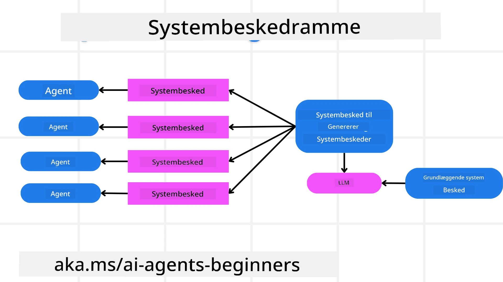
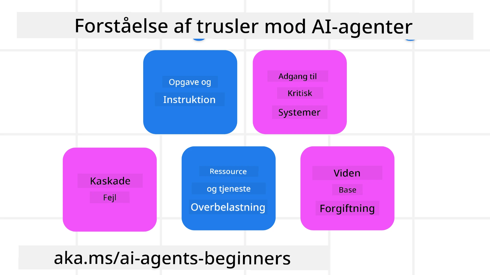
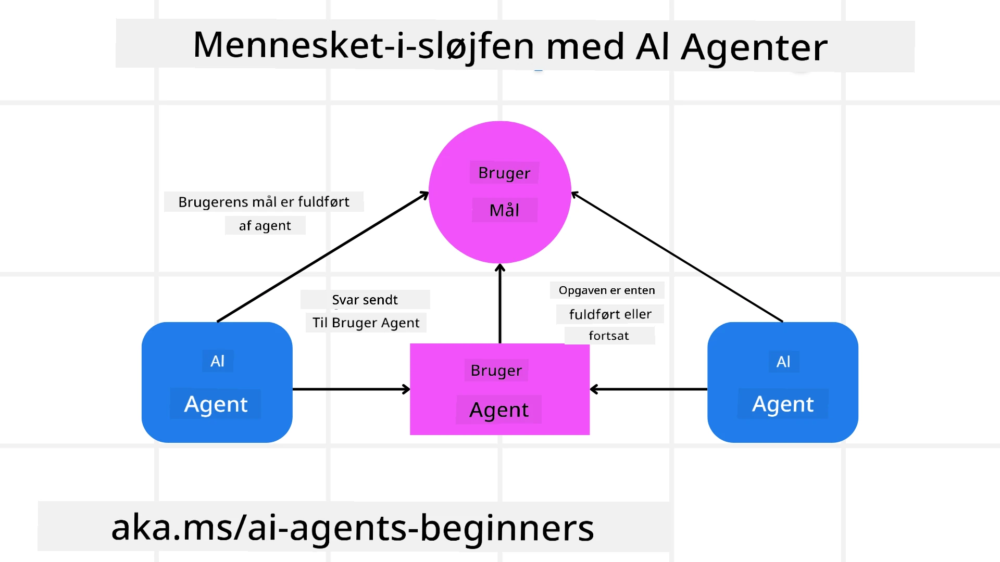

[](https://youtu.be/iZKkMEGBCUQ?si=Q-kEbcyHUMPoHp8L)

> _(Klik på billedet ovenfor for at se videoen til denne lektion)_

# Opbygning af troværdige AI-agenter

## Introduktion

Denne lektion vil dække:

- Hvordan man bygger og implementerer sikre og effektive AI-agenter
- Vigtige sikkerhedshensyn ved udvikling af AI-agenter.
- Hvordan man opretholder data- og brugernes privatliv ved udvikling af AI-agenter.

## Læringsmål

Efter at have gennemført denne lektion vil du vide, hvordan du:

- Identificerer og afbøder risici ved oprettelse af AI-agenter.
- Implementerer sikkerhedsforanstaltninger for at sikre, at data og adgang håndteres korrekt.
- Opretter AI-agenter, der opretholder dataprivatliv og leverer en kvalitetsbrugeroplevelse.

## Sikkerhed

Lad os først se på opbygning af sikre agentbaserede applikationer. Sikkerhed betyder, at AI-agenten fungerer som designet. Som udviklere af agentbaserede applikationer har vi metoder og værktøjer til at maksimere sikkerheden:

### Opbygning af en systembesked-ramme

Hvis du nogensinde har bygget en AI-applikation ved hjælp af Large Language Models (LLMs), ved du, hvor vigtigt det er at designe en robust systemprompt eller systembesked. Disse prompts fastlægger metaregler, instruktioner og retningslinjer for, hvordan LLM’en skal interagere med brugeren og data.

For AI-agenter er systemprompten endnu vigtigere, da AI-agenter skal have meget specifikke instruktioner for at kunne udføre de opgaver, vi har designet til dem.

For at skabe skalerbare systemprompts kan vi bruge en systembesked-ramme til at bygge en eller flere agenter i vores applikation:



#### Trin 1: Opret en meta systembesked

Meta-prompten vil blive brugt af en LLM til at generere systemprompter for de agenter, vi opretter. Vi designer den som en skabelon, så vi effektivt kan skabe flere agenter, hvis det er nødvendigt.

Her er et eksempel på en meta systembesked, vi ville give til LLM'en:

```plaintext
You are an expert at creating AI agent assistants. 
You will be provided a company name, role, responsibilities and other
information that you will use to provide a system prompt for.
To create the system prompt, be descriptive as possible and provide a structure that a system using an LLM can better understand the role and responsibilities of the AI assistant. 
```

#### Trin 2: Opret en grundlæggende prompt

Næste trin er at oprette en grundlæggende prompt til at beskrive AI-agenten. Du bør inkludere agentens rolle, de opgaver, agenten vil udføre, og eventuelle andre ansvarsområder for agenten.

Her er et eksempel:

```plaintext
You are a travel agent for Contoso Travel that is great at booking flights for customers. To help customers you can perform the following tasks: lookup available flights, book flights, ask for preferences in seating and times for flights, cancel any previously booked flights and alert customers on any delays or cancellations of flights.  
```

#### Trin 3: Giv grundlæggende systembesked til LLM

Nu kan vi optimere denne systembesked ved at give meta systembeskeden som systembesked sammen med vores grundlæggende systembesked.

Dette vil producere en systembesked, der er bedre designet til at guide vores AI-agenter:

```markdown
**Company Name:** Contoso Travel  
**Role:** Travel Agent Assistant

**Objective:**  
You are an AI-powered travel agent assistant for Contoso Travel, specializing in booking flights and providing exceptional customer service. Your main goal is to assist customers in finding, booking, and managing their flights, all while ensuring that their preferences and needs are met efficiently.

**Key Responsibilities:**

1. **Flight Lookup:**
    
    - Assist customers in searching for available flights based on their specified destination, dates, and any other relevant preferences.
    - Provide a list of options, including flight times, airlines, layovers, and pricing.
2. **Flight Booking:**
    
    - Facilitate the booking of flights for customers, ensuring that all details are correctly entered into the system.
    - Confirm bookings and provide customers with their itinerary, including confirmation numbers and any other pertinent information.
3. **Customer Preference Inquiry:**
    
    - Actively ask customers for their preferences regarding seating (e.g., aisle, window, extra legroom) and preferred times for flights (e.g., morning, afternoon, evening).
    - Record these preferences for future reference and tailor suggestions accordingly.
4. **Flight Cancellation:**
    
    - Assist customers in canceling previously booked flights if needed, following company policies and procedures.
    - Notify customers of any necessary refunds or additional steps that may be required for cancellations.
5. **Flight Monitoring:**
    
    - Monitor the status of booked flights and alert customers in real-time about any delays, cancellations, or changes to their flight schedule.
    - Provide updates through preferred communication channels (e.g., email, SMS) as needed.

**Tone and Style:**

- Maintain a friendly, professional, and approachable demeanor in all interactions with customers.
- Ensure that all communication is clear, informative, and tailored to the customer's specific needs and inquiries.

**User Interaction Instructions:**

- Respond to customer queries promptly and accurately.
- Use a conversational style while ensuring professionalism.
- Prioritize customer satisfaction by being attentive, empathetic, and proactive in all assistance provided.

**Additional Notes:**

- Stay updated on any changes to airline policies, travel restrictions, and other relevant information that could impact flight bookings and customer experience.
- Use clear and concise language to explain options and processes, avoiding jargon where possible for better customer understanding.

This AI assistant is designed to streamline the flight booking process for customers of Contoso Travel, ensuring that all their travel needs are met efficiently and effectively.

```

#### Trin 4: Iterer og forbedr

Værdien af denne systembesked-ramme er, at du kan skalere oprettelsen af systembeskeder fra flere agenter lettere samt forbedre dine systembeskeder over tid. Det er sjældent, at du har en systembesked, der fungerer perfekt første gang for hele din brugssag. At kunne foretage små justeringer og forbedringer ved at ændre den grundlæggende systembesked og køre den gennem systemet giver dig mulighed for at sammenligne og evaluere resultater.

## Forståelse af trusler

For at bygge troværdige AI-agenter er det vigtigt at forstå og afbøde risiciene og truslerne mod din AI-agent. Lad os se på nogle få af de forskellige trusler mod AI-agenter, og hvordan du bedre kan planlægge og forberede dig på dem.



### Opgave og instruktion

**Beskrivelse:** Angribere forsøger at ændre instruktionerne eller målene for AI-agenten via prompting eller manipulation af input.

**Afbødning**: Udfør valideringstjek og inputfiltre for at opdage potentielt farlige prompts, før de behandles af AI-agenten. Da disse angreb typisk kræver hyppig interaktion med agenten, er det en anden måde at forhindre denne type angreb på at begrænse antallet af samtaleture.

### Adgang til kritiske systemer

**Beskrivelse**: Hvis en AI-agent har adgang til systemer og tjenester, der gemmer følsomme data, kan angribere kompromittere kommunikationen mellem agenten og disse tjenester. Dette kan være direkte angreb eller indirekte forsøg på at opnå information om disse systemer gennem agenten.

**Afbødning**: AI-agenter bør have adgang til systemer efter behov for at forhindre denne type angreb. Kommunikation mellem agenten og systemet bør også være sikker. Implementering af autentificering og adgangskontrol er en anden måde at beskytte denne information på.

### Ressource- og tjenestebelastning

**Beskrivelse:** AI-agenter kan tilgå forskellige værktøjer og tjenester for at udføre opgaver. Angribere kan misbruge denne evne til at angribe disse tjenester ved at sende et stort antal anmodninger gennem AI-agenten, hvilket kan resultere i systemfejl eller høje omkostninger.

**Afbødning:** Implementer politikker for at begrænse antallet af anmodninger, en AI-agent kan sende til en tjeneste. At begrænse antallet af samtaleture og anmodninger til din AI-agent er en anden måde at forhindre denne type angreb på.

### Forgiftning af vidensbase

**Beskrivelse:** Denne type angreb går ikke direkte efter AI-agenten, men mod vidensbasen og andre tjenester, som AI-agenten vil bruge. Dette kan involvere korrumpering af data eller information, som AI-agenten bruger til at udføre en opgave, hvilket fører til biased eller utilsigtede svar til brugeren.

**Afbødning:** Udfør regelmæssige verifikationer af data, som AI-agenten bruger i sine arbejdsprocesser. Sikr, at adgangen til disse data er sikker og kun ændres af betroede personer for at undgå denne type angreb.

### Kaskaderende fejl

**Beskrivelse:** AI-agenter tilgår forskellige værktøjer og tjenester for at udføre opgaver. Fejl forårsaget af angribere kan føre til svigt i andre systemer, som AI-agenten er tilsluttet, hvilket får angrebet til at sprede sig bredere og gøre det sværere at fejlfinde.

**Afbødning**: En metode for at undgå dette er at lade AI-agenten operere i et begrænset miljø, såsom at udføre opgaver i en Docker-container, for at forhindre direkte systemangreb. At oprette fallback-mekanismer og retry-logik, når visse systemer svarer med en fejl, er en anden måde at forhindre større systemfejl på.

## Menneske-i-loop

En anden effektiv måde at opbygge troværdige AI-agent systemer på er ved at bruge en menneske-i-loop. Dette skaber en proces, hvor brugerne kan give feedback til agenterne under kørslen. Brugerne fungerer grundlæggende som agenter i et multi-agent system ved at give godkendelse eller afslutning af den kørende proces.



Her er et kodeeksempel, der bruger Microsoft Agent Framework til at vise, hvordan dette koncept implementeres:

```python
import os
from agent_framework.foundry import FoundryChatClient
from azure.identity import AzureCliCredential

# Opret udbyderen med menneskelig godkendelse
provider = FoundryChatClient(
    project_endpoint=os.environ["AZURE_AI_PROJECT_ENDPOINT"],
    model=os.environ["AZURE_AI_MODEL_DEPLOYMENT_NAME"],
    credential=AzureCliCredential(),
)

# Opret agenten med et trin for menneskelig godkendelse
response = provider.create_response(
    input="Write a 4-line poem about the ocean.",
    instructions="You are a helpful assistant. Ask for user approval before finalizing.",
)

# Brugeren kan gennemgå og godkende svaret
print(response.output_text)
user_input = input("Do you approve? (APPROVE/REJECT): ")
if user_input == "APPROVE":
    print("Response approved.")
else:
    print("Response rejected. Revising...")
```

## Konklusion

At bygge troværdige AI-agenter kræver omhyggeligt design, robuste sikkerhedsforanstaltninger og kontinuerlig iteration. Ved at implementere strukturerede meta-prompt-systemer, forstå potentielle trusler og anvende afbødningsstrategier kan udviklere skabe AI-agenter, der både er sikre og effektive. Derudover sikrer inddragelse af en menneske-i-loop tilgang, at AI-agenter forbliver i overensstemmelse med brugernes behov, samtidig med at risici minimeres. Efterhånden som AI fortsætter med at udvikle sig, vil en proaktiv holdning til sikkerhed, privatliv og etiske overvejelser være nøglen til at fremme tillid og pålidelighed i AI-drevne systemer.

## Kodeeksempler

- [`code_samples/06-system-message-framework.ipynb`](code_samples/06-system-message-framework.ipynb): Trin-for-trin demonstration af meta-prompt systembesked-rammen.
- [`code_samples/06-human-in-the-loop.ipynb`](code_samples/06-human-in-the-loop.ipynb): Forhåndsgodkendelsesporte, risikoklassificering og revisionslog for troværdige agenter.

### Har du flere spørgsmål om opbygning af troværdige AI-agenter?

Deltag i [Microsoft Foundry Discord](https://discord.com/invite/ATgtXmAS5D) for at møde andre lærende, deltage i kontortimer og få dine spørgsmål om AI-agenter besvaret.

## Yderligere ressourcer

- <a href="https://learn.microsoft.com/azure/ai-studio/responsible-use-of-ai-overview" target="_blank">Oversigt over ansvarlig AI</a>
- <a href="https://learn.microsoft.com/azure/ai-studio/concepts/evaluation-approach-gen-ai" target="_blank">Evaluering af generative AI-modeller og AI-applikationer</a>
- <a href="https://learn.microsoft.com/azure/ai-services/openai/concepts/system-message?context=%2Fazure%2Fai-studio%2Fcontext%2Fcontext&tabs=top-techniques" target="_blank">Sikkerhedssystembeskeder</a>
- <a href="https://blogs.microsoft.com/wp-content/uploads/prod/sites/5/2022/06/Microsoft-RAI-Impact-Assessment-Template.pdf?culture=en-us&country=us" target="_blank">Skabelon til risikovurdering</a>

## Forrige lektion

[Agentic RAG](../05-agentic-rag/README.md)

## Næste lektion

[Planlægningsdesignmønster](../07-planning-design/README.md)

---

<!-- CO-OP TRANSLATOR DISCLAIMER START -->
**Ansvarsfraskrivelse**:
Dette dokument er blevet oversat ved hjælp af AI-oversættelsestjenesten [Co-op Translator](https://github.com/Azure/co-op-translator). Selvom vi bestræber os på nøjagtighed, skal du være opmærksom på, at automatiserede oversættelser kan indeholde fejl eller unøjagtigheder. Det originale dokument på dets oprindelige sprog bør betragtes som den autoritative kilde. For kritisk information anbefales professionel menneskelig oversættelse. Vi påtager os intet ansvar for misforståelser eller fejltolkninger, der opstår som følge af brugen af denne oversættelse.
<!-- CO-OP TRANSLATOR DISCLAIMER END -->