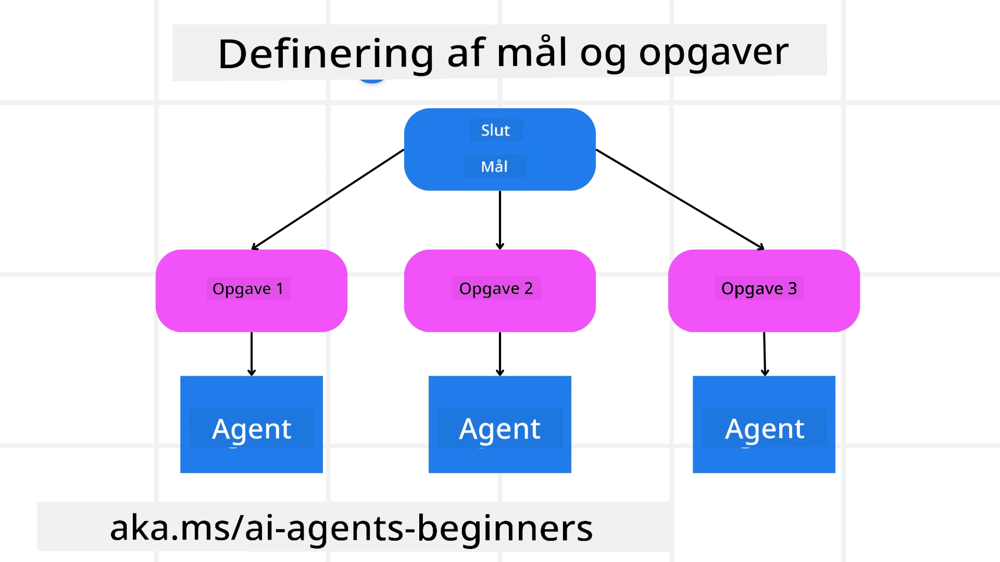

[](https://youtu.be/kPfJ2BrBCMY?si=9pYpPXp0sSbK91Dr)

> _(Klik på billedet ovenfor for at se videoen af denne lektion)_

# Planlægningsdesign

## Introduktion

Denne lektion vil dække

* Definere et klart overordnet mål og nedbryde en kompleks opgave i håndterbare delopgaver.
* Udnytte struktureret output for mere pålidelige og maskinlæsbare svar.
* Anvende en begivenhedsdrevet tilgang til håndtering af dynamiske opgaver og uventede input.

## Læringsmål

Efter at have gennemført denne lektion vil du have forståelse for:

* Identificere og sætte et overordnet mål for en AI-agent, så den tydeligt ved, hvad der skal opnås.
* Nedbryde en kompleks opgave til håndterbare delopgaver og organisere dem i en logisk rækkefølge.
* Udstyre agenter med de rette værktøjer (f.eks. søgeværktøjer eller dataanalyseværktøjer), beslutte hvornår og hvordan de skal bruges, og håndtere uventede situationer, der opstår.
* Evaluere resultater af delopgaver, måle ydeevne og gentage handlinger for at forbedre det endelige output.

## Definere det overordnede mål og nedbryde en opgave



De fleste virkelige opgaver er for komplekse til at tackle i et enkelt trin. En AI-agent har brug for et præcist mål for at kunne styre sin planlægning og handlinger. For eksempel, betragt målet:

    "Generer en 3-dages rejseplan."

Selvom det er enkelt at angive, kræver det stadig præcisering. Jo klarere målet er, desto bedre kan agenten (og eventuelle menneskelige samarbejdspartnere) fokusere på at opnå det rette resultat, såsom at skabe en omfattende rejseplan med flymuligheder, hotelanbefalinger og aktivitetsforslag.

### Opgavenedbrydning

Store eller indviklede opgaver bliver mere håndterbare, når de opdeles i mindre, målrettede delopgaver.
For rejseplans-eksemplet kan du nedbryde målet i:

* Flybestilling
* Hotelbestilling
* Biludlejning
* Personlig tilpasning

Hver delopgave kan derefter tages hånd om af dedikerede agenter eller processer. Én agent kan specialisere sig i at finde de bedste flytilbud, en anden fokuserer på hotelbestillinger osv. En koordinerende eller ”downstream” agent kan så samle disse resultater til én sammenhængende rejseplan til slutbrugeren.

Denne modulære tilgang muliggør også trinvise forbedringer. For eksempel kan du tilføje specialiserede agenter til Madanbefalinger eller Lokale Aktivitetsforslag og forbedre rejseplanen over tid.

### Struktureret output

Store sprogmodeller (LLM'er) kan generere struktureret output (f.eks. JSON), som er nemmere for downstream-agenter eller tjenester at fortolke og behandle. Dette er især nyttigt i en multi-agent-kontekst, hvor vi kan eksekvere opgaver efter planlægningsoutputtet er modtaget.

Følgende Python-kode demonstrerer en simpel planlægningsagent, der nedbryder et mål i delopgaver og genererer en struktureret plan:

```python
from pydantic import BaseModel
from enum import Enum
from typing import List, Optional, Union
import json
import os
from typing import Optional
from pprint import pprint
from agent_framework.foundry import FoundryChatClient
from azure.identity import AzureCliCredential

class AgentEnum(str, Enum):
    FlightBooking = "flight_booking"
    HotelBooking = "hotel_booking"
    CarRental = "car_rental"
    ActivitiesBooking = "activities_booking"
    DestinationInfo = "destination_info"
    DefaultAgent = "default_agent"
    GroupChatManager = "group_chat_manager"

# Rejse delopgavesmodel
class TravelSubTask(BaseModel):
    task_details: str
    assigned_agent: AgentEnum  # vi ønsker at tildele opgaven til agenten

class TravelPlan(BaseModel):
    main_task: str
    subtasks: List[TravelSubTask]
    is_greeting: bool

provider = FoundryChatClient(
    project_endpoint=os.environ["AZURE_AI_PROJECT_ENDPOINT"],
    model=os.environ["AZURE_AI_MODEL_DEPLOYMENT_NAME"],
    credential=AzureCliCredential(),
)

# Definer brugermeddelelsen
system_prompt = """You are a planner agent.
    Your job is to decide which agents to run based on the user's request.
    Provide your response in JSON format with the following structure:
{'main_task': 'Plan a family trip from Singapore to Melbourne.',
 'subtasks': [{'assigned_agent': 'flight_booking',
               'task_details': 'Book round-trip flights from Singapore to '
                               'Melbourne.'}
    Below are the available agents specialised in different tasks:
    - FlightBooking: For booking flights and providing flight information
    - HotelBooking: For booking hotels and providing hotel information
    - CarRental: For booking cars and providing car rental information
    - ActivitiesBooking: For booking activities and providing activity information
    - DestinationInfo: For providing information about destinations
    - DefaultAgent: For handling general requests"""

user_message = "Create a travel plan for a family of 2 kids from Singapore to Melbourne"

response = client.create_response(input=user_message, instructions=system_prompt)

response_content = response.output_text
pprint(json.loads(response_content))
```

### Planlægningsagent med multi-agent orkestrering

I dette eksempel modtager en Semantic Router Agent en brugerforespørgsel (f.eks. "Jeg har brug for en hotelplan til min rejse.").

Planlæggeren gør derefter:

* Modtager Hotelplanen: Planlæggeren tager brugerens besked og genererer på baggrund af en systemprompt (inklusive tilgængelige agentoplysninger) en struktureret rejseplan.
* Lister agenter og deres værktøjer op: Agentregistret indeholder en liste over agenter (f.eks. til fly, hotel, biludlejning og aktiviteter) samt de funktioner eller værktøjer, de tilbyder.
* Sender planen til de respektive agenter: Afhængigt af antallet af delopgaver sender planlæggeren enten beskeden direkte til en dedikeret agent (for enkeltopgave-scenarier) eller koordinerer via en gruppechatmanager til multi-agent-samarbejde.
* Opsummerer resultatet: Endelig opsummerer planlæggeren den genererede plan for klarhedens skyld.
Følgende Python-kodeeksempel illustrerer disse trin:

```python

from pydantic import BaseModel

from enum import Enum
from typing import List, Optional, Union

class AgentEnum(str, Enum):
    FlightBooking = "flight_booking"
    HotelBooking = "hotel_booking"
    CarRental = "car_rental"
    ActivitiesBooking = "activities_booking"
    DestinationInfo = "destination_info"
    DefaultAgent = "default_agent"
    GroupChatManager = "group_chat_manager"

# Rejse Underopgave Model

class TravelSubTask(BaseModel):
    task_details: str
    assigned_agent: AgentEnum # vi vil tildele opgaven til agenten

class TravelPlan(BaseModel):
    main_task: str
    subtasks: List[TravelSubTask]
    is_greeting: bool
import json
import os
from typing import Optional

from agent_framework.foundry import FoundryChatClient
from azure.identity import AzureCliCredential

# Opret klienten

provider = FoundryChatClient(
    project_endpoint=os.environ["AZURE_AI_PROJECT_ENDPOINT"],
    model=os.environ["AZURE_AI_MODEL_DEPLOYMENT_NAME"],
    credential=AzureCliCredential(),
)

from pprint import pprint

# Definer brugermeddelelsen

system_prompt = """You are a planner agent.
    Your job is to decide which agents to run based on the user's request.
    Below are the available agents specialized in different tasks:
    - FlightBooking: For booking flights and providing flight information
    - HotelBooking: For booking hotels and providing hotel information
    - CarRental: For booking cars and providing car rental information
    - ActivitiesBooking: For booking activities and providing activity information
    - DestinationInfo: For providing information about destinations
    - DefaultAgent: For handling general requests"""

user_message = "Create a travel plan for a family of 2 kids from Singapore to Melbourne"

response = client.create_response(input=user_message, instructions=system_prompt)

response_content = response.output_text

# Udskriv svarets indhold efter at have indlæst det som JSON

pprint(json.loads(response_content))
```

Hvad der følger, er output fra den tidligere kode, og du kan så bruge dette strukturerede output til at rute til `assigned_agent` og opsummere rejseplanen til slutbrugeren.

```json
{
    "is_greeting": "False",
    "main_task": "Plan a family trip from Singapore to Melbourne.",
    "subtasks": [
        {
            "assigned_agent": "flight_booking",
            "task_details": "Book round-trip flights from Singapore to Melbourne."
        },
        {
            "assigned_agent": "hotel_booking",
            "task_details": "Find family-friendly hotels in Melbourne."
        },
        {
            "assigned_agent": "car_rental",
            "task_details": "Arrange a car rental suitable for a family of four in Melbourne."
        },
        {
            "assigned_agent": "activities_booking",
            "task_details": "List family-friendly activities in Melbourne."
        },
        {
            "assigned_agent": "destination_info",
            "task_details": "Provide information about Melbourne as a travel destination."
        }
    ]
}
```

Et eksempel-notebook med det tidligere kodeeksempel er tilgængeligt [her](./code_samples/07-python-agent-framework.ipynb).

### Iterativ planlægning

Nogle opgaver kræver en frem-og-tilbage-proces eller genplanlægning, hvor resultatet af én delopgave påvirker den næste. For eksempel, hvis agenten opdager et uventet dataformat under flybestillingen, kan det være nødvendigt at tilpasse strategien inden hotelbestillingerne.

Desuden kan brugerfeedback (f.eks. at et menneske beslutter, de foretrækker en tidligere flyvning) udløse en delvis ny plan. Denne dynamiske, iterative tilgang sikrer, at den endelige løsning stemmer overens med virkelige begrænsninger og ændrede brugerpræferencer.

f.eks. eksempel kode

```python
import os
from agent_framework.foundry import FoundryChatClient
from azure.identity import AzureCliCredential
#.. det samme som tidligere kode og overfør brugerhistorik, nuværende plan

system_prompt = """You are a planner agent to optimize the
    Your job is to decide which agents to run based on the user's request.
    Below are the available agents specialized in different tasks:
    - FlightBooking: For booking flights and providing flight information
    - HotelBooking: For booking hotels and providing hotel information
    - CarRental: For booking cars and providing car rental information
    - ActivitiesBooking: For booking activities and providing activity information
    - DestinationInfo: For providing information about destinations
    - DefaultAgent: For handling general requests"""

user_message = "Create a travel plan for a family of 2 kids from Singapore to Melbourne"

response = client.create_response(
    input=user_message,
    instructions=system_prompt,
    context=f"Previous travel plan - {TravelPlan}",
)
# .. omlæg planen og send opgaverne til de respektive agenter
```

For mere omfattende planlægning, se Magnetic One <a href="https://www.microsoft.com/research/articles/magentic-one-a-generalist-multi-agent-system-for-solving-complex-tasks" target="_blank">Blogindlæg</a> om løsning af komplekse opgaver.

## Resumé

I denne artikel har vi set et eksempel på, hvordan vi kan skabe en planlægger, der dynamisk kan vælge de tilgængelige agenter, som er defineret. Planlæggerens output nedbryder opgaverne og tildeler agenterne, så de kan udføres. Det forudsættes, at agenternes har adgang til de funktioner/værktøjer, der er nødvendige for at udføre opgaven. Ud over agenterne kan du inkludere andre mønstre som refleksion, opsummering og round robin chat for yderligere tilpasning.

## Yderligere ressourcer

Magnetic One - Et generalistisk multi-agent system til løsning af komplekse opgaver, som har opnået imponerende resultater på flere udfordrende agent-benchmarks. Reference: <a href="https://www.microsoft.com/research/articles/magentic-one-a-generalist-multi-agent-system-for-solving-complex-tasks" target="_blank">Magnetic One</a>. I denne implementering skaber orkestratoren opgavespecifikke planer og delegerer disse opgaver til de tilgængelige agenter. Ud over planlægning anvender orkestratoren også en sporingsmekanisme til at overvåge fremdriften af opgaven og genplanlægger efter behov.

### Har du flere spørgsmål om Planlægningsdesignet?

Deltag i [Microsoft Foundry Discord](https://discord.com/invite/ATgtXmAS5D) for at møde andre lærende, deltage i kontortimer og få besvaret dine spørgsmål om AI-agenter.

## Forrige lektion

[Opbygning af pålidelige AI-agenter](../06-building-trustworthy-agents/README.md)

## Næste lektion

[Multi-agent designmønster](../08-multi-agent/README.md)

---

<!-- CO-OP TRANSLATOR DISCLAIMER START -->
**Ansvarsfraskrivelse**:
Dette dokument er blevet oversat ved hjælp af AI-oversættelsestjenesten [Co-op Translator](https://github.com/Azure/co-op-translator). Selvom vi bestræber os på nøjagtighed, skal du være opmærksom på, at automatiserede oversættelser kan indeholde fejl eller unøjagtigheder. Det originale dokument på dets oprindelige sprog bør betragtes som den autoritative kilde. For kritisk information anbefales professionel menneskelig oversættelse. Vi påtager os intet ansvar for misforståelser eller fejltolkninger, der opstår som følge af brugen af denne oversættelse.
<!-- CO-OP TRANSLATOR DISCLAIMER END -->