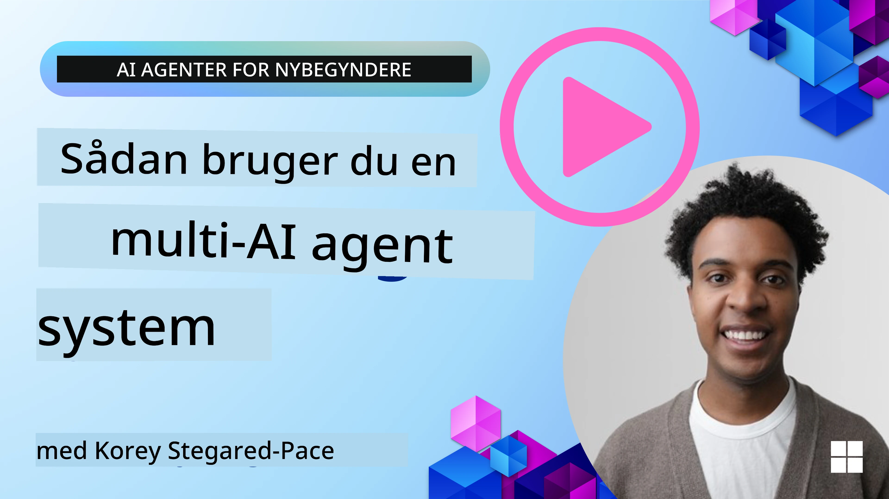
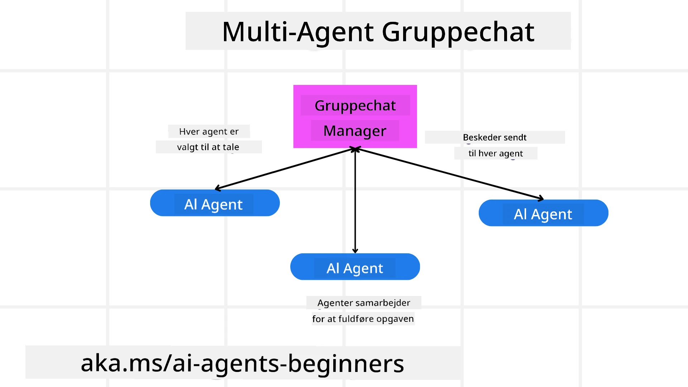
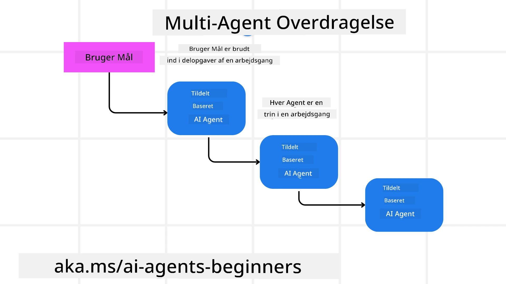
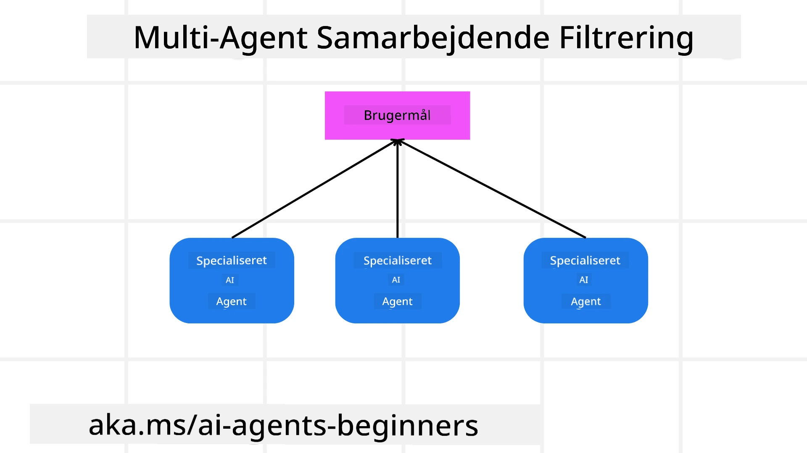

> _(Klik på billedet ovenfor for at se videoen af denne lektion)_

# Multi-agent designmønstre

Så snart du begynder at arbejde på et projekt, der involverer flere agenter, skal du overveje multi-agent designmønsteret. Det er dog måske ikke straks klart, hvornår man skal skifte til multi-agenter, og hvad fordelene er.

## Introduktion

I denne lektion søger vi at besvare følgende spørgsmål:

- Hvilke scenarier er multi-agenter anvendelige i?
- Hvad er fordelene ved at bruge multi-agenter fremfor bare én enkelt agent, der udfører flere opgaver?
- Hvad er byggeklodserne til implementering af multi-agent designmønsteret?
- Hvordan får vi synlighed i, hvordan de flere agenter interagerer med hinanden?

## Læringsmål

Efter denne lektion skal du kunne:

- Identificere scenarier, hvor multi-agenter er anvendelige
- Genkende fordelene ved at bruge multi-agenter fremfor en enkelt agent.
- Forstå byggeklodserne til implementering af multi-agent designmønsteret.

Hvad er det større perspektiv?

*Multi-agenter er et designmønster, der tillader flere agenter at arbejde sammen for at nå et fælles mål*.

Dette mønster er bredt anvendt inden for forskellige områder, herunder robotik, autonome systemer og distribueret databehandling.

## Scenarier hvor multi-agenter er anvendelige

Så hvilke scenarier er et godt brugsscenarie for at bruge multi-agenter? Svaret er, at der findes mange scenarier, hvor det er fordelagtigt at anvende flere agenter, især i følgende tilfælde:

- **Store arbejdsmængder**: Store arbejdsmængder kan opdeles i mindre opgaver og tildeles forskellige agenter, hvilket muliggør parallel behandling og hurtigere færdiggørelse. Et eksempel på dette er ved en stor databehandlingsopgave.
- **Komplekse opgaver**: Komplekse opgaver, ligesom store arbejdsmængder, kan brydes ned i mindre delopgaver og tildeles forskellige agenter, der hver specialiserer sig i en bestemt del af opgaven. Et godt eksempel på dette er ved autonome køretøjer, hvor forskellige agenter håndterer navigation, forhindringsdetektion og kommunikation med andre køretøjer.
- **Forskellig ekspertise**: Forskellige agenter kan have forskellig ekspertise, hvilket gør det muligt for dem at håndtere forskellige aspekter af en opgave mere effektivt end en enkelt agent. Et godt eksempel på dette er inden for sundhedspleje, hvor agenter kan håndtere diagnostik, behandlingsplaner og patientovervågning.

## Fordele ved at bruge multi-agenter fremfor en enkelt agent

Et enkelt agentsystem kan fungere godt for simple opgaver, men for mere komplekse opgaver kan brug af flere agenter give flere fordele:

- **Specialisering**: Hver agent kan være specialiseret til en bestemt opgave. Manglende specialisering i en enkelt agent betyder, at du har en agent, der kan alt, men som kan blive forvirret over, hvad den skal gøre, når den står over for en kompleks opgave. Den kan for eksempel ende med at udføre en opgave, som den ikke er bedst egnet til.
- **Skalerbarhed**: Det er lettere at skalere systemer ved at tilføje flere agenter i stedet for at overbelaste en enkelt agent.
- **Fejltolerance**: Hvis en agent fejler, kan andre fortsætte med at fungere, hvilket sikrer systemets pålidelighed.

Lad os tage et eksempel: lad os booke en rejse for en bruger. Et system med kun én agent ville skulle håndtere alle aspekter af rejsebookingsprocessen, fra at finde fly til at booke hoteller og lejebiler. For at opnå dette med en enkelt agent, skulle agenten have værktøjer til at håndtere alle disse opgaver. Det kunne føre til et komplekst og monolitisk system, der er svært at vedligeholde og skalere. Et multi-agent system kunne derimod have forskellige agenter, der er specialiserede i at finde fly, booke hoteller og lejebiler. Det ville gøre systemet mere modulært, lettere at vedligeholde og mere skalerbart.

Sammenlign dette med et rejsebureau drevet som en familiedrevet butik versus et rejsebureau drevet som en franchise. Familiedriften ville have en enkelt agent, der håndterer alle aspekter af rejsebookingsprocessen, mens franchisen ville have forskellige agenter, der håndterer forskellige dele af processen.

## Byggeklodser til implementering af multi-agent designmønsteret

Inden du kan implementere multi-agent designmønsteret, skal du forstå byggeklodserne, der udgør mønsteret.

Lad os gøre dette mere konkret ved igen at se på eksemplet med at booke en rejse for en bruger. I dette tilfælde ville byggeklodserne inkludere:

- **Agentkommunikation**: Agenter til at finde fly, booke hoteller og lejebiler skal kommunikere og dele information om brugerens præferencer og begrænsninger. Du skal beslutte protokollerne og metoderne for denne kommunikation. Hvad det betyder konkret er, at agenten for at finde fly skal kommunikere med agenten for at booke hoteller for at sikre, at hotellet bookes til de samme datoer som flyet. Det betyder, at agenterne skal dele information om brugerens rejsedatoer, hvilket vil sige, at du skal beslutte *hvilke agenter der deler info, og hvordan de deler info*.
- **Koordinationsmekanismer**: Agenter skal koordinere deres handlinger for at sikre, at brugerens præferencer og begrænsninger bliver opfyldt. En brugerpræference kunne være, at de ønsker et hotel tæt på lufthavnen, mens en begrænsning kunne være, at lejebiler kun er tilgængelige i lufthavnen. Det betyder, at agenten for at booke hoteller skal koordinere med agenten for at booke lejebiler for at sikre, at brugerens præferencer og begrænsninger opfyldes. Det betyder, at du skal beslutte *hvordan agenterne koordinerer deres handlinger*.
- **Agentarkitektur**: Agenter skal have den interne struktur til at træffe beslutninger og lære af deres interaktioner med brugeren. Det betyder, at agenten for at finde fly skal have den interne struktur til at træffe beslutninger om, hvilke fly der skal anbefales til brugeren. Det betyder, at du skal beslutte *hvordan agenterne træffer beslutninger og lærer af deres interaktioner med brugeren*. Eksempler på, hvordan en agent lærer og forbedres, kunne være, at agenten for at finde fly kunne bruge en maskinlæringsmodel til at anbefale fly til brugeren baseret på deres tidligere præferencer.
- **Synlighed i multi-agent interaktioner**: Du skal have synlighed i, hvordan de flere agenter interagerer med hinanden. Det betyder, at du skal have værktøjer og teknikker til at spore agentaktiviteter og interaktioner. Dette kan være i form af logning og overvågningsværktøjer, visualiseringsværktøjer og præstationsmålinger.
- **Multi-agent mønstre**: Der findes forskellige mønstre til implementering af multi-agent systemer, såsom centrale, decentrale og hybride arkitekturer. Du skal vælge det mønster, der bedst passer til dit anvendelsestilfælde.
- **Menneske i løkken**: I de fleste tilfælde vil du have et menneske i løkken, og du skal instruere agenterne om, hvornår de skal bede om menneskelig intervention. Dette kan være i form af en bruger, der beder om et specifikt hotel eller fly, som agenterne ikke har anbefalet, eller beder om bekræftelse før booking af et fly eller hotel.

## Synlighed i multi-agent interaktioner

Det er vigtigt, at du har synlighed i, hvordan de flere agenter interagerer med hinanden. Denne synlighed er vigtig for fejlfinding, optimering og sikring af den samlede systems effektivitet. For at opnå dette skal du have værktøjer og teknikker til at spore agentaktiviteter og interaktioner. Dette kan være i form af logning og overvågningsværktøjer, visualiseringsværktøjer og præstationsmålinger.

For eksempel, i tilfælde af booking af en rejse for en bruger, kunne du have et dashboard, der viser status for hver agent, brugerens præferencer og begrænsninger samt interaktionerne mellem agenterne. Dette dashboard kunne vise brugerens rejsedatoer, de fly, der anbefales af flyagenten, de hoteller der anbefales af hotelagenten, og de lejebiler der anbefales af lejebilagenten. Dette ville give dig et klart overblik over, hvordan agenterne interagerer med hinanden, og om brugerens præferencer og begrænsninger bliver opfyldt.

Lad os se nærmere på hver af disse aspekter.

- **Lognings- og overvågningsværktøjer**: Du ønsker at logge hver handling, en agent foretager. En logpost kunne gemme information om agenten, der foretog handlingen, handlingen der blev foretaget, tidspunktet hvor handlingen fandt sted, og resultatet af handlingen. Denne information kan derefter bruges til fejlfinding, optimering og mere.

- **Visualiseringsværktøjer**: Visualiseringsværktøjer kan hjælpe dig med at se interaktionerne mellem agenter på en mere intuitiv måde. For eksempel kunne du have en graf, der viser informationsflowet mellem agenter. Dette kunne hjælpe dig med at identificere flaskehalse, ineffektivitet og andre problemer i systemet.

- **Præstationsmålinger**: Præstationsmålinger kan hjælpe dig med at spore effektiviteten af multi-agent systemet. For eksempel kunne du måle den tid, det tager at fuldføre en opgave, antallet af opgaver, der bliver fuldført pr. tidsenhed, og nøjagtigheden af de anbefalinger, agenterne leverer. Denne information kan hjælpe dig med at identificere forbedringsområder og optimere systemet.

## Multi-agent mønstre

Lad os dykke ned i nogle konkrete mønstre, vi kan bruge til at skabe multi-agent apps. Her er nogle interessante mønstre, der er værd at overveje:

### Gruppechat

Dette mønster er nyttigt, når du vil skabe en gruppechatapplikation, hvor flere agenter kan kommunikere med hinanden. Typiske brugsscenarier for dette mønster inkluderer team-samarbejde, kundesupport og sociale netværk.

I dette mønster repræsenterer hver agent en bruger i gruppechatten, og beskeder udveksles mellem agenter ved hjælp af en beskedprotokol. Agenterne kan sende beskeder til gruppechatten, modtage beskeder fra gruppechatten og svare på beskeder fra andre agenter.

Dette mønster kan implementeres ved hjælp af en centraliseret arkitektur, hvor alle beskeder sendes gennem en central server, eller en decentraliseret arkitektur, hvor beskeder udveksles direkte.

### Overdragelse

Dette mønster er nyttigt, når du vil skabe en applikation, hvor flere agenter kan overdrage opgaver til hinanden.

Typiske brugsscenarier for dette mønster inkluderer kundesupport, opgavestyring og workflow-automatisering.

I dette mønster repræsenterer hver agent en opgave eller et trin i en arbejdsproces, og agenterne kan overdrage opgaver til andre agenter baseret på foruddefinerede regler.

### Samarbejdende filtrering

Dette mønster er nyttigt, når du vil skabe en applikation, hvor flere agenter kan samarbejde om at lave anbefalinger til brugere.

Grunden til, at du vil have flere agenter til at samarbejde, er, at hver agent kan have forskellig ekspertise og bidrage til anbefalingsprocessen på forskellige måder.

Lad os tage et eksempel, hvor en bruger ønsker en anbefaling om den bedste aktie at købe på aktiemarkedet.

- **Brancheekspert**: Én agent kunne være ekspert i en specifik branche.
- **Teknisk analyse**: En anden agent kunne være ekspert i teknisk analyse.
- **Fundamental analyse**: Og en tredje agent kunne være ekspert i fundamental analyse. Ved at samarbejde kan disse agenter give en mere omfattende anbefaling til brugeren.

## Scenario: Refusionsproces

Forestil dig et scenarie, hvor en kunde forsøger at få refusion for et produkt; der kan være flere agenter involveret i denne proces, men lad os opdele det mellem agenter, der er specifikke for denne proces, og generelle agenter, der kan bruges i andre processer.

**Agenter specifikke for refusionsprocessen**:

Følgende er nogle agenter, der kunne være involveret i refusionsprocessen:

- **Kundeagent**: Denne agent repræsenterer kunden og er ansvarlig for at starte refusionsprocessen.
- **Sælgeragent**: Denne agent repræsenterer sælgeren og er ansvarlig for at behandle refusionen.
- **Betalingsagent**: Denne agent repræsenterer betalingsprocessen og er ansvarlig for at refundere kundens betaling.
- **Løsningsagent**: Denne agent repræsenterer løsningsprocessen og er ansvarlig for at løse eventuelle problemer, der opstår under refusionsprocessen.
- **Overholdelsesagent**: Denne agent repræsenterer overholdelsesprocessen og er ansvarlig for at sikre, at refusionsprocessen overholder regler og politikker.

**Generelle agenter**:

Disse agenter kan bruges af andre dele af din virksomhed.

- **Forsendelsesagent**: Denne agent repræsenterer forsendelsesprocessen og er ansvarlig for at sende produktet tilbage til sælgeren. Denne agent kan bruges både for refusionsprocessen og for generel forsendelse af et produkt gennem et køb for eksempel.
- **Feedbackagent**: Denne agent repræsenterer feedbackprocessen og er ansvarlig for at indsamle feedback fra kunden. Feedback kan forekomme på ethvert tidspunkt og ikke kun under refusionsprocessen.
- **Eskaleringsagent**: Denne agent repræsenterer eskaleringsprocessen og er ansvarlig for at eskalere problemer til et højere supportniveau. Du kan bruge denne type agent til enhver proces, hvor du har behov for at eskalere et problem.
- **Notifikationsagent**: Denne agent repræsenterer notifikationsprocessen og er ansvarlig for at sende meddelelser til kunden på forskellige stadier af refusionsprocessen.
- **Analyseagent**: Denne agent repræsenterer analyseprocessen og er ansvarlig for at analysere data relateret til refusionsprocessen.
- **Revisionsagent**: Denne agent repræsenterer revisionsprocessen og er ansvarlig for at revidere refusionsprocessen for at sikre, at den udføres korrekt.
- **Rapporteringsagent**: Denne agent repræsenterer rapporteringsprocessen og er ansvarlig for at generere rapporter om refusionsprocessen.
- **Vidensagent**: Denne agent repræsenterer videnprocessen og er ansvarlig for at vedligeholde en vidensbase med information relateret til refusionsprocessen. Denne agent kunne være vidende både om refunderinger og andre dele af din virksomhed.
- **Sikkerhedsagent**: Denne agent repræsenterer sikkerhedsprocessen og er ansvarlig for at sikre sikkerheden i refusionsprocessen.
- **Kvalitetsagent**: Denne agent repræsenterer kvalitetsprocessen og er ansvarlig for at sikre kvaliteten af refusionsprocessen.

Der er ganske mange agenter listet ovenfor, både til den specifikke refusionsproces, men også de generelle agenter, der kan bruges i andre dele af din virksomhed. Forhåbentlig giver dette dig en idé om, hvordan du kan beslutte, hvilke agenter du skal bruge i dit multi-agent system.

## Opgave

Design et multi-agent system for en kundesupportproces. Identificer de agenter, der er involveret i processen, deres roller og ansvar samt, hvordan de interagerer med hinanden. Overvej både agenter, der er specifikke for kundesupportprocessen, og generelle agenter, der kan bruges i andre dele af din virksomhed.
> Tænk dig om, før du læser den følgende løsning, du kan have brug for flere agenter, end du tror.

> TIP: Overvej de forskellige faser i kundesupportprocessen og tænk også på agenter, der er nødvendige for ethvert system.

## Solution

[Solution](./solution/solution.md)

## Knowledge checks

Question: When should you consider using multi-agents?

- [ ] A1: Når du har en lille arbejdsbyrde og en simpel opgave.
- [ ] A2: Når du har en stor arbejdsbyrde
- [ ] A3: Når du har en simpel opgave.

[Solution quiz](./solution/solution-quiz.md)

## Summary

I denne lektion har vi set på multi-agent designmønstret, herunder scenarier hvor multi-agenter er relevante, fordelene ved at bruge multi-agenter frem for en enkelt agent, byggeklodserne til implementering af multi-agent designmønstret, og hvordan man får indsigt i, hvordan de mange agenter interagerer med hinanden.

### Har du flere spørgsmål om Multi-Agent Designmønstret?

Deltag i [Microsoft Foundry Discord](https://aka.ms/ai-agents/discord) for at møde andre lærende, deltage i kontortimer og få svar på dine AI Agents-spørgsmål.

## Additional resources

- <a href="https://learn.microsoft.com/azure/ai-services/agents/overview" target="_blank">Microsoft Agent Framework dokumentation</a>
- <a href="https://www.analyticsvidhya.com/blog/2024/10/agentic-design-patterns/" target="_blank">Agentic design patterns</a>

## Previous Lesson

[Planning Design](../07-planning-design/README.md)

## Next Lesson

[Metacognition in AI Agents](../09-metacognition/README.md)

---

<!-- CO-OP TRANSLATOR DISCLAIMER START -->
**Ansvarsfraskrivelse**:
Dette dokument er oversat ved hjælp af AI-oversættelsestjenesten [Co-op Translator](https://github.com/Azure/co-op-translator). Selvom vi bestræber os på nøjagtighed, skal du være opmærksom på, at automatiserede oversættelser kan indeholde fejl eller unøjagtigheder. Det oprindelige dokument på dets originalsprog bør betragtes som den autoritative kilde. For vigtig information anbefales professionel menneskelig oversættelse. Vi påtager os intet ansvar for eventuelle misforståelser eller fejltolkninger, der opstår som følge af brugen af denne oversættelse.
<!-- CO-OP TRANSLATOR DISCLAIMER END -->