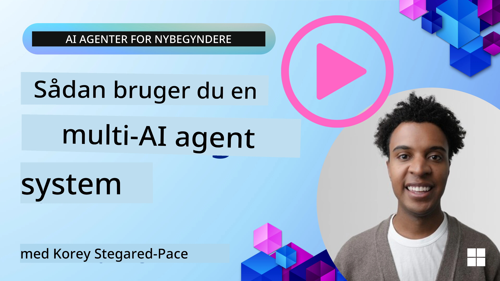
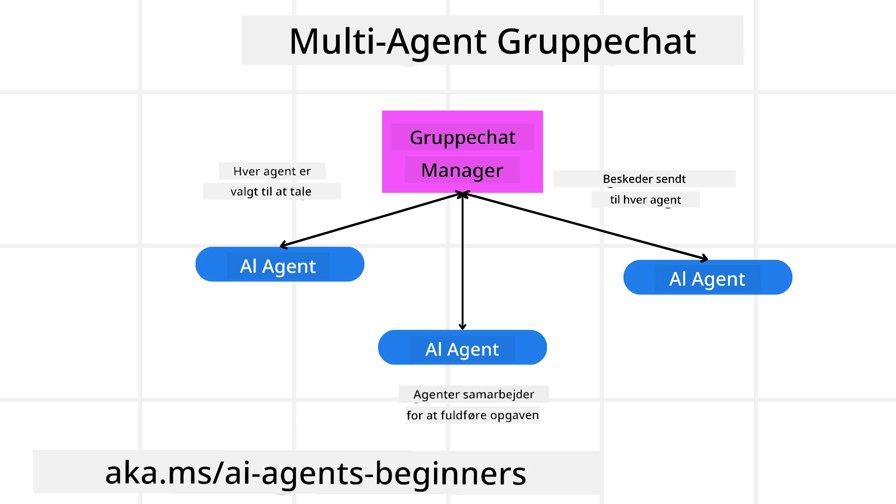
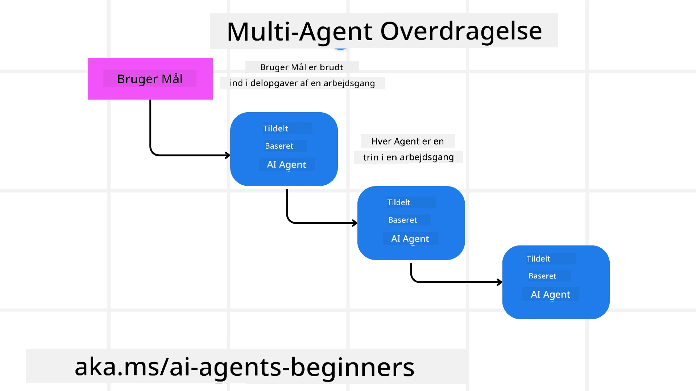
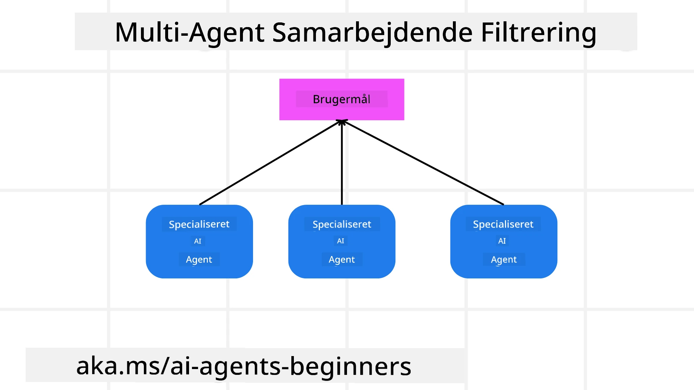

> _(Klik på billedet ovenfor for at se video af denne lektion)_

# Multi-agent designmønstre

Så snart du begynder at arbejde på et projekt, som involverer flere agenter, bliver du nødt til at overveje multi-agent designmønsteret. Det er dog ikke altid straks klart, hvornår du skal skifte til multi-agenter, og hvad fordelene er.

## Introduktion

I denne lektion ønsker vi at besvare følgende spørgsmål:

- Hvilke scenarier er multi-agenter anvendelige til?
- Hvad er fordelene ved at bruge multi-agenter frem for blot en enkelt agent, der udfører flere opgaver?
- Hvad er byggestenene til implementering af multi-agent designmønsteret?
- Hvordan får vi indsigt i, hvordan de multiple agenter interagerer med hinanden?

## Læringsmål

Efter denne lektion skal du være i stand til at:

- Identificere scenarier, hvor multi-agenter er anvendelige
- Genkende fordelene ved at bruge multi-agenter frem for en enkelt agent.
- Forstå byggestenene til implementering af multi-agent designmønsteret.

Hvad er det større billede?

*Multi-agenter er et designmønster, der gør det muligt for flere agenter at samarbejde for at opnå et fælles mål*.

Dette mønster anvendes bredt inden for forskellige felter, herunder robotteknologi, autonome systemer og distribueret databehandling.

## Scenarier hvor multi-agenter er anvendelige

Så hvilke scenarier er et godt brugstilfælde for at benytte multi-agenter? Svaret er, at der er mange scenarier, hvor det er fordelagtigt at anvende flere agenter, især i følgende tilfælde:

- **Store arbejdsbelastninger**: Store arbejdsbelastninger kan opdeles i mindre opgaver og tildeles forskellige agenter, hvilket muliggør parallel behandling og hurtigere færdiggørelse. Et eksempel på dette er ved en stor databehandlingsopgave.
- **Komplekse opgaver**: Komplekse opgaver, ligesom store arbejdsbelastninger, kan opdeles i mindre delopgaver og tildeles forskellige agenter, der hver specialiserer sig i en bestemt del af opgaven. Et godt eksempel på dette er autonome køretøjer, hvor forskellige agenter håndterer navigation, forhindringsdetektion og kommunikation med andre køretøjer.
- **Forskellig ekspertise**: Forskellige agenter kan have forskellig ekspertise, hvilket gør det muligt for dem at håndtere forskellige aspekter af en opgave mere effektivt end en enkelt agent. Et godt eksempel på dette er inden for sundhedssektoren, hvor agenter kan håndtere diagnostik, behandlingsplaner og patientovervågning.

## Fordele ved at bruge multi-agenter frem for en enkelt agent

Et enkelt agent-system kan fungere godt til enkle opgaver, men til mere komplekse opgaver kan flere agenter give flere fordele:

- **Specialisering**: Hver agent kan specialisere sig i en bestemt opgave. Manglende specialisering i en enkelt agent betyder, at du har en agent, der kan alt, men måske bliver forvirret, når den møder en kompleks opgave. Den kan for eksempel ende med at udføre en opgave, den ikke er bedst egnet til.
- **Skalerbarhed**: Det er nemmere at skalere systemer ved at tilføje flere agenter frem for at overbelaste en enkelt agent.
- **Fejltolerance**: Hvis en agent fejler, kan de andre fortsætte med at fungere og sikre systemets pålidelighed.

Lad os tage et eksempel, lad os booke en tur for en bruger. Et enkelt agent-system skulle håndtere alle aspekter af bookingprocessen, fra at finde fly til at booke hoteller og lejebiler. For at opnå dette med en enkelt agent, skulle agenten have værktøjer til at håndtere alle disse opgaver. Dette kunne føre til et komplekst og monolitisk system, som er svært at vedligeholde og skalere. Et multi-agent system kunne derimod have forskellige agenter specialiseret i at finde fly, booke hoteller og lejebiler. Dette ville gøre systemet mere modulært, lettere at vedligeholde og skalerbart.

Sammenlign dette med et rejsebureau drevet som en lille familiær butik versus et rejsebureau drevet som en franchise. Den lille butik ville have en enkelt agent til at håndtere alle aspekter af bookingprocessen, mens franchisen ville have forskellige agenter, der håndterer forskellige aspekter af bookingprocessen.

## Byggesten til implementering af multi-agent designmønsteret

Før du kan implementere multi-agent designmønsteret, skal du forstå de byggesten, der udgør mønsteret.

Lad os gøre det mere konkret ved at kigge igen på eksemplet med at booke en tur for en bruger. I dette tilfælde vil byggestenene inkludere:

- **Agentkommunikation**: Agenter til at finde fly, booke hoteller og lejebiler skal kommunikere og dele information om brugerens præferencer og begrænsninger. Du skal beslutte protokoller og metoder til denne kommunikation. Konkrete implikationer er, at agenten, der finder fly, skal kommunikere med agenten, der booker hoteller, for at sikre, at hotellet er booket til de samme datoer som flyet. Det betyder, at agenterne skal dele information om brugerens rejsedatoer, hvilket kræver at du beslutter *hvilke agenter der deler information og hvordan de deler den*.
- **Koordineringsmekanismer**: Agenter skal koordinere deres handlinger for at sikre, at brugerens præferencer og begrænsninger overholdes. En brugerpræference kan være, at de ønsker et hotel tæt på lufthavnen, mens en begrænsning kan være, at lejebiler kun er tilgængelige i lufthavnen. Det betyder, at agenten, der booker hoteller, skal koordinere med agenten, der booker lejebiler, for at sikre at brugerens præferencer og begrænsninger opfyldes. Du skal derfor beslutte *hvordan agenterne koordinerer deres handlinger*.
- **Agentarkitektur**: Agenter skal have en intern struktur til at træffe beslutninger og lære af deres interaktioner med brugeren. Det betyder, at agenten, der finder fly, skal have intern struktur til at træffe beslutninger om, hvilke fly der skal anbefales til brugeren. Du skal beslutte *hvordan agenterne træffer beslutninger og lærer af deres interaktioner med brugeren*. Eksempler på hvordan en agent lærer og forbedres kunne være, at agenten til at finde fly kan bruge en maskinlæringsmodel til at anbefale fly baseret på brugerens tidligere præferencer.
- **Indsigt i multi-agent interaktioner**: Du skal have indsigt i, hvordan de multiple agenter interagerer med hinanden. Det betyder, at du skal have værktøjer og teknikker til at spore agentaktiviteter og interaktioner. Dette kan være i form af logning og overvågningsværktøjer, visualiseringsværktøjer og performance-målinger.
- **Multi-agent mønstre**: Der findes forskellige mønstre til implementering af multi-agent systemer som centraliseret, decentraliseret og hybride arkitekturer. Du skal vælge det mønster, der bedst passer til dit anvendelsestilfælde.
- **Menneske i løkken**: I de fleste tilfælde vil et menneske være i løkken, og du skal instruere agenterne om, hvornår de skal bede om menneskelig indgriben. Dette kan være form af, at en bruger beder om et specifikt hotel eller fly, som agenterne ikke har anbefalet, eller anmoder om bekræftelse før booking af fly eller hotel.

## Indsigt i multi-agent interaktioner

Det er vigtigt, at du har indsigt i, hvordan de multiple agenter interagerer med hinanden. Denne indsigt er essentiel for debugging, optimering og sikring af systemets samlede effektivitet. For at opnå dette skal du have værktøjer og teknikker til at spore agentaktiviteter og interaktioner. Dette kan være i form af logning og overvågningsværktøjer, visualiseringsværktøjer og performance-målinger.

For eksempel ved booking af en tur for en bruger kunne du have et dashboard, der viser status for hver agent, brugerens præferencer og begrænsninger samt interaktionerne mellem agenterne. Dette dashboard kunne vise brugerens rejsedatoer, de fly der anbefales af flyagenten, hoteller anbefalet af hotelagenten og lejebiler anbefalet af lejeagenten. Det ville give dig et klart overblik over, hvordan agenterne interagerer med hinanden, og om brugerens præferencer og begrænsninger bliver opfyldt.

Lad os kigge nærmere på hver af disse aspekter.

- **Logning og overvågningsværktøjer**: Du ønsker at logge hver handling, en agent udfører. En logpost kan gemme information om agenten, der udførte handlingen, handlingen selv, tidspunktet handlingen blev udført, og resultatet af handlingen. Denne information kan så bruges til debugging, optimering med mere.

- **Visualiseringsværktøjer**: Visualiseringsværktøjer kan hjælpe dig med at se interaktionerne mellem agenter på en mere intuitiv måde. For eksempel kunne du have en graf, der viser informationsflowet mellem agenter. Dette kan hjælpe med at identificere flaskehalse, ineffektivitet og andre problemer i systemet.

- **Performance-målinger**: Performance-målinger kan hjælpe dig med at følge effektiviteten af multi-agent systemet. For eksempel kunne du følge tiden det tager at fuldføre en opgave, antallet af opgaver fuldført per tidsenhed og nøjagtigheden af anbefalingerne fra agenterne. Denne information kan hjælpe med at finde forbedringsområder og optimere systemet.

## Multi-agent mønstre

Lad os dykke ned i nogle konkrete mønstre, vi kan bruge til at skabe multi-agent apps. Her er nogle interessante mønstre værd at overveje:

### Gruppchat

Dette mønster er nyttigt, når du ønsker at oprette en gruppechat-applikation, hvor flere agenter kan kommunikere med hinanden. Typiske brugstilfælde inkluderer teamsamarbejde, kundesupport og sociale netværk.

I dette mønster repræsenterer hver agent en bruger i gruppechatten, og beskeder udveksles mellem agenter ved hjælp af en messaging-protokol. Agenterne kan sende beskeder til gruppechatten, modtage beskeder fra gruppechatten og svare på beskeder fra andre agenter.

Dette mønster kan implementeres ved hjælp af en centraliseret arkitektur, hvor alle beskeder dirigeres gennem en central server, eller en decentraliseret arkitektur, hvor beskeder udveksles direkte.

### Overdragelse (Hand-off)

Dette mønster er nyttigt, når du ønsker at oprette en applikation, hvor flere agenter kan overdrage opgaver til hinanden.

Typiske brugstilfælde for dette mønster inkluderer kundesupport, opgavestyring og workflow-automatisering.

I dette mønster repræsenterer hver agent en opgave eller et trin i en workflow, og agenter kan overdrage opgaver til andre agenter baseret på foruddefinerede regler.

### Samarbejdende filtrering

Dette mønster er nyttigt, når du ønsker at oprette en applikation, hvor flere agenter kan samarbejde om at give anbefalinger til brugere.

Grunden til, at du vil have flere agenter til at samarbejde, er, at hver agent kan have forskellig ekspertise og kan bidrage til anbefalingsprocessen på forskellige måder.

Lad os tage et eksempel, hvor en bruger ønsker en anbefaling om den bedste aktie at købe på aktiemarkedet.

- **Brancheekspert**: En agent kunne være ekspert i en specifik branche.
- **Teknisk analyse**: En anden agent kunne være ekspert i teknisk analyse.
- **Fundamental analyse**: og en tredje agent kunne være ekspert i fundamental analyse. Ved at samarbejde kan disse agenter give en mere omfattende anbefaling til brugeren.

## Scenario: Refusionsproces

Overvej et scenarie, hvor en kunde forsøger at få refusion for et produkt. Der kan være ret mange agenter involveret i denne proces, men lad os opdele dem i agenter specifikke for denne proces og generelle agenter, som kan bruges i andre processer.

**Agenter specifikke for refusionsprocessen**:

Følgende er nogle agenter, der kunne være involveret i refusionsprocessen:

- **Kundeagent**: Denne agent repræsenterer kunden og er ansvarlig for at igangsætte refusionsprocessen.
- **Sælgeragent**: Denne agent repræsenterer sælgeren og er ansvarlig for at behandle refusionen.
- **Betalingsagent**: Denne agent repræsenterer betalingsprocessen og er ansvarlig for at refundere kundens betaling.
- **Løsningsagent**: Denne agent repræsenterer løsningsprocessen og er ansvarlig for at løse eventuelle problemer, der opstår under refusionsprocessen.
- **Overholdelsesagent**: Denne agent repræsenterer overholdelsesprocessen og sikrer, at refusionsprocessen overholder regler og politikker.

**Generelle agenter**:

Disse agenter kan anvendes i andre dele af din virksomhed.

- **Forsendelsesagent**: Denne agent repræsenterer forsendelsesprocessen og er ansvarlig for at sende produktet tilbage til sælgeren. Denne agent kan bruges både til refusionsprocessen og til generel forsendelse af produkter ved for eksempel køb.
- **Feedback-agent**: Denne agent repræsenterer feedbackprocessen og er ansvarlig for at indsamle feedback fra kunden. Feedback kan gives når som helst og ikke kun under refusionsprocessen.
- **Eskaleringsagent**: Denne agent repræsenterer eskaleringsprocessen og er ansvarlig for at eskalere problemer til et højere supportsniveau. Denne type agent kan bruges i enhver proces, hvor du har brug for at eskalere et problem.
- **Notifikationsagent**: Denne agent repræsenterer notifikationsprocessen og er ansvarlig for at sende notifikationer til kunden på forskellige stadier af refusionsprocessen.
- **Analyseagent**: Denne agent repræsenterer analyseprocessen og er ansvarlig for at analysere data relateret til refusionsprocessen.
- **Revisionagent**: Denne agent repræsenterer revisionsprocessen og er ansvarlig for at revidere refusionsprocessen for at sikre, at den udføres korrekt.
- **Rapporteringsagent**: Denne agent repræsenterer rapporteringsprocessen og er ansvarlig for at generere rapporter om refusionsprocessen.
- **Vidensagent**: Denne agent repræsenterer vidensprocessen og vedligeholder en vidensbase med information relateret til refusionsprocessen. Denne agent kunne være vidende både om refusioner og andre dele af din virksomhed.
- **Sikkerhedsagent**: Denne agent repræsenterer sikkerhedsprocessen og sikrer sikkerheden af refusionsprocessen.
- **Kvalitetsagent**: Denne agent repræsenterer kvalitetsprocessen og sikrer kvaliteten af refusionsprocessen.

Der er ret mange agenter nævnt tidligere, både for den specifikke refusionsproces, men også for de generelle agenter, der kan bruges i andre dele af din virksomhed. Forhåbentlig giver dette dig en idé om, hvordan du kan beslutte, hvilke agenter der skal bruges i dit multi-agent system.

## Opgave

Design et multi-agent system til en kundesupportproces. Identificer de involverede agenter i processen, deres roller og ansvar, og hvordan de interagerer med hinanden. Overvej både agenter specifikke til kundesupportprocessen og generelle agenter, som kan bruges i andre dele af din virksomhed.

> Tænk dig om, inden du læser den følgende løsning, du kan få brug for flere agenter, end du tror.

> TIP: Tænk over de forskellige trin i kundesupportprocessen, og overvej også agenter, der er nødvendige for ethvert system.

## Løsning

[Løsning](./solution/solution.md)

## Videnskontroller

### Spørgsmål 1

Hvilket scenarie passer bedst til et multi-agent system?

- [ ] A1: En supportbot besvarer almindelige spørgsmål ved hjælp af en enkelt vidensbase og et lille sæt værktøjer.
- [ ] A2: En tilbagebetalingsworkflow kræver separate roller til svindel, betaling og compliance, hver med deres egne værktøjer, og deres resultater skal koordineres.
- [ ] A3: Den samme simple klassifikationsanmodning modtages tusindvis af gange i timen.

### Spørgsmål 2

Hvornår er en enkelt agent normalt det bedste valg?

- [ ] A1: Opgaven kan håndteres med et sæt instruktioner og værktøjer, uden specialist-overleveringer.
- [ ] A2: Agenten har adgang til mere end ét værktøj.
- [ ] A3: Workflowen kræver separate roller med forskellige tilladelser og uafhængige revisionsspor.

[Løsning quiz](./solution/solution-quiz.md)

## Resumé

I denne lektion har vi set på multi-agent designmønstret, herunder de scenarier, hvor multi-agenter er anvendelige, fordelene ved at bruge multi-agenter frem for en enkelt agent, byggeklodserne til implementering af multi-agent designmønstret, og hvordan man får indsigt i, hvordan de flere agenter interagerer med hinanden.

### Har du flere spørgsmål om Multi-Agent Designmønsteret?

Deltag i [Microsoft Foundry Discord](https://discord.com/invite/ATgtXmAS5D) for at møde andre elever, deltage i kontortimer og få svar på dine spørgsmål om AI-agenter.

## Yderligere ressourcer

- <a href="https://learn.microsoft.com/azure/ai-services/agents/overview" target="_blank">Microsoft Agent Framework dokumentation</a>
- <a href="https://www.analyticsvidhya.com/blog/2024/10/agentic-design-patterns/" target="_blank">Agentiske designmønstre</a>

## Forrige lektion

[Planlægningsdesign](../07-planning-design/README.md)

## Næste lektion

[Metakognition i AI-agenter](../09-metacognition/README.md)

---

<!-- CO-OP TRANSLATOR DISCLAIMER START -->
**Ansvarsfraskrivelse**:
Dette dokument er blevet oversat ved hjælp af AI-oversættelsestjenesten [Co-op Translator](https://github.com/Azure/co-op-translator). Selvom vi bestræber os på nøjagtighed, skal du være opmærksom på, at automatiserede oversættelser kan indeholde fejl eller unøjagtigheder. Det originale dokument på dets oprindelige sprog bør betragtes som den autoritative kilde. For kritisk information anbefales professionel menneskelig oversættelse. Vi påtager os intet ansvar for misforståelser eller fejltolkninger, der opstår som følge af brugen af denne oversættelse.
<!-- CO-OP TRANSLATOR DISCLAIMER END -->