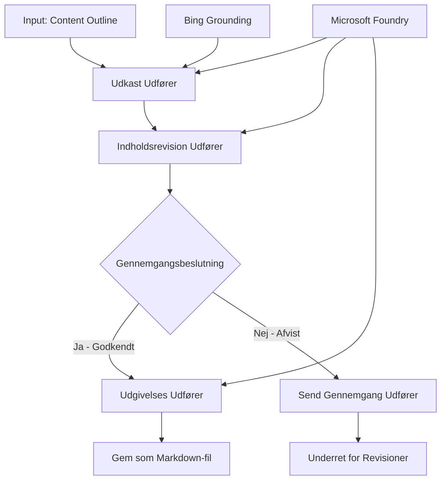

# 🔀 Betingede Agent-Workflows med Microsoft Foundry (.NET)

## 📋 Intelligent Beslutningsbaseret Workflow Tutorial

Denne notebook demonstrerer **betingede workflow-mønstre** ved hjælp af Microsoft Foundry og Microsoft Agent Framework for .NET. Du vil lære at bygge sofistikerede, beslutningsdrevne workflows, der intelligent dirigerer behandlingen baseret på AI-analyse, forretningsregler og dynamiske betingelser for automatisering i virksomhedsklasse.

## 🎯 Læringsmål

### 🧠 **Intelligent Beslutningsarkitektur**
- **Implementering af betinget logik**: Byg komplekse beslutningstræer med flere forgreningspunkter
- **AI-drevet routing**: Brug Microsoft Foundry-modeller til at træffe intelligente routingbeslutninger
- **Dynamisk workflow-tilpasning**: Tilpas workflow-adfærd baseret på runtime-analyse og betingelser
- **Integration af forretningsregler**: Indarbejd forretningslogik og compliance-krav i workflows

### 🔀 **Avancerede betingede mønstre**
- **Multi-kriterie beslutningstagning**: Evaluer flere faktorer til routingbeslutninger
- **Kontekstbevidst behandling**: Træf beslutninger baseret på akkumuleret workflow-kontekst og historik
- **Adaptiv workflow-modifikation**: Juster dynamisk behandlingsveje baseret på realtidsbetingelser
- **Integration af regelmotor**: Implementer sofistikerede forretningsregel-motorer i workflows

### 🏢 **Betingede virksomhedsapplikationer**
- **Dokumentklassificering og routing**: Automatiser klassificering og rutning af dokumenter til relevante workflows
- **Kundeservicetriage**: Intelligent routing af kundehenvendelser til specialiserede team
- **Compliance- og risikobehandling**: Anvend forskellige validerings- og gennemgangsprocesser baseret på risikovurdering
- **Workflow for kvalitetskontrol**: Rut indhold gennem passende gennemgangsprocesser baseret på kvalitetsmålinger

## ⚙️ Forudsætninger & Opsætning

### 📦 **Nødvendige NuGet-pakker**

Avancerede pakker til betinget workflow-behandling:

```xml
<!-- Core AI Framework -->
<PackageReference Include="Microsoft.Extensions.AI" Version="9.9.0" />

<!-- Azure AI Agents with Persistent State -->
<PackageReference Include="Azure.AI.Agents.Persistent" Version="1.2.0-beta.5" />

<!-- Azure Identity and Utilities -->
<PackageReference Include="Azure.Identity" Version="1.15.0" />
<PackageReference Include="System.Linq.Async" Version="6.0.3" />
<PackageReference Include="DotNetEnv" Version="3.1.1" />

<!-- Local Workflow Framework References -->
<!-- Microsoft.Agents.Workflows.dll - Advanced workflow orchestration -->
<!-- Microsoft.Agents.AI.AzureAI.dll - Microsoft Foundry integration -->
<!-- Microsoft.Agents.AI.dll - Core agent abstractions -->
```

### 🔑 **Microsoft Foundry-konfiguration**

**Nødvendige Azure-ressourcer:**
- Microsoft Foundry-arbejdsområde med betingede behandlingsmodeller
- Azure-abonnement med passende beregningskvoter og tilladelser
- Udrullede AI-modeller til beslutningstagning og indholdsanalyse
- (Valgfrit) Bing Søge-API-forbindelse til grounding-funktionalitet

**Miljøkonfiguration (.env-fil):**
```env
# Microsoft Foundry Configuration
AZURE_AI_PROJECT_ENDPOINT=https://your-project.cognitiveservices.azure.com/
BING_CONNECTION_ID=your-bing-connection-id
```

**Autentificeringsopsætning:**
```csharp
// Azure CLI or Managed Identity authentication
using Azure.Identity;
var credential = new AzureCliCredential();

// Load environment configuration
DotNetEnv.Env.Load("../../../.env");
```

### 🏗️ **Betinget Workflow-arkitektur**



**Nøglekomponenter:**
- **Draft Executor**: AI-agent der opretter indledende indholdsdrafts ud fra oversigter
- **Content Review Executor**: AI-agent der evaluerer udkastets kvalitet og overholdelse
- **Betinget Routing**: Beslutningslogik der dirigerer baseret på evalueringsresultater
- **Publikations-/gennemgangsveje**: Separate behandlingsveje for godkendt vs afvist indhold
- **State Management**: Opretholder indholds- og evalueringskontekst igennem hele workflowet

## 🎨 **Betingede Workflow-designmønstre**

### 📋 **Indholdsproduktion med kvalitetskontroller**
```
Outline → Draft Creation → Quality Review → {Approve: Publish | Reject: Revise}
```

### 🎯 **Risikobaseret dokumentbehandling**
```
Document → Risk Assessment → {Low: Standard | High: Enhanced Review}
```

### 🔍 **Intelligent routing af kundeservice**
```
Customer Query → Analysis → {Simple: FAQ Bot | Complex: Human Agent}
```

### 💼 **Compliance-drevne workflows**
```
Content → Compliance Check → {Pass: Publish | Fail: Legal Review}
```

## 🏢 **Betingede fordele for virksomheder**

### 🎯 **Intelligent automatisering**
- **Smart beslutningstagning**: AI-drevne routingbeslutninger baseret på indholdsanalyse og kontekst
- **Adaptiv behandling**: Workflows der automatisk tilpasser sig ændrede betingelser
- **Håndhævelse af forretningsregler**: Automatisk anvendelse af kompleks forretningslogik og politikker
- **Kontekstbevidst routing**: Beslutninger baseret på fuld workflow-historik og akkumuleret kontekst

### 📈 **Operationel topkvalitet**
- **Optimeret ressourceallokering**: Diriger arbejde til mest egnede specialister og processer
- **Reduceret manuel indgriben**: Automatiseret beslutningstagning minimerer behovet for menneskelig routing
- **Hurtigere løsningstider**: Direkte routing til passende ekspertise og proceskapaciteter
- **Konsistent anvendelse**: Ensartet anvendelse af forretningsregler og beslutningskriterier

### 🛡️ **Risikostyring & compliance**
- **Automatiseret risikovurdering**: AI-drevet evaluering af indhold og situationsrisikoniveauer
- **Håndhævelse af compliance**: Automatisk routing gennem påkrævede regulatoriske processer
- **Anvendelse af sikkerhedsprotokoller**: Forstærkede sikkerhedsforanstaltninger anvendt baseret på risikovurdering
- **Audit trail vedligeholdelse**: Fuld dokumentation af routingbeslutninger og begrundelser

### 📊 **Analyse & kontinuerlig forbedring**
- **Beslutningsanalyse**: Spor effektivitet og nøjagtighed af routingbeslutninger
- **Mønstergenkendelse**: Identificer tendenser og mønstre i routingbeslutninger over tid
- **Performanceoptimering**: Kontinuerlig forbedring af beslutningskriterier og routingeffektivitet
- **Forretningsintelligens**: Indsigt i indholds-karakteristika og behandlingskrav

### 🔧 **Teknisk topkvalitet**
- **Vedvarende tilstandsadministration**: Oprethold kompleks tilstand på tværs af workflow-udførelse
- **Skalerbar arkitektur**: Håndter høje volumener af betinget behandling
- **Integrationsmuligheder**: Problemfri integration med eksisterende forretningssystemer og processer
- **Overvågning & observabilitet**: Omfattende overvågning af workflow-ydeevne og beslutninger

Lad os bygge intelligente, beslutningsdrevne workflows til virksomheder med .NET! 🚀

## 💻 Kørsel af koden

Den komplette implementering findes i `04.dotnet-agent-framework-workflow-aifoundry-condition.cs`. Den demonstrerer en **indholdsproduktionsworkflow med kvalitetskontroller**:

### 🏗️ **Workflow-arkitektur**

```
Content Outline → Draft Creation → Quality Review → Conditional Routing:
                                                      ├─ Approved (>200 words) → Publish
                                                      └─ Rejected (<200 words) → Review Notification
```

**Agenter i workflowet:**
1. **Evangelist Agent**: Opretter tutorial-udkast fra oversigter med Bing grounding
2. **Content Reviewer Agent**: Evaluerer udkastets kvalitet (ordantal, fuldstændighed)
3. **Publisher Agent**: Gemmer godkendt indhold som tidsstemplet Markdown-filer

**Brugerdefinerede udførere:**
1. **DraftExecutor**: Orkestrerer udkastoprettelse
2. **ContentReviewExecutor**: Udfører kvalitetsvurdering
3. **PublishExecutor**: Håndterer publikation af godkendt indhold
4. **SendReviewExecutor**: Administrerer afvisningsbeskeder for indhold

### 🚀 Kørsel af eksemplet

**Forudsætninger:**
- Microsoft Foundry arbejdsområde konfigureret
- Azure CLI-autentificering (`az login`)
- (Valgfrit) Bing Search-forbindelse til grounding

```bash
# Gør scriptet eksekverbart (Unix/Linux/macOS)
chmod +x 04.dotnet-agent-framework-workflow-aifoundry-condition.cs

# Kør den betingede arbejdsproces
./04.dotnet-agent-framework-workflow-aifoundry-condition.cs
```

Eller på Windows:
```powershell
dotnet run 04.dotnet-agent-framework-workflow-aifoundry-condition.cs
```

### 📝 Forventet output

Workflowet vil:
1. **Oprette agenter**: Initialiser tre specialiserede Microsoft Foundry-agenter
2. **Generere udkast**: Evangelist-agent opretter tutorial-udkast ud fra oversigt
3. **Anmeld indhold**: Content Reviewer evaluerer kvaliteten af udkastet
4. **Betinget routing**:
   - **Hvis godkendt (>200 ord)**: Publish executor gemmer som Markdown-fil
   - **Hvis afvist (<200 ord)**: Send anmeldelsesnotifikation
5. **Vis resultater**: Vis det endelige workflow-resultat

### 🔧 Tilpasningsmuligheder

**Rediger anmeldelseskriterier:**
```csharp
const string ContentReviewerInstructions = @"
You are a content reviewer...
1. Check if content is more than 500 words (instead of 200)
2. Verify technical accuracy
3. Ensure proper formatting
...";
```

**Tilføj flere betingede veje:**
```csharp
var workflow = new WorkflowBuilder(draftExecutor)
    .AddEdge(draftExecutor, contentReviewerExecutor)
    .AddEdge(contentReviewerExecutor, publishExecutor, condition: GetCondition("Excellent"))
    .AddEdge(contentReviewerExecutor, editExecutor, condition: GetCondition("Good"))
    .AddEdge(contentReviewerExecutor, sendReviewerExecutor, condition: GetCondition("Poor"))
    .Build();
```

**Ændr indholdskrav:**
```csharp
string OUTLINE_Content = @"
# Your Custom Topic
## Section 1
https://your-reference-url
## Section 2
...
";
```

### 🎯 Anvendelser i den virkelige verden

Dette betingede workflow-mønster er ideelt til:
- **Indholdsstyringssystemer**: Automatiserede redaktionelle workflows med kvalitetskontroller
- **Dokumentbehandling**: Rut dokumenter baseret på klassificering og compliance
- **Kundesupport**: Intelligent ticket-routing baseret på kompleksitet og hastegrad
- **Juridisk gennemgang**: Rut kontrakter baseret på risikovurdering og værdi
- **HR-processer**: Rut ansøgninger gennem passende screeningsworkflows

### 🔍 Forståelse af betinget logik

**Betingelsesfunktion:**
```csharp
public Func<object?, bool> GetCondition(string expectedResult) =>
    reviewResult => reviewResult is ReviewResult review && review.Result == expectedResult;
```

Denne funktion skaber en prædikat, som:
1. Tjekker om resultatet er af typen `ReviewResult`
2. Sammenligner `Result`-egenskaben med den forventede værdi
3. Returnerer sandt/falsk for at bestemme routing

**Workflow-kanter med betingelser:**
```csharp
.AddEdge(contentReviewerExecutor, publishExecutor, condition: GetCondition("Yes"))
.AddEdge(contentReviewerExecutor, sendReviewerExecutor, condition: GetCondition("No"))
```

### 📊 Avancerede funktioner

**JSON-skema validering:**
Workflowet anvender JSON-skemaer til at sikre strukturerede svar:

```csharp
// Define response structure
public class ReviewResult
{
    [JsonPropertyName("review_result")]
    public string Result { get; set; } = string.Empty;
    
    [JsonPropertyName("reason")]
    public string Reason { get; set; } = string.Empty;
    
    [JsonPropertyName("draft_content")]
    public string DraftContent { get; set; } = string.Empty;
}

// Apply to agent
ResponseFormat = ChatResponseFormat.ForJsonSchema(
    AIJsonUtilities.CreateJsonSchema(typeof(ReviewResult)), 
    "ReviewResult", 
    "Review Result From DraftContent"
)
```

**Bing grounding-integration:**
Evangelist-agenten bruger Bing grounding til at få adgang til realtidsinformation:

```csharp
var bingGroundingConfig = new BingGroundingSearchConfiguration(bing_conn_id);
BingGroundingToolDefinition bingGroundingTool = new(
    new BingGroundingSearchToolParameters([bingGroundingConfig])
);
```

Dette gør det muligt for agenten at følge URL'er i oversigten og udtrække aktuel information.

### 🛡️ Fejlhåndtering

Workflowet inkluderer robust fejlhåndtering for afvist indhold:
- Anmeldelsesfejl udløser den alternative vej
- Notifikationer giver klare afvisningsårsager
- Indhold bevares til revision

### 🔄 Udvidelse af workflowet

**Tilføj en revisionsløkke:**
Opret et feedbackloop, der automatisk genskriver indhold:

```csharp
.AddEdge(contentReviewerExecutor, publishExecutor, condition: GetCondition("Yes"))
.AddEdge(contentReviewerExecutor, draftExecutor, condition: GetCondition("No")) // Loop back
```

**Implementer flertrins-gennemgang:**
Tilføj flere gennemgangsforløb med forskellige kriterier:

```csharp
.AddEdge(draftExecutor, technicalReviewer)
.AddEdge(technicalReviewer, editorialReviewer, condition: GetCondition("TechPass"))
.AddEdge(editorialReviewer, publishExecutor, condition: GetCondition("EditPass"))
```

Dette betingede workflow-mønster lægger grundlaget for at bygge sofistikerede, intelligente automatiseringssystemer til virksomheder! 🚀

---

<!-- CO-OP TRANSLATOR DISCLAIMER START -->
**Ansvarsfraskrivelse**:
Dette dokument er blevet oversat ved hjælp af AI-oversættelsestjenesten [Co-op Translator](https://github.com/Azure/co-op-translator). Selvom vi bestræber os på nøjagtighed, skal du være opmærksom på, at automatiserede oversættelser kan indeholde fejl eller unøjagtigheder. Det originale dokument på dets oprindelige sprog bør betragtes som den autoritative kilde. For kritisk information anbefales professionel menneskelig oversættelse. Vi påtager os intet ansvar for misforståelser eller fejltolkninger, der opstår som følge af brugen af denne oversættelse.
<!-- CO-OP TRANSLATOR DISCLAIMER END -->