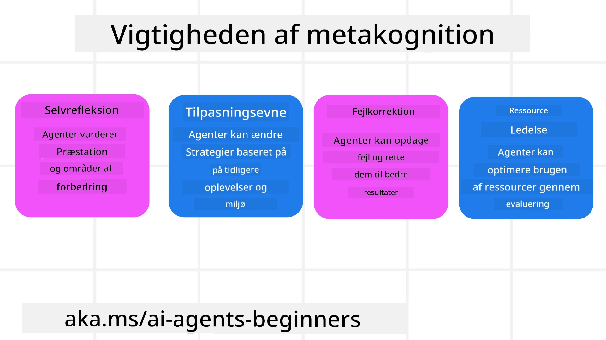
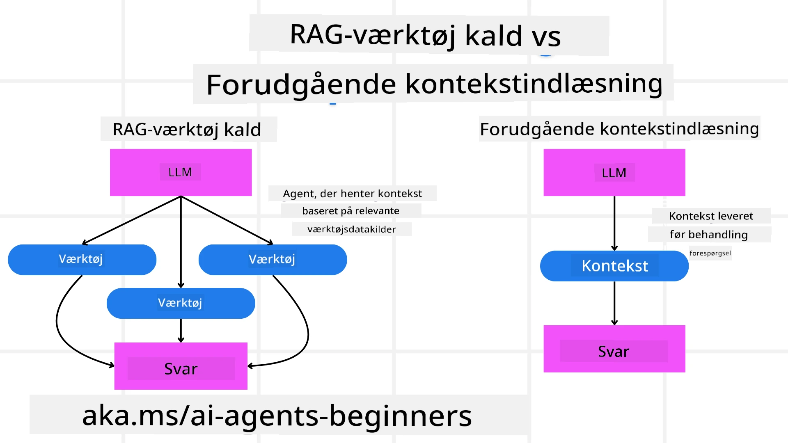

[](https://youtu.be/His9R6gw6Ec?si=3_RMb8VprNvdLRhX)

> _(Klik på billedet ovenfor for at se videoen af denne lektion)_
# Metakognition i AI-agenter

## Introduktion

Velkommen til lektionen om metakognition i AI-agenter! Dette kapitel er designet til begyndere, der er nysgerrige efter, hvordan AI-agenter kan tænke over deres egne tankeprocesser. Når du er færdig med denne lektion, vil du forstå nøglebegreber og være udstyret med praktiske eksempler til at anvende metakognition i design af AI-agenter.

## Læringsmål

Efter at have gennemført denne lektion vil du kunne:

1. Forstå implikationerne af ræsonneringsløkker i agentdefinitioner.
2. Bruge planlægnings- og evalueringsteknikker til at hjælpe selvkorrigerende agenter.
3. Skabe dine egne agenter, der er i stand til at manipulere kode for at udføre opgaver.

## Introduktion til Metakognition

Metakognition henviser til de højere ordens kognitive processer, der involverer at tænke over ens egen tænkning. For AI-agenter betyder det at kunne evaluere og justere deres handlinger baseret på selvbevidsthed og tidligere erfaringer. Metakognition, eller "at tænke over tænkning," er et vigtigt koncept i udviklingen af agentiske AI-systemer. Det indebærer, at AI-systemer er bevidste om deres egne interne processer og er i stand til at overvåge, regulere og tilpasse deres adfærd tilsvarende. Ligesom vi gør, når vi scanner rummet eller kigger på et problem. Denne selvbevidsthed kan hjælpe AI-systemer med at træffe bedre beslutninger, identificere fejl og forbedre deres præstation over tid - igen tilbage til Turing-testen og debatten om, hvorvidt AI vil overtage.

I forbindelse med agentiske AI-systemer kan metakognition hjælpe med at løse flere udfordringer, såsom:
- Gennemsigtighed: Sikre at AI-systemer kan forklare deres ræsonnement og beslutninger.
- Ræsonnering: Forbedre AI-systemers evne til at syntetisere information og træffe velbegrundede beslutninger.
- Tilpasning: Give AI-systemer mulighed for at tilpasse sig nye omgivelser og ændrede betingelser.
- Opfattelse: Forbedre nøjagtigheden af AI-systemer i at genkende og fortolke data fra deres omgivelser.

### Hvad er Metakognition?

Metakognition, eller "at tænke over tænkning," er en højere ordens kognitiv proces, der involverer selvbevidsthed og selvregulering af egne kognitive processer. Inden for AI giver metakognition agenter mulighed for at evaluere og tilpasse deres strategier og handlinger, hvilket fører til forbedrede problemløsnings- og beslutningsevner. Ved at forstå metakognition kan du designe AI-agenter, der ikke blot er mere intelligente, men også mere tilpasningsdygtige og effektive. I ægte metakognition vil du se AI eksplicit ræsonnere over sit eget ræsonnement.

Eksempel: “Jeg prioriterede billigere fly, fordi… Jeg måske går glip af direkte fly, så lad mig tjekke igen.”
Holde styr på hvordan eller hvorfor den valgte en bestemt rute.
- Notere, at den lavede fejl fordi den overdrev sin afhængighed af brugerpræferencer fra sidste gang, så den ændrer sin beslutningsstrategi, ikke bare den endelige anbefaling.
- Diagnosticere mønstre som, “Når jeg ser brugeren nævne ‘for overfyldt’, bør jeg ikke kun fjerne visse attraktioner, men også reflektere over, at min metode til at vælge ‘topattraktioner’ er fejlbehæftet, hvis jeg altid rangerer efter popularitet.”

### Vigtigheden af Metakognition i AI-agenter

Metakognition spiller en afgørende rolle i design af AI-agenter af flere grunde:



- Selvrefleksion: Agenter kan vurdere deres egen præstation og identificere forbedringsområder.
- Tilpasningsevne: Agenter kan ændre deres strategier baseret på tidligere erfaringer og skiftende omgivelser.
- Fejlkorrektion: Agenter kan selvstændigt opdage og rette fejl, hvilket fører til mere præcise resultater.
- Ressourcestyring: Agenter kan optimere brugen af ressourcer, såsom tid og beregningskraft, ved at planlægge og evaluere deres handlinger.

## Komponenten i en AI-Agent

Før du dykker ned i metakognitive processer, er det vigtigt at forstå de grundlæggende komponenter i en AI-agent. En AI-agent består typisk af:

- Persona: Agentens personlighed og egenskaber, som definerer, hvordan den interagerer med brugere.
- Værktøjer: De evner og funktioner, som agenten kan udføre.
- Kompetencer: Den viden og ekspertise, som agenten besidder.

Disse komponenter arbejder sammen for at skabe en "ekspertiseenhed", der kan udføre specifikke opgaver.

**Eksempel**:
Forestil dig en rejseagent, agenttjenester der ikke blot planlægger din ferie, men også justerer sin rute baseret på realtidsdata og tidligere kunderejseoplevelser.

### Eksempel: Metakognition i en Rejseagent-tjeneste

Forestil dig, at du designer en rejseagent-tjeneste drevet af AI. Denne agent, "Rejseagent," hjælper brugere med at planlægge deres ferier. For at inkorporere metakognition skal Rejseagent evaluere og justere sine handlinger baseret på selvbevidsthed og tidligere erfaringer. Sådan kunne metakognition spille en rolle:

#### Nuværende Opgave

Den aktuelle opgave er at hjælpe en bruger med at planlægge en rejse til Paris.

#### Trin til at Fuldføre Opgaven

1. **Indsamle brugerpræferencer**: Spørg brugeren om deres rejsedatoer, budget, interesser (f.eks. museer, mad, shopping) og eventuelle specifikke krav.
2. **Hente information**: Søg efter flymuligheder, overnatning, attraktioner og restauranter, der matcher brugerens præferencer.
3. **Generere anbefalinger**: Giv en personlig rejseplan med flydetaljer, hotelreservationer og foreslåede aktiviteter.
4. **Justere baseret på feedback**: Spørg brugeren om feedback på anbefalingerne og foretag nødvendige justeringer.

#### Nødvendige Ressourcer

- Adgang til databaser til fly- og hotelbooking.
- Information om attraktioner og restauranter i Paris.
- Brugerfeedbackdata fra tidligere interaktioner.

#### Erfaring og Selvrefleksion

Rejseagent bruger metakognition til at evaluere sin præstation og lære af tidligere erfaringer. For eksempel:

1. **Analyserer brugerfeedback**: Rejseagent gennemgår brugerfeedback for at afgøre, hvilke anbefalinger der blev godt modtaget, og hvilke der ikke gjorde. Den justerer sine fremtidige forslag herefter.
2. **Tilpasningsevne**: Hvis en bruger tidligere har nævnt, at de ikke kan lide overfyldte steder, vil Rejseagent undgå at anbefale populære turiststeder i myldretiden fremover.
3. **Fejlkorrektion**: Hvis Rejseagent lavede en fejl i en tidligere booking, som at foreslå et hotel, der var fuldt booket, lærer den at tjekke tilgængelighed mere grundigt, inden anbefalinger gives.

#### Praktisk Udviklereksempel

Her er et forenklet eksempel på, hvordan koden til Rejseagent kunne se ud, når den inkorporerer metakognition:

```python
class Travel_Agent:
    def __init__(self):
        self.user_preferences = {}
        self.experience_data = []

    def gather_preferences(self, preferences):
        self.user_preferences = preferences

    def retrieve_information(self):
        # Søg efter fly, hoteller og attraktioner baseret på præferencer
        flights = search_flights(self.user_preferences)
        hotels = search_hotels(self.user_preferences)
        attractions = search_attractions(self.user_preferences)
        return flights, hotels, attractions

    def generate_recommendations(self):
        flights, hotels, attractions = self.retrieve_information()
        itinerary = create_itinerary(flights, hotels, attractions)
        return itinerary

    def adjust_based_on_feedback(self, feedback):
        self.experience_data.append(feedback)
        # Analyser feedback og juster fremtidige anbefalinger
        self.user_preferences = adjust_preferences(self.user_preferences, feedback)

# Eksempel på brug
travel_agent = Travel_Agent()
preferences = {
    "destination": "Paris",
    "dates": "2025-04-01 to 2025-04-10",
    "budget": "moderate",
    "interests": ["museums", "cuisine"]
}
travel_agent.gather_preferences(preferences)
itinerary = travel_agent.generate_recommendations()
print("Suggested Itinerary:", itinerary)
feedback = {"liked": ["Louvre Museum"], "disliked": ["Eiffel Tower (too crowded)"]}
travel_agent.adjust_based_on_feedback(feedback)
```

#### Hvorfor Metakognition Betyder Noget

- **Selvrefleksion**: Agenter kan analysere deres præstation og identificere forbedringsområder.
- **Tilpasningsevne**: Agenter kan ændre strategier baseret på feedback og skiftende forhold.
- **Fejlkorrektion**: Agenter kan selvstændigt opdage og rette fejl.
- **Ressourcestyring**: Agenter kan optimere ressourceforbruget, som tid og beregningskraft.

Ved at inkorporere metakognition kan Rejseagent tilbyde mere personlige og præcise rejseanbefalinger og dermed forbedre brugeroplevelsen.

---

## 2. Planlægning i Agenter

Planlægning er en kritisk komponent i AI-agenters adfærd. Det involverer at skitsere de nødvendige trin for at nå et mål under hensyntagen til den aktuelle tilstand, ressourcer og mulige forhindringer.

### Elementer af Planlægning

- **Nuværende Opgave**: Definer opgaven klart.
- **Trin til at Fuldføre Opgaven**: Opdel opgaven i håndterbare trin.
- **Nødvendige Ressourcer**: Identificer nødvendige ressourcer.
- **Erfaring**: Brug tidligere erfaringer til at informere planlægningen.

**Eksempel**:
Her er de trin, Rejseagent skal tage for effektivt at hjælpe en bruger med at planlægge sin rejse:

### Trin for Rejseagent

1. **Indsamle brugerpræferencer**
   - Spørg brugeren om detaljer om deres rejsedatoer, budget, interesser og eventuelle specifikke krav.
   - Eksempler: "Hvornår planlægger du at rejse?" "Hvad er dit budget?" "Hvilke aktiviteter kan du lide på ferien?"

2. **Hente information**
   - Søg efter relevante rejsemuligheder baseret på brugerpræferencer.
   - **Fly**: Find tilgængelige fly inden for brugerens budget og ønskede rejsedatoer.
   - **Overnatning**: Find hoteller eller lejeboliger, som matcher brugerens præferencer for beliggenhed, pris og faciliteter.
   - **Attraktioner og restauranter**: Identificer populære attraktioner, aktiviteter og spisesteder, som falder i tråd med brugerens interesser.

3. **Generere anbefalinger**
   - Saml den indhentede information til en personlig rejseplan.
   - Giv detaljer som flymuligheder, hotelreservationer og foreslåede aktiviteter, tilpasset brugerens præferencer.

4. **Præsentere rejseplanen for brugeren**
   - Del den foreslåede rejseplan med brugeren til gennemsyn.
   - Eksempel: "Her er et foreslået rejseprogram til din tur til Paris. Det inkluderer flydetaljer, hotelbookinger og en liste over anbefalede aktiviteter og restauranter. Lad mig høre dine tanker!"

5. **Indsamle feedback**
   - Spørg brugeren om feedback på den foreslåede rejseplan.
   - Eksempler: "Kan du lide flymulighederne?" "Er hotellet passende for dine behov?" "Er der aktiviteter, du vil tilføje eller fjerne?"

6. **Juster baseret på feedback**
   - Juster rejseplanen baseret på brugerens feedback.
   - Foretag nødvendige ændringer i fly-, overnatnings- og aktivitetsanbefalingerne for bedre at matche brugerens ønsker.

7. **Endelig bekræftelse**
   - Præsenter den opdaterede rejseplan for brugeren til endelig godkendelse.
   - Eksempel: "Jeg har lavet ændringerne baseret på din feedback. Her er den opdaterede plan. Er alt i orden for dig?"

8. **Book og bekræft reservationer**
   - Når brugeren godkender planen, fortsæt med at booke fly, overnatning og eventuelle forudplanlagte aktiviteter.
   - Send bekræftelsesdetaljer til brugeren.

9. **Yde løbende support**
   - Vær tilgængelig for at hjælpe brugeren med ændringer eller yderligere ønsker før og under rejsen.
   - Eksempel: "Hvis du har brug for yderligere hjælp under din rejse, er du velkommen til at kontakte mig når som helst!"

### Eksempel på Interaktion

```python
class Travel_Agent:
    def __init__(self):
        self.user_preferences = {}
        self.experience_data = []

    def gather_preferences(self, preferences):
        self.user_preferences = preferences

    def retrieve_information(self):
        flights = search_flights(self.user_preferences)
        hotels = search_hotels(self.user_preferences)
        attractions = search_attractions(self.user_preferences)
        return flights, hotels, attractions

    def generate_recommendations(self):
        flights, hotels, attractions = self.retrieve_information()
        itinerary = create_itinerary(flights, hotels, attractions)
        return itinerary

    def adjust_based_on_feedback(self, feedback):
        self.experience_data.append(feedback)
        self.user_preferences = adjust_preferences(self.user_preferences, feedback)

# Eksempel på brug inden for en bookinganmodning
travel_agent = Travel_Agent()
preferences = {
    "destination": "Paris",
    "dates": "2025-04-01 to 2025-04-10",
    "budget": "moderate",
    "interests": ["museums", "cuisine"]
}
travel_agent.gather_preferences(preferences)
itinerary = travel_agent.generate_recommendations()
print("Suggested Itinerary:", itinerary)
feedback = {"liked": ["Louvre Museum"], "disliked": ["Eiffel Tower (too crowded)"]}
travel_agent.adjust_based_on_feedback(feedback)
```

## 3. Korrigerende RAG System

Lad os først starte med at forstå forskellen mellem RAG-værktøj og Forebyggende Kontekstindlæsning



### Retrieval-Augmented Generation (RAG)

RAG kombinerer et opslagsystem med en generativ model. Når en forespørgsel foretages, henter opslagsystemet relevante dokumenter eller data fra en ekstern kilde, og disse hentede oplysninger bruges til at udvide inputtet til den generative model. Dette hjælper modellen med at generere mere præcise og kontekstrelevante svar.

I et RAG-system henter agenten relevant information fra en vidensbase og bruger dette til at generere passende svar eller handlinger.

### Korrigerende RAG-Tilgang

Den korrigerende RAG-tilgang fokuserer på at bruge RAG-teknikker til at rette fejl og forbedre nøjagtigheden af AI-agenter. Dette indebærer:

1. **Prompting-teknik**: Brug af specifikke prompts til at guide agenten i at hente relevant information.
2. **Værktøj**: Implementering af algoritmer og mekanismer, der gør det muligt for agenten at evaluere relevansen af den hentede information og generere korrekte svar.
3. **Evaluering**: Kontinuerligt at vurdere agentens præstation og foretage justeringer for at forbedre dens nøjagtighed og effektivitet.

#### Eksempel: Korrigerende RAG i en Søgning Agent

Overvej en søgeagent, der henter information fra nettet for at besvare brugerforespørgsler. Den korrigerende RAG-tilgang kan involvere:

1. **Prompting-teknik**: Formulere søgeforespørgsler baseret på brugerens input.
2. **Værktøj**: Bruge naturlig sprogbehandling og maskinlæringsalgoritmer til at rangere og filtrere søgeresultater.
3. **Evaluering**: Analysere brugerfeedback for at identificere og rette unøjagtigheder i den hentede information.

### Korrigerende RAG i Rejseagent

Korrigerende RAG (Retrieval-Augmented Generation) forbedrer en AI's evne til at hente og generere information samtidig med at rette eventuelle unøjagtigheder. Lad os se, hvordan Rejseagent kan bruge den korrigerende RAG-tilgang til at levere mere præcise og relevante rejseanbefalinger.

Dette indebærer:

- **Prompting-teknik:** Brug af specifikke prompts til at guide agenten i at hente relevant information.
- **Værktøj:** Implementering af algoritmer og mekanismer, der gør det muligt for agenten at evaluere relevansen af den hentede information og generere præcise svar.
- **Evaluering:** Kontinuerligt at vurdere agentens præstation og foretage justeringer for at forbedre dens nøjagtighed og effektivitet.

#### Trin til Implementering af Korrigerende RAG i Rejseagent

1. **Initial brugerinteraktion**
   - Rejseagent indsamler brugerens indledende præferencer, såsom destination, rejsedatoer, budget og interesser.
   - Eksempel:

     ```python
     preferences = {
         "destination": "Paris",
         "dates": "2025-04-01 to 2025-04-10",
         "budget": "moderate",
         "interests": ["museums", "cuisine"]
     }
     ```

2. **Hentning af information**
   - Rejseagent henter information om fly, overnatning, attraktioner og restauranter baseret på brugerens præferencer.
   - Eksempel:

     ```python
     flights = search_flights(preferences)
     hotels = search_hotels(preferences)
     attractions = search_attractions(preferences)
     ```

3. **Generering af indledende anbefalinger**
   - Rejseagent bruger den hentede information til at generere en personlig rejseplan.
   - Eksempel:

     ```python
     itinerary = create_itinerary(flights, hotels, attractions)
     print("Suggested Itinerary:", itinerary)
     ```

4. **Indsamling af brugerfeedback**
   - Rejseagent spørger brugeren om feedback på de indledende anbefalinger.
   - Eksempel:

     ```python
     feedback = {
         "liked": ["Louvre Museum"],
         "disliked": ["Eiffel Tower (too crowded)"]
     }
     ```

5. **Korrigerende RAG-proces**
   - **Prompting-teknik**: Rejseagent formulerer nye søgeforespørgsler baseret på brugerens feedback.
     - Eksempel:

       ```python
       if "disliked" in feedback:
           preferences["avoid"] = feedback["disliked"]
       ```

   - **Værktøj**: Rejseagent bruger algoritmer til at rangere og filtrere nye søgeresultater med fokus på relevans i forhold til brugerfeedback.
     - Eksempel:

       ```python
       new_attractions = search_attractions(preferences)
       new_itinerary = create_itinerary(flights, hotels, new_attractions)
       print("Updated Itinerary:", new_itinerary)
       ```

   - **Evaluering**: Rejseagent vurderer løbende relevansen og nøjagtigheden af sine anbefalinger ved at analysere brugerfeedback og foretage nødvendige justeringer.
     - Eksempel:

       ```python
       def adjust_preferences(preferences, feedback):
           if "liked" in feedback:
               preferences["favorites"] = feedback["liked"]
           if "disliked" in feedback:
               preferences["avoid"] = feedback["disliked"]
           return preferences

       preferences = adjust_preferences(preferences, feedback)
       ```

#### Praktisk eksempel

Her er et forenklet Python-eksempel, der inkorporerer den korrigerende RAG-tilgang i Rejseagent:

```python
class Travel_Agent:
    def __init__(self):
        self.user_preferences = {}
        self.experience_data = []

    def gather_preferences(self, preferences):
        self.user_preferences = preferences

    def retrieve_information(self):
        flights = search_flights(self.user_preferences)
        hotels = search_hotels(self.user_preferences)
        attractions = search_attractions(self.user_preferences)
        return flights, hotels, attractions

    def generate_recommendations(self):
        flights, hotels, attractions = self.retrieve_information()
        itinerary = create_itinerary(flights, hotels, attractions)
        return itinerary

    def adjust_based_on_feedback(self, feedback):
        self.experience_data.append(feedback)
        self.user_preferences = adjust_preferences(self.user_preferences, feedback)
        new_itinerary = self.generate_recommendations()
        return new_itinerary

# Eksempel på brug
travel_agent = Travel_Agent()
preferences = {
    "destination": "Paris",
    "dates": "2025-04-01 to 2025-04-10",
    "budget": "moderate",
    "interests": ["museums", "cuisine"]
}
travel_agent.gather_preferences(preferences)
itinerary = travel_agent.generate_recommendations()
print("Suggested Itinerary:", itinerary)
feedback = {"liked": ["Louvre Museum"], "disliked": ["Eiffel Tower (too crowded)"]}
new_itinerary = travel_agent.adjust_based_on_feedback(feedback)
print("Updated Itinerary:", new_itinerary)
```

### Forebyggende Kontekstindlæsning
Forudindlæst Kontekst indebærer at indlæse relevant kontekst eller baggrundsinformation i modellen, før en forespørgsel behandles. Det betyder, at modellen har adgang til denne information fra starten, hvilket kan hjælpe den med at generere mere informerede svar uden at skulle hente yderligere data under processen.

Her er et forenklet eksempel på, hvordan en forudindlæst kontekst kunne se ud for en rejseagentur-applikation i Python:

```python
class TravelAgent:
    def __init__(self):
        # Forindlæs populære destinationer og deres information
        self.context = {
            "Paris": {"country": "France", "currency": "Euro", "language": "French", "attractions": ["Eiffel Tower", "Louvre Museum"]},
            "Tokyo": {"country": "Japan", "currency": "Yen", "language": "Japanese", "attractions": ["Tokyo Tower", "Shibuya Crossing"]},
            "New York": {"country": "USA", "currency": "Dollar", "language": "English", "attractions": ["Statue of Liberty", "Times Square"]},
            "Sydney": {"country": "Australia", "currency": "Dollar", "language": "English", "attractions": ["Sydney Opera House", "Bondi Beach"]}
        }

    def get_destination_info(self, destination):
        # Hent destinationsinformation fra forindlæst kontekst
        info = self.context.get(destination)
        if info:
            return f"{destination}:\nCountry: {info['country']}\nCurrency: {info['currency']}\nLanguage: {info['language']}\nAttractions: {', '.join(info['attractions'])}"
        else:
            return f"Sorry, we don't have information on {destination}."

# Eksempel på brug
travel_agent = TravelAgent()
print(travel_agent.get_destination_info("Paris"))
print(travel_agent.get_destination_info("Tokyo"))
```

#### Forklaring

1. **Initialisering (`__init__` metode)**: Klassen `TravelAgent` forudindlæser en ordbog med oplysninger om populære destinationer som Paris, Tokyo, New York og Sydney. Denne ordbog indeholder detaljer som land, valuta, sprog og større attraktioner for hver destination.

2. **Hentning af information (`get_destination_info` metode)**: Når en bruger spørger om en bestemt destination, henter metoden `get_destination_info` de relevante oplysninger fra den forudindlæste kontekstordbog.

Ved at forudindlæse konteksten kan rejseagentur-applikationen hurtigt svare på brugerens forespørgsler uden at skulle hente denne information fra en ekstern kilde i realtid. Det gør applikationen mere effektiv og responsiv.

### Opstart af Plan med et Mål Før Iteration

Opstart af en plan med et mål indebærer at starte med et klart formål eller ønsket resultat for øje. Ved at definere dette mål på forhånd kan modellen bruge det som en vejledende princip gennem den iterative proces. Dette sikrer, at hver iteration bevæger sig tættere på at opnå det ønskede resultat, hvilket gør processen mere effektiv og fokuseret.

Her er et eksempel på, hvordan du kan opstarte en rejseplan med et mål, før du itererer, for en rejseagent i Python:

### Scenario

En rejseagent ønsker at planlægge en skræddersyet ferie for en klient. Målet er at skabe en rejseplan, der maksimerer klientens tilfredshed baseret på deres præferencer og budget.

### Trin

1. Definér klientens præferencer og budget.
2. Opstart den indledende plan baseret på disse præferencer.
3. Iterér for at forfine planen og optimere for klientens tilfredshed.

#### Python-kode

```python
class TravelAgent:
    def __init__(self, destinations):
        self.destinations = destinations

    def bootstrap_plan(self, preferences, budget):
        plan = []
        total_cost = 0

        for destination in self.destinations:
            if total_cost + destination['cost'] <= budget and self.match_preferences(destination, preferences):
                plan.append(destination)
                total_cost += destination['cost']

        return plan

    def match_preferences(self, destination, preferences):
        for key, value in preferences.items():
            if destination.get(key) != value:
                return False
        return True

    def iterate_plan(self, plan, preferences, budget):
        for i in range(len(plan)):
            for destination in self.destinations:
                if destination not in plan and self.match_preferences(destination, preferences) and self.calculate_cost(plan, destination) <= budget:
                    plan[i] = destination
                    break
        return plan

    def calculate_cost(self, plan, new_destination):
        return sum(destination['cost'] for destination in plan) + new_destination['cost']

# Eksempel på brug
destinations = [
    {"name": "Paris", "cost": 1000, "activity": "sightseeing"},
    {"name": "Tokyo", "cost": 1200, "activity": "shopping"},
    {"name": "New York", "cost": 900, "activity": "sightseeing"},
    {"name": "Sydney", "cost": 1100, "activity": "beach"},
]

preferences = {"activity": "sightseeing"}
budget = 2000

travel_agent = TravelAgent(destinations)
initial_plan = travel_agent.bootstrap_plan(preferences, budget)
print("Initial Plan:", initial_plan)

refined_plan = travel_agent.iterate_plan(initial_plan, preferences, budget)
print("Refined Plan:", refined_plan)
```

#### Kodeforklaring

1. **Initialisering (`__init__` metode)**: Klassen `TravelAgent` initialiseres med en liste af potentielle destinationer, som hver har attributter som navn, pris og aktivitetstype.

2. **Opstart af planen (`bootstrap_plan` metode)**: Denne metode skaber en indledende rejseplan baseret på klientens præferencer og budget. Den itererer gennem listen af destinationer og tilføjer dem til planen, hvis de matcher klientens præferencer og passer inden for budgettet.

3. **Matchning af præferencer (`match_preferences` metode)**: Denne metode tjekker, om en destination matcher klientens præferencer.

4. **Iteration af planen (`iterate_plan` metode)**: Denne metode forfiner den indledende plan ved at prøve at erstatte hver destination i planen med et bedre match, under hensyntagen til klientens præferencer og budgetbegrænsninger.

5. **Beregning af omkostninger (`calculate_cost` metode)**: Denne metode udregner de samlede omkostninger for den nuværende plan, inklusive en potentiel ny destination.

#### Eksempel på brug

- **Indledende plan**: Rejseagenten laver en indledende plan baseret på klientens præferencer for sightseeing og et budget på $2000.
- **Forfinet plan**: Rejseagenten itererer planen og optimerer for klientens præferencer og budget.

Ved at opstarte planen med et klart mål (f.eks. at maksimere klienttilfredshed) og iterere for at forfine planen, kan rejseagenten skabe en skræddersyet og optimeret rejseplan til klienten. Denne tilgang sikrer, at rejseplanen stemmer overens med klientens præferencer og budget fra starten og forbedres ved hver iteration.

### Udnyt LLM til Omrangering og Scoring

Store Sprogmodeller (LLMs) kan bruges til omrangering og scoring ved at evaluere relevansen og kvaliteten af hentede dokumenter eller genererede svar. Sådan fungerer det:

**Hentning:** Det indledende hentetrin henter et sæt kandidatlister eller svar baseret på forespørgslen.

**Omrangering:** LLM’en evaluerer disse kandidater og omrangerer dem baseret på deres relevans og kvalitet. Dette sikrer, at den mest relevante og højkvalitetsinformation præsenteres først.

**Scoring:** LLM’en tildeler scorer til hver kandidat, som afspejler deres relevans og kvalitet. Dette hjælper med at vælge det bedste svar eller dokument til brugeren.

Ved at anvende LLM’er til omrangering og scoring kan systemet levere mere præcis og kontekstuelt relevant information, hvilket forbedrer brugeroplevelsen.

Her er et eksempel på, hvordan en rejseagent kan bruge en Stor Sprogmodel (LLM) til omrangering og scoring af rejsedestinationer baseret på brugerpræferencer i Python:

#### Scenario – Rejse baseret på præferencer

En rejseagent ønsker at anbefale de bedste rejsedestinationer til en klient baseret på deres præferencer. LLM’en vil hjælpe med at omrangere og score destinationerne, så de mest relevante muligheder præsenteres.

#### Trin:

1. Indsamle brugerpræferencer.
2. Hente en liste over potentielle rejsedestinationer.
3. Bruge LLM til at omrangere og score destinationerne baseret på brugerpræferencer.

Her er, hvordan du kan opdatere det tidligere eksempel til at bruge Azure OpenAI Services:

#### Krav

1. Du skal have et Azure-abonnement.
2. Opret en Azure OpenAI-ressource og få din API-nøgle.

#### Eksempel på Python-kode

```python
import requests
import json

class TravelAgent:
    def __init__(self, destinations):
        self.destinations = destinations

    def get_recommendations(self, preferences, api_key, endpoint):
        # Generer en prompt til Azure OpenAI
        prompt = self.generate_prompt(preferences)
        
        # Definer headers og payload til forespørgslen
        headers = {
            'Content-Type': 'application/json',
            'Authorization': f'Bearer {api_key}'
        }
        payload = {
            "prompt": prompt,
            "max_tokens": 150,
            "temperature": 0.7
        }
        
        # Kald Azure OpenAI API'et for at få de omklassificerede og vurderede destinationer
        response = requests.post(endpoint, headers=headers, json=payload)
        response_data = response.json()
        
        # Uddrag og returner anbefalingerne
        recommendations = response_data['choices'][0]['text'].strip().split('\n')
        return recommendations

    def generate_prompt(self, preferences):
        prompt = "Here are the travel destinations ranked and scored based on the following user preferences:\n"
        for key, value in preferences.items():
            prompt += f"{key}: {value}\n"
        prompt += "\nDestinations:\n"
        for destination in self.destinations:
            prompt += f"- {destination['name']}: {destination['description']}\n"
        return prompt

# Eksempel på brug
destinations = [
    {"name": "Paris", "description": "City of lights, known for its art, fashion, and culture."},
    {"name": "Tokyo", "description": "Vibrant city, famous for its modernity and traditional temples."},
    {"name": "New York", "description": "The city that never sleeps, with iconic landmarks and diverse culture."},
    {"name": "Sydney", "description": "Beautiful harbour city, known for its opera house and stunning beaches."},
]

preferences = {"activity": "sightseeing", "culture": "diverse"}
api_key = 'your_azure_openai_api_key'
endpoint = 'https://your-endpoint.com/openai/deployments/your-deployment-name/completions?api-version=2022-12-01'

travel_agent = TravelAgent(destinations)
recommendations = travel_agent.get_recommendations(preferences, api_key, endpoint)
print("Recommended Destinations:")
for rec in recommendations:
    print(rec)
```

#### Kodeforklaring – Præferencebooker

1. **Initialisering**: Klassen `TravelAgent` initialiseres med en liste over potentielle rejsedestinationer, som hver har attributter som navn og beskrivelse.

2. **Hentning af anbefalinger (`get_recommendations` metode)**: Denne metode genererer en prompt til Azure OpenAI-tjenesten baseret på brugerens præferencer og laver et HTTP POST-kald til Azure OpenAI API for at få omrangere og scorede destinationer.

3. **Generering af prompt (`generate_prompt` metode)**: Denne metode konstruerer en prompt til Azure OpenAI, som inkluderer brugerens præferencer og listen af destinationer. Prompten guider modellen til at omrangere og score destinationerne baseret på de angivne præferencer.

4. **API-kald**: Biblioteket `requests` bruges til at lave et HTTP POST-kald til Azure OpenAI API-endpointet. Svaret indeholder de omrangere og scorede destinationer.

5. **Eksempel på brug**: Rejseagenten indsamler brugerpræferencer (f.eks. interesse i sightseeing og mangfoldig kultur) og bruger Azure OpenAI-tjenesten til at få omrangere og scorede anbefalinger for rejsedestinationer.

Husk at erstatte `your_azure_openai_api_key` med din faktiske Azure OpenAI API-nøgle og `https://your-endpoint.com/...` med den faktiske endpoint-URL for din Azure OpenAI-udrulning.

Ved at anvende LLM til omrangering og scoring kan rejseagenten give mere personlige og relevante rejseanbefalinger til klienter, hvilket forbedrer deres samlede oplevelse.

### RAG: Prompting-teknik vs. Værktøj

Retrieval-Augmented Generation (RAG) kan både være en prompting-teknik og et værktøj i udviklingen af AI-agenter. Forståelse af forskellen mellem de to kan hjælpe dig med at udnytte RAG mere effektivt i dine projekter.

#### RAG som prompting-teknik

**Hvad er det?**

- Som en prompting-teknik indebærer RAG at formulere specifikke forespørgsler eller prompts for at guide hentning af relevant information fra en stor korpus eller database. Denne information bruges derefter til at generere svar eller handlinger.

**Sådan fungerer det:**

1. **Formuler prompts**: Opret velstrukturerede prompts eller forespørgsler baseret på opgaven eller brugerens input.
2. **Hent information**: Brug prompts til at søge efter relevant data i en eksisterende vidensbase eller datasæt.
3. **Generer svar**: Kombiner den hentede information med generative AI-modeller for at producere et omfattende og sammenhængende svar.

**Eksempel i rejseagent:**

- Brugerinput: "Jeg vil besøge museer i Paris."
- Prompt: "Find de bedste museer i Paris."
- Hentet information: Oplysninger om Louvre Museum, Musée d'Orsay osv.
- Genereret svar: "Her er nogle topmuseer i Paris: Louvre Museum, Musée d'Orsay og Centre Pompidou."

#### RAG som værktøj

**Hvad er det?**

- Som et værktøj er RAG et integreret system, der automatiserer hentnings- og genereringsprocessen, hvilket gør det lettere for udviklere at implementere komplekse AI-funktionaliteter uden manuelt at skulle skabe prompts til hver forespørgsel.

**Sådan fungerer det:**

1. **Integration**: Integrer RAG i AI-agentens arkitektur, så den automatisk kan håndtere hentnings- og genereringsopgaver.
2. **Automatisering**: Værktøjet styrer hele processen, fra modtagelse af brugerinput til generering af det endelige svar, uden at kræve eksplicitte prompts for hvert trin.
3. **Effektivitet**: Forbedrer agentens ydeevne ved at strømline hentnings- og genereringsprocessen, hvilket muliggør hurtigere og mere præcise svar.

**Eksempel i rejseagent:**

- Brugerinput: "Jeg vil besøge museer i Paris."
- RAG-værktøj: Henter automatisk information om museer og genererer et svar.
- Genereret svar: "Her er nogle topmuseer i Paris: Louvre Museum, Musée d'Orsay og Centre Pompidou."

### Sammenligning

| Aspekt                 | Prompting-teknik                                             | Værktøj                                               |
|------------------------|--------------------------------------------------------------|-------------------------------------------------------|
| **Manuelt vs Automatisk**| Manuel formulering af prompts for hver forespørgsel.         | Automatiseret proces for hentning og generering.      |
| **Kontrol**             | Giver mere kontrol over hentningsprocessen.                  | Strømliner og automatiserer hentning og generering.  |
| **Fleksibilitet**       | Muliggør tilpassede prompts baseret på specifikke behov.     | Mere effektivt til storskala implementeringer.        |
| **Kompleksitet**        | Kræver udformning og tilpasning af prompts.                  | Nemtere at integrere i AI-agentens arkitektur.        |

### Praktiske eksempler

**Prompting-teknik eksempel:**

```python
def search_museums_in_paris():
    prompt = "Find top museums in Paris"
    search_results = search_web(prompt)
    return search_results

museums = search_museums_in_paris()
print("Top Museums in Paris:", museums)
```

**Værktøjseksempel:**

```python
class Travel_Agent:
    def __init__(self):
        self.rag_tool = RAGTool()

    def get_museums_in_paris(self):
        user_input = "I want to visit museums in Paris."
        response = self.rag_tool.retrieve_and_generate(user_input)
        return response

travel_agent = Travel_Agent()
museums = travel_agent.get_museums_in_paris()
print("Top Museums in Paris:", museums)
```

### Evaluering af Relevans

Evaluering af relevans er en afgørende del af AI-agenters ydeevne. Det sikrer, at informationen, som agenten henter og genererer, er passende, korrekt og nyttig for brugeren. Lad os udforske, hvordan man kan evaluere relevans i AI-agenter, inklusive praktiske eksempler og teknikker.

#### Centrale begreber i evaluering af relevans

1. **Kontekstforståelse**:
   - Agenten skal forstå konteksten i brugerens forespørgsel for at hente og generere relevant information.
   - Eksempel: Hvis en bruger spørger om "bedste restauranter i Paris," bør agenten tage højde for brugerens præferencer, såsom køkkentype og budget.

2. **Nøjagtighed**:
   - Oplysningerne, der leveres af agenten, skal være faktuelt korrekte og opdaterede.
   - Eksempel: Anbefale restauranter, der aktuelt er åbne med gode anmeldelser, frem for forældede eller lukkede muligheder.

3. **Brugerintention**:
   - Agenten skal afkode brugerens intention bag forespørgslen for at levere den mest relevante information.
   - Eksempel: Hvis brugeren spørger om "budgetvenlige hoteller," bør agenten prioritere overkommelige muligheder.

4. **Feedback-loop**:
   - Løbende indsamling og analyse af brugerfeedback hjælper agenten med at forbedre sin relevansvurdering.
   - Eksempel: Inkorporere brugerbedømmelser og feedback på tidligere anbefalinger for at forbedre fremtidige svar.

#### Praktiske teknikker til evaluering af relevans

1. **Relevansscore**:
   - Tildel en relevansscore til hvert hentet element baseret på, hvor godt det matcher brugerens forespørgsel og præferencer.
   - Eksempel:

     ```python
     def relevance_score(item, query):
         score = 0
         if item['category'] in query['interests']:
             score += 1
         if item['price'] <= query['budget']:
             score += 1
         if item['location'] == query['destination']:
             score += 1
         return score
     ```

2. **Filtrering og rangering**:
   - Filtrer irrelevante elementer fra, og ranger de resterende baseret på deres relevansscore.
   - Eksempel:

     ```python
     def filter_and_rank(items, query):
         ranked_items = sorted(items, key=lambda item: relevance_score(item, query), reverse=True)
         return ranked_items[:10]  # Returner top 10 relevante elementer
     ```

3. **Naturlig sprogbehandling (NLP)**:
   - Brug NLP-teknikker til at forstå brugerens forespørgsel og hente relevant information.
   - Eksempel:

     ```python
     def process_query(query):
         # Brug NLP til at udtrække nøgleinformation fra brugerens forespørgsel
         processed_query = nlp(query)
         return processed_query
     ```

4. **Brugerfeedback-integration**:
   - Indsaml brugerfeedback på de leverede anbefalinger og brug det til at justere fremtidige relevansvurderinger.
   - Eksempel:

     ```python
     def adjust_based_on_feedback(feedback, items):
         for item in items:
             if item['name'] in feedback['liked']:
                 item['relevance'] += 1
             if item['name'] in feedback['disliked']:
                 item['relevance'] -= 1
         return items
     ```

#### Eksempel: Evaluering af relevans i rejseagent

Her er et praktisk eksempel på, hvordan Travel Agent kan evaluere relevansen af rejseanbefalinger:

```python
class Travel_Agent:
    def __init__(self):
        self.user_preferences = {}
        self.experience_data = []

    def gather_preferences(self, preferences):
        self.user_preferences = preferences

    def retrieve_information(self):
        flights = search_flights(self.user_preferences)
        hotels = search_hotels(self.user_preferences)
        attractions = search_attractions(self.user_preferences)
        return flights, hotels, attractions

    def generate_recommendations(self):
        flights, hotels, attractions = self.retrieve_information()
        ranked_hotels = self.filter_and_rank(hotels, self.user_preferences)
        itinerary = create_itinerary(flights, ranked_hotels, attractions)
        return itinerary

    def filter_and_rank(self, items, query):
        ranked_items = sorted(items, key=lambda item: self.relevance_score(item, query), reverse=True)
        return ranked_items[:10]  # Returner top 10 relevante elementer

    def relevance_score(self, item, query):
        score = 0
        if item['category'] in query['interests']:
            score += 1
        if item['price'] <= query['budget']:
            score += 1
        if item['location'] == query['destination']:
            score += 1
        return score

    def adjust_based_on_feedback(self, feedback, items):
        for item in items:
            if item['name'] in feedback['liked']:
                item['relevance'] += 1
            if item['name'] in feedback['disliked']:
                item['relevance'] -= 1
        return items

# Eksempel på brug
travel_agent = Travel_Agent()
preferences = {
    "destination": "Paris",
    "dates": "2025-04-01 to 2025-04-10",
    "budget": "moderate",
    "interests": ["museums", "cuisine"]
}
travel_agent.gather_preferences(preferences)
itinerary = travel_agent.generate_recommendations()
print("Suggested Itinerary:", itinerary)
feedback = {"liked": ["Louvre Museum"], "disliked": ["Eiffel Tower (too crowded)"]}
updated_items = travel_agent.adjust_based_on_feedback(feedback, itinerary['hotels'])
print("Updated Itinerary with Feedback:", updated_items)
```

### Søge med Intention

At søge med intention indebærer at forstå og fortolke det underliggende formål eller mål bag en brugers forespørgsel for at hente og generere den mest relevante og nyttige information. Denne tilgang går ud over blot at matche nøgleord og fokuserer på at opfange brugerens faktiske behov og kontekst.

#### Centrale begreber i søgning med intention

1. **Forståelse af brugerintention**:
   - Brugerintention kan inddeles i tre hovedtyper: informationssøgende, navigationsbaseret og transaktionel.
     - **Informationssøgende intention**: Brugeren søger oplysninger om et emne (f.eks. "Hvad er de bedste museer i Paris?").
     - **Navigationsintention**: Brugeren ønsker at navigere til en bestemt hjemmeside eller side (f.eks. "Louvre Museums officielle hjemmeside").
     - **Transaktionel intention**: Brugeren sigter mod at udføre en handling, som at booke en flyrejse eller foretage et køb (f.eks. "Book en flyrejse til Paris").

2. **Kontekstforståelse**:
   - Analyse af konteksten i brugerens forespørgsel hjælper med at identificere deres intention præcist. Dette inkluderer tidligere interaktioner, brugerpræferencer og de specifikke detaljer i den aktuelle forespørgsel.

3. **Naturlig sprogbehandling (NLP)**:
   - NLP-teknikker anvendes til at forstå og fortolke de naturlige sprogforespørgsler, som brugere leverer. Dette inkluderer opgaver som entitetsgenkendelse, sentimentanalyse og forespørgselsparsing.

4. **Personalisering**:
   - Tilpasning af søgeresultaterne baseret på brugerens historik, præferencer og feedback forbedrer relevansen af den hentede information.

#### Praktisk eksempel: Søge med intention i rejseagent

Lad os tage Travel Agent som eksempel for at se, hvordan søgning med intention kan implementeres.

1. **Indsamling af brugerpræferencer**

   ```python
   class Travel_Agent:
       def __init__(self):
           self.user_preferences = {}

       def gather_preferences(self, preferences):
           self.user_preferences = preferences
   ```

2. **Forståelse af brugerintention**

   ```python
   def identify_intent(query):
       if "book" in query or "purchase" in query:
           return "transactional"
       elif "website" in query or "official" in query:
           return "navigational"
       else:
           return "informational"
   ```

3. **Kontekstforståelse**
   ```python
   def analyze_context(query, user_history):
       # Kombiner den aktuelle forespørgsel med brugerens historik for at forstå konteksten
       context = {
           "current_query": query,
           "user_history": user_history
       }
       return context
   ```

4. **Søg og personaliser resultater**

   ```python
   def search_with_intent(query, preferences, user_history):
       intent = identify_intent(query)
       context = analyze_context(query, user_history)
       if intent == "informational":
           search_results = search_information(query, preferences)
       elif intent == "navigational":
           search_results = search_navigation(query)
       elif intent == "transactional":
           search_results = search_transaction(query, preferences)
       personalized_results = personalize_results(search_results, user_history)
       return personalized_results

   def search_information(query, preferences):
       # Eksempel på søgelogik for informationsformål
       results = search_web(f"best {preferences['interests']} in {preferences['destination']}")
       return results

   def search_navigation(query):
       # Eksempel på søgelogik for navigationsformål
       results = search_web(query)
       return results

   def search_transaction(query, preferences):
       # Eksempel på søgelogik for transaktionsformål
       results = search_web(f"book {query} to {preferences['destination']}")
       return results

   def personalize_results(results, user_history):
       # Eksempel på personaliseringslogik
       personalized = [result for result in results if result not in user_history]
       return personalized[:10]  # Returner top 10 personaliserede resultater
   ```

5. **Eksempel på brug**

   ```python
   travel_agent = Travel_Agent()
   preferences = {
       "destination": "Paris",
       "interests": ["museums", "cuisine"]
   }
   travel_agent.gather_preferences(preferences)
   user_history = ["Louvre Museum website", "Book flight to Paris"]
   query = "best museums in Paris"
   results = search_with_intent(query, preferences, user_history)
   print("Search Results:", results)
   ```

---

## 4. Generering af kode som et værktøj

Kodegenererende agenter bruger AI-modeller til at skrive og udføre kode, løse komplekse problemer og automatisere opgaver.

### Kodegenererende Agenter

Kodegenererende agenter bruger generative AI-modeller til at skrive og udføre kode. Disse agenter kan løse komplekse problemer, automatisere opgaver og give værdifulde indsigter ved at generere og køre kode i forskellige programmeringssprog.

#### Praktiske Anvendelser

1. **Automatiseret kodegenerering**: Generer kodestykker til specifikke opgaver, såsom dataanalyse, web scraping eller maskinlæring.
2. **SQL som en RAG**: Brug SQL-forespørgsler til at hente og manipulere data fra databaser.
3. **Problemløsning**: Opret og udfør kode for at løse specifikke problemer, såsom optimering af algoritmer eller dataanalyse.

#### Eksempel: Kodegenererende Agent til Dataanalyse

Forestil dig, at du designer en kodegenererende agent. Sådan kunne den fungere:

1. **Opgave**: Analysere et datasæt for at identificere tendenser og mønstre.
2. **Trin**:
   - Indlæs datasættet i et dataanalysetool.
   - Generer SQL-forespørgsler for at filtrere og aggregere dataene.
   - Udfør forespørgslerne og hent resultaterne.
   - Brug resultaterne til at generere visualiseringer og indsigter.
3. **Nødvendige ressourcer**: Adgang til datasættet, dataanalysetools og SQL-muligheder.
4. **Erfaring**: Brug tidligere analyseresultater til at forbedre nøjagtigheden og relevansen af fremtidige analyser.

### Eksempel: Kodegenererende Agent til Rejseagent

I dette eksempel designer vi en kodegenererende agent, Rejseagenten, til at hjælpe brugere med at planlægge deres rejse ved at generere og udføre kode. Denne agent kan håndtere opgaver som at hente rejsemuligheder, filtrere resultater og samle en rejseplan ved hjælp af generativ AI.

#### Oversigt over Kodegenererende Agent

1. **Indsamling af brugerpræferencer**: Indsamler brugerinput såsom destination, rejsedatoer, budget og interesser.
2. **Generering af kode til datahentning**: Genererer kodestykker til at hente data om fly, hoteller og attraktioner.
3. **Udførelse af genereret kode**: Kører den genererede kode for at hente realtidsinformation.
4. **Generering af rejseplan**: Sammensætter de hentede data til en personlig rejseplan.
5. **Justering baseret på feedback**: Modtager brugerfeedback og regenererer kode om nødvendigt for at forfine resultaterne.

#### Trin-for-trin Implementering

1. **Indsamling af brugerpræferencer**

   ```python
   class Travel_Agent:
       def __init__(self):
           self.user_preferences = {}

       def gather_preferences(self, preferences):
           self.user_preferences = preferences
   ```

2. **Generering af kode til datahentning**

   ```python
   def generate_code_to_fetch_data(preferences):
       # Eksempel: Generer kode til at søge efter fly baseret på brugerpræferencer
       code = f"""
       def search_flights():
           import requests
           response = requests.get('https://api.example.com/flights', params={preferences})
           return response.json()
       """
       return code

   def generate_code_to_fetch_hotels(preferences):
       # Eksempel: Generer kode til at søge efter hoteller
       code = f"""
       def search_hotels():
           import requests
           response = requests.get('https://api.example.com/hotels', params={preferences})
           return response.json()
       """
       return code
   ```

3. **Udførelse af genereret kode**

   ```python
   def execute_code(code):
       # Kør den genererede kode ved hjælp af exec
       exec(code)
       result = locals()
       return result

   travel_agent = Travel_Agent()
   preferences = {
       "destination": "Paris",
       "dates": "2025-04-01 to 2025-04-10",
       "budget": "moderate",
       "interests": ["museums", "cuisine"]
   }
   travel_agent.gather_preferences(preferences)
   
   flight_code = generate_code_to_fetch_data(preferences)
   hotel_code = generate_code_to_fetch_hotels(preferences)
   
   flights = execute_code(flight_code)
   hotels = execute_code(hotel_code)

   print("Flight Options:", flights)
   print("Hotel Options:", hotels)
   ```

4. **Generering af rejseplan**

   ```python
   def generate_itinerary(flights, hotels, attractions):
       itinerary = {
           "flights": flights,
           "hotels": hotels,
           "attractions": attractions
       }
       return itinerary

   attractions = search_attractions(preferences)
   itinerary = generate_itinerary(flights, hotels, attractions)
   print("Suggested Itinerary:", itinerary)
   ```

5. **Justering baseret på feedback**

   ```python
   def adjust_based_on_feedback(feedback, preferences):
       # Juster præferencer baseret på brugerfeedback
       if "liked" in feedback:
           preferences["favorites"] = feedback["liked"]
       if "disliked" in feedback:
           preferences["avoid"] = feedback["disliked"]
       return preferences

   feedback = {"liked": ["Louvre Museum"], "disliked": ["Eiffel Tower (too crowded)"]}
   updated_preferences = adjust_based_on_feedback(feedback, preferences)
   
   # Generer og udfør kode med opdaterede præferencer igen
   updated_flight_code = generate_code_to_fetch_data(updated_preferences)
   updated_hotel_code = generate_code_to_fetch_hotels(updated_preferences)
   
   updated_flights = execute_code(updated_flight_code)
   updated_hotels = execute_code(updated_hotel_code)
   
   updated_itinerary = generate_itinerary(updated_flights, updated_hotels, attractions)
   print("Updated Itinerary:", updated_itinerary)
   ```

### Udnyttelse af miljøbevidsthed og ræsonnering

Baseret på skemaet for tabellen kan processen med forespørgselsgenerering faktisk forbedres ved at udnytte miljøbevidsthed og ræsonnering.

Her er et eksempel på, hvordan dette kan gøres:

1. **Forståelse af skemaet**: Systemet forstår tabelskemaet og bruger disse oplysninger til at forankre forespørgselsgenereringen.
2. **Justering baseret på feedback**: Systemet justerer brugerpræferencer baseret på feedback og vurderer, hvilke felter i skemaet der skal opdateres.
3. **Generering og udførelse af forespørgsler**: Systemet genererer og udfører forespørgsler for at hente opdaterede data om fly og hoteller baseret på de nye præferencer.

Her er et opdateret Python-kodeeksempel, der inkorporerer disse koncepter:

```python
def adjust_based_on_feedback(feedback, preferences, schema):
    # Juster præferencer baseret på brugerfeedback
    if "liked" in feedback:
        preferences["favorites"] = feedback["liked"]
    if "disliked" in feedback:
        preferences["avoid"] = feedback["disliked"]
    # Begrundelse baseret på skema for at justere andre relaterede præferencer
    for field in schema:
        if field in preferences:
            preferences[field] = adjust_based_on_environment(feedback, field, schema)
    return preferences

def adjust_based_on_environment(feedback, field, schema):
    # Tilpasset logik til at justere præferencer baseret på skema og feedback
    if field in feedback["liked"]:
        return schema[field]["positive_adjustment"]
    elif field in feedback["disliked"]:
        return schema[field]["negative_adjustment"]
    return schema[field]["default"]

def generate_code_to_fetch_data(preferences):
    # Generer kode til at hente flydata baseret på opdaterede præferencer
    return f"fetch_flights(preferences={preferences})"

def generate_code_to_fetch_hotels(preferences):
    # Generer kode til at hente hoteldata baseret på opdaterede præferencer
    return f"fetch_hotels(preferences={preferences})"

def execute_code(code):
    # Simuler udførelse af kode og returner mock-data
    return {"data": f"Executed: {code}"}

def generate_itinerary(flights, hotels, attractions):
    # Generer rejseplan baseret på fly, hoteller og attraktioner
    return {"flights": flights, "hotels": hotels, "attractions": attractions}

# Eksempel på skema
schema = {
    "favorites": {"positive_adjustment": "increase", "negative_adjustment": "decrease", "default": "neutral"},
    "avoid": {"positive_adjustment": "decrease", "negative_adjustment": "increase", "default": "neutral"}
}

# Eksempel på brug
preferences = {"favorites": "sightseeing", "avoid": "crowded places"}
feedback = {"liked": ["Louvre Museum"], "disliked": ["Eiffel Tower (too crowded)"]}
updated_preferences = adjust_based_on_feedback(feedback, preferences, schema)

# Regenerer og udfør kode med opdaterede præferencer
updated_flight_code = generate_code_to_fetch_data(updated_preferences)
updated_hotel_code = generate_code_to_fetch_hotels(updated_preferences)

updated_flights = execute_code(updated_flight_code)
updated_hotels = execute_code(updated_hotel_code)

updated_itinerary = generate_itinerary(updated_flights, updated_hotels, feedback["liked"])
print("Updated Itinerary:", updated_itinerary)
```

#### Forklaring - Booking baseret på feedback

1. **Skema-bevidsthed**: `schema`-ordbogen definerer, hvordan præferencer skal justeres baseret på feedback. Den indeholder felter som `favorites` og `avoid` med tilhørende justeringer.
2. **Justering af præferencer (`adjust_based_on_feedback` metoden)**: Denne metode justerer præferencer baseret på brugerfeedback og skemaet.
3. **Miljøbaserede justeringer (`adjust_based_on_environment` metoden)**: Denne metode tilpasser justeringerne baseret på skema og feedback.
4. **Generering og udførelse af forespørgsler**: Systemet genererer kode til at hente opdaterede data om fly og hoteller baseret på de justerede præferencer og simulerer udførelsen af disse forespørgsler.
5. **Generering af rejseplan**: Systemet skaber en opdateret rejseplan baseret på de nye fly-, hotel- og attraktionsdata.

Ved at gøre systemet miljøbevidst og ræsonnere baseret på skemaet kan det generere mere præcise og relevante forespørgsler, hvilket fører til bedre rejseanbefalinger og en mere personlig brugeroplevelse.

### Brug af SQL som en Retrieval-Augmented Generation (RAG) Teknik

SQL (Structured Query Language) er et kraftfuldt værktøj til interaktion med databaser. Når det bruges som en del af en Retrieval-Augmented Generation (RAG) tilgang, kan SQL hente relevante data fra databaser til at informere og generere svar eller handlinger i AI-agenter. Lad os undersøge, hvordan SQL kan bruges som en RAG-teknik i konteksten af Rejseagent.

#### Centrale Begreber

1. **Databaseinteraktion**:
   - SQL bruges til at forespørge databaser, hente relevant information og manipulere data.
   - Eksempel: Hentning af flyoplysninger, hotelinformation og attraktioner fra en rejsedatabase.

2. **Integration med RAG**:
   - SQL-forespørgsler genereres baseret på brugerinput og præferencer.
   - De hentede data bruges derefter til at generere personlige anbefalinger eller handlinger.

3. **Dynamisk forespørgselsgenerering**:
   - AI-agenten genererer dynamiske SQL-forespørgsler baseret på konteksten og brugerbehovene.
   - Eksempel: Tilpasning af SQL-forespørgsler til at filtrere resultater efter budget, datoer og interesser.

#### Anvendelser

- **Automatiseret kodegenerering**: Generer kodestykker til specifikke opgaver.
- **SQL som en RAG**: Brug SQL-forespørgsler til at manipulere data.
- **Problemløsning**: Opret og udfør kode for at løse problemer.

**Eksempel**:
En dataanalyse-agent:

1. **Opgave**: Analysere et datasæt for at finde trends.
2. **Trin**:
   - Indlæs datasættet.
   - Generer SQL-forespørgsler til at filtrere data.
   - Udfør forespørgsler og hent resultater.
   - Generer visualiseringer og indsigter.
3. **Ressourcer**: Adgang til datasæt, SQL-muligheder.
4. **Erfaring**: Brug tidligere resultater til at forbedre fremtidige analyser.

#### Praktisk eksempel: Brug af SQL i Rejseagent

1. **Indsamling af brugerpræferencer**

   ```python
   class Travel_Agent:
       def __init__(self):
           self.user_preferences = {}

       def gather_preferences(self, preferences):
           self.user_preferences = preferences
   ```

2. **Generering af SQL-forespørgsler**

   ```python
   def generate_sql_query(table, preferences):
       query = f"SELECT * FROM {table} WHERE "
       conditions = []
       for key, value in preferences.items():
           conditions.append(f"{key}='{value}'")
       query += " AND ".join(conditions)
       return query
   ```

3. **Udførelse af SQL-forespørgsler**

   ```python
   import sqlite3

   def execute_sql_query(query, database="travel.db"):
       connection = sqlite3.connect(database)
       cursor = connection.cursor()
       cursor.execute(query)
       results = cursor.fetchall()
       connection.close()
       return results
   ```

4. **Generering af anbefalinger**

   ```python
   def generate_recommendations(preferences):
       flight_query = generate_sql_query("flights", preferences)
       hotel_query = generate_sql_query("hotels", preferences)
       attraction_query = generate_sql_query("attractions", preferences)
       
       flights = execute_sql_query(flight_query)
       hotels = execute_sql_query(hotel_query)
       attractions = execute_sql_query(attraction_query)
       
       itinerary = {
           "flights": flights,
           "hotels": hotels,
           "attractions": attractions
       }
       return itinerary

   travel_agent = Travel_Agent()
   preferences = {
       "destination": "Paris",
       "dates": "2025-04-01 to 2025-04-10",
       "budget": "moderate",
       "interests": ["museums", "cuisine"]
   }
   travel_agent.gather_preferences(preferences)
   itinerary = generate_recommendations(preferences)
   print("Suggested Itinerary:", itinerary)
   ```

#### Eksempel på SQL-forespørgsler

1. **Flyforespørgsel**

   ```sql
   SELECT * FROM flights WHERE destination='Paris' AND dates='2025-04-01 to 2025-04-10' AND budget='moderate';
   ```

2. **Hotel-forespørgsel**

   ```sql
   SELECT * FROM hotels WHERE destination='Paris' AND budget='moderate';
   ```

3. **Attraktionsforespørgsel**

   ```sql
   SELECT * FROM attractions WHERE destination='Paris' AND interests='museums, cuisine';
   ```

Ved at udnytte SQL som en del af Retrieval-Augmented Generation (RAG) teknikken kan AI-agenter som Rejseagent dynamisk hente og anvende relevante data for at give præcise og personlige anbefalinger.

### Eksempel på Metakognition

For at demonstrere en implementering af metakognition, lad os skabe en simpel agent, der *reflekterer over sin beslutningsproces* mens den løser et problem. Til dette eksempel bygger vi et system, hvor en agent prøver at optimere valget af et hotel, men derefter evaluerer sin egen ræsonnering og justerer sin strategi, når den laver fejl eller suboptimale valg.

Vi simulerer dette med et grundlæggende eksempel, hvor agenten vælger hoteller baseret på en kombination af pris og kvalitet, men den vil "reflektere" over sine beslutninger og justere sig derefter.

#### Hvordan dette illustrerer metakognition:

1. **Indledende beslutning**: Agenten vælger det billigste hotel uden at forstå kvalitetens indflydelse.
2. **Refleksion og evaluering**: Efter det indledende valg tjekker agenten, om hotellet var et "dårligt" valg ved hjælp af brugerfeedback. Hvis den finder, at hotellets kvalitet var for lav, reflekterer den over sin ræsonnering.
3. **Justeringsstrategi**: Agenten justerer sin strategi baseret på refleksionen og skifter fra "billigste" til "højeste_kvalitet", hvilket forbedrer dens beslutningsproces i fremtidige iterationer.

Her er et eksempel:

```python
class HotelRecommendationAgent:
    def __init__(self):
        self.previous_choices = []  # Gemmer de hoteller, der tidligere er valgt
        self.corrected_choices = []  # Gemmer de korrigerede valg
        self.recommendation_strategies = ['cheapest', 'highest_quality']  # Tilgængelige strategier

    def recommend_hotel(self, hotels, strategy):
        """
        Recommend a hotel based on the chosen strategy.
        The strategy can either be 'cheapest' or 'highest_quality'.
        """
        if strategy == 'cheapest':
            recommended = min(hotels, key=lambda x: x['price'])
        elif strategy == 'highest_quality':
            recommended = max(hotels, key=lambda x: x['quality'])
        else:
            recommended = None
        self.previous_choices.append((strategy, recommended))
        return recommended

    def reflect_on_choice(self):
        """
        Reflect on the last choice made and decide if the agent should adjust its strategy.
        The agent considers if the previous choice led to a poor outcome.
        """
        if not self.previous_choices:
            return "No choices made yet."

        last_choice_strategy, last_choice = self.previous_choices[-1]
        # Lad os antage, at vi har noget brugerfeedback, der fortæller os, om det sidste valg var godt eller ej
        user_feedback = self.get_user_feedback(last_choice)

        if user_feedback == "bad":
            # Juster strategi, hvis det tidligere valg var utilfredsstillende
            new_strategy = 'highest_quality' if last_choice_strategy == 'cheapest' else 'cheapest'
            self.corrected_choices.append((new_strategy, last_choice))
            return f"Reflecting on choice. Adjusting strategy to {new_strategy}."
        else:
            return "The choice was good. No need to adjust."

    def get_user_feedback(self, hotel):
        """
        Simulate user feedback based on hotel attributes.
        For simplicity, assume if the hotel is too cheap, the feedback is "bad".
        If the hotel has quality less than 7, feedback is "bad".
        """
        if hotel['price'] < 100 or hotel['quality'] < 7:
            return "bad"
        return "good"

# Simulér en liste over hoteller (pris og kvalitet)
hotels = [
    {'name': 'Budget Inn', 'price': 80, 'quality': 6},
    {'name': 'Comfort Suites', 'price': 120, 'quality': 8},
    {'name': 'Luxury Stay', 'price': 200, 'quality': 9}
]

# Opret en agent
agent = HotelRecommendationAgent()

# Trin 1: Agenten anbefaler et hotel ved hjælp af "billigste" strategi
recommended_hotel = agent.recommend_hotel(hotels, 'cheapest')
print(f"Recommended hotel (cheapest): {recommended_hotel['name']}")

# Trin 2: Agenten reflekterer over valget og justerer strategien om nødvendigt
reflection_result = agent.reflect_on_choice()
print(reflection_result)

# Trin 3: Agenten anbefaler igen, denne gang ved hjælp af den justerede strategi
adjusted_recommendation = agent.recommend_hotel(hotels, 'highest_quality')
print(f"Adjusted hotel recommendation (highest_quality): {adjusted_recommendation['name']}")
```

#### Agenters metakognitive evner

Nøglen her er agentens evne til at:
- Evaluere sine tidligere valg og beslutningsproces.
- Justere sin strategi baseret på denne refleksion, dvs. metakognition i praksis.

Dette er en simpel form for metakognition, hvor systemet er i stand til at justere sin ræsonneringsproces baseret på intern feedback.

### Konklusion

Metakognition er et kraftfuldt værktøj, der betydeligt kan forbedre kapaciteterne hos AI-agenter. Ved at inkorporere metakognitive processer kan du designe agenter, der er mere intelligente, tilpasningsdygtige og effektive. Brug de ekstra ressourcer til yderligere at udforske den fascinerende verden af metakognition i AI-agenter.

### Har du flere spørgsmål om metakognitionsdesignmønsteret?

Deltag i [Microsoft Foundry Discord](https://discord.com/invite/ATgtXmAS5D) for at møde andre lærende, deltage i kontortimer og få svar på dine spørgsmål om AI-agenter.

## Forrige lektion

[Multi-Agent Design Pattern](../08-multi-agent/README.md)

## Næste lektion

[AI Agents in Production](../10-ai-agents-production/README.md)

---

<!-- CO-OP TRANSLATOR DISCLAIMER START -->
**Ansvarsfraskrivelse**:
Dette dokument er blevet oversat ved hjælp af AI-oversættelsestjenesten [Co-op Translator](https://github.com/Azure/co-op-translator). Selvom vi bestræber os på nøjagtighed, skal du være opmærksom på, at automatiserede oversættelser kan indeholde fejl eller unøjagtigheder. Det originale dokument på dets oprindelige sprog bør betragtes som den autoritative kilde. For kritisk information anbefales professionel menneskelig oversættelse. Vi påtager os intet ansvar for misforståelser eller fejltolkninger, der opstår som følge af brugen af denne oversættelse.
<!-- CO-OP TRANSLATOR DISCLAIMER END -->