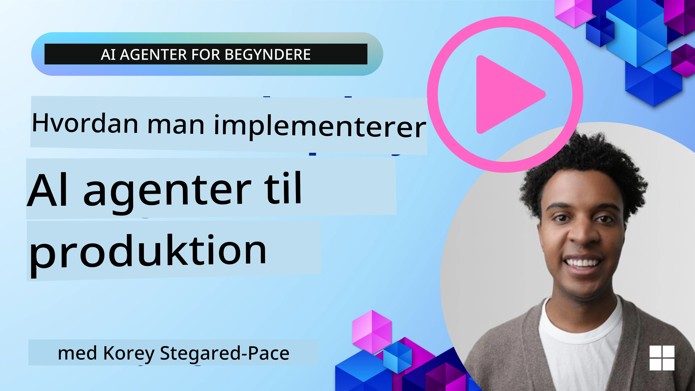

# AI-agenter i produktion: Observabilitet og evaluering

[](https://youtu.be/l4TP6IyJxmQ?si=reGOyeqjxFevyDq9)

Efterhånden som AI-agenter går fra eksperimentelle prototyper til virkelige anvendelser, bliver evnen til at forstå deres adfærd, overvåge deres ydeevne og systematisk evaluere deres output vigtig.

## Læringsmål

Efter at have gennemført denne lektion vil du vide, hvordan/forstå:
- Kernekoncepter inden for agent-observabilitet og evaluering
- Teknikker til at forbedre agenters ydeevne, omkostninger og effektivitet
- Hvad og hvordan du systematisk evaluerer dine AI-agenter
- Hvordan du kontrollerer omkostninger ved udrulning af AI-agenter i produktion
- Hvordan du instrumenterer agenter bygget med AutoGen

Målet er at udstyre dig med viden til at omdanne dine "black box"-agenter til gennemsigtige, håndterbare og pålidelige systemer.

_**Bemærk:** Det er vigtigt at udrulle AI-agenter, der er sikre og troværdige. Se også lektionen [Opbygning af pålidelige AI-agenter](../06-building-trustworthy-agents/README.md)._

## Spor og spans

Observabilitetsværktøjer såsom [Langfuse](https://langfuse.com/) eller [Microsoft Foundry](https://learn.microsoft.com/en-us/azure/ai-foundry/what-is-azure-ai-foundry) repræsenterer normalt agentkørsler som traces og spans.

- **Trace** repræsenterer en komplet agentopgave fra start til slut (som håndtering af en brugerforespørgsel).
- **Spans** er individuelle trin inden for trace'et (som at kalde en sprogmodel eller hente data).


Uden observabilitet kan en AI-agent føles som en "black box" - dens interne tilstand og ræsonnement er uigennemsigtige, hvilket gør det svært at diagnosticere problemer eller optimere ydeevnen. Med observabilitet bliver agenter til "glasbokse", der tilbyder gennemsigtighed, hvilket er afgørende for at opbygge tillid og sikre, at de fungerer som tiltænkt. 

## Hvorfor observabilitet betyder noget i produktionsmiljøer

Overgangen af AI-agenter til produktionsmiljøer introducerer et nyt sæt udfordringer og krav. Observabilitet er ikke længere et "nice-to-have", men en kritisk evne:

*   **Debugging og rodårsagsanalyser**: Når en agent fejler eller producerer et uventet output, giver observabilitetsværktøjer de spor, der er nødvendige for at pege på fejlkilden. Dette er særligt vigtigt i komplekse agenter, der kan involvere flere LLM-opkald, værktøjsinteraktioner og betinget logik.
*   **Latens- og omkostningsstyring**: AI-agenter er ofte afhængige af LLM'er og andre eksterne API'er, der faktureres per token eller per opkald. Observabilitet muliggør præcis sporing af disse opkald, hvilket hjælper med at identificere operationer, der er unødigt langsomme eller dyre. Dette gør det muligt for teams at optimere prompts, vælge mere effektive modeller eller redesigne arbejdsgange for at styre driftsomkostninger og sikre en god brugeroplevelse.
*   **Troværdighed, sikkerhed og overholdelse**: I mange anvendelser er det vigtigt at sikre, at agenter opfører sig sikkert og etisk. Observabilitet giver en revisionssti af agentens handlinger og beslutninger. Dette kan bruges til at opdage og afbøde problemer som prompt-injektion, generering af skadeligt indhold eller forkert håndtering af personligt identificerbare oplysninger (PII). For eksempel kan du gennemgå spor for at forstå, hvorfor en agent gav et bestemt svar eller brugte et specifikt værktøj.
*   **Kontinuerlige forbedringssløjfer**: Observabilitetsdata er fundamentet for en iterativ udviklingsproces. Ved at overvåge, hvordan agenter præsterer i den virkelige verden, kan teams identificere forbedringsområder, indsamle data til finjustering af modeller og validere effekten af ændringer. Dette skaber en feedbacksløjfe, hvor produktionsindsigter fra online-evaluering informerer offline-eksperimenter og forfinelse, hvilket fører til gradvist bedre agentydelse.

## Nøglemetrikker at spore

For at overvåge og forstå agentadfærd bør en række metrikker og signaler spores. Selvom de specifikke metrikker kan variere afhængigt af agentens formål, er nogle universelt vigtige.

Her er nogle af de mest almindelige metrikker, som observabilitetsværktøjer overvåger:

**Forsinkelse (latens):** Hvor hurtigt svarer agenten? Lange ventetider påvirker brugeroplevelsen negativt. Du bør måle latens for opgaver og individuelle trin ved at trace agentkørsler. For eksempel kan en agent, der bruger 20 sekunder på alle modelopkald, accelereres ved at bruge en hurtigere model eller ved at køre modelopkald parallelt.

**Omkostninger:** Hvad koster en agentkørsel? AI-agenter er afhængige af LLM-opkald, der faktureres per token, eller eksterne API'er. Hyppig brug af værktøjer eller flere prompts kan hurtigt øge omkostningerne. For eksempel, hvis en agent kalder en LLM fem gange for marginal kvalitetforbedring, skal du vurdere, om omkostningen er berettiget, eller om du kan reducere antallet af opkald eller bruge en billigere model. Realtidsovervågning kan også hjælpe med at identificere uventede spidser (fx bugs, der forårsager overdrevne API-loops).

**Anmodningsfejl:** Hvor mange forespørgsler fejlede agenten på? Dette kan omfatte API-fejl eller mislykkede værktøjsopkald. For at gøre din agent mere robust i produktion kan du oprette fallback-mekanismer eller retries. Fx hvis LLM-udbyder A er nede, kan du skifte til LLM-udbyder B som backup.

**Brugerfeedback:** Implementering af direkte brugerevalueringer giver værdifuld indsigt. Dette kan inkludere eksplicitte vurderinger (👍thumbs-up/👎down, ⭐1-5 stjerner) eller tekstuelle kommentarer. Konsistent negativ feedback bør give anledning til alarm, da dette er et tegn på, at agenten ikke fungerer som forventet. 

**Implicit brugerfeedback:** Brugeradfærd giver indirekte feedback, selv uden eksplicitte vurderinger. Dette kan inkludere øjeblikkelig omformulering af spørgsmål, gentagne forespørgsler eller klik på en retry-knap. Fx hvis du ser, at brugere gentagne gange stiller det samme spørgsmål, er det et tegn på, at agenten ikke fungerer som forventet.

**Nøjagtighed:** Hvor ofte producerer agenten korrekte eller ønskværdige outputs? Definitionerne af nøjagtighed varierer (fx korrekt løsning af problemer, informationshentningsnøjagtighed, brugertilfredshed). Det første skridt er at definere, hvordan succes ser ud for din agent. Du kan spore nøjagtighed via automatiserede checks, evalueringsscorer eller opmærkede opgavestatusser. For eksempel at mærke traces som "succeeded" eller "failed". 

**Automatiske evalueringsmetrikker:** Du kan også sætte automatiserede evaluer op. For eksempel kan du bruge en LLM til at score agentens output, fx om det er hjælpsomt, korrekt eller ej. Der findes også flere open source-biblioteker, der hjælper dig med at score forskellige aspekter af agenten. Fx [RAGAS](https://docs.ragas.io/) for RAG-agenter eller [LLM Guard](https://llm-guard.com/) til at opdage skadeligt sprog eller prompt-injektion. 

I praksis giver en kombination af disse metrikker den bedste dækning af en AI-agents helbred. I dette kapitels [eksempel-notebook](./code_samples/10_autogen_evaluation.ipynb) vil vi vise, hvordan disse metrikker ser ud i virkelige eksempler, men først lærer vi, hvordan en typisk evalueringsarbejdsgang ser ud.

## Instrumenter din agent

For at indsamle tracing-data skal du instrumentere din kode. Målet er at instrumentere agentkoden til at udsende traces og metrikker, som kan fanges, behandles og visualiseres af en observabilitetsplatform.

**OpenTelemetry (OTel):** [OpenTelemetry](https://opentelemetry.io/) er blevet en industristandard for LLM-observabilitet. Det tilbyder et sæt API'er, SDK'er og værktøjer til at generere, indsamle og eksportere telemetridata. 

Der findes mange instrumenteringsbiblioteker, der pakker eksisterende agent-rammeværk ind og gør det nemt at eksportere OpenTelemetry-spans til et observabilitetsværktøj. Nedenfor er et eksempel på at instrumentere en AutoGen-agent med [OpenLit instrumenteringsbibliotek](https://github.com/openlit/openlit):

```python
import openlit

openlit.init(tracer = langfuse._otel_tracer, disable_batch = True)
```

The [eksempel-notebook](./code_samples/10_autogen_evaluation.ipynb) in this chapter will demonstrate how to instrument your AutoGen agent.

**Manuel oprettelse af spans:** Mens instrumenteringsbiblioteker giver et godt udgangspunkt, er der ofte tilfælde, hvor mere detaljeret eller tilpasset information er nødvendig. Du kan manuelt oprette spans for at tilføje brugerdefineret applikationslogik. Mere vigtigt er, at du kan berige automatisk eller manuelt oprettede spans med brugerdefinerede attributter (også kendt som tags eller metadata). Disse attributter kan inkludere forretningsspecifikke data, mellemliggende beregninger eller enhver kontekst, der kan være nyttig til debugging eller analyse, såsom `user_id`, `session_id`, eller `model_version`.

Eksempel på at oprette traces og spans manuelt med [Langfuse Python SDK](https://langfuse.com/docs/sdk/python/sdk-v3): 

```python
from langfuse import get_client
 
langfuse = get_client()
 
span = langfuse.start_span(name="my-span")
 
span.end()
```

## Agent-evaluering

Observabilitet giver os metrikker, men evaluering er processen med at analysere disse data (og udføre tests) for at afgøre, hvor godt en AI-agent præsterer, og hvordan den kan forbedres. Med andre ord, når du har disse traces og metrikker, hvordan bruger du dem så til at bedømme agenten og træffe beslutninger? 

Regelmæssig evaluering er vigtig, fordi AI-agenter ofte er nondeterministiske og kan udvikle sig (gennem opdateringer eller drift i modellens adfærd) – uden evaluering ville du ikke vide, om din "smarte agent" faktisk udfører sit arbejde godt eller om den er regresset.

Der er to kategorier af evalueringer for AI-agenter: **online-evaluering** og **offline-evaluering**. Begge er værdifulde og supplerer hinanden. Vi begynder som regel med offline-evaluering, da dette er det minimum, der er nødvendigt, før man udruller en agent.

### Offline-evaluering


Dette involverer at evaluere agenten i et kontrolleret miljø, typisk ved hjælp af testdatasæt, ikke live-brugerforespørgsler. Du bruger kuraterede datasæt, hvor du ved, hvad det forventede output eller korrekt adfærd er, og kører derefter din agent på disse. 

For eksempel, hvis du byggede en agent til matematik-tekstopgaver, kunne du have et [testdatasæt](https://huggingface.co/datasets/gsm8k) på 100 problemer med kendte svar. Offline-evaluering udføres ofte under udvikling (og kan være en del af CI/CD-pipelines) for at tjekke forbedringer eller beskytte mod regressioner. Fordelen er, at det er **gentageligt, og du kan få klare nøjagtighedsmetrikker, da du har ground truth**. Du kan også simulere brugerforespørgsler og måle agentens svar mod ideelle svar eller bruge automatiserede metrikker som beskrevet ovenfor. 

Den centrale udfordring med offline-eval er at sikre, at dit testdatasæt er dækkende og forbliver relevant – agenten kan klare sig godt på et fast testsæt, men møde meget forskellige forespørgsler i produktion. Derfor bør du holde testsæt opdaterede med nye kanttilfælde og eksempler, der afspejler virkelige scenarier​. En blanding af små "smoke test"-sager og større evalueringssæt er nyttig: små sæt til hurtige checks og større til bredere ydelsesmetrikker​.

### Online-evaluering 


Dette refererer til at evaluere agenten i et live, virkeligt miljø, dvs. under faktisk brug i produktion. Online-evaluering involverer at overvåge agentens ydeevne på rigtige brugerinteraktioner og løbende analysere resultaterne. 

For eksempel kan du spore succesrater, brugertilfredshedsscorer eller andre metrikker på live-trafik. Fordelen ved online-evaluering er, at det **fanger ting, du måske ikke forudser i et laboratoriemiljø** – du kan observere model-drift over tid (hvis agentens effektivitet forringes, efterhånden som inputmønstre ændrer sig) og fange uventede forespørgsler eller situationer, der ikke var i dine testdata​. Det giver et sandt billede af, hvordan agenten opfører sig i felten. 

Online-evaluering involverer ofte indsamling af implicit og eksplicit brugerfeedback, som diskuteret, og muligvis køre shadow-tests eller A/B-tests (hvor en ny version af agenten kører parallelt for at sammenligne med den gamle). Udfordringen er, at det kan være vanskeligt at få pålidelige labels eller scores for live-interaktioner – du kan være afhængig af brugerfeedback eller downstream-metrikker (fx om brugeren klikkede på resultatet). 

### Kombinationen af de to

Online- og offline-evalueringer udelukker ikke hinanden; de supplerer hinanden i høj grad. Indsigter fra online-overvågning (fx nye typer brugerforespørgsler, hvor agenten præsterer dårligt) kan bruges til at udvide og forbedre offline-testdatasæt. Omvendt kan agenter, der klarer sig godt i offline-tests, derefter mere trygt udrulles og overvåges online. 

Faktisk adopterer mange teams en løkke: 

_evaluer offline -> udrul -> overvåg online -> indsamle nye fejlsager -> tilføj til offline-datasæt -> forbedr agenten -> gentag_.

## Almindelige problemer

Som du udruller AI-agenter i produktion, kan du støde på forskellige udfordringer. Her er nogle almindelige problemer og deres potentielle løsninger:

| **Problem**    | **Potentiel løsning**   |
| ------------- | ------------------ |
| AI-agenten udfører ikke opgaver konsekvent | - Forfin prompten, der gives til AI-agenten; vær klar i målsætningerne.<br>- Identificer, hvor opdeling af opgaver i delopgaver og håndtering af dem af flere agenter kan hjælpe. |
| AI-agenten kører i kontinuerlige løkker  | - Sørg for klare termineringsvilkår, så agenten ved, hvornår processen skal stoppes.<br>- For komplekse opgaver, der kræver ræsonnement og planlægning, brug en større model, der er specialiseret til ræsonnement. |
| AI-agentens værktøjsopkald fungerer ikke godt   | - Test og valider værktøjets output uden for agentsystemet.<br>- Forfin de definerede parametre, prompts og navngivning af værktøjer.  |
| Multi-agent-systemet fungerer ikke konsekvent | - Forfin prompts givet til hver agent for at sikre, at de er specifikke og forskellige fra hinanden.<br>- Byg et hierarkisk system ved hjælp af en "routing"- eller controller-agent for at bestemme, hvilken agent der er den rigtige. |

Mange af disse problemer kan identificeres mere effektivt med observabilitet på plads. De spor og metrikker, vi diskuterede tidligere, hjælper med præcist at pege på, hvor i agentarbejdsgangen problemer opstår, hvilket gør debugging og optimering meget mere effektivt.

## Håndtering af omkostninger
Her er nogle strategier til at håndtere omkostningerne ved at udrulle AI-agenter i produktion:

**Brug af mindre modeller:** Small Language Models (SLMs) kan klare sig godt i visse agentiske anvendelsestilfælde og vil reducere omkostningerne betydeligt. Som nævnt tidligere er det bedste måde at forstå, hvor godt en SLM vil præstere i din brugssag på, at bygge et evalueringssystem til at bestemme og sammenligne præstationen i forhold til større modeller. Overvej at bruge SLMs til enklere opgaver som intentionsklassificering eller parameterudtrækning, mens du reserverer større modeller til komplekst ræsonnement.

**Brug af en routermodel:** En tilsvarende strategi er at bruge en blanding af modeller og størrelser. Du kan bruge en LLM/SLM eller en serverløs funktion til at rute forespørgsler baseret på kompleksitet til de bedst egnede modeller. Dette vil også hjælpe med at reducere omkostningerne samtidig med, at ydeevnen sikres på de rigtige opgaver. For eksempel kan du rute simple forespørgsler til mindre, hurtigere modeller og kun bruge dyre, store modeller til komplekse ræsonnementopgaver.

**Cachelagring af svar:** At identificere almindelige forespørgsler og opgaver og levere svarene, før de går gennem dit agentiske system, er en god måde at reducere mængden af lignende forespørgsler på. Du kan endda implementere en proces til at identificere, hvor ens en forespørgsel er i forhold til dine cachelagrede forespørgsler ved hjælp af mere grundlæggende AI-modeller. Denne strategi kan betydeligt reducere omkostningerne for ofte stillede spørgsmål eller almindelige arbejdsgange.

## Lad os se, hvordan dette fungerer i praksis

I [eksempelnotebook i denne sektion](./code_samples/10_autogen_evaluation.ipynb) vil vi se eksempler på, hvordan vi kan bruge observabilitetsværktøjer til at overvåge og evaluere vores agent.

### Har du flere spørgsmål om AI Agents i produktion?

Deltag i [Microsoft Foundry Discord](https://aka.ms/ai-agents/discord) for at mødes med andre lærende, deltage i kontortimer og få svar på dine spørgsmål om AI-agenter.

## Forrige lektion

[Metacognition Design Pattern](../09-metacognition/README.md)

## Næste lektion

[Agentic Protocols](../11-agentic-protocols/README.md)

---

<!-- CO-OP TRANSLATOR DISCLAIMER START -->
Ansvarsfraskrivelse:
Dette dokument er blevet oversat ved hjælp af AI-oversættelsestjenesten Co-op Translator (https://github.com/Azure/co-op-translator). Selvom vi bestræber os på nøjagtighed, bedes du være opmærksom på, at automatiske oversættelser kan indeholde fejl eller unøjagtigheder. Det oprindelige dokument i dets oprindelige sprog bør betragtes som den autoritative kilde. For kritiske oplysninger anbefales en professionel menneskelig oversættelse. Vi er ikke ansvarlige for eventuelle misforståelser eller fejltolkninger, der måtte opstå som følge af brugen af denne oversættelse.
<!-- CO-OP TRANSLATOR DISCLAIMER END -->