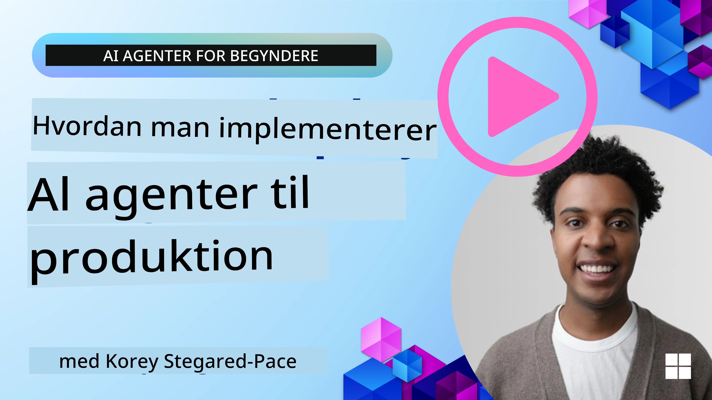

# AI-agenter i produktion: Observabilitet & Evaluering

[](https://youtu.be/l4TP6IyJxmQ?si=reGOyeqjxFevyDq9)

Når AI-agenter går fra eksperimentelle prototyper til virkelige anvendelser, bliver evnen til at forstå deres adfærd, overvåge deres ydeevne og systematisk evaluere deres output vigtig.

## Læringsmål

Efter at have gennemført denne lektion vil du vide, hvordan man/forstår:
- Kernekoncepter inden for agentobservabilitet og evaluering
- Teknikker til forbedring af agenters ydeevne, omkostninger og effektivitet
- Hvad og hvordan man systematisk evaluerer dine AI-agenter
- Hvordan man kontrollerer omkostninger ved implementering af AI-agenter i produktion
- Hvordan man instrumenterer agenter bygget med Microsoft Agent Framework

Målet er at udstyre dig med viden til at forvandle dine "black box"-agenter til gennemsigtige, håndterbare og pålidelige systemer.

_**Note:** Det er vigtigt at implementere AI-agenter, der er sikre og pålidelige. Se også lektionen [Building Trustworthy AI Agents](../06-building-trustworthy-agents/README.md)._

## Traces og Spans

Observabilitetsværktøjer såsom [Langfuse](https://langfuse.com/) eller [Microsoft Foundry](https://learn.microsoft.com/en-us/azure/ai-foundry/what-is-azure-ai-foundry) repræsenterer normalt agentkørsler som traces og spans.

- **Trace** repræsenterer en komplet agentopgave fra start til slut (som at håndtere en brugerforespørgsel).
- **Spans** er individuelle trin inden for trace (som at kalde en sprogmodel eller hente data).


<!-- Image URL retained for illustration purposes -->

Uden observabilitet kan en AI-agent føles som en "black box" – dens interne tilstand og ræsonnement er uigennemsigtige, hvilket gør det vanskeligt at diagnosticere problemer eller optimere ydeevnen. Med observabilitet bliver agenter til "glasbokse", der tilbyder gennemsigtighed, som er afgørende for at opbygge tillid og sikre, at de fungerer som tilsigtet. 

## Hvorfor observabilitet er vigtigt i produktionsmiljøer

Overgangen af AI-agenter til produktionsmiljøer introducerer et nyt sæt udfordringer og krav. Observabilitet er ikke længere "nice-to-have", men en kritisk kapabilitet:

*   **Fejlfinding og årsagsanalyse**: Når en agent fejler eller producerer en uventet output, giver observabilitetsværktøjer de traces, der er nødvendige for at lokalisere fejlkilden. Dette er især vigtigt i komplekse agenter, der kan involvere flere LLM-kald, værktøjsinteraktioner og betinget logik.
*   **Latens og omkostningsstyring**: AI-agenter er ofte afhængige af LLM'er og andre eksterne API'er, som faktureres per token eller per kald. Observabilitet tillader præcis sporing af disse kald, hvilket hjælper med at identificere operationer, der er for langsomme eller dyre. Dette gør det muligt for teams at optimere prompts, vælge mere effektive modeller eller redesigne arbejdsgange til at styre driftsomkostninger og sikre en god brugeroplevelse.
*   **Tillid, sikkerhed og overholdelse**: I mange anvendelser er det vigtigt at sikre, at agenter opfører sig sikkert og etisk. Observabilitet giver et revisionsspor for agenthandlinger og beslutninger. Dette kan bruges til at opdage og afbøde problemer som promptinjektion, fremstilling af skadeligt indhold eller dårlig håndtering af personhenførbare oplysninger (PII). For eksempel kan du gennemgå traces for at forstå, hvorfor en agent gav et bestemt svar eller brugte et specifikt værktøj.
*   **Kontinuerlige forbedringssløjfer**: Observabilitetsdata er grundlaget for en iterativ udviklingsproces. Ved at overvåge agenters ydeevne i den virkelige verden kan teams identificere forbedringsområder, indsamle data til finjustering af modeller og validere effekten af ændringer. Dette skaber en feedbacksløjfe, hvor produktionsindsigt fra online-evaluering informerer offline-eksperimenter og -forbedring, hvilket fører til gradvist bedre agentydelse.

## Centrale metrics at følge

For at overvåge og forstå agentadfærd bør en række metrics og signaler følges. Selvom de specifikke metrics kan variere baseret på agentens formål, er nogle universelt vigtige.

Her er nogle af de mest almindelige metrics, som observabilitetsværktøjer overvåger:

**Latens:** Hvor hurtigt responderer agenten? Lange ventetider påvirker brugeroplevelsen negativt. Du bør måle latens for opgaver og individuelle trin ved at spore agentkørsler. For eksempel kan en agent, der tager 20 sekunder for alle modelkald, accelereres ved at bruge en hurtigere model eller ved at køre modelkald parallelt.

**Omkostninger:** Hvad koster en agentkørsel? AI-agenter er afhængige af LLM-kald, der faktureres per token eller eksterne API'er. Hyppig brug af værktøjer eller mange prompts kan hurtigt øge omkostningerne. For eksempel, hvis en agent kalder en LLM fem gange for en marginal kvalitetsforbedring, skal du vurdere, om omkostningen er berettiget, eller om du kan reducere antallet af kald eller bruge en billigere model. Overvågning i realtid kan også hjælpe med at identificere uventede spidser (f.eks. fejl, der forårsager overdreven API-loop).

**Forespørgselsfejl:** Hvor mange forespørgsler fejlede agenten? Dette kan inkludere API-fejl eller mislykkede værktøjskald. For at gøre agenten mere robust mod disse i produktion kan du sætte fallback-mekanismer eller forsøg igen op. Fx hvis LLM-udbyder A er nede, skifter du til LLM-udbyder B som backup.

**Brugerfeedback:** Implementering af direkte brugervurderinger giver værdifuld indsigt. Dette kan inkludere eksplicitte bedømmelser (👍tommel-op/👎ned, ⭐1-5 stjerner) eller tekstkommentarer. Konsistent negativ feedback skal advare dig, da det er et tegn på, at agenten ikke fungerer som forventet. 

**Implicit brugerfeedback:** Brugeradfærd tilbyder indirekte feedback, selv uden eksplicitte bedømmelser. Dette kan inkludere øjeblikkelig omformulering af spørgsmål, gentagne forespørgsler eller klik på en prøv igen-knap. Fx hvis du ser, at brugere gentagne gange stiller det samme spørgsmål, er det et tegn på, at agenten ikke fungerer som forventet.

**Nøjagtighed:** Hvor ofte producerer agenten korrekte eller ønskværdige output? Definitionen af nøjagtighed varierer (f.eks. korrekt problemløsning, informationspræcision, brugertilfredshed). Det første trin er at definere, hvad succes ser ud for din agent. Du kan spore nøjagtighed via automatiserede kontroller, evalueringspoint eller opgavestatusmærker. For eksempel mærkning af traces som "succeeded" eller "failed".

**Automatiserede evalueringsmetrics:** Du kan også opsætte automatiserede evalueringer. For eksempel kan du bruge en LLM til at score agentens output, fx om det er hjælpsomt, korrekt eller ej. Der findes også flere open source-biblioteker, der hjælper med at score forskellige aspekter af agenten. Fx [RAGAS](https://docs.ragas.io/) for RAG-agenter eller [LLM Guard](https://llm-guard.com/) til at opdage skadelig sprogbrug eller promptinjektion.

I praksis giver en kombination af disse metrics den bedste dækning af en AI-agents helbred. I dette kapitel [eksempelnotebook](./code_samples/10-expense_claim-demo.ipynb) vil vi vise dig, hvordan disse metrics ser ud i virkelige eksempler, men først lærer vi, hvordan en typisk evalueringsarbejdsgang ser ud.

## Instrumentér din Agent

For at indsamle trace-data skal du instrumentere din kode. Målet er at instrumentere agentkoden til at udsende traces og metrics, som kan indfanges, behandles og visualiseres af en observabilitetsplatform.

**OpenTelemetry (OTel):** [OpenTelemetry](https://opentelemetry.io/) er blevet en industristandard for LLM-observabilitet. Det tilbyder et sæt API'er, SDK'er og værktøjer til generering, indsamling og eksport af telemetridata.

Der findes mange instrumenteringsbiblioteker, der omslutter eksisterende agentframeworks og gør det nemt at eksportere OpenTelemetry-spans til et observabilitetsværktøj. Microsoft Agent Framework integrerer nativt med OpenTelemetry. Nedenfor er et eksempel på, hvordan man instrumenterer en MAF-agent:

```python
from agent_framework.observability import get_tracer, get_meter

tracer = get_tracer()
meter = get_meter()

with tracer.start_as_current_span("agent_run"):
    # Agentudførelse spores automatisk
    pass
```

Eksempelnotebooken i dette kapitel ([example notebook](./code_samples/10-expense_claim-demo.ipynb)) vil demonstrere, hvordan du instrumenterer din MAF-agent.

**Manuel Span-oprettelse:** Mens instrumenteringsbiblioteker giver et godt udgangspunkt, er der ofte tilfælde, hvor mere detaljeret eller brugerdefineret information er nødvendig. Du kan manuelt oprette spans for at tilføje brugerdefineret applikationslogik. Endnu vigtigere, de kan berige automatisk eller manuelt oprettede spans med brugerdefinerede attributter (også kendt som tags eller metadata). Disse attributter kan inkludere forretningsspecifikke data, mellemliggende beregninger eller enhver kontekst, der kan være nyttig til fejlfinding eller analyse, såsom `user_id`, `session_id` eller `model_version`.

Eksempel på manuel oprettelse af traces og spans med [Langfuse Python SDK](https://langfuse.com/docs/sdk/python/sdk-v3):

```python
from langfuse import get_client
 
langfuse = get_client()
 
span = langfuse.start_span(name="my-span")
 
span.end()
```

## Agent Evaluering

Observabilitet giver os metrics, men evaluering er processen med at analysere disse data (og udføre tests) for at afgøre, hvor godt en AI-agent præsterer, og hvordan den kan forbedres. Med andre ord, når du har disse traces og metrics, hvordan bruger du dem til at vurdere agenten og træffe beslutninger?

Regelmæssig evaluering er vigtig, fordi AI-agenter ofte er ikke-deterministiske og kan udvikle sig (gennem opdateringer eller forskydende modeladfærd) – uden evaluering ville du ikke vide, om din ”smarte agent” faktisk gør sit job godt, eller om den er forværret.

Der findes to kategorier af evalueringer for AI-agenter: **online evaluering** og **offline evaluering**. Begge er værdifulde og komplementerer hinanden. Vi begynder normalt med offline evaluering, da det er det minimale nødvendige trin, før en agent implementeres.

### Offline Evaluering


Dette involverer at evaluere agenten i et kontrolleret miljø, typisk ved hjælp af testdatasæt, ikke live brugerforespørgsler. Du bruger kuraterede datasæt, hvor du kender det forventede output eller korrekt adfærd, og derefter kører din agent på dem.

For eksempel, hvis du har bygget en agent til matematiske tekstproblemer, kan du have et [testdatasæt](https://huggingface.co/datasets/gsm8k) med 100 problemer med kendte svar. Offline evaluering udføres ofte under udvikling (og kan være en del af CI/CD-pipelines) for at tjekke forbedringer eller forhindre regresioner. Fordelen er, at det er **gentageligt, og du får klare nøjagtighedsmetrics, da du har sandhedsværdier**. Du kan også simulere brugerforespørgsler og måle agentens svar mod ideelle svar eller bruge automatiserede metrics som beskrevet ovenfor.

Den største udfordring ved offline evaluering er at sikre, at dit testdatasæt er omfattende og forbliver relevant – agenten kan klare sig godt på et fast testdatasæt, men møde meget forskellige forespørgsler i produktion. Derfor bør du holde testdatasæt opdaterede med nye edge cases og eksempler, der afspejler virkelige scenarier. En blanding af små ”røgringningstest” og større evalueringssæt er nyttig: små sæt til hurtige tjek og større til bredere ydeevnemetrics.

### Online Evaluering


Dette henviser til evaluering af agenten i et live, virkeligt miljø, dvs. under faktisk brug i produktionen. Online evaluering involverer overvågning af agentens præstation på rigtige brugerinteraktioner og løbende analyse af resultater.

For eksempel kan du spore succesrater, brugertilfredshedsscores eller andre metrics på live trafik. Fordelen ved online evaluering er, at den **fanger ting, du måske ikke kan forudse i laboratoriemiljø** – du kan observere modeldrift over tid (hvis agentens effektivitet forringes, som inputmønstre ændrer sig) og opdage uventede forespørgsler eller situationer, der ikke var i dine testdata. Den giver et sandt billede af, hvordan agenten opfører sig i felten.

Online evaluering involverer ofte indsamling af implicit og eksplicit brugerfeedback, som tidligere diskuteret, samt muligvis kørsel af shadow tests eller A/B-tests (hvor en ny version af agenten kører parallelt for at sammenligne med den gamle). Udfordringen er, at det kan være svært at få pålidelige labels eller scores for live interaktioner – du må måske stole på brugerfeedback eller downstream metrics (som om brugeren klikkede på resultatet).

### Kombination af de to

Online og offline evalueringer er ikke gensidigt udelukkende; de supplerer hinanden meget. Indsigter fra online overvågning (f.eks. nye typer brugerforespørgsler, hvor agenten præsterer dårligt) kan bruges til at forbedre offline testdatasæt. Omvendt kan agenter, der klarer sig godt i offline tests, med større tillid implementeres og overvåges online.

Faktisk anvender mange teams en sløjfe:

_evaluer offline -> implementer -> overvåg online -> indsamle nye fejlsager -> tilføj til offline datasæt -> forfin agent -> gentag_.

## Almindelige problemer

Når du implementerer AI-agenter i produktion, kan du møde forskellige udfordringer. Her er nogle almindelige problemer og mulige løsninger:

| **Problem**    | **Mulig løsning**   |
| ------------- | ------------------ |
| AI-agent udfører ikke opgaver konsekvent | - Forfin prompten, der gives til AI-agenten; vær klar på målene.<br>- Identificer hvor opgaver kan opdeles i delopgaver og håndteres af flere agenter. |
| AI-agent kører i kontinuerlige loops | - Sørg for klare afslutningsbetingelser, så agenten ved, hvornår processen skal stoppes.<br>- For komplekse opgaver, der kræver ræsonnering og planlægning, brug en større model, der er specialiseret i ræsonneringsopgaver. |
| AI-agentens værktøjskald fungerer ikke godt | - Test og valider værktøjets output uden for agentsystemet.<br>- Forfin definerede parametre, prompts og navngivning af værktøjerne. |
| Multi-agent system præsterer ikke konsekvent | - Forfin prompts givet til hver agent for at sikre, at de er specifikke og adskilte fra hinanden.<br>- Byg et hierarkisk system med en "routing"- eller controller-agent til at bestemme, hvilken agent der er den korrekte. |

Mange af disse problemer kan identificeres mere effektivt, når observabilitet er implementeret. De traces og metrics, vi har diskuteret tidligere, hjælper med præcist at identificere, hvor i agentens arbejdsgang problemer opstår, hvilket gør fejlfinding og optimering langt mere effektiv.

## Styring af omkostninger


Her er nogle strategier til at håndtere omkostningerne ved at implementere AI-agenter i produktion:

**Brug af mindre modeller:** Små sprogmodeller (SLM'er) kan præstere godt på visse agentbaserede anvendelsestilfælde og vil reducere omkostningerne betydeligt. Som nævnt tidligere er det bedste at bygge et evalueringssystem for at bestemme og sammenligne ydelsen i forhold til større modeller for at forstå, hvor godt en SLM vil præstere i dit anvendelsestilfælde. Overvej at bruge SLM'er til enklere opgaver som hensigtsklassificering eller parameterudtræk, mens du reserverer større modeller til kompleks ræsonnering.

**Brug af en routermodel:** En lignende strategi er at bruge en diversitet af modeller og størrelser. Du kan bruge en LLM/SLM eller en serverløs funktion til at dirigere forespørgsler baseret på kompleksitet til de bedst egnede modeller. Dette vil også hjælpe med at reducere omkostningerne samtidig med at sikre ydeevne på de rette opgaver. For eksempel kan du dirigere simple forespørgsler til mindre, hurtigere modeller og kun bruge dyre store modeller til komplekse ræsonneringsopgaver.

**Cache-respons:** Identificering af almindelige forespørgsler og opgaver og levering af svarene, inden de går gennem dit agentbaserede system, er en god måde at reducere volumet af lignende forespørgsler på. Du kan endda implementere et flow til at identificere, hvor lig en forespørgsel er i forhold til dine cachede forespørgsler ved hjælp af mere basale AI-modeller. Denne strategi kan markant reducere omkostningerne ved ofte stillede spørgsmål eller almindelige arbejdsgange.

## Lad os se, hvordan dette fungerer i praksis

I [eksempelkoden til denne sektion](./code_samples/10-expense_claim-demo.ipynb) vil vi se eksempler på, hvordan vi kan bruge observabilitetsværktøjer til at overvåge og evaluere vores agent.


### Har du flere spørgsmål om AI-agenter i produktion?

Deltag i [Microsoft Foundry Discord](https://discord.com/invite/ATgtXmAS5D) for at møde andre lærende, deltage i kontortimer og få svar på dine spørgsmål om AI-agenter.

## Forrige lektion

[Metakognition designmønster](../09-metacognition/README.md)

## Næste lektion

[Agentiske protokoller](../11-agentic-protocols/README.md)

---

<!-- CO-OP TRANSLATOR DISCLAIMER START -->
**Ansvarsfraskrivelse**:
Dette dokument er blevet oversat ved hjælp af AI-oversættelsestjenesten [Co-op Translator](https://github.com/Azure/co-op-translator). Selvom vi bestræber os på nøjagtighed, skal du være opmærksom på, at automatiserede oversættelser kan indeholde fejl eller unøjagtigheder. Det originale dokument på dets oprindelige sprog bør betragtes som den autoritative kilde. For kritisk information anbefales professionel menneskelig oversættelse. Vi påtager os intet ansvar for misforståelser eller fejltolkninger, der opstår som følge af brugen af denne oversættelse.
<!-- CO-OP TRANSLATOR DISCLAIMER END -->