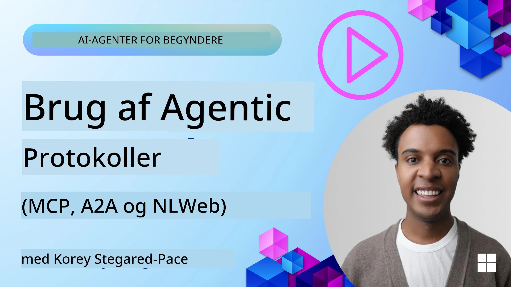
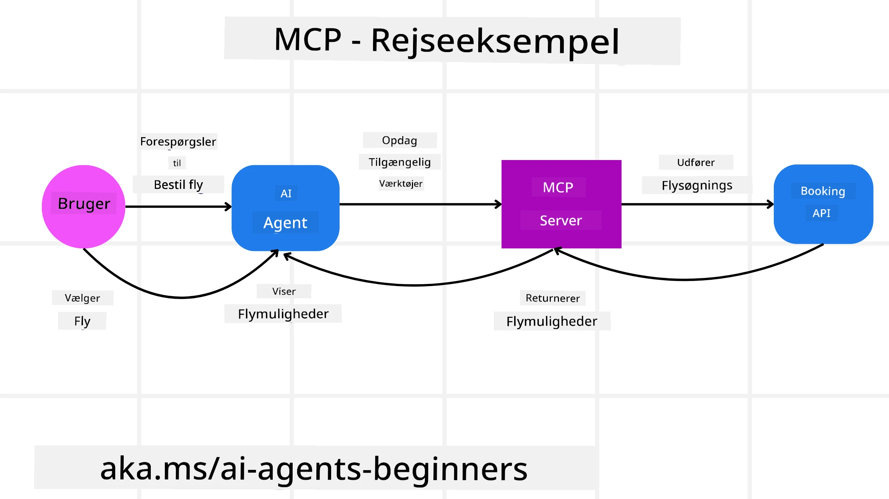
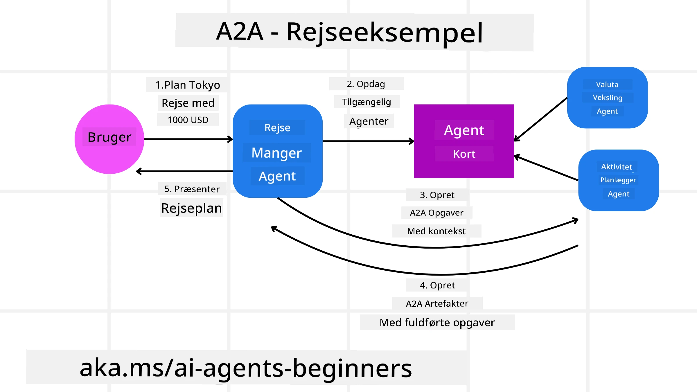
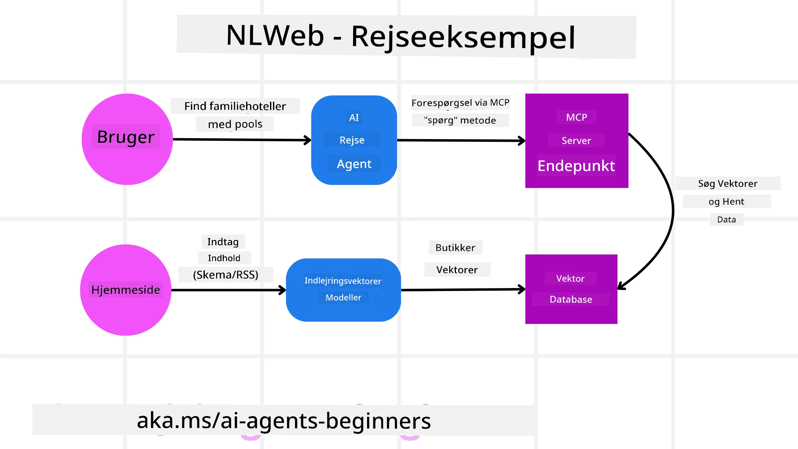

# Using Agentic Protocols (MCP, A2A and NLWeb)

> _(Klik på billedet ovenfor for at se videoen af denne lektion)_

Efterhånden som brugen af AI-agenter vokser, øges også behovet for protokoller, der sikrer standardisering, sikkerhed og understøtter åben innovation. I denne lektion gennemgår vi 3 protokoller, der søger at opfylde dette behov - Model Context Protocol (MCP), Agent to Agent (A2A) og Natural Language Web (NLWeb).

## Introduction

I denne lektion gennemgår vi:

• Hvordan **MCP** gør det muligt for AI-agenter at få adgang til eksterne værktøjer og data for at fuldføre brugeropgaver.

• Hvordan **A2A** muliggør kommunikation og samarbejde mellem forskellige AI-agenter.

• Hvordan **NLWeb** bringer natural language-grænseflader til enhver hjemmeside, så AI-agenter kan opdage og interagere med indholdet.

## Learning Goals

• **Identificere** det centrale formål og fordelene ved MCP, A2A og NLWeb i konteksten af AI-agenter.

• **Forklare** hvordan hver protokol faciliterer kommunikation og interaktion mellem LLM'er, værktøjer og andre agenter.

• **Genkende** de forskellige roller, hver protokol spiller i opbygningen af komplekse agentiske systemer.

## Model Context Protocol

Model Context Protocol (MCP) er en åben standard, der giver en standardiseret måde for applikationer at levere kontekst og værktøjer til LLM'er. Dette muliggør en "universel adapter" til forskellige datakilder og værktøjer, som AI-agenter kan forbinde til på en ensartet måde.

Lad os se på komponenterne i MCP, fordelene sammenlignet med direkte API-brug, og et eksempel på, hvordan AI-agenter kunne bruge en MCP-server.

### MCP Core Components

MCP fungerer på en **klient-server-arkitektur**, og kernekomponenterne er:

• **Hosts** er LLM-applikationer (for eksempel en kodeeditor som VSCode), der starter forbindelserne til en MCP-server.

• **Clients** er komponenter inden for host-applikationen, der opretholder en-til-en-forbindelser med servere.

• **Servers** er letvægtsprogrammer, der eksponerer specifikke kapabiliteter.

Inkluderet i protokollen er tre kerneprimitiver, som er kapabiliteterne hos en MCP-server:

• **Tools**: Dette er diskrete handlinger eller funktioner, som en AI-agent kan kalde for at udføre en handling. For eksempel kan en vejrservice eksponere et "get weather"-værktøj, eller en e-handelsserver kan eksponere et "purchase product"-værktøj. MCP-servere annoncerer hvert værktøjs navn, beskrivelse og input/output-skema i deres kapabilitetsliste.

• **Resources**: Dette er skrivebeskyttede dataelementer eller dokumenter, som en MCP-server kan levere, og klienter kan hente dem efter behov. Eksempler inkluderer filindhold, databaserposter eller logfiler. Resources kan være tekst (som kode eller JSON) eller binære (som billeder eller PDF'er).

• **Prompts**: Dette er foruddefinerede skabeloner, der giver foreslåede prompts og muliggør mere komplekse arbejdsflows.

### Benefits of MCP

MCP tilbyder betydelige fordele for AI-agenter:

• **Dynamisk værktøjsopdagelse**: Agenter kan dynamisk modtage en liste over tilgængelige værktøjer fra en server sammen med beskrivelser af, hvad de gør. Dette står i kontrast til traditionelle API'er, som ofte kræver statisk kodning for integrationer, hvilket betyder, at enhver API-ændring nødvendiggør kodeopdateringer. MCP tilbyder en "integrer én gang"-tilgang, hvilket fører til større tilpasningsevne.

• **Interoperabilitet på tværs af LLM'er**: MCP fungerer på tværs af forskellige LLM'er og giver fleksibilitet til at skifte kernemodeller for at evaluere bedre ydeevne.

• **Standardiseret sikkerhed**: MCP inkluderer en standard autentificeringsmetode, hvilket forbedrer skalerbarheden ved at tilføje adgang til yderligere MCP-servere. Dette er enklere end at administrere forskellige nøgler og autentificeringstyper for forskellige traditionelle API'er.

### MCP Example

Forestille dig, at en bruger vil booke en flyrejse ved hjælp af en AI-assistent drevet af MCP.

1. **Connection**: AI-assistenten (MCP-klienten) opretter forbindelse til en MCP-server leveret af et flyselskab.

2. **Tool Discovery**: Klienten spørger flyselskabets MCP-server: "Hvilke værktøjer har I tilgængelige?" Serveren svarer med værktøjer som "search flights" og "book flights".

3. **Tool Invocation**: Du beder derefter AI-assistenten om: "Søg venligst efter en flyvning fra Portland til Honolulu." AI-assistenten bruger sin LLM til at identificere, at den skal kalde "search flights"-værktøjet og sender de relevante parametre (afgangssted, destination) til MCP-serveren.

4. **Execution and Response**: MCP-serveren fungerer som en wrapper og foretager det faktiske kald til flyselskabets interne booking-API. Derefter modtager den flyinformationerne (f.eks. JSON-data) og sender dem tilbage til AI-assistenten.

5. **Further Interaction**: AI-assistenten præsenterer flymulighederne. Når du vælger en flyvning, kan assistenten kalde "book flight"-værktøjet på den samme MCP-server og fuldføre bookingen.

## Agent-to-Agent Protocol (A2A)

Mens MCP fokuserer på at forbinde LLM'er til værktøjer, går **Agent-to-Agent (A2A) protokollen** et skridt videre ved at muliggøre kommunikation og samarbejde mellem forskellige AI-agenter. A2A forbinder AI-agenter på tværs af forskellige organisationer, miljøer og teknologistakke for at fuldføre en fælles opgave.

Vi gennemgår komponenterne og fordelene ved A2A samt et eksempel på, hvordan det kunne anvendes i vores rejseapplikation.

### A2A Core Components

A2A fokuserer på at muliggøre kommunikation mellem agenter og lade dem arbejde sammen om at fuldføre en underopgave for brugeren. Hver komponent i protokollen bidrager til dette:

#### Agent Card

På samme måde som en MCP-server deler en liste over værktøjer, har et Agent Card:
- Agentens navn .
- En **beskrivelse af de generelle opgaver**, den udfører.
- En **liste over specifikke færdigheder** med beskrivelser for at hjælpe andre agenter (eller endda menneskelige brugere) med at forstå, hvornår og hvorfor de ville ønske at kalde den agent.
- Den **aktuelle Endpoint URL** for agenten
- **versionen** og **kapabiliteterne** af agenten såsom streaming-responser og push-notifikationer.

#### Agent Executor

Agent Executor er ansvarlig for **at videregive konteksten fra brugerchatten til den eksterne agent**; den eksterne agent har brug for dette for at forstå den opgave, der skal udføres. I en A2A-server bruger en agent sin egen Large Language Model (LLM) til at parse indkommende forespørgsler og udføre opgaver ved hjælp af sine egne interne værktøjer.

#### Artifact

Når en ekstern agent har fuldført den anmodede opgave, oprettes dens arbejdsprodukt som et artifact. Et artifact **indeholder resultatet af agentens arbejde**, en **beskrivelse af hvad der blev fuldført**, og den **tekstkontekst**, der blev sendt gennem protokollen. Efter artefaktet er sendt, lukkes forbindelsen til den eksterne agent, indtil den igen er nødvendig.

#### Event Queue

Denne komponent bruges til **at håndtere opdateringer og videresende beskeder**. Den er særligt vigtig i produktion for agentiske systemer for at forhindre, at forbindelsen mellem agenter lukkes, før en opgave er fuldført, især når opgavens gennemførelse kan tage længere tid.

### Benefits of A2A

• **Forbedret samarbejde**: Det gør det muligt for agenter fra forskellige leverandører og platforme at interagere, dele kontekst og arbejde sammen, hvilket tilskynder til problemfri automatisering på tværs af traditionelt adskilte systemer.

• **Fleksibilitet i modelvalg**: Hver A2A-agent kan beslutte, hvilken LLM den bruger til at servicere sine forespørgsler, hvilket tillader optimerede eller finjusterede modeller per agent, i modsætning til en enkelt LLM-forbindelse i nogle MCP-scenarier.

• **Indbygget autentificering**: Autentificering er integreret direkte i A2A-protokollen og giver en robust sikkerhedsramme for agentinteraktioner.

### A2A Example

Lad os udbygge vores rejsebookingsscenarie, men denne gang med A2A.

1. **User Request to Multi-Agent**: En bruger interagerer med en "Travel Agent" A2A-klient/agent, måske ved at sige: "Book venligst en hel tur til Honolulu i næste uge, inklusive fly, hotel og en lejebil".

2. **Orchestration by Travel Agent**: Travel Agent modtager denne komplekse anmodning. Den bruger sin LLM til at ræsonnere om opgaven og afgør, at den skal interagere med andre specialiserede agenter.

3. **Inter-Agent Communication**: Travel Agent bruger derefter A2A-protokollen til at oprette forbindelse til downstream-agenter, såsom en "Airline Agent," en "Hotel Agent," og en "Car Rental Agent," som er oprettet af forskellige virksomheder.

4. **Delegated Task Execution**: Travel Agent sender specifikke opgaver til disse specialiserede agenter (f.eks. "Find flights to Honolulu," "Book a hotel," "Rent a car"). Hver af disse specialiserede agenter kører deres egne LLM'er og bruger deres egne værktøjer (som kunne være MCP-servere i sig selv) for at udføre deres specifikke del af bookingen.

5. **Consolidated Response**: Når alle downstream-agenter har fuldført deres opgaver, sammenstiller Travel Agent resultaterne (flydetaljer, hotelbekræftelse, lejebilbooking) og sender et samlet, chat-lignende svar tilbage til brugeren.

## Natural Language Web (NLWeb)

Websites har længe været den primære måde for brugere at få adgang til information og data på internettet.

Lad os se på de forskellige komponenter i NLWeb, fordelene ved NLWeb og et eksempel på, hvordan vores NLWeb fungerer ved at se på vores rejseapplikation.

### Components of NLWeb

- **NLWeb Application (Core Service Code)**: Systemet, der behandler spørgsmål i naturligt sprog. Det forbinder de forskellige dele af platformen for at skabe svar. Du kan tænke på det som **motoren, der driver naturligsprog-funktionerne** på en hjemmeside.

- **NLWeb Protocol**: Dette er et **grundlæggende sæt regler for natural language-interaktion** med en hjemmeside. Det sender svar tilbage i JSON-format (ofte ved brug af Schema.org). Dets formål er at skabe et enkelt fundament for "AI Web," på samme måde som HTML gjorde det muligt at dele dokumenter online.

- **MCP Server (Model Context Protocol Endpoint)**: Hver NLWeb-opsætning fungerer også som en **MCP-server**. Det betyder, at den kan **dele værktøjer (som en “ask”-metode) og data** med andre AI-systemer. I praksis gør dette hjemmesidens indhold og muligheder anvendelige for AI-agenter, hvilket tillader siden at blive en del af det bredere "agent-økosystem."

- **Embedding Models**: Disse modeller bruges til at **omdanne website-indhold til numeriske repræsentationer kaldet vektorer** (embeddings). Disse vektorer indfanger mening på en måde, som computere kan sammenligne og søge i. De gemmes i en specialiseret database, og brugere kan vælge, hvilken embedding-model de ønsker at bruge.

- **Vector Database (Retrieval Mechanism)**: Denne database **gemmer embedding'erne af website-indholdet**. Når nogen stiller et spørgsmål, tjekker NLWeb vektordatabasen for hurtigt at finde de mest relevante oplysninger. Den giver en hurtig liste over mulige svar, rangeret efter lighed. NLWeb virker med forskellige vektorlagringssystemer såsom Qdrant, Snowflake, Milvus, Azure AI Search og Elasticsearch.

### NLWeb by Example

Tænk igen på vores rejsebookingshjemmeside, men denne gang er den drevet af NLWeb.

1. **Data Ingestion**: Rejsesitetets eksisterende produktkataloger (f.eks. flylister, hotelbeskrivelser, rundvisningspakker) formateres ved hjælp af Schema.org eller indlæses via RSS-feeds. NLWebs værktøjer indtager disse strukturerede data, opretter embeddings og gemmer dem i en lokal eller fjern vektordatabase.

2. **Natural Language Query (Human)**: En bruger besøger hjemmesiden og, i stedet for at navigere i menuer, skriver i en chatgrænseflade: "Find mig et familievenligt hotel i Honolulu med pool til næste uge".

3. **NLWeb Processing**: NLWeb-applikationen modtager denne forespørgsel. Den sender forespørgslen til en LLM for forståelse og søger samtidig i sin vektordatabase efter relevante hotelopslag.

4. **Accurate Results**: LLM'en hjælper med at fortolke søgeresultaterne fra databasen, identificere de bedste match baseret på kriterierne "familievenligt", "pool" og "Honolulu", og formaterer derefter et naturligt sprog-svar. Afgørende er, at svaret henviser til faktiske hoteller fra hjemmesidens katalog og undgår opdigtet information.

5. **AI Agent Interaction**: Fordi NLWeb fungerer som en MCP-server, kan en ekstern AI-rejseagent også oprette forbindelse til denne hjemmesides NLWeb-instans. AI-agenten kunne derefter bruge `ask` MCP-metoden til at forespørge websitet direkte: `ask("Are there any vegan-friendly restaurants in the Honolulu area recommended by the hotel?")`. NLWeb-instansen ville behandle dette, udnytte sin database over restaurantinformation (hvis indlæst), og returnere et struktureret JSON-svar.

### Got More Questions about MCP/A2A/NLWeb?

Deltag i [Microsoft Foundry Discord](https://aka.ms/ai-agents/discord) for at møde andre kursister, deltage i office hours og få besvaret dine spørgsmål om AI-agenter.

## Resources

- [MCP for Beginners](https://aka.ms/mcp-for-beginners)  
- [MCP Documentation](https://learn.microsoft.com/python/api/overview/azure/ai-projects-readme)
- [NLWeb Repo](https://github.com/nlweb-ai/NLWeb)
- [Microsoft Agent Framework](https://aka.ms/ai-agents-beginners/agent-framewrok)

---

<!-- CO-OP TRANSLATOR DISCLAIMER START -->
Ansvarsfraskrivelse:
Dette dokument er blevet oversat ved hjælp af AI-oversættelsestjenesten Co-op Translator (https://github.com/Azure/co-op-translator). Selvom vi bestræber os på nøjagtighed, skal du være opmærksom på, at automatiske oversættelser kan indeholde fejl eller unøjagtigheder. Det oprindelige dokument på originalsproget bør betragtes som den autoritative kilde. For kritisk information anbefales en professionel menneskelig oversættelse. Vi er ikke ansvarlige for eventuelle misforståelser eller fejltolkninger, der opstår som følge af brugen af denne oversættelse.
<!-- CO-OP TRANSLATOR DISCLAIMER END -->