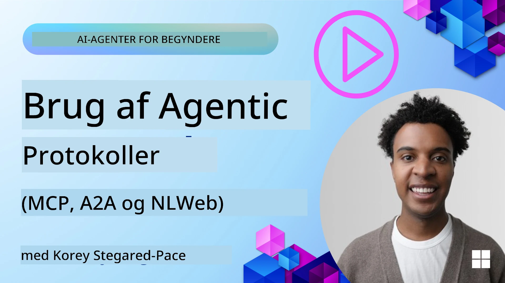
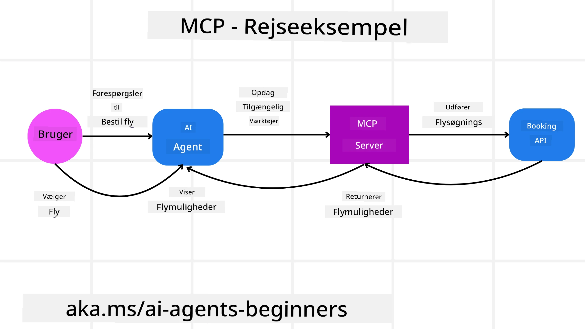
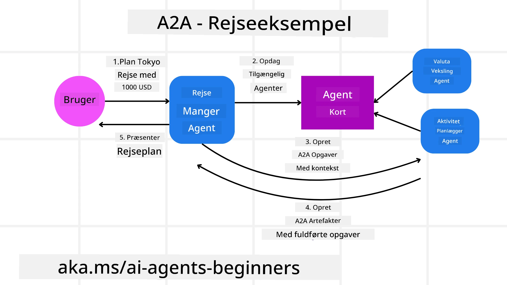
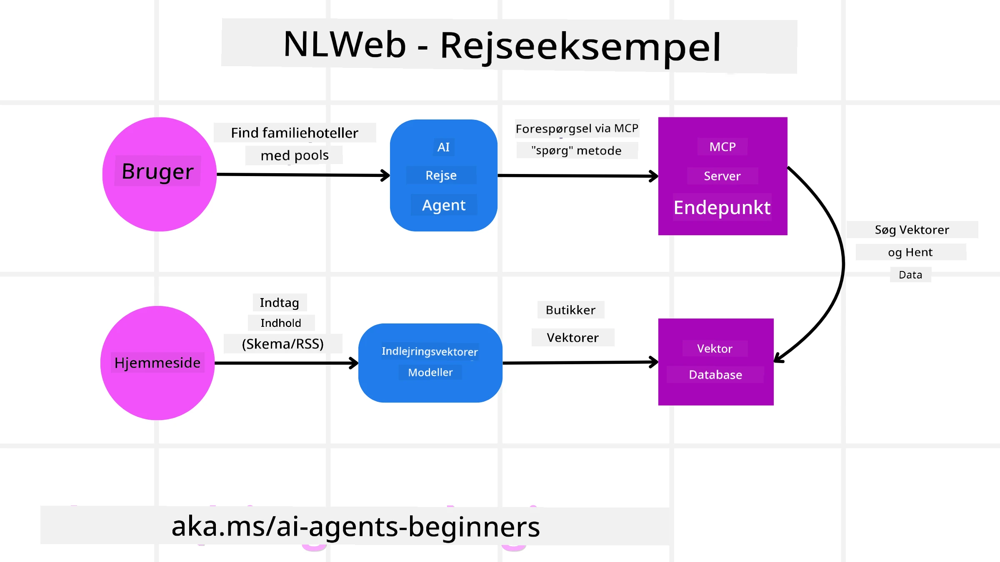

# Brug af Agentiske Protokoller (MCP, A2A og NLWeb)

> _(Klik på billedet ovenfor for at se videoen af denne lektion)_

Efterhånden som brugen af AI-agenter vokser, øges også behovet for protokoller, der sikrer standardisering, sikkerhed og understøtter åben innovation. I denne lektion vil vi gennemgå 3 protokoller, der imødekommer dette behov – Model Context Protocol (MCP), Agent to Agent (A2A) og Natural Language Web (NLWeb).

## Introduktion

I denne lektion vil vi gennemgå:

• Hvordan **MCP** tillader AI-agenter at få adgang til eksterne værktøjer og data for at fuldføre brugeropgaver.

• Hvordan **A2A** muliggør kommunikation og samarbejde mellem forskellige AI-agenter.

• Hvordan **NLWeb** bringer naturlige sprog-grænseflader til enhver hjemmeside og gør det muligt for AI-agenter at opdage og interagere med indholdet.

## Læringsmål

• **Identificere** hovedformålet og fordelene ved MCP, A2A og NLWeb i konteksten af AI-agenter.

• **Forklare** hvordan hver protokol muliggør kommunikation og interaktion mellem LLM'er, værktøjer og andre agenter.

• **Genkende** de forskellige roller, som hver protokol spiller i opbygningen af komplekse agentiske systemer.

## Model Context Protocol

**Model Context Protocol (MCP)** er en åben standard, der giver en standardiseret måde for applikationer at levere kontekst og værktøjer til LLM'er. Dette muliggør en "universal adapter" til forskellige datakilder og værktøjer, som AI-agenter kan forbinde til på en ensartet måde.

Lad os se på komponenterne i MCP, fordelene i forhold til direkte API-brug og et eksempel på, hvordan AI-agenter kunne bruge en MCP-server.

### MCP Kernekomponenter

MCP fungerer på en **klient-server arkitektur**, og kernekomponenterne er:

• **Hosts** er LLM-applikationer (for eksempel en kodeeditor som VSCode), der starter forbindelser til en MCP-server.

• **Clients** er komponenter inden for host-applikationen, som opretholder én-til-én forbindelser med servere.

• **Servers** er letvægtsprogrammer, der eksponerer specifikke funktioner.

Inden for protokollen er der tre kerneprimitiver, som er kapaciteterne for en MCP Server:

• **Tools**: Dette er diskrete handlinger eller funktioner, som en AI-agent kan kalde for at udføre en handling. For eksempel kan en vejtjeneste eksponere et "hent vejr"-værktøj, eller en e-handelsserver kan eksponere et "køb produkt"-værktøj. MCP-servere annoncerer hvert værktøjs navn, beskrivelse og input/output-skema i deres kapabilitetsliste.

• **Resources**: Dette er skrivebeskyttede dataelementer eller dokumenter, som en MCP-server kan levere, og klienter kan hente dem efter behov. Eksempler inkluderer filindhold, databaserækker eller logfiler. Ressourcer kan være tekst (som kode eller JSON) eller binære (som billeder eller PDF'er).

• **Prompts**: Dette er foruddefinerede skabeloner, der giver foreslåede prompts, hvilket muliggør mere komplekse arbejdsprocesser.

### Fordele ved MCP

MCP tilbyder betydelige fordele for AI-agenter:

• **Dynamisk Værktøjsopdagelse**: Agenter kan dynamisk modtage en liste over tilgængelige værktøjer fra en server sammen med beskrivelser af, hvad de gør. Dette står i modsætning til traditionelle API'er, der ofte kræver statisk kodning for integrationer, hvilket betyder, at enhver API-ændring nødvendiggør opdateringer i koden. MCP tilbyder en "integrer én gang"-tilgang, hvilket fører til større tilpasningsevne.

• **Interoperabilitet på tværs af LLM'er**: MCP fungerer på tværs af forskellige LLM'er, hvilket giver fleksibilitet til at skifte kerne modeller for bedre ydelse.

• **Standardiseret Sikkerhed**: MCP inkluderer en standard autentificeringsmetode, der forbedrer skalerbarheden ved tilføjelse af adgang til yderligere MCP-servere. Dette er enklere end at håndtere forskellige nøgler og autentificeringstyper for forskellige traditionelle API'er.

### MCP Eksempel

Forestil dig, at en bruger ønsker at booke en flyrejse ved hjælp af en AI-assistent drevet af MCP.

1. **Forbindelse**: AI-assistenten (MCP-klienten) forbinder til en MCP-server leveret af et flyselskab.

2. **Værktøjsopdagelse**: Klienten spørger flyselskabets MCP-server: "Hvilke værktøjer har I tilgængelige?" Serveren svarer med værktøjer som "søg fly" og "book fly".

3. **Værktøjsanvendelse**: Du beder derefter AI-assistenten: "Søg venligst en flyrejse fra Portland til Honolulu." AI-assistenten bruger sin LLM til at identificere, at den skal kalde værktøjet "søg fly" og sender de relevante parametre (afgangssted, destination) til MCP-serveren.

4. **Udførelse og svar**: MCP-serveren, der fungerer som en wrapper, foretager det faktiske kald til flyselskabets interne booking-API. Derefter modtager den flyinformationerne (f.eks. JSON-data) og sender det tilbage til AI-assistenten.

5. **Yderligere interaktion**: AI-assistenten præsenterer flymulighederne. Når du vælger en flyrejse, kan assistenten aktivere værktøjet "book fly" på samme MCP-server og fuldføre bookingen.

## Agent-til-Agent Protokol (A2A)

Mens MCP fokuserer på at forbinde LLM'er til værktøjer, går **Agent-til-Agent (A2A) protokollen** et skridt videre ved at muliggøre kommunikation og samarbejde mellem forskellige AI-agenter. A2A forbinder AI-agenter på tværs af forskellige organisationer, miljøer og teknologistakke for at fuldføre en fælles opgave.

Vi vil gennemgå komponenterne og fordelene ved A2A samt et eksempel på, hvordan det kunne anvendes i vores rejseapplikation.

### A2A Kernekomponenter

A2A fokuserer på at muliggøre kommunikation mellem agenter og lade dem arbejde sammen om at fuldføre en underopgave for brugeren. Hver komponent i protokollen bidrager til dette:

#### Agentkort

Ligesom en MCP-server deler en liste over værktøjer, har et Agentkort:
- Agentens navn.
- En **beskrivelse af de generelle opgaver**, den udfører.
- En **liste over specifikke færdigheder** med beskrivelser for at hjælpe andre agenter (eller endda menneskelige brugere) med at forstå, hvornår og hvorfor de ville ønske at kontakte denne agent.
- Den **aktuelle Endpoint-URL** for agenten.
- Agentens **version** og **kapaciteter** såsom streamede svar og push-notifikationer.

#### Agent Executor

Agent Executor er ansvarlig for **at overføre konteksten af brugerchatten til den fjernagent**, som behøver denne information for at forstå opgaven, der skal udføres. I en A2A-server bruger en agent sin egen Large Language Model (LLM) til at analysere indkommende anmodninger og udføre opgaver ved hjælp af sine egne interne værktøjer.

#### Artefakt

Når en fjernagent har fuldført den anmodede opgave, bliver dens arbejdsprodukt dannet som et artefakt. Et artefakt **indeholder resultatet af agentens arbejde**, en **beskrivelse af, hvad der blev udført**, og den **tekstuelle kontekst**, der sendes gennem protokollen. Efter artefaktet er sendt, lukkes forbindelsen til fjernagenten, indtil den bruges igen.

#### Begivenhedskø

Denne komponent bruges til **at håndtere opdateringer og sende beskeder**. Den er særlig vigtig i produktion for agentiske systemer for at forhindre, at forbindelsen mellem agenter lukkes før en opgave er fuldført, især når opgaveudførelse kan tage længere tid.

### Fordele ved A2A

• **Forbedret Samarbejde**: Den muliggør, at agenter fra forskellige leverandører og platforme kan interagere, dele kontekst og arbejde sammen, hvilket faciliterer problemfri automatisering på tværs af traditionelt adskilte systemer.

• **Fleksibilitet i Modelvalg**: Hver A2A-agent kan selv vælge, hvilken LLM den bruger til at håndtere sine anmodninger, hvilket tillader optimerede eller finjusterede modeller per agent, i modsætning til en enkelt LLM-forbindelse i nogle MCP-scenarier.

• **Indbygget Autentificering**: Autentificering er integreret direkte i A2A-protokollen og sikrer dermed et robust sikkerhedsrammeværk for agentinteraktioner.

### A2A Eksempel

Lad os udbygge vores scenarie om rejsebooking, men denne gang med brug af A2A.

1. **Brugeranmodning til Multi-Agent**: En bruger interagerer med en "Rejseagent" A2A klient/agent, måske ved at sige: "Book venligst en hel rejse til Honolulu i næste uge, inklusive fly, hotel og lejebil".

2. **Orkestrering af Rejseagent**: Rejseagenten modtager denne komplekse anmodning. Den bruger sin LLM til at overveje opgaven og afgøre, at den skal interagere med andre specialiserede agenter.

3. **Kommunikation mellem Agenter**: Rejseagenten bruger derefter A2A-protokollen til at forbinde til underordnede agenter, såsom en "Flyselskabsagent," en "Hotelagent" og en "Lejebilagent," som er skabt af forskellige virksomheder.

4. **Delegation af Opgaveudførelse**: Rejseagenten sender specifikke opgaver til disse specialiserede agenter (f.eks. "Find fly til Honolulu," "Book et hotel," "Lej en bil"). Hver af disse specialiserede agenter, der kører deres egne LLM'er og bruger deres egne værktøjer (som kunne være MCP-servere selv), udfører deres specifikke del af bookingen.

5. **Konsolideret Svar**: Når alle underordnede agenter har afsluttet deres opgaver, samler Rejseagenten resultaterne (flydetaljer, hotelbekræftelse, lejebilbooking) og sender et omfattende, chat-lignende svar tilbage til brugeren.

## Natural Language Web (NLWeb)

Websites har længe været den primære måde for brugere at få adgang til information og data på internettet.

Lad os se på de forskellige komponenter i NLWeb, fordelene ved NLWeb og et eksempel på, hvordan vores NLWeb fungerer ved at kigge på vores rejseapplikation.

### Komponenter i NLWeb

- **NLWeb Applikation (Kernesoftwaren)**: Systemet, der behandler naturlige sprogspørgsmål. Det forbinder de forskellige dele af platformen for at skabe svar. Du kan tænke på det som **motoren, der driver de naturlige sprogfunktioner** på en hjemmeside.

- **NLWeb Protokol**: Dette er et **grundlæggende regelsæt for naturlig sprog-interaktion** med en hjemmeside. Den sender svar tilbage i JSON-format (ofte ved brug af Schema.org). Formålet er at skabe et simpelt fundament for "AI Web," på samme måde som HTML gjorde det muligt at dele dokumenter online.

- **MCP Server (Model Context Protocol Endpoint)**: Hver NLWeb-installation fungerer også som en **MCP-server**. Det betyder, at den kan **dele værktøjer (som en “ask”-metode) og data** med andre AI-systemer. I praksis gør dette hjemmesidens indhold og funktioner brugbare for AI-agenter og tillader siden at blive en del af det bredere “agent-økosystem.”

- **Embedding-modeller**: Disse modeller bruges til at **omdanne hjemmesidens indhold til numeriske repræsentationer kaldet vektorer** (embeddings). Disse vektorer indfanger betydning på en måde, computere kan sammenligne og søge i. De lagres i en særlig database, og brugere kan vælge, hvilken embedding-model de ønsker at anvende.

- **Vektordatabase (Hentningsmekanisme)**: Denne database **gemmer embedding af hjemmesideindholdet**. Når nogen stiller et spørgsmål, søger NLWeb i vektordatabasen for hurtigt at finde den mest relevante information. Den giver en hurtig liste af mulige svar, rangeret efter lighed. NLWeb arbejder med forskellige vektorlager systemer såsom Qdrant, Snowflake, Milvus, Azure AI Search og Elasticsearch.

### NLWeb ved Eksempel

Overvej vores rejsebookingside igen, men denne gang er den drevet af NLWeb.

1. **Dataindtag**: Rejsewebsitets eksisterende produktkataloger (f.eks. flylister, hotelbeskrivelser, turpakker) formateres ved hjælp af Schema.org eller indlæses via RSS-feeds. NLWeb’s værktøjer optager disse strukturerede data, skaber embeddings og gemmer dem i en lokal eller ekstern vektordatabase.

2. **Naturlig Sprogforespørgsel (Menneskelig)**: En bruger besøger websitet og i stedet for at navigere gennem menuer skriver ved et chat-interface: "Find et familievenligt hotel i Honolulu med pool til næste uge".

3. **NLWeb Behandling**: NLWeb-applikationen modtager denne forespørgsel. Den sender forespørgslen til en LLM for forståelse og søger samtidig i sin vektordatabase efter relevante hoteltilbud.

4. **Præcise Resultater**: LLM’en hjælper med at fortolke søgresultaterne fra databasen, identificere de bedste match baseret på kriterierne "familievenligt," "pool," og "Honolulu," og formaterer derefter et svar i naturligt sprog. Vigtigst er det, at svaret henviser til faktiske hoteller fra websitets katalog og undgår opdigtet information.

5. **AI Agent Interaktion**: Fordi NLWeb fungerer som en MCP-server, kunne en ekstern AI rejseagent også forbinde til denne websites NLWeb-instances. AI-agenten kunne så bruge `ask` MCP-metoden til at forespørge websitet direkte: `ask("Findes der nogen veganske restauranter i Honolulu området anbefalet af hotellet?")`. NLWeb-instanserne ville behandle dette ved at udnytte sin database af restaurantinformation (hvis indlæst) og returnere et struktureret JSON-svar.

### Har du flere spørgsmål om MCP/A2A/NLWeb?

Deltag i [Microsoft Foundry Discord](https://discord.com/invite/ATgtXmAS5D) for at møde andre elever, deltage i åbne kontortimer og få svar på dine spørgsmål om AI-agenter.

## Ressourcer

- [MCP for begyndere](https://aka.ms/mcp-for-beginners)  
- [MCP Dokumentation](https://learn.microsoft.com/python/api/overview/azure/ai-projects-readme)
- [NLWeb Repo](https://github.com/nlweb-ai/NLWeb)
- [Microsoft Agent Framework](https://learn.microsoft.com/en-us/agent-framework/overview/?wt.mc_id=youtube_26688_organicsocial_reactor&pivots=programming-language-python)

## Forrige lektion

[AI Agenter i Produktion](../10-ai-agents-production/README.md)

## Næste lektion

[Context Engineering for AI Agents](../12-context-engineering/README.md)

---

<!-- CO-OP TRANSLATOR DISCLAIMER START -->
**Ansvarsfraskrivelse**:
Dette dokument er blevet oversat ved hjælp af AI-oversættelsestjenesten [Co-op Translator](https://github.com/Azure/co-op-translator). Selvom vi bestræber os på nøjagtighed, skal du være opmærksom på, at automatiserede oversættelser kan indeholde fejl eller unøjagtigheder. Det originale dokument på dets oprindelige sprog bør betragtes som den autoritative kilde. For kritisk information anbefales professionel menneskelig oversættelse. Vi påtager os intet ansvar for misforståelser eller fejltolkninger, der opstår som følge af brugen af denne oversættelse.
<!-- CO-OP TRANSLATOR DISCLAIMER END -->