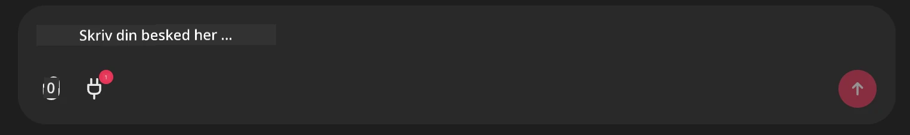

# Github MCP Server Eksempel

## Beskrivelse

Dette var en demo oprettet til AI Agents Hackathon afholdt gennem Microsoft Reactor.

Værktøjet bruges til at anbefale hackathon-projekter baseret på en brugers Github repos.
Dette gøres ved:

1. **Github Agent** - Bruger Github MCP Serveren til at hente repos og oplysninger om disse repos.
2. **Hackathon Agent** - Tager dataene fra Github Agent og udarbejder kreative hackathon-projektidéer baseret på projekterne, de sprog brugeren anvender og projektsporene for AI Agents hackathon.
3. **Events Agent** - Baseret på Hackathon Agentens forslag vil Events Agent anbefale relevante begivenheder fra AI Agent Hackathon-serien.
## Kørsel af koden 

### Miljøvariabler

Denne demo bruger Microsoft Agent Framework, Azure OpenAI Service, Github MCP Server og Azure AI Search.

Sørg for, at du har de korrekte miljøvariabler indstillet for at kunne bruge disse værktøjer:

```python
AZURE_AI_PROJECT_ENDPOINT=""
AZURE_AI_MODEL_DEPLOYMENT_NAME=""
AZURE_SEARCH_SERVICE_ENDPOINT=""
AZURE_SEARCH_API_KEY=""
``` 

## Kørsel af Chainlit-serveren

For at oprette forbindelse til MCP-serveren bruger denne demo Chainlit som chatgrænseflade. 

For at køre serveren skal du bruge følgende kommando i din terminal:

```bash
chainlit run app.py -w
```

Dette skulle starte din Chainlit-server på `localhost:8000` samt udfylde din Azure AI Search-indeks med indholdet af `event-descriptions.md`. 

## Opret forbindelse til MCP-serveren

For at oprette forbindelse til Github MCP Serveren skal du vælge "stik"-ikonet under chatboksen "Skriv din besked her.." chatboksen:



Derfra kan du klikke på "Opret forbindelse til en MCP" for at tilføje kommandoen til at oprette forbindelse til Github MCP Serveren:

```bash
npx -y @modelcontextprotocol/server-github --env GITHUB_PERSONAL_ACCESS_TOKEN=[YOUR PERSONAL ACCESS TOKEN]
```

Replace "[YOUR PERSONAL ACCESS TOKEN]" with your actual Personal Access Token. 

Efter tilslutning bør du se et (1) ved siden af stik-ikonet for at bekræfte, at det er tilsluttet. Hvis ikke, prøv at genstarte chainlit-serveren med `chainlit run app.py -w`.

## Brug af demoen 

For at starte agentworkflowen for anbefaling af hackathon-projekter kan du skrive en besked som: 

"Anbefal hackathonprojekter for Github-brugeren koreyspace"

Router Agent vil analysere din forespørgsel og bestemme hvilken kombination af agenter (GitHub, Hackathon, and Events) der er bedst egnet til at håndtere din forespørgsel. Agenterne arbejder sammen for at give omfattende anbefalinger baseret på GitHub-repositoryanalyse, projektidéudvikling og relevante tech-begivenheder.

---

<!-- CO-OP TRANSLATOR DISCLAIMER START -->
Ansvarsfraskrivelse:
Dette dokument er blevet oversat ved hjælp af AI-oversættelsestjenesten Co-op Translator (https://github.com/Azure/co-op-translator). Selvom vi stræber efter nøjagtighed, skal du være opmærksom på, at automatiske oversættelser kan indeholde fejl eller unøjagtigheder. Det originale dokument på originalsproget bør betragtes som den autoritative kilde. For kritiske oplysninger anbefales professionel menneskelig oversættelse. Vi er ikke ansvarlige for misforståelser eller fejltolkninger, der måtte opstå som følge af brugen af denne oversættelse.
<!-- CO-OP TRANSLATOR DISCLAIMER END -->