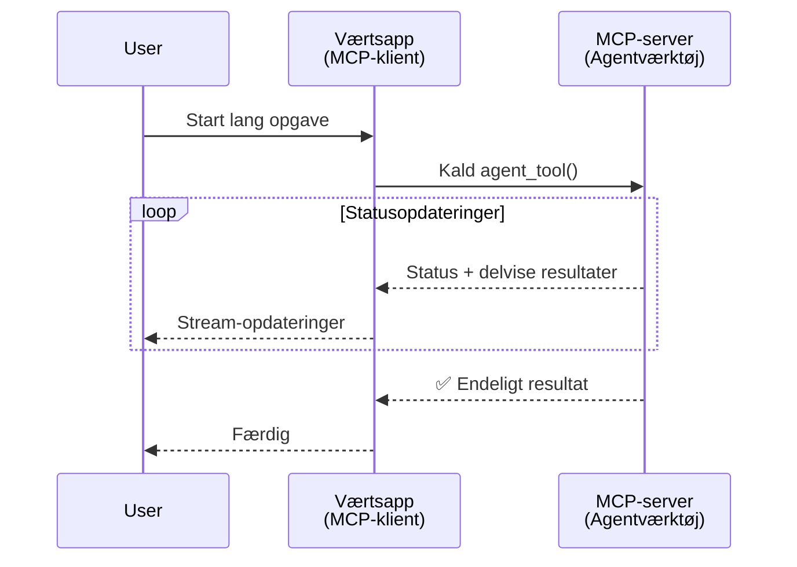
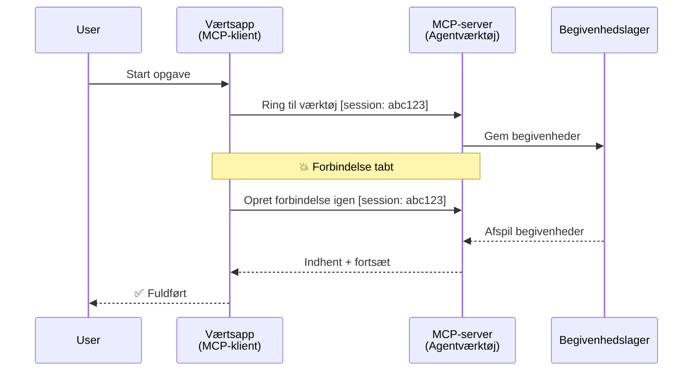
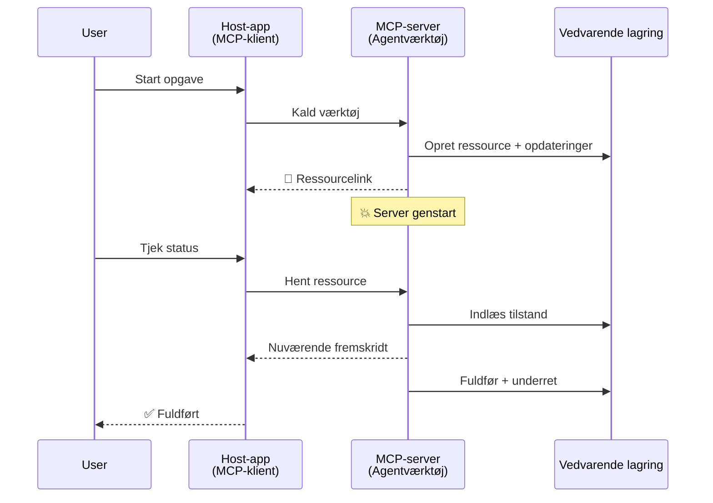
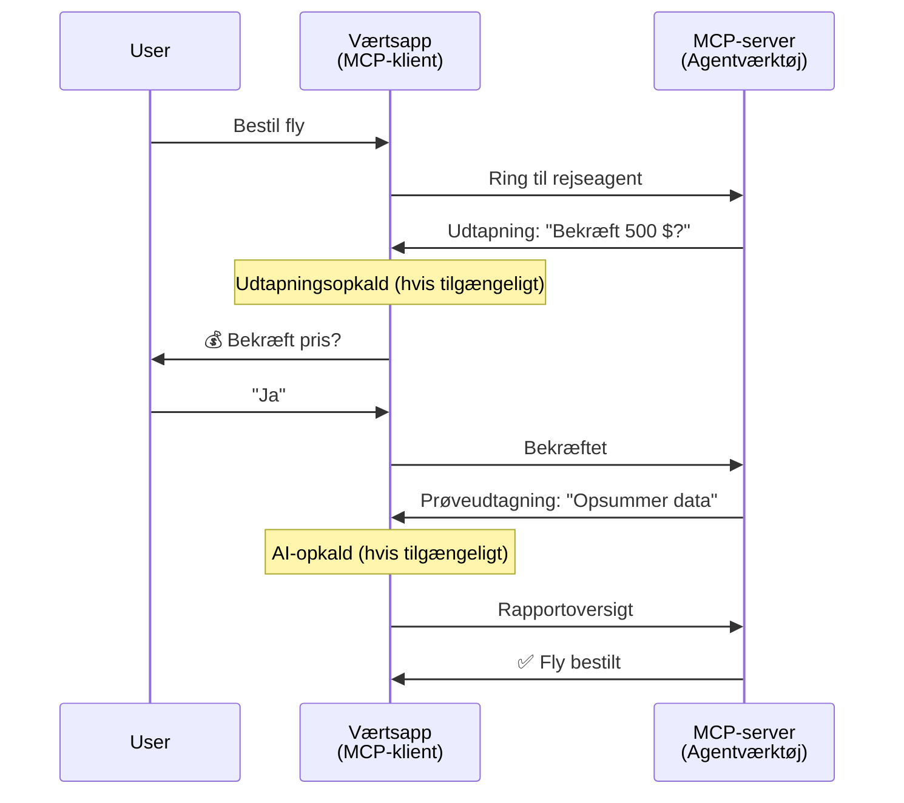
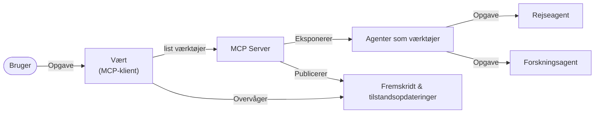

# Byg Agent-til-Agent Kommunikationssystemer med MCP

> TL;DR - Kan du bygge Agent2Agent kommunikation på MCP? Ja!

MCP har udviklet sig betydeligt ud over dets oprindelige mål om "at levere kontekst til LLM'er". Med nylige forbedringer inklusive [genoptagelige streams](https://modelcontextprotocol.io/docs/concepts/transports#resumability-and-redelivery), [elicitation](https://modelcontextprotocol.io/specification/2025-06-18/client/elicitation), [sampling](https://modelcontextprotocol.io/specification/2025-06-18/client/sampling) og notifikationer ([progression](https://modelcontextprotocol.io/specification/2025-06-18/basic/utilities/progress) og [ressourcer](https://modelcontextprotocol.io/specification/2025-06-18/schema#resourceupdatednotification)), giver MCP nu et robust fundament for at bygge komplekse agent-til-agent kommunikationssystemer.

## Misforståelsen om Agent/Værktøj

Efterhånden som flere udviklere undersøger værktøjer med agent-lignende adfærd (kører i lange perioder, kan kræve yderligere input under udførelsen osv.), er en almindelig misforståelse, at MCP er uegnet, primært fordi tidlige eksempler på dets primitive værktøjer fokuserede på simple forespørgsel-svar mønstre.

Denne opfattelse er forældet. MCP-specifikationen er blevet væsentligt forbedret i løbet af de sidste par måneder med kapaciteter, der lukker hullet for at bygge langvarende agent-lignende adfærd:

- **Streaming & Delvise Resultater**: Opdateringer af fremdrift i realtid under udførelse
- **Genoptagelighed**: Klienter kan genforbinde og fortsætte efter afbrydelse
- **Holdbarhed**: Resultater overlever server-genstart (f.eks. via ressource-links)
- **Multi-turn**: Interaktiv input under udførelse via elicitation og sampling

Disse funktioner kan kombineres for at muliggøre komplekse agent-lignende og multi-agent applikationer, alle implementeret på MCP-protokollen.

Til reference vil vi referere til en agent som et "værktøj", der er tilgængeligt på en MCP-server. Dette indebærer eksistensen af en host-applikation, der implementerer en MCP-klient, som etablerer en session med MCP-serveren og kan kalde agenten.

## Hvad Gør Et MCP-Værktøj "Agent-lignende"?

Før vi dykker ned i implementeringen, lad os fastlægge hvilke infrastrukturelle kapaciteter der er nødvendige for at understøtte langvarige agenter.

> Vi definerer en agent som en enhed, der kan operere autonomt over længere perioder, i stand til at håndtere komplekse opgaver, som kan kræve flere interaktioner eller justeringer baseret på realtids-feedback.

### 1. Streaming & Delvise Resultater

Traditionelle forespørgsel-svar mønstre fungerer ikke for langvarige opgaver. Agenter skal levere:

- Opdateringer af fremdrift i realtid
- Mellemliggende resultater

**MCP Support**: Ressourceopdateringsnotifikationer muliggør streaming af delvise resultater, selvom dette kræver omhyggelig design for at undgå konflikter med JSON-RPC's 1:1 forespørgsel/svar-model.

| Funktion                  | Brugssag                                                                                                                                                                      | MCP Support                                                                              |
| ------------------------- | ----------------------------------------------------------------------------------------------------------------------------------------------------------------------------- | ---------------------------------------------------------------------------------------- |
| Opdateringer i Realtid    | Bruger anmoder om en kodebase-migreringsopgave. Agenten streamer fremdrift: "10% - Analyserer afhængigheder... 25% - Konverterer TypeScript-filer... 50% - Opdaterer imports..." | ✅ Progressionsnotifikationer                                                             |
| Delvise Resultater        | "Generer en bog"-opgave streamer delvise resultater, f.eks. 1) Historieoversigt, 2) Kapiteloversigt, 3) Hvert kapitel som færdigt. Host kan inspicere, annullere eller omdirigere. | ✅ Notifikationer kan "udvides" til at inkludere delvise resultater se forslag i PR 383, 776  |

<div align="center" style="font-style: italic; font-size: 0.95em; margin-bottom: 0.5em;">
<strong>Figur 1:</strong> Dette diagram illustrerer, hvordan en MCP-agent streamer opdateringer om fremdrift i realtid og delvise resultater til host-applikationen under en langvarig opgave, hvilket gør det muligt for brugeren at overvåge udførelsen i realtid.
</div>



### 2. Genoptagelighed

Agenter skal håndtere netværksafbrydelser på en elegant måde:

- Genforbinde efter (klient) afbrydelse
- Fortsætte hvor de slap (beskedsgenlevering)

**MCP Support**: MCP StreamableHTTP transport understøtter i dag session-genoptagelse og besked-genlevering med sessions-ID'er og sidste begivenheds-ID'er. Det vigtige her er, at serveren skal implementere et EventStore, der muliggør genafspilning af begivenheder ved klient-genforbindelse.  
Bemærk, at der findes et fællesskabsforslag (PR #975), der undersøger transport-agnostiske genoptagelige streams.

| Funktion       | Brugssag                                                                                                                                                | MCP Support                                                            |
| ------------- | ------------------------------------------------------------------------------------------------------------------------------------------------------- | ---------------------------------------------------------------------- |
| Genoptagelighed | Klienten afbryder under langvarig opgave. Ved genforbindelse genoptages session med manglende begivenheder genafspillet og fortsætter sømløst hvor den slap. | ✅ StreamableHTTP transport med sessions-ID'er, begivenhedsafspilning og EventStore |

<div align="center" style="font-style: italic; font-size: 0.95em; margin-bottom: 0.5em;">
<strong>Figur 2:</strong> Dette diagram viser, hvordan MCP's StreamableHTTP transport og event store muliggør sømløs session-genoptagelse: hvis klienten afbryder, kan den genforbinde og genafspille manglende begivenheder, så opgaven fortsætter uden tab af fremdrift.
</div>



### 3. Holdbarhed

Langvarige agenter har brug for persistente tilstande:

- Resultater overlever server-genstart
- Status kan hentes uden for bånd
- Fremdriftssporing på tværs af sessioner

**MCP Support**: MCP understøtter nu en Ressourcelink-returtype for værktøjskald. I dag er et muligt mønster at designe et værktøj, der opretter en ressource og straks returnerer et ressource-link. Værktøjet kan fortsætte med at adressere opgaven i baggrunden og opdatere ressourcen. Til gengæld kan klienten vælge at afspørge tilstanden af denne ressource for at få delvise eller fulde resultater (baseret på hvilke ressourceopdateringer serveren leverer), eller abonnere på ressourcen for opdateringsnotifikationer.

En begrænsning her er, at afspørgning af ressourcer eller abonnementsopdateringer kan forbruge ressourcer med konsekvenser ved skala. Der findes et åbent fællesskabsforslag (inklusive #992), der undersøger muligheden for at inkludere webhooks eller triggere, som serveren kan kalde for at underrette klienten/host-applikationen om opdateringer.

| Funktion    | Brugssag                                                                                                                                       | MCP Support                                                      |
| ---------- | ---------------------------------------------------------------------------------------------------------------------------------------------- | ---------------------------------------------------------------- |
| Holdbarhed | Serveren går ned under data-migreringsopgave. Resultater og fremdrift overlever genstart, klient kan tjekke status og fortsætte fra persistent ressource. | ✅ Ressourcelinks med persistent lagring og statusnotifikationer |

I dag er et almindeligt mønster at designe et værktøj, der opretter en ressource og straks returnerer et ressource-link. Værktøjet kan i baggrunden tage sig af opgaven, udsende ressource-notifikationer, der fungerer som fremdriftsopdateringer eller indeholder delvise resultater, og opdatere indholdet i ressourcen efter behov.

<div align="center" style="font-style: italic; font-size: 0.95em; margin-bottom: 0.5em;">
<strong>Figur 3:</strong> Dette diagram viser, hvordan MCP-agenter bruger persistente ressourcer og statusnotifikationer til at sikre, at langvarige opgaver overlever server-genstart, således at klienter kan tjekke fremdrift og hente resultater, selv efter fejl.
</div>



### 4. Multi-Turn Interaktioner

Agenter har ofte brug for yderligere input under udførelsen:

- Menneskelig afklaring eller godkendelse
- AI-assistance til komplekse beslutninger
- Dynamisk justering af parametre

**MCP Support**: Fuldt understøttet via sampling (for AI-input) og elicitation (for menneskeligt input).

| Funktion                 | Brugssag                                                                                                                                     | MCP Support                                            |
| ----------------------- | -------------------------------------------------------------------------------------------------------------------------------------------- | ------------------------------------------------------ |
| Multi-Turn Interaktioner | Rejsebookingsagent anmoder om prisbekræftelse fra bruger, derefter beder AI om at opsummere rejsedata før afslutning af bookingsprocessen.      | ✅ Elicitation for menneskeligt input, sampling for AI-input |

<div align="center" style="font-style: italic; font-size: 0.95em; margin-bottom: 0.5em;">
<strong>Figur 4:</strong> Dette diagram viser, hvordan MCP-agenter interaktivt kan fremkalde menneskeligt input eller anmode om AI-assistance under udførelse og dermed understøtte komplekse, multi-turn arbejdsgange som bekræftelser og dynamisk beslutningstagning.
</div>



## Implementering af Langvarige Agenter på MCP - Kodeoversigt

Som del af denne artikel leverer vi et [kodearkiv](https://github.com/victordibia/ai-tutorials/tree/main/MCP%20Agents), der indeholder en komplet implementering af langvarige agenter ved at bruge MCP Python SDK med StreamableHTTP transport for session-genoptagelse og besked-genlevering. Implementeringen demonstrerer, hvordan MCP-kapaciteter kan kombineres for at muliggøre sofistikeret agent-lignende adfærd.

Specifikt implementerer vi en server med to primære agent-værktøjer:

- **Rejseagent** - Simulerer en rejsebookingservice med prisbekræftelse via elicitation
- **Forskningsagent** - Udfører forskningsopgaver med AI-assisterede sammenfatninger via sampling

Begge agenter demonstrerer opdateringer i realtid, interaktive bekræftelser og fuld session-genoptagelse.

### Vigtige Implementeringskoncepter

Følgende afsnit viser server-side agent-implementering og client-side host-håndtering for hver kapacitet:

#### Streaming & Fremdriftsopdateringer - Status for opgave i realtid

Streaming muliggør, at agenter kan levere opdateringer om fremdrift i realtid under langvarige opgaver og holde brugere informerede om status og mellemliggende resultater.

**Server-implementering (agent sender fremdriftsnotifikationer):**

```python
# Fra server/server.py - Rejseagent, der sender statusopdateringer
for i, step in enumerate(steps):
    await ctx.session.send_progress_notification(
        progress_token=ctx.request_id,
        progress=i * 25,
        total=100,
        message=step,
        related_request_id=str(ctx.request_id)
    )
    await anyio.sleep(2)  # Simuler arbejde

# Alternativ: Log beskeder for detaljerede trin-for-trin opdateringer
await ctx.session.send_log_message(
    level="info",
    data=f"Processing step {current_step}/{steps} ({progress_percent}%)",
    logger="long_running_agent",
    related_request_id=ctx.request_id,
)
```

**Client-implementering (host modtager fremdriftsopdateringer):**

```python
# Fra client/client.py - Klient håndterer realtidsnotifikationer
async def message_handler(message) -> None:
    if isinstance(message, types.ServerNotification):
        if isinstance(message.root, types.LoggingMessageNotification):
            console.print(f"📡 [dim]{message.root.params.data}[/dim]")
        elif isinstance(message.root, types.ProgressNotification):
            progress = message.root.params
            console.print(f"🔄 [yellow]{progress.message} ({progress.progress}/{progress.total})[/yellow]")

# Registrer beskedbehandler ved oprettelse af session
async with ClientSession(
    read_stream, write_stream,
    message_handler=message_handler
) as session:
```

#### Elicitation - Anmodning om brugerinput

Elicitation gør det muligt for agenter at anmode om brugerinput under udførelse. Dette er essentielt for bekræftelser, afklaringer eller godkendelser under langvarige opgaver.

**Server-implementering (agent anmoder om bekræftelse):**

```python
# Fra server/server.py - Rejseagent anmoder om prisbekræftelse
elicit_result = await ctx.session.elicit(
    message=f"Please confirm the estimated price of $1200 for your trip to {destination}",
    requestedSchema=PriceConfirmationSchema.model_json_schema(),
    related_request_id=ctx.request_id,
)

if elicit_result and elicit_result.action == "accept":
    # Fortsæt med booking
    logger.info(f"User confirmed price: {elicit_result.content}")
elif elicit_result and elicit_result.action == "decline":
    # Annuller bookingen
    booking_cancelled = True
```

**Client-implementering (host leverer elicitation callback):**

```python
# Fra client/client.py - Håndtering af eliciteringsanmodninger fra klienten
async def elicitation_callback(context, params):
    console.print(f"💬 Server is asking for confirmation:")
    console.print(f"   {params.message}")

    response = console.input("Do you accept? (y/n): ").strip().lower()

    if response in ['y', 'yes']:
        return types.ElicitResult(
            action="accept",
            content={"confirm": True, "notes": "Confirmed by user"}
        )
    else:
        return types.ElicitResult(
            action="decline",
            content={"confirm": False, "notes": "Declined by user"}
        )

# Registrer callback'en ved oprettelse af sessionen
async with ClientSession(
    read_stream, write_stream,
    elicitation_callback=elicitation_callback
) as session:
```

#### Sampling - Anmodning om AI-assistance

Sampling giver agenter mulighed for at anmode om LLM-assistance til komplekse beslutninger eller indholdsgenerering under udførelsen. Dette muliggør hybride menneske-AI arbejdsgange.

**Server-implementering (agent anmoder om AI-assistance):**

```python
# Fra server/server.py - Forskningsagent anmoder om AI-resumé
sampling_result = await ctx.session.create_message(
    messages=[
        SamplingMessage(
            role="user",
            content=TextContent(type="text", text=f"Please summarize the key findings for research on: {topic}")
        )
    ],
    max_tokens=100,
    related_request_id=ctx.request_id,
)

if sampling_result and sampling_result.content:
    if sampling_result.content.type == "text":
        sampling_summary = sampling_result.content.text
        logger.info(f"Received sampling summary: {sampling_summary}")
```

**Client-implementering (host leverer sampling callback):**

```python
# Fra client/client.py - Klienthåndtering af prøveudtagningsforespørgsler
async def sampling_callback(context, params):
    message_text = params.messages[0].content.text if params.messages else 'No message'
    console.print(f"🧠 Server requested sampling: {message_text}")

    # I en rigtig applikation kunne dette kalde en LLM API
    # Til demonstrationsformål leverer vi et mock-svar
    mock_response = "Based on current research, MCP has evolved significantly..."

    return types.CreateMessageResult(
        role="assistant",
        content=types.TextContent(type="text", text=mock_response),
        model="interactive-client",
        stopReason="endTurn"
    )

# Registrer callback'en ved oprettelse af sessionen
async with ClientSession(
    read_stream, write_stream,
    sampling_callback=sampling_callback,
    elicitation_callback=elicitation_callback
) as session:
```

#### Genoptagelighed - Sessionskontinuitet på tværs af afbrydelser

Genoptagelighed sikrer, at langvarige agentopgaver kan overleve klient-afbrydelser og fortsætte sømløst ved genforbindelse. Dette implementeres via begivenheds-lagre og genoptagelsestokens.

**Event Store-implementering (server opbevarer sessionstilstand):**

```python
# Fra server/event_store.py - Simpel hukommelsesbaseret begivenhedsbutik
class SimpleEventStore(EventStore):
    def __init__(self):
        self._events: list[tuple[StreamId, EventId, JSONRPCMessage]] = []
        self._event_id_counter = 0

    async def store_event(self, stream_id: StreamId, message: JSONRPCMessage) -> EventId:
        """Store an event and return its ID."""
        self._event_id_counter += 1
        event_id = str(self._event_id_counter)
        self._events.append((stream_id, event_id, message))
        return event_id

    async def replay_events_after(self, last_event_id: EventId, send_callback: EventCallback) -> StreamId | None:
        """Replay events after the specified ID for resumption."""
        start_index = None
        stream_id = None
        for index, (event_stream_id, event_id, _) in enumerate(self._events):
            if event_id == last_event_id:
                start_index = index + 1
                stream_id = event_stream_id
                break

        if start_index is None:
            return None

        # Afspil kun senere begivenheder fra sessionens oprindelige strøm.
        for event_stream_id, event_id, message in self._events[start_index:]:
            if event_stream_id != stream_id:
                continue
            await send_callback(EventMessage(message, event_id))

        return stream_id

# Fra server/server.py - Overfører begivenhedsbutik til sessionsmanager
def create_server_app(event_store: Optional[EventStore] = None) -> Starlette:
    server = ResumableServer()

    # Opret sessionsmanager med begivenhedsbutik til genoptagelse
    session_manager = StreamableHTTPSessionManager(
        app=server,
        event_store=event_store,  # Begivenhedsbutik muliggør genoptagelse af session
        json_response=False,
        security_settings=security_settings,
    )

    return Starlette(routes=[Mount("/mcp", app=session_manager.handle_request)])

# Brug: Initialiser med begivenhedsbutik
event_store = SimpleEventStore()
app = create_server_app(event_store)
```

**Client Metadata med Genoptagelsestoken (klient genforbinder med gemt tilstand):**

```python
# Fra client/client.py - Client genoptagelse med metadata
if existing_tokens and existing_tokens.get("resumption_token"):
    # Brug eksisterende genoptagelsestoken til at fortsætte, hvor vi slap
    metadata = ClientMessageMetadata(
        resumption_token=existing_tokens["resumption_token"],
    )
else:
    # Opret callback for at gemme genoptagelsestoken, når det modtages
    def enhanced_callback(token: str):
        protocol_version = getattr(session, 'protocol_version', None)
        token_manager.save_tokens(session_id, token, protocol_version, command, args)

    metadata = ClientMessageMetadata(
        on_resumption_token_update=enhanced_callback,
    )

# Send forespørgsel med genoptagelsesmetadata
result = await session.send_request(
    types.ClientRequest(
        types.CallToolRequest(
            method="tools/call",
            params=types.CallToolRequestParams(name=command, arguments=args)
        )
    ),
    types.CallToolResult,
    metadata=metadata,
)
```

Host-applikationen opretholder sessions-ID'er og genoptagelsestokens lokalt, hvilket gør det muligt at genforbinde til eksisterende sessioner uden tab af fremdrift eller tilstand.

### Kodeorganisering

<div align="center" style="font-style: italic; font-size: 0.95em; margin-bottom: 0.5em;">
<strong>Figur 5:</strong> MCP-baseret agent systemarkitektur
</div>



**Vigtige filer:**

- **`server/server.py`** - Genoptagelig MCP-server med rejse- og forskningsagenter, der demonstrerer elicitation, sampling og fremdriftsopdateringer
- **`client/client.py`** - Interaktiv host-applikation med genoptagelsessupport, callback-handlere og tokenstyring
- **`server/event_store.py`** - Event store-implementering, der muliggør session-genoptagelse og besked-genlevering

## Udvidelse til Multi-Agent Kommunikation på MCP

Ovenstående implementering kan udvides til multi-agent systemer ved at forbedre host-applikationens intelligens og omfang:

- **Intelligent Opgavedekomponering**: Host analyserer komplekse brugerforespørgsler og opdeler dem i underopgaver til forskellige specialiserede agenter
- **Multi-Server Koordination**: Host opretholder forbindelser til flere MCP-servere, hver med forskellige agentkapaciteter
- **Opgavestatusstyring**: Host sporer fremdrift på tværs af samtidige agentopgaver, håndterer afhængigheder og rækkefølge
- **Robusthed & Forsøg Igen**: Host håndterer fejl, implementerer retry-logik og omdirigerer opgaver, når agenter bliver utilgængelige
- **Resultatsyntese**: Host kombinerer outputs fra flere agenter til sammenhængende endelige resultater

Host udvikler sig fra en simpel klient til en intelligent orkestrator, der koordinerer distribuerede agentkapaciteter, samtidig med at det samme MCP-protokol fundament opretholdes.

## Konklusion

MCP's forbedrede kapaciteter - ressourcenotifikationer, elicitation/sampling, genoptagelige streams og persistente ressourcer - muliggør komplekse agent-til-agent interaktioner, mens protokollens enkelhed bevares.

## Kom Godt I Gang

Klar til at bygge dit eget agent2agent system? Følg disse trin:

### 1. Kør Demoen

```bash
# Start serveren med begivenhedslager for genoptagelse
python -m server.server --port 8006

# I et andet terminalvindue, kør den interaktive klient
python -m client.client --url http://127.0.0.1:8006/mcp
```

**Tilgængelige kommandoer i interaktiv tilstand:**

- `travel_agent` - Book rejse med prisbekræftelse via elicitation
- `research_agent` - Forskningsemner med AI-assisterede sammenfatninger via sampling
- `list` - Vis alle tilgængelige værktøjer
- `clean-tokens` - Ryd genoptagelsestokens
- `help` - Vis detaljeret kommandohjælp
- `quit` - Afslut klienten

### 2. Test Genoptagelsesevner

- Start en langvarig agent (f.eks. `travel_agent`)
- Afbryd klienten under udførelse (Ctrl+C)
- Genstart klienten - den genoptager automatisk, hvor den slap

### 3. Udforsk og Udvid

- **Udforsk eksemplerne**: Se dette [mcp-agents](https://github.com/victordibia/ai-tutorials/tree/main/MCP%20Agents)
- **Deltag i fællesskabet**: Deltag i MCP-diskussioner på GitHub
- **Eksperimenter**: Start med en simpel langvarig opgave og tilføj gradvist streaming, genoptagelighed og multi-agent koordination

Dette demonstrerer, hvordan MCP muliggør intelligent agent-adfærd samtidig med at værktøjsbaseret enkelhed bevares.

Overordnet set udvikler MCP-protokol-specifikationen sig hurtigt; læseren opfordres til at gennemgå den officielle dokumentationsside for de seneste opdateringer - https://modelcontextprotocol.io/introduction

---

<!-- CO-OP TRANSLATOR DISCLAIMER START -->
**Ansvarsfraskrivelse**:
Dette dokument er blevet oversat ved hjælp af AI-oversættelsestjenesten [Co-op Translator](https://github.com/Azure/co-op-translator). Selvom vi bestræber os på nøjagtighed, skal du være opmærksom på, at automatiserede oversættelser kan indeholde fejl eller unøjagtigheder. Det originale dokument på dets oprindelige sprog bør betragtes som den autoritative kilde. For kritisk information anbefales professionel menneskelig oversættelse. Vi påtager os intet ansvar for misforståelser eller fejltolkninger, der opstår som følge af brugen af denne oversættelse.
<!-- CO-OP TRANSLATOR DISCLAIMER END -->