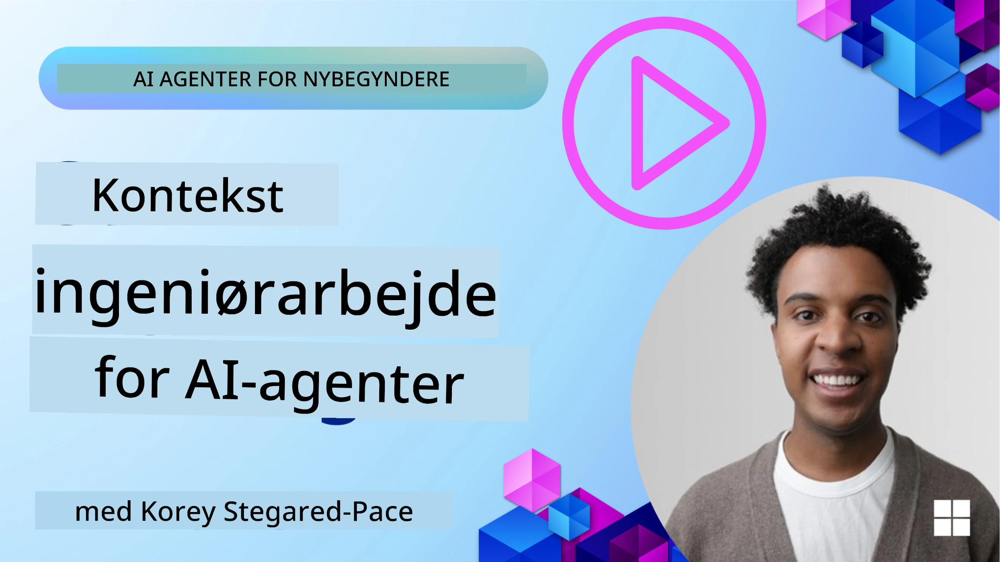
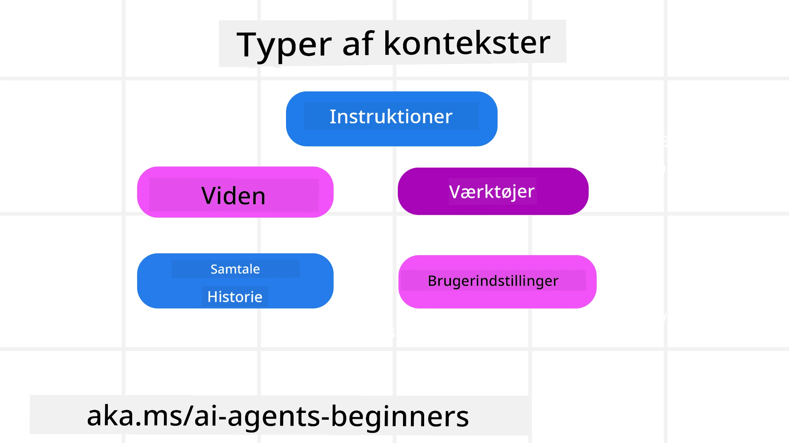
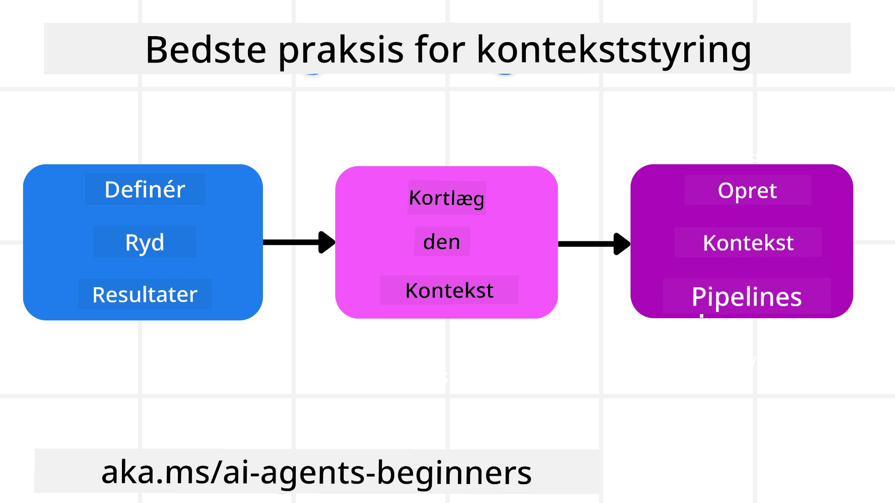

# Kontekstteknik for AI-agenter

> _(Klik på billedet ovenfor for at se videoen af denne lektion)_

At forstå kompleksiteten af den applikation, du bygger en AI-agent til, er vigtigt for at lave en pålidelig en. Vi skal bygge AI-agenter, der effektivt håndterer information for at imødekomme komplekse behov ud over prompt engineering.

I denne lektion vil vi se på, hvad kontekstteknik er, og hvilken rolle det spiller i at bygge AI-agenter.

## Introduktion

Denne lektion vil dække:

• **Hvad kontekstteknik er** og hvorfor det er forskelligt fra prompt engineering.

• **Strategier til effektiv kontekstteknik**, herunder hvordan man skriver, udvælger, komprimerer og isolerer information.

• **Almindelige kontekstfejl**, der kan spore din AI-agent af, og hvordan man retter dem.

## Læringsmål

Efter at have gennemført denne lektion vil du forstå, hvordan du:

• **Definerer kontekstteknik** og adskiller det fra prompt engineering.

• **Identificerer nøglekomponenterne af kontekst** i applikationer baseret på Large Language Models (LLM).

• **Anvender strategier til at skrive, udvælge, komprimere og isolere kontekst** for at forbedre agentens ydeevne.

• **Genkender almindelige kontekstfejl** såsom forgiftning, distraktion, forvirring og sammenstød, og implementerer afbødende teknikker.

## Hvad er kontekstteknik?

For AI-agenter er kontekst det, der driver planlægningen af en AI-agent til at tage bestemte handlinger. Kontekstteknik er praksissen med at sikre, at AI-agenten har den rette information til at fuldføre det næste trin i opgaven. Kontekstvinduet er begrænset i størrelse, så som agentudviklere skal vi bygge systemer og processer til at styre tilføjelse, fjernelse og kondensering af information i kontekstvinduet.

### Prompt engineering vs kontekstteknik

Prompt engineering fokuserer på et enkelt sæt statiske instruktioner for effektivt at styre AI-agenter med et regelsæt. Kontextteknik handler om at håndtere et dynamisk informationssæt, inklusive den indledende prompt, for at sikre, at AI-agenten over tid har det, den behøver. Hovedideen med kontekstteknik er at gøre denne proces gentagelig og pålidelig.

### Typer af kontekst

Det er vigtigt at huske, at kontekst ikke bare er én ting. Den information, som AI-agenten har brug for, kan komme fra en række forskellige kilder, og det er op til os at sikre, at agenten har adgang til disse kilder:

De typer kontekst, en AI-agent kan have behov for at håndtere, inkluderer:

• **Instruktioner:** Disse er som agentens "regler" – prompts, systembeskeder, få-skud-eksempler (der viser AI, hvordan man gør noget), og beskrivelser af værktøjer, den kan bruge. Her kombineres fokusset på prompt engineering med kontekstteknik.

• **Viden:** Dette dækker fakta, information hentet fra databaser eller langsigtede erindringer, agenten har opsamlet. Dette inkluderer integration af et Retrieval Augmented Generation (RAG)-system, hvis agenten skal have adgang til forskellige videnlagre og databaser.

• **Værktøjer:** Dette er definitionerne af eksterne funktioner, API’er og MCP-servere, som agenten kan kalde, sammen med feedback (resultater) den får ved at bruge dem.

• **Samtalehistorik:** Den igangværende dialog med en bruger. Med tiden bliver disse samtaler længere og mere komplekse, hvilket betyder, at de fylder plads i kontekstvinduet.

• **Brugerpræferencer:** Informationer lært om en brugers præferencer over tid. Disse kan gemmes og tilkaldes ved nøglebeslutninger for at hjælpe brugeren.

## Strategier for effektiv kontekstteknik

### Planlægningsstrategier

God kontekstteknik starter med god planlægning. Her er en tilgang, der vil hjælpe dig med at begynde at tænke over, hvordan du anvender konceptet kontekstteknik:

1. **Definér klare resultater** – Resultaterne af de opgaver, AI-agenter skal udføre, bør defineres klart. Besvar spørgsmålet – "Hvordan vil verden se ud, når AI-agenten er færdig med sin opgave?" Med andre ord, hvilken ændring, information eller svar skal brugeren have efter interaktion med AI-agenten.

2. **Kortlæg konteksten** – Når du har defineret agentens resultater, skal du besvare spørgsmålet "Hvilken information har AI-agenten brug for for at fuldføre denne opgave?". På den måde kan du begynde at kortlægge, hvor den information kan findes.

3. **Skab kontekst-pipelines** – Nu hvor du ved, hvor informationen er, skal du besvare spørgsmålet "Hvordan får agenten denne information?". Dette kan gøres på forskellige måder, herunder RAG, brug af MCP-servere og andre værktøjer.

### Praktiske strategier

Planlægning er vigtigt, men når information begynder at strømme ind i agentens kontekstvindue, skal vi have praktiske strategier til at håndtere det:

#### Håndtering af kontekst

Mens noget information automatisk bliver tilføjet til kontekstvinduet, handler kontekstteknik om at tage en mere aktiv rolle i denne information, hvilket kan gøres med et par strategier:

 1. **Agent-scratchpad**  
 Dette tillader en AI-agent at tage noter over relevant information om de aktuelle opgaver og brugerinteraktioner i løbet af en enkelt session. Dette bør eksistere uden for kontekstvinduet i en fil eller runtime-objekt, som agenten senere kan hente under denne session, hvis det er nødvendigt.

 2. **Erindringer**  
 Scratchpads er gode til at håndtere information uden for kontekstvinduet i en enkelt session. Erindringer gør det muligt for agenter at gemme og hente relevant information på tværs af flere sessioner. Det kan inkludere opsummeringer, brugerpræferencer og feedback til forbedringer i fremtiden.

 3. **Komprimering af kontekst**  
 Når kontekstvinduet vokser og nærmer sig sin grænse, kan teknikker som opsummering og beskæring anvendes. Det inkluderer enten kun at beholde den mest relevante information eller fjerne ældre beskeder.
  
 4. **Multi-agent-systemer**  
 Udvikling af multi-agent-systemer er en form for kontekstteknik, fordi hver agent har sit eget kontekstvindue. Hvordan denne kontekst deles og gives til forskellige agenter, er noget, man skal planlægge, når man bygger disse systemer.
  
 5. **Sandkasse-miljøer**  
 Hvis en agent skal køre noget kode eller behandle store mængder information i et dokument, kan dette kræve mange tokens til at behandle resultaterne. I stedet for at have alt lagret i kontekstvinduet, kan agenten bruge et sandkasse-miljø, der kan køre koden og kun læse resultaterne og anden relevant information.
  
 6. **Runtime state-objekter**  
 Dette gøres ved at skabe informationscontainere til at håndtere situationer, hvor agenten skal have adgang til visse oplysninger. For en kompleks opgave gør dette det muligt for agenten at gemme resultaterne af hver delopgave trin for trin, hvilket sikrer, at konteksten kun forbliver knyttet til den specifikke delopgave.

#### Inspektion af kontekst

Når du har anvendt en af disse strategier, er det værd at tjekke, hvad det næste modelkald faktisk modtog. Et nyttigt fejlfindingsspørgsmål er:

> Indlæste agenten for meget kontekst, forkert kontekst, eller manglede den kontekst, den havde brug for?

Du behøver ikke logge rå prompts, værktøjsoutput eller hukommelsesindhold for at besvare det spørgsmål. I produktion foretrækkes små kontekstinspektionsregistre, der fanger tællinger, id’er, hashes og politikmærkater:

- **Udvælgelse:** Spor hvor mange kandidatstykker, værktøjer eller erindringer der blev overvejet, hvor mange der blev valgt, og hvilken regel eller score der fik de andre til at blive filtreret fra.
- **Komprimering:** Registrer kildeområde eller sporings-id, opsummerings-id, et estimeret tokenantal før og efter komprimering, og om det rå indhold blev udelukket fra næste kald.
- **Isolation:** Noter hvilken delopgave, der kørte i en separat agent, session eller sandkasse, hvilken afgrænset opsummering der blev returneret, og om stort værktøjsoutput blev holdt uden for hovedagentens kontekst.
- **Hukommelse og RAG:** Gem id’er for hentede dokumenter, hukommelses-id’er, scores, valgte id’er og redaktionstilstand i stedet for fuld hentet tekst.
- **Sikkerhed og privatliv:** Foretræk hashes, id’er, token-spande og politikmærkater frem for følsom prompttekst, værktøjsargumenter, værktøjsresultater eller brugerhukommelsesindhold.

Målet er ikke at beholde mere kontekst. Det er at efterlade nok bevis, så en udvikler kan afgøre, hvilken kontekststrategi der blev anvendt, og om den ændrede det næste modelkald på den tilsigtede måde.

### Eksempel på kontekstteknik

Lad os sige, at vi vil have en AI-agent til at **"Booke en rejse til Paris for mig."**

• En simpel agent, der kun bruger prompt engineering, ville måske blot svare: **"Okay, hvornår vil du gerne rejse til Paris?"** Den behandlede kun dit direkte spørgsmål på det tidspunkt, hvor brugeren spurgte.

• En agent, der bruger de kontekstteknik-strategier, vi har gennemgået, ville gøre meget mere. Før den overhovedet svarer, kan systemet for eksempel:

  ◦ **Tjekke din kalender** for ledige datoer (henter realtidsdata).

 ◦ **Huske tidligere rejsepræferencer** (fra langsigtet hukommelse) som foretrukket flyselskab, budget eller om du foretrækker direkte fly.

 ◦ **Identificere tilgængelige værktøjer** til fly- og hotelbooking.

- Så kunne et eksempel på svar være: "Hej [Dit Navn]! Jeg kan se, at du er ledig i den første uge af oktober. Skal jeg kigge efter direkte fly til Paris med [Foretrukket Flyselskab] inden for dit sædvanlige budget på [Budget]?" Dette mere rige, kontekstbevidste svar demonstrerer styrken af kontekstteknik.

## Almindelige kontekstfejl

### Kontekstforgiftning

**Hvad det er:** Når en hallucination (falsk information genereret af LLM) eller en fejl kommer ind i konteksten og gentagne gange refereres til, hvilket får agenten til at forfølge umulige mål eller udvikle nonsens-strategier.

**Hvad man skal gøre:** Implementer **kontekstvalidering** og **karantæne**. Valider information, før den føjes til langsigtet hukommelse. Hvis potentiel forgiftning opdages, start nye konteksttråde for at forhindre, at den dårlige information spredes.

**Eksempel ved rejsebooking:** Din agent hallucinerer en **direkte flyvning fra en lille lokal lufthavn til en fjern international by**, som faktisk ikke tilbyder internationale flyvninger. Denne ikke-eksisterende flyoplysning gemmes i konteksten. Senere, når du beder agenten om at booke, fortsætter den med at forsøge at finde billetter til denne umulige rute, hvilket fører til gentagne fejl.

**Løsning:** Implementer et trin, der **validerer flyrejsens eksistens og ruter med en realtids-API** _før_ flydetaljen tilføjes til agentens arbejds-kontekst. Hvis valideringen fejler, sættes den fejlagtige information i "karantæne" og bruges ikke yderligere.

### Kontekstdistraktion

**Hvad det er:** Når konteksten bliver så stor, at modellen fokuserer for meget på den akkumulerede historie i stedet for det, den lærte under træningen, hvilket fører til gentagende eller ubrugelige handlinger. Modeller kan begå fejl, selv før kontekstvinduet er fyldt.

**Hvad man skal gøre:** Brug **kontekstsammenfatning**. Komprimer periodisk den opsamlede information til kortere opsummeringer, der bevarer vigtige oplysninger, mens redundant historie fjernes. Dette hjælper med at "nulstille" fokus.

**Eksempel ved rejsebooking:** Du har i lang tid diskuteret forskellige drømmerejsemål, inklusive en detaljeret genfortælling af din rygsækrejse for to år siden. Da du endelig beder om **"at finde en billig flyrejse til næste måned,"** bliver agenten begravet i gamle, irrelevante detaljer og bliver ved med at spørge om din rygsækudrustning eller tidligere rejseplaner, mens den forsømmer din aktuelle forespørgsel.

**Løsning:** Efter et vist antal samtaler eller når konteksten bliver for stor, skal agenten **opsummere de seneste og mest relevante dele af samtalen** – med fokus på dine aktuelle rejsedatoer og destination – og bruge denne kondenserede opsummering til det næste LLM-kald, mens den mindre relevante historiske chat kasseres.

### Kontekstforvirring

**Hvad det er:** Når unødvendig kontekst, ofte i form af for mange tilgængelige værktøjer, får modellen til at generere dårlige svar eller kalde irrelevante værktøjer. Mindre modeller er særligt udsatte for dette.

**Hvad man skal gøre:** Implementer **værktøjsloadout-styring** ved hjælp af RAG-teknikker. Gem værktøjsbeskrivelser i en vektordatabase og vælg _kun_ de mest relevante værktøjer til hver specifik opgave. Forskning viser, at begrænsning til færre end 30 værktøjer er effektivt.

**Eksempel ved rejsebooking:** Din agent har adgang til dusinvis af værktøjer: `book_flight`, `book_hotel`, `rent_car`, `find_tours`, `currency_converter`, `weather_forecast`, `restaurant_reservations` osv. Du spørger, **"Hvad er den bedste måde at komme rundt i Paris på?"** På grund af det store antal værktøjer bliver agenten forvirret og forsøger at kalde `book_flight` _inden for_ Paris eller `rent_car`, selvom du foretrækker offentlig transport, fordi værktøjsbeskrivelserne måske overlapper, eller det simpelthen ikke kan finde ud af det bedste.

**Løsning:** Brug **RAG over værktøjsbeskrivelser**. Når du spørger om at komme rundt i Paris, henter systemet dynamisk _kun_ de mest relevante værktøjer som `rent_car` eller `public_transport_info` baseret på din forespørgsel og præsenterer en fokuseret "loadout" til LLM.

### Kontekstkollision

**Hvad det er:** Når modstridende information findes i konteksten, hvilket fører til inkonsistent ræsonnering eller dårlige endelige svar. Dette sker ofte, når information ankommer i faser, og tidlige, forkerte antagelser forbliver i konteksten.

**Hvad man skal gøre:** Brug **kontekstbeskæring** og **aflastning**. Beskæring betyder at fjerne forældet eller modstridende information, når nye detaljer kommer til. Aflastning giver modellen et separat "scratchpad"-arbejdsområde til at behandle information, uden at rodet lægges i hovedkonteksten.
**Rejsebookningseksempel:** Du fortæller først din agent, **"Jeg vil flyve på økonomiklasse."** Senere i samtalen ændrer du mening og siger, **"Faktisk, til denne rejse, lad os tage business class."** Hvis begge instruktioner forbliver i konteksten, kan agenten få modstridende søgeresultater eller blive forvirret om, hvilken præference der skal prioriteres.

**Løsning:** Implementer **kontekstsanering**. Når en ny instruktion modsiger en gammel, fjernes den ældre instruktion eller bliver eksplicit overskrevet i konteksten. Alternativt kan agenten bruge en **scratchpad** for at forlige modstridende præferencer før en beslutning, og dermed sikre, at kun den endelige, konsistente instruktion styrer dens handlinger.

## Har du flere spørgsmål om kontekststyring?

Deltag i [Microsoft Foundry Discord](https://aka.ms/ai-agents/discord) for at møde andre lærende, deltage i kontortimer og få svar på dine spørgsmål om AI-agenter.

---

<!-- CO-OP TRANSLATOR DISCLAIMER START -->
**Ansvarsfraskrivelse**:
Dette dokument er blevet oversat ved hjælp af AI-oversættelsestjenesten [Co-op Translator](https://github.com/Azure/co-op-translator). Selvom vi bestræber os på nøjagtighed, skal du være opmærksom på, at automatiserede oversættelser kan indeholde fejl eller unøjagtigheder. Det originale dokument på dets oprindelige sprog bør betragtes som den autoritative kilde. For kritisk information anbefales professionel menneskelig oversættelse. Vi påtager os intet ansvar for misforståelser eller fejltolkninger, der opstår som følge af brugen af denne oversættelse.
<!-- CO-OP TRANSLATOR DISCLAIMER END -->