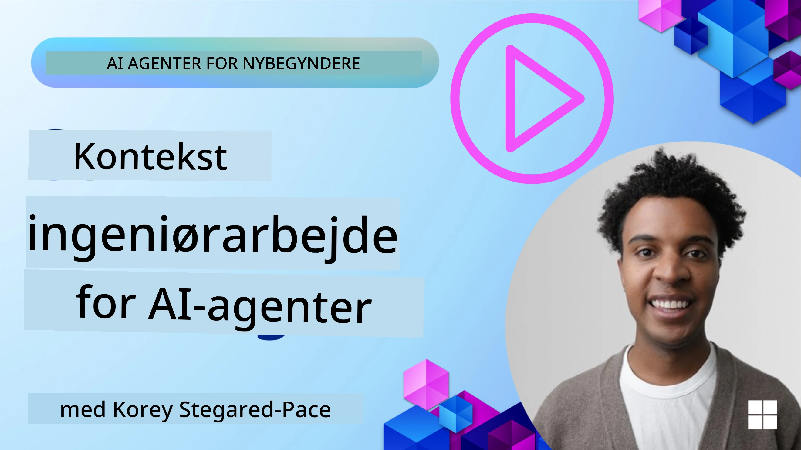
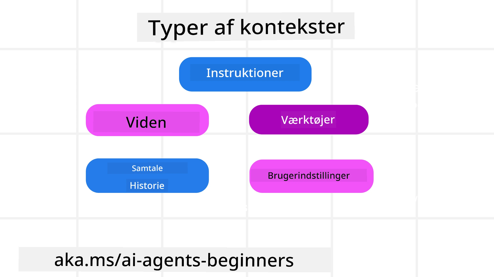
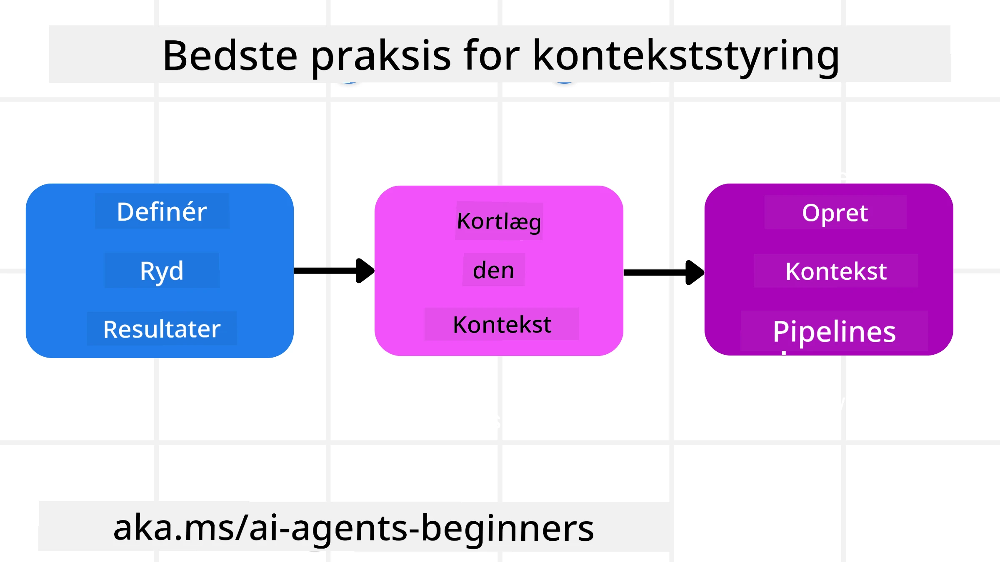

# Context Engineering for AI-agenter

> _(Klik på billedet ovenfor for at se video af denne lektion)_

At forstå kompleksiteten af den applikation, du bygger en AI-agent til, er vigtigt for at skabe en pålidelig en. Vi har brug for at bygge AI-agenter, der effektivt håndterer information for at imødekomme komplekse behov ud over prompt engineering.

I denne lektion vil vi se på, hvad context engineering er, og hvilken rolle det spiller i opbygningen af AI-agenter.

## Introduktion

Denne lektion vil dække:

• **Hvad Context Engineering er**, og hvorfor det adskiller sig fra prompt engineering.

• **Strategier for effektiv Context Engineering**, herunder hvordan man skriver, vælger, komprimerer og isolerer information.

• **Almindelige kontekstfejl**, der kan vælte din AI-agent, og hvordan man rettter dem.

## Læringsmål

Efter at have gennemført denne lektion vil du forstå, hvordan man:

• **Definerer context engineering** og skelner det fra prompt engineering.

• **Identificerer nøglekomponenterne i kontekst** i Large Language Model (LLM)-applikationer.

• **Anvender strategier for at skrive, vælge, komprimere og isolere kontekst** for at forbedre agentens ydeevne.

• **Genkender almindelige kontekstfejl** som forgiftning, distraktion, forvirring og konflikt, og implementerer afhjælpningsteknikker.

## Hvad er Context Engineering?

For AI-agenter er kontekst det, der styrer planlægningen af en AI-agent til at tage bestemte handlinger. Context Engineering er praksis med at sikre, at AI-agenten har den rette information til at fuldføre næste trin i opgaven. Kontekstvinduet er begrænset i størrelse, så som agentbyggere skal vi bygge systemer og processer til at håndtere tilføjelse, fjernelse og sammenpresning af informationen i kontekstvinduet.

### Prompt Engineering vs Context Engineering

Prompt engineering fokuserer på et enkelt sæt statiske instruktioner til effektivt at guide AI-agenter med et regelsæt. Context engineering handler om at håndtere et dynamisk sæt information, inklusive den oprindelige prompt, for at sikre, at AI-agenten har det, den behøver over tid. Hovedideen bag context engineering er at gøre denne proces gentagelig og pålidelig.

### Typer af kontekst

Det er vigtigt at huske, at kontekst ikke blot er én ting. Den information, som AI-agenten har brug for, kan komme fra forskellige kilder, og det er op til os at sikre, at agenten har adgang til disse kilder:

De typer af kontekst, en AI-agent måske skal håndtere, inkluderer:

• **Instruktioner:** Disse er ligesom agentens "regler" – prompts, systemmeddelelser, few-shot-eksempler (der viser AI, hvordan man gør noget) og beskrivelser af værktøjer, den kan bruge. Her kombineres fokus på prompt engineering med context engineering.

• **Viden:** Dette dækker fakta, information hentet fra databaser eller langtidsminder, som agenten har akkumuleret. Det inkluderer integration af et Retrieval Augmented Generation (RAG)-system, hvis en agent har brug for adgang til forskellige videnslager og databaser.

• **Værktøjer:** Disse er definitioner af eksterne funktioner, API’er og MCP-servere, som agenten kan kalde, sammen med den feedback (resultater), den får ved at bruge dem.

• **Samtalehistorik:** Den igangværende dialog med en bruger. Med tiden bliver disse samtaler længere og mere komplekse, hvilket betyder, at de optager plads i kontekstvinduet.

• **Brugerpræferencer:** Information lært om en brugers præferencer eller aversioner over tid. Disse kan gemmes og anvendes ved vigtige beslutninger til at hjælpe brugeren.

## Strategier for effektiv Context Engineering

### Planlægningsstrategier

God context engineering starter med god planlægning. Her er en tilgang, der vil hjælpe dig med at begynde at tænke på, hvordan du anvender begrebet context engineering:

1. **Definer klare resultater** – Resultaterne af de opgaver, AI-agenter skal udføre, bør være klart defineret. Besvar spørgsmålet - "Hvordan vil verden se ud, når AI-agenten er færdig med sin opgave?" Med andre ord, hvilken ændring, information eller respons skal brugeren have efter interaktion med AI-agenten.
2. **Kortlæg konteksten** – Når du har defineret AI-agentens resultater, skal du besvare spørgsmålet: "Hvilken information skal AI-agenten bruge for at fuldføre denne opgave?". På den måde kan du begynde at kortlægge, hvor denne information kan findes.
3. **Opret kontekstpipelines** – Nu hvor du ved, hvor informationen er, skal du besvare spørgsmålet: "Hvordan får agenten denne information?". Dette kan gøres på forskellige måder, herunder RAG, brug af MCP-servere og andre værktøjer.

### Praktiske strategier

Planlægning er vigtig, men når information begynder at strømme ind i vores agents kontekstvindue, skal vi have praktiske strategier til at håndtere det:

#### Håndtering af kontekst

Mens noget information automatisk vil blive tilføjet til kontekstvinduet, handler context engineering om at tage en mere aktiv rolle i denne information, hvilket kan gøres ved flere strategier:

 1. **Agent Scratchpad**  
 Dette tillader en AI-agent at tage noter af relevant information om aktuelle opgaver og brugerinteraktioner i løbet af en enkelt session. Dette bør eksistere udenfor kontekstvinduet i en fil eller runtime-objekt, som agenten senere kan hente under denne session, hvis nødvendigt.

 2. **Minder**  
 Scratchpads er gode til at håndtere information uden for kontekstvinduet i en enkelt session. Minder muliggør, at agenter kan gemme og hente relevant information på tværs af flere sessioner. Dette kan inkludere sammenfatninger, brugerpræferencer og feedback til forbedringer i fremtiden.

 3. **Komprimering af kontekst**  
 Når kontekstvinduet vokser og nærmer sig sin grænse, kan teknikker som opsummering og trimming benyttes. Det indebærer enten at beholde kun den mest relevante information eller fjerne ældre beskeder.

 4. **Multi-agent systemer**  
 Udvikling af multi-agent systemer er en form for context engineering, fordi hver agent har sit eget kontekstvindue. Hvordan denne kontekst deles og overføres til forskellige agenter, er en anden ting, der skal planlægges ved opbygningen af disse systemer.

 5. **Sandbox-miljøer**  
 Hvis en agent skal køre noget kode eller behandle store mængder information i et dokument, kan det tage mange tokens at behandle resultaterne. I stedet for at have al denne information lagret i kontekstvinduet, kan agenten bruge et sandbox-miljø, som kan køre denne kode og kun læse resultaterne og anden relevant information.

 6. **Runtime State Objects**  
 Dette gøres ved at oprette informationscontainere til at håndtere situationer, hvor agenten har brug for adgang til visse informationer. For en kompleks opgave muliggør dette, at en agent kan gemme resultaterne af hver delopgave trin for trin, så konteksten forbliver knyttet til netop den delopgave.

#### Inspektion af kontekst

Efter du har anvendt en af disse strategier, er det værd at tjekke, hvad det næste modelkald faktisk modtog. Et nyttigt debugging-spørgsmål er:

> Indlæste agenten for meget kontekst, den forkerte kontekst, eller manglede den kontekst, den havde brug for?

Du behøver ikke at logge rå prompts, værktøjsoutput eller memory-indhold for at besvare det spørgsmål. I produktion foretrækkes små kontekstinspektionslogfiler, der fanger tællinger, id’er, hashes og politiklabels:

- **Udvælgelse:** Spor, hvor mange kandidatdele, værktøjer eller minder der blev overvejet, hvor mange der blev udvalgt, og hvilken regel eller score der fik de andre filtreret ud.
- **Kompressering:** Registrer kilderefleksionsområde eller trace-id, sammenfatnings-id, et anslået tokenantal før og efter komprimering, og om det rå indhold blev udelukket fra næste kald.
- **Isolation:** Notér hvilken delopgave, der blev kørt i en separat agent, session eller sandbox, hvilken begrænset sammenfatning der blev returneret, og om stort værktøjsoutput blev holdt uden for den overordnede agentkontekst.
- **Memory og RAG:** Gem retrieval-dokument-id’er, memory-id’er, scorer, valgte id’er og redigeringsstatus i stedet for fuld hentet tekst.
- **Sikkerhed og privatliv:** Foretræk hashes, id’er, token buckets og politiklabels fremfor sensitiv prompttekst, værktøjsargumenter, værktøjsresultater eller bruger-memory-tekster.

Målet er ikke at beholde mere kontekst. Det er at efterlade nok beviser til, at en udvikler kan se, hvilken kontekststrategi der kørte, og om den ændrede det næste modelkald på den tiltænkte måde.

### Eksempel på Context Engineering

Lad os sige, at vi vil have en AI-agent til at **"Booke en rejse til Paris for mig."**

• En simpel agent, der kun bruger prompt engineering, kunne bare svare: **"Okay, hvornår vil du gerne rejse til Paris?"** Den behandlede kun dit direkte spørgsmål på det tidspunkt, brugeren spurgte.

• En agent, der bruger de omhandlede context engineering-strategier, ville gøre meget mere. Før den overhovedet svarer, kunne dens system:

  ◦ **Tjekke din kalender** for ledige datoer (henter realtidsdata).

 ◦ **Genkalde tidligere rejsepræferencer** (fra langtidsmemory) som dit foretrukne flyselskab, budget eller om du foretrækker direkte flyvninger.

 ◦ **Identificere tilgængelige værktøjer** til fly- og hotelbooking.

- Så kunne et eksempel-svar være: "Hej [Dit Navn]! Jeg kan se, at du er ledig den første uge i oktober. Skal jeg kigge efter direkte flyvninger til Paris med [Foretrukket Flyselskab] inden for dit sædvanlige budget på [Budget]?" Dette rigere, kontekstbevidste svar demonstrerer styrken i context engineering.

## Almindelige kontekstfejl

### Context Poisoning

**Hvad det er:** Når en hallucination (forkert information genereret af LLM) eller en fejl kommer ind i konteksten og gentagne gange refereres til, hvilket får agenten til at forfølge umulige mål eller udvikle nonsensstrategier.

**Hvad man gør:** Implementer **kontekstvalidering** og **kwarantæne**. Valider information, før den tilføjes til langtidsmemory. Hvis potentiel forgiftning opdages, start nye konteksttråde for at forhindre, at den dårlige information spreder sig.

**Eksempel ved rejsebooking:** Din agent hallucinere en **direkte flyvning fra en lille lokal lufthavn til en fjern international by**, som ikke rent faktisk tilbyder internationale flyvninger. Denne ikke-eksisterende flydetalje gemmes i konteksten. Senere, når du beder agenten booke, bliver den ved med at prøve at finde billetter til denne umulige rute, hvilket fører til gentagne fejl.

**Løsning:** Implementer et trin, der **validerer flyforekomsten og ruter med en realtids-API** _før_ flydetaljen tilføjes til agentens arbejdskontekst. Hvis valideringen fejler, "kwarantænes" den fejlbehæftede information og bruges ikke videre.

### Context Distraction

**Hvad det er:** Når konteksten bliver så stor, at modellen fokuserer for meget på den akkumulerede historik i stedet for at bruge det, den lærte under træning, hvilket fører til repetitive eller ualmindeligt hjælpsomme handlinger. Modeller kan begynde at lave fejl, selv før kontekstvinduet er fyldt.

**Hvad man gør:** Brug **kontekstsammenfatning**. Periodisk komprimer akkumuleret information til kortere sammenfatninger, bevare vigtige detaljer mens redundant historik fjernes. Dette hjælper med at "nulstille" fokus.

**Eksempel ved rejsebooking:** Du har diskuteret mange drømmerejsedestinationer i lang tid, inklusive en detaljeret gennemgang af din rygsæksrejse fra for to år siden. Når du endelig beder om at **"finde en billig flybillet til næste måned,"** bliver agenten fanget i gamle, irrelevante detaljer og bliver ved med at spørge til din rygsæksudrustning eller tidligere rejseplaner og forsømmer din aktuelle forespørgsel.

**Løsning:** Efter et vist antal dialogtrin eller når konteksten bliver for stor, bør agenten **sammenfatte de seneste og mest relevante dele af samtalen** – med fokus på dine aktuelle rejsedatoer og destination – og bruge dette kondenserede resume til næste LLM-kald, mens den mindre relevante historik fjernes.

### Context Confusion

**Hvad det er:** Når unødvendig kontekst, ofte i form af for mange tilgængelige værktøjer, får modellen til at generere dårlige svar eller kalde irrelevante værktøjer. Mindre modeller er især udsatte.

**Hvad man gør:** Implementer **værktøjsloadout-styring** ved brug af RAG-teknikker. Gem værktøjsbeskrivelser i en vektordatabase, og vælg _kun_ de mest relevante værktøjer til hver specifik opgave. Forskning viser, at det er bedst at begrænse værktøjsvalg til færre end 30.

**Eksempel ved rejsebooking:** Din agent har adgang til dusinvis af værktøjer: `book_flight`, `book_hotel`, `rent_car`, `find_tours`, `currency_converter`, `weather_forecast`, `restaurant_reservations` osv. Du spørger: **"Hvad er den bedste måde at komme rundt i Paris?"** På grund af det store antal værktøjer bliver agenten forvirret og forsøger at kalde `book_flight` _inden for_ Paris eller `rent_car`, selvom du foretrækker offentlig transport, fordi værktøjsbeskrivelserne måske overlapper, eller den simpelthen ikke kan afgøre det bedste valg.

**Løsning:** Brug **RAG på værktøjsbeskrivelser**. Når du spørger om transportmuligheder i Paris, henter systemet dynamisk _kun_ de mest relevante værktøjer som `rent_car` eller `public_transport_info` baseret på din forespørgsel, og præsenterer en fokuseret "loadout" til LLM’en.

### Context Clash

**Hvad det er:** Når modstridende information findes inden for konteksten, hvilket fører til inkonsekvent ræsonnering eller dårlige endelige svar. Dette sker ofte, når information ankommer i etaper, og tidlige, forkerte antagelser forbliver i konteksten.

**Hvad man gør:** Brug **kontekstbeskæring** og **aflastning**. Beskæring betyder at fjerne forældet eller modstridende information, efterhånden som nye detaljer ankommer. Aflastning giver modellen et separat "scratchpad"-arbejdsområde til at bearbejde information uden at rotte hovedkonteksten til.
**Eksempel på rejsebooking:** Du fortæller oprindeligt din agent, **"Jeg vil flyve økonomiklasse."** Senere i samtalen ændrer du mening og siger, **"Faktisk, for denne tur, lad os tage businessklasse."** Hvis begge instruktioner forbliver i konteksten, kan agenten modtage modstridende søgeresultater eller blive forvirret om, hvilken præference der skal prioriteres.

**Løsning:** Implementer **kontekstudrensning**. Når en ny instruktion modsiger en gammel, fjernes den ældre instruktion eller overskrives eksplicit i konteksten. Alternativt kan agenten bruge en **scratchpad** til at forene modstridende præferencer, inden den træffer beslutning, og dermed sikre, at kun den endelige, konsistente instruktion styrer dens handlinger.

## Har du flere spørgsmål om kontekstengineering?

Deltag i [Microsoft Foundry Discord](https://discord.com/invite/ATgtXmAS5D) for at møde andre elever, deltage i kontortimer og få svar på dine spørgsmål om AI-agenter.

---

<!-- CO-OP TRANSLATOR DISCLAIMER START -->
**Ansvarsfraskrivelse**:
Dette dokument er blevet oversat ved hjælp af AI-oversættelsestjenesten [Co-op Translator](https://github.com/Azure/co-op-translator). Selvom vi bestræber os på nøjagtighed, skal du være opmærksom på, at automatiserede oversættelser kan indeholde fejl eller unøjagtigheder. Det originale dokument på dets oprindelige sprog bør betragtes som den autoritative kilde. For kritisk information anbefales professionel menneskelig oversættelse. Vi påtager os intet ansvar for misforståelser eller fejltolkninger, der opstår som følge af brugen af denne oversættelse.
<!-- CO-OP TRANSLATOR DISCLAIMER END -->