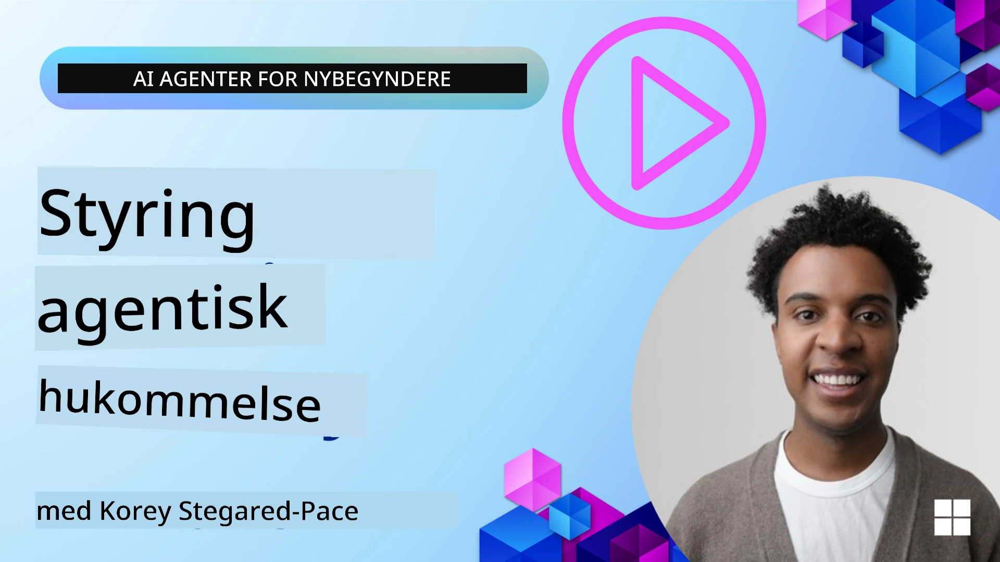

# Hukommelse for AI-agenter 

When discussing the unique benefits of creating AI Agents, two things are mainly discussed: the ability to call tools to complete tasks and the ability to improve over time. Memory is at the foundation of creating self-improving agent that can create better experiences for our users.

In this lesson, we will look at what memory is for AI Agents and how we can manage it and use it for the benefit of our applications.

## Introduktion

Denne lektion dækker:

• **Forståelse af AI-agenters hukommelse**: Hvad hukommelse er, og hvorfor det er essentielt for agenter.

• **Implementering og lagring af hukommelse**: Praktiske metoder til at tilføje hukommelsesfunktioner til dine AI-agenter med fokus på korttids- og langtidshukommelse.

• **Gøre AI-agenter selvforbedrende**: Hvordan hukommelse gør det muligt for agenter at lære af tidligere interaktioner og forbedre sig over tid.

## Tilgængelige implementeringer

Denne lektion inkluderer to omfattende notebook-vejledninger:

• **[13-agent-memory.ipynb](./13-agent-memory.ipynb)**: Implementerer hukommelse ved hjælp af Mem0 og Azure AI Search med Microsoft Agent Framework

• **[13-agent-memory-cognee.ipynb](./13-agent-memory-cognee.ipynb)**: Implementerer struktureret hukommelse ved hjælp af Cognee, opbygger automatisk en vidensgraf bakket op af embeddings, visualiserer grafen og udfører intelligent hentning

## Læringsmål

Efter at have gennemført denne lektion vil du vide, hvordan du:

• **Skelner mellem forskellige typer AI-agenthukommelse**, inklusive arbejdshukommelse, korttidshukommelse og langtidshukommelse, samt specialiserede former som persona- og episodisk hukommelse.

• **Implementerer og administrerer korttids- og langtidshukommelse for AI-agenter** ved hjælp af Microsoft Agent Framework, med værktøjer som Mem0, Cognee, Whiteboard memory og integration med Azure AI Search.

• **Forstår principperne bag selvforbedrende AI-agenter** og hvordan robuste systemer til hukommelsesstyring bidrager til kontinuerlig læring og tilpasning.

## Forståelse af AI-agenters hukommelse

I sin kerne refererer **hukommelse for AI-agenter til de mekanismer, der gør det muligt for dem at bevare og genkalde information**. Denne information kan være specifikke detaljer om en samtale, brugerpræferencer, tidligere handlinger eller endda indlærte mønstre.

Uden hukommelse er AI-applikationer ofte tilstandsløse, hvilket betyder, at hver interaktion starter forfra. Det fører til en gentagende og frustrerende brugeroplevelse, hvor agenten "glemmer" tidligere kontekst eller præferencer.

### Hvorfor er hukommelse vigtig?

En agents intelligens er dybt forbundet med dens evne til at genkalde og anvende tidligere information. Hukommelse gør agenter i stand til at være:

• **Reflekterende**: Lærer af tidligere handlinger og resultater.

• **Interaktive**: Opretholder kontekst i en igangværende samtale.

• **Proaktive og reaktive**: Forudser behov eller reagerer passende baseret på historiske data.

• **Autonome**: Handler mere uafhængigt ved at trække på lagret viden.

Målet med at implementere hukommelse er at gøre agenter mere **pålidelige og kompetente**.

### Typer af hukommelse

#### Arbejdshukommelse

Tænk på dette som et stykke kladdepapir, en agent bruger under en enkelt, igangværende opgave eller tankegang. Den indeholder øjeblikkelig information, der er nødvendig for at beregne næste skridt.

For AI-agenter indfanger arbejdshukommelsen ofte den mest relevante information fra en samtale, selv hvis hele chatloggen er lang eller trunkeret. Den fokuserer på at udtrække nøgleelementer som krav, forslag, beslutninger og handlinger.

**Eksempel på arbejdshukommelse**

I en rejsebookingsagent kan arbejdshukommelsen fange brugerens aktuelle forespørgsel, såsom "Jeg vil gerne booke en tur til Paris". Dette specifikke krav holdes i agentens umiddelbare kontekst for at styre den aktuelle interaktion.

#### Korttidshukommelse

Denne type hukommelse bevarer information i løbet af en enkelt samtale eller session. Det er konteksten i den nuværende chat, der gør det muligt for agenten at referere tilbage til tidligere omdrejninger i dialogen.

**Eksempel på korttidshukommelse**

Hvis en bruger spørger, "Hvor meget ville en flyrejse til Paris koste?" og derefter følger op med "Hvad med indkvartering der?", sikrer korttidshukommelsen, at agenten ved, at "der" refererer til "Paris" inden for den samme samtale.

#### Langtidshukommelse

Dette er information, som bevares på tværs af flere samtaler eller sessioner. Det gør det muligt for agenter at huske brugerpræferencer, historiske interaktioner eller generel viden over længere perioder. Dette er vigtigt for personalisering.

**Eksempel på langtidshukommelse**

En langtidshukommelse kunne gemme, at "Ben nyder skiløb og udendørsaktiviteter, kan lide kaffe med bjergudsigt og ønsker at undgå avancerede pister på grund af en tidligere skade". Denne information, indlært fra tidligere interaktioner, påvirker anbefalinger i fremtidige rejseplanlægningssessioner og gør dem meget personlige.

#### Persona-hukommelse

Denne specialiserede hukommelsestype hjælper en agent med at udvikle en konsekvent "personlighed" eller "persona". Den gør det muligt for agenten at huske detaljer om sig selv eller sin tiltænkte rolle, hvilket gør interaktioner mere flydende og fokuserede.

**Eksempel på persona-hukommelse**
Hvis rejseagenten er designet til at være en "ekspert i ski-planlægning", kan persona-hukommelsen forstærke denne rolle og påvirke dens svar, så de stemmer overens med en eksperts tone og viden.

#### Workflow/Episodisk hukommelse

Denne hukommelse gemmer rækkefølgen af trin, en agent tager under en kompleks opgave, inklusive succeser og fejl. Det er som at huske specifikke "episoder" eller tidligere erfaringer for at lære af dem.

**Eksempel på episodisk hukommelse**

Hvis agenten forsøgte at booke en specifik flyvning, men det mislykkedes på grund af manglende tilgængelighed, kunne episodisk hukommelse registrere denne fejl, så agenten kan prøve alternative flyvninger eller informere brugeren om problemet på en mere informeret måde ved et efterfølgende forsøg.

#### Entitets-hukommelse

Dette involverer at udtrække og huske specifikke entiteter (som personer, steder eller ting) og begivenheder fra samtaler. Det gør det muligt for agenten at opbygge en struktureret forståelse af nøgleelementer, der er blevet diskuteret.

**Eksempel på entitets-hukommelse**

Fra en samtale om en tidligere rejse kunne agenten udtrække "Paris", "Eiffeltårnet" og "middag på restauranten Le Chat Noir" som entiteter. Ved en fremtidig interaktion kunne agenten huske "Le Chat Noir" og tilbyde at lave en ny reservation der.

#### Struktureret RAG (Retrieval Augmented Generation)

Mens RAG er en bredere teknik, fremhæves "Struktureret RAG" som en kraftfuld hukommelsesteknologi. Den udtrækker tæt, struktureret information fra forskellige kilder (samtaler, e-mails, billeder) og bruger den til at forbedre præcision, recall og hastighed i svar. I modsætning til klassisk RAG, der udelukkende er baseret på semantisk lighed, arbejder Struktureret RAG med informationens iboende struktur.

**Eksempel på Struktureret RAG**

I stedet for kun at matche nøgleord kan Struktureret RAG parse flydetails (destination, dato, tid, flyselskab) fra en e-mail og gemme dem på en struktureret måde. Dette muliggør præcise forespørgsler som "Hvilket fly bookede jeg til Paris på tirsdag?"

## Implementering og lagring af hukommelse

Implementering af hukommelse for AI-agenter involverer en systematisk proces for **hukommelsesstyring**, som inkluderer generering, lagring, hentning, integration, opdatering og endda "glemsel" (eller sletning) af information. Hentning er et særligt afgørende aspekt.

### Specialiserede hukommelsesværktøjer

#### Mem0

En måde at lagre og administrere agenthukommelse på er ved at bruge specialiserede værktøjer som Mem0. Mem0 fungerer som et persistent hukommelseslag, der giver agenter mulighed for at genkalde relevante interaktioner, gemme brugerpræferencer og faktuel kontekst og lære af succeser og fejl over tid. Ideen er, at tilstandsløse agenter bliver til standfulde.

Det fungerer gennem en **to-faset hukommelses-pipeline: ekstraktion og opdatering**. Først sendes beskeder, der er tilføjet en agents tråd, til Mem0-tjenesten, som bruger en Large Language Model (LLM) til at opsummere samtalehistorik og udtrække nye minder. Efterfølgende bestemmer en LLM-drevet opdateringsfase, om disse minder skal tilføjes, ændres eller slettes, og gemmer dem i en hybrid datalager, der kan inkludere vektor-, graf- og nøgle-værdi-databaser. Dette system understøtter også forskellige hukommelsestyper og kan inkorporere grafhukommelse til at styre relationer mellem entiteter.

#### Cognee

En anden kraftfuld tilgang er at bruge **Cognee**, en open-source semantisk hukommelse for AI-agenter, der transformerer strukturerede og ustrukturerede data til forespørgelige vidensgrafer bakket op af embeddings. Cognee tilbyder en **dual-store-arkitektur**, der kombinerer vektorlignende søgning med grafrelationer, så agenter kan forstå ikke kun, hvilken information der er lignende, men hvordan koncepter relaterer til hinanden.

Den excellerer i **hybrid hentning**, der blander vektorlighed, grafstruktur og LLM-ressonering - fra rå chunk-opslag til graf-aware spørgsmål-svar. Systemet opretholder en **levende hukommelse**, der udvikler sig og vokser, samtidig med at den forbliver forespørgelig som én forbundet graf og understøtter både korttids-sessionkontekst og langtidspersistent hukommelse.

Cognee-notebook-vejledningen (**[13-agent-memory-cognee.ipynb](./13-agent-memory-cognee.ipynb)**) demonstrerer opbygningen af dette forenede hukommelseslag med praktiske eksempler på indtagelse af forskellige datakilder, visualisering af vidensgrafen og forespørgsler med forskellige søgestrategier skræddersyet til specifikke agentbehov.

### Lagring af hukommelse med RAG

Ud over specialiserede hukommelsesværktøjer som mem0 kan du udnytte robuste søgetjenester som **Azure AI Search som en backend til lagring og hentning af minder**, især til struktureret RAG.

Dette gør det muligt at forankre din agents svar i dine egne data og sikre mere relevante og præcise svar. Azure AI Search kan bruges til at gemme bruger-specifikke rejseminder, produktkataloger eller enhver anden domænespecifik viden.

Azure AI Search understøtter kapaciteter som **Struktureret RAG**, der excellerer i at udtrække og hente tæt, struktureret information fra store datasæt som samtalehistorik, e-mails eller endda billeder. Dette giver "overmenneskelig præcision og recall" sammenlignet med traditionelle tekstchunking- og embedding-tilgange.

## Gøre AI-agenter selvforbedrende

Et almindeligt mønster for selvforbedrende agenter involverer at introducere en **"vidensagent"**. Denne separate agent observerer hovedsamtalen mellem brugeren og den primære agent. Dens rolle er at:

1. **Identificere værdifuld information**: Bestemme om en del af samtalen er værd at gemme som generel viden eller en specifik brugerpræference.

2. **Udtrække og opsummere**: Destillere det væsentlige læringspunkt eller præferencen fra samtalen.

3. **Gem i en vidensbase**: Persistere denne udtrukne information, ofte i en vektordatabase, så den kan hentes senere.

4. **Augmentere fremtidige forespørgsler**: Når brugeren initierer en ny forespørgsel, henter vidensagenten relevant lagret information og føjer den til brugerens prompt, hvilket giver afgørende kontekst til den primære agent (svarende til RAG).

### Optimeringer for hukommelse

• **Håndtering af latenstid**: For at undgå at sænke brugerinteraktioner kan en billigere, hurtigere model bruges indledningsvis til hurtigt at tjekke, om information er værd at gemme eller hente, og kun påkalde den mere komplekse ekstraktions-/hentningsproces når det er nødvendigt.

• **Vedligeholdelse af vidensbasen**: For en voksende vidensbase kan mindre hyppigt brugt information flyttes til "kold lager" for at styre omkostninger.

## Har du flere spørgsmål om agenthukommelse?

Deltag i [Microsoft Foundry Discord](https://aka.ms/ai-agents/discord) for at mødes med andre studerende, deltage i kontortid og få svar på dine spørgsmål om AI-agenter.

---

<!-- CO-OP TRANSLATOR DISCLAIMER START -->
Ansvarsfraskrivelse:
Dette dokument er blevet oversat ved hjælp af AI-oversættelsestjenesten Co-op Translator (https://github.com/Azure/co-op-translator). Selvom vi bestræber os på nøjagtighed, bør du være opmærksom på, at automatiske oversættelser kan indeholde fejl eller unøjagtigheder. Det oprindelige dokument på originalsproget bør betragtes som den autoritative kilde. For kritisk information anbefales professionel menneskelig oversættelse. Vi er ikke ansvarlige for eventuelle misforståelser eller fejltolkninger, som opstår som følge af brugen af denne oversættelse.
<!-- CO-OP TRANSLATOR DISCLAIMER END -->