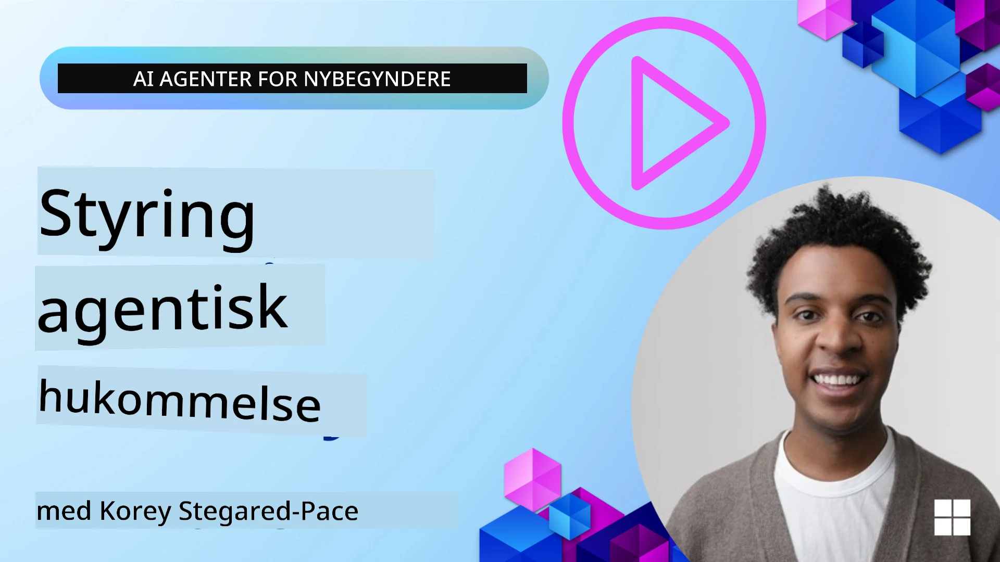

# Hukommelse for AI-agenter  

Når man diskuterer de unikke fordele ved at skabe AI-agenter, er der hovedsageligt to ting, man taler om: evnen til at kalde værktøjer for at udføre opgaver og evnen til at forbedre sig over tid. Hukommelse er grundlaget for at skabe en selvforbedrende agent, der kan skabe bedre oplevelser for vores brugere.

I denne lektion vil vi se på, hvad hukommelse er for AI-agenter, og hvordan vi kan styre og bruge den til fordel for vores applikationer.

## Introduktion

Denne lektion vil dække:

• **Forståelse af AI-Agent Hukommelse**: Hvad hukommelse er, og hvorfor det er essentielt for agenter.

• **Implementering og Opbevaring af Hukommelse**: Praktiske metoder til at tilføje hukommelsesfunktioner til dine AI-agenter, med fokus på kort- og langtidshukommelse.

• **Gøre AI-agenter Selvforbedrende**: Hvordan hukommelse gør det muligt for agenter at lære fra tidligere interaktioner og forbedre sig over tid.

## Tilgængelige Implementeringer

Denne lektion indeholder to omfattende notebook-tutorials:

• **[13-agent-memory.ipynb](./13-agent-memory.ipynb)**: Implementerer hukommelse ved hjælp af Mem0 og Azure AI Search med Microsoft Agent Framework

• **[13-agent-memory-cognee.ipynb](./13-agent-memory-cognee.ipynb)**: Implementerer struktureret hukommelse med Cognee, der automatisk bygger et vidensgraf understøttet af embeddings, visualiserer grafen og intelligent hentning

## Læringsmål

Efter at have gennemført denne lektion vil du vide, hvordan du:

• **Skelner mellem forskellige typer AI-agent hukommelse**, herunder arbejdshukommelse, korttidshukommelse og langtidshukommelse, samt specialiserede former som persona- og episodisk hukommelse.

• **Implementerer og styrer kort- og langtidshukommelse for AI-agenter** ved hjælp af Microsoft Agent Framework, og udnytter værktøjer som Mem0, Cognee, Whiteboard-hukommelse og integration med Azure AI Search.

• **Forstår principperne bag selvforbedrende AI-agenter** og hvordan robuste hukommelsesstyringssystemer bidrager til kontinuerlig læring og tilpasning.

## Forståelse af AI Agent Hukommelse

I sin kerne refererer **hukommelse for AI-agenter til mekanismerne, der tillader dem at fastholde og erindre information**. Denne information kan være specifikke detaljer om en samtale, brugerpræferencer, tidligere handlinger eller endda lærte mønstre.

Uden hukommelse er AI-applikationer ofte tilstandsløse, hvilket betyder, at hver interaktion starter forfra. Det fører til en gentagende og frustrerende brugeroplevelse, hvor agenten "glemmer" tidligere kontekst eller præferencer.

### Hvorfor er Hukommelse Vigtigt?

En agents intelligens er dybt knyttet til dens evne til at genkalde og anvende tidligere information. Hukommelse tillader agenter at være:

• **Reflekterende**: Lære fra tidligere handlinger og resultater.

• **Interaktive**: Opretholde kontekst gennem en igangværende samtale.

• **Proaktive og Reaktive**: Forudse behov eller reagere passende baseret på historiske data.

• **Selvstændige**: Operere mere uafhængigt ved at trække på lagret viden.

Målet med at implementere hukommelse er at gøre agenter mere **pålidelige og kapable**.

### Typer af Hukommelse

#### Arbejdshukommelse

Tænk på dette som et stykke kladdepapir, som en agent bruger under en enkelt, igangværende opgave eller tankegang. Den rummer øjeblikkelig information, der er nødvendig for at beregne næste skridt.

For AI-agenter indfanger arbejdshukommelsen ofte den mest relevante information fra en samtale, selv hvis hele chat-historikken er lang eller forkortet. Den fokuserer på at udtrække nøgleelementer som krav, forslag, beslutninger og handlinger.

**Eksempel på Arbejdshukommelse**

I en rejsebestillingsagent kan arbejdshukommelsen fange brugerens aktuelle anmodning, såsom "Jeg vil bestille en tur til Paris". Dette specifikke krav fastholdes i agentens umiddelbare kontekst til at styre den nuværende interaktion.

#### Korttidshukommelse

Denne type hukommelse bevarer information i løbet af en enkelt samtale eller session. Det er konteksten for den aktuelle chat, der tillader agenten at referere tilbage til tidligere turer i dialogen.

I [Microsoft Agent Framework](https://github.com/microsoft/agent-framework) Python SDK-eksempler svarer dette til `AgentSession`, oprettet med `agent.create_session()`. Sessionen er rammeværkets indbyggede korttidshukommelse: den holder samtalekonteksten tilgængelig, mens den samme session genbruges, men konteksten gemmes ikke, når sessionen afsluttes eller applikationen genstartes. Brug langtidshukommelse til fakta og præferencer, der skal overleve på tværs af sessioner, typisk gennem en database, vektorindeks eller en anden vedvarende lagring.

**Eksempel på Korttidshukommelse**

Hvis en bruger spørger, "Hvor meget koster en flyrejse til Paris?" og derefter følger op med "Hvad med indkvartering der?", sikrer korttidshukommelse, at agenten ved, at "der" henviser til "Paris" i samme samtale.

#### Langtidshukommelse

Dette er information, der bevares på tværs af flere samtaler eller sessioner. Det gør det muligt for agenter at huske brugerpræferencer, historiske interaktioner eller generel viden over længere perioder. Det er vigtigt for personalisering.

**Eksempel på Langtidshukommelse**

En langtidshukommelse kunne lagre, at "Ben nyder skiløb og udendørsaktiviteter, kan lide kaffe med udsigt til bjergene, og ønsker at undgå avancerede skiløjper på grund af en tidligere skade". Denne information, lært fra tidligere interaktioner, påvirker anbefalinger i fremtidige rejseplanlægningssessioner og gør dem meget personlige.

#### Persona-hukommelse

Denne specialiserede hukommelsestype hjælper en agent med at udvikle en konsekvent "personlighed" eller "persona". Det tillader agenten at huske detaljer om sig selv eller sin tiltænkte rolle, hvilket gør interaktionerne mere flydende og fokuserede.

**Eksempel på Persona-hukommelse**  
Hvis rejseagenten er designet til at være en "ekspert i skiløb", kunne persona-hukommelsen forstærke denne rolle, hvilket påvirker dens svar til at stemme overens med en eksperts tone og viden.

#### Workflow/Episodisk Hukommelse

Denne hukommelse gemmer rækkefølgen af trin, en agent tager under en kompleks opgave, inklusive succeser og fiaskoer. Det svarer til at huske specifikke "episoder" eller tidligere erfaringer for at lære af dem.

**Eksempel på Episodisk Hukommelse**

Hvis agenten forsøgte at bestille en specifik flyrejse, men det fejlede på grund af manglende tilgængelighed, kunne episodisk hukommelse registrere denne fejl, hvilket gør det muligt for agenten at prøve alternative fly eller informere brugeren om problemet på en mere informeret måde ved et senere forsøg.

#### Enhedshukommelse

Dette involverer at udtrække og huske specifikke enheder (som personer, steder eller ting) og hændelser fra samtaler. Det gør det muligt for agenten at opbygge en struktureret forståelse af nøgleelementer, der er diskuteret.

**Eksempel på Enhedshukommelse**

Fra en samtale om en tidligere rejse kunne agenten udtrække "Paris," "Eiffeltårnet" og "middag på Le Chat Noir-restaurant" som enheder. I en fremtidig interaktion kunne agenten huske "Le Chat Noir" og tilbyde at lave en ny reservation der.

#### Struktureret RAG (Retrieval Augmented Generation)

Mens RAG er en bredere teknik, fremhæves "Struktureret RAG" som en kraftfuld hukommelsesteknologi. Den udtrækker tæt, struktureret information fra forskellige kilder (samtaler, e-mails, billeder) og bruger den til at forbedre præcision, genkaldelse og hastighed i svar. I modsætning til klassisk RAG, der alene bygger på semantisk lighed, arbejder Struktureret RAG med den iboende struktur i informationen.

**Eksempel på Struktureret RAG**

I stedet for blot at matche nøgleord kunne Struktureret RAG f.eks. tolke flyoplysninger (destination, dato, tidspunkt, flyselskab) fra en e-mail og gemme dem struktureret. Dette tillader præcise forespørgsler som "Hvilket fly bestilte jeg til Paris på tirsdag?"

## Implementering og Opbevaring af Hukommelse

Implementering af hukommelse for AI-agenter involverer en systematisk proces med **hukommelsesstyring**, der inkluderer generering, opbevaring, hentning, integration, opdatering og endda "glemmelse" (eller sletning) af information. Hentning er et særligt kritisk aspekt.

### Specialiserede Hukommelsesværktøjer

#### Mem0

En måde at gemme og styre agenthukommelse på er ved brug af specialiserede værktøjer som Mem0. Mem0 fungerer som et persistent hukommelseslag, der tillader agenter at genkalde relevante interaktioner, gemme brugerpræferencer og faktuel kontekst samt lære af succeser og fiaskoer over tid. Ideen her er, at tilstandsløse agenter bliver til tilstandsbevidste.

Det fungerer gennem en **to-faset hukommelsespipeline: udtrækning og opdatering**. Først sendes beskeder tilføjet til en agents tråd til Mem0-tjenesten, som bruger en stor sprogmodel (LLM) til at opsummere samtalehistorik og udtrække nye minder. Efterfølgende bestemmer en LLM-drevet opdateringsfase, om disse minder skal tilføjes, ændres eller slettes, og lagrer dem i en hybrid datalager, der kan indeholde vektor-, graf- og nøgle-værdidatabaser. Systemet understøtter også forskellige hukommelsestyper og kan inkorporere grafhukommelse til styring af relationer mellem enheder.

#### Cognee

En anden kraftfuld tilgang er at bruge **Cognee**, en open-source semantisk hukommelse for AI-agenter, der transformerer strukturerede og ustrukturerede data til søgbare vidensgrafer understøttet af embeddings. Cognee tilbyder en **to-lagers arkitektur**, som kombinerer vektorligningsøgning med grafrelationer, hvilket gør det muligt for agenter at forstå ikke blot hvilken information der er lignende, men også hvordan begreber relaterer til hinanden.

Den excellerer i **hybrid hentning**, der blander vektorligning, grafstruktur og LLM-resonnement – fra rå dataopslag til graf-bevidst spørgsmål-svar. Systemet opretholder en **levende hukommelse**, der udvikler sig og vokser, mens den forbliver søgbar som en sammenkoblet graf, hvilket understøtter både korttidssessionkontekst og langtidsholdbar hukommelse.

Cognee notebook-tutorialen ([13-agent-memory-cognee.ipynb](./13-agent-memory-cognee.ipynb)) demonstrerer opbygningen af dette samlede hukommelseslag med praktiske eksempler på indtagelse af forskellige datakilder, visualisering af vidensgrafen og forespørgsler med forskellige søgestrategier, tilpasset specifikke agentbehov.

### Opbevaring af Hukommelse med RAG

Udover specialiserede hukommelsesværktøjer som Mem0 kan du bruge robuste søgetjenester som **Azure AI Search som backend til opbevaring og hentning af minder**, især til struktureret RAG.

Dette gør det muligt at basere agentens svar på dine egne data, hvilket sikrer mere relevante og præcise svar. Azure AI Search kan bruges til at gemme bruger-specifik rejsehukommelse, produktkataloger eller anden domænespecifik viden.

Azure AI Search understøtter funktionaliteter som **Struktureret RAG**, der excellerer i at udtrække og hente tæt, struktureret information fra store datasæt som samtalehistorik, e-mails eller endda billeder. Det leverer "supermenneskelig præcision og genkaldelse" sammenlignet med traditionelle metoder med tekststykker og embeddings.

## Gør AI-agenter Selvforbedrende

Et almindeligt mønster for selvforbedrende agenter involverer at introducere en **"vidensagent"**. Denne separate agent observerer den primære samtale mellem brugeren og hovedagenten. Dens rolle er at:

1. **Identificere værdifuld information**: Vurdere om nogen del af samtalen er værd at gemme som generel viden eller specifik brugerpræference.

2. **Udtrække og opsummere**: Destillere den væsentlige læring eller præference fra samtalen.

3. **Gem i en vidensbase**: Persistere denne udtrukne information, ofte i en vektordatabaser, så den kan hentes senere.

4. **Forstærke fremtidige forespørgsler**: Når brugeren starter en ny forespørgsel, henter vidensagenten relevant lagret information og tilføjer den til brugerens prompt, hvilket giver afgørende kontekst til hovedagenten (svarende til RAG).

### Optimeringer for Hukommelse

• **Latency-styring**: For at undgå at nedsætte brugerinteraktioner kan en billigere, hurtigere model bruges i første omgang til hurtigt at tjekke, om information er værd at gemme eller hente, kun med rekursivt at anvende en mere kompleks udtræknings-/hentningsproces, når nødvendigt.

• **Vedligeholdelse af vidensbase**: For en voksende vidensbase kan mindre brugt information flyttes til "kold lagring" for at styre omkostninger.

## Har du flere spørgsmål om Agenthukommelse?

Deltag i [Microsoft Foundry Discord](https://discord.com/invite/ATgtXmAS5D) for at møde andre lærende, deltage i kontortimer og få svar på dine spørgsmål om AI-agenter.

---

<!-- CO-OP TRANSLATOR DISCLAIMER START -->
**Ansvarsfraskrivelse**:
Dette dokument er blevet oversat ved hjælp af AI-oversættelsestjenesten [Co-op Translator](https://github.com/Azure/co-op-translator). Selvom vi bestræber os på nøjagtighed, skal du være opmærksom på, at automatiserede oversættelser kan indeholde fejl eller unøjagtigheder. Det originale dokument på dets oprindelige sprog bør betragtes som den autoritative kilde. For kritisk information anbefales professionel menneskelig oversættelse. Vi påtager os intet ansvar for misforståelser eller fejltolkninger, der opstår som følge af brugen af denne oversættelse.
<!-- CO-OP TRANSLATOR DISCLAIMER END -->