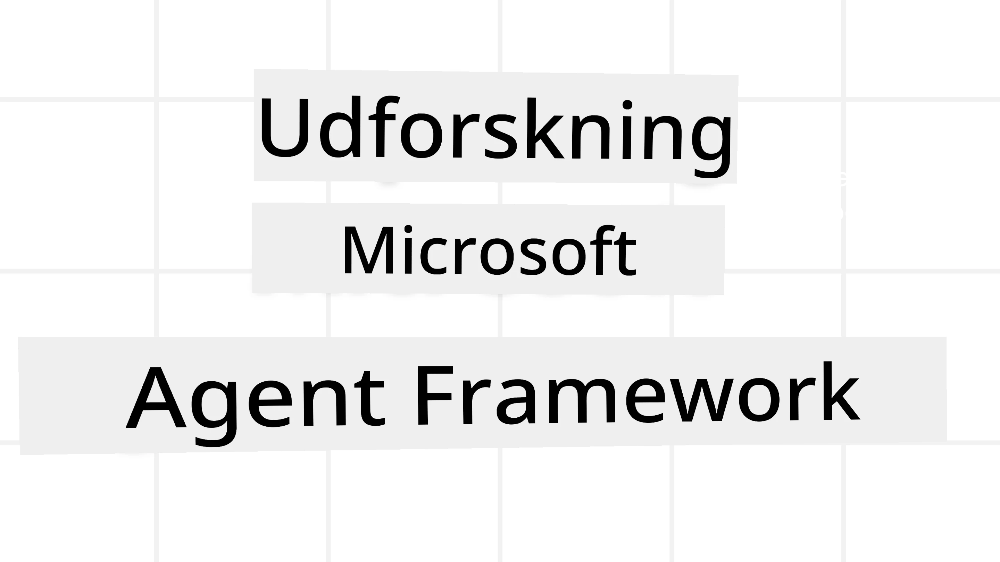
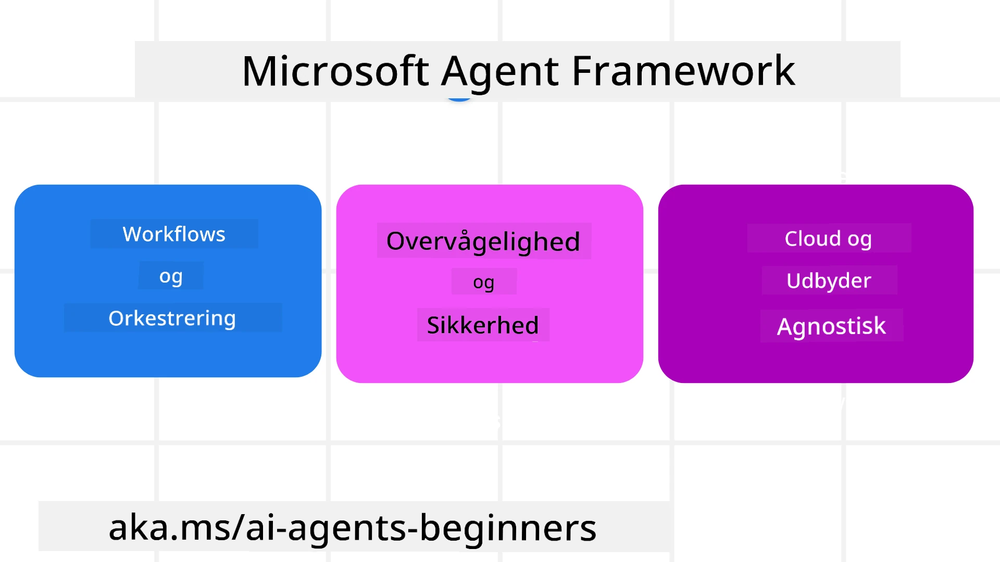
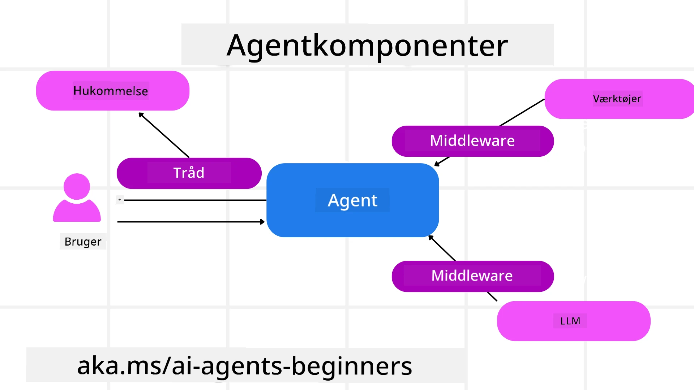

# Udforskning af Microsoft Agent Framework



### Introduktion

Denne lektion vil dække:

- Forståelse af Microsoft Agent Framework: Nøglefunktioner og værdi  
- Udforskning af nøglebegreberne i Microsoft Agent Framework
- Avancerede MAF-mønstre: Workflows, middleware og hukommelse

## Læringsmål

Efter at have gennemført denne lektion, vil du vide, hvordan du:

- Bygger produktionsklare AI-agenter ved hjælp af Microsoft Agent Framework
- Anvender de centrale funktioner i Microsoft Agent Framework til dine agentrelaterede brugssager
- Bruger avancerede mønstre, herunder workflows, middleware og observabilitet

## Kodeeksempler 

Kodeeksempler for [Microsoft Agent Framework (MAF)](https://aka.ms/ai-agents-beginners/agent-framewrok) kan findes i dette repository under `xx-python-agent-framework` og `xx-dotnet-agent-framework` filer.

## Forståelse af Microsoft Agent Framework



[Microsoft Agent Framework (MAF)](https://aka.ms/ai-agents-beginners/agent-framewrok) er Microsofts samlede rammeværk til at bygge AI-agenter. Det tilbyder fleksibiliteten til at håndtere den brede vifte af agentrelaterede brugssager, som både ses i produktions- og forskningsmiljøer, herunder:

- **Sekventiel agent-orkestrering** i scenarier, hvor trin-for-trin workflows er nødvendige.
- **Samtidig orkestrering** i scenarier, hvor agenter skal udføre opgaver på samme tid.
- **Gruppechat-orkestrering** i scenarier, hvor agenter kan samarbejde om én opgave.
- **Overdragelsesorkestrering** i scenarier, hvor agenter giver opgaver videre til hinanden, efterhånden som delopgaverne færdiggøres.
- **Magnetisk orkestrering** i scenarier, hvor en lederagent opretter og ændrer en opgaveliste og håndterer koordineringen af underagenter til at fuldføre opgaven.

For at levere AI-agenter i produktion har MAF også inkluderet funktioner til:

- **Observabilitet** gennem brug af OpenTelemetry, hvor hver handling fra AI-agenten inklusive værktøjskald, orkestreringsskridt, ræsonnementflow og ydeevneovervågning via Microsoft Foundry dashboards.
- **Sikkerhed** ved at hoste agenter native på Microsoft Foundry, som inkluderer sikkerhedskontroller som rollebaseret adgang, håndtering af private data og indbygget indholdssikkerhed.
- **Holdbarhed** da agent-tråde og workflows kan pause, genoptage og gendanne fra fejl, hvilket muliggør længerevarende processer.
- **Kontrol** da menneskelig indgriben i workflows understøttes, hvor opgaver markeres som krævende menneskelig godkendelse.

Microsoft Agent Framework fokuserer også på interoperabilitet ved at:

- **Være cloud-agnostisk** - Agenter kan køre i containere, on-premises og på tværs af flere forskellige clouds.
- **Være leverandøruafhængig** - Agenter kan oprettes gennem dit foretrukne SDK, herunder Azure OpenAI og OpenAI.
- **Integrere åbne standarder** - Agenter kan anvende protokoller som Agent-to-Agent (A2A) og Model Context Protocol (MCP) til at opdage og bruge andre agenter og værktøjer.
- **Plugins og forbindelser** - Forbindelser kan laves til data- og hukommelsestjenester såsom Microsoft Fabric, SharePoint, Pinecone og Qdrant.

Lad os se på, hvordan disse funktioner anvendes på nogle af de centrale begreber i Microsoft Agent Framework.

## Nøglebegreber i Microsoft Agent Framework

### Agenter



**Oprettelse af Agenter**

Agent-oprettelse sker ved at definere inferenstjenesten (LLM-udbyder), et sæt instruktioner for AI-agenten at følge, og en tildelt `name`:

```python
agent = AzureOpenAIChatClient(credential=AzureCliCredential()).create_agent( instructions="You are good at recommending trips to customers based on their preferences.", name="TripRecommender" )
```

Ovenstående bruger `Azure OpenAI`, men agenter kan oprettes ved hjælp af en række tjenester inklusive `Microsoft Foundry Agent Service`:

```python
AzureAIAgentClient(async_credential=credential).create_agent( name="HelperAgent", instructions="You are a helpful assistant." ) as agent
```

OpenAI `Responses`, `ChatCompletion` API'er

```python
agent = OpenAIResponsesClient().create_agent( name="WeatherBot", instructions="You are a helpful weather assistant.", )
```

```python
agent = OpenAIChatClient().create_agent( name="HelpfulAssistant", instructions="You are a helpful assistant.", )
```

eller fjernagenter ved hjælp af A2A-protokollen:

```python
agent = A2AAgent( name=agent_card.name, description=agent_card.description, agent_card=agent_card, url="https://your-a2a-agent-host" )
```

**Kørsel af Agenter**

Agenter køres ved at bruge `.run` eller `.run_stream` metoderne for henholdsvis ikke-streaming eller streaming svar.

```python
result = await agent.run("What are good places to visit in Amsterdam?")
print(result.text)
```

```python
async for update in agent.run_stream("What are the good places to visit in Amsterdam?"):
    if update.text:
        print(update.text, end="", flush=True)

```

Hver agentkørsel kan også have valgmuligheder for at tilpasse parametre som `max_tokens` brugt af agenten, `tools` som agenten kan kalde, og endda selve den `model`, der bruges til agenten.

Dette er nyttigt i tilfælde, hvor specifikke modeller eller værktøjer kræves for at fuldføre en brugers opgave.

**Værktøjer**

Værktøjer kan defineres både ved oprettelse af agenten:

```python
def get_attractions( location: Annotated[str, Field(description="The location to get the top tourist attractions for")], ) -> str: """Get the top tourist attractions for a given location.""" return f"The top attractions for {location} are." 


# Når du opretter en ChatAgent direkte

agent = ChatAgent( chat_client=OpenAIChatClient(), instructions="You are a helpful assistant", tools=[get_attractions]

```

og også ved kørsel af agenten:

```python

result1 = await agent.run( "What's the best place to visit in Seattle?", tools=[get_attractions] # Værktøj leveret kun til denne kørsel )
```

**Agent-Tråde**

Agent-tråde bruges til at håndtere samtaler med flere omgange. Tråde kan oprettes enten ved:

- At bruge `get_new_thread()`, hvilket gør det muligt at gemme tråden over tid
- At oprette en tråd automatisk når en agent køres, og kun lade tråden vare under den nuværende kørsel.

For at oprette en tråd, ser koden således ud:

```python
# Opret en ny tråd.
thread = agent.get_new_thread() # Kør agenten med tråden.
response = await agent.run("Hello, I am here to help you book travel. Where would you like to go?", thread=thread)

```

Du kan derefter serialisere tråden for at gemme den til senere brug:

```python
# Opret en ny tråd.
thread = agent.get_new_thread() 

# Kør agenten med tråden.

response = await agent.run("Hello, how are you?", thread=thread) 

# Serialiser tråden til lagring.

serialized_thread = await thread.serialize() 

# Deserialiser trådens tilstand efter indlæsning fra lagring.

resumed_thread = await agent.deserialize_thread(serialized_thread)
```

**Agent Middleware**

Agenter interagerer med værktøjer og LLM'er for at fuldføre brugeropgaver. I visse scenarier ønsker vi at køre eller spore noget imellem disse interaktioner. Agent middleware gør det muligt gennem:

*Funktion Middleware*

Denne middleware giver os mulighed for at udføre en handling mellem agenten og en funktion/værktøj, som den vil kalde. Et eksempel på brug er, når du ønsker at logge funktionen.

I koden nedenfor definerer `next`, om næste middleware eller den faktiske funktion skal kaldes.

```python
async def logging_function_middleware(
    context: FunctionInvocationContext,
    next: Callable[[FunctionInvocationContext], Awaitable[None]],
) -> None:
    """Function middleware that logs function execution."""
    # Forbehandling: Log før funktionsudførelse
    print(f"[Function] Calling {context.function.name}")

    # Fortsæt til næste middleware eller funktionsudførelse
    await next(context)

    # Efterbehandling: Log efter funktionsudførelse
    print(f"[Function] {context.function.name} completed")
```

*Chat Middleware*

Denne middleware giver os mulighed for at udføre eller logge en handling mellem agenten og forespørgslerne til LLM’en.

Dette indeholder vigtig information såsom de `messages`, der sendes til AI-tjenesten.

```python
async def logging_chat_middleware(
    context: ChatContext,
    next: Callable[[ChatContext], Awaitable[None]],
) -> None:
    """Chat middleware that logs AI interactions."""
    # Forbehandling: Log før AI-kald
    print(f"[Chat] Sending {len(context.messages)} messages to AI")

    # Fortsæt til næste middleware eller AI-tjeneste
    await next(context)

    # Efterbehandling: Log efter AI-svar
    print("[Chat] AI response received")

```

**Agent Hukommelse**

Som dækket i lektionen `Agentic Memory`, er hukommelse et vigtigt element for at gøre det muligt for agenten at operere over forskellige kontekster. MAF tilbyder flere forskellige typer hukommelse:

*In-Memory Storage*

Dette er hukommelsen, der gemmes i tråde under applikationskørsel.

```python
# Opret en ny tråd.
thread = agent.get_new_thread() # Kør agenten med tråden.
response = await agent.run("Hello, I am here to help you book travel. Where would you like to go?", thread=thread)
```

*Persistente Beskeder*

Denne hukommelse bruges til at gemme samtalehistorik på tværs af forskellige sessioner. Den defineres ved hjælp af `chat_message_store_factory`:

```python
from agent_framework import ChatMessageStore

# Opret en brugerdefineret beskedlager
def create_message_store():
    return ChatMessageStore()

agent = ChatAgent(
    chat_client=OpenAIChatClient(),
    instructions="You are a Travel assistant.",
    chat_message_store_factory=create_message_store
)

```

*Dynamisk Hukommelse*

Denne hukommelse tilføjes konteksten før agenter køres. Disse hukommelser kan gemmes i eksterne tjenester såsom mem0:

```python
from agent_framework.mem0 import Mem0Provider

# Bruger Mem0 til avancerede hukommelsesfunktioner
memory_provider = Mem0Provider(
    api_key="your-mem0-api-key",
    user_id="user_123",
    application_id="my_app"
)

agent = ChatAgent(
    chat_client=OpenAIChatClient(),
    instructions="You are a helpful assistant with memory.",
    context_providers=memory_provider
)

```

**Agent Observabilitet**

Observabilitet er vigtig for at bygge pålidelige og vedligeholdelsesvenlige agentbaserede systemer. MAF integrerer med OpenTelemetry for at levere tracing og måling til bedre observabilitet.

```python
from agent_framework.observability import get_tracer, get_meter

tracer = get_tracer()
meter = get_meter()
with tracer.start_as_current_span("my_custom_span"):
    # gør noget
    pass
counter = meter.create_counter("my_custom_counter")
counter.add(1, {"key": "value"})
```

### Workflows

MAF tilbyder workflows, som er foruddefinerede trin til at fuldføre en opgave og inkluderer AI-agenter som komponenter i disse trin.

Workflows består af forskellige komponenter, der giver bedre kontrolflow. Workflows muliggør også **multi-agent orkestrering** og **checkpointing** til at gemme workflow-tilstande.

De centrale komponenter i en workflow er:

**Executors**

Executors modtager inputbeskeder, udfører deres tildelte opgaver og producerer derefter en outputbesked. Dette bevæger workflowet fremad mod at fuldføre den større opgave. Executors kan være enten AI-agent eller brugerdefineret logik.

**Edges**

Edges bruges til at definere flowet af beskeder i en workflow. Disse kan være:

*Direkte Edges* - Simple én-til-én forbindelser mellem executors:

```python
from agent_framework import WorkflowBuilder

builder = WorkflowBuilder()
builder.add_edge(source_executor, target_executor)
builder.set_start_executor(source_executor)
workflow = builder.build()
```

*Betingede Edges* - Aktiveres, når en bestemt betingelse er opfyldt. For eksempel, når hotelværelser ikke er tilgængelige, kan en executor foreslå andre muligheder.

*Switch-case Edges* - Router beskeder til forskellige executors baseret på definerede betingelser. For eksempel, hvis en rejsende kunde har prioriteret adgang, og deres opgaver vil blive håndteret gennem en anden workflow.

*Fan-out Edges* - Sender én besked til flere mål.

*Fan-in Edges* - Samler flere beskeder fra forskellige executors og sender til ét mål.

**Events**

For at give bedre observabilitet i workflows tilbyder MAF indbyggede events til udførelse, herunder:

- `WorkflowStartedEvent`  - Workflow-udførelse begynder
- `WorkflowOutputEvent` - Workflow producerer en output
- `WorkflowErrorEvent` - Workflow støder på en fejl
- `ExecutorInvokeEvent`  - Executor begynder behandling
- `ExecutorCompleteEvent`  - Executor færdiggør behandling
- `RequestInfoEvent` - En anmodning udsendes

## Avancerede MAF-mønstre

Afdelingerne ovenfor dækker nøglebegreberne i Microsoft Agent Framework. Når du bygger mere komplekse agenter, er her nogle avancerede mønstre at overveje:

- **Middleware-komposition**: Kæd flere middleware-håndterere (logning, autentifikation, ratebegrænsning) ved hjælp af funktion og chat middleware for finmasket kontrol over agentens adfærd.
- **Workflow Checkpointing**: Brug workflow-event og serialisering til at gemme og genoptage agentprocesser med lang varighed.
- **Dynamisk værktøjsvalg**: Kombiner RAG over værktøjsbeskrivelser med MAF's værktøjsregistrering for kun at præsentere relevante værktøjer pr. forespørgsel.
- **Multi-agent overdragelse**: Brug workflow-edges og betinget routing til at orkestrere overdragelser mellem specialiserede agenter.

## Kodeeksempler 

Kodeeksempler for Microsoft Agent Framework kan findes i dette repository under `xx-python-agent-framework` og `xx-dotnet-agent-framework` filer.

## Har du flere spørgsmål om Microsoft Agent Framework?

Deltag i [Microsoft Foundry Discord](https://aka.ms/ai-agents/discord) for at møde andre lærende, deltage i office hours og få svar på dine spørgsmål om AI-agenter.

---

<!-- CO-OP TRANSLATOR DISCLAIMER START -->
**Ansvarsfraskrivelse**:
Dette dokument er blevet oversat ved hjælp af AI-oversættelsestjenesten [Co-op Translator](https://github.com/Azure/co-op-translator). Selvom vi bestræber os på nøjagtighed, skal du være opmærksom på, at automatiserede oversættelser kan indeholde fejl eller unøjagtigheder. Det oprindelige dokument på originalsproget bør betragtes som den autoritative kilde. For kritisk information anbefales professionel menneskelig oversættelse. Vi er ikke ansvarlige for misforståelser eller fejltolkninger som følge af brugen af denne oversættelse.
<!-- CO-OP TRANSLATOR DISCLAIMER END -->