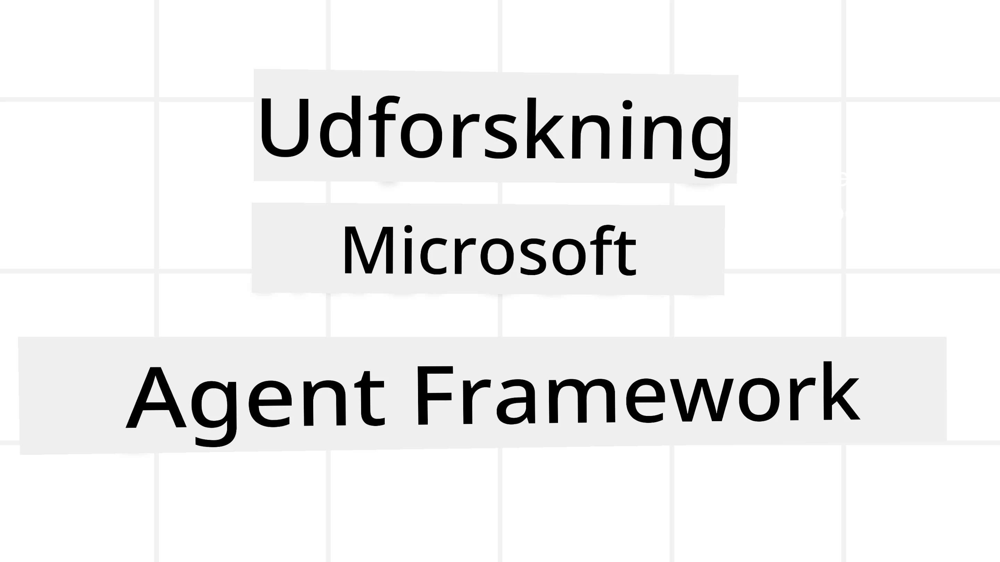
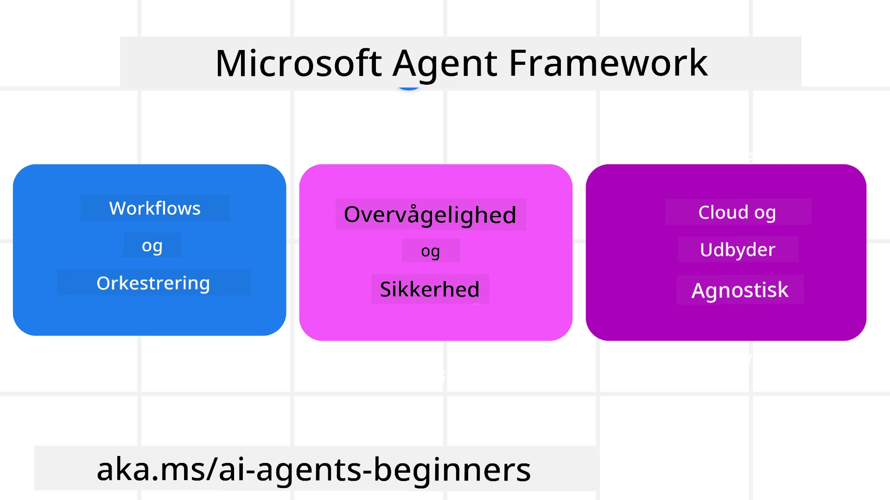
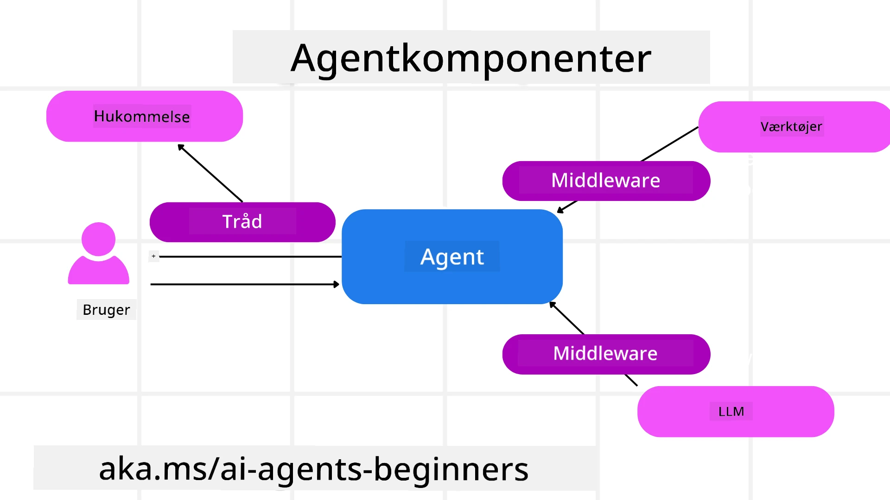

# Udforskning af Microsoft Agent Framework



### Introduktion

Denne lektion vil dække:

- Forståelse af Microsoft Agent Framework: Nøglefunktioner og værdi  
- Udforskning af nøglebegreber i Microsoft Agent Framework
- Avancerede MAF mønstre: Workflows, middleware og hukommelse

## Læringsmål

Efter at have gennemført denne lektion vil du vide, hvordan du:

- Bygger produktionsklar AI-agenter ved hjælp af Microsoft Agent Framework
- Anvender kernefunktionerne i Microsoft Agent Framework til dine agentbrugstilfælde
- Bruger avancerede mønstre herunder workflows, middleware og observabilitet

## Kodeeksempler 

Kodeeksempler for [Microsoft Agent Framework (MAF)](https://learn.microsoft.com/en-us/agent-framework/overview/?wt.mc_id=youtube_26688_organicsocial_reactor&pivots=programming-language-python) findes i dette repository under filerne `xx-python-agent-framework` og `xx-dotnet-agent-framework`.

## Forståelse af Microsoft Agent Framework



[Microsoft Agent Framework (MAF)](https://learn.microsoft.com/en-us/agent-framework/overview/?wt.mc_id=youtube_26688_organicsocial_reactor&pivots=programming-language-python) er Microsofts ensartede framework til at bygge AI-agenter. Det tilbyder fleksibilitet til at håndtere den store variation af agentbrugstilfælde, der ses i både produktions- og forskningsmiljøer, herunder:

- **Sekventiel agentorkestrering** i scenarier, hvor trin-for-trin workflows er nødvendige.
- **Samtidig orkestrering** i scenarier, hvor agenter skal udføre opgaver på samme tid.
- **Gruppechat orkestrering** i scenarier, hvor agenter kan samarbejde om én opgave.
- **Overdragelsesorkestrering** i scenarier, hvor agenter overdrager opgaven til hinanden, efterhånden som delopgaver bliver fuldført.
- **Magnetisk orkestrering** i scenarier, hvor en lederagent opretter og ændrer en opgaveliste og håndterer koordineringen af underagenter for at fuldføre opgaven.

For at levere AI-agenter i produktion har MAF også inkluderet funktioner for:

- **Observabilitet** gennem brug af OpenTelemetry, hvor hver handling af AI-agenten inklusive værktøjskald, orkestreringstrin, resonnementsflows og præstationsovervågning via Microsoft Foundry-dashboards logges.
- **Sikkerhed** ved hosting af agenter nativer på Microsoft Foundry, som inkluderer sikkerhedskontroller såsom rollebaseret adgang, håndtering af private data og indbygget indholdssikkerhed.
- **Holdbarhed** da agenttråde og workflows kan pause, genoptage og genoprette fra fejl, hvilket muliggør længerevarende processer.
- **Kontrol** da menneske-i-løkken workflows understøttes, hvor opgaver markeres som krævende menneskelig godkendelse.

Microsoft Agent Framework er også fokuseret på interoperabilitet ved:

- **At være cloud-agnostisk** - Agenter kan køre i containere, lokalt og på tværs af flere forskellige clouds.
- **At være leverandøruafhængig** - Agenter kan oprettes gennem dit foretrukne SDK inklusive Azure OpenAI og OpenAI
- **Integration af åbne standarder** - Agenter kan benytte protokoller som Agent-til-Agent (A2A) og Model Context Protocol (MCP) til at opdage og bruge andre agenter og værktøjer.
- **Plugins og Connectorer** - Forbindelser kan oprettes til data- og hukommelsestjenester såsom Microsoft Fabric, SharePoint, Pinecone og Qdrant.

Lad os se på, hvordan disse funktioner anvendes på nogle af kernebegreberne i Microsoft Agent Framework.

## Nøglebegreber i Microsoft Agent Framework

### Agenter



**Oprettelse af agenter**

Agentoprettelse sker ved at definere inference-tjenesten (LLM-udbyder), et
sæt instruktioner for AI-agenten at følge, og et tildelt `navn`:

```python
agent = AzureOpenAIChatClient(credential=AzureCliCredential()).create_agent( instructions="You are good at recommending trips to customers based on their preferences.", name="TripRecommender" )
```

Ovenstående bruger `Azure OpenAI`, men agenter kan oprettes med en række tjenester, inklusive `Microsoft Foundry Agent Service`:

```python
AzureAIAgentClient(async_credential=credential).create_agent( name="HelperAgent", instructions="You are a helpful assistant." ) as agent
```

OpenAI `Responses`, `ChatCompletion` API'er

```python
agent = OpenAIResponsesClient().create_agent( name="WeatherBot", instructions="You are a helpful weather assistant.", )
```

```python
agent = OpenAIChatClient().create_agent( name="HelpfulAssistant", instructions="You are a helpful assistant.", )
```

eller [MiniMax](https://platform.minimaxi.com/), som tilbyder en OpenAI-kompatibel API med store kontekstvinduer (op til 204K tokens):

```python
agent = OpenAIChatClient(base_url="https://api.minimax.io/v1", api_key=os.environ["MINIMAX_API_KEY"], model_id="MiniMax-M3").create_agent( name="HelpfulAssistant", instructions="You are a helpful assistant.", )
```

eller fjernagenter via A2A-protokollen:

```python
agent = A2AAgent( name=agent_card.name, description=agent_card.description, agent_card=agent_card, url="https://your-a2a-agent-host" )
```

**Kørsel af agenter**

Agenter køres ved at bruge `.run` eller `.run_stream` metoderne for enten ikke-streamede eller streamede svar.

```python
result = await agent.run("What are good places to visit in Amsterdam?")
print(result.text)
```

```python
async for update in agent.run_stream("What are the good places to visit in Amsterdam?"):
    if update.text:
        print(update.text, end="", flush=True)

```

Hver agentkørsel kan også have muligheder for at tilpasse parametre såsom `max_tokens` brugt af agenten, `tools` som agenten kan kalde, og endda den `model` selv, der bruges til agenten.

Dette er nyttigt i tilfælde, hvor specifikke modeller eller værktøjer er nødvendige for at fuldføre en brugers opgave.

**Værktøjer**

Værktøjer kan defineres både ved agentdefinition:

```python
def get_attractions( location: Annotated[str, Field(description="The location to get the top tourist attractions for")], ) -> str: """Get the top tourist attractions for a given location.""" return f"The top attractions for {location} are." 


# Når du opretter en ChatAgent direkte

agent = ChatAgent( chat_client=OpenAIChatClient(), instructions="You are a helpful assistant", tools=[get_attractions]

```

og også ved kørsel af agenten:

```python

result1 = await agent.run( "What's the best place to visit in Seattle?", tools=[get_attractions] # Værktøj leveret kun til denne kørsel )
```

**Agenttråde**

Agenttråde bruges til at håndtere flertrins samtaler. Tråde kan oprettes enten ved:

- Brug af `get_new_thread()` som muliggør, at tråden kan gemmes over tid
- Automatisk oprettelse af en tråd, når en agent kører, og at tråden kun varer under den aktuelle kørsel.

For at oprette en tråd ser koden således ud:

```python
# Opret en ny tråd.
thread = agent.get_new_thread() # Kør agenten med tråden.
response = await agent.run("Hello, I am here to help you book travel. Where would you like to go?", thread=thread)

```

Du kan herefter serialisere tråden for at gemme den til senere brug:

```python
# Opret en ny tråd.
thread = agent.get_new_thread() 

# Kør agenten med tråden.

response = await agent.run("Hello, how are you?", thread=thread) 

# Serialiser tråden til lagring.

serialized_thread = await thread.serialize() 

# Deserialiser trådens tilstand efter indlæsning fra lagring.

resumed_thread = await agent.deserialize_thread(serialized_thread)
```

**Agent-middleware**

Agenter interagerer med værktøjer og LLM'er for at fuldføre brugerens opgaver. I visse scenarier ønsker vi at udføre eller spore handlinger imellem disse interaktioner. Agent-middleware gør dette muligt gennem:

*Funktion Middleware*

Denne middleware tillader os at udføre en handling mellem agenten og en funktion/værktøj, som den vil kalde. Et eksempel på når dette bruges, er hvis man ønsker at logge funktionskaldet.

I koden nedenfor definerer `next` om næste middleware eller den egentlige funktion skal kaldes.

```python
async def logging_function_middleware(
    context: FunctionInvocationContext,
    next: Callable[[FunctionInvocationContext], Awaitable[None]],
) -> None:
    """Function middleware that logs function execution."""
    # Forbehandling: Log før funktionens udførelse
    print(f"[Function] Calling {context.function.name}")

    # Fortsæt til næste middleware eller funktionsudførelse
    await next(context)

    # Efterbehandling: Log efter funktionens udførelse
    print(f"[Function] {context.function.name} completed")
```

*Chat-middleware*

Denne middleware tillader os at udføre eller logge en handling mellem agenten og forespørgslerne til LLM'en.

Dette indeholder vigtig information som de `messages`, der bliver sendt til AI-tjenesten.

```python
async def logging_chat_middleware(
    context: ChatContext,
    next: Callable[[ChatContext], Awaitable[None]],
) -> None:
    """Chat middleware that logs AI interactions."""
    # Forbehandling: Log før AI-kald
    print(f"[Chat] Sending {len(context.messages)} messages to AI")

    # Fortsæt til næste middleware eller AI-tjeneste
    await next(context)

    # Efterbehandling: Log efter AI-svar
    print("[Chat] AI response received")

```

**Agenthukommelse**

Som dækket i lektionen `Agentic Memory`, er hukommelse et vigtigt element for at muliggøre agenten at operere over forskellige kontekster. MAF tilbyder flere forskellige typer hukommelse:

*In-Memory Storage*

Dette er hukommelse gemt i tråde under applikationskørsel.

```python
# Opret en ny tråd.
thread = agent.get_new_thread() # Kør agenten med tråden.
response = await agent.run("Hello, I am here to help you book travel. Where would you like to go?", thread=thread)
```

*Persistent Messages*

Denne hukommelse bruges til at gemme samtalehistorik på tværs af forskellige sessioner. Den defineres ved hjælp af `chat_message_store_factory`:

```python
from agent_framework import ChatMessageStore

# Opret en brugerdefineret meddelelseslager
def create_message_store():
    return ChatMessageStore()

agent = ChatAgent(
    chat_client=OpenAIChatClient(),
    instructions="You are a Travel assistant.",
    chat_message_store_factory=create_message_store
)

```

*Dynamisk hukommelse*

Denne hukommelse tilføjes til konteksten, før agenter køres. Disse hukommelser kan gemmes i eksterne tjenester såsom mem0:

```python
from agent_framework.mem0 import Mem0Provider

# Brug af Mem0 til avancerede hukommelsesfunktioner
memory_provider = Mem0Provider(
    api_key="your-mem0-api-key",
    user_id="user_123",
    application_id="my_app"
)

agent = ChatAgent(
    chat_client=OpenAIChatClient(),
    instructions="You are a helpful assistant with memory.",
    context_providers=memory_provider
)

```

**Agent Observabilitet**

Observabilitet er vigtigt for at bygge pålidelige og vedligeholdelige agentbaserede systemer. MAF integrerer med OpenTelemetry for at tilbyde tracing og målere til bedre observabilitet.

```python
from agent_framework.observability import get_tracer, get_meter

tracer = get_tracer()
meter = get_meter()
with tracer.start_as_current_span("my_custom_span"):
    # gør noget
    pass
counter = meter.create_counter("my_custom_counter")
counter.add(1, {"key": "value"})
```

### Workflows

MAF tilbyder workflows, som er foruddefinerede trin til at fuldføre en opgave og inkluderer AI-agenter som komponenter i disse trin.

Workflows består af forskellige komponenter, som tillader bedre kontrolflow. Workflows muliggør også **multi-agent orkestrering** og **checkpointing** for at gemme workflow-tilstande.

De kernekomponenter i et workflow er:

**Executorer**

Executorer modtager inputbeskeder, udfører deres tildelte opgaver og producerer derefter en outputbesked. Dette bevæger workflowet fremad mod fuldførelsen af den større opgave. Executorer kan være enten AI-agenter eller brugerdefineret logik.

**Kanter**

Kanter bruges til at definere flowet af beskeder i et workflow. Disse kan være:

*Direkte kanter* - Enkle en-til-en forbindelser mellem executorere:

```python
from agent_framework import WorkflowBuilder

builder = WorkflowBuilder()
builder.add_edge(source_executor, target_executor)
builder.set_start_executor(source_executor)
workflow = builder.build()
```

*Betingede kanter* - Aktiveres efter at en bestemt betingelse er opfyldt. For eksempel, når hotelværelser ikke er tilgængelige, kan en executor foreslå andre muligheder.

*Switch-case kanter* - Dirigerer beskeder til forskellige executorere baseret på definerede betingelser. For eksempel hvis rejsekunden har prioriteret adgang, håndteres deres opgaver gennem et andet workflow.

*Fan-out kanter* - Sender én besked til flere mål.

*Fan-in kanter* - Samler flere beskeder fra forskellige executorere og sender til ét mål.

**Events**

For at tilbyde bedre observabilitet i workflows tilbyder MAF indbyggede events for eksekvering, herunder:

- `WorkflowStartedEvent`  - Workflow eksekvering begynder
- `WorkflowOutputEvent` - Workflow producerer et output
- `WorkflowErrorEvent` - Workflow oplever en fejl
- `ExecutorInvokeEvent`  - Executor starter behandling
- `ExecutorCompleteEvent`  -  Executor afslutter behandling
- `RequestInfoEvent` - En forespørgsel udstedes

## Avancerede MAF mønstre

Sektionerne ovenfor dækker nøglebegreberne i Microsoft Agent Framework. Når du bygger mere komplekse agenter, er her nogle avancerede mønstre at overveje:

- **Middleware-sammensætning**: Kæd flere middleware-håndterere (logging, auth, rate-limiting) ved hjælp af funktion- og chatmiddleware for detaljeret kontrol over agentadfærd.
- **Workflow checkpointing**: Brug workflow-events og serialisering til at gemme og genoptage langkørende agentprocesser.
- **Dynamisk værktøjsvalg**: Kombiner RAG over værktøjsbeskrivelser med MAF's værktøjsregistrering for kun at præsentere relevante værktøjer pr. forespørgsel.
- **Multi-agent overdragelse**: Brug workflow-kanter og betinget routing til at orkestrere overdragelser mellem specialiserede agenter.

## Hosting af LangChain / LangGraph agenter på Microsoft Foundry

Microsoft Agent Framework er **framework-interoperabelt** — du er ikke begrænset til agenter skrevet med MAF. Hvis du allerede har en agent bygget med **LangChain** eller **LangGraph**, kan du køre den som en **Microsoft Foundry hosted agent**, så Foundry håndterer runtime, sessions, skalering, identitet og protokolendpoints for dig, mens din agentlogik forbliver i LangGraph.

Dette gøres med `langchain_azure_ai.agents.hosting` pakken, som eksponerer en kompileret LangGraph graf over de samme protokoller som Foundry hosted agents bruger.

**1. Installer hosting ekstraet:**

```bash
pip install -U "langchain-azure-ai[hosting]>=1.2.4" azure-identity
```

`hosting` ekstraet installerer Foundry protokolbibliotekerne: `azure-ai-agentserver-responses` (det OpenAI-kompatible `/responses` endpoint) og `azure-ai-agentserver-invocations` (det generiske `/invocations` endpoint).

**2. Vælg en hosting-protokol:**

| Protokol | Hostklasse | Endpoint | Bruges når |
|----------|-----------|----------|----------|
| **Responses** | `ResponsesHostServer` | `/responses` | Du ønsker OpenAI-kompatibel chat, streaming, svarhistorik og samtaletrådning — den anbefalede standard for samtaleagenter. |
| **Invocations** | `InvocationsHostServer` | `/invocations` | Du har brug for en brugerdefineret JSON-struktur, et webhook-stil endpoint eller ikke-samtalebaseret behandling. |

Da **Responses API er den primære API til agent-stil udvikling i Foundry**, start med `ResponsesHostServer` for de fleste agenter.

**3. Konfigurer miljøvariabler** (`az login` først, så `DefaultAzureCredential` kan autentificere):

```bash
export FOUNDRY_PROJECT_ENDPOINT="https://<resource>.services.ai.azure.com/api/projects/<project>"
export FOUNDRY_MODEL_NAME="gpt-5-mini"
```

Når agenten senere kører som hosted agent i Foundry, injicerer platformen automatisk `FOUNDRY_PROJECT_ENDPOINT`.

**4. Eksponer en LangGraph agent over Responses protokollen:**

```python
import os

from azure.ai.projects import AIProjectClient
from azure.identity import DefaultAzureCredential, get_bearer_token_provider
from langchain.agents import create_agent
from langchain_openai import ChatOpenAI
from langchain_azure_ai.agents.hosting import ResponsesHostServer

_AZURE_AI_SCOPE = "https://ai.azure.com/.default"


def build_chat_model() -> ChatOpenAI:
    project_endpoint = os.environ["FOUNDRY_PROJECT_ENDPOINT"].rstrip("/")
    deployment = os.environ.get("FOUNDRY_MODEL_NAME", "gpt-5-mini")
    credential = DefaultAzureCredential()
    project = AIProjectClient(endpoint=project_endpoint, credential=credential)
    openai_client = project.get_openai_client()
    token_provider = get_bearer_token_provider(credential, _AZURE_AI_SCOPE)

    # ChatOpenAI her retter sig mod Foundry-projektets OpenAI-kompatible (Responses) endepunkt.
    return ChatOpenAI(
        model=deployment,
        base_url=str(openai_client.base_url),
        api_key=token_provider,
    )


def main() -> None:
    graph = create_agent(build_chat_model(), tools=[])
    port = int(os.environ.get("PORT", "8088"))
    ResponsesHostServer(graph).run(port=port)


if __name__ == "__main__":
    main()
```

Kør den lokalt med `python main.py`, og send derefter en Responses-forespørgsel til `http://localhost:8088/responses`.

**Nøglefunktioner:**

- **Samtaler**: Klienter fortsætter en samtale ved at videregive `previous_response_id` eller en `conversation` ID. Hvis din graf er kompileret med en LangGraph checkpointer, kobler Foundry samtalestatus til checkpointen (brug en holdbar checkpointer i produktion; `MemorySaver` er fint til lokal test).
- **Human-in-the-loop**: Hvis din graf bruger LangGraph `interrupt()`, viser `ResponsesHostServer` den ventende afbrydelse som en Responses `function_call` / `mcp_approval_request`-post, og klienter genoptager med en tilsvarende `function_call_output` / `mcp_approval_response`.
- **Udrulning til Foundry**: Brug Azure Developer CLI — `azd ext install azure.ai.agents`, `azd ai agent init -m <manifest>`, `azd ai agent run` (lokalt, kræver Docker), derefter `azd provision` og `azd deploy`. Udbringning af hosted-agent kræver **Foundry Project Manager** rollen.

En kørbar version af dette eksempel findes i [code-samples/14-langchain-hosted-agent.py](../../../14-microsoft-agent-framework/code-samples/14-langchain-hosted-agent.py). For den fulde gennemgang (Invocations protokol, brugerdefinerede anmodningsskemaer og fejlfinding), se [Host LangGraph agents as Foundry hosted agents](https://learn.microsoft.com/azure/foundry/how-to/develop/langchain-hosted-agents).

## Kodeeksempler 

Kodeeksempler for Microsoft Agent Framework kan findes i dette repository under filerne `xx-python-agent-framework` og `xx-dotnet-agent-framework`.

## Har du flere spørgsmål om Microsoft Agent Framework?

Deltag i [Microsoft Foundry Discord](https://discord.com/invite/ATgtXmAS5D) for at møde andre lærende, deltage i kontortimer og få svar på dine spørgsmål om AI-agenter.
## Forrige lektion

[Memory for AI Agents](../13-agent-memory/README.md)

## Næste lektion

[Building Computer Use Agents (CUA)](../15-browser-use/README.md)

---

<!-- CO-OP TRANSLATOR DISCLAIMER START -->
**Ansvarsfraskrivelse**:
Dette dokument er blevet oversat ved hjælp af AI-oversættelsestjenesten [Co-op Translator](https://github.com/Azure/co-op-translator). Selvom vi bestræber os på nøjagtighed, skal du være opmærksom på, at automatiserede oversættelser kan indeholde fejl eller unøjagtigheder. Det originale dokument på dets oprindelige sprog bør betragtes som den autoritative kilde. For kritisk information anbefales professionel menneskelig oversættelse. Vi påtager os intet ansvar for misforståelser eller fejltolkninger, der opstår som følge af brugen af denne oversættelse.
<!-- CO-OP TRANSLATOR DISCLAIMER END -->