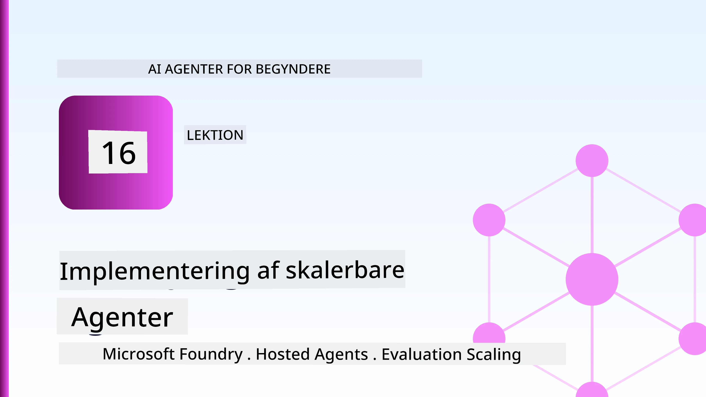
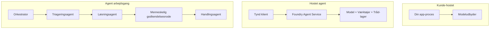
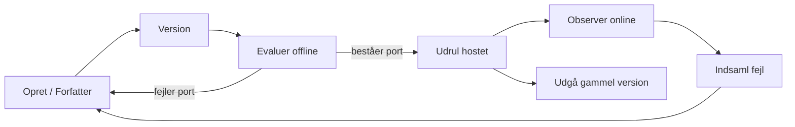
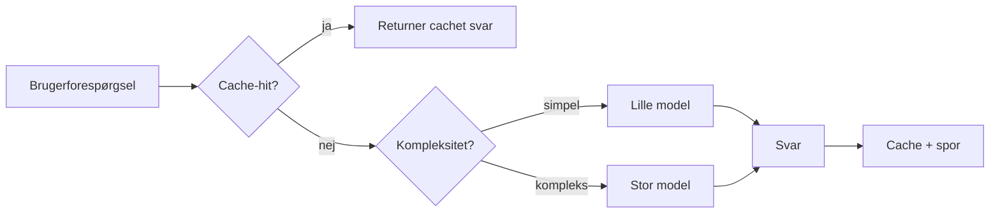
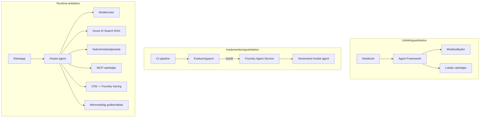

# Udrulning af Skalerbare Agenter med Microsoft Foundry



Indtil dette punkt i kurset har du bygget agenter, der kører på din bærbare computer, inde i en notesbog, styret af `az login` og en håndfuld miljøvariabler. Det er præcis den rigtige måde at lære på. Det er ikke den rigtige måde at køre en agent på, som tusindvis af kunder er afhængige af kl. 3 om natten.

Denne lektion handler om kløften mellem "det virker på min maskine" og "det virker, pålideligt og overkommeligt, i produktion." Vi lukker den kløft ved hjælp af **Microsoft Foundry** og **Microsoft Foundry Agent Service**, og vi gør det ved at bygge en rigtig kundesupportagent, der har værktøjer, genfinding, hukommelse, evaluering og overvågning.

## Introduktion

Denne lektion vil dække:

- Forskellen mellem en **prototypeagent** og en **udrullet agent**, og hvorfor overgangen mest handler om alt *rundt om* modellen.
- **Udrulningsmønstre** for agenter: klient-hostet, service-hostet (Hosted Agents) og workflow-orchestreret.
- **Agentens livscyklus** på Microsoft Foundry — oprette, versionere, udrulle, evaluere, observere, pensionere.
- **Skaleringstrategier**: modelrouting, caching, samtidighed og statsløs design.
- **Observabilitet** med OpenTelemetry og Foundry-sporing.
- **Omkostningsoptimering** gennem modelvalg, routing og evalueringsporte.
- **Virksomhedsovervejelser**: governance, menneskelig godkendelse og sikker kørsel af MCP-servere i produktion.

## Læringsmål

Når du har gennemført denne lektion, vil du vide, hvordan du:

- Vælger det rigtige udrulningsmønster til en given agentarbejdsbyrde.
- Udruller en agent til Microsoft Foundry Agent Service, så den er versioneret, styret og observerbar.
- Instrumenterer en agent til sporing og kobler en evalueringspipeline, der kører før hver udgivelse.
- Anvender modelrouting og caching for at holde latenstid og omkostninger under kontrol i skala.
- Tilføjer en menneskelig godkendelsesport for højrisikohandlinger og integrerer en MCP-server på en produktsikker måde.

## Forudsætninger

Denne lektion antager, at du har gennemført de tidligere lektioner og er fortrolig med:

- At bygge agenter med [Microsoft Agent Framework](../14-microsoft-agent-framework/README.md) (Lektion 14).
- [Brug af værktøjer](../04-tool-use/README.md) (Lektion 4) og [Agentic RAG](../05-agentic-rag/README.md) (Lektion 5).
- [Agenthukommelse](../13-agent-memory/README.md) (Lektion 13) og [Agentic Protocols / MCP](../11-agentic-protocols/README.md) (Lektion 11).
- [Observabilitet og Evaluering](../10-ai-agents-production/README.md) (Lektion 10) — denne lektion bygger direkte videre på den.

Du skal også bruge:

- Et **Azure-abonnement** og et **Microsoft Foundry-projekt** med mindst én udrullet chatmodel.
- Azure CLI autentificeret (`az login`).
- Python 3.12+ og pakkerne i depotets [`requirements.txt`](../../../requirements.txt).

## Fra Prototype til Produktion: Hvad Ændres Faktisk

En prototypeagent og en produktionsagent deler den samme kerne-løkke — ræsonnere, kalde værktøjer, svare. Hvad der ændres, er alt det, der er pakket rundt om den løkke. Modellen udgør måske 20% af en produktionsagent; de øvrige 80% er det operationelle skelet.

| Bekymring | Prototype | Produktion |
| --- | --- | --- |
| **Hosting** | Kører i din notesbog | Kører som en hostet service, versioneret og udrullet |
| **Identitet** | Dit `az login` token | Administreret identitet med scoped RBAC |
| **Tilstand** | I hukommelsen, mister det ved genstart | Eksternaliseret (trådlager, hukommelsestjeneste) |
| **Fejl** | Du ser traceback | Genforsøg, fallback, dead-letter, advarsler |
| **Omkostning** | "Det er et par cent" | Sporet pr. forespørgsel, rutet, cached, budgetteret |
| **Kvalitet** | Du vurderer output | Evalueret automatisk før hver udgivelse |
| **Tillid** | Du godkender hver handling | Politik + menneske-i-løkke for risikable handlinger |

Husk denne tabel. Hvert afsnit nedenfor svarer til en af disse rækker.

## Agent Udrulningsmønstre

Der er tre mønstre, du vil bruge, ofte i kombination.

### 1. Klient-Hostede Agenter

Agentobjektet lever inde i *din* applikationsproces. Din kode kalder modeludbyderen direkte; ræsonneringsloopen kører i din service. Det er det, alle tidligere lektioner har gjort.

- **Brug det når** du har brug for fuld kontrol over loopen, brugerdefineret middleware, eller du integrerer agenten i en eksisterende backend.
- **Afvejning**: du ejer selv skalering, tilstand og robusthed.

### 2. Hostede Agenter (Foundry Agent Service)

Agenten er *registreret som en ressource* i Microsoft Foundry. Foundry hoster ræsonneringsloopen, gemmer tråde, håndhæver indholdssikkerhed og RBAC, og gør agenten synlig i Foundry-portalen. Din app bliver en tynd klient, der opretter tråde og læser svar.

- **Brug det når** du ønsker holdbarhed, indbygget observabilitet, governance og mindre operationelt overfladeareal.
- **Afvejning**: mindre lavniveaukontrol til gengæld for et administreret runtime-miljø.

### 3. Agent Workflows

Flere agenter (og værktøjer) sammensættes i en graf med eksplicit kontrolflow — sekventielle trin, forgreninger, menneskelige godkendelsesnoder og holdbare checkpoints, der kan pause og genoptage. Dette er Microsoft Agent Frameworks **Workflows** funktionalitet anvendt i stor skala.

- **Brug det når** en enkelt opgave spænder over flere specialiserede agenter eller kræver en godkendelsesfase midt i.
- **Afvejning**: flere bevægelige dele; kræver observabilitet på orkestreringsniveau.



## Agentens Livscyklus på Microsoft Foundry

Udrulning af en agent er ikke et engangs-`push`. Det er en løkke, og den ligner meget en softwareudgivelsescyklus, fordi det er præcis, hvad den er.



Nøgleideen, taget fra [Lektion 10](../10-ai-agents-production/README.md): **offline evaluering er en port, ikke en eftertanke.** En ny agentversion udgives ikke, medmindre den klarer dine evalueringsgrænser. Online observabilitet fører så virkelige fejl tilbage til dit offline testset. Det er hele løkken.

## Skaleringstrategier

Skalering af en agent er anderledes end skalering af en statsløs web-API, fordi hver forespørgsel kan udløse flere dyre model- og værktøjsopkald. Fire teknikker bærer hovedparten af belastningen.

**Stateless håndtering af forespørgsler.** Gem ingen per-bruger tilstand i din proceshukommelse. Gem samtaletråde i Foundrys trådlager eller en hukommelsestjeneste, så enhver instans kan håndtere enhver anmodning. Det er det, der gør dig i stand til at skalere horisontalt — tilføj instanser, ingen fastkørende sessioner.

**Modelrouting.** Ikke hver forespørgsel har brug for din mest kapable (og dyreste) model. Ruter simple forespørgsler — hensigtsklassificering, korte faktuelle svar — til en lille, hurtig model, og reserver den store model til ægte ræsonnering. Foundrys **Model Router** kan gøre dette for dig, eller du kan implementere en letvægtsklassifikator selv. Du vil bygge gør-det-selv-versionen i laboratoriet.

**Response caching.** Mange supporthenvendelser er næsten dubletter ("hvordan nulstiller jeg min adgangskode?"). Cache svar på almindelige spørgsmål og lever dem uden at ramme modellen overhovedet. Selv en moderat cache-hit rate skærer mærkbart i omkostninger og latenstid.

**Samtidighed og tilbagepres.** Modeludbydere har grænser for hastighed. Begræns din samtidighed, brug genforsøg med eksponentiel backoff, og fejle yndefuldt (et kø-respons "vi arbejder på det" er bedre end en 500).



## Observabilitet i Produktion

Du kan ikke drive, hvad du ikke kan se. Som dækket i Lektion 10 udsender Microsoft Agent Framework **OpenTelemetry**-sporinger indbygget — hvert modelkald, værktøjskald og orkestreringstrin bliver en span. I produktion eksporterer du disse spans til Microsoft Foundry (eller enhver OTel-kompatibel backend), så du kan:

- Spore en enkelt kundeklager fra start til slut på tværs af hvert model- og værktøjskald.
- Overvåge p50/p95 latenstid og omkostninger pr. forespørgsel over tid.
- Alarmer ved fejlrate-spidser og omkostningsafvigelser før dine brugere (eller dit økonomiteam) bemærker det.

```python
from agent_framework.observability import get_tracer

tracer = get_tracer()

with tracer.start_as_current_span("support_request") as span:
    span.set_attribute("customer.tier", "enterprise")
    span.set_attribute("routed.model", "gpt-5-nano")
    # agenteksekvering spores automatisk inden for denne span
```

Attributter som `customer.tier` og `routed.model` er det, der forvandler en væg af sporinger til besvarelige spørgsmål ("bliver virksomhedskunder routeret for ofte til den lille model?").

## Omkostningsoptimering

Omkostninger i produktionsagenter domineres af tokens. Tre håndtag, i rækkefølge efter effekt:

1. **Vælg den rigtige modelstørrelse.** En lille model, der består din evalueringsport, er næsten altid billigere end en stor model, der også består. Brug evaluering til *at bevise*, at den lille model er god nok i stedet for som standard at vælge den største model af forsigtighed.
2. **Ruter efter kompleksitet.** Som ovenfor — betal store-model-priser kun for forespørgsler, der har brug for stor-model ræsonnering.
3. **Cache aggressivt.** Det billigste modelkald er det, du aldrig foretager.

Evalueringsporte og omkostningskontrol er den samme disciplin set fra to vinkler: evaluering fortæller dig *kvalitetsgulvet*, routing og caching holder dig så tæt som muligt på gulvets *omkostninger*.

## Virksomhedsmæssige Overvejelser ved Udrulning

**Governance.** Hostede Agenter arver Foundrys RBAC, indholdssikkerhed og revisionslogning. Giv hver agent en administreret identitet med mindst privilegium — skrivebeskyttet adgang til vidensbasen, scoped adgang til ticketing-API'en, ikke mere.

**Menneske-i-løkke.** Nogle handlinger er for betydningsfulde til fuld automatisering — udstedelse af refundering, sletning af konto, eskalering til en juridisk afdeling. Microsoft Agent Framework understøtter **værktøjer, der kræver godkendelse**: agenten foreslår handlingen, udførelse pauser, et menneske godkender eller afviser, og workflowet genoptages. Du så primitiven i [Lektion 6](../06-building-trustworthy-agents/README.md); her udruller du den.

**MCP i produktion.** [MCP](../11-agentic-protocols/README.md) lader din agent bruge eksterne værktøjer via en standardgrænseflade. I produktion betragtes hver MCP-server som en ikke-tillidspunktgrænse: fastlåse serverversionen, køre den med en scoped identitet, validere dens output og aldrig eksponere hemmeligheder til den. En MCP-server er en afhængighed, og afhængigheder patches, gennemgås og får hastighedsbegrænsning.



De tre diagrammer — udvikling, udrulning, kørsel — repræsenterer samme agent i tre livsfaser. Det følgende laboratorium fører dig igennem at bygge den.

## Praktisk Laboratorium: En Produktionsklar Kundesupportagent

Åbn [`code_samples/16-python-agent-framework.ipynb`](./code_samples/16-python-agent-framework.ipynb) og arbejd dig igennem den fra start til slut. Du vil samle en **Contoso kundesupportagent**, med alle produktionshensyn koblet på:

1. **Værktøjskald** — slå ordrestatus op og åbn supportsager.
2. **RAG** — besvar politikspørgsmål fra en vidensbase (Azure AI Search, med et in-memory fallback, så notesbogen kan køre uden en Search-ressource).
3. **Hukommelse** — husk kunden over samtalens omgange.
4. **Modelrouting** — en kompleksitetsklassifikator sender hver forespørgsel til en lille eller stor model.
5. **Response caching** — gentagne spørgsmål besvares fra cache.
6. **Menneskelig godkendelse** — refunderinger over en tærskel pauser til menneskelig godkendelse.
7. **Evalueringspipeline** — et lille offline testset scorer agenten og fungerer som en udgivelsesport.
8. **Observabilitet** — OpenTelemetry-sporing omkring hver forespørgsel.

### Gennemgang

Notesbogen er organiseret, så hvert produktionshensyn er en selvstændig, kørbar sektion. Hjertet i den er routing-plus-caching-forespørgselsbehandleren:

```python
async def handle_support_request(query: str, customer_id: str) -> str:
    # 1. Server fra cache, når vi kan.
    cached = response_cache.get(normalize(query))
    if cached:
        return cached

    # 2. Ruter efter kompleksitet for at kontrollere omkostninger.
    model = "gpt-5-nano" if is_simple(query) else "gpt-5-mini"

    # 3. Kør agenten inden for en trace-span for observabilitet.
    with tracer.start_as_current_span("support_request") as span:
        span.set_attribute("routed.model", model)
        span.set_attribute("customer.id", customer_id)
        response = await support_agent.run(query, model=model)

    # 4. Cache og returner.
    response_cache.set(normalize(query), response.text)
    return response.text
```

Evalueringsporten, der beskytter en udgivelse, ser sådan ud:

```python
async def evaluation_gate(agent, test_cases, threshold: float = 0.8) -> bool:
    passed = 0
    for case in test_cases:
        result = await agent.run(case["input"])
        if score_response(result.text, case["expected"]) >= 0.8:
            passed += 1
    pass_rate = passed / len(test_cases)
    print(f"Evaluation pass rate: {pass_rate:.0%} (gate: {threshold:.0%})")
    return pass_rate >= threshold  # kun udrul hvis porten godkendes
```

Læs hver linje — notesbogen holder primitiverne bevidst små, så intet er skjult bag et frameworks kald.

## Validering af en Udrullet Agent med Smoke Tests

Evalueringsporten ovenfor kører *offline* mod dit agentobjekt. Når agenten er udrullet som en Hosted Agent, har du brug for en til check mere, endnu billigere: **svarer den udrullede endpoint faktisk?**

At udrulle "succesfuldt" beviser kun, at kontrolplanet accepterede definitionen — det beviser ikke, at agenten reagerer. En manglende afhængighed, en dårlig modelrouting eller en udløbet forbindelse kan efterlade en grøn udrulning, der ikke returnerer noget. En **smoke test** fanger det på få sekunder, ved hver udrulning, uden omkostningerne ved en fuld evaluering.

Dette depot indeholder en klar-til-brug smoke-test pipeline bygget på [AI Smoke Test](https://github.com/marketplace/actions/ai-smoke-test) GitHub Action:

- **Katalog** — [`tests/lesson-16-smoke-tests.json`](../../../tests/lesson-16-smoke-tests.json) indeholder prompts og påstande til Contoso supportagenten (baserede politik-svar, en ordresøgning, holde sig til emnet, og multi-turn tråd-kontinuitet). Kataloger for andre lektionsagenter findes ved siden af — se [`tests/README.md`](../tests/README.md).
- **Workflow** — [`.github/workflows/smoke-test.yml`](../../../.github/workflows/smoke-test.yml) logger ind med Azure OIDC og POSTer hver prompt til agentens Responses-endpoint, fejler jobbet ved enhver påstandsmiss.

```yaml
- name: Smoke-test hosted agent
  uses: JFolberth/ai-smoketest@v1
  with:
    project_endpoint: ${{ inputs.project_endpoint }}
    agent_name: ContosoSupportAgent
    tests_file: tests/lesson-16-smoke-tests.json
```


Kør det fra fanen **Actions** når din agent er deployeret, og angiv dit Foundry-projektendepunkt og agentnavn. Den fødererede identitet skal have rollen **Azure AI User** på Foundry-projektomfang. Tænk på lagene som en pyramide: røgtests (er den tilgængelig og reagerer?) køres ved hver deploy, offline evaluering (god nok til at sende i drift?) køres før promotion, og online evaluering (hvordan klarer den sig i virkeligheden?) kører kontinuerligt.

## Videnstest

Test din forståelse, inden du går videre til opgaven.

**1. Hvor stor en del af en produktionsagent er "modellen," og hvad består resten af?**

<details>
<summary>Svar</summary>

Modellen udgør en minoritet af systemet — ofte anslået til omkring 20%. Resten er den operationelle struktur: hosting og versionering, identitet og RBAC, ekstern tilstand, fejlbehandling, omkostningsovervågning, evaluering og menneskelig kontrol i løkken. At gå i produktion handler primært om at bygge alt *omkring* ræsonneringssløjfen.
</details>

**2. Hvornår ville du vælge en Hosted Agent frem for en klient-hostet agent?**

<details>
<summary>Svar</summary>

Når du ønsker et administreret runtime med indbygget holdbarhed (tråde der persistenter og kan genoptage), observabilitet, indholdssikkerhed og RBAC, og du er villig til at bytte noget lavniveau-kontrol over ræsonneringssløjfen for mindre operationelt område. Klient-hostet er at foretrække, når du har brug for fuld kontrol over sløjfen eller integrerer agenten i en eksisterende backend.
</details>

**3. Hvorfor skal en skalerbar agent være stateless i sin egen proceshukommelse?**

<details>
<summary>Svar</summary>

Så enhver instans kan håndtere enhver forespørgsel, hvilket muliggør horisontal skalering uden sticky sessions. Per-bruger samtaletilstand er eksternt lagret i en trådbutik eller hukommelsestjeneste. Hvis tilstanden levede i proceshukommelsen, ville du miste den ved genstart og kunne ikke frit fordele belastningen.
</details>

**4. Hvilket problem løser modelrouting, og hvordan relaterer det til evaluering?**

<details>
<summary>Svar</summary>

Routing sender simple forespørgsler til en lille, billig og hurtig model og reserverer den store model til egentlig ræsonnering, hvilket styrer både latenstid og omkostninger. Det relaterer til evaluering, fordi evaluering er det, der *beviser* at den lille model er god nok til en bestemt type forespørgsler — routing uden evaluering er blot gætteri.
</details>

**5. Hvad er en "evalueringport" og hvor befinder den sig i livscyklussen?**

<details>
<summary>Svar</summary>

En evalueringport kører et offline testsæt mod en ny agentversion og blokerer deploy medmindre beståelsesraten passerer en tærskel. Den ligger mellem "version" og "deploy" i livscyklussen og gør kvalitet til en forudsætning for udgivelse i stedet for noget, du tjekker efter frigivelse.
</details>

**6. Hvorfor bør en MCP-server behandles som en utroværdig grænse i produktion?**

<details>
<summary>Svar</summary>

Fordi det er en ekstern afhængighed, din agent kalder ind til. Du bør fastlåse dens version, køre den med scoped identitet, validere dens output, rate-begrænse den og aldrig udsætte hemmeligheder for den — samme disciplin som du anvender på enhver tredjepartsafhængighed. Dens output flyder ind i din agents ræsonnering, så uvalideret tillid er en sikkerhedsrisiko.
</details>

**7. Hvilken enkelt ændring har som regel størst indvirkning på omkostningerne ved en produktionsagent, og hvorfor?**

<details>
<summary>Svar</summary>

At vælge den rette modelstørrelse — at bruge den mindste model, som stadig består din evalueringport. Omkostninger domineres af tokens, og en mindre model, der opfylder kvalitetskravet, er næsten altid billigere end en større. Caching og routing reducerer omkostninger yderligere, men valget af grundmodellen har den største førsteordenseffekt.
</details>

**8. Hvilken rolle spiller span-attributter som `customer.tier` og `routed.model` i observabilitet?**

<details>
<summary>Svar</summary>

De forvandler rå trace-data til svarbare forretningsspørgsmål. Uden attributter har du en mur af spans; med dem kan du spørge "bliver erhvervskunder for ofte routet til den lille model?" eller "hvilken model håndterer vores langsomste forespørgsler?" Attributter er, hvordan du skærer telemetri ud efter de dimensioner, der betyder noget for din drift.
</details>

## Opgave

Tag kundesupportagenten fra laboratoriet og styrk den til et specifikt scenarie: **en abonnementsfaktureringssupportagent for en SaaS-virksomhed.**

Din aflevering skal:

1. **Udskift værktøjerne** med faktureringsrelevante: `get_subscription_status`, `get_invoice` og `issue_credit` (kreditter over 50 $ kræver menneskelig godkendelse).
2. **Tilføj tre RAG-dokumenter** der dækker virksomhedens refunderingspolitik, faktureringscyklus og afbestillingspolitik.
3. **Udvid evalueringssættet** til mindst otte tilfælde, inklusive mindst to der *skal* udløse den menneskelige godkendelsessti, og bekræft at din evalueringport korrekt godkender eller afviser.
4. **Tilføj en omkostningsrapport**: efter at have kørt ti blandede forespørgsler gennem agenten, udskriv hvor mange der gik til den lille model, hvor mange til den store model, og hvor mange der blev serveret fra cache.

Skriv et kort afsnit (i en markdown-celle) der forklarer, hvilken modelroutingregel du valgte, og hvordan du ville validere den med reel trafik. Der findes ikke et enkelt korrekt svar — du vurderes på om produktionshensynene er koordineret sammenhængende.

## Resumé

I denne lektion flyttede du en agent fra prototype til produktion med Microsoft Foundry:

- Overgangen til produktion handler mest om **den operationelle struktur** omkring modellen — hosting, identitet, tilstand, fejlbehandling, omkostninger, kvalitet og tillid.
- Du lærte de tre **deployeringsmønstre** — klienthostet, Hosted Agents og Agent Workflows — og hvornår de passer.
- Du gennemgik **agentens livscyklus**, hvor offline **evaluering fungerer som en frigivelsesport** og online observabilitet sender fejl tilbage til testsættet.
- Du anvendte **skaleringsstrategier** — stateless design, modelrouting, caching og begrænset parallelitet — og relaterede dem til **omkostningsoptimering**.
- Du indførte **virksomhedskontrol**: RBAC, menneskelig godkendelse i løkken og produktion-sikker MCP-integration.
- Du byggede en **produktionsklar kundesupportagent** der binder alle disse hensyn sammen i kørbar kode.

Den næste lektion tager den modsatte rejse: i stedet for at skalere agenter op i skyen, vil du bringe dem *ned* på en enkelt udviklermaskine og køre dem helt lokalt.

## Yderligere Ressourcer

- <a href="https://learn.microsoft.com/azure/ai-foundry/what-is-azure-ai-foundry" target="_blank">Microsoft Foundry dokumentation</a>
- <a href="https://learn.microsoft.com/azure/ai-foundry/agents/overview" target="_blank">Microsoft Foundry Agent Service oversigt</a>
- <a href="https://learn.microsoft.com/en-us/agent-framework/overview/?wt.mc_id=youtube_26688_organicsocial_reactor&pivots=programming-language-python" target="_blank">Microsoft Agent Framework</a>
- <a href="https://learn.microsoft.com/azure/ai-foundry/concepts/model-router" target="_blank">Model Router i Microsoft Foundry</a>
- <a href="https://learn.microsoft.com/azure/search/search-what-is-azure-search" target="_blank">Azure AI Search</a>
- <a href="https://opentelemetry.io/" target="_blank">OpenTelemetry</a>
- <a href="https://github.com/marketplace/actions/ai-smoke-test" target="_blank">AI Smoke Test GitHub Action</a>
- <a href="https://modelcontextprotocol.io/" target="_blank">Model Context Protocol (MCP)</a>

## Forrige Lektion

[Bygning af Computer Use Agents (CUA)](../15-browser-use/README.md)

## Næste Lektion

[Oprettelse af Lokale AI-agenter](../17-creating-local-ai-agents/README.md)

---

<!-- CO-OP TRANSLATOR DISCLAIMER START -->
**Ansvarsfraskrivelse**:
Dette dokument er blevet oversat ved hjælp af AI-oversættelsestjenesten [Co-op Translator](https://github.com/Azure/co-op-translator). Selvom vi bestræber os på nøjagtighed, skal du være opmærksom på, at automatiserede oversættelser kan indeholde fejl eller unøjagtigheder. Det originale dokument på dets oprindelige sprog bør betragtes som den autoritative kilde. For kritisk information anbefales professionel menneskelig oversættelse. Vi påtager os intet ansvar for misforståelser eller fejltolkninger, der opstår som følge af brugen af denne oversættelse.
<!-- CO-OP TRANSLATOR DISCLAIMER END -->