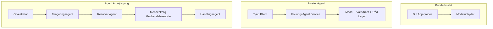
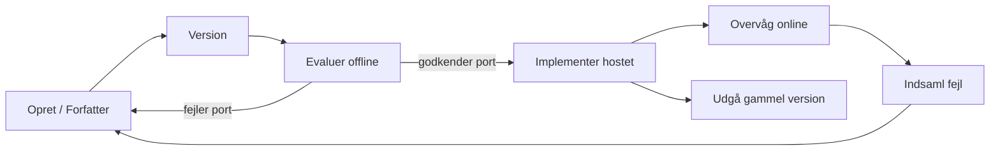
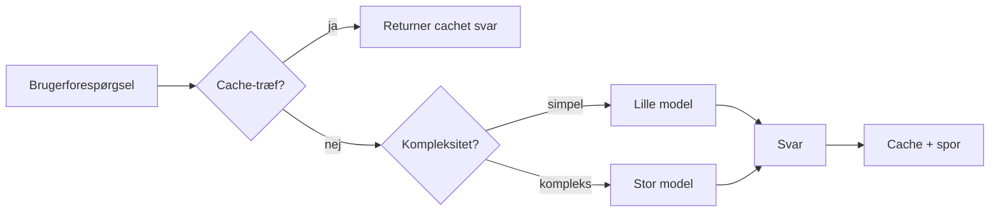
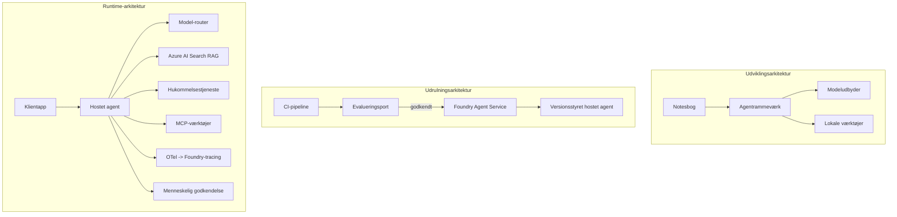

# Udrulning af Skalerbare Agenter med Microsoft Foundry


Indtil dette punkt i kurset har du bygget agenter, som kører på din bærbare computer, inde i en notesbog, drevet af `az login` og en håndfuld miljøvariabler. Det er præcis den rigtige måde at lære på. Det er ikke den rigtige måde at køre en agent, som tusindvis af kunder er afhængige af kl. 3 om natten.

Denne lektion handler om kløften mellem "det virker på min maskine" og "det virker pålideligt og prisvenligt i produktion." Vi lukker den kløft ved hjælp af **Microsoft Foundry** og **Microsoft Foundry Agent Service**, og vi gør det ved at bygge en ægte kundesupportagent med værktøjer, hentning, hukommelse, evaluering og overvågning.

## Introduktion

Denne lektion vil dække:

- Forskellen mellem en **prototypeagent** og en **udrullet agent**, og hvorfor overgangen primært handler om alt *omkring* modellen.
- **Udrulningsmønstre** for agenter: klient-hostede, service-hostede (Hosted Agents) og workflow-orchestrerede.
- **Agentens livscyklus** på Microsoft Foundry — opret, versioner, udrul, evaluer, observer, pensioner.
- **Skaleringsstrategier**: model-routing, caching, samtidighed og stateless design.
- **Observabilitet** med OpenTelemetry og Foundry-tracing.
- **Omkostningsoptimering** gennem modelvalg, routing og evalueringsporte.
- **Virksomheds-overvejelser**: styring, menneskelig godkendelse og sikker drift af MCP-servere i produktion.

## Læringsmål

Efter at have gennemført denne lektion vil du vide, hvordan du:

- Vælger det rette udrulningsmønster til en given agent arbejdsbyrde.
- Udruller en agent til Microsoft Foundry Agent Service, så den er versioneret, styret og observerbar.
- Instrumenterer en agent til tracing og forbinder en evalueringspipeline, der kører før hver release.
- Anvender model-routing og caching til at holde latenstid og omkostninger under kontrol i skala.
- Tilføjer en menneskelig godkendelsesport til handlinger med høj risiko og integrerer en MCP-server på en produktionssikker måde.

## Forudsætninger

Denne lektion forudsætter, at du har gennemført tidligere lektioner og er fortrolig med:

- At bygge agenter med [Microsoft Agent Framework](../14-microsoft-agent-framework/README.md) (Lektion 14).
- [Værktøjsbrug](../04-tool-use/README.md) (Lektion 4) og [Agentic RAG](../05-agentic-rag/README.md) (Lektion 5).
- [Agenthukommelse](../13-agent-memory/README.md) (Lektion 13) og [Agentic Protocols / MCP](../11-agentic-protocols/README.md) (Lektion 11).
- [Observabilitet og Evaluering](../10-ai-agents-production/README.md) (Lektion 10) — denne lektion bygger direkte videre på den.

Du får også brug for:

- Et **Azure-abonnement** og et **Microsoft Foundry-projekt** med mindst én udrullet chatmodel.
- Den **Azure CLI** autentificeret (`az login`).
- Python 3.12+ og pakkerne i depotet [`requirements.txt`](../../../requirements.txt).

## Fra Prototype til Produktion: Hvad Ændrer Sig Faktisk

En prototypeagent og en produktionsagent deler samme kerne loop — ræsonner, kald værktøjer, svar. Det der ændrer sig, er alt, hvad der er lagt omkring denne loop. Modellen udgør måske 20 % af en produktionsagent; de øvrige 80 % er den operationelle skelett.

| Bekymring | Prototype | Produktion |
| --- | --- | --- |
| **Hosting** | Kører i din notesbog | Kører som en hostet service, versioneret og rullet ud |
| **Identitet** | Dit `az login` token | Administreret identitet med scoped RBAC |
| **Tilstand** | I hukommelsen, mistet ved genstart | Externaliseret (thread store, hukommelsestjeneste) |
| **Fejl** | Du ser traceback | Genforsøg, fallback, dead-letter, advarsler |
| **Omkostning** | "Det er et par øre" | Registreret per forespørgsel, routet, cached, budgetteret |
| **Kvalitet** | Du vurderer output visuelt | Evalueret automatisk før hver release |
| **Tillid** | Du godkender hver handling | Politik + menneske-i-løkken for risikable handlinger |

Hold denne tabel i baghovedet. Hvert afsnit nedenfor svarer til en af disse rækker.

## Agent Udrulningsmønstre

Der er tre mønstre, du vil bruge, ofte i kombination.

### 1. Klient-Hosted Agenter

Agent-objektet lever inden i *din* applikationsproces. Din kode kalder modeludbyderen direkte; ræsonnementsløkken kører i din service. Det er det, alle tidligere lektioner har gjort.

- **Brug det når** du har brug for fuld kontrol over løkken, brugerdefineret middleware, eller du integrerer agenten inde i en eksisterende backend.
- **Afvejning**: du ejer selv skalering, tilstand og robusthed.

### 2. Hosted Agenter (Foundry Agent Service)

Agenten *registrereres som en ressource* i Microsoft Foundry. Foundry hoster ræsonnementsløkken, gemmer tråde, håndhæver indholdssikkerhed og RBAC, og gør agenten synlig i Foundry-portalen. Din app bliver en tynd klient, der opretter tråde og læser svar.

- **Brug det når** du ønsker holdbarhed, indbygget observabilitet, styring og mindre operationelt overfladeareal.
- **Afvejning**: mindre lavniveau kontrol til gengæld for en administreret runtime.

### 3. Agent Workflows

Flere agenter (og værktøjer) sammensættes til en graf med eksplicit kontrolflow — sekventielle trin, forgrening, menneskelig godkendelsesknudepunkter og holdbare checkpoints, som kan pause og genoptage. Dette er Microsoft Agent Frameworks **Workflows**-funktion anvendt i udrulningsskala.

- **Brug det når** en enkelt opgave spænder over flere specialiserede agenter eller kræver et godkendelsestrin midtvejs.
- **Afvejning**: flere bevægelige dele; kræver observabilitet på orkestreringsniveau.



## Agentens Livscyklus på Microsoft Foundry

At udrulle en agent er ikke et engangspush. Det er en loop, og det ligner meget et software-release-cyklus, fordi det netop er det.



Den centrale idé, videreført fra [Lektion 10](../10-ai-agents-production/README.md): **offline evaluering er en port, ikke en efterskrift.** En ny agentversion sendes ikke ud, medmindre den passerer dine evalueringskriterier. Online observabilitet føder så virkelige fejl tilbage til dit offline testset. Det er hele løkken.

## Skaleringsstrategier

At skalere en agent er anderledes end at skalere et stateless web-API, fordi hver forespørgsel kan udløse flere dyre model- og værktøjskald. Fire teknikker bærer det meste af belastningen.

**Stateless request håndtering.** Hold ingen per-bruger tilstand i din processhukommelse. Gem samtaletråde i Foundrys trådlager eller en hukommelsestjeneste, så enhver instans kan håndtere enhver forespørgsel. Det er det, der lader dig skalere horisontalt — tilføj instanser, ingen sticky sessions.

**Modelrouting.** Ikke alle forespørgsler behøver din mest kapable (og dyreste) model. Routed simple forespørgsler — intensklassificering, korte faktuelle svar — til en lille, hurtig model, og reserver den store model til ægte ræsonnering. Foundrys **Model Router** kan gøre dette for dig, eller du kan implementere en letvægtsklassifikator selv. Du vil bygge DIY-versionen i laboratoriet.

**Respons-caching.** Mange supportforespørgsler er næsten dubletter ("hvordan nulstiller jeg mit kodeord?"). Cache svar på almindelige spørgsmål og servér dem uden at ramme modellen overhovedet. Selv en beskeden cache-hit-rate skærer mærkbart i omkostninger og latenstid.

**Samtidighed og backpressure.** Modeludbydere har raterestriktioner. Begræns din samtidighed, brug genforsøg med eksponentiel backoff, og fejlhåndter yndefuldt (et køet "vi arbejder på det" svar slår en 500-fejl).



## Observabilitet i Produktion

Du kan ikke drive, hvad du ikke kan se. Som dækket i Lektion 10 udsender Microsoft Agent Framework **OpenTelemetry** traces oprindeligt — hvert modelkald, værktøjsopkald og orkestreringstrin bliver til et span. I produktion eksporterer du disse spans til Microsoft Foundry (eller enhver OTel-kompatibel backend), så du kan:

- Tracé et enkelt kundeproblem end-to-end gennem hvert model- og værktøjskald.
- Overvåge p50/p95 latenstid og omkostninger pr. forespørgsel over tid.
- Give advarsler ved fejlratestigninger og omkostningsafvigelser, før dine brugere (eller dit økonomiteam) bemærker det.

```python
from agent_framework.observability import get_tracer

tracer = get_tracer()

with tracer.start_as_current_span("support_request") as span:
    span.set_attribute("customer.tier", "enterprise")
    span.set_attribute("routed.model", "gpt-5-nano")
    # agentudførelse spores automatisk inden for denne span
```

Attributter som `customer.tier` og `routed.model` er de faktorer, der forvandler en væg af traces til besvarelige spørgsmål ("bliver virksomhedskunder for ofte routed til den lille model?").

## Omkostningsoptimering

Omkostninger i produktionsagenter domineres af tokens. Tre spjæld, i rækkefølge efter effekt:

1. **Rettestør modellen.** En lille model, der passerer din evalueringsport, er næsten altid billigere end en stor, der også passer. Brug evaluering til at *bevise*, at den lille model er god nok i stedet for at vælge den største model som standard af forsigtighed.
2. **Routing efter kompleksitet.** Som ovenfor — betal stor-model priser kun for forespørgsler, der kræver stor-model ræsonnering.
3. **Cache aggressivt.** Det billigste modelkald er det, du aldrig foretager.

Evalueringsporte og omkostningskontrol er den samme disciplin betragtet fra to vinkler: evaluering fortæller dig *kvalitetsgulvet*, routing og caching holder dig så tæt på dette gulvs *omkostninger* som muligt.

## Overvejelser ved Virksomhedsudrulning

**Styring.** Hosted Agents arver Foundrys RBAC, indholdssikkerhed og revisionslogning. Giv hver agent en administreret identitet med mindst mulighed — skrivebeskyttet adgang til vidensdatabasen, scoped adgang til ticketing-API'en, ikke mere.

**Menneske-i-løkken.** Nogle handlinger er for vigtige til at automatisere direkte — udstedelse af refundering, sletning af konto, eskalering til en juridisk afdeling. Microsoft Agent Framework understøtter **godkendelseskrævede** værktøjer: agenten foreslår handlingen, udførelsen pauser, en person godkender eller afviser, og workflowen genoptages. Du så primitive i [Lektion 6](../06-building-trustworthy-agents/README.md); her udruller du den.

**MCP i produktion.** [MCP](../11-agentic-protocols/README.md) lader din agent bruge eksterne værktøjer via en standardiseret grænseflade. I produktion betragtes hver MCP-server som en ubetroet grænse: fastlås serverversionen, kør den med scoped identitet, valider output, og udsæt aldrig hemmeligheder for den. En MCP-server er en afhængighed, og afhængigheder opdateres, revideres og får raterestriktioner.



De tre diagrammer — udvikling, udrulning, runtime — er den samme agent på tre stadier i dens liv. Det følgende laboratorium guider dig gennem opbygningen.

## Praktisk Laboratorium: En Produktionsklar Kundesupportagent

Åbn [`code_samples/16-python-agent-framework.ipynb`](./code_samples/16-python-agent-framework.ipynb) og gennemgå den fra ende til anden. Du vil samle en **Contoso kundesupportagent** med alle produktionshensyn tilsluttet:

1. **Værktøjskald** — slå ordrestatus op og åbn supportsager.
2. **RAG** — besvar politikspørgsmål fra en vidensbase (Azure AI Search, med en in-memory fallback så notesbogen kan køre uden en Search-ressource).
3. **Hukommelse** — husk kunden gennem samtalens omgange.
4. **Modelrouting** — en kompleksitetsklassifikator sender hver forespørgsel til en lille eller stor model.
5. **Respons-caching** — gentagne spørgsmål besvares fra cachen.
6. **Menneskelig godkendelse** — refunderinger over en tærskel pauser for menneskelig underskrift.
7. **Evalueringspipeline** — et lille offline testset scorer agenten og fungerer som en release-port.
8. **Observabilitet** — OpenTelemetry-tracing på hver forespørgsel.

### Gennemgang

Notesbogen er organiseret, så hvert produktionshensyn er et selvstændigt, kørbart afsnit. Kernen er routing-plus-caching request-handleren:

```python
async def handle_support_request(query: str, customer_id: str) -> str:
    # 1. Server fra cache når vi kan.
    cached = response_cache.get(normalize(query))
    if cached:
        return cached

    # 2. Ruter efter kompleksitet for at kontrollere omkostninger.
    model = "gpt-5-nano" if is_simple(query) else "gpt-5-mini"

    # 3. Kør agenten inden for en trace span for observerbarhed.
    with tracer.start_as_current_span("support_request") as span:
        span.set_attribute("routed.model", model)
        span.set_attribute("customer.id", customer_id)
        response = await support_agent.run(query, model=model)

    # 4. Cache og returner.
    response_cache.set(normalize(query), response.text)
    return response.text
```

Evalueringsporten, der beskytter en release, ser sådan ud:

```python
async def evaluation_gate(agent, test_cases, threshold: float = 0.8) -> bool:
    passed = 0
    for case in test_cases:
        result = await agent.run(case["input"])
        if score_response(result.text, case["expected"]) >= 0.8:
            passed += 1
    pass_rate = passed / len(test_cases)
    print(f"Evaluation pass rate: {pass_rate:.0%} (gate: {threshold:.0%})")
    return pass_rate >= threshold  # deploy kun hvis porten godkendes
```

Læs hver linje — notesbogen holder primitivene bevidst små, så intet skjules bag et framework-kald.

## Validering af en Udrullet Agent med Smoke Tests

Evalueringsporten ovenfor kører *offline* mod dit agentobjekt. Når agenten er udrullet som Hosted Agent, har du brug for en mere, endnu billigere kontrol: **svarer det udrullede endepunkt faktisk?**

At udrulle "med succes" beviser kun, at kontrolplanet accepterede definitionen — det beviser ikke, at agenten svarer. En manglende afhængighed, en dårlig modelrouting eller en udløbet forbindelse kan give en grøn udrulning, der ikke returnerer noget. En **smoke test** fanger det på sekunder, ved hver udrulning, uden omkostningerne ved en fuld evaluering.

Dette repository leverer en klar-til-brug smoke-test pipeline bygget på [AI Smoke Test](https://github.com/marketplace/actions/ai-smoke-test) GitHub Action:

- **Katalog** — [`tests/lesson-16-smoke-tests.json`](../../../tests/lesson-16-smoke-tests.json) indeholder prompts og assertions til Contoso support agenten (forankrede politiksvar, en ordreopslagning, forblive on-topic og multi-turn tråd kontinuitet). Kataloger for andre lektions agenter ligger ved siden af — se [`tests/README.md`](../tests/README.md).
- **Workflow** — [`.github/workflows/smoke-test.yml`](../../../.github/workflows/smoke-test.yml) logger ind med Azure OIDC og POST'er hver prompt til agentens Responses-endpoint, og fejler jobbet ved ethvert assertion-miss.

```yaml
- name: Smoke-test hosted agent
  uses: JFolberth/ai-smoketest@v1
  with:
    project_endpoint: ${{ inputs.project_endpoint }}
    agent_name: ContosoSupportAgent
    tests_file: tests/lesson-16-smoke-tests.json
```


Kør det fra fanen **Handlinger**, når din agent er implementeret, og angiv dit Foundry-projekt-endpoint og agentnavn. Den fødererede identitet skal have rollen **Azure AI User** på Foundry-projektets scope. Tænk på lagene som en pyramide: smoke tests (tilgængelig og svarer?) kører ved hver implementering, offline evaluering (god nok til at sende i produktion?) kører før promovering, og online evaluering (hvordan klarer den sig i virkeligheden?) kører kontinuerligt.

## Videnstest

Test din forståelse før du går videre til opgaven.

**1. Cirka hvor stor en del af en produktionsagent er "modellen", og hvad er resten?**

<details>
<summary>Svar</summary>

Modellen udgør en minoritet af systemet — ofte nævnt omkring 20%. Resten er det operationelle skelet: hosting og versionsstyring, identitet og RBAC, eksternaliseret tilstand, fejlhåndtering, omkostningsovervågning, evaluering og menneske-i-loopen-kontroller. Overgangen til produktion handler mest om at bygge alt *rundt om* ræsonnementsløkken.
</details>

**2. Hvornår vil du vælge en Hosted Agent over en klient-hostet agent?**

<details>
<summary>Svar</summary>

Når du ønsker en administreret runtime med indbygget holdbarhed (tråde, der består og kan genoptages), observerbarhed, indholdssikkerhed og RBAC, og du er villig til at bytte noget lavniveau-kontrol af ræsonnementsløkken for mindre operationelt overfladeareal. Klient-hostet er at foretrække, når du har brug for fuld kontrol over løkken eller integrerer agenten i en eksisterende backend.
</details>

**3. Hvorfor skal en skalerbar agent være stateless i sin egen processhukommelse?**

<details>
<summary>Svar</summary>

Så enhver instans kan håndtere enhver forespørgsel, hvilket muliggør horisontal skalering uden sticky sessions. Per-bruger samtaletilstand er eksternaliseret til en trådbutik eller hukommelsestjeneste. Hvis tilstanden boede i processhukommelsen, ville du miste den ved genstart og ikke kunne distribuere belastning frit.
</details>

**4. Hvilket problem løser model-routing, og hvordan relaterer det til evaluering?**

<details>
<summary>Svar</summary>

Routing sender simple forespørgsler til en lille, billig, hurtig model og reserverer den store model til egentligt ræsonnement, hvilket styrer både latenstid og omkostninger. Det relaterer til evaluering, fordi evaluering *beviser*, at den lille model er god nok til en klasse af forespørgsler — routing uden evaluering er gætteri.
</details>

**5. Hvad er en "evaluationsport" og hvor sidder den i livscyklussen?**

<details>
<summary>Svar</summary>

En evaluationsport kører en offline testsæt mod en ny agentversion og blokerer implementering, medmindre beståelsesraten overstiger en tærskel. Den sidder mellem "version" og "deploy" i livscyklussen, hvilket gør kvalitet til en forudsætning for release fremfor noget, der kontrolleres efter lancering.
</details>

**6. Hvorfor bør en MCP-server behandles som en ikke-tillidfuld grænse i produktion?**

<details>
<summary>Svar</summary>

Fordi det er en ekstern afhængighed, som din agent kalder til. Du bør fastgøre dens version, køre den med en scoped identitet, validere dens output, rate-begrænse den og aldrig afsløre hemmeligheder for den — samme disciplin som for enhver tredjepartsafhængighed. Dens output flyder ind i din agents ræsonnement, så uvalideret tillid er en sikkerhedsrisiko.
</details>

**7. Hvilken enkelt ændring har som regel den største indvirkning på produktionsagentens omkostninger, og hvorfor?**

<details>
<summary>Svar</summary>

At vælge den rette modelstørrelse — at bruge den mindste model, der stadig består din evaluationsport. Omkostninger domineres af token-forbrug, og en mindre model, der opfylder kvalitetskravet, er næsten altid billigere end en større. Caching og routing reducerer omkostninger yderligere, men valg af den rette basismodel har den største førsteordenseffekt.
</details>

**8. Hvilken rolle spiller span-attributter som `customer.tier` og `routed.model` i observerbarhed?**

<details>
<summary>Svar</summary>

De forvandler rå spor til svarbare forretningsspørgsmål. Uden attributter har du en mur af spans; med dem kan du spørge "bliver virksomhedskunder for ofte routet til den lille model?" eller "hvilken model håndterer vores langsomste forespørgsler?" Attributter er, hvordan du opdeler telemetri efter de dimensioner, der betyder noget for din drift.
</details>

## Opgave

Tag kundesupportagenten fra labbet og gør den robust til et specifikt scenarie: **en abonnementsfaktureringssupportagent for en SaaS-virksomhed.**

Din aflevering skal:

1. **Erstat værktøjerne** med faktureringsrelevante: `get_subscription_status`, `get_invoice` og `issue_credit` (kreditter over 50$ kræver menneskelig godkendelse).
2. **Tilføj tre RAG-dokumenter**, der dækker virksomhedens refusionspolitik, faktureringscyklus og afbestillingspolitik.
3. **Udvid evaluationssættet** til mindst otte tilfælde, inklusive mindst to, der *skal* udløse godkendelsesstien med menneskelig godkendelse, og bekræft at din evaluationsport korrekt godkender eller afviser.
4. **Tilføj en omkostningsrapport**: efter at have kørt ti blandede forespørgsler gennem agenten, udskriv hvor mange der gik til den lille model, hvor mange til den store model, og hvor mange der blev serveret fra cache.

Skriv et kort afsnit (i en markdown-celle), der forklarer, hvilken model-routing-regel du valgte, og hvordan du ville validere den med reelt trafik. Der findes ikke et enkelt korrekt svar — du bliver vurderet på, om produktionsaspekterne er koblet sammen sammenhængende.

## Resumé

I denne lektion flyttede du en agent fra prototype til produktion med Microsoft Foundry:

- Overgangen til produktion handler mest om **det operationelle skelet** omkring modellen — hosting, identitet, tilstand, fejlhåndtering, omkostninger, kvalitet og tillid.
- Du lærte de tre **implementeringsmønstre** — klient-hostet, Hosted Agents og Agent Workflows — og hvornår hver passer.
- Du fulgte **agentens livscyklus**, hvor offline **evaluering fungerer som en udgivelsesport** og online observerbarhed fodrer fejl tilbage i testsættet.
- Du anvendte **skaleringsstrategier** — stateless design, model-routing, caching og begrænset samtidighed — og koblede dem til **omkostningsoptimering**.
- Du indarbejdede **virksomhedskontroller**: RBAC, menneske-i-loopen-godkendelse og produktion-sikker MCP-integration.
- Du byggede en **produktionsklar kundesupportagent**, som binder alle disse aspekter sammen i kørende kode.

Næste lektion tager den modsatte rejse: i stedet for at skalere agenter op i skyen, vil du bringe dem *ned* på en enkelt udviklers maskine og køre dem helt lokalt.

## Yderligere ressourcer

- <a href="https://learn.microsoft.com/azure/ai-foundry/what-is-azure-ai-foundry" target="_blank">Microsoft Foundry dokumentation</a>
- <a href="https://learn.microsoft.com/azure/ai-foundry/agents/overview" target="_blank">Microsoft Foundry Agent Service oversigt</a>
- <a href="https://learn.microsoft.com/en-us/agent-framework/overview/?wt.mc_id=youtube_26688_organicsocial_reactor&pivots=programming-language-python" target="_blank">Microsoft Agent Framework</a>
- <a href="https://learn.microsoft.com/azure/ai-foundry/concepts/model-router" target="_blank">Model Router i Microsoft Foundry</a>
- <a href="https://learn.microsoft.com/azure/search/search-what-is-azure-search" target="_blank">Azure AI Search</a>
- <a href="https://opentelemetry.io/" target="_blank">OpenTelemetry</a>
- <a href="https://github.com/marketplace/actions/ai-smoke-test" target="_blank">AI Smoke Test GitHub Action</a>
- <a href="https://modelcontextprotocol.io/" target="_blank">Model Context Protocol (MCP)</a>

## Forrige lektion

[Byg computerbrugere (CUA)](../15-browser-use/README.md)

## Næste lektion

[Opret lokale AI-agenter](../17-creating-local-ai-agents/README.md)

---

<!-- CO-OP TRANSLATOR DISCLAIMER START -->
**Ansvarsfraskrivelse**:
Dette dokument er blevet oversat ved hjælp af AI-oversættelsestjenesten [Co-op Translator](https://github.com/Azure/co-op-translator). Selvom vi bestræber os på nøjagtighed, skal du være opmærksom på, at automatiserede oversættelser kan indeholde fejl eller unøjagtigheder. Det originale dokument på dets oprindelige sprog bør betragtes som den autoritative kilde. For kritisk information anbefales professionel menneskelig oversættelse. Vi påtager os intet ansvar for misforståelser eller fejltolkninger, der opstår som følge af brugen af denne oversættelse.
<!-- CO-OP TRANSLATOR DISCLAIMER END -->