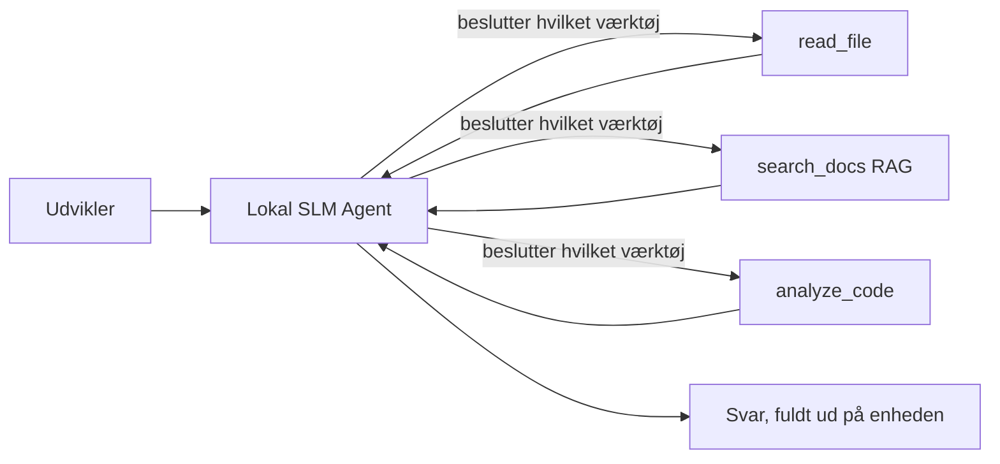
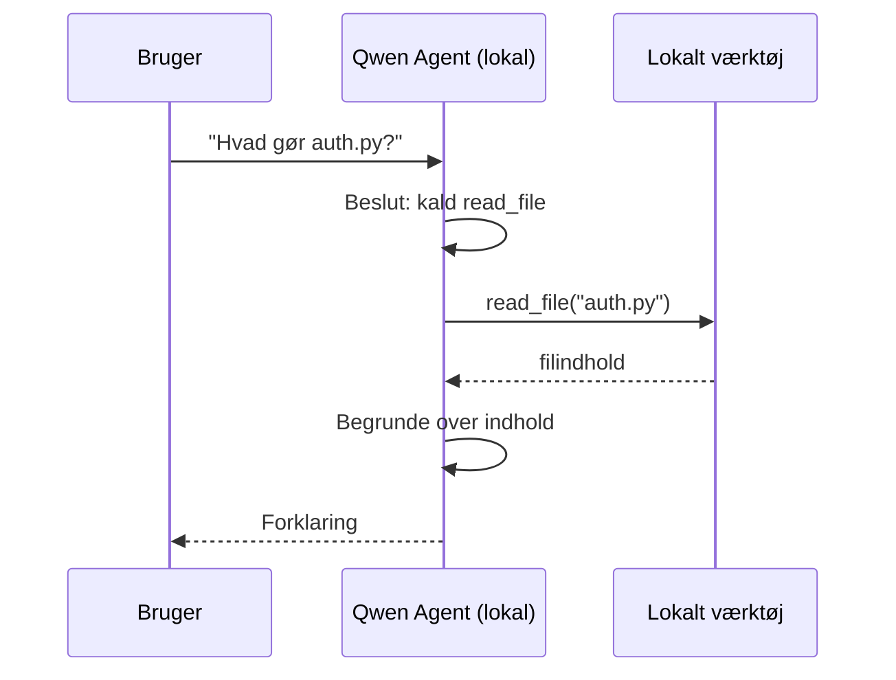
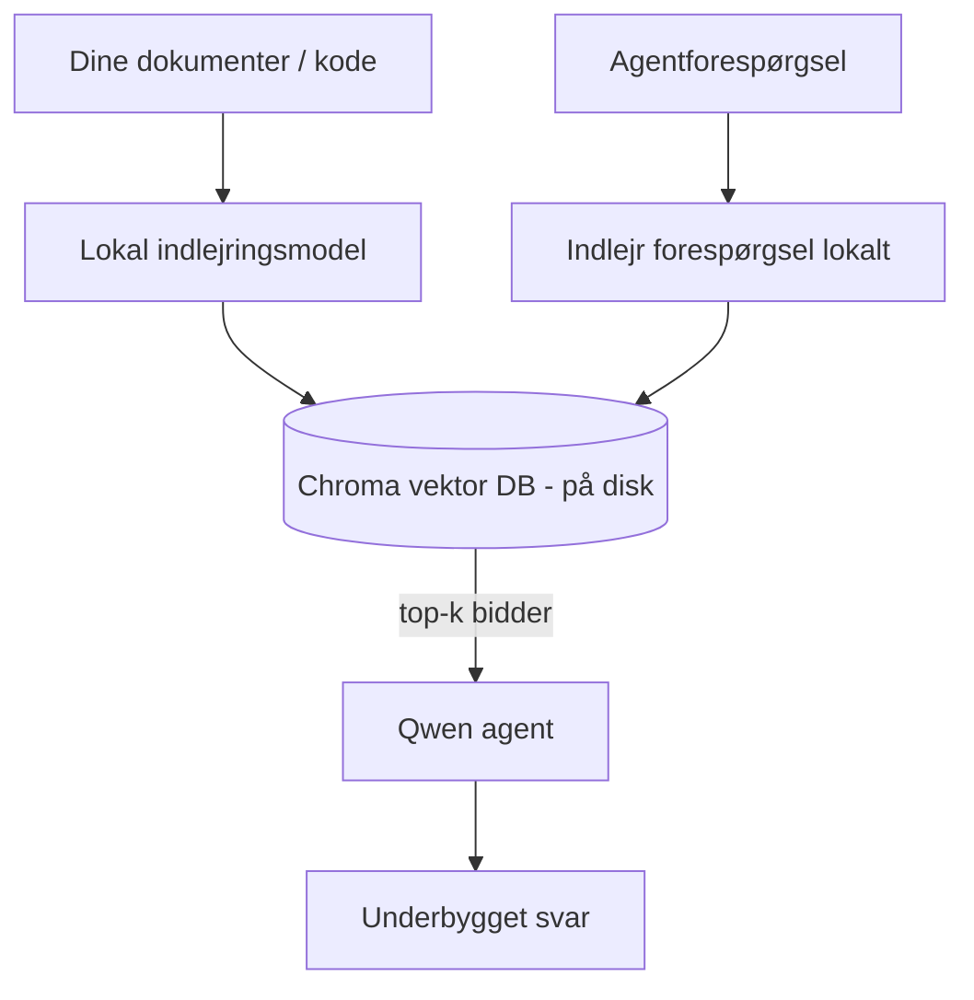
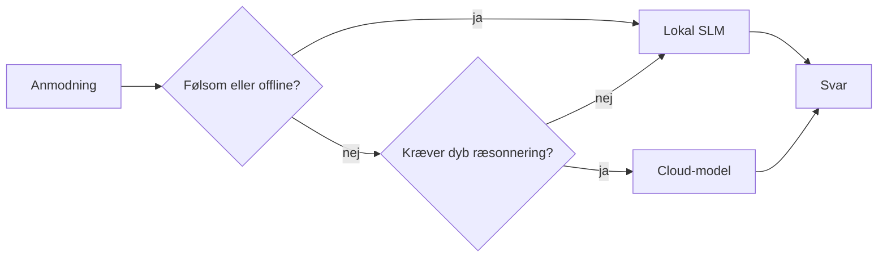

# Oprettelse af Lokale AI-agenter ved Brug af Microsoft Foundry Local og Qwen


Den forrige lektion skalerede agenter *op* til skyen. Denne bringer dem *ned* på en enkelt maskine. Når du er færdig, har du en fungerende ingeniørassistent, der resonerer, kalder værktøjer, læser dine filer og søger i din dokumentation — **uden en eneste skyinference-kald.**

Hvorfor skulle du ønske det? Tre grunde, der konstant dukker op i reelt ingeniørarbejde:

- **Privatliv.** Kode og dokumenter forlader aldrig maskinen. Ingen prompt, ingen uddrag, ingen kundedata krydser netværksgrænsen.
- **Omkostning.** Lokal inference har ingen per-token regning. Du kan iterere hele dagen til prisen af elektricitet.
- **Offline.** På et fly, i en sikker facilitet eller under en nedbrud, virker agenten stadig.

Hageringen er, at du bytter en frontlinje sky-model for en **Small Language Model (SLM)**, der kører på din CPU, GPU eller NPU. Denne lektion handler om at bygge agenter, der er *gode* inden for denne begrænsning fremfor at lade som om begrænsningen ikke eksisterer.

## Introduktion

Denne lektion vil dække:

- **Små sprogmodeller (SLMs)** — hvad de er, hvor de skinner, og hvor de ikke gør.
- **Microsoft Foundry Local** — et runtime-miljø, der downloader og leverer modeller på enheden gennem en **OpenAI-kompatibel API**.
- **Qwen funktion-kaldsmodeller** — SLMs der pålideligt producerer værktøjskald, hvilket gør lokale *agenter* (ikke kun lokal chat) mulige.
- **Lokale værktøjer, lokal RAG og lokal MCP** — der giver agenten kapacitet uden skyen.
- **Hybridmønstre** — hvornår man skal holde tingene lokale og hvornår man skal række ud mod skyen.

## Læringsmål

Efter at have gennemført denne lektion vil du vide, hvordan du:

- Forklarer kompromiserne ved SLMs og vælger passende lokale agentbrugssager.
- Serverer en Qwen-model lokalt med Foundry Local og forbinder til den via den OpenAI-kompatible endpoint.
- Bygger en værktøjskaldende agent, der kører fuldstændigt på din arbejdsstation.
- Tilføjer lokal RAG over dine egne dokumenter ved hjælp af en lokal vektordatabase (Chroma).
- Forbinder agenten til en lokal MCP-server og resonerer om hybride lokale/sky-designs.

## Forudsætninger

Denne lektion antager, at du har gennemført de tidligere lektioner og er fortrolig med:

- [Værktøjsbrug](../04-tool-use/README.md) (Lektion 4) og [Agentic RAG](../05-agentic-rag/README.md) (Lektion 5).
- [Agentic Protocols / MCP](../11-agentic-protocols/README.md) (Lektion 11).
- [Microsoft Agent Framework](../14-microsoft-agent-framework/README.md) (Lektion 14).

Du skal også bruge:

- En udviklerarbejdsstation. **8 GB RAM er et realistisk minimum**; 16 GB+ er behageligt. En GPU eller NPU hjælper, men er ikke påkrævet.
- **Microsoft Foundry Local** installeret (se opsætningsafsnittet nedenfor).
- Python 3.12+ og pakkerne i repoet [`requirements.txt`](../../../requirements.txt), plus `foundry-local-sdk`, `openai` og `chromadb` til denne lektion.

## Små sprogmodeller: Det rigtige værktøj til lokal arbejde

En frontlinje sky-model har hundredvis af milliarder parametre og et datacenter bag sig. En SLM har et par milliarder parametre og skal kunne være i din laptops RAM. Den forskel sætter klare forventninger.

**SLMs er gode til:**

- Strukturerede, afgrænsede opgaver — klassifikation, ekstraktion, opsummering af et kendt dokument.
- **Værktøjskald** — beslutning om hvilken funktion der skal kaldes og med hvilke argumenter.
- Hurtig, billig, privat iteration på dine egne data.

**SLMs er svagere til:**

- Åbne, multi-hop ræsonnementer over stort kontekst.
- Bred verdensviden (de har set mindre og glemmer mere).

Den vindende strategi for lokale agenter er derfor: **lad SLMen orkestrere, og lad værktøjerne tage det tunge løft.** Modellen behøver ikke *kende* din kodebase — den skal vide, hvornår den skal kalde `read_file` og `search_docs`. Det spiller direkte til en SLMs styrker.



## Microsoft Foundry Local

**Microsoft Foundry Local** er et letvægts runtime-miljø, der downloader, administrerer og leverer modeller helt på din maskine. Dets vigtigste funktion for os er, at det eksponerer en **OpenAI-kompatibel HTTP-endpoint** — hvilket betyder, at OpenAI SDK'et og Microsoft Agent Frameworks OpenAI-klient kan arbejde imod det med kun en ændring af `base_url`. Alt du lærte om at bygge agenter overføres direkte; kun endpoint flyttes fra skyen til `localhost`.

Foundry Local vælger også automatisk den bedste version af en model til din hardware — en CPU-version, en CUDA/GPU-version eller en NPU-version — så du ikke behøver optimere manuelt pr. maskine.

### Opsætning

Installer Foundry Local (se [dokumentationen](https://learn.microsoft.com/azure/ai-foundry/foundry-local/) for dit OS), og bekræft derefter, at det virker:

```bash
# Installer (eksempel; følg dokumentationen for din platform)
winget install Microsoft.FoundryLocal      # Windows
# brew install microsoft/foundrylocal/foundrylocal   # macOS

# Download og kør en Qwen-model, og start derefter den lokale tjeneste
foundry model run qwen2.5-7b-instruct
foundry service status
```

Når servicen kører, har du en lokal, OpenAI-kompatibel endpoint (typisk `http://localhost:PORT/v1`). Notebooken bruger `foundry-local-sdk` til automatisk at finde endpointen, så du ikke behøver at hardkode porten.

## Qwen Funktion-kald: Hvorfor Det Betyr Noget

En agent er kun en agent, hvis den kan kalde værktøjer. Mange SLMs kan chatte, men producerer upålidelige, malformed værktøjskald. **Qwen**-modeller er trænet til funktion-kald og udsender konsekvent velformede værktøjskaldstrukturer — hvilket er præcis det, der gør en lokal chatmodel til en lokal *agent*.

Flowet er den standardværktøjskaldsløkke, du allerede kender, bare kørende på enheden:



## Lokal RAG

Dokumentationssøgning er, hvor lokale agenter tjener deres værd. I stedet for at håbe på, at SLMen har memoriseret din frameworks dokumenter, indlejrer du de dokumenter i en **lokal vektordatabase** og lader agenten hente de relevante stykker efter behov.

Vi bruger **Chroma**, en indlejret vektorbutik, der kører i processen uden en server at administrere. Pipeline er helt lokal: lokal indlejringsmodel → lokale vektorer → lokal hentning → lokal SLM.



Dette er det samme Agentic RAG-mønster fra Lektion 5 — den eneste ændring er, at alle komponenter kører på din maskine.

## Lokale MCP-servere

[MCP](../11-agentic-protocols/README.md) er et transportlag, ikke en skytjeneste. En MCP-server kan køre som en lokal proces på `stdio`, og eksponerer værktøjer til din agent over den standardiserede protokol. Dette lader dig genbruge det voksende økosystem af MCP-servere — filsystemadgang, git-operationer, databaseforespørgsler — helt offline.

Sikkerhedspositionen er forskellig fra skyen, men ikke fraværende: en lokal MCP-server kører stadig med dine brugerrettigheder, så afgræns hvad den kan tilgå (et projektmappe, ikke hele din hjemmemappe) og behandle dens output som input, der skal valideres.

## Hybrid Cloud- og Lokal Mønstre

Lokal-først betyder ikke kun lokal. Modne systemer ruter efter følsomhed og sværhedsgrad:

| Situation | Hvor det kører |
| --- | --- |
| Følsom kode / data, eller offline | **Lokal SLM** |
| Simpel, afgrænset opgave | **Lokal SLM** (billigt, hurtigt) |
| Svært multi-hop ræsonnement på ikke-følsomme data | **Sky-model** |
| Alt, under en nedbrud | **Lokal SLM** (graceful degradation) |

Dette afspejler ideen om **modelruting** fra Lektion 16 — bortset fra at en af "modellerne" nu er din egen maskine. Et robust design falder tilbage til lokalt, når skyen ikke er tilgængelig, så agenten nedgraderer i kvalitet i stedet for at fejle helt.



## Hands-On Lab: En Lokal Ingeniørassistent

Åbn [`code_samples/17-local-agent-foundry-local.ipynb`](./code_samples/17-local-agent-foundry-local.ipynb) og arbejd dig igennem den. Du vil bygge en **lokal ingeniørassistent**, der kører helt på din arbejdsstation og kan:

1. **Kalder værktøjer** — via Qwen funktion-kald gennem Foundry Local.
2. **Udfører lokale filoperationer** — liste og læse filer i et projektmappe.
3. **Analyserer kode** — rapporterer grundlæggende målinger på en kildefil.
4. **Søger dokumentation** — lokal RAG over en dokumentationsmappe med Chroma.
5. **Bruger MCP** — forbinder til en lokal MCP-server (med en yndefuld spring-over, hvis ingen er konfigureret).

Der anvendes ingen skyinference på noget tidspunkt.

### Gennemgang

Assistenten forbinder til Foundry Local gennem den OpenAI-kompatible endpoint, så agentkoden ser næsten identisk ud med skyl lektionerne — kun klienten ændres:

```python
from foundry_local import FoundryLocalManager
from openai import OpenAI

# Foundry Local opdager/downloader modellen og giver os en lokal slutpunkt.
manager = FoundryLocalManager(\"qwen2.5-7b-instruct\")
client = OpenAI(base_url=manager.endpoint, api_key=manager.api_key)  # api_key er en lokal pladsholder
```

Værktøjerne er almindelige Python-funktioner scoped til et projektmappe:

```python
def read_file(path: str) -> str:
    \"\"\"Read a file, but only inside the sandboxed project directory.\"\"\"
    full = (PROJECT_ROOT / path).resolve()
    if PROJECT_ROOT not in full.parents and full != PROJECT_ROOT:
        return \"Access denied: path is outside the project directory.\"
    return full.read_text(encoding=\"utf-8\")
```

Bemærk sandbox-tjekket — selv lokalt er et værktøj, der læser vilkårlige stier, en risiko. Notebooken holder hvert værktøj scoped til en enkelt projektrod.

## Videnstest

Test din forståelse, før du går videre til opgaven.

**1. Giv to konkrete grunde til at køre en agent lokalt i stedet for i skyen.**

<details>
<summary>Svar</summary>

Enhver to af: **privatliv** (kode og data forlader aldrig maskinen), **omkostning** (ingen per-token inference-regning) og **offline kapabilitet** (virker uden netværk — på et fly, i en sikker facilitet eller under nedbrud). Regulatoriske/overholdelsesbegrænsninger, der forbyder at sende data off-device, er en almindelig drivkraft for privatlivsårsagen.
</details>

**2. Hvad er den anbefalede arbejdsdeling mellem en SLM og dens værktøjer i en lokal agent, og hvorfor?**

<details>
<summary>Svar</summary>

Lad SLMen **orkestrere** (beslutte hvilket værktøj der skal kaldes og med hvilke argumenter) og lad **værktøjerne tage det tunge løft** (læse filer, hente docs, beregne resultater). SLMs er stærke ved afgrænsede beslutninger som værktøjsvalg men svagere ved bred viden og lang multi-hop ræsonnement, så at støtte sig på værktøjer spiller til deres styrker.
</details>

**3. Hvad gør det muligt at genbruge skyagentkode med Foundry Local?**

<details>
<summary>Svar</summary>

Foundry Local eksponerer en **OpenAI-kompatibel HTTP-endpoint**. OpenAI SDK og Agent Frameworks OpenAI-klient arbejder imod den ved kun at ændre `base_url` (og bruger en lokal plads-holder API-nøgle). Alt andet ved agentkoden forbliver det samme.
</details>

**4. Hvorfor bruger vi specifikt en Qwen funktion-kaldsmodel snarere end en hvilken som helst SLM?**

<details>
<summary>Svar</summary>

Fordi en agent skal producere pålidelige, velformede **værktøjskald**. Mange SLMs kan chatte, men udsender malformed eller inkonsistente værktøjskaldsstrukturer. Qwen-modeller er trænet til funktion-kald og producerer konsekvente værktøjskald, hvilket er det, der gør en lokal chatmodel til en fungerende lokal agent.
</details>

**5. I den lokale RAG-pipeline, hvilke komponenter kører på maskinen?**

<details>
<summary>Svar</summary>

Alle komponenterne: indlejringsmodellen, vektordatabasen (Chroma, på disken), hentningstrinnet og SLMen. Dokumenter bliver indlejret lokalt, lagret lokalt, hentet lokalt og resonneret over af en lokal model — ingen komponent rører skyen.
</details>

**6. En lokal MCP-server kører på din maskine. Gør det den automatisk sikker? Hvilket forsigtighedsregler bør du stadig tage?**

<details>
<summary>Svar</summary>

Nej. En lokal MCP-server kører med dine brugerrettigheder, så den kan tilgå alt, du kan. Afgræns den til det, den har brug for (for eksempel en enkelt projektmappe fremfor hele din hjemme-mappe) og behandl dens output som input, der skal valideres, før der handles på dem.
</details>

**7. Beskriv en fornuftig hybrid rute-regel, der inkluderer en lokal model.**

<details>
<summary>Svar</summary>

Ruter følsomme eller offline anmodninger til den lokale SLM; ruter simple afgrænsede opgaver til den lokale SLM for hastighed og omkostning; ruter svær multi-hop ræsonnement på ikke-følsomme data til en sky-model; og falder tilbage til den lokale SLM, hvis skyen ikke er tilgængelig, så agenten nedgraderer yndefuldt i stedet for at fejle. Dette er modelruting (Lektion 16) med den lokale maskine som en af modellerne.
</details>

**8. Hvad er et realistisk minimum RAM-tal for at køre den lokale agent i denne lektion, og hvad giver mere RAM dig?**

<details>
<summary>Svar</summary>

Omkring **8 GB** er et realistisk minimum; 16 GB+ er behageligt. Mere RAM lader dig køre større, mere kapable modeller og holde mere kontekst i hukommelsen. En GPU eller NPU fremskynder inference men er ikke påkrævet — Foundry Local vælger en CPU-version, hvis ingen accelerator er tilgængelig.
</details>

## Opgave

Udvid den lokale ingeniørassistent til en **lokal dokumentationsanmelder** for et lille projekt efter eget valg (brug eventuelt et af dette repo's lektionsmapper).

Din aflevering skal:

1. **Indeksere en ægte docs/kode-mappe** i Chroma (mindst fem filer).
2. **Tilføje et `find_todos` værktøj**, der scanner projektet for `TODO`/`FIXME` kommentarer og returnerer dem med fil og linjenummer — med samme sandbox-tjek som `read_file`.

3. **Stil agenten tre spørgsmål**, der tvinger den til at kombinere værktøjer: ét rent RAG-spørgsmål, ét der kræver læsning af en specifik fil, og ét der kræver at finde TODOs.
4. **Mål det**: tidsmål hvert af de tre svar og noter dem i en markdown-celle. Kommenter, om latenstiden er acceptabel for din tilsigtede arbejdsgang.

Skriv derefter et kort afsnit om **hvad du ville flytte til skyen, og hvad du ville beholde lokalt** for denne anmelder, og hvorfor. Du vurderes på, om de lokale komponenter er korrekt forbundet, og om din hybride ræsonnering er solid — ikke på modelkvaliteten.

## Resumé

I denne lektion byggede du en agent, der kører helt på din egen maskine:

- **SLMs** bytter bredde ud med privatliv, omkostninger og offline-drift — og brillierer, når de **orkestrerer værktøjer** i stedet for at bære hele viden selv.
- **Foundry Local** tjener modeller på enheden bag en **OpenAI-kompatibel endpoint**, så din skykode til agenten overføres med en enkelt linje ændring.
- **Qwen function-calling modeller** muliggør pålidelige lokale værktøjskald — og dermed lokale *agenter*.
- **Lokal RAG** (Chroma) og **lokal MCP** giver agenten kapabilitet uden at forlade maskinen.
- **Hybride mønstre** lader dig dirigere efter følsomhed og sværhedsgrad, med lokalt som en yndefuld fallback.

Dette fuldender implementeringsbuen: Lektion 16 skalerede agenter op i Microsoft Foundry, og denne lektion skalerede dem ned til en enkelt arbejdsstation. Næste lektion handler om at holde implementerede agenter sikre.

## Yderligere ressourcer

- <a href="https://learn.microsoft.com/azure/ai-foundry/foundry-local/" target="_blank">Microsoft Foundry Local dokumentation</a>
- <a href="https://learn.microsoft.com/azure/ai-foundry/what-is-azure-ai-foundry" target="_blank">Microsoft Foundry dokumentation</a>
- <a href="https://learn.microsoft.com/en-us/agent-framework/overview/?wt.mc_id=youtube_26688_organicsocial_reactor&pivots=programming-language-python" target="_blank">Microsoft Agent Framework</a>
- <a href="https://qwen.readthedocs.io/en/latest/framework/function_call.html" target="_blank">Qwen function calling dokumentation</a>
- <a href="https://modelcontextprotocol.io/" target="_blank">Model Context Protocol (MCP)</a>
- <a href="https://docs.trychroma.com/" target="_blank">Chroma vektordatabase</a>

## Forrige lektion

[Deploying Scalable Agents](../16-deploying-scalable-agents/README.md)

## Næste lektion

[Securing AI Agents](../18-securing-ai-agents/README.md)

---

<!-- CO-OP TRANSLATOR DISCLAIMER START -->
**Ansvarsfraskrivelse**:
Dette dokument er blevet oversat ved hjælp af AI-oversættelsestjenesten [Co-op Translator](https://github.com/Azure/co-op-translator). Selvom vi bestræber os på nøjagtighed, skal du være opmærksom på, at automatiserede oversættelser kan indeholde fejl eller unøjagtigheder. Det originale dokument på dets oprindelige sprog bør betragtes som den autoritative kilde. For kritisk information anbefales professionel menneskelig oversættelse. Vi påtager os intet ansvar for misforståelser eller fejltolkninger, der opstår som følge af brugen af denne oversættelse.
<!-- CO-OP TRANSLATOR DISCLAIMER END -->