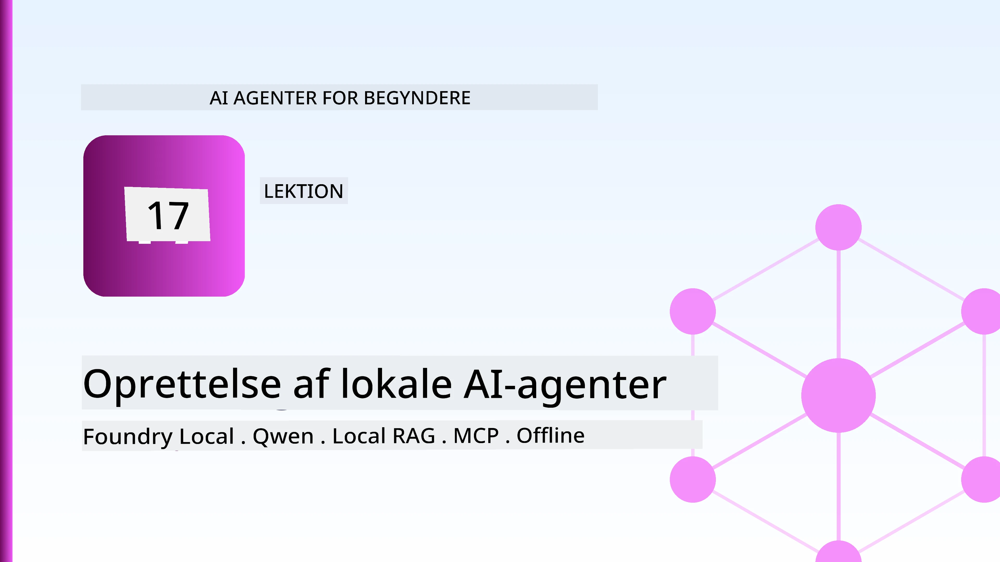
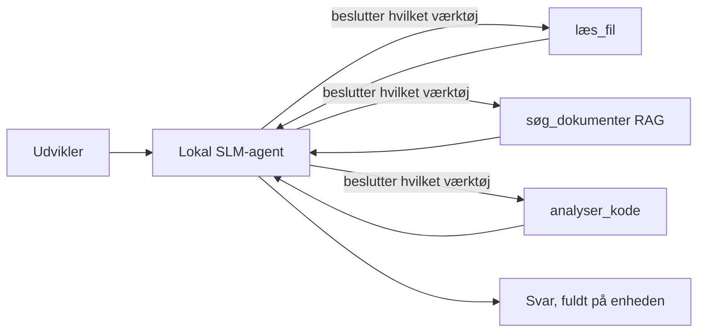
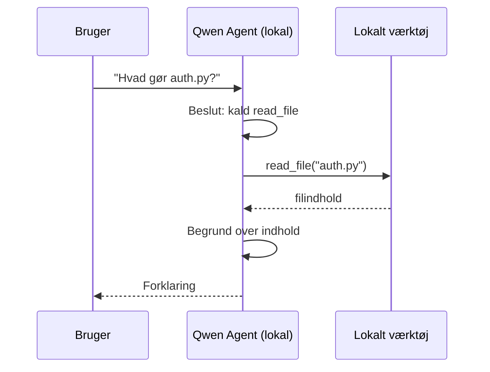
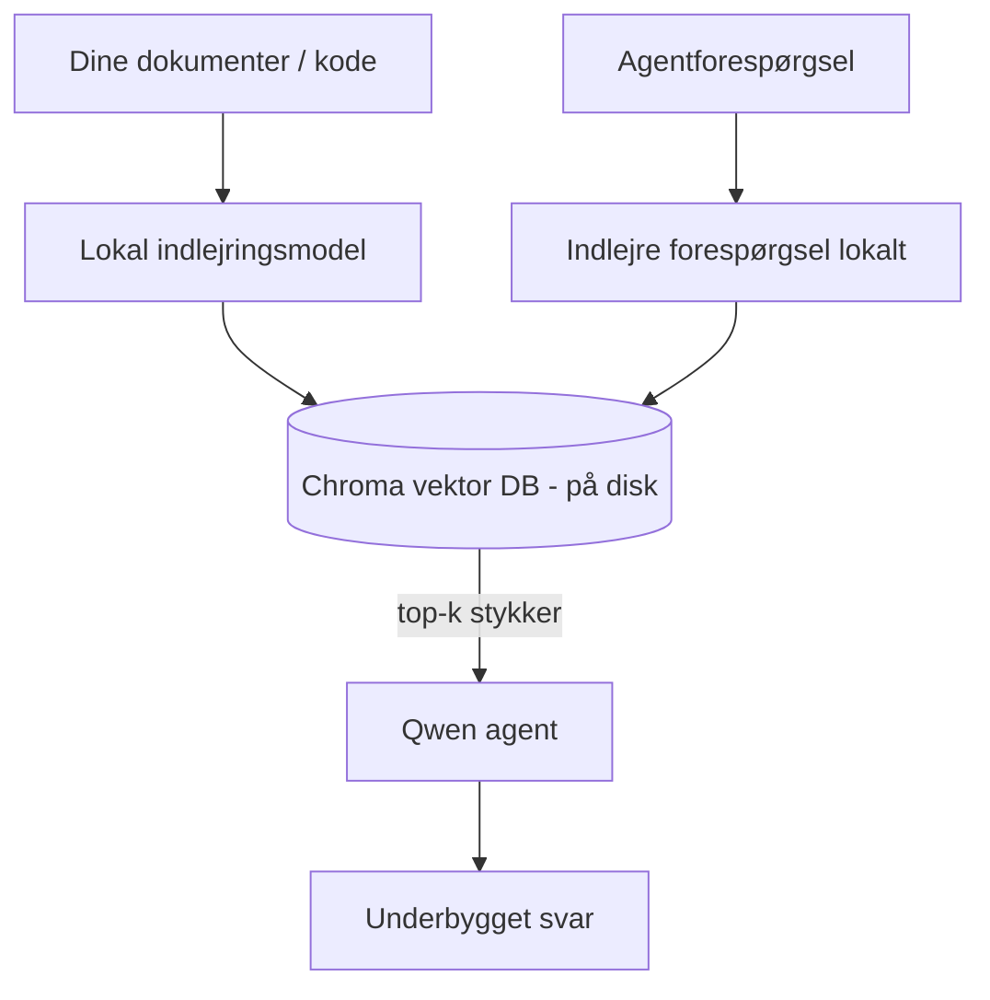
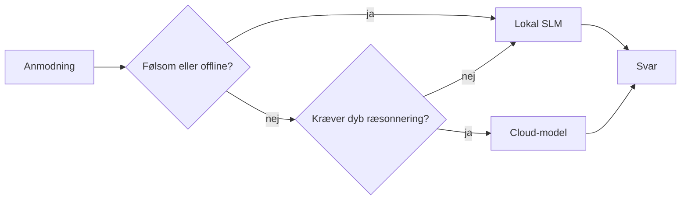

# Oprettelse af lokale AI-agenter ved hjælp af Microsoft Foundry Local og Qwen



Den foregående lektion skalerede agenter *op* til skyen. Denne bringer dem *ned* på en enkelt maskine. I slutningen vil du have en fungerende ingeniørassistent, der resonerer, kalder værktøjer, læser dine filer og søger i din dokumentation — **uden en eneste sky inference-anmodning.**

Hvorfor skulle du ønske det? Tre grunde, der ofte dukker op i reelt ingeniørarbejde:

- **Privatliv.** Koden og dokumenterne forlader aldrig maskinen. Ingen prompt, ingen uddrag, ingen kundedata krydser netværksgrænsen.
- **Omkostninger.** Lokal inference har ingen regning pr. token. Du kan iterere hele dagen for strømprisen.
- **Offline.** På et fly, i en sikker facilitet eller under et strømsvigt fungerer agenten stadig.

Fangsten er, at du bytter en kant-sky model for en **Small Language Model (SLM)**, der kører på din CPU, GPU eller NPU. Denne lektion handler om at bygge agenter, der er *gode* inden for denne begrænsning i stedet for at lade som om den ikke er der.

## Introduktion

Denne lektion vil dække:

- **Small Language Models (SLMs)** — hvad de er, hvor de skinner, og hvor de ikke gør.
- **Microsoft Foundry Local** — et runtime-miljø, der downloader og server modeller på enheden gennem en **OpenAI-kompatibel API**.
- **Qwen funktionskaldsmodeller** — SLM'er, der pålideligt producerer værktøjskald, hvilket er det, der gør lokale *agenter* (ikke kun lokal chat) muligt.
- **Lokale værktøjer, lokal RAG og lokal MCP** — giver agenten kapabilitet uden skyen.
- **Hybridmønstre** — hvornår man beholder ting lokalt, og hvornår man rækker ud til skyen.

## Læringsmål

Efter at have gennemført denne lektion vil du vide, hvordan du:

- Forklarer kompromiserne ved SLM'er og vælger passende anvendelsestilfælde for lokale agenter.
- Serverer en Qwen-model lokalt med Foundry Local og forbinder til den gennem den OpenAI-kompatible endpoint.
- Bygger en værktøjskaldende agent, der kører helt på din arbejdsstation.
- Tilføjer lokal RAG over dine egne dokumenter ved hjælp af en lokal vektordatabase (Chroma).
- Forbinder agenten til en lokal MCP-server og reflekterer over hybride lokale/sky designs.

## Forudsætninger

Denne lektion forudsætter, at du har gennemført de tidligere lektioner og er fortrolig med:

- [Brug af værktøj](../04-tool-use/README.md) (Lektion 4) og [Agentisk RAG](../05-agentic-rag/README.md) (Lektion 5).
- [Agentiske protokoller / MCP](../11-agentic-protocols/README.md) (Lektion 11).
- [Microsoft Agent Framework](../14-microsoft-agent-framework/README.md) (Lektion 14).

Du får også brug for:

- En udviklerarbejdsstation. **8 GB RAM er et realistisk minimum**; 16 GB+ er behageligt. En GPU eller NPU hjælper, men er ikke påkrævet.
- **Microsoft Foundry Local** installeret (se installationsafsnittet nedenfor).
- Python 3.12+ og pakkerne i repositoryet [`requirements.txt`](../../../requirements.txt), plus `foundry-local-sdk`, `openai` og `chromadb` til denne lektion.

## Small Language Models: Det rette værktøj til lokalt arbejde

En kant-sky model har hundredvis af milliarder parametre og et datacenter bag sig. En SLM har nogle få milliarder parametre og skal kunne passe i din laptops RAM. Den forskel sætter klare forventninger.

**SLM'er er gode til:**

- Strukturerede, afgrænsede opgaver — klassifikation, udtrækning, sammenfatning af et kendt dokument.
- **Værktøjskald** — afgørelse af, hvilken funktion der skal kaldes, og med hvilke argumenter.
- Hurtig, billig, privat iterering på dine egne data.

**SLM'er er svagere til:**

- Åben, fler-hop resonerning på tværs af stort kontekst.
- Bred verdensviden (de har set mindre og glemmer mere).

Den vindende strategi for lokale agenter er derfor: **lad SLM'en orkestrere, og lad værktøjerne gøre det tunge arbejde.** Modellen behøver ikke at *kende* din kodebase — den skal vide, hvornår den skal kalde `read_file` og `search_docs`. Det spiller direkte ind i en SLM's styrker.



## Microsoft Foundry Local

**Microsoft Foundry Local** er et letvægts-runtime-miljø, der downloader, administrerer og server modeller helt på din maskine. Dets vigtigste funktion for os er, at det eksponerer en **OpenAI-kompatibel HTTP-endpoint** — hvilket betyder, at OpenAI SDK'en og Microsoft Agent Frameworks OpenAI-klient virker mod den med kun en ændring af `base_url`. Alt hvad du har lært om at bygge agenter overføres direkte; kun endpoint flyttes fra skyen til `localhost`.

Foundry Local vælger også automatisk den bedste version af en model til dit hardware — en CPU-version, en CUDA/GPU-version eller en NPU-version — så du ikke behøver håndoptimere per maskine.

### Opsætning

Installer Foundry Local (se [dokumentationen](https://learn.microsoft.com/azure/ai-foundry/foundry-local/) for dit OS), og bekræft at det virker:

```bash
# Installer (eksempel; følg dokumentationen for din platform)
winget install Microsoft.FoundryLocal      # Windows
# brew install microsoft/foundrylocal/foundrylocal   # macOS

# Download og kør en Qwen-model, og start derefter den lokale tjeneste
foundry model run qwen2.5-7b-instruct
foundry service status
```

Når tjenesten kører, har du en lokal, OpenAI-kompatibel endpoint (typisk `http://localhost:PORT/v1`). Notebooks bruger `foundry-local-sdk` til automatisk at opdage endpointet, så du behøver ikke hardkode porten.

## Qwen Funktionskald: Hvorfor det betyder noget

En agent er kun en agent, hvis den kan kalde værktøjer. Mange SLM'er kan chatte, men producerer upålidelige, fejlbehæftede værktøjskald. **Qwen**-modeller er trænet til funktionskald og udsender konsekvent korrekt formede værktøjskaldsstrukturer — hvilket er præcis det, der gør en lokal chatmodel til en lokal *agent*.

Flowet er den standard værktøjskaldsloop, du allerede kender, bare kørende på enheden:



## Lokal RAG

Dokumentationssøgning er hvor lokale agenter virkelig viser deres værdi. I stedet for at håbe på, at SLM'en har memoriseret dine frameworks dokumentation, indlejrer du de dokumenter i en **lokal vektordatabase** og lader agenten hente de relevante uddrag efter behov.

Vi bruger **Chroma**, en indlejret vektordatabase, der kører som en proces uden behov for en separat server. Pipelinjen er helt lokal: lokal indlejringsmodel → lokale vektorer → lokal genfinding → lokal SLM.



Dette er det samme Agentiske RAG-mønster som i Lektion 5 — den eneste forskel er, at alle komponenter kører på din maskine.

## Lokale MCP-servere

[MCP](../11-agentic-protocols/README.md) er et transportlag, ikke en skytjeneste. En MCP-server kan køre som en lokal proces på `stdio`, der eksponerer værktøjer til din agent via standardprotokollen. Dette lader dig genbruge det voksende økosystem af MCP-servere — filsystemadgang, git-operationer, databaseforespørgsler — helt offline.

Sikkerhedsindstillingen er forskellig fra skyen, men ikke fraværende: en lokal MCP-server kører stadig med dine brugerrettigheder, så du skal begrænse, hvad den kan tilgå (en projektdirectory, ikke hele din hjemmemappe) og behandle dens output som inputs, der skal valideres.

## Hybride Sky-og-Lokale Mønstre

Lokalt-først betyder ikke kun-lokalt. Modne systemer ruter efter følsomhed og sværhedsgrad:

| Situation | Hvor det kører |
| --- | --- |
| Følsom kode/data eller offline | **Lokal SLM** |
| Enkel, afgrænset opgave | **Lokal SLM** (billig, hurtig) |
| Svær fler-hop-resonerning på ikke-følsomme data | **Sky-model** |
| Alt under et strømsvigt | **Lokal SLM** (graceful degradation) |

Dette spejler idéen om **modelruting** fra Lektion 16 — bortset fra at en af "modellerne" nu er din egen maskine. Et robust design falder tilbage på lokalt, når skyen er utilgængelig, så agenten degraderer i kvalitet i stedet for at fejle fuldstændigt.



## Praktisk Øvelse: En Lokal Ingeniørassistent

Åbn [`code_samples/17-local-agent-foundry-local.ipynb`](./code_samples/17-local-agent-foundry-local.ipynb) og arbejd dig igennem den. Du vil bygge en **lokal ingeniørassistent**, der kører helt på din arbejdsstation og kan:

1. **Kalde værktøjer** — via Qwen funktionskald gennem Foundry Local.
2. **Udføre lokale filhandlinger** — liste og læse filer i en projektdirectory.
3. **Analysere kode** — rapportere grundlæggende målinger på en kildefil.
4. **Søge i dokumentation** — lokal RAG over en dokumentationsmappe med Chroma.
5. **Bruge MCP** — forbinde til en lokal MCP-server (med en elegant spring-over, hvis ingen er konfigureret).

Intet sky-inference bruges på noget tidspunkt.

### Gennemgang

Assistenten forbinder til Foundry Local gennem den OpenAI-kompatible endpoint, så agentkoden ser næsten identisk ud med skylektionerne — kun klienten ændres:

```python
from foundry_local import FoundryLocalManager
from openai import OpenAI

# Foundry Local finder/downloader modellen og giver os et lokal endepunkt.
manager = FoundryLocalManager(\"qwen2.5-7b-instruct\")
client = OpenAI(base_url=manager.endpoint, api_key=manager.api_key)  # api_key er en lokal pladsholder
```

Værktøjerne er almindelige Python-funktioner scoping til en projektdirectory:

```python
def read_file(path: str) -> str:
    \"\"\"Read a file, but only inside the sandboxed project directory.\"\"\"
    full = (PROJECT_ROOT / path).resolve()
    if PROJECT_ROOT not in full.parents and full != PROJECT_ROOT:
        return \"Access denied: path is outside the project directory.\"
    return full.read_text(encoding=\"utf-8\")
```

Bemærk sandbox-checken — selv lokalt er et værktøj, der læser vilkårlige stier, en risiko. Notebooks holder hvert værktøj scoped til en enkelt projektrod.

## Videnstjek

Test din forståelse, inden du går videre til opgaven.

**1. Giv to konkrete grunde til at køre en agent lokalt i stedet for i skyen.**

<details>
<summary>Svar</summary>

Enhver to af: **privatliv** (kode og data forlader aldrig maskinen), **omkostninger** (ingen regning pr. token til inference), og **offline kapabilitet** (virker uden netværk — på et fly, i en sikker facilitet eller under et strømsvigt). Regulatoriske/overholdelsesbegrænsninger, der forbyder at sende data uden for enheden, er en almindelig drivkraft for privatlivsgrunden.
</details>

**2. Hvad er den anbefalede arbejdsdeling mellem en SLM og dens værktøjer i en lokal agent, og hvorfor?**

<details>
<summary>Svar</summary>

Lad SLM'en **orkestrere** (bestemme hvilket værktøj der skal kaldes og med hvilke argumenter) og lad **værktøjerne gøre det tunge løft** (læse filer, hente dokumenter, beregne resultater). SLM'er er stærke til afgrænsede beslutninger som værktøjsvalg, men svagere til bred viden og lang fler-hop resonerning, så at støtte sig til værktøjer spiller ind i deres styrker.
</details>

**3. Hvad gør det muligt at genbruge skyagentkode med Foundry Local?**

<details>
<summary>Svar</summary>

Foundry Local eksponerer en **OpenAI-kompatibel HTTP-endpoint**. OpenAI SDK'en og Agent Frameworks OpenAI-klient virker mod den ved kun at ændre `base_url` (og bruge en lokal pladsholder-API-nøgle). Alt andet ved agentkoden forbliver det samme.
</details>

**4. Hvorfor bruger vi specifikt en Qwen funktionskaldsmodel i stedet for en hvilken som helst SLM?**

<details>
<summary>Svar</summary>

Fordi en agent skal producere pålidelige, velformede **værktøjskald**. Mange SLM'er kan chatte, men udsender fejlformede eller inkonsistente værktøjskaldsstrukturer. Qwen-modeller er trænet til funktionskald og producerer konsekvente værktøjskald, hvilket er det, der gør en lokal chatmodel til en velfungerende lokal agent.
</details>

**5. I den lokale RAG-pipeline, hvilke komponenter kører på maskinen?**

<details>
<summary>Svar</summary>

Alle: indlejringsmodellen, vektordatabasen (Chroma, på disk), genfindingssteppet og SLM’en. Dokumenter indlejres lokalt, gemmes lokalt, hentes lokalt og resonereres over af en lokal model — ingen komponent rører skyen.
</details>

**6. En lokal MCP-server kører på din maskine. Gør det den automatisk sikker? Hvilke forholdsregler bør du stadig tage?**

<details>
<summary>Svar</summary>

Nej. En lokal MCP-server kører med dine brugerrettigheder, så den kan tilgå alt, hvad du kan. Begræns den til det, den har brug for (for eksempel en enkelt projektdirectory i stedet for hele din hjemmemappe) og behandl dens output som inputs, der skal valideres, inden du handler på dem.
</details>

**7. Beskriv en fornuftig hybrid routingregel, der inkluderer en lokal model.**

<details>
<summary>Svar</summary>

Rut følsomme eller offline forespørgsler til den lokale SLM; rut simple afgrænsede opgaver til den lokale SLM for hastighed og omkostninger; rut svær fler-hop resonnering på ikke-følsomme data til en sky-model; og fal tilbage på den lokale SLM, hvis skyen er utilgængelig, så agenten degraderer elegant i stedet for at fejle. Dette er modelruting (Lektion 16) med den lokale maskine som en af modellerne.
</details>

**8. Hvad er en realistisk minimum RAM-mængde til at køre den lokale agent i denne lektion, og hvad får du for mere RAM?**

<details>
<summary>Svar</summary>

Omtrent **8 GB** er et realistisk minimum; 16 GB+ er behageligt. Mere RAM lader dig køre større, mere kapable modeller og holde mere kontekst i hukommelsen. En GPU eller NPU fremskynder inference, men er ikke påkrævet — Foundry Local vælger en CPU-version, når ingen accelerator er tilgængelig.
</details>

## Opgave

Udvid den lokale ingeniørassistent til en **lokal dokumentationsanmelder** for et lille projekt efter eget valg (brug gerne en af lektionernes mapper i dette repo).

Din aflevering skal:

1. **Indeksere en rigtig dokumentations-/kode-mappe** i Chroma (mindst fem filer).
2. **Tilføje et `find_todos`-værktøj**, der scanner projektet for `TODO`/`FIXME` kommentarer og returnerer dem med fil og linjenummer — med samme sandbox-check som `read_file`.

3. **Stil agenten tre spørgsmål**, som tvinger den til at kombinere værktøjer: et rent RAG-spørgsmål, et der kræver læsning af en specifik fil, og et der kræver at finde TODO'er.
4. **Mål det**: tid hver af de tre svar og noter dem i en markdown-celle. Kommenter på, om ventetiden er acceptabel for din tiltænkte arbejdsgang.

Skriv derefter et kort afsnit om **hvad du ville flytte til skyen, og hvad du ville beholde lokalt** for denne anmelder, og hvorfor. Du vurderes på, om de lokale komponenter er korrekt forbundet, og om din hybride ræsonnering er solid — ikke på modelkvalitet.

## Resume

I denne lektion har du bygget en agent, der kører helt på din egen maskine:

- **SLM'er** bytter bredde for privatliv, omkostninger og offline-drift — og skinner, når de **orkestrerer værktøjer** i stedet for at bære al viden selv.
- **Foundry Local** leverer modeller på enheden bag en **OpenAI-kompatibel endpoint**, så din skyagentkode overføres med en linjes ændring.
- **Qwen funktion-opkaldsmodeller** gør pålidelige lokale værktøjsopkald — og dermed lokale *agenter* — mulige.
- **Lokal RAG** (Chroma) og **lokal MCP** giver agenten kapabilitet uden at forlade maskinen.
- **Hybride mønstre** lader dig rute efter følsomhed og sværhedsgrad, med lokal som en elegant fallback.

Dette fuldender udrulningsforløbet: Lektion 16 skalerede agenter op til Microsoft Foundry, og denne lektion skalerede dem ned på en enkelt workstation. Næste lektion omhandler at holde udrullede agenter sikre.

## Yderligere ressourcer

- <a href="https://learn.microsoft.com/azure/ai-foundry/foundry-local/" target="_blank">Microsoft Foundry Local dokumentation</a>
- <a href="https://learn.microsoft.com/azure/ai-foundry/what-is-azure-ai-foundry" target="_blank">Microsoft Foundry dokumentation</a>
- <a href="https://learn.microsoft.com/en-us/agent-framework/overview/?wt.mc_id=youtube_26688_organicsocial_reactor&pivots=programming-language-python" target="_blank">Microsoft Agent Framework</a>
- <a href="https://qwen.readthedocs.io/en/latest/framework/function_call.html" target="_blank">Qwen funktion-opkald dokumentation</a>
- <a href="https://modelcontextprotocol.io/" target="_blank">Model Context Protocol (MCP)</a>
- <a href="https://docs.trychroma.com/" target="_blank">Chroma vektordatabasen</a>

## Forrige lektion

[Deploying Scalable Agents](../16-deploying-scalable-agents/README.md)

## Næste lektion

[Securing AI Agents](../18-securing-ai-agents/README.md)

---

<!-- CO-OP TRANSLATOR DISCLAIMER START -->
**Ansvarsfraskrivelse**:
Dette dokument er blevet oversat ved hjælp af AI-oversættelsestjenesten [Co-op Translator](https://github.com/Azure/co-op-translator). Selvom vi bestræber os på nøjagtighed, skal du være opmærksom på, at automatiserede oversættelser kan indeholde fejl eller unøjagtigheder. Det originale dokument på dets oprindelige sprog bør betragtes som den autoritative kilde. For kritisk information anbefales professionel menneskelig oversættelse. Vi påtager os intet ansvar for misforståelser eller fejltolkninger, der opstår som følge af brugen af denne oversættelse.
<!-- CO-OP TRANSLATOR DISCLAIMER END -->