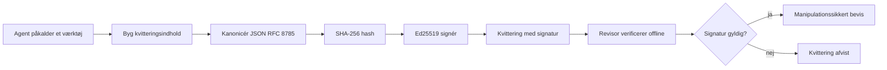
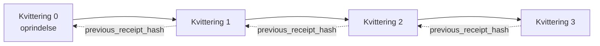

[Se lektionens video: Sikring af AI-agenter med kryptografiske kvitteringer](https://youtu.be/PLACEHOLDER_VIDEO_ID)

> _(Lektionsvideo og miniaturebillede tilføjes af Microsofts indholdsteam efter sammenfletning, i overensstemmelse med mønsteret for lektion 14 / 15.)_

# Sikring af AI-agenter med kryptografiske kvitteringer

## Introduktion

Denne lektion vil dække:

- Hvorfor revisionsspor for AI-agenter er vigtige for overholdelse, fejlfinding og tillid.
- Hvad en kryptografisk kvittering er, og hvordan den adskiller sig fra en usigneret loglinje.
- Hvordan man producerer en underskrevet kvittering for en agents værktøjskald i ren Python.
- Hvordan man verificerer en kvittering offline og opdager manipulation.
- Hvordan man kæder kvitteringer sammen, så fjernelse eller omlægning af en bryder kæden.
- Hvad kvitteringer beviser, og hvad de eksplicit ikke beviser.

## Læringsmål

Efter at have gennemført denne lektion vil du vide, hvordan du:

- Identificerer fejlsituationer, der motiverer kryptografisk proveniens for agenthandlinger.
- Producerer en Ed25519-underskrevet kvittering over et kanonisk JSON-indhold.
- Verificerer en kvittering selvstændigt ved kun at bruge underskrivers offentlige nøgle.
- Opdager manipulation ved at genkøre verificering på en modificeret kvittering.
- Bygger en hash-kædet sekvens af kvitteringer og forklarer, hvorfor kæden er vigtig.
- Genkender grænsen mellem hvad kvitteringer beviser (attribution, integritet, rækkefølge) og hvad de ikke gør (korrekthed af handlingen, soliditet af politikken).

## Problemet: Din agents revisionsspor

Forestil dig, at du har sat en AI-agent i drift for Contoso Travel. Agenten læser kundeanmodninger, kalder en fly-API for at finde muligheder og booker pladser på kundens vegne. I sidste kvartal behandlede agenten 50.000 bookinger.

I dag ankommer en revisor. De stiller et enkelt spørgsmål: "Vis mig, hvad din agent gjorde."

Du giver dine logfiler. Revisoren ser på dem og spørger det sværere spørgsmål: "Hvordan ved jeg, at disse logs ikke er redigerede?"

Dette er problemet med revisionsspor. De fleste agentimplementeringer i dag baserer sig på:

- **Applikationslogfiler**: skrevet af agenten selv, kan redigeres af enhver med adgang til filsystemet.
- **Cloud-loggingtjenester**: manipulationssikre på platformniveau, men kun hvis revisoren stoler på platformoperatøren.
- **Database-transaktionslogs**: velegnede til databaseændringer, men ikke til vilkårlige værktøjskald.

Ingen af disse kan besvare revisorens spørgsmål uden, at revisoren er nødt til at stole på nogen (dig, din cloud-udbyder, din databaseleverandør). Til intern brug er den tillid ofte acceptabel. For regulerede arbejdsbelastninger (finans, sundhedsvæsen, alt omfattet af EU’s AI-lov) er den det ikke.

Kryptografiske kvitteringer løser dette ved at gøre hver agenthandling uafhængigt verificerbar. Revisoren behøver ikke at stole på dig. De behøver kun din offentlige nøgle og selve kvitteringen.

## Hvad er en kryptografisk kvittering?

En kvittering er et JSON-objekt, der registrerer, hvad en agent gjorde, underskrevet med en digital signatur.



En minimal kvittering ser sådan ud:

```json
{
  "type": "agent.tool_call.v1",
  "agent_id": "contoso-travel-bot",
  "tool_name": "lookup_flights",
  "tool_args_hash": "sha256:a3f9c1...",
  "result_hash": "sha256:7b2e1d...",
  "policy_id": "contoso-travel-policy-v3",
  "timestamp": "2026-04-25T14:30:00Z",
  "sequence": 47,
  "previous_receipt_hash": "sha256:9d4e6a...",
  "signature": {
    "alg": "EdDSA",
    "sig": "c5af83...",
    "public_key": "8f3b2c..."
  }
}
```

Tre egenskaber udfører arbejdet:

1. **Signaturen**. Kvitteringen er underskrevet af agentens gateway med en Ed25519-privatnøgle. Enhver med den tilhørende offentlige nøgle kan verificere signaturen offline. Manipulation med ethvert felt ugyldiggør signaturen.

2. **Kanonisk kodning**. Før underskrivelse serialiseres kvitteringen med JSON Canonicalization Scheme (JCS, RFC 8785). Dette sikrer, at to implementeringer, som producerer samme logiske kvittering, producerer byte-identisk output. Uden kanonisering ville forskellige JSON-serialisatorer producere forskellige signaturer for samme indhold.

3. **Hash-kædning**. Feltet `previous_receipt_hash` linker hver kvittering til den foregående. Fjernelse eller omlægning af en kvittering bryder hver kvittering, der kom efter. Manipulation bliver synlig på kædeniveau, selv hvis individuelle signaturer omgås.

Sammen giver disse egenskaber tre garantier:

- **Attribution**: denne nøgle har underskrevet dette indhold.
- **Integritet**: indholdet har ikke ændret sig siden underskrivelse.
- **Rækkefølge**: denne kvittering kom efter den kvittering i kæden.

## Produktion af en kvittering i Python

Du behøver ikke et særligt bibliotek for at producere en kvittering. De kryptografiske primitive findes bredt, og logikken er blot nogle få dusin linjer Python.

De praktiske øvelser i `code_samples/18-signed-receipts.ipynb` gennemgår hele forløbet. Kortversionen:

```python
import json
import hashlib
import base64
from nacl import signing
from jcs import canonicalize  # RFC 8785 kanonisk JSON

def b64url_nopad(data: bytes) -> str:
    return base64.urlsafe_b64encode(data).decode("ascii").rstrip("=")

def sha256_canonical(obj) -> str:
    """SHA-256 of a Python object's JCS-canonical JSON form."""
    return f"sha256:{hashlib.sha256(canonicalize(obj)).hexdigest()}"

# Generer eller indlæs en signeringsnøgle (i produktion, gem i et nøglelager)
signing_key = signing.SigningKey.generate()
verify_key = signing_key.verify_key

# Byg kvitterings-payloaden (ingen signatur endnu)
tool_args = {"origin": "SYD", "destination": "LAX"}
tool_result = [{"flight": "QF11", "price": 1850, "stops": 0}]

payload = {
    "type": "agent.tool_call.v1",
    "agent_id": "contoso-travel-bot",
    "tool_name": "lookup_flights",
    "tool_args_hash": sha256_canonical(tool_args),
    "result_hash": sha256_canonical(tool_result),
    "policy_id": "contoso-travel-policy-v3",
    "timestamp": "2026-04-25T14:30:00Z",
    "sequence": 0,
    "previous_receipt_hash": None,
}

# Kanoniser, hash, signér.
canonical_bytes = canonicalize(payload)
message_hash = hashlib.sha256(canonical_bytes).digest()
signature_bytes = signing_key.sign(message_hash).signature

# Vedhæft et struktureret signaturobjekt.
receipt = {
    **payload,
    "signature": {
        "alg": "EdDSA",
        "sig": b64url_nopad(signature_bytes),
        "public_key": b64url_nopad(bytes(verify_key)),
    },
}
```

Det er hele underskrivningsrøret. Øvelserne i notebooken går trin for trin igennem.

## Verificering af en kvittering og opdagelse af manipulation

Verificering er den inverse operation:

```python
import base64
import hashlib
from nacl import signing
from nacl.exceptions import BadSignatureError
from jcs import canonicalize

def b64url_decode(s: str) -> bytes:
    padding = "=" * ((4 - len(s) % 4) % 4)
    return base64.urlsafe_b64decode(s + padding)

def verify_receipt(receipt: dict) -> bool:
    # Signaturen er et struktureret objekt: {"alg", "sig", "public_key"}.
    sig_obj = receipt.get("signature")
    if not sig_obj or sig_obj.get("alg") != "EdDSA":
        return False

    # Genskab payload'en, der faktisk blev underskrevet (alt undtagen signaturen).
    payload = {k: v for k, v in receipt.items() if k != "signature"}

    canonical_bytes = canonicalize(payload)
    message_hash = hashlib.sha256(canonical_bytes).digest()

    try:
        verify_key = signing.VerifyKey(b64url_decode(sig_obj["public_key"]))
        verify_key.verify(message_hash, b64url_decode(sig_obj["sig"]))
        return True
    except BadSignatureError:
        return False
```

Denne funktion tager en kvittering og returnerer `True` hvis signaturen er gyldig, `False` ellers. Intet netværkskald, ingen serviceafhængighed, ingen tillid nødvendig til tredjepart.

For at se opdagelse af manipulation i praksis vejleder notebooken i:

1. At producere en gyldig kvittering og bekræfte, at den verificeres.
2. At ændre en byte i feltet `tool_args_hash`.
3. At genkøre verificering og se den fejle.

Dette er den praktiske demonstration af, at kvitteringer er manipulationssikre: enhver ændring, hvor lille den end er, bryder signaturen.

## Kædning af kvitteringer for agenters flere trin

En enkelt underskrevet kvittering beskytter en handling. En kæde af kvitteringer beskytter en sekvens.



Hver kvittering registrerer hashen af kvitteringen før den. For at fjerne kvittering 2 uden at blive opdaget skulle en angriber enten:

- Ændre kvittering 3's `previous_receipt_hash`-felt (bryder kvittering 3's signatur), ELLER
- Falske en ny signatur på en modificeret kvittering 3 (kræver agentens private nøgle).

Hvis den private nøgle ligger i en hardware-nøgleboks, og du offentliggør den offentlige nøgle med hver kvittering, er ingen af angrebene mulige uden opdagelse.

Notebooken gennemgår:

1. At bygge en kæde af tre kvitteringer.
2. At verificere at hver kvitterings `previous_receipt_hash` matcher den faktiske hash af den forrige kvittering.
3. At manipulere én kvittering midt i kæden og se kæden bryde netop dér.

Sådan producerer du et revisionsspor, som en ekstern revisor kan verificere uden at stole på dig.

## Hvad kvitteringer beviser (og hvad de ikke gør)

Dette er det vigtigste afsnit i lektionen. Kvitteringer er stærke, men deres kraft er begrænset.

**Kvitteringer beviser tre ting:**

1. **Attribution**: en specifik nøgle har underskrevet et specifikt indhold.
2. **Integritet**: indholdet har ikke ændret sig siden underskrivelse.
3. **Rækkefølge**: denne kvittering kom efter den kvittering i hash-kæden.

**Kvitteringer beviser IKKE:**

1. **Korrekthed**: at agentens handling var den rigtige handling. En kvittering kan underskrives for et forkert svar lige så let som for et rigtigt.
2. **Politikoverholdelse**: at politikken refereret i `policy_id` rent faktisk blev evalueret, eller at den ville have tilladt handlingen, hvis den blev kontrolleret. Kvitteringen registrerer, hvad der blev hævdet, ikke hvad der blev håndhævet.
3. **Identitet ud over nøglen**: kvitteringen siger "denne nøgle underskrev dette indhold." Den siger ikke "denne person godkendte dette." Forbindelse af en nøgle til en person eller organisation kræver separat identitetsinfrastruktur (en directory, en offentlig nøgleregistre, osv.).
4. **Sandhed i input**: hvis agenten modtager en manipuleret prompt og handler på den, registrerer kvitteringen handlingen sandfærdigt. Kvitteringer kommer efter inputvalidering og er ikke en erstatning for denne.

Denne grænse er vigtig af to grunde:

- Den fortæller dig, hvad kvitteringer er nyttige til: at gøre agentadfærd reviderbar og manipulationssikker, også på tværs af organisatoriske grænser.
- Den fortæller dig, hvilke yderligere lag du stadig har brug for: inputvalidering (Lektion 6), policynhåndhævelse (kort omtalt nedenfor) og identitetsinfrastruktur (uden for denne lektions omfang).

En almindelig fejltagelse er at antage, at "vi har kvitteringer" betyder "vi er styret." Det gør de ikke. Kvitteringer er fundamentet. Styring er systemet, du bygger ovenpå.

## Produktionsreferencer

Python-koden i denne lektion er bevidst minimal, så du kan læse hver linje og forstå nøjagtigt, hvad der sker. I produktion har du to muligheder:

1. **Byg direkte på de kryptografiske primitive.** De 50 linjer ovenfor er tilstrækkelige for mange brugsscenarier. PyNaCl (Ed25519) og `jcs`-pakken (kanonisk JSON) er velvedligeholdte og reviderede biblioteker.

2. **Brug et produktionskvitteringsbibliotek.** Flere open source-projekter implementerer det samme mønster med ekstra funktioner (nøglerotation, batchverificering, JWK Set-distribution, integration med politikmotorer):
   - Kvitteringsformatet i denne lektion følger en IETF Internet-Draft (`draft-farley-acta-signed-receipts`) som er under standardiseringsproces.
   - Microsoft Agent Governance Toolkit kombinerer kvitteringer med Cedar-baserede politikbeslutninger; se Tutorial 33 i det repository for et komplet eksempel.
   - Pakkerne `protect-mcp` (npm) og `@veritasacta/verify` (npm) tilbyder en Node-baseret implementering af kvitteringssignering og offline-verificering, beregnet til at pakke enhver MCP-server med et manipulationssikkert revisionsspor.
   - **[nobulex](https://github.com/arian-gogani/nobulex)** Python SDK (`pip install nobulex`) tilbyder samme Ed25519 + JCS underskrivningsmønster i Python med integration til LangChain og CrewAI, inklusiv offentliggjorte krydsvalideringstestvektorer og et overholdelseskort bidraget via [OWASP PR #2210](https://github.com/OWASP/CheatSheetSeries/pull/2210).

Valget mellem at kode selv og bruge et bibliotek svarer til valget mellem at skrive sit eget JWT-bibliotek og bruge et testet: begge er rimelige; biblioteket sparer tid og mindsker revisionsfladen; selvskrevet tvinger dig til at forstå hver primitive. Denne lektion lærer selvskrevet vejen, så du har grundlaget for begge valg.

## Videnstest

Test din forståelse inden du går videre til øvelsen.

**1. En kvittering er underskrevet med agentens private Ed25519-nøgle. Revisor har kun den offentlige nøgle. Kan revisor verificere kvitteringen offline?**

<details>
<summary>Svar</summary>

Ja. Ed25519-verificering kræver kun den offentlige nøgle og de underskrevne bytes. Intet netværkskald, ingen serviceafhængighed. Dette er egenskaben, der gør kvitteringer nyttige i luftgap, multi-organisation eller lavtillidsrevisionsmiljøer.
</details>

**2. En angriber ændrer `policy_id`-feltet i en kvittering for at hævde, at den blev styret af en mere lempelig politik. Signaturen dækkede den oprindelige payload. Hvad sker ved verificering?**

<details>
<summary>Svar</summary>

Verificeringen fejler. Signaturen blev udregnet over de kanoniske bytes af den oprindelige payload; ændring af et hvilket som helst felt ændrer de kanoniske bytes, som ændrer SHA-256 hashen, hvilket gør signaturen ugyldig. Angriberen skulle have den private nøgle for at producere en ny gyldig signatur, hvilket de ikke har.
</details>

**3. Hvorfor indeholder kvitteringen en `tool_args_hash` og en `result_hash` i stedet for de rå argumenter og resultater?**

<details>
<summary>Svar</summary>

To grunde. Først kan kvitteringen skulle arkiveres eller overføres i omgivelser, hvor lækage af rå indhold (personlige data, forretningsdata) er problematisk. Hashing holder kvitteringen lille og indholdet privat; revisor verificerer, at hashen matcher en separat lagret kopi af det faktiske indhold. For det andet har hashes en fast størrelse; en kvittering med hashes er størrelsesmæssigt afgrænset uanset, hvor store input og output var.
</details>

**4. Feltet `previous_receipt_hash` linker hver kvittering til sin forgænger. Hvis en angriber stille sletter en kvittering midt i en kæde, hvad bliver ugyldigt?**

<details>
<summary>Svar</summary>

Hver kvittering, der kom efter den slettede. Deres `previous_receipt_hash` matcher ikke længere den faktiske kæde (fordi kvitteringen, de refererede til, ikke længere findes, eller kæden nu peger på en anden forgænger). For at skjule sletningen skulle angriberen genunderskrive hver efterfølgende kvittering, hvilket kræver den private nøgle.
</details>

**5. En kvittering verificeres korrekt. Beviser det, at agentens handling var korrekt, solid eller i overensstemmelse med politik?**

<details>
<summary>Svar</summary>

Nej. En gyldig kvittering beviser tre ting: attribution (denne nøgle underskrev dette indhold), integritet (indholdet har ikke ændret sig), og rækkefølge (denne kvittering kom efter den anden). Den beviser IKKE, at handlingen var korrekt, at politikken angivet i `policy_id` rent faktisk blev evalueret, eller at agenten fulgte alle regler. Kvitteringer gør agentadfærd reviderbar, ikke nødvendigvis korrekt. Dette er den vigtigste grænse i lektionen.
</details>

## Praktisk øvelse

Åbn `code_samples/18-signed-receipts.ipynb` og gennemfør alle fire sektioner:

1. **Sektion 1**: Underskriv din første kvittering og verificer den.
2. **Sektion 2**: Manipuler kvitteringen og observer verificeringen fejler.
3. **Sektion 3**: Byg en kæde af tre kvitteringer og verificer kædens integritet.
4. **Sektion 4**: Anvend mønsteret på en agent bygget med Microsoft Agent Framework: pak et værktøjskald ind i kvitteringssignering, og verificer kvitteringen selvstændigt.
**Stretch udfordring 1:** udvid kvitteringsskemaet med et ekstra felt efter eget valg (for eksempel en anmodnings-ID til sporing), opdater den kanoniske signeringslogik til at inkludere det, og bekræft at kvitteringen stadig kan gennemføres gennem verifikation. Ændr derefter feltet efter signering og bekræft at verifikationen fejler. Dette tvinger dig til at forstå, hvordan hver byte af den kanoniske kodning bidrager til signaturen.

**Stretch udfordring 2:** SHA-256-hash to af dine kvitteringer sammen (kæd deres kanoniske bytes sammen i en deterministisk rækkefølge) og indlejre det resulterende digest som et nyt felt på en tredje kvittering før signeringen. Bekræft at alle tre kvitteringer stadig kan gennemføres. Du har netop bygget et inklusionsbevis i ét trin: enhver, der har den tredje kvittering, kan bevise, at de to første eksisterede på det tidspunkt, den blev signeret, uden at afsløre deres indhold. Dette er det mønster, som selective-disclosure kvitteringer bruger i stor skala (Merkle-committments, RFC 6962).

## Konklusion

Kryptografiske kvitteringer giver AI-agenter en revisionssti, der er:

- **Uafhængigt verificerbar**: enhver part med den offentlige nøgle kan verificere, ingen serviceafhængighed.
- **Manipulationssynlig**: enhver ændring ugyldiggør signaturen.
- **Bærbar**: en kvittering er en lille JSON-fil; den kan arkiveres, overføres og verificeres hvor som helst.
- **Standardtilpasset**: bygget på Ed25519 (RFC 8032), JCS (RFC 8785) og SHA-256, alle bredt udbredte primitive.

De er ikke en erstatning for inputvalidering, politikhåndhævelse eller identitetsinfrastruktur. De er fundamentet for disse lag. Når du implementerer agenter i regulerede arbejdsbelastninger, arbejdsflow med flere organisationer eller i enhver sammenhæng, hvor en fremtidig revisor ikke kan antages at have tillid til dig, er kvitteringer den måde, hvorpå du sikrer en ærlig revisionssti.

Den vigtigste pointe: kvitteringer beviser, hvem der sagde hvad, hvornår. De beviser ikke, at det sagde var sandt eller korrekt. Hold denne sondring skarpt. Det er forskellen mellem et ærligt oprindelsessystem og et misvisende.

## Produktionscheckliste

Når du er klar til at gå videre fra denne lektion til at implementere kvitteringssignerede agenter i et reelt miljø:

- [ ] **Flyt signeringsnøglen væk fra udviklerens laptop.** Brug Azure Key Vault, AWS KMS eller en hardware security module. Den private nøgle, der signerer dine kvitteringer, må aldrig findes i versionsstyring eller i klartekst på applikationsmaskiner.
- [ ] **Offentliggør den offentlige verifikationsnøgle.** Revisorer har brug for den til offline verifikation. Standardmønsteret er et JWK-sæt på en velkendt URL (RFC 7517), f.eks. `https://your-org.example.com/.well-known/agent-keys.json`.
- [ ] **Anker kæden eksternt.** Skriv periodisk den seneste kædehoved-hash til en transparenslog (Sigstore Rekor, RFC 3161 tidsstempelautoritet eller et sekundært internt system), så en ekstern part kan bekræfte "denne kæde eksisterede på dette tidspunkt."
- [ ] **Gem kvitteringer uforanderligt.** Append-only blob storage (Azure Storage med immutabilitetspolitikker, AWS S3 Object Lock) forhindrer en insider i at omskrive historien på lagringslaget.
- [ ] **Beslut om retention.** Mange compliance-regimer kræver flerårig opbevaring. Planlæg for kvitteringsvækst (hver kvittering er ~500 bytes; en agent, der laver 10K kald per dag, producerer ~1,8 GB om året).
- [ ] **Dokumenter hvad kvitteringer ikke dækker.** Kvitteringer beviser attribution, integritet og rækkefølge. Din runbook bør eksplicit liste, hvilke yderligere kontrolforanstaltninger (inputvalidering, politikhåndhævelse, ratebegrænsning, identitetsinfrastruktur) der ligger sammen med kvitteringer i din styringsholdning.

### Har du flere spørgsmål om sikring af AI-agenter?

Deltag i [Microsoft Foundry Discord](https://aka.ms/ai-agents/discord) for at møde andre elever, deltage i kontortid og få svar på dine AI Agent-spørgsmål.

## Udover denne lektion

Denne lektion dækker enkeltkvitteringssignering og hash-kædede sekvenser. De samme primitive komponenter sammensætter flere mere avancerede mønstre, som du kan støde på, efterhånden som din styringsholdning modnes:

- **Selective disclosure.** Når et kvitterings felter er uafhængigt forpligtet (RFC 6962-stil Merkle-træ), kan du afsløre specifikke felter til specifikke revisorer og bevise, at resten er uændret uden at eksponere dem. Nyttigt når den samme kvittering skal opfylde både en omfattende revision (der ønsker fuldstændighed) og dataminimeringsregulativer som GDPR (der ønsker, at revisor kun ser så lidt som nødvendigt).
- **Kvitteringsinvalidering.** Hvis en signeringsnøgle kompromitteres, har du brug for en måde til at markere alle kvitteringer signeret med den nøgle som utroværdige fra et bestemt tidspunkt fremadrettet. Standardmønstre: kortvarige signeringsnøgler plus en offentliggjort invalideringsliste, eller en transparenslog med invalideringsposter.
- **Bilaterale / split-signatur kvitteringer.** Nogle implementeringer opdeler den signerede payload i pre-eksekvering (`authorization_*`) og post-eksekvering (`result_*`) halvdele med uafhængige signaturer, nyttigt når autorisationsbeslutningen og det observerede resultat produceres af forskellige aktører eller på forskellige tidspunkter. Dette bygger additivt oven på kvitteringsformatet, som er lært i denne lektion.
- **Payloadsammensætning.** En kvittering forsegler de bytes, du lægger i `result_hash`. Virkelige payloads er ofte rigere end et enkelt værktøjskalds resultat: præ-beslutningsræsonnement (modelprediktion, overvejede muligheder, bevis og dets fuldstændighed, risikoposition, ansvarskæde, portresultat) kan alle bo inden i payloaden, forseglet af en enkelt kvittering. Dette holder kvitteringsformatet minimalt, mens payloadskemaer kan udvikle sig domæne-for-domæne.
- **Konformitet på tværs af implementeringer.** Flere uafhængige implementeringer af det samme kvitteringsformat (Python, TypeScript, Rust, Go) verificerer hinanden mod delte testvektorer. Hvis du bygger din egen implementering, bekræfter validering mod offentliggjorte vektorer trådkonformitet.
- **Post-kvante migration.** Ed25519 er bredt udbredt i dag, men er ikke kvantesikker. Kvitteringsformatet er algoritme-agilt: feltet `signature.alg` kan indeholde `ML-DSA-65` (NIST post-kvante signaturstandard), når du skal migrere. Planlæg en overgangsperiode, hvor kvitteringer er dobbelt-signeret.

## Yderligere ressourcer

- <a href="https://datatracker.ietf.org/doc/draft-farley-acta-signed-receipts/" target="_blank">IETF Internet-Draft: Signed Decision Receipts for Machine-to-Machine Access Control</a>
- <a href="https://learn.microsoft.com/azure/ai-studio/responsible-use-of-ai-overview" target="_blank">Ansvarlig AI oversigt (Azure AI)</a>
- <a href="https://datatracker.ietf.org/doc/html/rfc8032" target="_blank">RFC 8032: Edwards-Curve Digital Signature Algorithm (EdDSA)</a>
- <a href="https://datatracker.ietf.org/doc/html/rfc8785" target="_blank">RFC 8785: JSON Canonicalization Scheme (JCS)</a>
- <a href="https://datatracker.ietf.org/doc/html/rfc6962" target="_blank">RFC 6962: Certificate Transparency</a> (Merkle-træ konstruktion brugt af selective-disclosure kvitteringer)
- <a href="https://github.com/microsoft/agent-governance-toolkit/blob/main/docs/tutorials/33-offline-verifiable-receipts.md" target="_blank">Microsoft Agent Governance Toolkit, Tutorial 33: Offline-Verifiable Decision Receipts</a>
- <a href="https://github.com/ScopeBlind/agent-governance-testvectors" target="_blank">Cross-implementation conformance testvektorer</a> for det kvitteringsformat, der bruges i denne lektion (Apache-2.0)
- <a href="https://pynacl.readthedocs.io/" target="_blank">PyNaCl dokumentation</a> (Ed25519 i Python)

## Forrige lektion

[Building Computer Use Agents (CUA)](../15-browser-use/README.md)

## Næste lektion

_(Bestemmes af studieordningsvedligeholdere)_

---

<!-- CO-OP TRANSLATOR DISCLAIMER START -->
**Ansvarsfraskrivelse**:
Dette dokument er blevet oversat ved hjælp af AI-oversættelsestjenesten [Co-op Translator](https://github.com/Azure/co-op-translator). Selvom vi bestræber os på nøjagtighed, skal du være opmærksom på, at automatiserede oversættelser kan indeholde fejl eller unøjagtigheder. Det originale dokument på dets oprindelige sprog bør betragtes som den autoritative kilde. For kritisk information anbefales professionel menneskelig oversættelse. Vi påtager os intet ansvar for misforståelser eller fejltolkninger, der opstår som følge af brugen af denne oversættelse.
<!-- CO-OP TRANSLATOR DISCLAIMER END -->