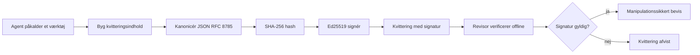
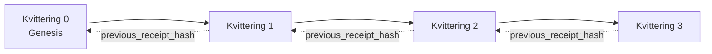

[Se lektionens video: Sikring af AI-agenter med kryptografiske kvitteringer](https://youtu.be/PLACEHOLDER_VIDEO_ID)

> _(Lektionsvideo og miniaturebillede tilføjes af Microsofts indholdsteam efter sammensmeltning, der matcher lektion 14/15-mønsteret.)_

# Sikring af AI-agenter med kryptografiske kvitteringer

## Introduktion

Denne lektion vil dække:

- Hvorfor revisionsspor for AI-agenter betyder noget for overholdelse, fejlfinding og tillid.
- Hvad en kryptografisk kvittering er, og hvordan den adskiller sig fra en usigneret loglinje.
- Hvordan man producerer en signeret kvittering for et agents værktøjskald i almindelig Python.
- Hvordan man verificerer en kvittering offline og opdager manipulation.
- Hvordan man kæder kvitteringer, så fjernelse eller omordning af en bryder kæden.
- Hvad kvitteringer beviser, og hvad de eksplicit ikke beviser.

## Læringsmål

Efter at have gennemført denne lektion vil du vide, hvordan du:

- Identificerer fejlsituationer, der motiverer kryptografisk proveniens for agenthandlinger.
- Producerer en Ed25519-signeret kvittering over en kanonisk JSON-pakke.
- Verificerer en kvittering uafhængigt ved kun at bruge signaturens offentlige nøgle.
- Opdager manipulation ved at gentage verifikationen på en ændret kvittering.
- Bygger en hash-kædet sekvens af kvitteringer og forklarer, hvorfor kæden betyder noget.
- Genkender grænsen mellem hvad kvitteringer beviser (tilskrivning, integritet, rækkefølge) og hvad de ikke beviser (korrekthed af handlingen, gyldigheden af politikken).

## Problemet: Dit agents revisionsspor

Forestil dig, at du har implementeret en AI-agent til Contoso Travel. Agenten læser kundebestillinger, kalder en fly-API for at finde muligheder og booker pladser på kundens vegne. I sidste kvartal behandlede agenten 50.000 bookinger.

I dag ankommer en revisor. De stiller et enkelt spørgsmål: "Vis mig, hvad din agent gjorde."

Du giver dine logfiler. Revisoren ser på dem og stiller det sværere spørgsmål: "Hvordan ved jeg, at disse logs ikke er redigerede?"

Dette er revisionsspor-problemet. De fleste agent-implementeringer i dag er afhængige af:

- **Applikationslogs**: skrevet af agenten selv, redigerbare af alle med filsystemadgang.
- **Cloud-loggingtjenester**: manipulationssynlige på platformniveau, men kun hvis revisoren stoler på platformoperatøren.
- **Database-transaktionslogs**: velegnede til databaseændringer, men ikke til vilkårlige værktøjskald.

Ingen af disse kan besvare revisors spørgsmål uden at kræve, at revisor stoler på nogen (dig, din cloud-udbyder, din databaseleverandør). Til internt brug er den tillid ofte acceptabel. For regulerede arbejdsmængder (finans, sundhedsvæsen, alt underlagt EU's AI-lovgivning) er det ikke.

Kryptografiske kvitteringer løser dette ved at gøre hver agenthandling uafhængigt verificerbar. Revisor behøver ikke at stole på dig. De behøver kun din offentlige nøgle og selve kvitteringen.

## Hvad er en kryptografisk kvittering?

En kvittering er et JSON-objekt, der registrerer, hvad en agent gjorde, signeret med en digital signatur.



En minimal kvittering ser sådan ud:

```json
{
  "type": "agent.tool_call.v1",
  "agent_id": "contoso-travel-bot",
  "tool_name": "lookup_flights",
  "tool_args_hash": "sha256:a3f9c1...",
  "result_hash": "sha256:7b2e1d...",
  "policy_id": "contoso-travel-policy-v3",
  "timestamp": "2026-04-25T14:30:00Z",
  "sequence": 47,
  "previous_receipt_hash": "sha256:9d4e6a...",
  "signature": {
    "alg": "EdDSA",
    "sig": "c5af83...",
    "public_key": "8f3b2c..."
  }
}
```

Tre egenskaber gør arbejdet:

1. **Signaturen**. Kvitteringen signeres af agentens gateway ved hjælp af en Ed25519-privatnøgle. Enhver med den tilhørende offentlige nøgle kan verificere signaturen offline. Manipulation af et hvilket som helst felt ugyldiggør signaturen.

2. **Kanonisk kodning**. Før signering serialiseres kvitteringen ved hjælp af JSON Canonicalization Scheme (JCS, RFC 8785). Dette sikrer, at to implementeringer, der producerer den samme logiske kvittering, genererer byte-identisk output. Uden kanonisering ville forskellige JSON-serialisatorer producere forskellige signaturer for det samme indhold.

3. **Hashkædning**. Feltet `previous_receipt_hash` forbinder hver kvittering til den forrige. Fjernelse eller omordning af en kvittering bryder alle kvitteringer, der kom efter den. Manipulation bliver synlig på kædeniveau, selv hvis individuelle signaturer omgås.

Sammen giver disse egenskaber tre garantier:

- **Tilskrivning**: denne nøgle har signeret dette indhold.
- **Integritet**: indholdet har ikke ændret sig siden signering.
- **Rækkefølge**: denne kvittering kom efter den kvittering i kæden.

## Produktion af en kvittering i Python

Du behøver ikke et specielt bibliotek for at producere en kvittering. De kryptografiske primitiva er bredt tilgængelige, og logikken er få dusin linjer Python.

De praktiske øvelser i `code_samples/18-signed-receipts.ipynb` gennemgår hele flowet. Resuméversionen:

```python
import json
import hashlib
import base64
from nacl import signing
from jcs import canonicalize  # RFC 8785 kanonisk JSON

def b64url_nopad(data: bytes) -> str:
    return base64.urlsafe_b64encode(data).decode("ascii").rstrip("=")

def sha256_canonical(obj) -> str:
    """SHA-256 of a Python object's JCS-canonical JSON form."""
    return f"sha256:{hashlib.sha256(canonicalize(obj)).hexdigest()}"

# Generer eller indlæs en signeringsnøgle (i produktion, opbevar i en nøgleboks)
signing_key = signing.SigningKey.generate()
verify_key = signing_key.verify_key

# Byg kvitteringsindholdet (ingen underskrift endnu)
tool_args = {"origin": "SYD", "destination": "LAX"}
tool_result = [{"flight": "QF11", "price": 1850, "stops": 0}]

payload = {
    "type": "agent.tool_call.v1",
    "agent_id": "contoso-travel-bot",
    "tool_name": "lookup_flights",
    "tool_args_hash": sha256_canonical(tool_args),
    "result_hash": sha256_canonical(tool_result),
    "policy_id": "contoso-travel-policy-v3",
    "timestamp": "2026-04-25T14:30:00Z",
    "sequence": 0,
    "previous_receipt_hash": None,
}

# Kanonisér, hash, underskriv.
canonical_bytes = canonicalize(payload)
message_hash = hashlib.sha256(canonical_bytes).digest()
signature_bytes = signing_key.sign(message_hash).signature

# Vedhæft et struktureret signeringsobjekt.
receipt = {
    **payload,
    "signature": {
        "alg": "EdDSA",
        "sig": b64url_nopad(signature_bytes),
        "public_key": b64url_nopad(bytes(verify_key)),
    },
}
```

Det er hele signaturpipeline. Øvelserne i notebooken går igennem hvert trin.

## Verificering af en kvittering og opdage manipulation

Verificering er den inverse operation:

```python
import base64
import hashlib
from nacl import signing
from nacl.exceptions import BadSignatureError
from jcs import canonicalize

def b64url_decode(s: str) -> bytes:
    padding = "=" * ((4 - len(s) % 4) % 4)
    return base64.urlsafe_b64decode(s + padding)

def verify_receipt(receipt: dict) -> bool:
    # Signaturen er et struktureret objekt: {"alg", "sig", "public_key"}.
    sig_obj = receipt.get("signature")
    if not sig_obj or sig_obj.get("alg") != "EdDSA":
        return False

    # Genskab den nyttelast, der faktisk blev signeret (alt undtagen signaturen).
    payload = {k: v for k, v in receipt.items() if k != "signature"}

    canonical_bytes = canonicalize(payload)
    message_hash = hashlib.sha256(canonical_bytes).digest()

    try:
        verify_key = signing.VerifyKey(b64url_decode(sig_obj["public_key"]))
        verify_key.verify(message_hash, b64url_decode(sig_obj["sig"]))
        return True
    except BadSignatureError:
        return False
```

Denne funktion tager en kvittering og returnerer `True`, hvis signaturen er gyldig, `False` ellers. Ingen netværkskald, ingen tjenesteafhængighed, ingen tillid nødvendig til nogen tredjepart.

For at se manipulation opdages i praksis, gennemgår notebooken:

1. Produktion af en gyldig kvittering og bekræftelse af at den verificeres.
2. Ændring af et enkelt byte i feltet `tool_args_hash`.
3. Gentagelse af verifikation og observering af fejlslag.

Dette er den praktiske demonstration af, at kvitteringer er manipulationssynlige: enhver ændring, uanset hvor lille, bryder signaturen.

## Kædning af kvitteringer for flerstegs-agenter

En enkelt signeret kvittering beskytter en handling. En kæde af kvitteringer beskytter en sekvens.



Hver kvittering registrerer hashen af den forrige kvittering. For at fjerne kvittering 2 uden at blive opdaget, skal en angriber enten:

- Ændre feltet `previous_receipt_hash` i kvittering 3 (bryder signaturen på kvittering 3), ELLER
- Forfalske en ny signatur på en ændret kvittering 3 (kræver agentens private nøgle).

Hvis den private nøgle er i et hardware-nøglerum, og du offentliggør den offentlige nøgle med hver kvittering, er ingen af angrebene mulige uden opdagelse.

Notebooken gennemgår:

1. Opbygning af en kæde på tre kvitteringer.
2. Verifikation af, at hver kvitterings `previous_receipt_hash` matcher den faktiske hash af den foregående kvittering.
3. Manipulation af en kvittering midt i kæden og observation af at kæden bryder præcis der.

Sådan producerer du et revisionsspor, som en ekstern revisor kan verificere uden at stole på dig.

## Hvad kvitteringer beviser (og hvad de ikke gør)

Dette er det vigtigste afsnit i denne lektion. Kvitteringer er kraftfulde, men deres kraft er begrænset.

**Kvitteringer beviser tre ting:**

1. **Tilskrivning**: en specifik nøgle har signeret en specifik pakke.
2. **Integritet**: pakken har ikke ændret sig siden signering.
3. **Rækkefølge**: denne kvittering kom efter den kvittering i hashkæden.

**Kvitteringer beviser IKKE:**

1. **Korrekthed**: at agentens handling var den rigtige handling. En kvittering kan signeres for et forkert svar lige så let som for et rigtigt svar.
2. **Politikoverholdelse**: at den politik, som refereres i `policy_id`, faktisk blev evalueret, eller at den ville have tilladt denne handling, hvis kontrolleret. Kvitteringen registrerer, hvad der blev hævdet, ikke hvad der blev håndhævet.
3. **Identitet ud over nøglen**: kvitteringen siger "denne nøgle har signeret dette indhold." Den siger ikke "denne person har godkendt dette." At forbinde en nøgle til en person eller organisation kræver separat identitetsinfrastruktur (et katalog, et register over offentlige nøgler osv.).
4. **Sandhed i inputs**: hvis agenten modtager en manipuleret prompt og handler på den, registrerer kvitteringen handlingen troværdigt. Kvitteringer er downstream for inputvalidering, ikke en erstatning derfor.

Denne grænse betyder noget af to grunde:

- Den fortæller dig, hvad kvitteringer er nyttige til: at gøre agentadfærd auditerbar og manipulationssynlig, også på tværs af organisatoriske grænser.
- Den fortæller dig, hvilke yderligere lag du stadig har brug for: inputvalidering (Lektion 6), håndhævelse af politikker (kort omtalt nedenfor) og identitetsinfrastruktur (uden for denne lektions omfang).

En almindelig fejltagelse er at antage, at "vi har kvitteringer" betyder "vi er underlagt styring." Det gør det ikke. Kvitteringer er fundamentet. Styring er systemet, du bygger ovenpå.

## Produktionsreferencer

Python-koden i denne lektion er bevidst minimal, så du kan læse hver linje og forstå præcis, hvad der foregår. I produktion har du to muligheder:

1. **Byg direkte på de kryptografiske primitiva.** De 50 linjer, du så ovenfor, er tilstrækkelige til mange anvendelser. PyNaCl (Ed25519) og pakken `jcs` (kanonisk JSON) er velvedligeholdte og auditerede biblioteker.

2. **Brug et produktionsbibliotek til kvitteringer.** Flere open source-projekter implementerer samme mønster med ekstra funktioner (nøgleudskiftning, batchverifikation, JWK Set-distribution, integration med politikmotorer):
   - Kvitteringsformatet brugt i denne lektion følger et IETF Internet-Draft (`draft-farley-acta-signed-receipts`), som er under standardiseringsprocessen.
   - Microsoft Agent Governance Toolkit sammensætter kvitteringer med Cedar-baserede politiske beslutninger; se Tutorial 33 i den repository for et eksempel fra ende til anden.
   - Pakkerne `protect-mcp` (npm) og `@veritasacta/verify` (npm) tilbyder en Node-baseret implementering af signering af kvitteringer og offline verifikation, tiltænkt til at indpakke enhver MCP-server med et manipulationssynligt revisionsspor.

Valget mellem at lave sin egen løsning eller bruge et bibliotek svarer til valget mellem at skrive sit eget JWT-bibliotek eller bruge et testet et: begge er rimelige; biblioteket sparer tid og mindsker audit-overfladen; scratch-tilgangen tvinger dig til at forstå hver primitiv. Denne lektion lærer scratch-vejen, så du har fundamentet for begge valg.

## Videnscheck

Test din forståelse før du går videre til praksisøvelsen.

**1. En kvittering er signeret med agentens private Ed25519-nøgle. Revisor har kun den offentlige nøgle. Kan revisor verificere kvitteringen offline?**

<details>
<summary>Svar</summary>

Ja. Ed25519-verifikation kræver kun den offentlige nøgle og de signerede bytes. Ingen netværkskald, ingen tjenesteafhængighed. Dette er egenskaben, der gør kvitteringer nyttige i luftgap, multi-organisationer eller lavtillids auditsituationer.
</details>

**2. En angriber ændrer `policy_id`-feltet i en kvittering for at hævde, at den var styret af en mere lempelig politik. Signaturen var over den oprindelige pakke. Hvad sker der under verifikationen?**

<details>
<summary>Svar</summary>

Verifikationen fejler. Signaturen blev beregnet over de kanoniske bytes af den oprindelige pakke; ændring af et hvilket som helst felt ændrer de kanoniske bytes, som ændrer SHA-256 hashen, hvilket gør signaturen ugyldig. Angriberen ville skulle have den private nøgle for at producere en frisk gyldig signatur, hvilket de ikke har.
</details>

**3. Hvorfor indeholder kvitteringen en `tool_args_hash` og `result_hash` i stedet for de rå argumenter og resultat?**

<details>
<summary>Svar</summary>

To grunde. For det første kan kvitteringen være nødt til at arkiveres eller overføres i miljøer, hvor lækage af rå indhold (persondata, forretningsdata) er et problem. Hashing holder kvitteringen lille og indholdet privat; revisors verifikation sikrer, at hashen matcher en separat opbevaret kopi af det faktiske indhold. For det andet har hashes en fast størrelse; en kvittering med hashes er størrelsesmæssigt begrænset uanset hvor store inputs og outputs var.
</details>

**4. Feltet `previous_receipt_hash` forbinder hver kvittering med sin forgænger. Hvis en angriber tavst sletter en kvittering midt i en kæde, hvad bliver så ugyldigt?**

<details>
<summary>Svar</summary>

Alle de kvitteringer, der kom efter den slettede. Deres `previous_receipt_hash`-felter stemmer ikke længere overens med den faktiske kæde (fordi den kvittering, de refererede til, ikke længere findes, eller kæden nu peger på en anden forgænger). For at skjule sletningen skulle angriberen gensigne alle efterfølgende kvitteringer, hvilket kræver den private nøgle.
</details>

**5. En kvittering verificeres rent. Beviser det, at agentens handling var korrekt, holdbar eller overholdt politikken?**

<details>
<summary>Svar</summary>

Nej. En gyldig kvittering beviser tre ting: tilskrivning (denne nøgle har signeret dette indhold), integritet (indholdet er uændret), og rækkefølge (denne kvittering kom efter den kvittering). Den beviser IKKE, at handlingen var korrekt, at politikken navngivet i `policy_id` rent faktisk blev evalueret, eller at agenten fulgte alle regler. Kvitteringer gør agentadfærd auditerbar, ikke nødvendigvis korrekt. Dette er den vigtigste grænse i lektionen.
</details>

## Praksisøvelse

Åbn `code_samples/18-signed-receipts.ipynb` og gennemfør alle fire sektioner:

1. **Sektion 1**: Signér din første kvittering og verificér den.
2. **Sektion 2**: Manipuler kvitteringen og se verifikationen fejle.
3. **Sektion 3**: Byg en kæde af tre kvitteringer og verificér kædens integritet.
4. **Sektion 4**: Anvend mønstret på en agent bygget med Microsoft Agent Framework: indpak et værktøjskald i kvitteringssignering, og verificér derefter kvitteringen uafhængigt.

**Udvidelsesudfordring 1:** udvid kvitteringsskemaet med et ekstra felt efter eget valg (for eksempel et anmodnings-ID til sporing), opdater den kanoniske signeringslogik til at inkludere det, og bekræft at kvitteringen stadig kan gennemgå verifikation. Ændr derefter feltet efter signering og bekræft, at verifikationen fejler. Dette tvinger dig til at forstå, hvordan hver byte af den kanoniske kodning bidrager til signaturen.
**Stretch-udfordring 2:** SHA-256-hash to af dine kvitteringer sammen (sammenkæd deres kanoniske bytes i en deterministisk rækkefølge) og indlejre den resulterende digest som et nyt felt på en tredje kvittering, før du underskriver den. Bekræft, at alle tre kvitteringer stadig kan rundsendes. Du har netop opbygget et ét-trins inklusionsbevis: hvem som helst, der har den tredje kvittering, kan bevise, at de første to eksisterede på det tidspunkt, den blev underskrevet, uden at skulle afsløre deres indhold. Dette er det mønster, som selective-disclosure-kvitteringer bruger i stor skala (Merkle-committeringer, RFC 6962).

## Konklusion

Kryptografiske kvitteringer giver AI-agenter en revisionssti, der er:

- **Uafhængigt verificerbar**: enhver part med den offentlige nøgle kan verificere, ingen serviceafhængighed.
- **Ændringsbevisende**: enhver ændring ugyldiggør signaturen.
- **Bærbar**: en kvittering er en lille JSON-fil; den kan arkiveres, transmitters og verificeres hvor som helst.
- **Standard-tilpasset**: baseret på Ed25519 (RFC 8032), JCS (RFC 8785) og SHA-256, alle udbredte primitive.

De er ikke en erstatning for inputvalidering, politikhåndhævelse eller identitetsinfrastruktur. De er fundamentet for disse lag. Når du implementerer agenter i regulerede arbejdsbelastninger, multi-organisation arbejdsflows eller ethvert miljø, hvor en fremtidig revisor ikke kan antages at have tillid til dig, er kvitteringer måden, hvorpå du gør revisionssporet ærligt.

Det vigtigste at tage med sig: kvitteringer beviser, hvem der sagde hvad, hvornår. De beviser ikke, at det, der blev sagt, var sandt eller korrekt. Hold denne sondring klart. Det er forskellen mellem et ærligt provenienssystem og et misvisende.

## Produktionscheckliste

Når du er klar til at gå videre fra denne lektion til at udrulle kvitteringsunderskrevne agenter i et reelt miljø:

- [ ] **Flyt signeringsnøglen fra udviklerlaptoppen.** Brug Azure Key Vault, AWS KMS eller en hardware-sikkerhedsmodul. Den private nøgle, der underskriver dine kvitteringer, må aldrig ligge i kildekontrol eller i klartekst på applikationsmaskiner.
- [ ] **Publicer den offentlige verifikationsnøgle.** Revisorer har brug for den til offline verifikation. Standardmønsteret er et JWK Set på en velkendt URL (RFC 7517), fx `https://your-org.example.com/.well-known/agent-keys.json`.
- [ ] **Anker kæden eksternt.** Skriv periodisk den nyeste kædehoved-hash til en transparenslog (Sigstore Rekor, RFC 3161 timestamp authority eller et andet internt system), så en ekstern part kan bekræfte "denne kæde eksisterede på dette tidspunkt."
- [ ] **Gem kvitteringer uforanderligt.** Append-only blob storage (Azure Storage med uforanderlighedspolitikker, AWS S3 Object Lock) forhindrer en insider i at omskrive historien på lagringslaget.
- [ ] **Beslut om opbevaringstid.** Mange compliance-regimer kræver flere års opbevaring. Planlæg for vækst i kvitteringer (hver kvittering er ~500 bytes; en agent, der foretager 10.000 kald om dagen, producerer ~1,8 GB om året).
- [ ] **Dokumentér hvad kvitteringer ikke dækker.** Kvitteringer beviser attributtering, integritet og rækkefølge. Dit runbook bør eksplicit liste, hvilke yderligere kontroller (inputvalidering, politikhåndhævelse, fartbegrænsning, identitetsinfrastruktur) der ledsager kvitteringer i din governance-positur.

### Flere spørgsmål om sikring af AI-agenter?

Deltag i [Microsoft Foundry Discord](https://aka.ms/ai-agents/discord) for at mødes med andre lærende, deltage i kontortider og få svar på dine AI Agent-spørgsmål.

## Udover denne lektion

Denne lektion dækker enkelt-kvitteringssignatur og hash-kædede sekvenser. De samme primitiva sammensættes til flere mere avancerede mønstre, du kan støde på, efterhånden som din governance-positur modnes:

- **Selective disclosure.** Når et kvitterings felter er uafhængigt forpligtet (RFC 6962-stil Merkle-træ), kan du afsløre specifikke felter til specifikke revisorer og bevise, at resten er uændrede uden at eksponere dem. Nyttigt, når den samme kvittering skal opfylde både en omfattende revision (som ønsker fuldstændighed) og dataminimeringsregulativer som GDPR (som ønsker, at revisoren ser så lidt som nødvendigt).
- **Kvitterings tilbagekaldelse.** Hvis en signeringsnøgle kompromitteres, har du brug for en måde til at markere alle kvitteringer underskrevet med den nøgle som utroværdige fra et tidspunkt og frem. Standardmønstre: kortlivede signeringsnøgler plus en publiceret tilbagekaldelsesliste, eller en transparenslog med tilbagekaldelsesposter.
- **Bilaterale / split-signatur kvitteringer.** Nogle implementeringer splitter den underskrevne nyttelast i pre-udførelse (`authorization_*`) og post-udførelse (`result_*`) halvdele med uafhængige signaturer, nyttigt når autorisationsbeslutningen og det observerede resultat produceres af forskellige aktører eller på forskellige tidspunkter. Dette kombineres additivt oven på kvitteringsformatet, der læres i denne lektion.
- **Payload-sammensætning.** En kvittering forsejler de bytes, du putter i `result_hash`. Virkelige nyttelaster er ofte rigere end et enkelt værktøjskaldsresultat: forud-beslutningsbegrundelse (modelprædiktion, overvejede muligheder, beviser og deres fuldstændighed, risikopostur, ansvarskæde, gate-udfald) kan alle ligge indeni nyttelasten, forsejlet af en enkelt kvittering. Dette holder kvitteringsformatet minimalt, mens nyttelastskemaer kan udvikle sig domæne-for-domæne.
- **Tværimplementerings-konformitet.** Flere uafhængige implementeringer af samme kvitteringsformat (Python, TypeScript, Rust, Go) krydsverificerer mod delte testvektorer. Hvis du bygger din egen implementering, bekræfter validering mod offentliggjorte vektorer ledningskompatibilitet.
- **Post-kvantemigration.** Ed25519 er bredt udbredt i dag, men ikke kvante-resistent. Kvitteringsformatet er algoritme-agilt: feltet `signature.alg` kan bære `ML-DSA-65` (NIST post-kvante signaturstandard), når du skal migrere. Planlæg en overgangsperiode, hvor kvitteringer er dobbeltsignerede.

## Yderligere ressourcer

- <a href="https://datatracker.ietf.org/doc/draft-farley-acta-signed-receipts/" target="_blank">IETF Internet-Draft: Signed Decision Receipts for Machine-to-Machine Access Control</a>
- <a href="https://learn.microsoft.com/azure/ai-studio/responsible-use-of-ai-overview" target="_blank">Ansvarlig AI oversigt (Azure AI)</a>
- <a href="https://datatracker.ietf.org/doc/html/rfc8032" target="_blank">RFC 8032: Edwards-Curve Digital Signature Algorithm (EdDSA)</a>
- <a href="https://datatracker.ietf.org/doc/html/rfc8785" target="_blank">RFC 8785: JSON Canonicalization Scheme (JCS)</a>
- <a href="https://datatracker.ietf.org/doc/html/rfc6962" target="_blank">RFC 6962: Certificate Transparency</a> (Merkle-træ konstruktion brugt af selective-disclosure kvitteringer)
- <a href="https://github.com/microsoft/agent-governance-toolkit/blob/main/docs/tutorials/33-offline-verifiable-receipts.md" target="_blank">Microsoft Agent Governance Toolkit, Tutorial 33: Offline-Verifiable Decision Receipts</a>
- <a href="https://github.com/ScopeBlind/agent-governance-testvectors" target="_blank">Cross-implementation conformance test vectors</a> for kvitteringsformatet brugt i denne lektion (Apache-2.0)
- <a href="https://pynacl.readthedocs.io/" target="_blank">PyNaCl dokumentation</a> (Ed25519 i Python)

## Forrige lektion

[Building Computer Use Agents (CUA)](../15-browser-use/README.md)

## Næste lektion

_(Bestemmes af faggruppeansvarlige)_

---

<!-- CO-OP TRANSLATOR DISCLAIMER START -->
**Ansvarsfraskrivelse**:
Dette dokument er blevet oversat ved hjælp af AI-oversættelsestjenesten [Co-op Translator](https://github.com/Azure/co-op-translator). Selvom vi bestræber os på nøjagtighed, skal du være opmærksom på, at automatiserede oversættelser kan indeholde fejl eller unøjagtigheder. Det originale dokument på dets oprindelige sprog bør betragtes som den autoritative kilde. For kritisk information anbefales professionel menneskelig oversættelse. Vi påtager os intet ansvar for misforståelser eller fejltolkninger, der opstår som følge af brugen af denne oversættelse.
<!-- CO-OP TRANSLATOR DISCLAIMER END -->