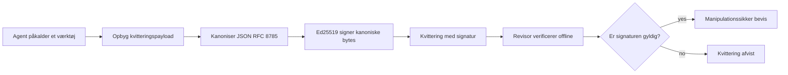
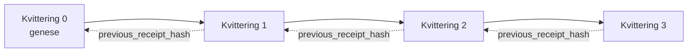

[Se lektionsvideoen: Sikring af AI-agenter med kryptografiske kvitteringer](https://youtu.be/PLACEHOLDER_VIDEO_ID)

> _(Lektionsvideo og miniaturebillede tilføjes af Microsoft indholdsteam efter sammenfletning, i overensstemmelse med lektion 14 / 15 mønsteret.)_

# Sikring af AI-agenter med kryptografiske kvitteringer

## Introduktion

Denne lektion vil dække:

- Hvorfor revisionsspor for AI-agenter er vigtige for overholdelse, fejlfinding og tillid.
- Hvad en kryptografisk kvittering er, og hvordan den adskiller sig fra en usigneret loglinje.
- Hvordan man producerer en underskrevet kvittering for et agentværktøjsopkald i ren Python.
- Hvordan man verificerer en kvittering offline og opdager manipulation.
- Hvordan man kæder kvitteringer sammen, så fjernelse eller omrokering af én bryder kæden.
- Hvad kvitteringer beviser, og hvad de eksplicit ikke beviser.

## Læringsmål

Når du har gennemført denne lektion, vil du vide, hvordan du:

- Identificerer fejltilstande, der motiverer kryptografisk provenance for agenthandlinger.
- Producerer en Ed25519-underskrevet kvittering over en kanonisk JSON-payload.
- Verificerer en kvittering uafhængigt med kun underskriverens offentlige nøgle.
- Opdager manipulation ved at køre verifikationen igen på en modificeret kvittering.
- Bygger en hash-kædet sekvens af kvitteringer og forklarer, hvorfor kæden er vigtig.
- Genkender grænsen mellem, hvad kvitteringer beviser (attribution, integritet, rækkefølge) og hvad de ikke gør (korrekthed af handlingen, gyldighed af politikken).

## Problemet: Dit agents revisionsspor

Forestil dig, at du har deployeret en AI-agent for Contoso Travel. Agenten læser kundeforespørgsler, kalder et fly-API for at finde muligheder og booker pladser på kundens vegne. I det sidste kvartal behandlede agenten 50.000 reservationer.

I dag ankommer en revisor. De stiller et simpelt spørgsmål: "Vis mig, hvad din agent gjorde."

Du overdrager dine logfiler. Revisoren ser på dem og stiller det sværere spørgsmål: "Hvordan ved jeg, at disse logs ikke er blevet redigeret?"

Dette er audit-trail-problemet. De fleste agentdeployeringer i dag baserer sig på:

- **Applikationslogs**: skrevet af agenten selv, redigerbare af alle med filsystemadgang.
- **Cloud-loggingtjenester**: manipulation kan opdages på platformniveau, men kun hvis revisoren stoler på platformudbyderen.
- **Databasetransaktionslogs**: velegnede til databaseændringer, men ikke for vilkårlige værktøjsopkald.

Ingen af disse kan besvare revisorens spørgsmål uden, at revisoren skal stole på nogen (dig, din cloud-udbyder, din databaseleverandør). Til intern brug er den tillid ofte acceptabel. For regulerede arbejdsbelastninger (finans, sundhed, alt under EU AI-loven) er det ikke.

Kryptografiske kvitteringer løser dette ved at gøre hver agenthandling uafhængigt verificerbar. Revisoren behøver ikke at stole på dig. De behøver kun din offentlige nøgle og kvitteringen selv.

## Hvad er en kryptografisk kvittering?

En kvittering er et JSON-objekt, der registrerer, hvad en agent gjorde, underskrevet med en digital signatur.


```mermaid
flowchart LR
    A[Agent påkalder et værktøj] --> B[Opbyg kvitteringspayload]
    B --> C[Kanoniser JSON RFC 8785]
    C --> E[Ed25519 signer kanoniske bytes]
    E --> F[Kvittering med signatur]
    F --> G[Revisor verificerer offline]
    G --> H{Er signaturen gyldig?}
    H -- yes --> I[Manipulationssikker bevis]
    H -- no --> J[Kvittering afvist]
```

En minimal kvittering ser sådan ud:

```json
{
  "type": "agent.tool_call.v1",
  "agent_id": "contoso-travel-bot",
  "tool_name": "lookup_flights",
  "tool_args_hash": "sha256:a3f9c1...",
  "result_hash": "sha256:7b2e1d...",
  "policy_id": "contoso-travel-policy-v3",
  "timestamp": "2026-04-25T14:30:00Z",
  "sequence": 47,
  "previous_receipt_hash": "sha256:9d4e6a...",
  "signature": {
    "alg": "EdDSA",
    "sig": "c5af83...",
    "public_key": "8f3b2c..."
  }
}
```

Tre egenskaber gør arbejdet:

1. **Signaturen**. Kvitteringen underskrives af agentens gateway med en Ed25519 privat nøgle. Enhver med den tilsvarende offentlige nøgle kan verificere signaturen offline. Manipulation af et hvilket som helst felt ugyldiggør signaturen.

2. **Kanonisk kodning**. Før underskrift serialiseres kvitteringen med JSON Canonicalization Scheme (JCS, RFC 8785). Dette sikrer, at to implementeringer, der producerer samme logiske kvittering, også producerer byte-identisk output. Uden kanonisk kodning ville forskellige JSON-serialisatorer producere forskellige signaturer for samme indhold.

3. **Hash-kædning**. Feltet `previous_receipt_hash` forbinder hver kvittering til den foregående. Fjernelse eller omrokering af en kvittering bryder alle kvitteringer efter den. Manipulation bliver synlig på kæde-niveau, selv hvis individuelle signaturer bliver omgået.

Sammen giver disse egenskaber tre garantier:

- **Attribution**: denne nøgle underskrev dette indhold.
- **Integritet**: indholdet er ikke ændret siden underskrift.
- **Rækkefølge**: denne kvittering kom efter den pågældende kvittering i kæden.

## Produktion af en kvittering i Python

Du behøver ikke et særligt bibliotek for at producere en kvittering. De kryptografiske primitive findes bredt, og logikken er kun nogle få dusin linjer Python.

De praktiske øvelser i `code_samples/18-signed-receipts.ipynb` gennemgår hele flowet. Her er en opsummering:

```python
import json
import hashlib
import base64
from nacl import signing
from jcs import canonicalize  # RFC 8785 kanonisk JSON

def b64url_nopad(data: bytes) -> str:
    return base64.urlsafe_b64encode(data).decode("ascii").rstrip("=")

def sha256_canonical(obj) -> str:
    """SHA-256 of a Python object's JCS-canonical JSON form."""
    return f"sha256:{hashlib.sha256(canonicalize(obj)).hexdigest()}"

# Generer eller indlæs en signeringsnøgle (i produktion, gem i en nøgleboks)
signing_key = signing.SigningKey.generate()
verify_key = signing_key.verify_key

# Byg kvitteringsindholdet (ingen signatur endnu)
tool_args = {"origin": "SYD", "destination": "LAX"}
tool_result = [{"flight": "QF11", "price": 1850, "stops": 0}]

payload = {
    "type": "agent.tool_call.v1",
    "agent_id": "contoso-travel-bot",
    "tool_name": "lookup_flights",
    "tool_args_hash": sha256_canonical(tool_args),
    "result_hash": sha256_canonical(tool_result),
    "policy_id": "contoso-travel-policy-v3",
    "timestamp": "2026-04-25T14:30:00Z",
    "sequence": 0,
    "previous_receipt_hash": None,
}

# Kannoniser og signer JCS-bytes direkte. PureEdDSA hasher internt.
canonical_bytes = canonicalize(payload)
signature_bytes = signing_key.sign(canonical_bytes).signature

# Vedhæft et struktureret signaturobjekt.
receipt = {
    **payload,
    "signature": {
        "alg": "EdDSA",
        "sig": b64url_nopad(signature_bytes),
        "public_key": b64url_nopad(bytes(verify_key)),
    },
}
```

Det er hele underskrifts-pipelinen. Øvelserne i notebooken gennemgår hvert trin.

## Verifikation af en kvittering og detektion af manipulation

Verifikation er den omvendte operation:

```python
import base64
import hashlib
from nacl import signing
from nacl.exceptions import BadSignatureError
from jcs import canonicalize

def b64url_decode(s: str) -> bytes:
    padding = "=" * ((4 - len(s) % 4) % 4)
    return base64.urlsafe_b64decode(s + padding)

def verify_receipt(receipt: dict) -> bool:
    # Signaturen er et struktureret objekt: {"alg", "sig", "public_key"}.
    sig_obj = receipt.get("signature")
    if not sig_obj or sig_obj.get("alg") != "EdDSA":
        return False

    # Genskab den nyttelast, der faktisk blev underskrevet (alt undtagen signaturen).
    payload = {k: v for k, v in receipt.items() if k != "signature"}

    canonical_bytes = canonicalize(payload)

    try:
        verify_key = signing.VerifyKey(b64url_decode(sig_obj["public_key"]))
        verify_key.verify(canonical_bytes, b64url_decode(sig_obj["sig"]))
        return True
    except BadSignatureError:
        return False
```

Denne funktion tager en kvittering og returnerer `True`, hvis signaturen er gyldig, ellers `False`. Ingen netværkskald, ingen servicedependency, ingen tillid nødvendig til tredjepart.

For at se manipulation opdages i praksis, gennemgår notebooken:

1. At producere en gyldig kvittering og bekræfte den.
2. At ændre en enkelt byte i feltet `tool_args_hash`.
3. At køre verifikationen igen og se den fejle.

Dette er den praktiske demonstration af, at kvitteringer er manipulationssikre: enhver ændring, uanset hvor lille, bryder signaturen.

## Kædning af kvitteringer for agent med flere trin

En enkelt underskrevet kvittering beskytter en handling. En kæde af kvitteringer beskytter en sekvens.


```mermaid
flowchart LR
    R0[Kvittering 0<br/>genese] --> R1[Kvittering 1]
    R1 --> R2[Kvittering 2]
    R2 --> R3[Kvittering 3]
    R1 -. previous_receipt_hash .-> R0
    R2 -. previous_receipt_hash .-> R1
    R3 -. previous_receipt_hash .-> R2
```

Hver kvittering registrerer hash-værdien af den foregående kvittering. For at fjerne kvittering 2 uden at blive opdaget, skal en angriber enten:

- Ændre kvittering 3's `previous_receipt_hash` felt (bryder kvittering 3's signatur), ELLER
- Falske en ny signatur på en modificeret kvittering 3 (kræver agentens private nøgle).

Hvis den private nøgle er i en hardware-nøgleboks, og du offentliggør den offentlige nøgle med hver kvittering, er ingen af angrebene mulige uden at blive opdaget.

Notebooken gennemgår:

1. Byg en kæde af tre kvitteringer.
2. Bekræft, at hver kvitterings `previous_receipt_hash` matcher den faktiske hash af den forrige kvittering.
3. Manipuler én kvittering midt i kæden og se kæden bryde præcis der.

Sådan producerer du et revisionsspor, som en ekstern revisor kan verificere uden at skulle have tillid til dig.

## Hvad kvitteringer beviser (og ikke beviser)

Dette er det vigtigste afsnit i denne lektion. Kvitteringer er kraftfulde, men deres kraft er begrænset.

**Kvitteringer beviser tre ting:**

1. **Attribution**: en specifik nøgle underskrev en specifik payload.
2. **Integritet**: payloaden har ikke ændret sig siden underskrift.
3. **Rækkefølge**: denne kvittering kom efter den tidligere i hash-kæden.

**Kvitteringer BEVISEr IKKE:**

1. **Korrekthed**: at agentens handling var korrekt. En kvittering kan underskrives for et forkert svar lige så nemt som for et korrekt.
2. **Politikoverholdelse**: at politiken refereret i `policy_id` rent faktisk blev evalueret, eller at den ville have tilladt handlingen ved kontrol. Kvitteringen registrerer, hvad der blev hævdet, ikke hvad der blev håndhævet.
3. **Identitet ud over nøglen**: kvitteringen siger "denne nøgle underskrev dette indhold." Den siger ikke "denne person godkendte dette." Tilknytning af nøgle til person eller organisation kræver separat identitetsinfrastruktur (et katalog, et offentligt nøgleregister, mv.).
4. **Sandfærdighed af input**: hvis agenten modtager en manipuleret prompt og handler på den, registrerer kvitteringen handlingen trofast. Kvitteringer kommer efter inputvalidering, ikke som erstatning.

Denne grænse er vigtig af to grunde:

- Den fortæller dig, hvad kvitteringer er nyttige til: at gøre agentens opførsel revisionsbar og manipulationssikker, også på tværs af organisatoriske grænser.
- Den fortæller dig, hvilke ekstra lag du stadig har brug for: inputvalidering (lektion 6), policye-håndhævelse (kort omtalt nedenfor) og identitetsinfrastruktur (uden for denne lektions omfang).

En almindelig fejl er at antage, at "vi har kvitteringer" betyder "vi er styret." Det gør det ikke. Kvitteringer er en grundsten. Styring er systemet, du bygger ovenpå.

## Bevis for at et menneske godkendte den præcise handling

Punkt 3 ovenfor fortjener sit eget afsnit: en handlingskvittering siger "denne nøgle underskrev dette indhold," aldrig "et menneske godkendte dette." For højrisiaktioner (refusioner, sletninger, overførsler) kræver styringsrammer i stigende grad netop denne manglende erklæring, og den kan produceres med de samme primitive, du allerede byggede i denne lektion.

Den efterfølgende notebook `code_samples/human-authorization-receipts.ipynb` tilføjer en anden kvitteringstype, `human.approval.v1`, i samme kuvertform som lektionens kvitteringer (en typet payload underskrevet af Ed25519 over sine kanoniske JCS-bytes, med `signature`-objektet uden for de underskrevne bytes). En navngiven godkender underskriver **hele den kanoniske handling og dens digest** før eksekvering; agentens handlingskvittering indeholder **samme handlingsdigest** og en `parent_approval_ref`, godkendelsens `receipt_hash`, samme konvention som `previous_receipt_hash` i kæden du byggede ovenfor. En `verify_chain` verificerer begge artefakter under **separate fastlåste nøgleregistre** (godkender-nøgler vs. agent-nøgler), så kodevejen deles, men myndighederne aldrig gør.

Den egenskab, det giver, formuleret nøje: *mennesket godkendte denne præcise handling, og agenten udførte netop den godkendte handling.* Notebookens afvisnings-fixtures er det, der gør egenskaben reel snarere end påstået:

- det klassiske sæt: manipulation, forvirret stedfortræder, genafspilning, forfalskede nøgler på begge sider, malformed input;
- **udløbet myndighed**: en signatur, der stadig verificerer, men afvises alligevel fordi politikversionen flyttede, godkender-nøglen blev fjernet fra registret, eller godkendelsen udløb før eksekvering;
- **digest-udskiftning**: en gyldigt underskrevet handlingskvittering, der peger på en *ægte* godkendelse, der binder til en *anden* kanonisk handling.

Hver fejl afviser med en særskilt grund, så en revisor, der læser afvisningen, kan afgøre, om myndigheden er udløbet eller om den eksekverede handling er ændret. Reglen notebooken lærer: en underskrevet godkendelse er ikke myndighed i sig selv. Myndighed eksisterer kun, hvis begge kvitteringer binder til samme kanoniske handling på eksekveringstidspunktet. Menneske-godkendelseskvitteringen er en pædagogisk sammensætning defineret i denne lektion, ikke en kvitteringstype defineret af `draft-farley-acta-signed-receipts`.

## Produktionshenvisninger

Python-koden i denne lektion er bevidst minimal, så du kan læse hver linje og forstå præcis, hvad der sker. I produktion har du to muligheder:

1. **Byg direkte på de kryptografiske primitive.** De 50 linjer, du så ovenfor, er tilstrækkelige til mange brugstilfælde. PyNaCl (Ed25519) og `jcs`-pakken (kanonisk JSON) er velvedligeholdte og reviderede biblioteker.

2. **Brug et produktionsklar kvitteringsbibliotek.** Flere open-source projekter implementerer samme mønster med ekstra funktioner (nøgle-rotation, batch-verifikation, JWK Set-distribution, integration med policy-engine):
   - Signaturpipelinen bruger JCS og signatur-omfangskonventioner i et uafhængigt IETF Internet-Draft ([`draft-farley-acta-signed-receipts`](https://datatracker.ietf.org/doc/draft-farley-acta-signed-receipts/), revision 02). Lektionens flade uddannelseskvittering adskiller sig fra draftets `{payload, signature}` kuvert og præsenteres ikke som en konform implementering. Draftet udgiver en fælles konformitetstestpakke ([agent-governance-testvectors](https://github.com/ScopeBlind/agent-governance-testvectors)) for implementeringer, der målretter dets wire-format.
   - Microsoft Agent Governance Toolkit sammensætter kvitteringer med Cedar-baserede politikbeslutninger; se Tutorial 33 i det repository for et end-to-end eksempel.
   - `protect-mcp` (npm) og `@veritasacta/verify` (npm) pakkerne leverer en Node-baseret implementering af kvitteringssignering og offline verifikation, beregnet til at omslutte enhver MCP-server med et manipulationssikkert revisionsspor, inklusive en held-for-co-sign flow, hvor en pausere handling udsteder en godkendelseskvittering bundet til handlingsdigest (WebAuthn-backede i desktop-flowet), samme godkendelses-kvitteringsmønster som den menneskeautorisation-notebook, der er omtalt ovenfor.
   - **[nobulex](https://github.com/arian-gogani/nobulex)** Python SDK (`pip install nobulex`) leverer det samme Ed25519 + JCS underskriftsmønster i Python med LangChain og CrewAI integrationer, inklusiv offentliggjorte krydsvaliderings-testvektorer og en overholdelseskortlægning bidraget via [OWASP PR #2210](https://github.com/OWASP/CheatSheetSeries/pull/2210).

Valget mellem at bygge selv og bruge et bibliotek spejler beslutningen mellem at skrive dit eget JWT-bibliotek og bruge et testet et: begge er rimelige; biblioteket sparer tid og reducerer revisionsfladen; den fra-grunden-tilgang tvinger dig til at forstå hver primitiv. Denne lektion underviser i fra-grund-metoden, så du har fundamentet for begge valg.

## Videnscheck

Test din forståelse inden du går videre til øvelsen.

**1. En kvittering er underskrevet med agentens private Ed25519-nøgle. Revisor har kun den offentlige nøgle. Kan revisor verificere kvitteringen offline?**

<details>
<summary>Svar</summary>

Ja. Ed25519-verifikation kræver kun den offentlige nøgle og de underskrevne bytes. Intet netværkskald, ingen servicedependency. Dette er egenskaben, der gør kvitteringer nyttige i air-gapped, multi-organisation eller lav-tillids revisionsmiljøer.
</details>

**2. En angriber ændrer kvitteringens `policy_id`-felt for at påstå, at det var underlagt en mere lempelig politik. Signaturen var over den oprindelige payload. Hvad sker der under verifikationen?**

<details>
<summary>Svar</summary>


Verificeringen mislykkes. Signaturen blev beregnet over de kanoniske bytes af den oprindelige nyttelast; ændring af et hvilket som helst felt ændrer disse bytes, hvilket gør signaturen ugyldig. Angriberen ville have brug for den private nøgle for at producere en frisk gyldig signatur, hvilket de ikke har.
</details>

**3. Hvorfor indeholder kvitteringen en `tool_args_hash` og `result_hash` i stedet for de rå argumenter og resultat?**

<details>
<summary>Svar</summary>

To grunde. For det første skal kvitteringen muligvis arkiveres eller overføres i miljøer, hvor afsløring af det rå indhold (PII, forretningsdata) er problematisk. Hashing holder kvitteringen lille og indholdet privat; revisoren bekræfter, at hashen matcher en separat lagret kopi af det faktiske indhold. For det andet har hashes en fast størrelse; en kvittering med hashes er begrænset i størrelse uanset hvor store input og output var.
</details>

**4. Feltet `previous_receipt_hash` linker hver kvittering til dens forgænger. Hvis en angriber stille sletter én kvittering midt i en kæde, hvad bliver så ugyldigt?**

<details>
<summary>Svar</summary>

Hver kvittering, der kom efter den slettede. Deres `previous_receipt_hash` felter matcher ikke længere den faktiske kæde (fordi kvitteringen, de refererede til, ikke længere eksisterer, eller kæden nu peger på en anden forgænger). For at skjule sletningen skulle angriberen gensignere hver senere kvittering, hvilket kræver den private nøgle.
</details>

**5. En kvittering verificeres rent. Beviser det, at agentens handling var korrekt, forsvarlig eller i overensstemmelse med politikken?**

<details>
<summary>Svar</summary>

Nej. En gyldig kvittering beviser tre ting: attribution (denne nøgle har signeret dette indhold), integritet (indholdet er ikke ændret) og rækkefølge (denne kvittering kom efter den anden kvittering). Det beviser IKKE, at handlingen var korrekt, at politikken navngivet i `policy_id` faktisk blev evalueret, eller at agenten fulgte alle regler. Kvitteringer gør agentens adfærd auditerbar, ikke nødvendigvis korrekt. Dette er den vigtigste grænse i lektionen.
</details>

## Øvelsesopgave

Åbn `code_samples/18-signed-receipts.ipynb` og fuldfør alle fire sektioner:

1. **Sektion 1**: Signer din første kvittering og verificer den.
2. **Sektion 2**: Manipuler kvitteringen og observer, at verificering mislykkes.
3. **Sektion 3**: Byg en kæde af tre kvitteringer og verificer kædens integritet.
4. **Sektion 4**: Anvend mønsteret på en agent bygget med Microsoft Agent Framework: indpak et værktøjskald i kvitterings-signering, og verificer derefter kvitteringen uafhængigt.

**Udvidelsesudfordring 1:** udvid kvitteringsskemaet med et yderligere felt efter eget valg (for eksempel en anmodnings-ID til sporing), opdater den kanoniske signeringslogik til at inkludere det, og bekræft at kvitteringen stadig kan gå gennem verificering. Ændr derefter feltet efter signering, og bekræft, at verificering mislykkes. Dette tvinger dig til at forstå, hvordan hver byte i den kanoniske kodning bidrager til signaturen.

**Udvidelsesudfordring 2:** SHA-256-hash to af dine kvitteringer sammen (sammenkæd deres kanoniske bytes i en deterministisk rækkefølge) og indlej den resulterende digest som et nyt felt på en tredje kvittering inden signering. Verificer at alle tre kvitteringer stadig kan gå igennem verificering. Du har lige bygget et inklusionsbevis på ét trin: enhver, der holder den tredje kvittering, kan bevise at de to første eksisterede på tidspunktet for den sene signering uden at skulle afsløre deres indhold. Dette er mønsteret, som selective-disclosure kvitteringer bruger i stor skala (Merkle-forpligtelser, RFC 6962).

## Konklusion

Kryptografiske kvitteringer giver AI-agenter et revisionsspor, der er:

- **Uafhængigt verificerbart**: enhver med den offentlige nøgle kan verificere, uden afhængighed af service.
- **Manipulationsbeviseligt**: enhver ændring ugyldiggør signaturen.
- **Bærbart**: en kvittering er en lille JSON-fil; den kan arkiveres, overføres og verificeres overalt.
- **Standardtilpasset**: bygget på Ed25519 (RFC 8032), JCS (RFC 8785) og SHA-256, alle bredt anvendte primitives.

De er ikke en erstatning for inputvalidering, håndhævelse af politik, eller identitetsinfrastruktur. De er et fundament for disse lag. Når du implementerer agenter i regulerede arbejdsbelastninger, workflows mellem flere organisationer, eller enhver kontekst hvor en fremtidig revisor ikke kan antages at stole på dig, er kvitteringer hvordan du gør revisionssporet ærligt.

Det vigtigste at tage med: kvitteringer beviser, hvem der sagde hvad, hvornår. De beviser ikke, at det sagte var sandt eller rigtigt. Hold denne sondring stramt. Det er forskellen mellem et ærligt oprindelsessystem og et misvisende.

## Produktionscheckliste

Når du er klar til at gå videre fra denne lektion til at implementere kvitterings-signerende agenter i et rigtigt miljø:

- [ ] **Flyt signeringsnøglen væk fra udviklerlaptoppen.** Brug Azure Key Vault, AWS KMS eller en hardware-sikkerhedsmodul. Den private nøgle, der signerer dine kvitteringer, må aldrig ligge i versionskontrol eller i klartekst på applikationsmaskiner.
- [ ] **Publicer den offentlige verifikationsnøgle.** Revisorer har brug for den til offline verifikation. Standardmønsteret er et JWK Set på en velkendt URL (RFC 7517), f.eks. `https://your-org.example.com/.well-known/agent-keys.json`.
- [ ] **Anchor kæden eksternt.** Skriv periodisk den seneste kædehoved-hash til en transparenslog (Sigstore Rekor, RFC 3161 tidsstempelautoritet, eller et andet internt system), så en ekstern part kan bekræfte "denne kæde eksisterede på dette tidspunkt."
- [ ] **Gem kvitteringer uforanderligt.** Append-only blob storage (Azure Storage med immutabilitetspolitikker, AWS S3 Object Lock) forhindrer insiders i at omskrive historik på lagringslaget.
- [ ] **Beslut om opbevaringsperiode.** Mange regulativer kræver flere års opbevaring. Planlæg for vækst af kvitteringer (hver kvittering er ~500 bytes; en agent, der laver 10.000 kald dagligt, producerer ~1,8 GB pr. år).
- [ ] **Dokumentér hvad kvitteringer ikke dækker.** Kvitteringer beviser attribution, integritet og rækkefølge. Din runbook bør eksplicit liste hvilke yderligere kontroller (inputvalidering, politikhåndhævelse, hastighedsbegrænsning, identitetsinfrastruktur) der ledsager kvitteringer i din governance-tilgang.

### Har du flere spørgsmål om sikring af AI-agenter?

Deltag i [Microsoft Foundry Discord](https://aka.ms/ai-agents/discord) for at mødes med andre lærende, deltage i kontortimer, og få svar på dine AI Agent-spørgsmål.

## Ud over denne lektion

Denne lektion dækker enkelt-kvitteringssignering og hash-kædede sekvenser. De samme primitive bygger block for flere mere avancerede mønstre, du kan møde, efterhånden som din governance-tilgang modnes:

- **Selective disclosure.** Når en kvitterings felter er uafhængigt forpligtede (RFC 6962-stil Merkle-træ), kan du afsløre specifikke felter til bestemte revisorer og bevise at resten er uændret uden at afsløre dem. Nyttigt når den samme kvittering skal opfylde både en omfattende audit (der ønsker fuldstændighed) og dataminimeringsregler som GDPR (der ønsker at revisor ser så lidt som muligt).
- **Kvitterings tilbagekaldelse.** Hvis en signeringsnøgle kompromitteres, skal du kunne markere alle kvitteringer signeret med den nøgle som utroværdige fra et givet tidspunkt fremad. Standardmønstre: kortlivede signeringsnøgler plus en offentliggjort tilbagekaldelsesliste, eller en transparenslog med tilbagekaldelsesposter.
- **Bilaterale / splittede signaturkvitteringer.** Nogle implementeringer splitter den signerede nyttelast i pre-eksekvering (`authorization_*`) og post-eksekvering (`result_*`) halvdele med uafhængige signaturer, nyttigt når autorisationsbeslutningen og det observerede resultat produceres af forskellige aktører eller på forskellige tidspunkter. Dette bygger oven på kvitteringsformatet undervist i denne lektion.
- **Nyttelastkomposition.** En kvittering forsegler de bytes, du lægger i `result_hash`. Virkelige nyttelaster er ofte rigere end et enkelt værktøjskald: forudgående beslutningsgrundlag (modelprediktion, overvejede muligheder, bevis og dets fuldstændighed, risikoposition, ansvarskæde, gate-udfald) kan alle bo i nyttelasten, forseglet af en enkelt kvittering. Dette holder kvitteringsformatet minimalt samtidig med at nytteladningsskemaer kan udvikle sig domæne-for-domæne.
- **Tvær-implementeringskonformitet.** Flere uafhængige implementeringer af samme kvitteringsformat (Python, TypeScript, Rust, Go) krydsverificerer mod delte testvektorer. Hvis du bygger din egen implementering, bekræfter validering mod publicerede vektorer kompatibilitet på netværksniveau.
- **Post-kvantemigration.** Ed25519 er bredt anvendt i dag men er ikke kvante-resistent. Kvitteringsformatet er algoritme-agilt: feltet `signature.alg` kan bære `ML-DSA-65` (NIST's post-kvante signaturstandard), når du har brug for at migrere. Planlæg en overgangsperiode hvor kvitteringer er dobbeltsigneret.

## Yderligere ressourcer

- <a href="https://datatracker.ietf.org/doc/draft-farley-acta-signed-receipts/" target="_blank">IETF Internet-Draft: Signed Decision Receipts for Machine-to-Machine Access Control</a>
- <a href="https://learn.microsoft.com/azure/ai-studio/responsible-use-of-ai-overview" target="_blank">Responsible AI overview (Azure AI)</a>
- <a href="https://datatracker.ietf.org/doc/html/rfc8032" target="_blank">RFC 8032: Edwards-Curve Digital Signature Algorithm (EdDSA)</a>
- <a href="https://datatracker.ietf.org/doc/html/rfc8785" target="_blank">RFC 8785: JSON Canonicalization Scheme (JCS)</a>
- <a href="https://datatracker.ietf.org/doc/html/rfc6962" target="_blank">RFC 6962: Certificate Transparency</a> (Merkle-træ-konstruktion brugt af selective-disclosure kvitteringer)
- <a href="https://github.com/microsoft/agent-governance-toolkit/blob/main/docs/tutorials/33-offline-verifiable-receipts.md" target="_blank">Microsoft Agent Governance Toolkit, Tutorial 33: Offline-Verifiable Decision Receipts</a>
- <a href="https://github.com/ScopeBlind/agent-governance-testvectors" target="_blank">Tvær-implementerings konformitetstestvektorer</a> for kvitteringsformatet brugt i denne lektion (Apache-2.0)
- <a href="https://pynacl.readthedocs.io/" target="_blank">PyNaCl dokumentation</a> (Ed25519 i Python)

## Forrige lektion

[Oprettelse af lokale AI-agenter](../17-creating-local-ai-agents/README.md)

---

<!-- CO-OP TRANSLATOR DISCLAIMER START -->
**Ansvarsfraskrivelse**:
Dette dokument er blevet oversat ved hjælp af AI-oversættelsestjenesten [Co-op Translator](https://github.com/Azure/co-op-translator). Selvom vi bestræber os på nøjagtighed, skal du være opmærksom på, at automatiserede oversættelser kan indeholde fejl eller unøjagtigheder. Det originale dokument på dets oprindelige sprog bør betragtes som den autoritative kilde. For kritisk information anbefales professionel menneskelig oversættelse. Vi påtager os intet ansvar for misforståelser eller fejltolkninger, der opstår som følge af brugen af denne oversættelse.
<!-- CO-OP TRANSLATOR DISCLAIMER END -->