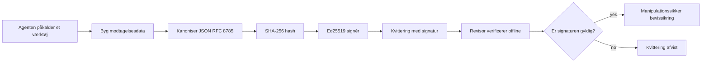
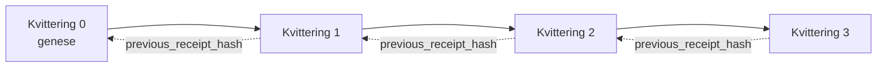

[Se lektionsvideoen: Sikring af AI-agenter med kryptografiske kvitteringer](https://youtu.be/PLACEHOLDER_VIDEO_ID)

> _(Lektionsvideo og miniaturebillede tilføjes af Microsoft-indholdsteamet efter sammenlægning, der matcher lektion 14 / 15 mønsteret.)_

# Sikring af AI-agenter med kryptografiske kvitteringer

## Introduktion

Denne lektion vil dække:

- Hvorfor revisionsspor for AI-agenter er vigtige for overholdelse, fejlfinding og tillid.
- Hvad en kryptografisk kvittering er, og hvordan den adskiller sig fra en usigneret loglinje.
- Hvordan man producerer en underskrevet kvittering for en agents værktøjsopkald i almindelig Python.
- Hvordan man verificerer en kvittering offline og opdager manipulation.
- Hvordan man kæder kvitteringer sammen så fjernelse eller omrokering af én bryder kæden.
- Hvad kvitteringer beviser, og hvad de eksplicit ikke beviser.

## Læringsmål

Efter at have gennemført denne lektion vil du vide hvordan man:

- Identificerer fejlkilder, der motiverer kryptografisk sporbarhed for agenthandlinger.
- Producerer en Ed25519-underskrevet kvittering over en kanonisk JSON-payload.
- Verificerer en kvittering uafhængigt ved kun at bruge underskriverens offentlige nøgle.
- Opdager manipulation ved at genkøre verifikation på en modificeret kvittering.
- Bygger en hash-kædet sekvens af kvitteringer og forklarer hvorfor kæden er vigtig.
- Kender grænsen mellem hvad kvitteringer beviser (tilskrivning, integritet, rækkefølge) og hvad de ikke gør (handlens korrekthed, politikens rimelighed).

## Problemet: Din agents revisionsspor

Forestil dig, at du har udrullet en AI-agent for Contoso Travel. Agenten læser kunders forespørgsler, kalder en fly-API for at finde muligheder og booker sæder på kundens vegne. Sidste kvartal behandlede agenten 50.000 bookinger.

I dag ankommer en revisor. De stiller et simpelt spørgsmål: "Vis mig, hvad din agent gjorde."

Du overgiver dine logfiler. Revisoren kigger på dem og stiller det sværere spørgsmål: "Hvordan ved jeg, at disse logs ikke er blevet redigeret?"

Dette er audit-trail problemet. De fleste agentudrulninger i dag er afhængige af:

- **Applikationslogs**: skrevet af agenten selv, redigerbar af enhver med adgang til filsystemet.
- **Cloud-loggingtjenester**: manipulation er synligt på platformniveau men kun hvis revisoren stoler på platformoperatøren.
- **Database transaktionslogs**: velegnede til databaseændringer men ikke for vilkårlige værktøjsopkald.

Ingen af disse kan besvare revisors spørgsmål uden at revisoren skal stole på en eller anden (dig, din cloud-udbyder, din databaseleverandør). Til internt brug er den tillid ofte acceptabel. For regulerede arbejdsbelastninger (finans, sundhedsvæsen, alt under EU's AI-lov) er det ikke.

Kryptografiske kvitteringer løser dette ved at gøre hver agenthandling uafhængigt verificerbar. Revisor behøver ikke at stole på dig. De behøver kun din offentlige nøgle og kvitteringen selv.

## Hvad er en kryptografisk kvittering?

En kvittering er et JSON-objekt, der registrerer hvad en agent gjorde, underskrevet med en digital signatur.


```mermaid
flowchart LR
    A[Agenten påkalder et værktøj] --> B[Byg modtagelsesdata]
    B --> C[Kanoniser JSON RFC 8785]
    C --> D[SHA-256 hash]
    D --> E[Ed25519 signér]
    E --> F[Kvittering med signatur]
    F --> G[Revisor verificerer offline]
    G --> H{Er signaturen gyldig?}
    H -- yes --> I[Manipulationssikker bevissikring]
    H -- no --> J[Kvittering afvist]
```

En minimal kvittering ser sådan ud:

```json
{
  "type": "agent.tool_call.v1",
  "agent_id": "contoso-travel-bot",
  "tool_name": "lookup_flights",
  "tool_args_hash": "sha256:a3f9c1...",
  "result_hash": "sha256:7b2e1d...",
  "policy_id": "contoso-travel-policy-v3",
  "timestamp": "2026-04-25T14:30:00Z",
  "sequence": 47,
  "previous_receipt_hash": "sha256:9d4e6a...",
  "signature": {
    "alg": "EdDSA",
    "sig": "c5af83...",
    "public_key": "8f3b2c..."
  }
}
```

Tre egenskaber gør arbejdet:

1. **Signaturen**. Kvitteringen er underskrevet af agentens gateway med en Ed25519 privat nøgle. Alle med den tilsvarende offentlige nøgle kan verificere signaturen offline. Manipulation med et hvilket som helst felt ugyldiggør signaturen.

2. **Kanonisk kodning**. Før underskrift serialiseres kvitteringen med JSON Canonicalization Scheme (JCS, RFC 8785). Dette sikrer, at to implementeringer, der producerer samme logiske kvittering, frembringer byte-identisk output. Uden kanonisering ville forskellige JSON-serialisatorer producere forskellige signaturer for samme indhold.

3. **Hash-kædning**. Feltet `previous_receipt_hash` forbinder hver kvittering med den forrige. Fjernelse eller omrokering af en kvittering bryder hver kvittering, der kom efter den. Manipulation bliver synlig på kædeniveau, selv hvis individuelle signaturer omgås.

Samlet giver disse egenskaber tre garantier:

- **Tilskrivning**: denne nøgle har underskrevet dette indhold.
- **Integritet**: indholdet har ikke ændret sig siden underskrift.
- **Rækkefølge**: denne kvittering kom efter den anden kvittering i kæden.

## At producere en kvittering i Python

Du behøver ikke et særligt bibliotek for at producere en kvittering. De kryptografiske primitive er bredt tilgængelige, og logikken er et par dusin linjer Python.

De praktiske øvelser i `code_samples/18-signed-receipts.ipynb` gennemgår hele flowet. Resuméversionen:

```python
import json
import hashlib
import base64
from nacl import signing
from jcs import canonicalize  # RFC 8785 kanonisk JSON

def b64url_nopad(data: bytes) -> str:
    return base64.urlsafe_b64encode(data).decode("ascii").rstrip("=")

def sha256_canonical(obj) -> str:
    """SHA-256 of a Python object's JCS-canonical JSON form."""
    return f"sha256:{hashlib.sha256(canonicalize(obj)).hexdigest()}"

# Generer eller indlæs en signeringsnøgle (i produktion, opbevar i et nøglelager)
signing_key = signing.SigningKey.generate()
verify_key = signing_key.verify_key

# Byg kvitteringsindholdet (ingen signatur endnu)
tool_args = {"origin": "SYD", "destination": "LAX"}
tool_result = [{"flight": "QF11", "price": 1850, "stops": 0}]

payload = {
    "type": "agent.tool_call.v1",
    "agent_id": "contoso-travel-bot",
    "tool_name": "lookup_flights",
    "tool_args_hash": sha256_canonical(tool_args),
    "result_hash": sha256_canonical(tool_result),
    "policy_id": "contoso-travel-policy-v3",
    "timestamp": "2026-04-25T14:30:00Z",
    "sequence": 0,
    "previous_receipt_hash": None,
}

# Kanoniser, hashe, signer.
canonical_bytes = canonicalize(payload)
message_hash = hashlib.sha256(canonical_bytes).digest()
signature_bytes = signing_key.sign(message_hash).signature

# Vedhæft et struktureret signaturobjekt.
receipt = {
    **payload,
    "signature": {
        "alg": "EdDSA",
        "sig": b64url_nopad(signature_bytes),
        "public_key": b64url_nopad(bytes(verify_key)),
    },
}
```

Det er hele signaturpipelinen. Øvelserne i notebogen gennemgår hvert trin.

## At verificere en kvittering og opdage manipulation

Verifikation er den inverse operation:

```python
import base64
import hashlib
from nacl import signing
from nacl.exceptions import BadSignatureError
from jcs import canonicalize

def b64url_decode(s: str) -> bytes:
    padding = "=" * ((4 - len(s) % 4) % 4)
    return base64.urlsafe_b64decode(s + padding)

def verify_receipt(receipt: dict) -> bool:
    # Signaturen er et struktureret objekt: {"alg", "sig", "public_key"}.
    sig_obj = receipt.get("signature")
    if not sig_obj or sig_obj.get("alg") != "EdDSA":
        return False

    # Genskab det payload, der faktisk blev underskrevet (alt undtagen signaturen).
    payload = {k: v for k, v in receipt.items() if k != "signature"}

    canonical_bytes = canonicalize(payload)
    message_hash = hashlib.sha256(canonical_bytes).digest()

    try:
        verify_key = signing.VerifyKey(b64url_decode(sig_obj["public_key"]))
        verify_key.verify(message_hash, b64url_decode(sig_obj["sig"]))
        return True
    except BadSignatureError:
        return False
```

Denne funktion tager en kvittering og returnerer `True`, hvis signaturen er gyldig, `False` ellers. Ingen netværkskald, ingen serviceafhængighed, ingen tillid påkrævet til tredjepart.

For at se manipulation opdages i praksis går notebogen igennem:

1. At producere en gyldig kvittering og bekræfte den verificeres.
2. At ændre én byte i feltet `tool_args_hash`.
3. At genkøre verifikation og se den fejle.

Dette er den praktiske demonstration af, at kvitteringer er manipulationssikre: enhver ændring, hvor lille den end er, bryder signaturen.

## At kæde kvitteringer for multi-trins agenter

En enkelt underskrevet kvittering beskytter én handling. En kæde af kvitteringer beskytter en sekvens.


```mermaid
flowchart LR
    R0[Kvittering 0<br/>genese] --> R1[Kvittering 1]
    R1 --> R2[Kvittering 2]
    R2 --> R3[Kvittering 3]
    R1 -. previous_receipt_hash .-> R0
    R2 -. previous_receipt_hash .-> R1
    R3 -. previous_receipt_hash .-> R2
```

Hver kvittering registrerer hashen af den foregående kvittering. For at fjerne kvittering 2 stille og roligt, skulle en angriber:

- Ændre feltet `previous_receipt_hash` i kvittering 3 (bryder signaturen på kvittering 3), ELLER
- Falske en ny signatur på den ændrede kvittering 3 (kræver agentens private nøgle).

Hvis den private nøgle er i et hardware-nøgle-bibliotek, og du offentliggør den offentlige nøgle med hver kvittering, er ingen af angrebene mulige uden at blive opdaget.

Notebogen gennemgår:

1. At bygge en kæde af tre kvitteringer.
2. At verificere, at hver kvitterings `previous_receipt_hash` matcher den faktiske hash af den forrige kvittering.
3. At manipulere med en kvittering midt i og se kæden bryde præcis der.

Sådan producerer du et revisionsspor, en ekstern revisor kan verificere uden at stole på dig.

## Hvad kvitteringer beviser (og hvad de ikke beviser)

Dette er den vigtigste sektion i denne lektion. Kvitteringer er kraftfulde, men deres magt er begrænset.

**Kvitteringer beviser tre ting:**

1. **Tilskrivning**: en bestemt nøgle underskrev en bestemt payload.
2. **Integritet**: payloaden har ikke ændret sig siden underskrift.
3. **Rækkefølge**: denne kvittering kom efter den anden kvittering i hash-kæden.

**Kvitteringer beviser IKKE:**

1. **Korrekthed**: at agentens handling var den rigtige handling. En kvittering kan underskrives for et forkert svar lige så klart som for et rigtigt svar.
2. **Overholdelse af politik**: at den politik, der henvises til i `policy_id`, faktisk blev evalueret, eller at den ville have tilladt denne handling, hvis den var tjekket. Kvitteringen registrerer, hvad der blev påstået, ikke hvad der blev håndhævet.
3. **Identitet ud over nøgle**: kvitteringen siger "denne nøgle underskrev dette indhold." Den siger ikke "dette menneske godkendte dette." At forbinde en nøgle til en person eller organisation kræver separat identitetsinfrastruktur (et katalog, et offentligt nøgleregister osv.).
4. **Sandfærdighed af input**: hvis agenten modtager en manipuleret prompt og handler på den, registrerer kvitteringen handlingen trofast. Kvitteringer er nedstrøms af inputvalidering, ikke en erstatning for den.

Denne grænse er vigtig af to grunde:

- Den fortæller dig, hvad kvitteringer er nyttige til: at gøre agentadfærd reviderbar og manipulationssynlig, også på tværs af organisatoriske grænser.
- Den fortæller dig, hvilke yderligere lag der stadig er behov for: inputvalidering (Lektion 6), håndhævelse af politik (kort omtalt nedenfor), og identitetsinfrastruktur (uden for denne lektions omfang).

En almindelig fejl er at antage, at "vi har kvitteringer" betyder "vi er styret." Det gør det ikke. Kvitteringer er et fundament. Styring er det system, du bygger ovenpå.

## Produktionsreferencer

Python-koden i denne lektion er bevidst minimal, så du kan læse hver linje og forstå nøjagtigt hvad der sker. I produktion har du to muligheder:

1. **Byg direkte på de kryptografiske primitive.** De 50 linjer, du så ovenfor, er tilstrækkelige til mange brugsscenarier. PyNaCl (Ed25519) og `jcs` pakken (kanonisk JSON) er velvedligeholdte og auditérbare biblioteker.

2. **Brug et produktionsbibliotek til kvitteringer.** Flere open-source projekter implementerer samme mønster med ekstra funktioner (nøglerotation, batch-verifikation, JWK Set-distribution, integration med politikmotorer):
   - Det kvitteringsformat, der bruges i denne lektion, følger et IETF Internet-Draft (`draft-farley-acta-signed-receipts`) i øjeblikket under standardiseringsproces.
   - Microsoft Agent Governance Toolkit komponerer kvitteringer med policy-beslutninger baseret på Cedar; se Tutorial 33 i det repository for et komplet eksempel.
   - `protect-mcp` (npm) og `@veritasacta/verify` (npm) pakkene leverer en Node-baseret implementering af kvitterings-signering og offline verifikation, beregnet til at omslutte enhver MCP-server med et manipulationssikkert revisionsspor.
   - **[nobulex](https://github.com/arian-gogani/nobulex)** Python SDK (`pip install nobulex`) leverer samme Ed25519 + JCS signaturmønster i Python med LangChain og CrewAI-integrationer, inklusive offentliggjorte krydsvalideringstestvektorer og en compliance-mapping bidraget via [OWASP PR #2210](https://github.com/OWASP/CheatSheetSeries/pull/2210).

Beslutningen mellem at skrive selv og bruge et bibliotek spejler valget mellem at skrive dit eget JWT-bibliotek og bruge et testet: begge er rimelige; biblioteket sparer tid og reducerer auditfladen; selv at bygge kræver, at du forstår hver primitiv. Denne lektion lærer selv-bygningsvejen, så du har fundamentet for begge valg.

## Videnstjek

Test din forståelse før du går til den praktiske øvelse.

**1. En kvittering underskrives med agentens private Ed25519-nøgle. Revisor har kun den offentlige nøgle. Kan revisor verificere kvitteringen offline?**

<details>
<summary>Svar</summary>

Ja. Ed25519-verifikation kræver kun den offentlige nøgle og de underskrevne bytes. Ingen netværkskald, ingen serviceafhængighed. Dette er egenskaben, der gør kvitteringer nyttige i air-gapped, multi-organisations- eller lavtillids-revisionsmiljøer.
</details>

**2. En angriber ændrer `policy_id`-feltet i en kvittering for at påstå, at den var styret af en mere tilladende politik. Signaturen var over den oprindelige payload. Hvad sker der ved verifikation?**

<details>
<summary>Svar</summary>

Verifikation fejler. Signaturen blev beregnet over de kanoniske bytes af den oprindelige payload; enhver ændring af et felt ændrer de kanoniske bytes, som ændrer SHA-256 hashen, hvilket gør signaturen ugyldig. Angriberen skulle have den private nøgle for at lave en ny gyldig signatur, hvilket de ikke har.
</details>

**3. Hvorfor inkluderer kvitteringen en `tool_args_hash` og `result_hash` i stedet for de rå argumenter og resultat?**

<details>
<summary>Svar</summary>

To grunde. Først kan kvitteringen skulle arkiveres eller overføres i miljøer, hvor lækage af råt indhold (personfølsomme data, forretningsdata) er et problem. Hashing holder kvitteringen lille og indholdet privat; revisoren verificerer, at hashen matcher en separat lagret kopi af det faktiske indhold. For det andet har hashes en fast størrelse; en kvittering med hashes er begrænset i størrelse uanset hvor store input og output var.
</details>

**4. Feltet `previous_receipt_hash` forbinder hver kvittering til sin forgænger. Hvis en angriber stille og roligt sletter en kvittering midt i en kæde, hvad bliver ugyldigt?**

<details>
<summary>Svar</summary>

Hver kvittering, der kom efter den slettede. Deres `previous_receipt_hash` felter matcher ikke længere den faktiske kæde (fordi kvitteringen, de refererede til, ikke længere findes, eller kæden nu peger på en anden forgænger). For at skjule sletningen skulle angriberen gensignere hver senere kvittering, hvilket kræver den private nøgle.
</details>

**5. En kvittering verificeres korrekt. Beviser det, at agentens handling var korrekt, rimelig eller i overensstemmelse med politik?**

<details>
<summary>Svar</summary>

Nej. En gyldig kvittering beviser tre ting: tilskrivning (denne nøgle underskrev dette indhold), integritet (indholdet har ikke ændret sig) og rækkefølge (denne kvittering kom efter den anden). Den beviser IKKE, at handlingen var korrekt, at politikken nævnt i `policy_id` blev evalueret, eller at agenten fulgte alle regler. Kvitteringer gør agentadfærd reviderbar, men ikke nødvendigvis korrekt. Dette er den vigtigste grænse i lektionen.
</details>

## Praktisk øvelse

Åbn `code_samples/18-signed-receipts.ipynb` og gennemfør alle fire sektioner:

1. **Sektion 1**: Undertegn din første kvittering og verificer den.
2. **Sektion 2**: Manipuler med kvitteringen og observer, at verifikation fejler.
3. **Sektion 3**: Byg en kæde af tre kvitteringer og verificer kædens integritet.
4. **Sektion 4**: Anvend mønsteret på en agent bygget med Microsoft Agent Framework: omslut et værktøjsopkald med kvitterings-signering, og verificer derefter kvitteringen uafhængigt.


**Udvidelsesudfordring 1:** udvid kvitteringsskemaet med et ekstra felt efter eget valg (for eksempel et anmodnings-ID til sporing), opdater den kanoniske signeringslogik til at inkludere det, og bekræft, at kvitteringen stadig kan rundgangsgennemgås ved verifikation. Ændr derefter feltet efter signering og bekræft, at verifikationen mislykkes. Dette tvinger dig til at forstå, hvordan hver enkelt byte i den kanoniske kodning bidrager til signaturen.

**Udvidelsesudfordring 2:** SHA-256-hash to af dine kvitteringer sammen (sammenkæd deres kanoniske bytes i en deterministisk rækkefølge) og indlejre den resulterende digest som et nyt felt på en tredje kvittering, før du underskriver den. Bekræft, at alle tre kvitteringer stadig kan rundgangsgennemgås. Du har netop bygget et ét-trins inklusionsbevis: enhver, der har den tredje kvittering, kan bevise, at de to første eksisterede på det tidspunkt, den blev underskrevet, uden at skulle afsløre deres indhold. Dette er mønstret, som selektiv-offentliggørelses-kvitteringer bruger i stor skala (Merkle-forpligtelser, RFC 6962).

## Konklusion

Kryptografiske kvitteringer giver AI-agenter en revisionssti, som er:

- **Uafhængigt verificerbar**: enhver part med den offentlige nøgle kan verificere, uden afhængighed af tjeneste.
- **Manipulationssikker**: enhver ændring ugyldiggør signaturen.
- **Bærbar**: en kvittering er en lille JSON-fil; den kan arkiveres, overføres og verificeres hvor som helst.
- **Standardtilpasset**: bygget på Ed25519 (RFC 8032), JCS (RFC 8785) og SHA-256, alle bredt udbredte primitive metoder.

De er ikke en erstatning for inputvalidering, policyhåndhævelse eller identitetsinfrastruktur. De er en fundament for disse lag. Når du implementerer agenter i regulerede arbejdsbelastninger, workflow mellem flere organisationer, eller i ethvert miljø, hvor en fremtidig revisor ikke kan antages at stole på dig, er kvitteringer måden at gøre revisionsstien ærlig på.

Det vigtigste takeaway: kvitteringer beviser, hvem der sagde hvad og hvornår. De beviser ikke, at det, der blev sagt, var sandt eller rigtigt. Hold denne sondring skarpt. Det er forskellen mellem et ærligt oprindelsessystem og et misvisende.

## Produktionscheckliste

Når du er klar til at gå videre fra denne lektion til at implementere kvitteringssignerede agenter i et rigtigt miljø:

- [ ] **Flyt signeringsnøglen væk fra udviklerens bærbare computer.** Brug Azure Key Vault, AWS KMS eller en hardware-sikkerhedsmodul. Den private nøgle, der underskriver dine kvitteringer, må aldrig ligge i versionsstyring eller i klartekst på applikationsmaskiner.
- [ ] **Offentliggør verifikationsnøglen.** Revisorer skal bruge den til offline verifikation. Standardmønstret er et JWK Set på en velkendt URL (RFC 7517), f.eks. `https://your-org.example.com/.well-known/agent-keys.json`.
- [ ] **Forankr kæden eksternt.** Skriv periodisk det seneste kædehovedhash til en gennemsigtighedslog (Sigstore Rekor, RFC 3161 tidsstempelautoritet eller et andet internt system), så en ekstern part kan bekræfte "denne kæde eksisterede på dette tidspunkt."
- [ ] **Gem kvitteringer uforanderligt.** Append-only blob-lagring (Azure Storage med immutabilitetspolitikker, AWS S3 Object Lock) forhindrer interne i at omskrive historie på lagringslaget.
- [ ] **Beslut dig for opbevaringsperiode.** Mange compliance-regimer kræver flerårig opbevaring. Planlæg for vækst i kvitteringer (hver kvittering er ~500 bytes; en agent, der laver 10.000 kald dagligt, producerer ~1,8 GB om året).
- [ ] **Dokumenter, hvad kvitteringer ikke dækker.** Kvitteringer beviser tilskrivning, integritet og rækkefølge. Dit runbook skal eksplicit liste, hvilke yderligere kontroller (inputvalidering, policyhåndhævelse, ratebegrænsning, identitetsinfrastruktur) der ligger ved siden af kvitteringer i din styringsholdning.

### Har du flere spørgsmål om sikring af AI-agenter?

Deltag i [Microsoft Foundry Discord](https://aka.ms/ai-agents/discord) for at møde andre elever, deltage i åbne kontortimer og få svar på dine AI Agents-spørgsmål.

## Ud over denne lektion

Denne lektion dækker enkelt-kvitteringssignering og hash-kædede sekvenser. De samme primitive metoder sammensætter flere mere avancerede mønstre, du kan støde på, efterhånden som din styringsholdning modnes:

- **Selektiv offentliggørelse.** Når en kvitterings felter er uafhængigt forpligtede (RFC 6962-stil Merkle-træ), kan du afsløre specifikke felter til specifikke revisorer og bevise, at resten er uændrede uden at eksponere dem. Nyttigt når den samme kvittering skal opfylde både en omfattende revision (som ønsker fuldstændighed) og dataminimeringsregler som GDPR (som ønsker, at revisoren ser så lidt som nødvendigt).
- **Kvitterings tilbagekaldelse.** Hvis en signeringsnøgle kompromitteres, har du brug for en måde at markere alle kvitteringer underskrevet med den nøgle som utroværdige fra et bestemt tidspunkt fremad. Standardmønstre: korttidslevende signeringsnøgler plus en offentliggjort tilbagekaldelsesliste, eller en gennemsigtighedslog med tilbagekaldelsesposter.
- **Bilaterale / split-signaturkvitteringer.** Nogle implementeringer opdeler det underskrevne payload i før-udførelses (`authorization_*`) og efter-udførelses (`result_*`) halvdele med uafhængige signaturer, nyttigt når autorisationsbeslutningen og det observerede resultat produceres af forskellige aktører eller på forskellige tidspunkter. Dette lægges additivt oven på kvitteringsformatet undervist i denne lektion.
- **Payloadsammensætning.** En kvittering forsejler uanset hvilke bytes, du sætter i `result_hash`. Virkelighedens payloads er ofte rigere end et enkelt værktøjskalds resultat: forudbeslutningsgrundlag (modelprognose, overvejede muligheder, beviser og deres fuldstændighed, risikoholdning, ansvarskæde, portevaluering) kan alle leve inde i payloaden, forsejlet af en enkelt kvittering. Dette holder kvitteringsformatet minimalt, mens payload-skemaer kan udvikle sig domæne-for-domæne.
- **Overensstemmelse på tværs af implementeringer.** Flere uafhængige implementeringer af samme kvitteringsformat (Python, TypeScript, Rust, Go) krydsverificerer mod delte testvektorer. Hvis du bygger din egen implementering, bekræfter validering mod offentliggjorte vektorer ledningskompatibilitet.
- **Post-kvante-migrering.** Ed25519 er bredt udbredt i dag, men er ikke kvantesikker. Kvitteringsformatet er algoritme-agilt: feltet `signature.alg` kan bære `ML-DSA-65` (NIST post-kvant signaturnormen), når du skal migrere. Planlæg en overgangsperiode, hvor kvitteringer er dobbelt-underskrevne.

## Yderligere ressourcer

- <a href="https://datatracker.ietf.org/doc/draft-farley-acta-signed-receipts/" target="_blank">IETF Internet-Draft: Signed Decision Receipts for Machine-to-Machine Access Control</a>
- <a href="https://learn.microsoft.com/azure/ai-studio/responsible-use-of-ai-overview" target="_blank">Ansvarlig AI oversigt (Azure AI)</a>
- <a href="https://datatracker.ietf.org/doc/html/rfc8032" target="_blank">RFC 8032: Edwards-Curve Digital Signature Algorithm (EdDSA)</a>
- <a href="https://datatracker.ietf.org/doc/html/rfc8785" target="_blank">RFC 8785: JSON Canonicalization Scheme (JCS)</a>
- <a href="https://datatracker.ietf.org/doc/html/rfc6962" target="_blank">RFC 6962: Certificate Transparency</a> (Merkle-træs konstruktion brugt af selektiv-offentliggørelses-kvitteringer)
- <a href="https://github.com/microsoft/agent-governance-toolkit/blob/main/docs/tutorials/33-offline-verifiable-receipts.md" target="_blank">Microsoft Agent Governance Toolkit, Tutorial 33: Offline-verifiable Decision Receipts</a>
- <a href="https://github.com/ScopeBlind/agent-governance-testvectors" target="_blank">Cross-implementation conformance testvektorer</a> for kvitteringsformatet brugt i denne lektion (Apache-2.0)
- <a href="https://pynacl.readthedocs.io/" target="_blank">PyNaCl dokumentation</a> (Ed25519 i Python)

## Forrige lektion

[Bygning af Computer Use Agents (CUA)](../15-browser-use/README.md)

---

<!-- CO-OP TRANSLATOR DISCLAIMER START -->
**Ansvarsfraskrivelse**:
Dette dokument er blevet oversat ved hjælp af AI-oversættelsestjenesten [Co-op Translator](https://github.com/Azure/co-op-translator). Selvom vi bestræber os på nøjagtighed, skal du være opmærksom på, at automatiserede oversættelser kan indeholde fejl eller unøjagtigheder. Det originale dokument på dets oprindelige sprog bør betragtes som den autoritative kilde. For kritisk information anbefales professionel menneskelig oversættelse. Vi påtager os intet ansvar for misforståelser eller fejltolkninger, der opstår som følge af brugen af denne oversættelse.
<!-- CO-OP TRANSLATOR DISCLAIMER END -->