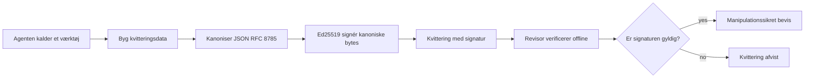
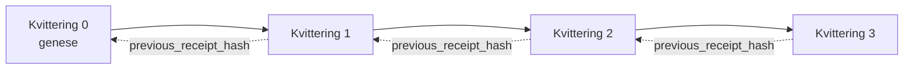

[Se lektionsvideoen: Sikring af AI-agenter med kryptografiske kvitteringer](https://youtu.be/PLACEHOLDER_VIDEO_ID)

> _(Lektionsvideo og miniaturebillede tilføjes af Microsoft-indholdsteamet efter sammensmeltning, i overensstemmelse med mønsteret for lektion 14 / 15.)_

# Sikring af AI-agenter med kryptografiske kvitteringer

## Introduktion

Denne lektion dækker:

- Hvorfor revisionsspor for AI-agenter er vigtige for overholdelse, fejlretning og tillid.
- Hvad en kryptografisk kvittering er, og hvordan den adskiller sig fra en usigneret loglinje.
- Hvordan man producerer en underskrevet kvittering for en agents værktøjskald i almindelig Python.
- Hvordan man verificerer en kvittering offline og opdager manipulation.
- Hvordan man kæder kvitteringer sammen, så fjernelse eller omrokering af en bryder kæden.
- Hvad kvitteringer beviser, og hvad de eksplicit ikke beviser.

## Læringsmål

Efter at have gennemført denne lektion vil du vide, hvordan du:

- Identificerer fejltilstande, der motiverer kryptografisk proveniens for agenthandlinger.
- Producerer en Ed25519-underskrevet kvittering over en kanonisk JSON-payload.
- Verificerer en kvittering uafhængigt ved kun at bruge signaturens offentlige nøgle.
- Opdager manipulation ved at køre verifikationen igen på en ændret kvittering.
- Bygger en hash-kædet sekvens af kvitteringer og forklarer, hvorfor kæden er vigtig.
- Genkender grænsen mellem hvad kvitteringer beviser (attribution, integritet, rækkefølge) og hvad de ikke beviser (handlingens korrekthed, politikens gyldighed).

## Problemet: Din agents revisionsspor

Forestil dig, at du har implementeret en AI-agent for Contoso Travel. Agenten læser kunders forespørgsler, kalder en fly-API for at finde muligheder og booker pladser på kundens vegne. Sidste kvartal behandlede agenten 50.000 bookinger.

I dag dukker en revisor op. De stiller et simpelt spørgsmål: "Vis mig, hvad din agent gjorde."

Du overgiver dine logfiler. Revisoren kigger på dem og stiller det sværere spørgsmål: "Hvordan ved jeg, at disse logs ikke er blevet redigeret?"

Dette er revisionssporproblemet. De fleste agentimplementeringer i dag er afhængige af:

- **Applikationslogs**: skrevet af agenten selv, redigerbare af enhver med adgang til filsystemet.
- **Cloud-logningstjenester**: manipulationssikre på platformniveau, men kun hvis revisoren stoler på platformoperatøren.
- **Database transaktionslogs**: velegnede til databaseændringer, men ikke til vilkårlige værktøjskald.

Ingen af disse kan besvare revisorens spørgsmål uden, at revisor skal stole på nogen (dig, din cloud-udbyder, din databaseleverandør). Til internt brug er den tillid ofte acceptabel. For regulerede arbejdsbelastninger (finans, sundhedsvæsen, alt under EU's AI-lovgivning) er det ikke.

Kryptografiske kvitteringer løser dette ved at gøre hver agenthandling uafhængigt verificerbar. Revisor behøver ikke at stole på dig. De behøver kun din offentlige nøgle og kvitteringen selv.

## Hvad er en kryptografisk kvittering?

En kvittering er et JSON-objekt, der registrerer, hvad en agent gjorde, underskrevet med en digital signatur.


```mermaid
flowchart LR
    A[Agenten kalder et værktøj] --> B[Byg kvitteringsdata]
    B --> C[Kanoniser JSON RFC 8785]
    C --> E[Ed25519 signér kanoniske bytes]
    E --> F[Kvittering med signatur]
    F --> G[Revisor verificerer offline]
    G --> H{Er signaturen gyldig?}
    H -- yes --> I[Manipulationssikret bevis]
    H -- no --> J[Kvittering afvist]
```

En minimal kvittering ser således ud:

```json
{
  "type": "agent.tool_call.v1",
  "agent_id": "contoso-travel-bot",
  "tool_name": "lookup_flights",
  "tool_args_hash": "sha256:a3f9c1...",
  "result_hash": "sha256:7b2e1d...",
  "policy_id": "contoso-travel-policy-v3",
  "timestamp": "2026-04-25T14:30:00Z",
  "sequence": 47,
  "previous_receipt_hash": "sha256:9d4e6a...",
  "signature": {
    "alg": "EdDSA",
    "sig": "c5af83...",
    "public_key": "8f3b2c..."
  }
}
```

Tre egenskaber udfører arbejdet:

1. **Signaturen**. Kvitteringen er underskrevet af agentens gateway med en Ed25519-privatnøgle. Enhver med den tilsvarende offentlige nøgle kan verificere signaturen offline. Manipulation af et hvilket som helst felt ugyldiggør signaturen.

2. **Kanonisk kodning**. Før underskrivelse serialiseres kvitteringen ved brug af JSON Canonicalization Scheme (JCS, RFC 8785). Dette sikrer, at to implementeringer, der producerer samme logiske kvittering, producerer byte-identisk output. Uden kanonisering ville forskellige JSON-serialisatorer producere forskellige signaturer for samme indhold.

3. **Hash-kædning**. Feltet `previous_receipt_hash` forbinder hver kvittering til den forrige. Fjernelse eller omrokering af en kvittering ødelægger hver kvittering, der kommer efter. Manipulation bliver synlig på kædeniveau, selv hvis individuelle signaturer hoppes over.

Sammen giver disse egenskaber tre garantier:

- **Attribution**: denne nøgle underskrev dette indhold.
- **Integritet**: indholdet har ikke ændret sig siden signering.
- **Rækkefølge**: denne kvittering kom efter den kvittering i kæden.

## Produktion af en kvittering i Python

Du behøver ikke et specielt bibliotek for at producere en kvittering. De kryptografiske primitive funktioner er bredt tilgængelige, og logikken er nogle få dusin linjer Python.

Øvelserne i `code_samples/18-signed-receipts.ipynb` gennemgår hele forløbet. Her er en sammenfatning:

```python
import json
import hashlib
import base64
from nacl import signing
from jcs import canonicalize  # RFC 8785 kanonisk JSON

def b64url_nopad(data: bytes) -> str:
    return base64.urlsafe_b64encode(data).decode("ascii").rstrip("=")

def sha256_canonical(obj) -> str:
    """SHA-256 of a Python object's JCS-canonical JSON form."""
    return f"sha256:{hashlib.sha256(canonicalize(obj)).hexdigest()}"

# Generer eller indlæs en signeringsnøgle (i produktion, gem i en nøgleboks)
signing_key = signing.SigningKey.generate()
verify_key = signing_key.verify_key

# Byg kvitteringsdataene (ingen signatur endnu)
tool_args = {"origin": "SYD", "destination": "LAX"}
tool_result = [{"flight": "QF11", "price": 1850, "stops": 0}]

payload = {
    "type": "agent.tool_call.v1",
    "agent_id": "contoso-travel-bot",
    "tool_name": "lookup_flights",
    "tool_args_hash": sha256_canonical(tool_args),
    "result_hash": sha256_canonical(tool_result),
    "policy_id": "contoso-travel-policy-v3",
    "timestamp": "2026-04-25T14:30:00Z",
    "sequence": 0,
    "previous_receipt_hash": None,
}

# Kanoniser og signer JCS-bytes direkte. PureEdDSA hasher internt.
canonical_bytes = canonicalize(payload)
signature_bytes = signing_key.sign(canonical_bytes).signature

# Vedhæft et struktureret signaturobjekt.
receipt = {
    **payload,
    "signature": {
        "alg": "EdDSA",
        "sig": b64url_nopad(signature_bytes),
        "public_key": b64url_nopad(bytes(verify_key)),
    },
}
```

Det er hele underskrivningspipelineet. Øvelserne i notesbogen gennemgår hvert trin.

## Verifikation af en kvittering og opdagelse af manipulation

Verifikation er den modsatte operation:

```python
import base64
import hashlib
from nacl import signing
from nacl.exceptions import BadSignatureError
from jcs import canonicalize

def b64url_decode(s: str) -> bytes:
    padding = "=" * ((4 - len(s) % 4) % 4)
    return base64.urlsafe_b64decode(s + padding)

def verify_receipt(receipt: dict) -> bool:
    # Signaturen er et struktureret objekt: {"alg", "sig", "public_key"}.
    sig_obj = receipt.get("signature")
    if not sig_obj or sig_obj.get("alg") != "EdDSA":
        return False

    # Genskab det indhold, der faktisk blev underskrevet (alt undtagen signaturen).
    payload = {k: v for k, v in receipt.items() if k != "signature"}

    canonical_bytes = canonicalize(payload)

    try:
        verify_key = signing.VerifyKey(b64url_decode(sig_obj["public_key"]))
        verify_key.verify(canonical_bytes, b64url_decode(sig_obj["sig"]))
        return True
    except BadSignatureError:
        return False
```

Denne funktion tager en kvittering og returnerer `True`, hvis signaturen er gyldig, `False` ellers. Ingen netværkskald, ingen serviceafhængighed, ingen tillid nødvendig til tredjepart.

For at se manipulation opdages i praksis, gennemgår notesbogen:

1. Produktionen af en gyldig kvittering og bekræftelsen af, at den verificeres.
2. Ændring af en byte i feltet `tool_args_hash`.
3. Genkørsel af verifikationen og konstatering af fejl.

Dette er den praktiske demonstration af, at kvitteringer er manipulationssikre: Enhver ændring, uanset hvor lille, bryder signaturen.

## Kædning af kvitteringer for flertrinsagenter

En enkelt underskrevet kvittering beskytter én handling. En kæde af kvitteringer beskytter en sekvens.


```mermaid
flowchart LR
    R0[Kvittering 0<br/>genese] --> R1[Kvittering 1]
    R1 --> R2[Kvittering 2]
    R2 --> R3[Kvittering 3]
    R1 -. previous_receipt_hash .-> R0
    R2 -. previous_receipt_hash .-> R1
    R3 -. previous_receipt_hash .-> R2
```

Hver kvittering registrerer hashværdien af den tidligere kvittering. For at fjerne kvittering 2 uden spor skal en angriber enten:

- Ændre feltet `previous_receipt_hash` i kvittering 3 (ødelægger kvittering 3's signatur), ELLER
- Falske en ny signatur på en ændret kvittering 3 (kræver agentens private nøgle).

Hvis den private nøgle er i en hardware-nøgleboks, og du offentliggør den offentlige nøgle med hver kvittering, er ingen af angrebene mulige uden opdage.

Notesbogen gennemgår:

1. Opbygning af en kæde af tre kvitteringer.
2. Verifikation af, at hver kvitterings `previous_receipt_hash` matcher den faktiske hash af den forrige kvittering.
3. Manipulation af en kvittering i midten og konstatering af at kæden brydes præcis der.

Sådan producerer du et revisionsspor, som en ekstern revisor kan verificere uden at skulle stole på dig.

## Hvad kvitteringer beviser (og hvad de ikke beviser)

Dette er det vigtigste afsnit i denne lektion. Kvitteringer er kraftfulde, men deres kræfter er begrænsede.

**Kvitteringer beviser tre ting:**

1. **Attribution**: en bestemt nøgle underskrev en bestemt belastning.
2. **Integritet**: belastningen har ikke ændret sig siden signering.
3. **Rækkefølge**: denne kvittering kom efter den kvittering i hash-kæden.

**Kvitteringer beviser IKKE:**

1. **Korrekthed**: at agentens handling var den rette handling. En kvittering kan underskrives for et forkert svar lige så rent som for et korrekt svar.
2. **Politikoverholdelse**: at politikken angivet i `policy_id` faktisk blev evalueret, eller at den ville have tilladt denne handling, hvis den var blevet tjekket. Kvitteringen registrerer, hvad der blev påstået, ikke hvad der blev håndhævet.
3. **Identitet ud over nøglen**: kvitteringen siger "denne nøgle underskrev dette indhold." Den siger ikke "denne person godkendte dette." Forbindelse af en nøgle til en person eller organisation kræver separat identitetsinfrastruktur (et register, en offentlig nøgleregistrering etc.).
4. **Sandfærdighed af input**: hvis agenten modtager en manipuleret prompt og handler på den, registrerer kvitteringen handlingen korrekt. Kvitteringer ligger nedstrøms for inputvalidering, ikke som en erstatning.

Denne grænse er vigtig af to grunde:

- Den fortæller dig, hvad kvitteringer er nyttige til: at gøre agentadfærd revisionel og manipulationssynlig, også på tværs af organisationsgrænser.
- Den fortæller dig, hvilke yderligere lag du stadig har brug for: inputvalidering (lektion 6), politikhåndhævelse (kort gennemgået nedenfor) og identitetsinfrastruktur (uden for denne lektions scope).

En almindelig fejl er at antage, at "vi har kvitteringer" betyder "vi er styret." Det gør det ikke. Kvitteringer er et fundament. Styring er det system, du bygger ovenpå.

## Bevis for, at et menneske godkendte den præcise handling

Punkt 3 ovenfor fortjener sit eget afsnit: en handlingskvittering siger "denne nøgle underskrev dette indhold," aldrig "et menneske godkendte dette." For højrisko-handlinger (refusioner, sletninger, bankoverførsler) kræver styringsrammer i stigende grad netop denne manglende erklæring, og den kan produceres med de samme primitive funktioner, du allerede byggede i denne lektion.

Den efterfølgende notesbog `code_samples/human-authorization-receipts.ipynb` tilføjer en anden kvitteringstype, `human.approval.v1`, med samme kuvertform som lektionens kvitteringer (en typet payload underskrevet med Ed25519 over dens kanoniske JCS-bytes, med `signature`-objektet uden for de underskrevne bytes). En navngiven godkender underskriver **hele den kanoniske handling og dens digest** før udførelse; agentens handlingskvittering bærer **samme handlingsdigest** og en `parent_approval_ref`, `receipt_hash` for godkendelsen, samme konvention som `previous_receipt_hash` i kæden fra oven. Én `verify_chain` gennemgår begge artefakter under **separate faste nøgleregistre** (godkendernøgler mod agentnøgler), så kodevejen deles, men myndighederne aldrig gør.

Den egenskab, dette giver, formuleret omhyggeligt: *mennesket godkendte denne præcise handling, og agenten udførte nøjagtigt den godkendte handling.* Notesbokens afvisningsundtagelser gør egenskaben reel snarere end blot fremsat:

- det klassiske sæt: manipulation, forvirret stedfortræder, genafspilning, forfalskede nøgler på begge sider, forkert input;
- **ældet myndighed**: en signatur, der stadig verificeres, afvises alligevel, fordi politikversionen flyttede, godkendernøglen blev roteret ud af det faste register, eller godkendelsen udløb før udførsel;
- **digest-udskiftning**: en gyldigt underskrevet handlingskvittering pegende på en *ægte* godkendelse, der binder en *anden* kanonisk handling.

Hver fejl afvises med en distinkt årsag, så en revisor, der læser en afvisning, kan se, om myndighed blev forældet eller den udførte handling ændrede sig. Reglen notesbogen underviser i: en underskrevet godkendelse er ikke myndighed i sig selv. Myndighed eksisterer kun, hvis begge kvitteringer stadig binder til den samme kanoniske handling ved udførelsestidspunktet. Menneske-godkendelseskvitteringen er en uddannelsesmæssig sammensætning defineret af denne lektion, ikke en kvitteringstype defineret af `draft-farley-acta-signed-receipts`.

## Produktionsreferencer

Python-koden i denne lektion er bevidst minimal, så du kan læse hver linje og forstå præcis, hvad der sker. I produktion har du to muligheder:

1. **Byg direkte på de kryptografiske primitive funktioner.** De 50 linjer, du så ovenfor, er tilstrækkelige til mange brugsscenarier. PyNaCl (Ed25519) og `jcs`-pakken (kanonisk JSON) er veldrevne og reviderede biblioteker.

2. **Brug et produktionskvitteringsbibliotek.** Flere open-source-projekter implementerer samme mønster med ekstra funktioner (nøglerotation, batch-verifikation, JWK Set-distribution, integration med politikmotorer):
   - Underskrivningspipelineet bruger JCS og signatur-omfangskonventioner i et uafhængigt IETF Internet-draft ([`draft-farley-acta-signed-receipts`](https://datatracker.ietf.org/doc/draft-farley-acta-signed-receipts/), revision 02). Lektionens flade uddannelseskvittering adskiller sig fra draftets `{payload, signature}`-kuvert og præsenteres ikke som en konform implementation. Draftet offentliggør en fælles konformitetspakke ([agent-governance-testvectors](https://github.com/ScopeBlind/agent-governance-testvectors)) for implementeringer, der målretter dets wireformat.
   - Microsoft Agent Governance Toolkit sammensætter kvitteringer med Cedar-baserede politikbeslutninger; se Tutorial 33 i det depot for et ende-til-ende eksempel.
   - `protect-mcp` (npm) og `@veritasacta/verify` (npm) pakkerne giver en Node-baseret implementering af kvitteringssignering og offline verifikation, beregnet til indpakning af enhver MCP-server med et manipulationssynligt revisionsspor, inklusive en ventes-for-medunderskrift proces, hvor en sat pausehandling udsender en godkendelseskvittering knyttet til handlingsdigesten (WebAuthn-bakket i desktop-flowet), samme godkendelseskvitteringsmønster som den menneske-autorisationsnotesbog ovenfor.
   - **[nobulex](https://github.com/arian-gogani/nobulex)** Python SDK (`pip install nobulex`) tilbyder samme Ed25519 + JCS underskrivningsmønster i Python med LangChain- og CrewAI-integrationer, inkl. offentliggjorte krydsvalideringstestvektorer og en compliance-mapping bidraget via [OWASP PR #2210](https://github.com/OWASP/CheatSheetSeries/pull/2210).

Valget mellem at bygge selv og bruge et bibliotek svarer til valget mellem at skrive dit eget JWT-bibliotek eller bruge et testet: begge er rimelige; biblioteket sparer tid og reducerer auditfladen; egenudvikling tvinger dig til at forstå hver primitive funktion. Denne lektion lærer fra-scratch-metoden, så du har fundamentet for begge valg.

## Videnscheck

Test din forståelse, før du går videre til praksisøvelsen.

**1. En kvittering er underskrevet med agentens private Ed25519-nøgle. Revisor har kun den offentlige nøgle. Kan revisor verificere kvitteringen offline?**

<details>
<summary>Svar</summary>

Ja. Ed25519-verifikation kræver kun den offentlige nøgle og de underskrevne bytes. Ingen netværkskald, ingen serviceafhængighed. Dette er egenskaben, som gør kvitteringer nyttige i luftspærrede, multi-organisation eller lavtillids revisionsmiljøer.
</details>

**2. En angriber ændrer feltet `policy_id` i en kvittering for at hævde, at den var underlagt en mere lempelig politik. Signaturen var over den oprindelige payload. Hvad sker der ved verifikation?**

<details>
<summary>Svar</summary>


Verifikation mislykkes. Signaturen blev beregnet over de kanoniske bytes af det oprindelige payload; ændring af et hvilket som helst felt ændrer disse bytes, hvilket gør signaturen ugyldig. Angriberen ville skulle have den private nøgle for at producere en frisk gyldig signatur, hvilket de ikke har.
</details>

**3. Hvorfor inkluderer kvitteringen en `tool_args_hash` og `result_hash` i stedet for rå argumenter og resultat?**

<details>
<summary>Svar</summary>

To grunde. For det første kan kvitteringen være nødt til at blive arkiveret eller overført i miljøer, hvor lækage af råt indhold (PII, forretningsdata) er et problem. Hashing holder kvitteringen lille og indholdet privat; revisoren bekræfter, at hashen matcher en separat lagret kopi af det faktiske indhold. For det andet har hasher en fast størrelse; en kvittering med hasher er størrelsesmæssigt afgrænset uanset hvor store input og output var.
</details>

**4. Feltet `previous_receipt_hash` forbinder hver kvittering til sin forgænger. Hvis en angriber stille og roligt sletter en kvittering midt i en kæde, hvad bliver så ugyldigt?**

<details>
<summary>Svar</summary>

Hver kvittering, der kom efter den slettede. Deres `previous_receipt_hash` felter stemmer ikke længere overens med den faktiske kæde (fordi den kvittering, de refererede til, ikke længere eksisterer, eller kæden nu peger på en anden forgænger). For at skjule sletningen ville angriberen skulle gensigne hver senere kvittering, hvilket kræver den private nøgle.
</details>

**5. En kvittering verificerer rent. Beviser det, at agentens handling var korrekt, rimelig eller i overensstemmelse med politikken?**

<details>
<summary>Svar</summary>

Nej. En gyldig kvittering beviser tre ting: tilskrivelse (denne nøgle har signeret dette indhold), integritet (indholdet er ikke ændret), og ordning (denne kvittering kom efter den kvittering). Den beviser IKKE, at handlingen var korrekt, at den politik, der er nævnt i `policy_id`, rent faktisk blev evalueret, eller at agenten fulgte alle regler. Kvitteringer gør agentadfærd reviderbar, ikke nødvendigvis korrekt. Dette er den vigtigste grænse i lektionen.
</details>

## Øvelsesopgave

Åbn `code_samples/18-signed-receipts.ipynb` og gennemfør alle fire afsnit:

1. **Afsnit 1**: Signer din første kvittering og verificer den.
2. **Afsnit 2**: Manipulér kvitteringen og observer at verifikation mislykkes.
3. **Afsnit 3**: Byg en kæde med tre kvitteringer og verificer kædens integritet.
4. **Afsnit 4**: Anvend mønstret på en agent bygget med Microsoft Agent Framework: wrap et værktøjskald i kvitteringssignering, og verificer derefter kvitteringen uafhængigt.

**Udvidelsesudfordring 1:** udvid kvitteringsskemaet med et yderligere felt efter eget valg (for eksempel en anmodnings-ID til sporing), opdater den kanoniske signeringslogik til at inkludere det, og bekræft at kvitteringen stadig kan gennemgå verifikation. Ændr derefter feltet efter signering og bekræft, at verifikation mislykkes. Dette tvinger dig til at forstå, hvordan hver eneste byte af den kanoniske kodning bidrager til signaturen.

**Udvidelsesudfordring 2:** SHA-256-hash to af dine kvitteringer sammen (konkatener deres kanoniske bytes i en deterministisk orden) og indlejr det resulterende digest som et nyt felt på en tredje kvittering før signering. Verificer, at alle tre kvitteringer stadig kan gennemgå verifikation. Du har netop bygget et én-trins inklusionsbevis: enhver, der indeholder den tredje kvittering, kan bevise, at de to første eksisterede på tidspunktet for signeringen, uden at skulle afsløre deres indhold. Dette er mønstret, som selektivt-oplysende kvitteringer bruger i stor skala (Merkle-forpligtelser, RFC 6962).

## Konklusion

Kryptografiske kvitteringer giver AI-agenter et revisionsspor, som er:

- **Uafhængigt verificerbart**: enhver part med den offentlige nøgle kan verificere, uden serviceafhængighed.
- **Manipulationssikkert**: enhver ændring ugyldiggør signaturen.
- **Bærbart**: en kvittering er en lille JSON-fil; den kan arkiveres, overføres og verificeres overalt.
- **Standardaligneret**: bygget på Ed25519 (RFC 8032), JCS (RFC 8785), og SHA-256, alle bredt udbredte primitive.

De er ikke en erstatning for inputvalidering, politik-håndhævelse eller identitetsinfrastruktur. De er et fundament for disse lag. Når du deployerer agenter i regulerede arbejdsmiljøer, workflows på tværs af organisationer eller i enhver situation, hvor man ikke kan forvente, at en fremtidig revisor vil stole på dig, er kvitteringer, hvordan du sikrer, at revisionssporet er ærligt.

Det vigtigste at huske: kvitteringer beviser, hvem der sagde hvad, hvornår. De beviser ikke, at det sagte var sandt eller korrekt. Hold fast i denne sondring. Det er forskellen på et ærligt oprindelsessystem og et misvisende.

## Produktionscheckliste

Når du er klar til at gå videre fra denne lektion til at deployere kvitteringssignerede agenter i et ægte miljø:

- [ ] **Flyt signeringsnøglen væk fra udviklerlaptoppen.** Brug Azure Key Vault, AWS KMS, eller en hardware-sikkerhedsmodul. Den private nøgle, der signerer dine kvitteringer, må aldrig ligge i kildekodekontrol eller i klartekst på applikationsmaskiner.
- [ ] **Offentliggør den offentlige verifikationsnøgle.** Revisorer har brug for den til at verificere offline. Standardmønstret er et JWK Set på en velkendt URL (RFC 7517), fx `https://your-org.example.com/.well-known/agent-keys.json`.
- [ ] **Forankr kæden eksternt.** Skriv periodisk den seneste kædetophash til en transparenslog (Sigstore Rekor, RFC 3161 tidsstempelmyndighed eller et andet internt system), så en ekstern part kan bekræfte "denne kæde eksisterede på dette tidspunkt."
- [ ] **Gem kvitteringer uforanderligt.** Append-only blob storage (Azure Storage med immutabilitetspolitikker, AWS S3 Object Lock) forhindrer en insider i at omskrive historikken på lagringsniveau.
- [ ] **Beslut retention.** Mange compliance-regimer kræver flerårig opbevaring. Planlæg for vækst i kvitteringer (hver kvittering er ~500 bytes; en agent med 10.000 kald pr. dag producerer ~1.8 GB pr. år).
- [ ] **Dokumentér hvad kvitteringer ikke dækker.** Kvitteringer beviser tilskrivelse, integritet og ordning. Din runbook bør eksplicit opremse, hvilke yderligere kontroller (inputvalidering, politikhåndhævelse, ratebegrænsning, identitetsinfrastruktur) der fungerer sideløbende med kvitteringer i din governance-tilgang.

### Har du flere spørgsmål om sikring af AI-agenter?

Deltag i [Microsoft Foundry Discord](https://aka.ms/ai-agents/discord) for at møde andre lærende, deltage i åbent hus, og få svar på dine spørgsmål om AI-agenter.

## Ud over denne lektion

Denne lektion dækker enkeltkvitteringssignering og hash-kædede sekvenser. De samme primitive byggerier indgår i flere mere avancerede mønstre, du kan støde på, efterhånden som din governance-tilgang modnes:

- **Selektiv oplysning.** Når felterne i en kvittering er uafhængigt forpligtede (RFC 6962-stil Merkle-træ), kan du afsløre specifikke felter for bestemte revisorer og bevise, at de øvrige ikke er ændret uden at afsløre dem. Nyttigt når samme kvittering skal opfylde både en omfattende revision (som vil have fuldstændighed) og dataminimeringskrav som GDPR (som vil have, at revisor kun ser så lidt som muligt).
- **Kvitterings tilbagekaldelse.** Hvis en signeringsnøgle kompromitteres, har du brug for en måde at markere alle kvitteringer underskrevet med den nøgle som utroværdige fra et bestemt tidspunkt og frem. Standardmønstre: kortlevende signeringsnøgler plus en offentliggjort tilbagekaldelsesliste, eller en transparenslog med tilbagekaldelsesposter.
- **Bilaterale / delt-signatur kvitteringer.** Nogle implementeringer splitter den signerede payload i pre-eksekverings- (`authorization_*`) og post-eksekverings- (`result_*`) halvdele med uafhængige signaturer, nyttigt når autorisationsbeslutningen og det observerede resultat produceres af forskellige aktører eller på forskellige tidspunkter. Dette komponeres additivt oven på kvitteringsformatet fra denne lektion.
- **Payload-komposition.** En kvittering forsegler de bytes, du lægger i `result_hash`. Virkelige payloads er ofte rigere end et enkelt værktøjskalds resultat: forudgående beslutningsgrundlag (modelprediktion, overvejede muligheder, bevismateriale og dens fuldstændighed, risikoposition, ansvarsrekke, gate-udfald) kan alle være en del af payloaden, forseglet af en enkelt kvittering. Dette holder kvitteringsformatet minimalt, mens payload-skemaer kan udvikle sig domæne for domæne.
- **Tværimplementerings-konformitet.** Flere uafhængige implementeringer af samme kvitteringsformat (Python, TypeScript, Rust, Go) krydsverificerer mod delte testvektorer. Hvis du bygger din egen implementering, bekræfter validering mod offentliggjorte vektorer kompatibilitet ved protokolniveau.
- **Post-kvantemigration.** Ed25519 er bredt udbredt i dag, men er ikke kvante-resistent. Kvitteringsformatet er algoritme-agilt: feltet `signature.alg` kan bære `ML-DSA-65` (NISTs post-kvante signaturstandard), når du skal migrere. Planlæg en overgangsperiode med dobbelt-signering af kvitteringer.

## Yderligere ressourcer

- <a href="https://datatracker.ietf.org/doc/draft-farley-acta-signed-receipts/" target="_blank">IETF Internet-Draft: Signed Decision Receipts for Machine-to-Machine Access Control</a>
- <a href="https://learn.microsoft.com/azure/ai-studio/responsible-use-of-ai-overview" target="_blank">Responsible AI overview (Azure AI)</a>
- <a href="https://datatracker.ietf.org/doc/html/rfc8032" target="_blank">RFC 8032: Edwards-Curve Digital Signature Algorithm (EdDSA)</a>
- <a href="https://datatracker.ietf.org/doc/html/rfc8785" target="_blank">RFC 8785: JSON Canonicalization Scheme (JCS)</a>
- <a href="https://datatracker.ietf.org/doc/html/rfc6962" target="_blank">RFC 6962: Certificate Transparency</a> (Merkle-træopbygning brugt af selektivt-oplysende kvitteringer)
- <a href="https://github.com/microsoft/agent-governance-toolkit/blob/main/docs/tutorials/33-offline-verifiable-receipts.md" target="_blank">Microsoft Agent Governance Toolkit, Tutorial 33: Offline-Verifiable Decision Receipts</a>
- <a href="https://github.com/ScopeBlind/agent-governance-testvectors" target="_blank">Cross-implementation conformance test vectors</a> for the receipt format used in this lesson (Apache-2.0)
- <a href="https://pynacl.readthedocs.io/" target="_blank">PyNaCl documentation</a> (Ed25519 i Python)

## Forrige lektion

[Creating Local AI Agents](../17-creating-local-ai-agents/README.md)

---

<!-- CO-OP TRANSLATOR DISCLAIMER START -->
**Ansvarsfraskrivelse**:
Dette dokument er blevet oversat ved hjælp af AI-oversættelsestjenesten [Co-op Translator](https://github.com/Azure/co-op-translator). Selvom vi bestræber os på nøjagtighed, skal du være opmærksom på, at automatiserede oversættelser kan indeholde fejl eller unøjagtigheder. Det originale dokument på dets oprindelige sprog bør betragtes som den autoritative kilde. For kritisk information anbefales professionel menneskelig oversættelse. Vi påtager os intet ansvar for misforståelser eller fejltolkninger, der opstår som følge af brugen af denne oversættelse.
<!-- CO-OP TRANSLATOR DISCLAIMER END -->