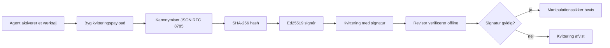
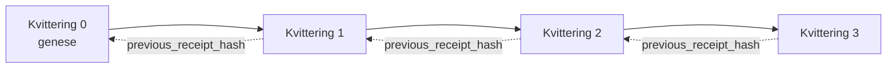

[Se lektionsvideoen: Sikring af AI-agenter med kryptografiske kvitteringer](https://youtu.be/PLACEHOLDER_VIDEO_ID)

> _(Lektionsvideo og miniaturebillede tilføjes af Microsofts indholdsteam efter sammenlægning, og matcher mønsteret for lektion 14 / 15.)_

# Sikring af AI-agenter med kryptografiske kvitteringer

## Introduktion

Denne lektion vil dække:

- Hvorfor revisionsspor for AI-agenter er vigtige for overholdelse, fejlfinding og tillid.
- Hvad en kryptografisk kvittering er, og hvordan den adskiller sig fra en usigneret loglinje.
- Hvordan man producerer en underskrevet kvittering for en agents værktøjskald i almindelig Python.
- Hvordan man verificerer en kvittering offline og opdager manipulation.
- Hvordan man kæder kvitteringer sammen, så fjernelse eller omrokering af en bryder kæden.
- Hvad kvitteringer beviser, og hvad de udtrykkeligt ikke beviser.

## Læringsmål

Efter at have gennemført denne lektion vil du vide, hvordan du:

- Identificerer fejltillstande, der motiverer kryptografisk oprindelse for agenthandlinger.
- Producerer en Ed25519-underskrevet kvittering over en kanonisk JSON-payload.
- Verificerer en kvittering uafhængigt ved kun at bruge underskriverens offentlige nøgle.
- Opdager manipulation ved at genkøre verifikation på en modificeret kvittering.
- Bygger en hash-kædet sekvens af kvitteringer og forklarer, hvorfor kæden betyder noget.
- Genkender grænsen mellem hvad kvitteringer beviser (attribution, integritet, rækkefølge) og hvad de ikke gør (korrekthed af handling, sundhed i politikken).

## Problemet: Din agents revisionsspor

Forestil dig, at du har implementeret en AI-agent for Contoso Travel. Agenten læser kundeforespørgsler, kalder et flyindeks-API for at slå muligheder op, og booker sæder på kundens vegne. Sidste kvartal behandlede agenten 50.000 bookinger.

I dag kommer en revisor. De stiller et simpelt spørgsmål: "Vis mig, hvad din agent gjorde."

Du afleverer dine logfiler. Revisoren kigger på dem og stiller det sværere spørgsmål: "Hvordan ved jeg, at disse logs ikke er blevet redigeret?"

Dette er revisionssporproblemet. De fleste agentimplementeringer i dag er afhængige af:

- **Applikationslogs**: skrevet af selve agenten, kan redigeres af enhver med filsystemadgang.
- **Cloud-loggingtjenester**: manipulations-synlige på platformniveau, men kun hvis revisoren stoler på platformoperatøren.
- **Database transaktionslogs**: velegnet til databaseændringer, men ikke til vilkårlige værktøjskald.

Ingen af disse kan besvare revisorens spørgsmål uden at kræve, at revisoren stoler på nogen (dig, din cloud-udbyder, din databaseleverandør). Til internt brug er den tillid ofte acceptabel. For regulerede arbejdsbelastninger (finans, sundhed, alt under EU AI-loven) er det ikke.

Kryptografiske kvitteringer løser dette ved at gøre hver agenthandling uafhængigt verificerbar. Revisor behøver ikke at stole på dig. De behøver kun din offentlige nøgle og selve kvitteringen.

## Hvad er en kryptografisk kvittering?

En kvittering er et JSON-objekt, der registrerer, hvad en agent gjorde, underskrevet med en digital signatur.


```mermaid
flowchart LR
    A[Agent aktiverer et værktøj] --> B[Byg kvitteringspayload]
    B --> C[Kanonymiser JSON RFC 8785]
    C --> D[SHA-256 hash]
    D --> E[Ed25519 signér]
    E --> F[Kvittering med signatur]
    F --> G[Revisor verificerer offline]
    G --> H{Signatur gyldig?}
    H -- ja --> I[Manipulationssikker bevis]
    H -- nej --> J[Kvittering afvist]
```

En minimal kvittering ser sådan ud:

```json
{
  "type": "agent.tool_call.v1",
  "agent_id": "contoso-travel-bot",
  "tool_name": "lookup_flights",
  "tool_args_hash": "sha256:a3f9c1...",
  "result_hash": "sha256:7b2e1d...",
  "policy_id": "contoso-travel-policy-v3",
  "timestamp": "2026-04-25T14:30:00Z",
  "sequence": 47,
  "previous_receipt_hash": "sha256:9d4e6a...",
  "signature": {
    "alg": "EdDSA",
    "sig": "c5af83...",
    "public_key": "8f3b2c..."
  }
}
```

Tre egenskaber udfører arbejdet:

1. **Signaturen**. Kvitteringen underskrives af agentens gateway ved brug af en Ed25519 privat nøgle. Enhver med den tilsvarende offentlige nøgle kan verificere signaturen offline. Manipulation af et vilkårligt felt ugyldiggør signaturen.

2. **Kanonisk kodning**. Før underskrivelse serialiseres kvitteringen ved hjælp af JSON Canonicalization Scheme (JCS, RFC 8785). Dette sikrer, at to implementeringer, der producerer den samme logiske kvittering, producerer byte-identisk output. Uden kanonisering ville forskellige JSON-serialisatorer producere forskellige signaturer for det samme indhold.

3. **Hash-kædning**. Feltet `previous_receipt_hash` forbinder hver kvittering til den foregående. Fjernelse eller omrokering af en kvittering bryder hver kvittering, der kom efter. Manipulation bliver synlig på kæde-niveau, selv hvis individuelle signaturer omgås.

Sammen giver disse egenskaber tre garantier:

- **Attribution**: denne nøgle underskrev dette indhold.
- **Integritet**: indholdet har ikke ændret sig siden underskrift.
- **Rækkefølge**: denne kvittering kom efter den kvittering i kæden.

## Produktion af en kvittering i Python

Du behøver ikke et særligt bibliotek for at producere en kvittering. De kryptografiske primitive funktioner er bredt tilgængelige, og logikken er få dusin linjer Python.

De praktiske øvelser i `code_samples/18-signed-receipts.ipynb` gennemgår hele flowet. Den korte version:

```python
import json
import hashlib
import base64
from nacl import signing
from jcs import canonicalize  # RFC 8785 kanonisk JSON

def b64url_nopad(data: bytes) -> str:
    return base64.urlsafe_b64encode(data).decode("ascii").rstrip("=")

def sha256_canonical(obj) -> str:
    """SHA-256 of a Python object's JCS-canonical JSON form."""
    return f"sha256:{hashlib.sha256(canonicalize(obj)).hexdigest()}"

# Generer eller indlæs en signeringsnøgle (i produktion, gem i en nøgleboks)
signing_key = signing.SigningKey.generate()
verify_key = signing_key.verify_key

# Byg kvitteringsindholdet (ingen signatur endnu)
tool_args = {"origin": "SYD", "destination": "LAX"}
tool_result = [{"flight": "QF11", "price": 1850, "stops": 0}]

payload = {
    "type": "agent.tool_call.v1",
    "agent_id": "contoso-travel-bot",
    "tool_name": "lookup_flights",
    "tool_args_hash": sha256_canonical(tool_args),
    "result_hash": sha256_canonical(tool_result),
    "policy_id": "contoso-travel-policy-v3",
    "timestamp": "2026-04-25T14:30:00Z",
    "sequence": 0,
    "previous_receipt_hash": None,
}

# Kanoniser, hash, signér.
canonical_bytes = canonicalize(payload)
message_hash = hashlib.sha256(canonical_bytes).digest()
signature_bytes = signing_key.sign(message_hash).signature

# Vedhæft et struktureret signaturobjekt.
receipt = {
    **payload,
    "signature": {
        "alg": "EdDSA",
        "sig": b64url_nopad(signature_bytes),
        "public_key": b64url_nopad(bytes(verify_key)),
    },
}
```

Det er den komplette underskrivningspipeline. Øvelserne i notebooken gennemgår hvert trin.

## Verificering af en kvittering og påvisning af manipulation

Verificering er den inverse operation:

```python
import base64
import hashlib
from nacl import signing
from nacl.exceptions import BadSignatureError
from jcs import canonicalize

def b64url_decode(s: str) -> bytes:
    padding = "=" * ((4 - len(s) % 4) % 4)
    return base64.urlsafe_b64decode(s + padding)

def verify_receipt(receipt: dict) -> bool:
    # Signaturen er et struktureret objekt: {"alg", "sig", "public_key"}.
    sig_obj = receipt.get("signature")
    if not sig_obj or sig_obj.get("alg") != "EdDSA":
        return False

    # Genskab den belastning, der faktisk blev signeret (alt undtagen signaturen).
    payload = {k: v for k, v in receipt.items() if k != "signature"}

    canonical_bytes = canonicalize(payload)
    message_hash = hashlib.sha256(canonical_bytes).digest()

    try:
        verify_key = signing.VerifyKey(b64url_decode(sig_obj["public_key"]))
        verify_key.verify(message_hash, b64url_decode(sig_obj["sig"]))
        return True
    except BadSignatureError:
        return False
```

Denne funktion tager en kvittering og returnerer `True`, hvis signaturen er gyldig, `False` ellers. Intet netværkskald, ingen tjenesteafhængighed, ingen tillid nødvendig til tredjepart.

For at se påvisning af manipulation i praksis gennemgår notebooken:

1. Produktion af en gyldig kvittering og bekræftelse af, at den verificeres.
2. Ændring af en enkelt byte i feltet `tool_args_hash`.
3. Genkørsel af verifikation og oplevelse af, at den fejler.

Dette er den praktiske demonstration af, at kvitteringer er manipulationssynlige: enhver ændring, uanset hvor lille, bryder signaturen.

## Kædning af kvitteringer for flerstegsagenter

En enkelt underskrevet kvittering beskytter én handling. En kæde af kvitteringer beskytter en sekvens.


```mermaid
flowchart LR
    R0[Kvittering 0<br/>genese] --> R1[Kvittering 1]
    R1 --> R2[Kvittering 2]
    R2 --> R3[Kvittering 3]
    R1 -. previous_receipt_hash .-> R0
    R2 -. previous_receipt_hash .-> R1
    R3 -. previous_receipt_hash .-> R2
```

Hver kvittering registrerer hash af den foregående kvittering. For at fjerne kvittering 2 stille og roligt, skulle en angriber enten:

- Ændre kvittering 3's `previous_receipt_hash` felt (bryder kvittering 3's signatur), ELLER
- Forge en ny signatur på en modificeret kvittering 3 (kræver agentens private nøgle).

Hvis den private nøgle er i en hardware-nøgleboks, og du offentliggør den offentlige nøgle med hver kvittering, er ingen af disse angreb mulige uden opdagelse.

Notebooken gennemgår:

1. At bygge en kæde på tre kvitteringer.
2. At verificere, at hver kvitterings `previous_receipt_hash` matcher den faktiske hash af den foregående kvittering.
3. At manipulere med en kvittering midt i kæden og se kæden bryde præcis dér.

Sådan producerer du et revisionsspor, som en ekstern revisor kan verificere uden at skulle stole på dig.

## Hvad kvitteringer beviser (og hvad de ikke gør)

Dette er den vigtigste sektion i denne lektion. Kvitteringer er kraftfulde, men deres kraft er begrænset.

**Kvitteringer beviser tre ting:**

1. **Attribution**: en specifik nøgle underskrev en specifik payload.
2. **Integritet**: payloaden har ikke ændret sig siden underskrift.
3. **Rækkefølge**: denne kvittering kom efter den kvittering i hash-kæden.

**Kvitteringer beviser IKKE:**

1. **Korrekthed**: at agentens handling var den rigtige handling. En kvittering kan underskrives for et forkert svar lige så let som for et rigtigt svar.
2. **Politikoverholdelse**: at politikken angivet i `policy_id` faktisk blev evalueret, eller at den ville have tilladt denne handling, hvis den blev kontrolleret. Kvitteringen registrerer, hvad der blev påstået, ikke hvad der blev håndhævet.
3. **Identitet ud over nøglen**: kvitteringen siger "denne nøgle underskrev dette indhold." Den siger ikke "denne person godkendte dette." For at forbinde en nøgle til en person eller organisation kræves separat identitetsinfrastruktur (et register, en offentlig nøgleregistrering osv.).
4. **Sandfærdighed af input**: hvis agenten modtager en manipuleret prompt og handler efter den, registrerer kvitteringen handlingen trofast. Kvitteringer er nedstrøms af inputvalidering, ikke en erstatning for den.

Denne grænse er vigtig af to grunde:

- Den fortæller, hvad kvitteringer er nyttige til: at gøre agentadfærd revisionsbar og manipulations-synlig, også på tværs af organisatoriske grænser.
- Den fortæller, hvilke yderligere lag du stadig har brug for: inputvalidering (Lektion 6), politikhåndhævelse (kort introduceret nedenfor), og identitetsinfrastruktur (uden for denne lektions omfang).

En almindelig fejl er at antage, at "vi har kvitteringer" betyder "vi er underlagt styring." Det gør det ikke. Kvitteringer er fundamentet. Styring er det system, du bygger ovenpå.

## Produktionsreferencer

Python-koden i denne lektion er bevidst minimal, så du kan læse hver linje og forstå præcis, hvad der sker. I produktion har du to muligheder:

1. **Byg direkte på de kryptografiske primitive.** De 50 linjer, du så ovenfor, er tilstrækkelige til mange anvendelser. PyNaCl (Ed25519) og `jcs`-pakken (kanonisk JSON) er velvedligeholdte og reviderede biblioteker.

2. **Brug et produktionskvitteringsbibliotek.** Flere open-source projekter implementerer det samme mønster med ekstra funktioner (nøglerotation, batchverifikation, JWK Set-distribution, integration med politikmotorer):
   - Kvitteringsformatet brugt i denne lektion følger et IETF Internet-Draft (`draft-farley-acta-signed-receipts`), som aktuelt er i standardiseringsprocessen.
   - Microsoft Agent Governance Toolkit kombinerer kvitteringer med Cedar-baserede politikbeslutninger; se Tutorial 33 i det repository for et ende-til-ende eksempel.
   - `protect-mcp` (npm) og `@veritasacta/verify` (npm) pakkerne giver en Node-baseret implementering af kvitteringssignering og offline verificering, beregnet til at omslutte enhver MCP-server med et manipulations-synligt revisionsspor.
   - **[nobulex](https://github.com/arian-gogani/nobulex)** Python SDK (`pip install nobulex`) leverer det samme Ed25519 + JCS underskrivningsmønster i Python med LangChain og CrewAI integrationer, inklusive publicerede tværvaliderings testvektorer og en compliance-mapping bidraget via [OWASP PR #2210](https://github.com/OWASP/CheatSheetSeries/pull/2210).

Valget mellem at bygge selv og bruge et bibliotek svarer til valget mellem at skrive dit eget JWT-bibliotek og bruge et testet: begge er rimelige; biblioteket sparer tid og reducerer revisionsfladen; selvbygget tvinger dig til at forstå alle primitive. Denne lektion lærer selvbygget-tilgangen, så du har fundamentet for begge valg.

## Videnscheck

Test din forståelse, før du går videre til praksisøvelsen.

**1. En kvittering er underskrevet med agentens private Ed25519-nøgle. Revisor har kun den offentlige nøgle. Kan revisor verificere kvitteringen offline?**

<details>
<summary>Svar</summary>

Ja. Ed25519-verifikation kræver kun den offentlige nøgle og de underskrevne bytes. Intet netværkskald, ingen tjenesteafhængighed. Dette er egenskaben, der gør kvitteringer nyttige i luftafskårne, multi-organisatoriske eller lavtillids revisionsmiljøer.
</details>

**2. En angriber ændrer `policy_id`-feltet på en kvittering for at hævde, at den var underlagt en mere permissiv politik. Signaturen var over det oprindelige payload. Hvad sker der ved verifikation?**

<details>
<summary>Svar</summary>

Verifikationen fejler. Signaturen blev beregnet over de kanoniske bytes af det oprindelige payload; at ændre et hvilket som helst felt ændrer de kanoniske bytes, hvilket ændrer SHA-256 hashen, hvilket gør signaturen ugyldig. Angriberen ville skulle have den private nøgle for at producere en frisk gyldig signatur, hvilket de ikke har.
</details>

**3. Hvorfor inkluderer kvitteringen et `tool_args_hash` og et `result_hash` i stedet for de rå argumenter og resultater?**

<details>
<summary>Svar</summary>

To grunde. For det første kan kvitteringen skulle arkiveres eller overføres i miljøer, hvor lækage af råt indhold (persondata, forretningsdata) er et problem. Hashing holder kvitteringen lille og indholdet privat; revisor verificerer, at hashen matcher en separat opbevaret kopi af det faktiske indhold. For det andet har hashes en fast størrelse; en kvittering med hashes er begrænset i størrelse uanset input- og output-størrelsen.
</details>

**4. Feltet `previous_receipt_hash` forbinder hver kvittering til sin forgænger. Hvis en angriber stille og roligt sletter en kvittering midt i en kæde, hvad bliver ugyldigt?**

<details>
<summary>Svar</summary>

Hver kvittering, der kom efter den slettede. Deres `previous_receipt_hash`-felter matcher ikke længere den faktiske kæde (fordi den kvittering, de refererede til, ikke længere eksisterer, eller kæden peger nu på en anden forgænger). For at skjule sletningen skulle angriberen gensignere hver efterfølgende kvittering, hvilket kræver den private nøgle.
</details>

**5. En kvittering verificeres ren. Beviser det, at agentens handling var korrekt, lydig eller i overensstemmelse med politik?**

<details>
<summary>Svar</summary>

Nej. En gyldig kvittering beviser tre ting: attribution (denne nøgle underskrev dette indhold), integritet (indholdet har ikke ændret sig), og rækkefølge (denne kvittering kom efter den anden). Den beviser IKKE, at handlingen var korrekt, at politikken nævnt i `policy_id` faktisk blev evalueret, eller at agenten fulgte alle regler. Kvitteringer gør agentadfærd revisionsbar, ikke nødvendigvis korrekt. Dette er den vigtigste grænse i lektionen.
</details>

## Praksisøvelse

Åbn `code_samples/18-signed-receipts.ipynb` og gennemfør alle fire sektioner:

1. **Sektion 1**: Underskriv din første kvittering og verificer den.
2. **Sektion 2**: Manipulér kvitteringen og observer at verifikation fejler.
3. **Sektion 3**: Byg en kæde af tre kvitteringer og verificer kædens integritet.
4. **Sektion 4**: Anvend mønstret på en agent bygget med Microsoft Agent Framework: indpak et værktøjskald i kvitterings-underskrivning, og verificer derefter kvitteringen uafhængigt.
**Udvidelsesudfordring 1:** udvid kvitteringsskemaet med et ekstra felt efter eget valg (for eksempel et anmodnings-ID til sporing), opdater den kanoniske signeringslogik til at inkludere det, og bekræft at kvitteringen stadig kan gennemgå verifikation. Modificer derefter feltet efter signering og bekræft, at verifikationen fejler. Dette tvinger dig til at forstå, hvordan hver enkelt byte af den kanoniske kodning bidrager til signaturen.

**Udvidelsesudfordring 2:** SHA-256-hash to af dine kvitteringer sammen (kæd deres kanoniske bytes sammen i en deterministisk rækkefølge) og indlejre den resulterende digest som et nyt felt på en tredje kvittering før signering. Bekræft at alle tre kvitteringer stadig kan verificeres. Du har netop konstrueret et et-trins inklusionsbevis: enhver, som har den tredje kvittering, kan bevise, at de to første eksisterede på det tidspunkt, den blev signeret, uden at skulle afsløre deres indhold. Dette er det mønster, som selective-disclosure kvitteringer bruger i stor skala (Merkle-commitments, RFC 6962).

## Konklusion

Kryptografiske kvitteringer giver AI-agenter et revisionsspor, der er:

- **Uafhængigt verificerbart**: enhver part med den offentlige nøgle kan verificere, uden afhængighed af en tjeneste.
- **Manipulationssikkert**: enhver ændring ugyldiggør signaturen.
- **Portabelt**: en kvittering er en lille JSON-fil; den kan arkiveres, overføres og verificeres overalt.
- **Standardtilpasset**: bygget på Ed25519 (RFC 8032), JCS (RFC 8785), og SHA-256, alle bredt anvendte primitive.

De er ikke en erstatning for inputvalidering, politikhåndhævelse eller identitetsinfrastruktur. De er en grundsten for disse lag. Når du implementerer agenter i regulerede arbejdsmiljøer, tværorganisatoriske workflows eller i enhver situation, hvor en fremtidig revisor ikke kan antages at stole på dig, er kvitteringer den måde, du sikrer, at revisionssporet er ærligt.

Den vigtigste konklusion: kvitteringer beviser, hvem der sagde hvad, hvornår. De beviser ikke, at det sagte var sandt eller rigtigt. Hold denne sondring skarp. Det er forskellen på et ærligt provenienssystem og et vildledende.

## Produktionscheckliste

Når du er klar til at gå videre fra denne lektion til at implementere kvitteringssignerede agenter i et rigtigt miljø:

- [ ] **Flyt signeringsnøglen væk fra udviklerens bærbare.** Brug Azure Key Vault, AWS KMS eller en hardware-sikkerhedsmodul. Den private nøgle, der signerer dine kvitteringer, må aldrig leve i versionskontrol eller i klartekst på applikationsmaskiner.
- [ ] **Publicer den offentlige verifikationsnøgle.** Revisorer har brug for den til offline verifikation. Det standardiserede mønster er et JWK Set på en kendt URL (RFC 7517), f.eks. `https://your-org.example.com/.well-known/agent-keys.json`.
- [ ] **Forankr kædehovedet eksternt.** Skriv periodisk den seneste kædehovedhash til en transparenslog (Sigstore Rekor, RFC 3161 tidsstempelmyndighed eller et andet internt system), så en ekstern part kan bekræfte "dette kæde eksisterede på dette tidspunkt."
- [ ] **Gem kvitteringer uforanderligt.** Append-only blob storage (Azure Storage med uforanderlighedspolitikker, AWS S3 Object Lock) forhindrer en insider i at omskrive historien på lagringslaget.
- [ ] **Beslut om opbevaringsperiode.** Mange compliance-regimer kræver flerårig opbevaring. Planlæg for vækst i kvitteringer (hver kvittering er ~500 bytes; en agent, der laver 10.000 kald om dagen, genererer ca. 1,8 GB om året).
- [ ] **Dokumentér, hvad kvitteringer ikke dækker.** Kvitteringer beviser tilskrivning, integritet og rækkefølge. Din køreplan bør eksplicit liste, hvilke yderligere kontroller (inputvalidering, politikhåndhævelse, ratebegrænsning, identitetsinfrastruktur) der er sideordnet med kvitteringer i din governance.

### Har du flere spørgsmål om sikring af AI-agenter?

Deltag i [Microsoft Foundry Discord](https://aka.ms/ai-agents/discord) for at møde andre lærende, deltage i kontortimer og få svar på dine AI Agent-spørgsmål.

## Udover denne lektion

Denne lektion dækker enkeltkvitteringssignering og hash-kædede sekvenser. De samme primære elementer sammensættes i flere mere avancerede mønstre, du kan møde, efterhånden som din governance modnes:

- **Selective disclosure.** Når et kvitteringsfelts felter er uafhængigt forpligtede (RFC 6962-agtig Merkle-træ), kan du afsløre specifikke felter til specifikke revisorer og bevise, at resten er uændret uden at eksponere dem. Nyttigt når den samme kvittering skal imødekomme både en omfattende revision (som ønsker fuldstændighed) og dataminimeringsregler som GDPR (der ønsker, at revisoren kun ser det nødvendige).
- **Tilbagekaldelse af kvitteringer.** Hvis en signeringsnøgle kompromitteres, har du brug for en måde at markere alle kvitteringer signeret med den nøgle som utroværdige fra et bestemt tidspunkt og frem. Standardmønstre: kortlivede signeringsnøgler plus en offentlig tilbagekaldelsesliste, eller en transparenslog med tilbagekaldelsesposter.
- **Bilaterale / delte signaturkvitteringer.** Nogle implementeringer deler den signerede belastning i pre-eksekverings- (`authorization_*`) og post-eksekverings- (`result_*`) halvdele med uafhængige signaturer, nyttigt når autorisationsbeslutningen og det observerede resultat produceres af forskellige aktører eller på forskellige tidspunkter. Dette bygger ovenpå kvitteringsformatet undervist i denne lektion.
- **Sammensætning af payload.** En kvittering forsegler de bytes, du placerer i `result_hash`. Virkelige payloads er ofte rigere end et enkelt værktøjskald: præ-beslutningsbegrundelser (modelprediction, overvejede muligheder, beviser og deres fuldstændighed, risikoposition, ansvarskæde, portresultat) kan alle leve inden i payloaden, forseglet af en enkelt kvittering. Det holder kvitteringsformatet minimalt, mens payloadskemaer kan udvikle sig domæne-for-domæne.
- **Tværimplementeringskonformitet.** Flere uafhængige implementeringer af samme kvitteringsformat (Python, TypeScript, Rust, Go) krydsverificeres mod delte testvektorer. Hvis du bygger din egen implementering, bekræfter validering mod offentliggjorte vektorer kompatibilitet.
- **Post-kvantemigration.** Ed25519 er bredt udbredt i dag, men er ikke kvante-resistent. Kvitteringsformatet er algoritme-agilt: `signature.alg`-feltet kan bære `ML-DSA-65` (NIST post-kvante signaturstandard), når du skal migrere. Planlæg en overgangsperiode, hvor kvitteringer er dobbelt-signerede.

## Yderligere ressourcer

- <a href="https://datatracker.ietf.org/doc/draft-farley-acta-signed-receipts/" target="_blank">IETF Internet-Draft: Signed Decision Receipts for Machine-to-Machine Access Control</a>
- <a href="https://learn.microsoft.com/azure/ai-studio/responsible-use-of-ai-overview" target="_blank">Responsible AI oversigt (Azure AI)</a>
- <a href="https://datatracker.ietf.org/doc/html/rfc8032" target="_blank">RFC 8032: Edwards-Curve Digital Signature Algorithm (EdDSA)</a>
- <a href="https://datatracker.ietf.org/doc/html/rfc8785" target="_blank">RFC 8785: JSON Canonicalization Scheme (JCS)</a>
- <a href="https://datatracker.ietf.org/doc/html/rfc6962" target="_blank">RFC 6962: Certificate Transparency</a> (Merkle-trækonstruktion brugt af selective-disclosure kvitteringer)
- <a href="https://github.com/microsoft/agent-governance-toolkit/blob/main/docs/tutorials/33-offline-verifiable-receipts.md" target="_blank">Microsoft Agent Governance Toolkit, tutorial 33: Offline-Verifiable Decision Receipts</a>
- <a href="https://github.com/ScopeBlind/agent-governance-testvectors" target="_blank">Tværimplementerings konformitetstestvektorer</a> for kvitteringsformatet brugt i denne lektion (Apache-2.0)
- <a href="https://pynacl.readthedocs.io/" target="_blank">PyNaCl dokumentation</a> (Ed25519 i Python)

## Forrige lektion

[Building Computer Use Agents (CUA)](../15-browser-use/README.md)

---

<!-- CO-OP TRANSLATOR DISCLAIMER START -->
**Ansvarsfraskrivelse**:
Dette dokument er blevet oversat ved hjælp af AI-oversættelsestjenesten [Co-op Translator](https://github.com/Azure/co-op-translator). Selvom vi bestræber os på nøjagtighed, skal du være opmærksom på, at automatiserede oversættelser kan indeholde fejl eller unøjagtigheder. Det originale dokument på dets oprindelige sprog bør betragtes som den autoritative kilde. For kritisk information anbefales professionel menneskelig oversættelse. Vi påtager os intet ansvar for misforståelser eller fejltolkninger, der opstår som følge af brugen af denne oversættelse.
<!-- CO-OP TRANSLATOR DISCLAIMER END -->