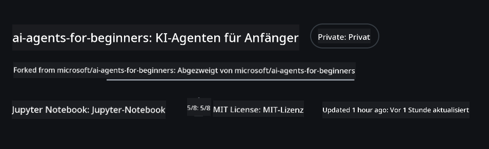
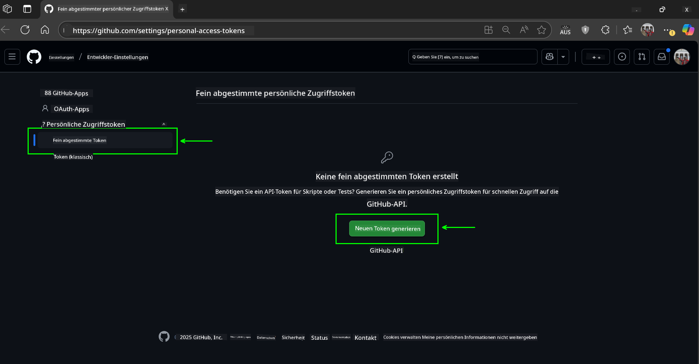
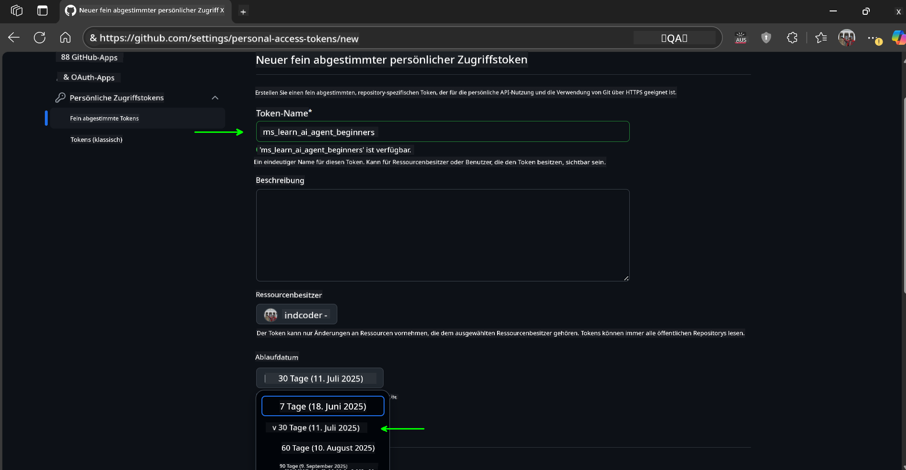
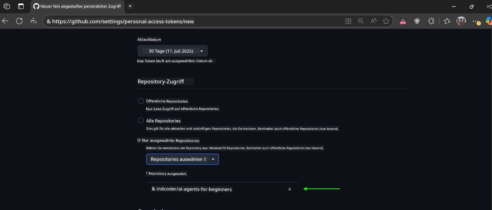
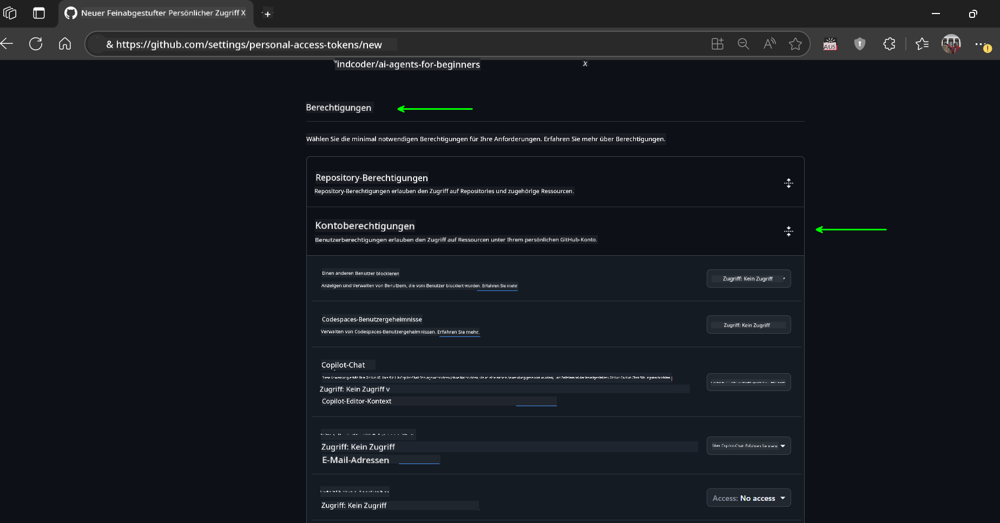
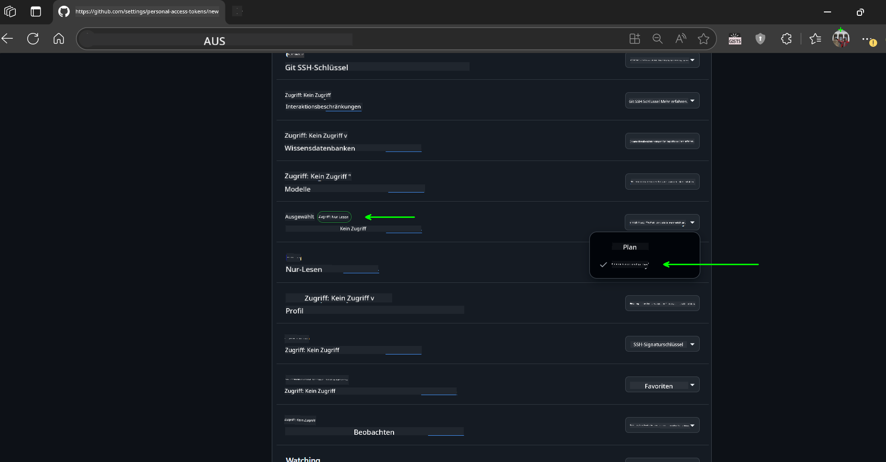
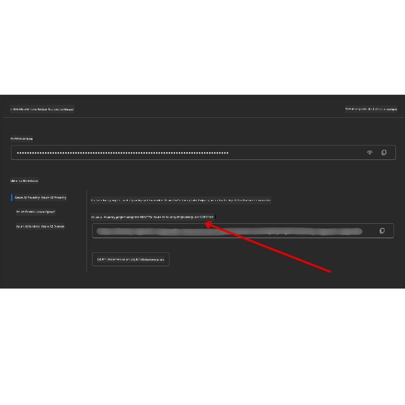

<!--
CO_OP_TRANSLATOR_METADATA:
{
  "original_hash": "c6a79c8f2b56a80370ff7e447765524f",
  "translation_date": "2025-07-24T07:34:58+00:00",
  "source_file": "00-course-setup/README.md",
  "language_code": "de"
}
-->
# Kurseinrichtung

## Einführung

In dieser Lektion erfahren Sie, wie Sie die Codebeispiele dieses Kurses ausführen können.

## Dieses Repository klonen oder forken

Um zu beginnen, klonen oder forken Sie bitte das GitHub-Repository. Dadurch erhalten Sie Ihre eigene Version des Kursmaterials, mit der Sie den Code ausführen, testen und anpassen können!

Dies kann durch Klicken auf den Link zu

Sie sollten nun Ihre eigene geforkte Version dieses Kurses unter folgendem Link haben:



## Den Code ausführen

Dieser Kurs bietet eine Reihe von Jupyter-Notebooks, die Sie ausführen können, um praktische Erfahrungen beim Erstellen von KI-Agenten zu sammeln.

Die Codebeispiele verwenden entweder:

**Erfordert ein GitHub-Konto - Kostenlos**:

1) Semantic Kernel Agent Framework + GitHub Models Marketplace. Beschriftet als (semantic-kernel.ipynb)  
2) AutoGen Framework + GitHub Models Marketplace. Beschriftet als (autogen.ipynb)  

**Erfordert ein Azure-Abonnement**:  
3) Azure AI Foundry + Azure AI Agent Service. Beschriftet als (azureaiagent.ipynb)  

Wir empfehlen Ihnen, alle drei Arten von Beispielen auszuprobieren, um herauszufinden, welche für Sie am besten geeignet ist.

Die von Ihnen gewählte Option bestimmt, welche Einrichtungsschritte Sie unten befolgen müssen:

## Anforderungen

- Python 3.12+  
  - **HINWEIS**: Wenn Sie Python 3.12 nicht installiert haben, stellen Sie sicher, dass Sie es installieren. Erstellen Sie dann Ihre virtuelle Umgebung (venv) mit python3.12, um sicherzustellen, dass die richtigen Versionen aus der Datei requirements.txt installiert werden.  
- Ein GitHub-Konto - Für den Zugriff auf den GitHub Models Marketplace  
- Azure-Abonnement - Für den Zugriff auf Azure AI Foundry  
- Azure AI Foundry-Konto - Für den Zugriff auf den Azure AI Agent Service  

Wir haben eine `requirements.txt`-Datei im Stammverzeichnis dieses Repositories beigefügt, die alle erforderlichen Python-Pakete enthält, um die Codebeispiele auszuführen.

Sie können diese installieren, indem Sie den folgenden Befehl in Ihrem Terminal im Stammverzeichnis des Repositories ausführen:

```bash
pip install -r requirements.txt
```  
Wir empfehlen, eine Python-virtuelle Umgebung zu erstellen, um Konflikte und Probleme zu vermeiden.

## VSCode einrichten

Stellen Sie sicher, dass Sie die richtige Python-Version in VSCode verwenden.


## Einrichtung für Beispiele mit GitHub-Modellen

### Schritt 1: Abrufen Ihres GitHub Personal Access Token (PAT)

Dieser Kurs nutzt den GitHub Models Marketplace, der kostenlosen Zugriff auf Large Language Models (LLMs) bietet, die Sie zum Erstellen von KI-Agenten verwenden werden.

Um die GitHub-Modelle zu nutzen, müssen Sie ein [GitHub Personal Access Token](https://docs.github.com/en/authentication/keeping-your-account-and-data-secure/managing-your-personal-access-tokens) erstellen.

Dies kann durch Aufrufen Ihres GitHub-Kontos erfolgen.

Bitte folgen Sie dem [Prinzip der minimalen Rechtevergabe](https://docs.github.com/en/get-started/learning-to-code/storing-your-secrets-safely), wenn Sie Ihr Token erstellen. Das bedeutet, dass Sie dem Token nur die Berechtigungen geben sollten, die es benötigt, um die Codebeispiele in diesem Kurs auszuführen.

1. Wählen Sie auf der linken Seite Ihrer Bildschirmansicht die Option `Fine-grained tokens`.

    Wählen Sie dann `Generate new token`.

    

1. Geben Sie Ihrem Token einen beschreibenden Namen, der seinen Zweck widerspiegelt, damit Sie es später leicht identifizieren können. Legen Sie ein Ablaufdatum fest (empfohlen: 30 Tage; Sie können auch eine kürzere Dauer wie 7 Tage wählen, wenn Sie eine sicherere Vorgehensweise bevorzugen).

    

1. Beschränken Sie den Geltungsbereich des Tokens auf Ihren Fork dieses Repositories.

    

1. Beschränken Sie die Berechtigungen des Tokens: Unter **Permissions** aktivieren Sie **Account Permissions**, navigieren zu **Models** und aktivieren nur den erforderlichen Lesezugriff für GitHub-Modelle.

    

    

Kopieren Sie Ihr neu erstelltes Token. Sie werden es nun zu Ihrer `.env`-Datei hinzufügen, die in diesem Kurs enthalten ist.

### Schritt 2: Erstellen Ihrer `.env`-Datei

Um Ihre `.env`-Datei zu erstellen, führen Sie den folgenden Befehl in Ihrem Terminal aus:

```bash
cp .env.example .env
```

Dies kopiert die Beispieldatei und erstellt eine `.env`-Datei in Ihrem Verzeichnis, in der Sie die Werte für die Umgebungsvariablen eintragen.

Öffnen Sie mit Ihrem kopierten Token die `.env`-Datei in Ihrem bevorzugten Texteditor und fügen Sie Ihr Token in das Feld `GITHUB_TOKEN` ein.

Sie sollten nun in der Lage sein, die Codebeispiele dieses Kurses auszuführen.

## Einrichtung für Beispiele mit Azure AI Foundry und Azure AI Agent Service

### Schritt 1: Abrufen Ihres Azure-Projektendpunkts

Befolgen Sie die Schritte zum Erstellen eines Hubs und Projekts in Azure AI Foundry, die hier beschrieben sind: [Hub-Ressourcenübersicht](https://learn.microsoft.com/en-us/azure/ai-foundry/concepts/ai-resources)

Sobald Sie Ihr Projekt erstellt haben, müssen Sie die Verbindungszeichenfolge für Ihr Projekt abrufen.

Dies kann auf der **Übersichtsseite** Ihres Projekts im Azure AI Foundry-Portal erfolgen.



### Schritt 2: Erstellen Ihrer `.env`-Datei

Um Ihre `.env`-Datei zu erstellen, führen Sie den folgenden Befehl in Ihrem Terminal aus:

```bash
cp .env.example .env
```

Dies kopiert die Beispieldatei und erstellt eine `.env`-Datei in Ihrem Verzeichnis, in der Sie die Werte für die Umgebungsvariablen eintragen.

Öffnen Sie mit Ihrem kopierten Token die `.env`-Datei in Ihrem bevorzugten Texteditor und fügen Sie Ihr Token in das Feld `PROJECT_ENDPOINT` ein.

### Schritt 3: Anmeldung bei Azure

Als Sicherheitsbest-Practice verwenden wir [schlüssellose Authentifizierung](https://learn.microsoft.com/azure/developer/ai/keyless-connections?tabs=csharp%2Cazure-cli?WT.mc_id=academic-105485-koreyst), um uns bei Azure OpenAI mit Microsoft Entra ID zu authentifizieren.

Öffnen Sie als Nächstes ein Terminal und führen Sie `az login --use-device-code` aus, um sich bei Ihrem Azure-Konto anzumelden.

Sobald Sie angemeldet sind, wählen Sie Ihr Abonnement im Terminal aus.

## Zusätzliche Umgebungsvariablen - Azure Search und Azure OpenAI

Für die Agentic RAG-Lektion - Lektion 5 - gibt es Beispiele, die Azure Search und Azure OpenAI verwenden.

Wenn Sie diese Beispiele ausführen möchten, müssen Sie die folgenden Umgebungsvariablen zu Ihrer `.env`-Datei hinzufügen:

### Übersichtsseite (Projekt)

- `AZURE_SUBSCRIPTION_ID` - Überprüfen Sie **Projektdetails** auf der **Übersichtsseite** Ihres Projekts.

- `AZURE_AI_PROJECT_NAME` - Schauen Sie oben auf der **Übersichtsseite** Ihres Projekts nach.

- `AZURE_OPENAI_SERVICE` - Finden Sie dies im Tab **Eingeschlossene Funktionen** für **Azure OpenAI Service** auf der **Übersichtsseite**.

### Management Center

- `AZURE_OPENAI_RESOURCE_GROUP` - Gehen Sie zu **Projekteigenschaften** auf der **Übersichtsseite** des **Management Centers**.

- `GLOBAL_LLM_SERVICE` - Unter **Verbundene Ressourcen** finden Sie den Verbindungsnamen für **Azure AI Services**. Falls nicht aufgeführt, überprüfen Sie das **Azure-Portal** unter Ihrer Ressourcengruppe nach dem Ressourcennamen der AI Services.

### Modelle + Endpunkte-Seite

- `AZURE_OPENAI_EMBEDDING_DEPLOYMENT_NAME` - Wählen Sie Ihr Embedding-Modell (z. B. `text-embedding-ada-002`) und notieren Sie den **Bereitstellungsnamen** aus den Modelldetails.

- `AZURE_OPENAI_CHAT_DEPLOYMENT_NAME` - Wählen Sie Ihr Chat-Modell (z. B. `gpt-4o-mini`) und notieren Sie den **Bereitstellungsnamen** aus den Modelldetails.

### Azure-Portal

- `AZURE_OPENAI_ENDPOINT` - Suchen Sie nach **Azure AI Services**, klicken Sie darauf, gehen Sie dann zu **Ressourcenverwaltung**, **Schlüssel und Endpunkt**, scrollen Sie zu den "Azure OpenAI-Endpunkten" und kopieren Sie den, der "Language APIs" sagt.

- `AZURE_OPENAI_API_KEY` - Kopieren Sie auf demselben Bildschirm SCHLÜSSEL 1 oder SCHLÜSSEL 2.

- `AZURE_SEARCH_SERVICE_ENDPOINT` - Finden Sie Ihre **Azure AI Search**-Ressource, klicken Sie darauf und sehen Sie **Übersicht**.

- `AZURE_SEARCH_API_KEY` - Gehen Sie dann zu **Einstellungen** und dann **Schlüssel**, um den primären oder sekundären Administrationsschlüssel zu kopieren.

### Externe Webseite

- `AZURE_OPENAI_API_VERSION` - Besuchen Sie die Seite [API-Version-Lebenszyklus](https://learn.microsoft.com/en-us/azure/ai-services/openai/api-version-deprecation#latest-ga-api-release) unter **Neueste GA-API-Version**.

### Schlüssellose Authentifizierung einrichten

Anstatt Ihre Anmeldeinformationen fest zu codieren, verwenden wir eine schlüssellose Verbindung mit Azure OpenAI. Dazu importieren wir `DefaultAzureCredential` und rufen später die Funktion `DefaultAzureCredential` auf, um die Anmeldeinformationen zu erhalten.

```python
from azure.identity import DefaultAzureCredential, InteractiveBrowserCredential
```

## Irgendwo festgefahren?

Wenn Sie Probleme bei der Einrichtung haben, treten Sie unserem

## Nächste Lektion

Sie sind nun bereit, den Code für diesen Kurs auszuführen. Viel Spaß beim Lernen über die Welt der KI-Agenten!

[Einführung in KI-Agenten und Anwendungsfälle](../01-intro-to-ai-agents/README.md)

**Haftungsausschluss**:  
Dieses Dokument wurde mit dem KI-Übersetzungsdienst [Co-op Translator](https://github.com/Azure/co-op-translator) übersetzt. Obwohl wir uns um Genauigkeit bemühen, beachten Sie bitte, dass automatisierte Übersetzungen Fehler oder Ungenauigkeiten enthalten können. Das Originaldokument in seiner ursprünglichen Sprache sollte als maßgebliche Quelle betrachtet werden. Für kritische Informationen wird eine professionelle menschliche Übersetzung empfohlen. Wir übernehmen keine Haftung für Missverständnisse oder Fehlinterpretationen, die sich aus der Nutzung dieser Übersetzung ergeben.