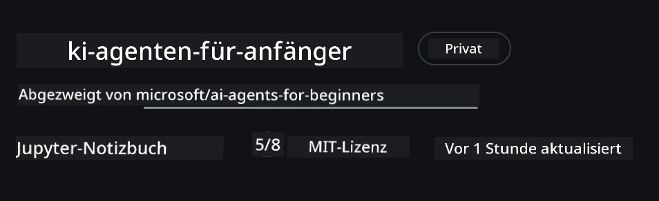
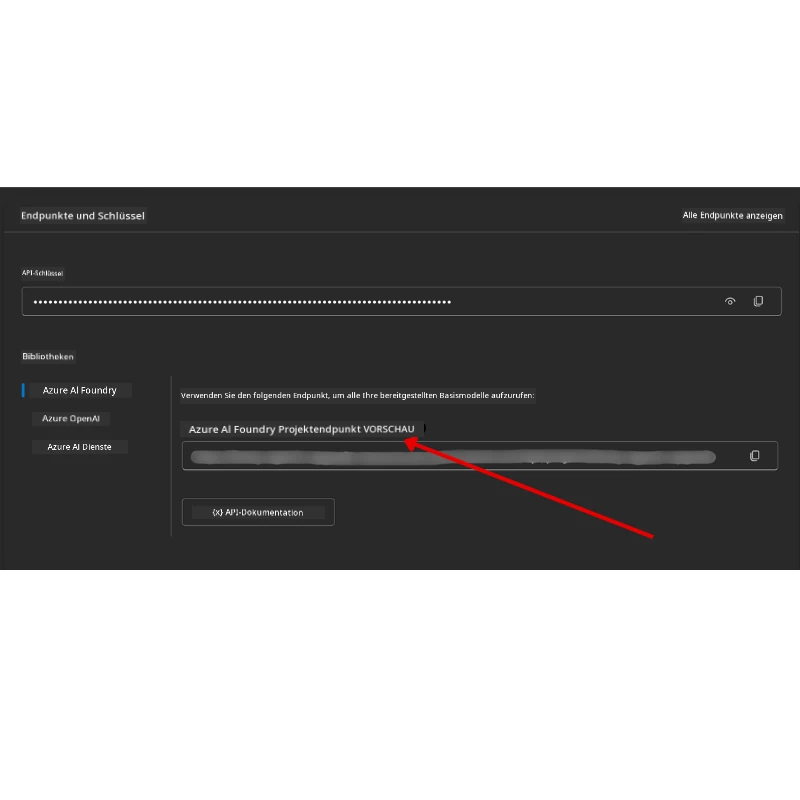

# Kurseinrichtung

## Einführung

Diese Lektion behandelt, wie Sie die Codebeispiele dieses Kurses ausführen.

## Treten Sie anderen Lernenden bei und erhalten Sie Hilfe

Bevor Sie Ihr Repository klonen, treten Sie dem [AI Agents For Beginners Discord-Kanal](https://aka.ms/ai-agents/discord) bei, um Hilfe beim Setup zu erhalten, Fragen zum Kurs zu stellen oder sich mit anderen Lernenden zu vernetzen.

## Klonen oder Forken Sie dieses Repository

Zum Start klonen oder forken Sie bitte das GitHub-Repository. So erhalten Sie Ihre eigene Version des Kursmaterials, die Sie ausführen, testen und anpassen können!

Dies können Sie tun, indem Sie auf den Link klicken, um <a href="https://github.com/microsoft/ai-agents-for-beginners/fork" target="_blank">das Repository zu forken</a>

Sie sollten nun Ihre eigene geforkte Version dieses Kurses unter folgendem Link haben:



### Shallow Clone (empfohlen für Workshop / Codespaces)

  >Das vollständige Repository kann groß sein (~3 GB), wenn Sie den gesamten Verlauf und alle Dateien herunterladen. Wenn Sie nur am Workshop teilnehmen oder nur einige Lektionen benötigen, lädt ein Shallow Clone (oder Sparse Clone) deutlich weniger herunter.

#### Schneller Shallow Clone — minimale Historie, alle Dateien

Ersetzen Sie `<your-username>` in den folgenden Befehlen durch Ihre Fork-URL (oder die Upstream-URL, wenn gewünscht).

Um nur den neuesten Commit-Verlauf zu klonen (kleiner Download):

```bash
git clone --depth 1 https://github.com/<your-username>/ai-agents-for-beginners.git
```

Um einen bestimmten Branch zu klonen:

```bash
git clone --depth 1 --branch <branch-name> https://github.com/<your-username>/ai-agents-for-beginners.git
```

#### Partieller (Sparse) Clone — minimale Blobs + nur ausgewählte Ordner

Dies verwendet Partial Clone und Sparse-Checkout (erfordert Git 2.25+ und wird mit modernem Git mit Partial Clone-Unterstützung empfohlen):

```bash
git clone --depth 1 --filter=blob:none --sparse https://github.com/<your-username>/ai-agents-for-beginners.git
```

Navigieren Sie in den Repo-Ordner:

```bash
cd ai-agents-for-beginners
```

Dann geben Sie an, welche Ordner Sie möchten (Beispiel zeigt zwei Ordner):

```bash
git sparse-checkout set 00-course-setup 01-intro-to-ai-agents
```

Nach dem Klonen und der Überprüfung der Dateien, wenn Sie nur Dateien benötigen und Speicherplatz freigeben möchten (keine Git-Historie), löschen Sie bitte die Repository-Metadaten (💀 irreversibel — Sie verlieren alle Git-Funktionalität):

```bash
# zsh/bash
rm -rf .git
```

```powershell
# PowerShell
Remove-Item -Recurse -Force .git
```

#### Verwendung von GitHub Codespaces (empfohlen, um lokale große Downloads zu vermeiden)

- Erstellen Sie einen neuen Codespace für dieses Repo über die [GitHub UI](https://github.com/codespaces).  

- Führen Sie im Terminal des neu erstellten Codespace einen der oben genannten Shallow-/Sparse-Clone-Befehle aus, um nur die benötigten Lektionen-Ordner in den Codespace-Arbeitsbereich zu holen.
- Optional: Entfernen Sie nach dem Klonen in Codespaces `.git`, um zusätzlichen Speicherplatz freizugeben (siehe oben die Löschbefehle).
- Hinweis: Wenn Sie das Repo direkt in Codespaces öffnen möchten (ohne einen zusätzlichen Klon), beachten Sie, dass Codespaces die Devcontainer-Umgebung erstellt und möglicherweise mehr bereitstellt, als Sie benötigen.

#### Tipps

- Ersetzen Sie immer die Klon-URL mit Ihrer Fork, wenn Sie bearbeiten/committen möchten.
- Wenn Sie später mehr Historie oder Dateien benötigen, können Sie diese abrufen oder Sparse-Checkout anpassen, um weitere Ordner einzuschließen.

## Code ausführen

Dieser Kurs bietet eine Reihe von Jupyter Notebooks, mit denen Sie praktische Erfahrungen im Aufbau von AI Agents sammeln können.

Die Codebeispiele verwenden das **Microsoft Agent Framework (MAF)** mit dem `FoundryChatClient`, der sich mit **Microsoft Foundry Agent Service V2** (der Responses API) über **Microsoft Foundry** verbindet.

Alle Python-Notebooks sind mit `*-python-agent-framework.ipynb` gekennzeichnet.

## Anforderungen

- Python 3.12+
  - **HINWEIS**: Wenn Sie Python 3.12 nicht installiert haben, stellen Sie sicher, dass Sie es installieren. Erstellen Sie dann Ihr venv mit python3.12, um sicherzustellen, dass die korrekten Versionen aus der requirements.txt installiert werden.
  
    >Beispiel

    Erstellen Sie das Python venv-Verzeichnis:

    ```bash
    python -m venv venv
    ```

    Aktivieren Sie dann die venv-Umgebung für:

    ```bash
    # zsh/bash
    source venv/bin/activate
    ```
  
    ```dos
    # Command Prompt for Windows
    venv\Scripts\activate
    ```

- .NET 10+: Für die Beispielcodes, die .NET verwenden, stellen Sie sicher, dass Sie [.NET 10 SDK](https://dotnet.microsoft.com/download/dotnet/10.0) oder neuer installiert haben. Überprüfen Sie dann Ihre installierte .NET SDK-Version:

    ```bash
    dotnet --list-sdks
    ```

- **Azure CLI** — Erforderlich für die Authentifizierung. Installation unter [aka.ms/installazurecli](https://aka.ms/installazurecli).
- **Azure Subscription** — Für den Zugriff auf Microsoft Foundry und Microsoft Foundry Agent Service.
- **Microsoft Foundry Projekt** — Ein Projekt mit einem bereitgestellten Modell (z. B. `gpt-5-mini`). Siehe [Schritt 1](#schritt-1-erstellen-sie-ein-microsoft-foundry-projekt) unten.

Im Root dieses Repositories haben wir eine `requirements.txt` Datei hinzugefügt, die alle erforderlichen Python-Pakete zum Ausführen der Codebeispiele enthält.

Sie können sie installieren, indem Sie im Terminal im Root des Repositories den folgenden Befehl ausführen:

```bash
pip install -r requirements.txt
```

Wir empfehlen, eine Python-virtuelle Umgebung zu erstellen, um Konflikte und Probleme zu vermeiden.

## VSCode einrichten

Stellen Sie sicher, dass Sie in VSCode die richtige Python-Version verwenden.


## Microsoft Foundry und Microsoft Foundry Agent Service einrichten

### Schritt 1: Erstellen Sie ein Microsoft Foundry Projekt

Für das Ausführen der Notebooks benötigen Sie ein Microsoft Foundry **Hub** und **Projekt** mit einem bereitgestellten Modell.

1. Gehen Sie zu [ai.azure.com](https://ai.azure.com) und melden Sie sich mit Ihrem Azure-Konto an.
2. Erstellen Sie ein **Hub** (oder verwenden Sie ein vorhandenes). Siehe: [Hub-Ressourcenübersicht](https://learn.microsoft.com/azure/ai-foundry/concepts/ai-resources).
3. Erstellen Sie im Hub ein **Projekt**.
4. Stellen Sie ein Modell bereit (z. B. `gpt-5-mini`) unter **Models + Endpoints** → **Deploy model**.

### Schritt 2: Abrufen Ihres Projektendpunkts und Modellbereitstellungsnamens

Im Microsoft Foundry Portal, in Ihrem Projekt:

- **Projektendpunkt** — Gehen Sie zur **Übersichtsseite** und kopieren Sie die Endpoint-URL.



- **Modell-Bereitstellungsname** — Gehen Sie zu **Models + Endpoints**, wählen Sie Ihr bereitgestelltes Modell aus und notieren Sie den **Bereitstellungsnamen** (z. B. `gpt-5-mini`).

### Schritt 3: Anmelden bei Azure mit `az login`

Die meisten Notebooks authentifizieren sich über Ihre **Azure CLI Anmeldung** – mit `AzureCliCredential` oder `DefaultAzureCredential` (beide nutzen Ihre `az login` Sitzung) aus dem Paket `azure-identity` – sodass Sie keine API-Schlüssel benötigen. Einige Lektionen und optionale Integrationen verwenden API-Schlüssel; prüfen Sie die Voraussetzungen jeder Lektion auf zusätzliche Umgebungsvariablen. Dies erfordert, dass Sie über die Azure CLI angemeldet sind.

1. **Installieren Sie die Azure CLI** falls noch nicht geschehen: [aka.ms/installazurecli](https://aka.ms/installazurecli)

2. **Melden Sie sich an** mit folgendem Befehl:

    ```bash
    az login
    ```

    Oder falls Sie in einer Remote-/Codespace-Umgebung ohne Browser sind:

    ```bash
    az login --use-device-code
    ```

3. **Wählen Sie Ihr Abonnement aus**, falls Sie dazu aufgefordert werden – wählen Sie dasjenige, das Ihr Foundry-Projekt enthält.

4. **Überprüfen Sie,** ob Sie angemeldet sind:

    ```bash
    az account show
    ```

> **Warum `az login`?** Die Notebooks authentifizieren sich mit `AzureCliCredential` (oder `DefaultAzureCredential`, das ebenfalls die Azure CLI Anmeldung nutzt) aus dem Paket `azure-identity`. Das bedeutet, Ihre Azure CLI-Sitzung stellt die Anmeldeinformationen bereit – keine API-Schlüssel oder Geheimnisse in Ihrer `.env` Datei. Dies ist eine [Sicherheitsbest Practice](https://learn.microsoft.com/azure/developer/ai/keyless-connections).

### Schritt 4: Erstellen Sie Ihre `.env` Datei

Kopieren Sie die Beispieldatei:

```bash
# zsh/bash
cp .env.example .env
```

```powershell
# PowerShell
Copy-Item .env.example .env
```

Öffnen Sie `.env` und füllen Sie diese zwei Werte aus:

```env
AZURE_AI_PROJECT_ENDPOINT=https://<your-project>.services.ai.azure.com/api/projects/<your-project-id>
AZURE_AI_MODEL_DEPLOYMENT_NAME=gpt-5-mini
```

| Variable | Wo zu finden |
|----------|-----------------|
| `AZURE_AI_PROJECT_ENDPOINT` | Foundry-Portal → Ihr Projekt → **Übersicht** Seite |
| `AZURE_AI_MODEL_DEPLOYMENT_NAME` | Foundry-Portal → **Models + Endpoints** → Name des bereitgestellten Modells |

Das war’s für die meisten Lektionen! Die Notebooks authentifizieren sich automatisch über Ihre `az login` Sitzung.

### Schritt 5: Installieren Sie Python-Abhängigkeiten

```bash
pip install -r requirements.txt
```

Wir empfehlen, dies innerhalb der zuvor erstellten virtuellen Umgebung auszuführen.

## Optionale Einrichtung: Azure AI Search (Lektion 5 und 16)

Die Lektion 5 (Agentic RAG) und Lektion 16 Notebooks laufen sofort mit einer **in-memory Wissensdatenbank** – es sind keine zusätzlichen Azure-Ressourcen erforderlich. Wenn Sie sie mit einem echten **Azure AI Search** Index unterlegen wollen, beachten Sie, dass das **Lektion 16 Notebook derzeit schlüsselbasierte Authentifizierung verwendet**: Es wechselt von In-Memory-Search zu Azure AI Search nur, wenn **sowohl** `AZURE_SEARCH_SERVICE_ENDPOINT` **als auch** `AZURE_SEARCH_API_KEY` gesetzt sind, andernfalls bleibt es bei In-Memory-Search – um es also mit einem echten Index zu verwenden, müssen Sie den Administrator-Schlüssel ebenfalls setzen. Schlüsselose Authentifizierung mit Microsoft Entra ID (RBAC) wird für Ihren eigenen Produktionscode empfohlen, wie im `az login`-Flow im gesamten Kurs verwendet.

Die untenstehenden RBAC-Schritte gelten für die Setup-Anleitungen und eigenen Codes. Sie aktivieren keine schlüssellose Authentifizierung im Lektion 16 Notebook; Lektion 16 benötigt weiterhin sowohl Endpunkt als auch Admin-Schlüssel, um Azure AI Search zu verwenden.

1. **Aktivieren Sie rollenbasierte Zugriffe** für Ihren Suchdienst:

    ```bash
    az search service update --name <service-name> --resource-group <resource-group> --auth-options aadOrApiKey
    ```

2. **Weisen Sie sich die erforderlichen Rollen zu** (Indizes erstellen/laden und abfragen):

    ```bash
    az role assignment create --assignee <your-user-or-principal-id> --role "Search Service Contributor" --scope $(az search service show -g <resource-group> -n <service-name> --query id -o tsv)
    az role assignment create --assignee <your-user-or-principal-id> --role "Search Index Data Contributor" --scope $(az search service show -g <resource-group> -n <service-name> --query id -o tsv)
    ```

3. **Fügen Sie den Endpunkt** zu Ihrer `.env` Datei hinzu:

| Variable | Wo zu finden |
|----------|-----------------|
| `AZURE_SEARCH_SERVICE_ENDPOINT` | Azureportal → Ihre **Azure AI Search** Ressource → **Übersicht** → URL |
| `AZURE_SEARCH_API_KEY` | Erforderlich (zusätzlich zum Endpunkt), um Azure AI Search in Lektion 16 Notebook zu aktivieren, das Schlüssel-basierte Authentifizierung verwendet. Azureportal → **Einstellungen** → **Schlüssel** → primärer Administratorschlüssel |

> **Warum schlüssellos?** Admin-Schlüssel gewähren vollen Schreibzugriff auf Ihren Suchdienst und können über `.env` Dateien geleakt werden. Mit RBAC wird stattdessen Ihre `az login` Identität verwendet – dasselbe schlüssellose Entra ID Muster, das die Kursnotebooks nutzen (über `AzureCliCredential` / `DefaultAzureCredential`). Siehe [Connect to Azure AI Search using roles](https://learn.microsoft.com/azure/search/search-security-rbac).

Siehe im [Azure AI Search Setup Guide](./AzureSearch.md) vollständige Beispielcodes für Index-Erstellung in Python und .NET.

## Zusätzliche Einrichtung für Lektionen, die Azure OpenAI direkt aufrufen (Lektion 6 und 8)

Einige Notebooks in Lektion 6 und 8 rufen **Azure OpenAI** direkt (über die **Responses API**) auf, anstatt über ein Microsoft Foundry Projekt zu laufen. Diese Beispiele nutzten früher GitHub Models, die veraltet sind und die Responses API nicht unterstützen. Fügen Sie diese Variablen zu Ihrer `.env` Datei hinzu:

| Variable | Wo zu finden |
|----------|-----------------|
| `AZURE_OPENAI_ENDPOINT` | Azureportal → Ihre **Azure OpenAI** Ressource → **Schlüssel und Endpunkt** → Endpunkt (z. B. `https://<Ihr-Resource>.openai.azure.com`) |
| `AZURE_OPENAI_DEPLOYMENT` | Name Ihres bereitgestellten Modells (z. B. `gpt-5-mini`), das die Responses API unterstützt |
| `AZURE_OPENAI_API_KEY` | Optional — nur wenn Sie schlüsselbasierte Authentifizierung anstelle von `az login` / Entra ID verwenden |

> Die Responses API verwendet den stabilen `/openai/v1/` Endpunkt, daher ist keine `api-version` erforderlich. Melden Sie sich mit `az login` an, um schlüssellose Entra ID Authentifizierung zu nutzen.

## Alternative Provider: MiniMax (OpenAI-kompatibel)

[MiniMax](https://platform.minimaxi.com/) bietet Modelle mit großem Kontext (bis zu 204K Tokens) über eine OpenAI-kompatible API. Da der Microsoft Agent Framework `OpenAIChatClient` mit jedem OpenAI-kompatiblen Endpunkt funktioniert, können Sie MiniMax als Drop-In-Alternative für Lektionen verwenden, die `OpenAIChatClient` nutzen.

Fügen Sie diese Variablen zu Ihrer `.env` Datei hinzu:

| Variable | Wo zu finden |
|----------|-----------------|
| `MINIMAX_API_KEY` | [MiniMax Platform](https://platform.minimaxi.com/) → API-Schlüssel |
| `MINIMAX_BASE_URL` | Verwenden Sie `https://api.minimax.io/v1` (Standardwert) |
| `MINIMAX_MODEL_ID` | Modellname zur Verwendung (z. B. `MiniMax-M3`) |

**Beispielmodelle**: `MiniMax-M3` (empfohlen), `MiniMax-M2.7`, `MiniMax-M2.7-highspeed` (schnellere Antworten). Modellnamen und Verfügbarkeit können sich über die Zeit ändern, und der Zugang zu einem Modell hängt von Ihrem Konto ab.

Die Codebeispiele, die `OpenAIChatClient` verwenden (z. B. Lektion 14 Hotelbuchungs-Workflow), erkennen automatisch Ihre MiniMax-Konfiguration, wenn `MINIMAX_API_KEY` gesetzt ist.


## Alternativer Anbieter: Foundry Local (Modelle lokal ausführen)

[Foundry Local](https://foundrylocal.ai) ist eine leichtgewichtige Laufzeitumgebung, die Sprachmodelle **gänzlich auf Ihrem eigenen Gerät** herunterlädt, verwaltet und über eine OpenAI-kompatible API bereitstellt – keine Cloud erforderlich.

Da das Microsoft Agent Frameworks `OpenAIChatClient` mit jedem OpenAI-kompatiblen Endpunkt arbeitet, ist Foundry Local eine lokal einsetzbare Alternative zu Azure OpenAI.

**1. Foundry Local installieren**

```bash
# Windows
winget install Microsoft.FoundryLocal

# macOS
brew install foundrylocal
```

**2. Modell herunterladen und starten** (dies startet auch den lokalen Dienst):

```bash
foundry model list          # verfügbare Modelle anzeigen
foundry model run phi-4-mini
```

**3. Das Python SDK installieren**, um den lokalen Endpunkt zu finden:

```bash
pip install foundry-local-sdk
```

**4. Das Microsoft Agent Framework auf Ihr lokales Modell ausrichten:**

```python
from foundry_local import FoundryLocalManager
from agent_framework.openai import OpenAIChatClient

# Lädt das Modell bei Bedarf herunter und stellt es lokal bereit, dann wird der Endpunkt/Port ermittelt.
manager = FoundryLocalManager("phi-4-mini")

chat_client = OpenAIChatClient(
    base_url=manager.endpoint,      # z.B. http://localhost:<port>/v1
    api_key=manager.api_key,        # immer "nicht erforderlich" für Foundry Local
    model_id=manager.get_model_info("phi-4-mini").id,
)

agent = chat_client.as_agent(
    name="LocalAgent",
    instructions="You are a helpful assistant running fully on-device.",
)
```

> **Hinweis:** Foundry Local stellt einen OpenAI-kompatiblen **Chat Completions** Endpunkt bereit. Verwenden Sie ihn für lokale Entwicklung und Offline-Szenarien. Für die vollständigen **Responses API** Funktionen (zustandsbehaftete Gespräche usw.) nutzen Sie Azure OpenAI oder ein Microsoft Foundry Projekt.

## Zusätzliche Einrichtung für Lektion 8 (Bing Grounding Workflow)

Das bedingte Workflow-Notebook in Lektion 8 verwendet **Bing Grounding** über Microsoft Foundry. Wenn Sie dieses Beispiel ausführen möchten, fügen Sie diese Variable zu Ihrer `.env` Datei hinzu:

| Variable | Wo zu finden |
|----------|--------------|
| `BING_CONNECTION_ID` | Microsoft Foundry Portal → Ihr Projekt → **Verwaltung** → **Verbundene Ressourcen** → Ihre Bing-Verbindung → Verbindungs-ID kopieren |

## Fehlerbehebung

### SSL-Zertifikat-Überprüfungsfehler auf macOS

Wenn Sie macOS verwenden und auf einen Fehler stoßen wie:

```plaintext
ssl.SSLCertVerificationError: [SSL: CERTIFICATE_VERIFY_FAILED] certificate verify failed: self-signed certificate in certificate chain
```

Dies ist ein bekanntes Problem mit Python auf macOS, bei dem die System-SSL-Zertifikate nicht automatisch vertraut werden. Versuchen Sie die folgenden Lösungen in der angegebenen Reihenfolge:

**Option 1: Führen Sie Pythons Install Certificates Skript aus (empfohlen)**

```bash
# Ersetzen Sie 3.XX durch Ihre installierte Python-Version (z. B. 3.12 oder 3.13):
/Applications/Python\ 3.XX/Install\ Certificates.command
```

**Option 2: Verwenden Sie `connection_verify=False` in Ihrem Notebook (nur für GitHub Models Notebooks)**

Im Lektion 6 Notebook (`06-building-trustworthy-agents/code_samples/06-system-message-framework.ipynb`) ist eine auskommentierte Problemumgehung bereits enthalten. Kommentieren Sie `connection_verify=False` ein, wenn Sie Zertifikatsfehler erhalten:

```python
client = ChatCompletionsClient(
    endpoint=endpoint,
    credential=AzureKeyCredential(token),
    connection_verify=False,  # Deaktivieren Sie die SSL-Überprüfung, wenn Sie Zertifikatsfehler feststellen
)
```

> **⚠️ Warnung:** Das Deaktivieren der SSL-Überprüfung (`connection_verify=False`) verringert die Sicherheit, da die Zertifikatsvalidierung übersprungen wird. Nutzen Sie dies nur als temporäre Lösung in Entwicklungsumgebungen. Verwenden Sie es niemals in Produktionsumgebungen.

**Option 3: Installieren und verwenden Sie `truststore`**

```bash
pip install truststore
```

Fügen Sie dann Folgendes ganz oben in Ihr Notebook oder Skript ein, bevor Sie Netzwerkaufrufe tätigen:

```python
import truststore
truststore.inject_into_ssl()
```

## Hängen geblieben?

Wenn Sie Probleme mit der Einrichtung haben, treten Sie unserem <a href="https://discord.gg/kzRShWzttr" target="_blank">Azure AI Community Discord</a> bei oder <a href="https://github.com/microsoft/ai-agents-for-beginners/issues?WT.mc_id=academic-105485-koreyst" target="_blank">eröffnen Sie ein Issue</a>.

## Nächste Lektion

Sie sind jetzt bereit, den Code für diesen Kurs auszuführen. Viel Erfolg beim weiteren Lernen über die Welt der KI-Agenten!

[Einführung in KI-Agenten und Agentenanwendungsfälle](../01-intro-to-ai-agents/README.md)

---

<!-- CO-OP TRANSLATOR DISCLAIMER START -->
**Haftungsausschluss**:
Dieses Dokument wurde mit dem KI-Übersetzungsdienst [Co-op Translator](https://github.com/Azure/co-op-translator) übersetzt. Obwohl wir uns um Genauigkeit bemühen, beachten Sie bitte, dass automatisierte Übersetzungen Fehler oder Ungenauigkeiten enthalten können. Das Originaldokument in seiner Ursprungssprache gilt als maßgebliche Quelle. Bei kritischen Informationen wird eine professionelle menschliche Übersetzung empfohlen. Wir übernehmen keine Haftung für Missverständnisse oder Fehlinterpretationen, die aus der Verwendung dieser Übersetzung entstehen.
<!-- CO-OP TRANSLATOR DISCLAIMER END -->