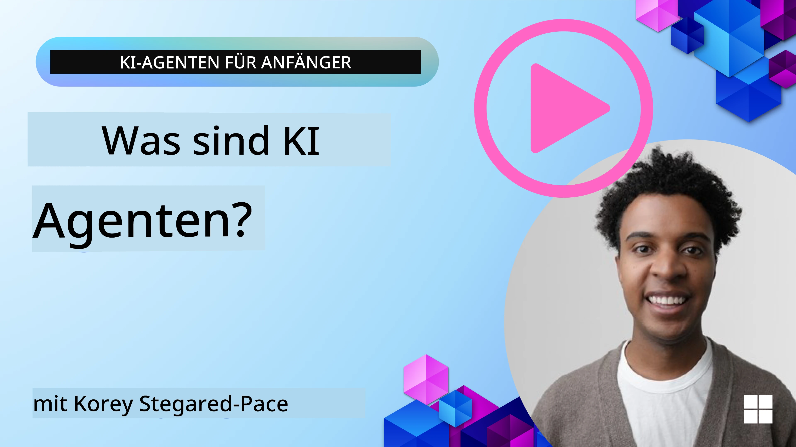
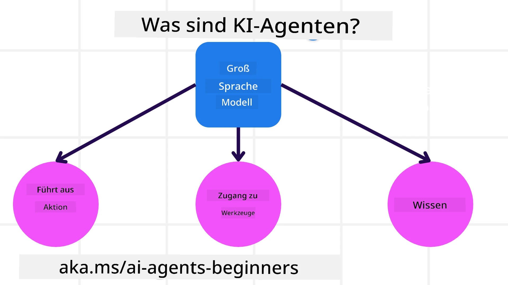
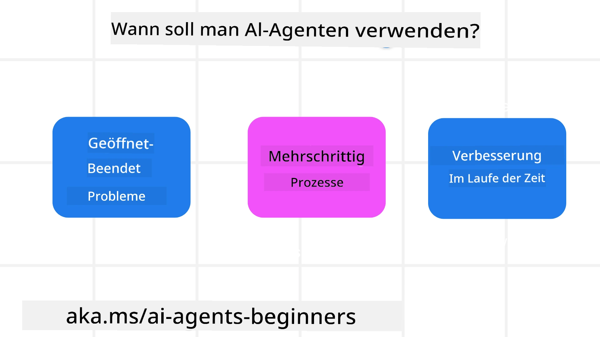

> _(Klicken Sie auf das obige Bild, um das Video zu dieser Lektion anzusehen)_

# Einführung in KI-Agenten und Anwendungsfälle für Agenten

Willkommen zum **KI-Agenten für Einsteiger**-Kurs! Dieser Kurs vermittelt Ihnen das Grundlagenwissen — und echten funktionierenden Code — um KI-Agenten von Grund auf zu erstellen.

Kommen Sie in die <a href="https://discord.gg/kzRShWzttr" target="_blank">Azure AI Discord Community</a> — dort sind viele Lernende und KI-Entwickler, die gerne Fragen beantworten.

Bevor wir mit dem Bauen beginnen, stellen wir sicher, dass wir wirklich verstehen, was ein KI-Agent *ist* und wann es Sinn macht, einen zu verwenden.

---

## Einführung

Diese Lektion behandelt:

- Was KI-Agenten sind und welche verschiedenen Typen es gibt
- Für welche Arten von Aufgaben KI-Agenten am besten geeignet sind
- Die wichtigsten Bausteine, die Sie beim Entwerfen einer agentenbasierten Lösung verwenden werden

## Lernziele

Am Ende dieser Lektion sollten Sie in der Lage sein:

- Erklären, was ein KI-Agent ist und wie er sich von einer regulären KI-Lösung unterscheidet
- Wissen, wann man einen KI-Agenten einsetzen sollte (und wann nicht)
- Ein grundlegendes Design einer agentenbasierten Lösung für ein reales Problem skizzieren

---

## Definition von KI-Agenten und Typen von KI-Agenten

### Was sind KI-Agenten?

Hier ist eine einfache Art, darüber nachzudenken:

> **KI-Agenten sind Systeme, die es großen Sprachmodellen (LLMs) ermöglichen, tatsächlich *Dinge zu tun* — indem sie ihnen Werkzeuge und Wissen geben, um in der Welt zu handeln, nicht nur auf Eingaben zu reagieren.**

Lassen Sie uns das etwas genauer betrachten:

- **System** — Ein KI-Agent ist nicht nur eine einzelne Sache. Es ist eine Sammlung von Teilen, die zusammenarbeiten. Im Kern hat jeder Agent drei Komponenten:
  - **Umgebung** — Der Raum, in dem der Agent arbeitet. Für einen Reisebuchungsagenten wäre das die Buchungsplattform selbst.
  - **Sensoren** — Wie der Agent den aktuellen Zustand seiner Umgebung liest. Unser Reiseagent könnte die Verfügbarkeit von Hotels oder Flugpreisen abfragen.
  - **Aktuatoren** — Wie der Agent Aktionen ausführt. Der Reiseagent könnte ein Zimmer buchen, eine Bestätigung senden oder eine Reservierung stornieren.

- **Große Sprachmodelle** — Agenten gab es schon vor LLMs, aber LLMs sind es, die moderne Agenten so mächtig machen. Sie können natürliche Sprache verstehen, Kontext nachvollziehen und eine vage Benutzeranfrage in einen konkreten Handlungsplan umwandeln.

- **Aktionen ausführen** — Ohne ein Agentsystem erzeugt ein LLM nur Text. Innerhalb eines Agentsystems kann das LLM tatsächlich *Schritte ausführen* — eine Datenbank durchsuchen, eine API aufrufen, eine Nachricht senden.

- **Zugang zu Werkzeugen** — Welche Werkzeuge der Agent nutzen kann, hängt von (1) der Umgebung, in der er läuft, und (2) den Entscheidungen des Entwicklers ab. Ein Reiseagent könnte z.B. Flüge suchen, aber keine Kundendaten bearbeiten — es kommt darauf an, was verbunden wurde.

- **Gedächtnis + Wissen** — Agenten können Kurzzeitgedächtnis (das aktuelle Gespräch) und Langzeitgedächtnis (eine Kundendatenbank, vergangene Interaktionen) haben. Der Reiseagent könnte "erinnern", dass Sie Fensterplätze bevorzugen.

---

### Die verschiedenen Typen von KI-Agenten

Nicht alle Agenten sind gleich gebaut. Hier ist eine Übersicht der wichtigsten Typen, mit einem Reisebuchungsagenten als Beispiel:

| **Agententyp** | **Was er tut** | **Beispiel Reiseagent** |
|---|---|---|
| **Einfache Reflexagenten** | Befolgen fest codierte Regeln — kein Gedächtnis, keine Planung. | Sieht eine Beschwerdemail → leitet sie an den Kundenservice weiter. Das war’s. |
| **Modellbasierte Reflexagenten** | Haben ein internes Weltmodell und aktualisieren es bei Veränderungen. | Verfolgt historische Flugpreise und markiert plötzlich teure Strecken. |
| **Zielorientierte Agenten** | Haben ein Ziel und planen Schritt für Schritt, wie sie es erreichen. | Bucht eine komplette Reise (Flüge, Auto, Hotel) von Ihrem aktuellen Standort zum Ziel. |
| **Nutzenorientierte Agenten** | Finden nicht nur *eine* Lösung, sondern die *beste* unter Abwägung von Kompromissen. | Balanciert Kosten gegenüber Bequemlichkeit, um die Reise mit der besten Bewertung für Ihre Vorlieben zu finden. |
| **Lernende Agenten** | Werden durch Feedback im Laufe der Zeit besser. | Passt künftige Buchungsempfehlungen basierend auf Umfrageergebnissen nach der Reise an. |
| **Hierarchische Agenten** | Ein übergeordneter Agent teilt Aufgaben in Unteraufgaben und delegiert an untergeordnete Agenten. | Eine Anfrage „Reise stornieren“ wird aufgeteilt in: Flug stornieren, Hotel stornieren, Mietwagen stornieren — jede Aufgabe wird von einem Sub-Agenten bearbeitet. |
| **Multi-Agenten-Systeme (MAS)** | Mehrere unabhängige Agenten arbeiten zusammen (oder konkurrieren). | Kooperativ: separate Agenten verwalten Hotels, Flüge und Unterhaltung. Konkurrenzen: mehrere Agenten konkurrieren um Hotelzimmer zum besten Preis. |

---

## Wann man KI-Agenten verwenden sollte

Nur weil man *kann*, heißt das nicht, dass man immer *sollte*. Hier sind die Situationen, in denen Agenten wirklich ihre Stärke zeigen:

- **Offene Probleme** — Wenn die Schritte zur Lösung nicht vorprogrammiert werden können. Das LLM muss den Weg dynamisch herausfinden.
- **Mehrstufige Prozesse** — Aufgaben, die erfordern, dass Tools über mehrere Schritte genutzt werden, nicht nur eine einfache Abfrage oder Textgenerierung.
- **Verbesserung im Laufe der Zeit** — Wenn das System durch Nutzerfeedback oder Umweltsignale schlauer werden soll.

Wir werden später im Kurs in der Lektion **Vertrauenswürdige KI-Agenten bauen** tiefer darauf eingehen, wann man KI-Agenten einsetzen sollte — und wann nicht.

---

## Grundlagen agentenbasierter Lösungen

### Agentenentwicklung

Das Erste, was man beim Erstellen eines Agenten tut, ist zu definieren, *was er tun kann* — seine Werkzeuge, Aktionen und Verhaltensweisen.

In diesem Kurs nutzen wir den **Azure AI Agent Service** als Hauptplattform. Er unterstützt:

- Modelle von Anbietern wie OpenAI, Mistral und Meta (Llama)
- Lizenzierte Daten von Anbietern wie Tripadvisor
- Standardisierte OpenAPI 3.0 Werkzeugdefinitionen

### Agentenmuster

Sie kommunizieren mit LLMs über Prompts. Bei Agenten kann man nicht immer jeden Prompt manuell erstellen — der Agent muss über viele Schritte hinweg handeln. Hier kommen **Agentenmuster** ins Spiel. Das sind wiederverwendbare Strategien zum Ansprechen und Orchestrieren von LLMs auf eine skalierbare, zuverlässige Weise.

Dieser Kurs ist rund um die gebräuchlichsten und nützlichsten agentenbasierten Muster aufgebaut.

### Agentenframeworks

Agentenframeworks bieten Entwicklern vorgefertigte Vorlagen, Werkzeuge und Infrastruktur zum Erstellen von Agenten. Sie erleichtern es:

- Werkzeuge und Fähigkeiten zu verbinden
- Zu beobachten, was der Agent tut (und Fehler zu debuggen)
- Zusammenarbeit über mehrere Agenten hinweg

In diesem Kurs konzentrieren wir uns auf das **Microsoft Agent Framework (MAF)** für die Erstellung produktionsreifer Agenten.

---

## Code-Beispiele

Bereit, es in Aktion zu sehen? Hier sind die Code-Beispiele zu dieser Lektion:

- 🐍 Python: [Agent Framework](./code_samples/01-python-agent-framework.ipynb)
- 🔷 .NET: [Agent Framework](./code_samples/01-dotnet-agent-framework.md)

---

## Fragen?

Treten Sie dem [Microsoft Foundry Discord](https://aka.ms/ai-agents/discord) bei, um sich mit anderen Lernenden zu vernetzen, an Sprechstunden teilzunehmen und Ihre Fragen zu KI-Agenten von der Community beantwortet zu bekommen.

---

## Vorherige Lektion

[Kurseinrichtung](../00-course-setup/README.md)

## Nächste Lektion

[Agentenframeworks erkunden](../02-explore-agentic-frameworks/README.md)

---

<!-- CO-OP TRANSLATOR DISCLAIMER START -->
**Haftungsausschluss**:
Dieses Dokument wurde mit dem KI-Übersetzungsdienst [Co-op Translator](https://github.com/Azure/co-op-translator) übersetzt. Obwohl wir uns um Genauigkeit bemühen, beachten Sie bitte, dass automatisierte Übersetzungen Fehler oder Ungenauigkeiten enthalten können. Das Originaldokument in seiner Ursprungssprache gilt als maßgebliche Quelle. Bei kritischen Informationen wird eine professionelle menschliche Übersetzung empfohlen. Wir übernehmen keine Haftung für Missverständnisse oder Fehlinterpretationen, die aus der Verwendung dieser Übersetzung entstehen.
<!-- CO-OP TRANSLATOR DISCLAIMER END -->