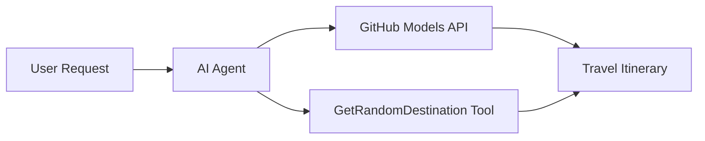

<!--
CO_OP_TRANSLATOR_METADATA:
{
  "original_hash": "23afd9be7b6ba5b69a44c3b6a78e07f6",
  "translation_date": "2025-11-06T10:01:19+00:00",
  "source_file": "01-intro-to-ai-agents/code_samples/01-dotnet-agent-framework.md",
  "language_code": "de"
}
-->
# 🌍 KI-Reiseberater mit Microsoft Agent Framework (.NET)

## 📋 Szenarioübersicht

Dieses Notebook zeigt, wie man einen intelligenten Reiseplanungs-Agenten mit dem Microsoft Agent Framework für .NET erstellt. Der Agent kann automatisch personalisierte Tagesausflugspläne für zufällige Reiseziele weltweit generieren.

**Hauptfunktionen:**
- 🎲 **Zufällige Zielauswahl**: Verwendet ein benutzerdefiniertes Tool, um Urlaubsziele auszuwählen
- 🗺️ **Intelligente Reiseplanung**: Erstellt detaillierte Tagespläne
- 🔄 **Echtzeit-Streaming**: Unterstützt sowohl sofortige als auch gestreamte Antworten
- 🛠️ **Integration benutzerdefinierter Tools**: Zeigt, wie man die Fähigkeiten des Agenten erweitern kann

## 🔧 Technische Architektur

### Kerntechnologien
- **Microsoft Agent Framework**: Neueste .NET-Implementierung für die Entwicklung von KI-Agenten
- **GitHub Models Integration**: Nutzt den KI-Modell-Inferenzdienst von GitHub
- **OpenAI API-Kompatibilität**: Verwendet OpenAI-Client-Bibliotheken mit benutzerdefinierten Endpunkten
- **Sichere Konfiguration**: API-Schlüsselverwaltung basierend auf Umgebungsvariablen

### Hauptkomponenten
1. **AIAgent**: Der Hauptagent, der den Gesprächsfluss steuert
2. **Benutzerdefinierte Tools**: `GetRandomDestination()`-Funktion, die dem Agenten zur Verfügung steht
3. **Chat-Client**: Gesprächsschnittstelle, unterstützt durch GitHub Models
4. **Streaming-Unterstützung**: Echtzeit-Antwortgenerierung

### Integrationsmuster


## 🚀 Erste Schritte

**Voraussetzungen:**
- .NET 10.0 oder höher
- GitHub Models API-Zugriffstoken
- Umgebungsvariablen in der `.env`-Datei konfiguriert

**Erforderliche Umgebungsvariablen:**
```env
GITHUB_TOKEN=your_github_token
GITHUB_ENDPOINT=https://models.inference.ai.azure.com
GITHUB_MODEL_ID=gpt-4o-mini
```

Führen Sie den untenstehenden Code in der angegebenen Reihenfolge aus, um den Reiseberater in Aktion zu sehen!

---

## .NET Single File App: Beispiel für einen KI-Reiseberater

Siehe `01-dotnet-agent-framework.cs` für das vollständige ausführbare Codebeispiel.

```bash
dotnet run 01-dotnet-agent-framework.cs
```

### Beispielcode

```csharp
static string GetRandomDestination()
{
    var destinations = new List<string>
    {
        "Paris, France",
        "Tokyo, Japan",
        "New York City, USA",
        "Sydney, Australia",
        "Rome, Italy",
        "Barcelona, Spain",
        "Cape Town, South Africa",
        "Rio de Janeiro, Brazil",
        "Bangkok, Thailand",
        "Vancouver, Canada"
    };
    var random = new Random();
    int index = random.Next(destinations.Count);
    return destinations[index];
}

// Extract configuration from environment variables
var github_endpoint = Environment.GetEnvironmentVariable("GITHUB_ENDPOINT") ?? throw new InvalidOperationException("GITHUB_ENDPOINT is not set.");
var github_model_id = Environment.GetEnvironmentVariable("GITHUB_MODEL_ID") ?? "gpt-4o-mini";
var github_token = Environment.GetEnvironmentVariable("GITHUB_TOKEN") ?? throw new InvalidOperationException("GITHUB_TOKEN is not set.");

// Configure OpenAI Client Options
var openAIOptions = new OpenAIClientOptions()
{
    Endpoint = new Uri(github_endpoint)
};

// Initialize OpenAI Client with GitHub Models Configuration
var openAIClient = new OpenAIClient(new ApiKeyCredential(github_token), openAIOptions);

// Create AI Agent with Travel Planning Capabilities
AIAgent agent = openAIClient
    .GetChatClient(github_model_id)
    .CreateAIAgent(
        instructions: "You are a helpful AI Agent that can help plan vacations for customers at random destinations",
        tools: [AIFunctionFactory.Create(GetRandomDestination)]
    );

// Execute Agent: Plan a Day Trip (Non-Streaming)
Console.WriteLine(await agent.RunAsync("Plan me a day trip"));

// Execute Agent: Plan a Day Trip (Streaming Response)
await foreach (var update in agent.RunStreamingAsync("Plan me a day trip"))
{
    Console.Write(update);
}
```

---

**Haftungsausschluss**:  
Dieses Dokument wurde mit dem KI-Übersetzungsdienst [Co-op Translator](https://github.com/Azure/co-op-translator) übersetzt. Obwohl wir uns um Genauigkeit bemühen, beachten Sie bitte, dass automatisierte Übersetzungen Fehler oder Ungenauigkeiten enthalten können. Das Originaldokument in seiner ursprünglichen Sprache sollte als maßgebliche Quelle betrachtet werden. Für kritische Informationen wird eine professionelle menschliche Übersetzung empfohlen. Wir übernehmen keine Haftung für Missverständnisse oder Fehlinterpretationen, die sich aus der Nutzung dieser Übersetzung ergeben.