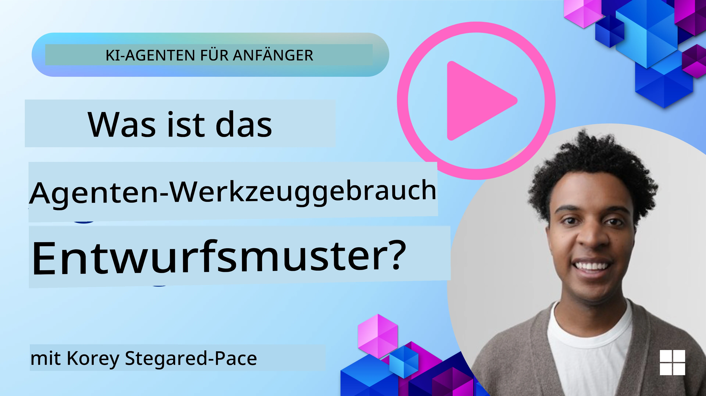
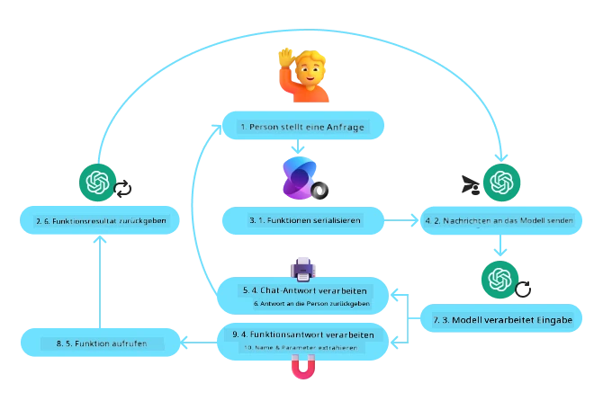
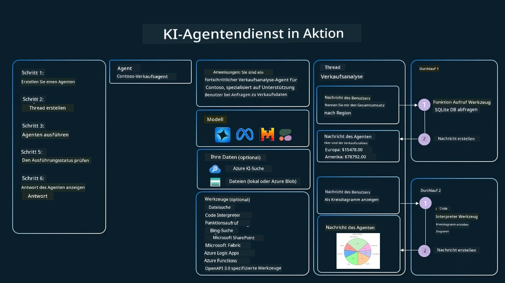

[](https://youtu.be/vieRiPRx-gI?si=cEZ8ApnT6Sus9rhn)

> _(Klicken Sie auf das obige Bild, um das Video zu dieser Lektion anzusehen)_

# Entwurfsmuster für die Nutzung von Tools

Tools sind interessant, weil sie KI-Agenten eine breitere Palette von Fähigkeiten ermöglichen. Anstatt dass der Agent nur eine begrenzte Menge an Aktionen ausführen kann, kann der Agent durch Hinzufügen eines Tools nun eine Vielzahl von Aktionen ausführen. In diesem Kapitel betrachten wir das Entwurfsmuster „Tool Use“, das beschreibt, wie KI-Agenten bestimmte Tools verwenden können, um ihre Ziele zu erreichen.

## Einführung

In dieser Lektion möchten wir die folgenden Fragen beantworten:

- Was ist das Entwurfsmuster „Tool Use“?
- Für welche Anwendungsfälle kann es eingesetzt werden?
- Welche Elemente/Bausteine werden benötigt, um das Entwurfsmuster zu implementieren?
- Welche Besonderheiten sind bei der Verwendung des Entwurfsmusters „Tool Use“ zu beachten, um vertrauenswürdige KI-Agenten zu bauen?

## Lernziele

Nach Abschluss dieser Lektion werden Sie in der Lage sein:

- Das Entwurfsmuster „Tool Use“ und seinen Zweck zu definieren.
- Anwendungsfälle zu erkennen, in denen das Entwurfsmuster „Tool Use“ anwendbar ist.
- Die Schlüsselelemente zu verstehen, die zur Implementierung des Entwurfsmusters erforderlich sind.
- Überlegungen zu erkennen, um Vertrauenswürdigkeit bei KI-Agenten, die dieses Entwurfsmuster verwenden, sicherzustellen.

## Was ist das Entwurfsmuster „Tool Use“?

Das **Entwurfsmuster „Tool Use“** konzentriert sich darauf, großen Sprachmodellen (LLMs) die Fähigkeit zu geben, mit externen Tools zu interagieren, um spezifische Ziele zu erreichen. Tools sind Code, der von einem Agenten ausgeführt werden kann, um Aktionen durchzuführen. Ein Tool kann eine einfache Funktion wie ein Taschenrechner oder ein API-Aufruf zu einem Drittanbieterdienst wie etwa einer Abfrage von Aktienkursen oder Wettervorhersagen sein. Im Kontext von KI-Agenten sind Tools so konzipiert, dass sie in Reaktion auf **modellgenerierte Funktionsaufrufe** von den Agenten ausgeführt werden.

## Für welche Anwendungsfälle kann es eingesetzt werden?

KI-Agenten können Tools nutzen, um komplexe Aufgaben zu erledigen, Informationen abzurufen oder Entscheidungen zu treffen. Das Entwurfsmuster „Tool Use“ wird häufig in Szenarien eingesetzt, die eine dynamische Interaktion mit externen Systemen erfordern, wie Datenbanken, Webservices oder Code-Interpreter. Diese Fähigkeit ist für verschiedene Anwendungsfälle nützlich, darunter:

- **Dynamische Informationsbeschaffung:** Agenten können externe APIs oder Datenbanken abfragen, um aktuelle Daten zu erhalten (z. B. Abfrage einer SQLite-Datenbank zur Datenanalyse, Abruf von Aktienkursen oder Wetterinformationen).
- **Codeausführung und Interpretation:** Agenten können Code oder Skripte ausführen, um mathematische Probleme zu lösen, Berichte zu generieren oder Simulationen durchzuführen.
- **Automatisierung von Arbeitsabläufen:** Automatisierung von sich wiederholenden oder mehrstufigen Abläufen durch Integration von Tools wie Task-Scheduler, E-Mail-Diensten oder Datenpipelines.
- **Kundensupport:** Agenten können mit CRM-Systemen, Ticketplattformen oder Wissensdatenbanken interagieren, um Benutzeranfragen zu lösen.
- **Inhaltserstellung und -bearbeitung:** Agenten können Tools wie Grammatikprüfer, Textzusammenfasser oder Content-Safety-Prüfer nutzen, um bei der Inhaltserstellung zu unterstützen.

## Welche Elemente/Bausteine werden benötigt, um das Entwurfsmuster „Tool Use“ zu implementieren?

Diese Bausteine ermöglichen es dem KI-Agenten, eine breite Palette von Aufgaben auszuführen. Schauen wir uns die wichtigen Elemente an, die für die Umsetzung des Entwurfsmusters „Tool Use“ erforderlich sind:

- **Funktions-/Tool-Schemata**: Detaillierte Definitionen der verfügbaren Tools, einschließlich Funktionsname, Zweck, erforderliche Parameter und erwartete Ausgaben. Diese Schemata ermöglichen es dem LLM, zu verstehen, welche Tools verfügbar sind und wie gültige Anfragen zu erstellen sind.

- **Logik für Funktionsausführung**: Regelt, wie und wann Tools basierend auf der Absicht des Nutzers und dem Gesprächskontext aufgerufen werden. Dies kann Planer-Module, Routing-Mechanismen oder bedingte Abläufe umfassen, die den Tool-Einsatz dynamisch bestimmen.

- **Nachrichtenverwaltungssystem**: Komponenten, die den Gesprächsfluss zwischen Benutzereingaben, LLM-Antworten, Tool-Aufrufen und Tool-Ausgaben verwalten.

- **Tool-Integrations-Framework**: Infrastruktur, die den Agenten mit verschiedenen Tools verbindet, unabhängig davon, ob es sich um einfache Funktionen oder komplexe externe Dienste handelt.

- **Fehlerbehandlung & Validierung**: Mechanismen zur Handhabung von Fehlern bei der Tool-Ausführung, Validierung von Parametern und Verwaltung unerwarteter Antworten.

- **Zustandsverwaltung**: Verfolgt den Gesprächskontext, vorhergehende Tool-Interaktionen und persistente Daten, um Konsistenz über mehrere Interaktionen hinweg sicherzustellen.

Als Nächstes betrachten wir den Funktions-/Tool-Aufruf etwas genauer.

### Funktions-/Tool-Aufruf

Der Funktionsaufruf ist der Hauptmechanismus, mit dem wir großen Sprachmodellen (LLMs) ermöglichen, mit Tools zu interagieren. „Funktion“ und „Tool“ werden oft synonym verwendet, da „Funktionen“ (wiederverwendbare Codeblöcke) die „Tools“ sind, die Agenten nutzen, um Aufgaben auszuführen. Damit der Code einer Funktion aufgerufen werden kann, muss das LLM die Anfrage des Nutzers mit der Beschreibung der Funktionen abgleichen. Dazu wird ein Schema mit den Beschreibungen aller verfügbaren Funktionen an das LLM gesendet. Das LLM wählt dann die am besten geeignete Funktion für die Aufgabe aus und gibt deren Namen und Argumente zurück. Die ausgewählte Funktion wird ausgeführt, die Antwort wird an das LLM zurückgesendet, das diese Informationen nutzt, um auf die Anfrage des Nutzers zu reagieren.

Für Entwickler, die Funktionsaufrufe für Agenten implementieren möchten, benötigen Sie:

1. Ein LLM-Modell, das Funktionsaufrufe unterstützt
2. Ein Schema mit Funktionsbeschreibungen
3. Den Code für jede beschriebene Funktion

Zur Veranschaulichung verwenden wir das Beispiel, die aktuelle Uhrzeit in einer Stadt zu ermitteln:

1. **Initialisieren eines LLM, das Funktionsaufrufe unterstützt:**

    Nicht alle Modelle unterstützen Funktionsaufrufe, daher ist es wichtig zu prüfen, ob das verwendete LLM dies tut. <a href="https://learn.microsoft.com/azure/ai-services/openai/how-to/function-calling" target="_blank">Azure OpenAI</a> unterstützt Funktionsaufrufe. Wir können mit der Initialisierung des Azure OpenAI-Clients beginnen. 

    ```python
    # Initialisieren Sie den Azure OpenAI-Client
    client = AzureOpenAI(
        azure_endpoint = os.getenv("AZURE_AI_PROJECT_ENDPOINT"), 
        api_key=os.getenv("AZURE_OPENAI_API_KEY"),  
        api_version="2024-05-01-preview"
    )
    ```

1. **Erstellen eines Funktionsschemas:**

    Danach definieren wir ein JSON-Schema, das den Funktionsnamen, eine Beschreibung der Funktion und die Namen sowie Beschreibungen der Funktionsparameter enthält.
    Wir übergeben dieses Schema dann zusammen mit der Nutzeranfrage, die die Uhrzeit in San Francisco abfragen möchte, an den zuvor erstellten Client. Wichtig ist zu beachten, dass ein **Tool-Aufruf** zurückgegeben wird, **nicht** die endgültige Antwort auf die Frage. Wie bereits erwähnt, gibt das LLM den Namen der für die Aufgabe ausgewählten Funktion und die Argumente zurück, die an diese übergeben werden.

    ```python
    # Funktionsbeschreibung für das Modell zum Lesen
    tools = [
        {
            "type": "function",
            "function": {
                "name": "get_current_time",
                "description": "Get the current time in a given location",
                "parameters": {
                    "type": "object",
                    "properties": {
                        "location": {
                            "type": "string",
                            "description": "The city name, e.g. San Francisco",
                        },
                    },
                    "required": ["location"],
                },
            }
        }
    ]
    ```
   
    ```python
  
    # Initiale Benutzernachricht
    messages = [{"role": "user", "content": "What's the current time in San Francisco"}] 
  
    # Erster API-Aufruf: Fordern Sie das Modell auf, die Funktion zu verwenden
      response = client.chat.completions.create(
          model=deployment_name,
          messages=messages,
          tools=tools,
          tool_choice="auto",
      )
  
      # Verarbeite die Antwort des Modells
      response_message = response.choices[0].message
      messages.append(response_message)
  
      print("Model's response:")  

      print(response_message)
  
    ```

    ```bash
    Model's response:
    ChatCompletionMessage(content=None, role='assistant', function_call=None, tool_calls=[ChatCompletionMessageToolCall(id='call_pOsKdUlqvdyttYB67MOj434b', function=Function(arguments='{"location":"San Francisco"}', name='get_current_time'), type='function')])
    ```
  
1. **Der Funktionscode, der die Aufgabe ausführt:**

    Nachdem das LLM entschieden hat, welche Funktion ausgeführt werden soll, muss der Code implementiert und ausgeführt werden, der die Aufgabe erledigt.
    Wir können den Code schreiben, um die aktuelle Zeit in Python abzurufen. Wir müssen auch den Code schreiben, um den Namen und die Argumente aus der response_message zu extrahieren, um das endgültige Ergebnis zu erhalten.

    ```python
      def get_current_time(location):
        """Get the current time for a given location"""
        print(f"get_current_time called with location: {location}")  
        location_lower = location.lower()
        
        for key, timezone in TIMEZONE_DATA.items():
            if key in location_lower:
                print(f"Timezone found for {key}")  
                current_time = datetime.now(ZoneInfo(timezone)).strftime("%I:%M %p")
                return json.dumps({
                    "location": location,
                    "current_time": current_time
                })
      
        print(f"No timezone data found for {location_lower}")  
        return json.dumps({"location": location, "current_time": "unknown"})
    ```

     ```python
     # Funktionen aufrufen
      if response_message.tool_calls:
          for tool_call in response_message.tool_calls:
              if tool_call.function.name == "get_current_time":
     
                  function_args = json.loads(tool_call.function.arguments)
     
                  time_response = get_current_time(
                      location=function_args.get("location")
                  )
     
                  messages.append({
                      "tool_call_id": tool_call.id,
                      "role": "tool",
                      "name": "get_current_time",
                      "content": time_response,
                  })
      else:
          print("No tool calls were made by the model.")  
  
      # Zweiter API-Aufruf: Holen Sie die endgültige Antwort vom Modell
      final_response = client.chat.completions.create(
          model=deployment_name,
          messages=messages,
      )
  
      return final_response.choices[0].message.content
     ```

     ```bash
      get_current_time called with location: San Francisco
      Timezone found for san francisco
      The current time in San Francisco is 09:24 AM.
     ```

Funktionsaufrufe stehen im Zentrum der meisten, wenn nicht aller Agenten-Tool-Use-Designs, jedoch kann die Implementierung von Grund auf herausfordernd sein.
Wie wir in [Lektion 2](../../../02-explore-agentic-frameworks) gelernt haben, bieten agentische Frameworks vorgefertigte Bausteine zur Implementierung von Tool Use.

## Beispiele für Tool Use mit agentischen Frameworks

Hier sind einige Beispiele, wie Sie das Entwurfsmuster „Tool Use“ mit verschiedenen agentischen Frameworks implementieren können:

### Microsoft Agent Framework

<a href="https://learn.microsoft.com/azure/ai-services/agents/overview" target="_blank">Microsoft Agent Framework</a> ist ein Open-Source-KI-Framework zum Erstellen von KI-Agenten. Es vereinfacht den Prozess des Funktionsaufrufs, indem es Ihnen erlaubt, Tools als Python-Funktionen mit dem `@tool`-Decorator zu definieren. Das Framework kümmert sich um die bidirektionale Kommunikation zwischen Modell und Ihrem Code. Es bietet außerdem Zugriff auf vorgefertigte Tools wie Dateisuche und Code-Interpreter über den `AzureAIProjectAgentProvider`.

Das folgende Diagramm zeigt den Ablauf des Funktionsaufrufs mit dem Microsoft Agent Framework:



Im Microsoft Agent Framework werden Tools als dekorierte Funktionen definiert. Wir können die zuvor gesehen Funktion `get_current_time` mithilfe des `@tool`-Decorators in ein Tool umwandeln. Das Framework serialisiert automatisch die Funktion und ihre Parameter und erstellt das Schema, das an das LLM gesendet wird.

```python
from agent_framework import tool
from agent_framework.azure import AzureAIProjectAgentProvider
from azure.identity import AzureCliCredential

@tool
def get_current_time(location: str) -> str:
    """Get the current time for a given location"""
    ...

# Erstellen Sie den Client
provider = AzureAIProjectAgentProvider(credential=AzureCliCredential())

# Erstellen Sie einen Agenten und führen Sie ihn mit dem Tool aus
agent = await provider.create_agent(name="TimeAgent", instructions="Use available tools to answer questions.", tools=get_current_time)
response = await agent.run("What time is it?")
```
  
### Azure AI Agent Service

<a href="https://learn.microsoft.com/azure/ai-services/agents/overview" target="_blank">Azure AI Agent Service</a> ist ein neueres agentisches Framework, das Entwicklern ermöglichen soll, sicher qualitativ hochwertige und erweiterbare KI-Agenten zu erstellen, bereitzustellen und zu skalieren, ohne sich um die zugrunde liegenden Rechen- und Speicherressourcen kümmern zu müssen. Es ist besonders für Unternehmensanwendungen geeignet, da es sich um einen vollständig verwalteten Dienst mit Unternehmenssicherheitsstandard handelt.

Im Vergleich zur direkten Entwicklung mit der LLM-API bietet der Azure AI Agent Service einige Vorteile, darunter:

- Automatischer Tool-Aufruf – kein Bedarf, Tool-Aufrufe zu parsen, das Tool aufzurufen und die Antwort zu verarbeiten; all dies geschieht jetzt serverseitig
- Sicher verwaltete Daten – anstelle der eigenen Verwaltung des Gesprächszustands können Sie sich auf Threads verlassen, die alle benötigten Informationen speichern
- Sofort verfügbare Tools – Tools, mit denen Sie auf Ihre Datenquellen zugreifen können, wie Bing, Azure AI Search und Azure Functions.

Die in Azure AI Agent Service verfügbaren Tools lassen sich in zwei Kategorien einteilen:

1. Knowledge Tools:
    - <a href="https://learn.microsoft.com/azure/ai-services/agents/how-to/tools/bing-grounding?tabs=python&pivots=overview" target="_blank">Grounding mit Bing Search</a>
    - <a href="https://learn.microsoft.com/azure/ai-services/agents/how-to/tools/file-search?tabs=python&pivots=overview" target="_blank">Dateisuche</a>
    - <a href="https://learn.microsoft.com/azure/ai-services/agents/how-to/tools/azure-ai-search?tabs=azurecli%2Cpython&pivots=overview-azure-ai-search" target="_blank">Azure AI Search</a>

2. Action Tools:
    - <a href="https://learn.microsoft.com/azure/ai-services/agents/how-to/tools/function-calling?tabs=python&pivots=overview" target="_blank">Funktionsaufrufe</a>
    - <a href="https://learn.microsoft.com/azure/ai-services/agents/how-to/tools/code-interpreter?tabs=python&pivots=overview" target="_blank">Code-Interpreter</a>
    - <a href="https://learn.microsoft.com/azure/ai-services/agents/how-to/tools/openapi-spec?tabs=python&pivots=overview" target="_blank">OpenAPI-definierte Tools</a>
    - <a href="https://learn.microsoft.com/azure/ai-services/agents/how-to/tools/azure-functions?pivots=overview" target="_blank">Azure Functions</a>

Der Agent Service ermöglicht es uns, diese Tools zusammen als `toolset` zu verwenden. Er nutzt auch `threads`, die die Historie der Nachrichten eines bestimmten Gesprächs verfolgen.

Stellen Sie sich vor, Sie sind ein Vertriebsmitarbeiter bei einem Unternehmen namens Contoso. Sie möchten einen konversationellen Agenten entwickeln, der Fragen zu Ihren Verkaufsdaten beantworten kann.

Das folgende Bild zeigt, wie Sie Azure AI Agent Service nutzen könnten, um Ihre Verkaufsdaten zu analysieren:



Um eines dieser Tools mit dem Service zu verwenden, können wir einen Client erstellen und ein Tool oder Toolset definieren. Praktisch implementieren wir dies mit dem folgenden Python-Code. Das LLM kann das Toolset betrachten und je nach Benutzeranfrage entscheiden, ob die selbst erstellte Funktion `fetch_sales_data_using_sqlite_query` oder der vorgefertigte Code Interpreter verwendet wird.

```python 
import os
from azure.ai.projects import AIProjectClient
from azure.identity import DefaultAzureCredential
from fetch_sales_data_functions import fetch_sales_data_using_sqlite_query # fetch_sales_data_using_sqlite_query-Funktion, die in einer Datei fetch_sales_data_functions.py zu finden ist.
from azure.ai.projects.models import ToolSet, FunctionTool, CodeInterpreterTool

project_client = AIProjectClient.from_connection_string(
    credential=DefaultAzureCredential(),
    conn_str=os.environ["PROJECT_CONNECTION_STRING"],
)

# Werkzeugset initialisieren
toolset = ToolSet()

# Funktion Calling Agent mit der fetch_sales_data_using_sqlite_query-Funktion initialisieren und zum Werkzeugset hinzufügen
fetch_data_function = FunctionTool(fetch_sales_data_using_sqlite_query)
toolset.add(fetch_data_function)

# Code Interpreter-Werkzeug initialisieren und zum Werkzeugset hinzufügen.
code_interpreter = code_interpreter = CodeInterpreterTool()
toolset.add(code_interpreter)

agent = project_client.agents.create_agent(
    model="gpt-4o-mini", name="my-agent", instructions="You are helpful agent", 
    toolset=toolset
)
```

## Welche Besonderheiten sind bei der Verwendung des Entwurfsmusters „Tool Use“ zu beachten, um vertrauenswürdige KI-Agenten zu bauen?

Ein häufiger Sicherheitsaspekt bei dynamisch von LLMs erzeugtem SQL ist das Risiko von SQL-Injection oder böswilligen Aktionen, wie das Löschen oder Manipulieren der Datenbank. Während diese Bedenken berechtigt sind, können sie effektiv durch eine korrekte Konfiguration der Datenbankzugriffsberechtigungen gemindert werden. Für die meisten Datenbanken bedeutet dies, sie als schreibgeschützt zu konfigurieren. Bei Datenbankdiensten wie PostgreSQL oder Azure SQL sollte die App eine schreibgeschützte (SELECT) Rolle zugewiesen bekommen.

Der Betrieb der App in einer sicheren Umgebung erhöht den Schutz zusätzlich. In Unternehmensszenarien werden Daten typischerweise extrahiert und aus operativen Systemen in eine schreibgeschützte Datenbank oder ein Data Warehouse mit benutzerfreundlichem Schema transformiert. Dieser Ansatz stellt sicher, dass die Daten sicher sind, performance- und zugänglichkeitsoptimiert vorliegen und dass die App nur eingeschränkten schreibgeschützten Zugang besitzt.

## Beispielcodes

- Python: [Agent Framework](./code_samples/04-python-agent-framework.ipynb)
- .NET: [Agent Framework](./code_samples/04-dotnet-agent-framework.md)

## Haben Sie weitere Fragen zum Entwurfsmuster „Tool Use“?

Treten Sie dem [Microsoft Foundry Discord](https://aka.ms/ai-agents/discord) bei, um andere Lernende zu treffen, an Sprechstunden teilzunehmen und Ihre Fragen zu AI Agents beantwortet zu bekommen.

## Weiterführende Ressourcen

- <a href="https://microsoft.github.io/build-your-first-agent-with-azure-ai-agent-service-workshop/" target="_blank">Azure AI Agents Service Workshop</a>
- <a href="https://github.com/Azure-Samples/contoso-creative-writer/tree/main/docs/workshop" target="_blank">Contoso Creative Writer Multi-Agent Workshop</a>
- <a href="https://learn.microsoft.com/azure/ai-services/agents/overview" target="_blank">Überblick Microsoft Agent Framework</a>

## Vorherige Lektion

[Verstehen von agentischen Entwurfsmustern](../03-agentic-design-patterns/README.md)

## Nächste Lektion
[Agentic RAG](../05-agentic-rag/README.md)

---

<!-- CO-OP TRANSLATOR DISCLAIMER START -->
**Haftungsausschluss**:  
Dieses Dokument wurde mit dem KI-Übersetzungsdienst [Co-op Translator](https://github.com/Azure/co-op-translator) übersetzt. Obwohl wir auf Genauigkeit achten, beachten Sie bitte, dass automatisierte Übersetzungen Fehler oder Ungenauigkeiten enthalten können. Das Originaldokument in seiner ursprünglichen Sprache gilt als maßgebliche Quelle. Für wichtige Informationen wird eine professionelle menschliche Übersetzung empfohlen. Wir übernehmen keine Haftung für Missverständnisse oder Fehlinterpretationen, die aus der Nutzung dieser Übersetzung entstehen.
<!-- CO-OP TRANSLATOR DISCLAIMER END -->