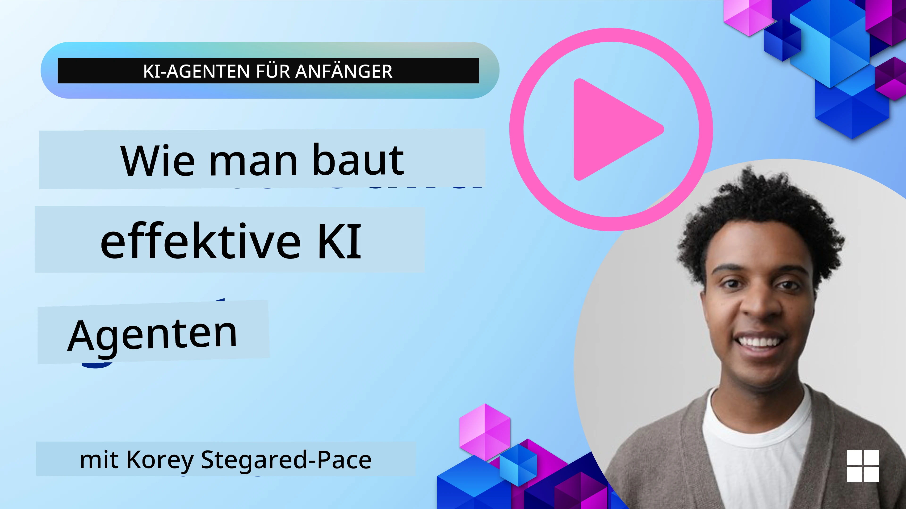
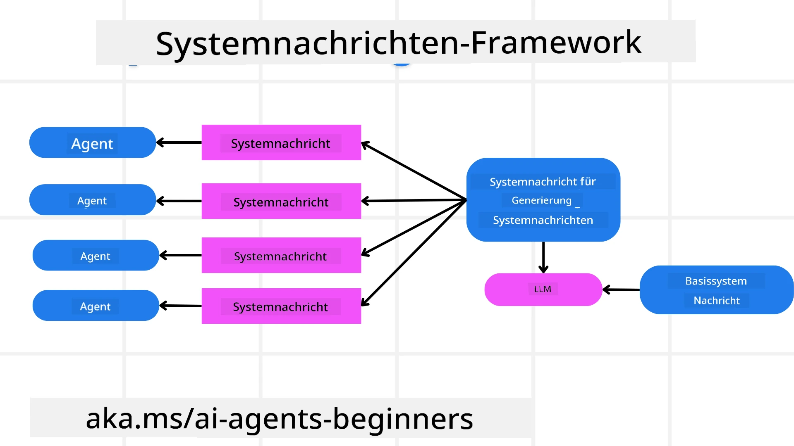
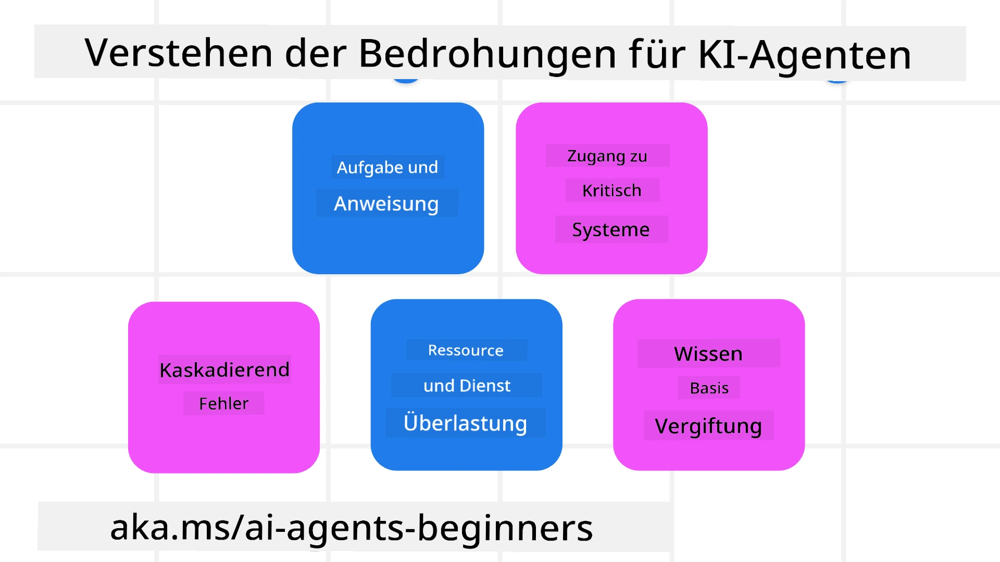
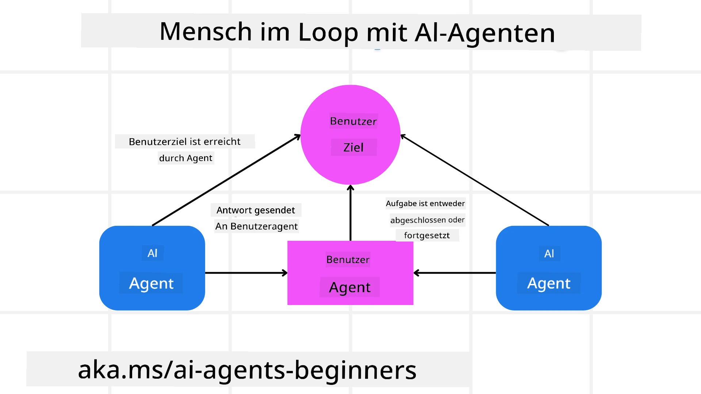

[](https://youtu.be/iZKkMEGBCUQ?si=Q-kEbcyHUMPoHp8L)

> _(Klicken Sie auf das obige Bild, um das Video zu dieser Lektion anzusehen)_

# Aufbau vertrauenswürdiger KI-Agenten

## Einführung

Diese Lektion behandelt:

- Wie man sichere und effektive KI-Agenten erstellt und bereitstellt
- Wichtige Sicherheitsüberlegungen bei der Entwicklung von KI-Agenten
- Wie man bei der Entwicklung von KI-Agenten Datenschutz für Daten und Nutzer gewährleistet

## Lernziele

Nach Abschluss dieser Lektion wissen Sie, wie Sie:

- Risiken bei der Erstellung von KI-Agenten identifizieren und mindern
- Sicherheitsmaßnahmen implementieren, um sicherzustellen, dass Daten und Zugriffe richtig verwaltet werden
- KI-Agenten erstellen, die Datenschutz gewährleisten und eine hochwertige Nutzererfahrung bieten

## Sicherheit

Schauen wir uns zunächst den Aufbau sicherer agentischer Anwendungen an. Sicherheit bedeutet, dass der KI-Agent wie vorgesehen funktioniert. Als Entwickler agentischer Anwendungen verfügen wir über Methoden und Werkzeuge, um die Sicherheit zu maximieren:

### Aufbau eines Systemnachrichten-Frameworks

Wenn Sie schon einmal eine KI-Anwendung mit großen Sprachmodellen (LLMs) erstellt haben, kennen Sie die Bedeutung eines robusten Systemprompts oder einer Systemnachricht. Diese Prompts legen die Meta-Regeln, Anweisungen und Leitlinien fest, wie das LLM mit dem Nutzer und den Daten interagiert.

Für KI-Agenten ist der Systemprompt noch wichtiger, da die KI-Agenten hochspezifische Anweisungen benötigen, um die von uns entworfenen Aufgaben zu erfüllen.

Um skalierbare Systemprompts zu erstellen, können wir ein Framework für Systemnachrichten verwenden, um einen oder mehrere Agenten in unserer Anwendung zu erstellen:



#### Schritt 1: Erstellen einer Meta-Systemnachricht

Das Meta-Prompt wird von einem LLM verwendet, um die Systemprompts für die von uns erstellten Agenten zu generieren. Wir gestalten es als Vorlage, damit wir bei Bedarf effizient mehrere Agenten erstellen können.

Hier ist ein Beispiel für eine Meta-Systemnachricht, die wir dem LLM geben würden:

```plaintext
You are an expert at creating AI agent assistants. 
You will be provided a company name, role, responsibilities and other
information that you will use to provide a system prompt for.
To create the system prompt, be descriptive as possible and provide a structure that a system using an LLM can better understand the role and responsibilities of the AI assistant. 
```

#### Schritt 2: Erstellen eines Basis-Prompts

Der nächste Schritt besteht darin, ein Basis-Prompt zu erstellen, das den KI-Agenten beschreibt. Sie sollten die Rolle des Agenten, die Aufgaben, die der Agent ausführt, und andere Verantwortlichkeiten des Agenten einbeziehen.

Hier ist ein Beispiel:

```plaintext
You are a travel agent for Contoso Travel that is great at booking flights for customers. To help customers you can perform the following tasks: lookup available flights, book flights, ask for preferences in seating and times for flights, cancel any previously booked flights and alert customers on any delays or cancellations of flights.  
```

#### Schritt 3: Basis-Systemnachricht dem LLM bereitstellen

Jetzt können wir diese Systemnachricht optimieren, indem wir die Meta-Systemnachricht als Systemnachricht und unser Basis-Systemprompt bereitstellen.

Dies wird eine Systemnachricht erzeugen, die besser dazu geeignet ist, unsere KI-Agenten zu steuern:

```markdown
**Company Name:** Contoso Travel  
**Role:** Travel Agent Assistant

**Objective:**  
You are an AI-powered travel agent assistant for Contoso Travel, specializing in booking flights and providing exceptional customer service. Your main goal is to assist customers in finding, booking, and managing their flights, all while ensuring that their preferences and needs are met efficiently.

**Key Responsibilities:**

1. **Flight Lookup:**
    
    - Assist customers in searching for available flights based on their specified destination, dates, and any other relevant preferences.
    - Provide a list of options, including flight times, airlines, layovers, and pricing.
2. **Flight Booking:**
    
    - Facilitate the booking of flights for customers, ensuring that all details are correctly entered into the system.
    - Confirm bookings and provide customers with their itinerary, including confirmation numbers and any other pertinent information.
3. **Customer Preference Inquiry:**
    
    - Actively ask customers for their preferences regarding seating (e.g., aisle, window, extra legroom) and preferred times for flights (e.g., morning, afternoon, evening).
    - Record these preferences for future reference and tailor suggestions accordingly.
4. **Flight Cancellation:**
    
    - Assist customers in canceling previously booked flights if needed, following company policies and procedures.
    - Notify customers of any necessary refunds or additional steps that may be required for cancellations.
5. **Flight Monitoring:**
    
    - Monitor the status of booked flights and alert customers in real-time about any delays, cancellations, or changes to their flight schedule.
    - Provide updates through preferred communication channels (e.g., email, SMS) as needed.

**Tone and Style:**

- Maintain a friendly, professional, and approachable demeanor in all interactions with customers.
- Ensure that all communication is clear, informative, and tailored to the customer's specific needs and inquiries.

**User Interaction Instructions:**

- Respond to customer queries promptly and accurately.
- Use a conversational style while ensuring professionalism.
- Prioritize customer satisfaction by being attentive, empathetic, and proactive in all assistance provided.

**Additional Notes:**

- Stay updated on any changes to airline policies, travel restrictions, and other relevant information that could impact flight bookings and customer experience.
- Use clear and concise language to explain options and processes, avoiding jargon where possible for better customer understanding.

This AI assistant is designed to streamline the flight booking process for customers of Contoso Travel, ensuring that all their travel needs are met efficiently and effectively.

```

#### Schritt 4: Iterieren und Verbessern

Der Wert dieses Systemnachrichten-Frameworks besteht darin, die Erstellung von Systemnachrichten für mehrere Agenten leichter skalierbar zu machen und Ihre Systemnachrichten im Laufe der Zeit zu verbessern. Es ist selten, dass Sie eine Systemnachricht haben, die beim ersten Mal für Ihren gesamten Anwendungsfall funktioniert. Die Möglichkeit, kleine Anpassungen und Verbesserungen vorzunehmen, indem Sie die Basis-Systemnachricht ändern und durch das System laufen lassen, ermöglicht es Ihnen, Ergebnisse zu vergleichen und zu bewerten.

## Bedrohungen verstehen

Um vertrauenswürdige KI-Agenten zu bauen, ist es wichtig, die Risiken und Bedrohungen für Ihren KI-Agenten zu verstehen und zu mindern. Schauen wir uns einige der unterschiedlichen Bedrohungen für KI-Agenten an und wie Sie besser planen und sich darauf vorbereiten können.



### Aufgabe und Anweisung

**Beschreibung:** Angreifer versuchen, die Anweisungen oder Ziele des KI-Agenten durch Prompts oder Manipulation von Eingaben zu ändern.

**Minderung:** Führen Sie Validierungsprüfungen und Eingabe-Filter durch, um potenziell gefährliche Prompts zu erkennen, bevor sie vom KI-Agenten verarbeitet werden. Da diese Angriffe typischerweise häufige Interaktionen mit dem Agenten erfordern, ist eine Begrenzung der Anzahl der Gesprächsdrehungen eine weitere Möglichkeit, diese Arten von Angriffen zu verhindern.

### Zugriff auf kritische Systeme

**Beschreibung:** Wenn ein KI-Agent Zugriff auf Systeme und Dienste hat, die sensible Daten speichern, können Angreifer die Kommunikation zwischen dem Agenten und diesen Diensten kompromittieren. Dies können direkte Angriffe oder indirekte Versuche sein, über den Agenten Informationen über diese Systeme zu erhalten.

**Minderung:** KI-Agenten sollten nur bedarfsorientierten Zugriff auf Systeme haben, um diese Art von Angriffen zu verhindern. Die Kommunikation zwischen Agent und System sollte ebenfalls sicher sein. Die Implementierung von Authentifizierung und Zugriffskontrolle ist ein weiterer Weg, um diese Informationen zu schützen.

### Überlastung von Ressourcen und Diensten

**Beschreibung:** KI-Agenten können verschiedene Werkzeuge und Dienste nutzen, um Aufgaben zu erledigen. Angreifer können diese Fähigkeit ausnutzen, indem sie über den KI-Agenten eine hohe Anzahl von Anfragen an diese Dienste senden, was zu Systemausfällen oder hohen Kosten führen kann.

**Minderung:** Implementieren Sie Richtlinien zur Beschränkung der Anzahl von Anfragen, die ein KI-Agent an einen Dienst stellen kann. Das Limitieren der Anzahl von Gesprächsdrehungen und Anfragen an Ihren KI-Agenten ist eine weitere Möglichkeit, diese Arten von Angriffen zu verhindern.

### Vergiftung der Wissensbasis

**Beschreibung:** Diese Art von Angriff richtet sich nicht direkt gegen den KI-Agenten, sondern gegen die Wissensbasis und andere Dienste, die der KI-Agent zur Erfüllung seiner Aufgaben nutzt. Dies kann das Verfälschen der Daten oder Informationen sein, die der KI-Agent verwendet, was zu voreingenommenen oder unbeabsichtigten Antworten an den Nutzer führt.

**Minderung:** Führen Sie regelmäßige Überprüfungen der Daten durch, die der KI-Agent in seinen Abläufen verwendet. Stellen Sie sicher, dass der Zugang zu diesen Daten sicher ist und nur von vertrauenswürdigen Personen geändert wird, um diese Art von Angriff zu verhindern.

### Kaskadierende Fehler

**Beschreibung:** KI-Agenten nutzen verschiedene Werkzeuge und Dienste zur Aufgabenbearbeitung. Fehler, die durch Angreifer verursacht werden, können zu Ausfällen anderer Systeme führen, die mit dem KI-Agenten verbunden sind, wodurch der Angriff sich ausweitet und schwieriger zu beheben ist.

**Minderung:** Eine Methode, dies zu vermeiden, besteht darin, den KI-Agenten in einer begrenzten Umgebung ausführen zu lassen, beispielsweise in einem Docker-Container, um direkte Systemangriffe zu verhindern. Die Erstellung von Fallback-Mechanismen und Wiederholungslogik bei Fehlerantworten bestimmter Systeme ist ein weiterer Weg, größere Systemausfälle zu verhindern.

## Mensch in der Schleife

Eine weitere effektive Methode zum Aufbau vertrauenswürdiger KI-Agentensysteme ist die Verwendung eines Mensch-in-der-Schleife-Ansatzes. Dies schafft einen Ablauf, bei dem Nutzer während des Betriebs Feedback an die Agenten geben können. Nutzer fungieren im Grunde als Agenten in einem Multi-Agenten-System und können durch Genehmigung oder Beendigung des laufenden Prozesses eingreifen.



Hier ist ein Code-Ausschnitt, der unter Verwendung des Microsoft Agent Framework zeigt, wie dieses Konzept implementiert wird:

```python
import os
from agent_framework.azure import AzureAIProjectAgentProvider
from azure.identity import AzureCliCredential

# Erstellen Sie den Anbieter mit menschlicher Genehmigung im Prozess
provider = AzureAIProjectAgentProvider(
    credential=AzureCliCredential(),
)

# Erstellen Sie den Agenten mit einem menschlichen Genehmigungsschritt
response = provider.create_response(
    input="Write a 4-line poem about the ocean.",
    instructions="You are a helpful assistant. Ask for user approval before finalizing.",
)

# Der Benutzer kann die Antwort überprüfen und genehmigen
print(response.output_text)
user_input = input("Do you approve? (APPROVE/REJECT): ")
if user_input == "APPROVE":
    print("Response approved.")
else:
    print("Response rejected. Revising...")
```

## Fazit

Der Aufbau vertrauenswürdiger KI-Agenten erfordert sorgfältiges Design, robuste Sicherheitsmaßnahmen und kontinuierliche Iterationen. Durch die Implementierung strukturierter Meta-Prompt-Systeme, das Verständnis potenzieller Bedrohungen und die Anwendung von Minderungsstrategien können Entwickler KI-Agenten schaffen, die sicher und effektiv sind. Zusätzlich sorgt die Einbindung eines Mensch-in-der-Schleife-Ansatzes dafür, dass KI-Agenten mit den Bedürfnissen der Nutzer übereinstimmen und Risiken minimiert werden. Da KI sich weiterentwickelt, wird eine proaktive Haltung zu Sicherheit, Datenschutz und ethischen Überlegungen entscheidend sein, um Vertrauen und Zuverlässigkeit in KI-gesteuerte Systeme zu fördern.

## Code-Beispiele

- [`code_samples/06-system-message-framework.ipynb`](code_samples/06-system-message-framework.ipynb): Schritt-für-Schritt-Demonstration des Meta-Prompt-Systemnachrichten-Frameworks.
- [`code_samples/06-human-in-the-loop.ipynb`](code_samples/06-human-in-the-loop.ipynb): Genehmigungen vor Aktionen, Risikostufung und Audit-Logging für vertrauenswürdige Agenten.

### Haben Sie weitere Fragen zum Aufbau vertrauenswürdiger KI-Agenten?

Treten Sie dem [Microsoft Foundry Discord](https://aka.ms/ai-agents/discord) bei, um andere Lernende zu treffen, an Bürozeiten teilzunehmen und Ihre Fragen zu KI-Agenten beantwortet zu bekommen.

## Zusätzliche Ressourcen

- <a href="https://learn.microsoft.com/azure/ai-studio/responsible-use-of-ai-overview" target="_blank">Überblick über verantwortungsbewusste KI</a>
- <a href="https://learn.microsoft.com/azure/ai-studio/concepts/evaluation-approach-gen-ai" target="_blank">Bewertung generativer KI-Modelle und KI-Anwendungen</a>
- <a href="https://learn.microsoft.com/azure/ai-services/openai/concepts/system-message?context=%2Fazure%2Fai-studio%2Fcontext%2Fcontext&tabs=top-techniques" target="_blank">Sicherheits-Systemnachrichten</a>
- <a href="https://blogs.microsoft.com/wp-content/uploads/prod/sites/5/2022/06/Microsoft-RAI-Impact-Assessment-Template.pdf?culture=en-us&country=us" target="_blank">Risikoabschätzungs-Vorlage</a>

## Vorherige Lektion

[Agentic RAG](../05-agentic-rag/README.md)

## Nächste Lektion

[Planungs-Designmuster](../07-planning-design/README.md)

---

<!-- CO-OP TRANSLATOR DISCLAIMER START -->
**Haftungsausschluss**:
Dieses Dokument wurde mit dem KI-Übersetzungsdienst [Co-op Translator](https://github.com/Azure/co-op-translator) übersetzt. Obwohl wir uns um Genauigkeit bemühen, beachten Sie bitte, dass automatisierte Übersetzungen Fehler oder Ungenauigkeiten enthalten können. Das Originaldokument in seiner Ursprungssprache gilt als maßgebliche Quelle. Bei kritischen Informationen wird eine professionelle menschliche Übersetzung empfohlen. Wir übernehmen keine Haftung für Missverständnisse oder Fehlinterpretationen, die aus der Verwendung dieser Übersetzung entstehen.
<!-- CO-OP TRANSLATOR DISCLAIMER END -->