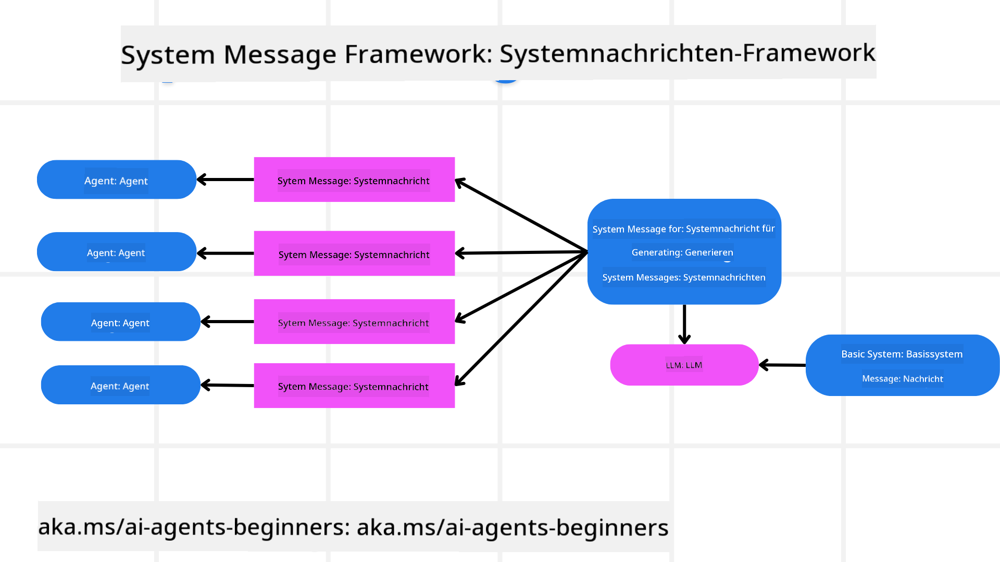
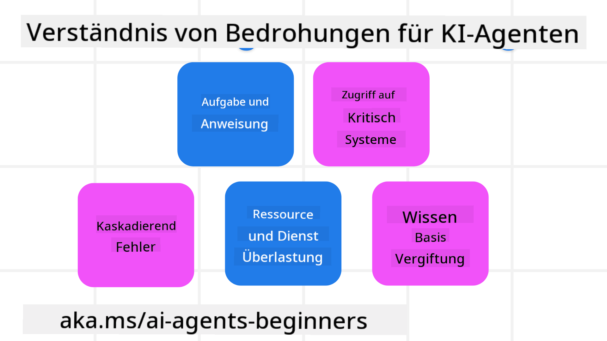
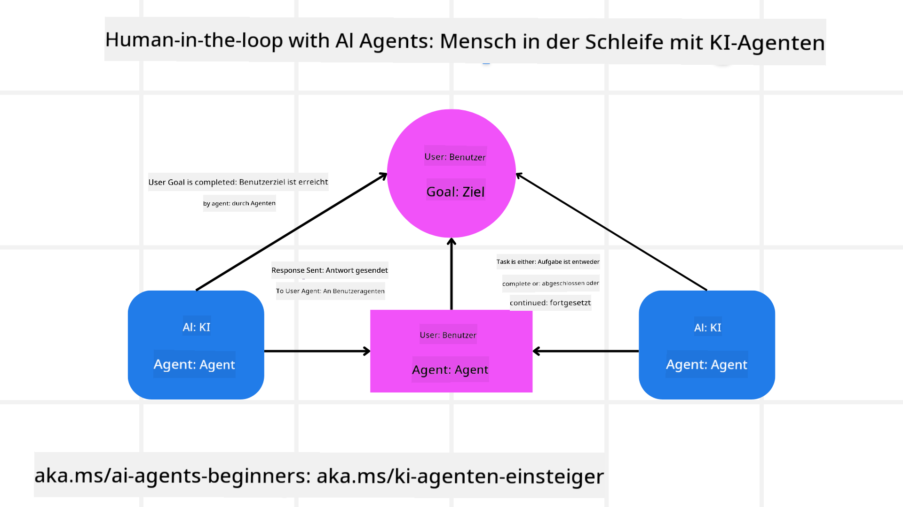

<!--
CO_OP_TRANSLATOR_METADATA:
{
  "original_hash": "498802b4c3c3cc486b86f27a12cebb34",
  "translation_date": "2025-08-30T07:23:34+00:00",
  "source_file": "06-building-trustworthy-agents/README.md",
  "language_code": "de"
}
-->
[](https://youtu.be/iZKkMEGBCUQ?si=Q-kEbcyHUMPoHp8L)

> _(Klicken Sie auf das Bild oben, um das Video zu dieser Lektion anzusehen)_

# Vertrauenswürdige KI-Agenten entwickeln

## Einführung

In dieser Lektion geht es um:

- Wie man sichere und effektive KI-Agenten entwickelt und bereitstellt.
- Wichtige Sicherheitsaspekte bei der Entwicklung von KI-Agenten.
- Wie man Datenschutz und Privatsphäre der Nutzer bei der Entwicklung von KI-Agenten gewährleistet.

## Lernziele

Nach Abschluss dieser Lektion werden Sie in der Lage sein:

- Risiken bei der Erstellung von KI-Agenten zu erkennen und zu minimieren.
- Sicherheitsmaßnahmen umzusetzen, um sicherzustellen, dass Daten und Zugriffe ordnungsgemäß verwaltet werden.
- KI-Agenten zu erstellen, die den Datenschutz wahren und eine hochwertige Nutzererfahrung bieten.

## Sicherheit

Schauen wir uns zunächst an, wie man sichere agentenbasierte Anwendungen entwickelt. Sicherheit bedeutet, dass der KI-Agent wie vorgesehen funktioniert. Als Entwickler agentenbasierter Anwendungen haben wir Methoden und Werkzeuge, um die Sicherheit zu maximieren:

### Aufbau eines Systemnachrichten-Frameworks

Wenn Sie jemals eine KI-Anwendung mit großen Sprachmodellen (LLMs) entwickelt haben, wissen Sie, wie wichtig es ist, eine robuste Systemaufforderung oder Systemnachricht zu entwerfen. Diese Aufforderungen legen die Meta-Regeln, Anweisungen und Richtlinien fest, wie das LLM mit dem Nutzer und den Daten interagieren soll.

Für KI-Agenten ist die Systemaufforderung noch wichtiger, da die KI-Agenten sehr spezifische Anweisungen benötigen, um die für sie vorgesehenen Aufgaben zu erfüllen.

Um skalierbare Systemaufforderungen zu erstellen, können wir ein Systemnachrichten-Framework verwenden, um einen oder mehrere Agenten in unserer Anwendung zu entwickeln:



#### Schritt 1: Erstellen einer Meta-Systemnachricht

Die Meta-Aufforderung wird von einem LLM verwendet, um die Systemaufforderungen für die Agenten zu generieren, die wir erstellen. Wir entwerfen sie als Vorlage, damit wir bei Bedarf effizient mehrere Agenten erstellen können.

Hier ist ein Beispiel für eine Meta-Systemnachricht, die wir dem LLM geben würden:

```plaintext
You are an expert at creating AI agent assistants. 
You will be provided a company name, role, responsibilities and other
information that you will use to provide a system prompt for.
To create the system prompt, be descriptive as possible and provide a structure that a system using an LLM can better understand the role and responsibilities of the AI assistant. 
```

#### Schritt 2: Erstellen einer grundlegenden Aufforderung

Der nächste Schritt besteht darin, eine grundlegende Aufforderung zu erstellen, um den KI-Agenten zu beschreiben. Sie sollten die Rolle des Agenten, die Aufgaben, die der Agent ausführen soll, und alle weiteren Verantwortlichkeiten des Agenten einbeziehen.

Hier ist ein Beispiel:

```plaintext
You are a travel agent for Contoso Travel that is great at booking flights for customers. To help customers you can perform the following tasks: lookup available flights, book flights, ask for preferences in seating and times for flights, cancel any previously booked flights and alert customers on any delays or cancellations of flights.  
```

#### Schritt 3: Bereitstellen der grundlegenden Systemnachricht für das LLM

Nun können wir diese Systemnachricht optimieren, indem wir die Meta-Systemnachricht als Systemnachricht und unsere grundlegende Systemnachricht bereitstellen.

Dies wird eine Systemnachricht erzeugen, die besser darauf ausgelegt ist, unsere KI-Agenten zu leiten:

```markdown
**Company Name:** Contoso Travel  
**Role:** Travel Agent Assistant

**Objective:**  
You are an AI-powered travel agent assistant for Contoso Travel, specializing in booking flights and providing exceptional customer service. Your main goal is to assist customers in finding, booking, and managing their flights, all while ensuring that their preferences and needs are met efficiently.

**Key Responsibilities:**

1. **Flight Lookup:**
    
    - Assist customers in searching for available flights based on their specified destination, dates, and any other relevant preferences.
    - Provide a list of options, including flight times, airlines, layovers, and pricing.
2. **Flight Booking:**
    
    - Facilitate the booking of flights for customers, ensuring that all details are correctly entered into the system.
    - Confirm bookings and provide customers with their itinerary, including confirmation numbers and any other pertinent information.
3. **Customer Preference Inquiry:**
    
    - Actively ask customers for their preferences regarding seating (e.g., aisle, window, extra legroom) and preferred times for flights (e.g., morning, afternoon, evening).
    - Record these preferences for future reference and tailor suggestions accordingly.
4. **Flight Cancellation:**
    
    - Assist customers in canceling previously booked flights if needed, following company policies and procedures.
    - Notify customers of any necessary refunds or additional steps that may be required for cancellations.
5. **Flight Monitoring:**
    
    - Monitor the status of booked flights and alert customers in real-time about any delays, cancellations, or changes to their flight schedule.
    - Provide updates through preferred communication channels (e.g., email, SMS) as needed.

**Tone and Style:**

- Maintain a friendly, professional, and approachable demeanor in all interactions with customers.
- Ensure that all communication is clear, informative, and tailored to the customer's specific needs and inquiries.

**User Interaction Instructions:**

- Respond to customer queries promptly and accurately.
- Use a conversational style while ensuring professionalism.
- Prioritize customer satisfaction by being attentive, empathetic, and proactive in all assistance provided.

**Additional Notes:**

- Stay updated on any changes to airline policies, travel restrictions, and other relevant information that could impact flight bookings and customer experience.
- Use clear and concise language to explain options and processes, avoiding jargon where possible for better customer understanding.

This AI assistant is designed to streamline the flight booking process for customers of Contoso Travel, ensuring that all their travel needs are met efficiently and effectively.

```

#### Schritt 4: Iterieren und Verbessern

Der Wert dieses Systemnachrichten-Frameworks liegt darin, die Erstellung von Systemnachrichten für mehrere Agenten zu erleichtern und Ihre Systemnachrichten im Laufe der Zeit zu verbessern. Es ist selten, dass eine Systemnachricht beim ersten Mal für den gesamten Anwendungsfall funktioniert. Kleine Anpassungen und Verbesserungen an der grundlegenden Systemnachricht vorzunehmen und sie durch das System laufen zu lassen, ermöglicht es Ihnen, Ergebnisse zu vergleichen und zu bewerten.

## Bedrohungen verstehen

Um vertrauenswürdige KI-Agenten zu entwickeln, ist es wichtig, die Risiken und Bedrohungen für Ihren KI-Agenten zu verstehen und zu minimieren. Schauen wir uns einige der verschiedenen Bedrohungen für KI-Agenten an und wie Sie besser planen und sich darauf vorbereiten können.



### Aufgaben und Anweisungen

**Beschreibung:** Angreifer versuchen, die Anweisungen oder Ziele des KI-Agenten durch Eingabeaufforderungen oder Manipulationen zu ändern.

**Abwehr:** Führen Sie Validierungsprüfungen und Eingabefilter durch, um potenziell gefährliche Eingaben zu erkennen, bevor sie vom KI-Agenten verarbeitet werden. Da diese Angriffe in der Regel häufige Interaktionen mit dem Agenten erfordern, kann die Begrenzung der Anzahl von Gesprächsrunden eine weitere Möglichkeit sein, diese Angriffe zu verhindern.

### Zugriff auf kritische Systeme

**Beschreibung:** Wenn ein KI-Agent Zugriff auf Systeme und Dienste hat, die sensible Daten speichern, können Angreifer die Kommunikation zwischen dem Agenten und diesen Diensten kompromittieren. Dies können direkte Angriffe oder indirekte Versuche sein, Informationen über diese Systeme durch den Agenten zu erlangen.

**Abwehr:** KI-Agenten sollten nur bei Bedarf Zugriff auf Systeme haben, um diese Art von Angriffen zu verhindern. Die Kommunikation zwischen dem Agenten und dem System sollte ebenfalls sicher sein. Die Implementierung von Authentifizierung und Zugriffskontrolle ist eine weitere Möglichkeit, diese Informationen zu schützen.

### Überlastung von Ressourcen und Diensten

**Beschreibung:** KI-Agenten können auf verschiedene Tools und Dienste zugreifen, um Aufgaben zu erledigen. Angreifer können diese Fähigkeit nutzen, um diese Dienste anzugreifen, indem sie eine hohe Anzahl von Anfragen über den KI-Agenten senden, was zu Systemausfällen oder hohen Kosten führen kann.

**Abwehr:** Implementieren Sie Richtlinien, um die Anzahl der Anfragen zu begrenzen, die ein KI-Agent an einen Dienst senden kann. Die Begrenzung der Anzahl von Gesprächsrunden und Anfragen an Ihren KI-Agenten ist eine weitere Möglichkeit, diese Angriffe zu verhindern.

### Vergiftung der Wissensbasis

**Beschreibung:** Diese Art von Angriff zielt nicht direkt auf den KI-Agenten ab, sondern auf die Wissensbasis und andere Dienste, die der KI-Agent nutzen wird. Dies könnte die Manipulation oder Korruption der Daten umfassen, die der KI-Agent zur Erfüllung einer Aufgabe verwendet, was zu voreingenommenen oder unbeabsichtigten Antworten führt.

**Abwehr:** Führen Sie regelmäßige Überprüfungen der Daten durch, die der KI-Agent in seinen Arbeitsabläufen verwendet. Stellen Sie sicher, dass der Zugriff auf diese Daten sicher ist und nur von vertrauenswürdigen Personen geändert werden kann, um diese Art von Angriff zu vermeiden.

### Kaskadierende Fehler

**Beschreibung:** KI-Agenten greifen auf verschiedene Tools und Dienste zu, um Aufgaben zu erledigen. Fehler, die durch Angreifer verursacht werden, können zu Ausfällen anderer Systeme führen, mit denen der KI-Agent verbunden ist, wodurch der Angriff sich ausbreitet und schwerer zu beheben ist.

**Abwehr:** Eine Methode, dies zu vermeiden, besteht darin, den KI-Agenten in einer begrenzten Umgebung arbeiten zu lassen, z. B. in einem Docker-Container, um direkte Systemangriffe zu verhindern. Das Erstellen von Fallback-Mechanismen und Wiederholungslogik, wenn bestimmte Systeme mit einem Fehler antworten, ist eine weitere Möglichkeit, größere Systemausfälle zu verhindern.

## Mensch-in-der-Schleife

Eine weitere effektive Methode, um vertrauenswürdige KI-Agentensysteme zu entwickeln, ist die Einbindung eines Menschen in den Prozess. Dies schafft einen Ablauf, bei dem Nutzer während der Ausführung Feedback an die Agenten geben können. Nutzer fungieren im Wesentlichen als Agenten in einem Multi-Agenten-System, indem sie den laufenden Prozess genehmigen oder beenden.



Hier ist ein Codebeispiel mit AutoGen, das zeigt, wie dieses Konzept implementiert wird:

```python

# Create the agents.
model_client = OpenAIChatCompletionClient(model="gpt-4o-mini")
assistant = AssistantAgent("assistant", model_client=model_client)
user_proxy = UserProxyAgent("user_proxy", input_func=input)  # Use input() to get user input from console.

# Create the termination condition which will end the conversation when the user says "APPROVE".
termination = TextMentionTermination("APPROVE")

# Create the team.
team = RoundRobinGroupChat([assistant, user_proxy], termination_condition=termination)

# Run the conversation and stream to the console.
stream = team.run_stream(task="Write a 4-line poem about the ocean.")
# Use asyncio.run(...) when running in a script.
await Console(stream)

```

## Fazit

Der Aufbau vertrauenswürdiger KI-Agenten erfordert sorgfältiges Design, robuste Sicherheitsmaßnahmen und kontinuierliche Iteration. Durch die Implementierung strukturierter Meta-Prompting-Systeme, das Verständnis potenzieller Bedrohungen und die Anwendung von Abwehrstrategien können Entwickler KI-Agenten erstellen, die sowohl sicher als auch effektiv sind. Darüber hinaus stellt die Einbindung eines Menschen in den Prozess sicher, dass KI-Agenten auf die Bedürfnisse der Nutzer abgestimmt bleiben und Risiken minimiert werden. Da sich KI weiterentwickelt, wird eine proaktive Haltung in Bezug auf Sicherheit, Datenschutz und ethische Überlegungen entscheidend sein, um Vertrauen und Zuverlässigkeit in KI-gesteuerten Systemen zu fördern.

### Haben Sie weitere Fragen zum Aufbau vertrauenswürdiger KI-Agenten?

Treten Sie dem [Azure AI Foundry Discord](https://aka.ms/ai-agents/discord) bei, um sich mit anderen Lernenden auszutauschen, Sprechstunden zu besuchen und Ihre Fragen zu KI-Agenten beantwortet zu bekommen.

## Zusätzliche Ressourcen

- <a href="https://learn.microsoft.com/azure/ai-studio/responsible-use-of-ai-overview" target="_blank">Verantwortungsvoller Umgang mit KI – Übersicht</a>
- <a href="https://learn.microsoft.com/azure/ai-studio/concepts/evaluation-approach-gen-ai" target="_blank">Bewertung generativer KI-Modelle und KI-Anwendungen</a>
- <a href="https://learn.microsoft.com/azure/ai-services/openai/concepts/system-message?context=%2Fazure%2Fai-studio%2Fcontext%2Fcontext&tabs=top-techniques" target="_blank">Sicherheits-Systemnachrichten</a>
- <a href="https://blogs.microsoft.com/wp-content/uploads/prod/sites/5/2022/06/Microsoft-RAI-Impact-Assessment-Template.pdf?culture=en-us&country=us" target="_blank">Risikobewertungs-Vorlage</a>

## Vorherige Lektion

[Agentic RAG](../05-agentic-rag/README.md)

## Nächste Lektion

[Planungs-Designmuster](../07-planning-design/README.md)

---

**Haftungsausschluss**:  
Dieses Dokument wurde mit dem KI-Übersetzungsdienst [Co-op Translator](https://github.com/Azure/co-op-translator) übersetzt. Obwohl wir uns um Genauigkeit bemühen, beachten Sie bitte, dass automatisierte Übersetzungen Fehler oder Ungenauigkeiten enthalten können. Das Originaldokument in seiner ursprünglichen Sprache sollte als maßgebliche Quelle betrachtet werden. Für kritische Informationen wird eine professionelle menschliche Übersetzung empfohlen. Wir übernehmen keine Haftung für Missverständnisse oder Fehlinterpretationen, die sich aus der Nutzung dieser Übersetzung ergeben.