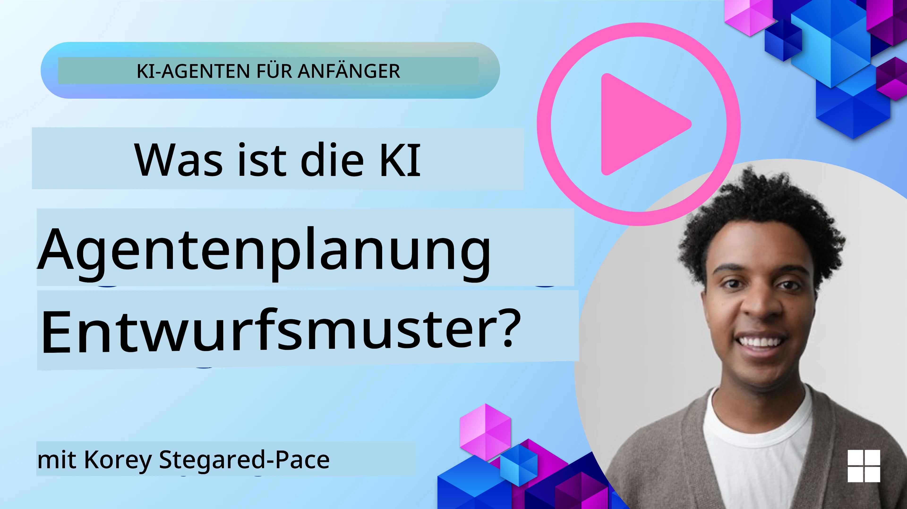
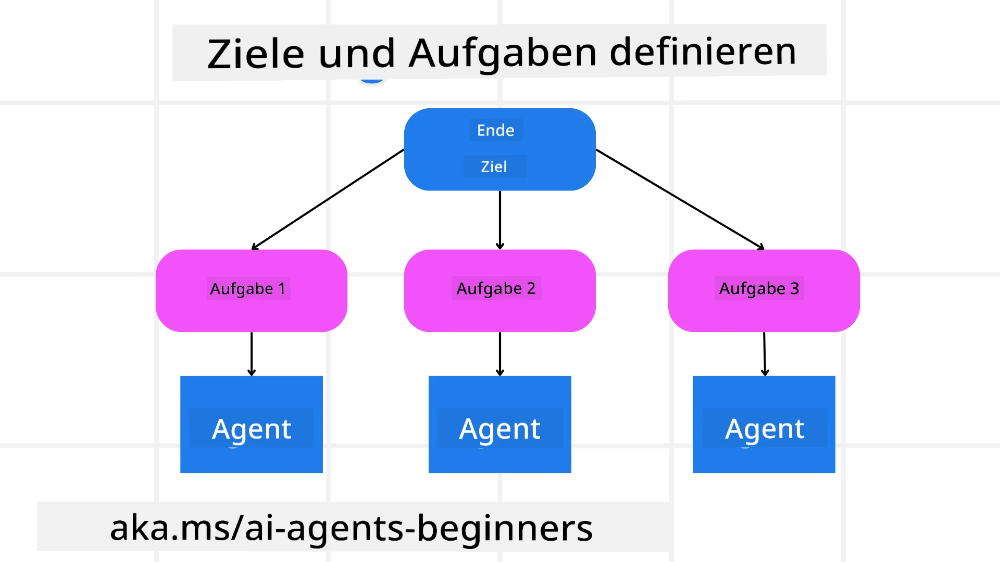

[](https://youtu.be/kPfJ2BrBCMY?si=9pYpPXp0sSbK91Dr)

> _(Klicken Sie auf das Bild oben, um das Video dieser Lektion anzusehen)_

# Planungs-Design

## Einführung

Diese Lektion behandelt

* Die Definition eines klaren Gesamtziels und das Aufteilen einer komplexen Aufgabe in handhabbare Aufgaben.
* Die Nutzung von strukturiertem Output für verlässlichere und maschinenlesbare Antworten.
* Die Anwendung eines ereignisgesteuerten Ansatzes zur Handhabung dynamischer Aufgaben und unerwarteter Eingaben.

## Lernziele

Nach Abschluss dieser Lektion werden Sie Folgendes verstehen:

* Ein Gesamtziel für einen KI-Agenten identifizieren und festlegen, sodass klar ist, was erreicht werden soll.
* Eine komplexe Aufgabe in handhabbare Unteraufgaben zerlegen und diese in eine logische Reihenfolge bringen.
* Agenten mit den richtigen Werkzeugen ausstatten (z. B. Suchwerkzeuge oder Datenanalysetools), entscheiden, wann und wie sie eingesetzt werden, und unerwartete Situationen behandeln.
* Ergebnisse von Unteraufgaben bewerten, Leistung messen und Aktionen iterieren, um das Endergebnis zu verbessern.

## Definition des Gesamtziels und Aufgliederung der Aufgabe



Die meisten Aufgaben in der realen Welt sind zu komplex, um sie in einem einzigen Schritt zu bewältigen. Ein KI-Agent benötigt ein prägnantes Ziel, das seine Planung und Aktionen leitet. Zum Beispiel das Ziel:

    "Erstelle einen Reiseplan für 3 Tage."

Obwohl es einfach formuliert ist, bedarf es noch einer Verfeinerung. Je klarer das Ziel definiert ist, desto besser können sich der Agent (und alle menschlichen Mitarbeiter) darauf konzentrieren, das richtige Ergebnis zu erzielen, wie zum Beispiel einen umfassenden Reiseplan mit Flugoptionen, Hotelempfehlungen und Aktivitätsvorschlägen zu erstellen.

### Aufgabenzerlegung

Große oder komplexe Aufgaben werden handhabbarer, wenn sie in kleinere, zielorientierte Unteraufgaben aufgeteilt werden.
Für das Beispiel des Reiseplans könnten Sie das Ziel in folgende Punkte zerlegen:

* Flugbuchung
* Hotelbuchung
* Mietwagen
* Personalisierung

Jede Unteraufgabe kann dann von spezialisierten Agenten oder Prozessen bearbeitet werden. Ein Agent könnte sich auf die Suche nach den besten Flugangeboten spezialisieren, ein anderer auf Hotelbuchungen, usw. Ein koordinierender oder „nachgelagerter“ Agent kann diese Ergebnisse zusammenführen und dem Endnutzer einen einheitlichen Reiseplan präsentieren.

Dieser modulare Ansatz ermöglicht auch schrittweise Verbesserungen. Zum Beispiel könnten Sie spezialisierte Agenten für Essensempfehlungen oder lokale Aktivitäten hinzufügen und den Reiseplan mit der Zeit verfeinern.

### Strukturierter Output

Große Sprachmodelle (LLMs) können strukturierten Output (z. B. JSON) erzeugen, den nachgelagerte Agenten oder Dienste leichter parsen und verarbeiten können. Dies ist besonders in einem Multi-Agent-Kontext nützlich, wo wir nach Erhalt der Planungs-Ergebnisse diese Aufgaben ausführen können.

Der folgende Python-Schnipsel zeigt einen einfachen Planungsagenten, der ein Ziel in Unteraufgaben zerlegt und einen strukturierten Plan erstellt:

```python
from pydantic import BaseModel
from enum import Enum
from typing import List, Optional, Union
import json
import os
from typing import Optional
from pprint import pprint
from agent_framework.azure import AzureAIProjectAgentProvider
from azure.identity import AzureCliCredential

class AgentEnum(str, Enum):
    FlightBooking = "flight_booking"
    HotelBooking = "hotel_booking"
    CarRental = "car_rental"
    ActivitiesBooking = "activities_booking"
    DestinationInfo = "destination_info"
    DefaultAgent = "default_agent"
    GroupChatManager = "group_chat_manager"

# Reise-Unteraufgabenmodell
class TravelSubTask(BaseModel):
    task_details: str
    assigned_agent: AgentEnum  # wir möchten die Aufgabe dem Agenten zuweisen

class TravelPlan(BaseModel):
    main_task: str
    subtasks: List[TravelSubTask]
    is_greeting: bool

provider = AzureAIProjectAgentProvider(credential=AzureCliCredential())

# Definiere die Benutzer-Nachricht
system_prompt = """You are a planner agent.
    Your job is to decide which agents to run based on the user's request.
    Provide your response in JSON format with the following structure:
{'main_task': 'Plan a family trip from Singapore to Melbourne.',
 'subtasks': [{'assigned_agent': 'flight_booking',
               'task_details': 'Book round-trip flights from Singapore to '
                               'Melbourne.'}
    Below are the available agents specialised in different tasks:
    - FlightBooking: For booking flights and providing flight information
    - HotelBooking: For booking hotels and providing hotel information
    - CarRental: For booking cars and providing car rental information
    - ActivitiesBooking: For booking activities and providing activity information
    - DestinationInfo: For providing information about destinations
    - DefaultAgent: For handling general requests"""

user_message = "Create a travel plan for a family of 2 kids from Singapore to Melbourne"

response = client.create_response(input=user_message, instructions=system_prompt)

response_content = response.output_text
pprint(json.loads(response_content))
```

### Planungs-Agent mit Multi-Agenten-Orchestrierung

In diesem Beispiel erhält ein Semantic Router Agent eine Benutzeranfrage (z. B. „Ich benötige einen Hotelplan für meine Reise.“).

Der Planer führt dann aus:

* Empfang des Hotelplans: Der Planer nimmt die Nachricht des Benutzers entgegen und erstellt basierend auf einem System-Prompt (inklusive Details zu verfügbaren Agenten) einen strukturierten Reiseplan.
* Auflistung der Agenten und ihrer Werkzeuge: Das Agenten-Register hält eine Liste von Agenten (z. B. für Flug, Hotel, Mietwagen und Aktivitäten) sowie die Funktionen oder Tools, die sie anbieten.
* Weiterleitung des Plans an die jeweiligen Agenten: Je nach Anzahl der Unteraufgaben sendet der Planer die Nachricht entweder direkt an einen dedizierten Agenten (bei Einzelaufgabe) oder koordiniert über einen Gruppenchat-Manager für die Zusammenarbeit mehrerer Agenten.
* Zusammenfassung des Ergebnisses: Schließlich fasst der Planer den generierten Plan zur Übersicht zusammen.
Der folgende Python-Code zeigt diese Schritte:

```python

from pydantic import BaseModel

from enum import Enum
from typing import List, Optional, Union

class AgentEnum(str, Enum):
    FlightBooking = "flight_booking"
    HotelBooking = "hotel_booking"
    CarRental = "car_rental"
    ActivitiesBooking = "activities_booking"
    DestinationInfo = "destination_info"
    DefaultAgent = "default_agent"
    GroupChatManager = "group_chat_manager"

# Reise-Teilaufgabenmodell

class TravelSubTask(BaseModel):
    task_details: str
    assigned_agent: AgentEnum # Wir möchten die Aufgabe dem Agenten zuweisen

class TravelPlan(BaseModel):
    main_task: str
    subtasks: List[TravelSubTask]
    is_greeting: bool
import json
import os
from typing import Optional

from agent_framework.azure import AzureAIProjectAgentProvider
from azure.identity import AzureCliCredential

# Erstellen Sie den Client

provider = AzureAIProjectAgentProvider(credential=AzureCliCredential())

from pprint import pprint

# Definieren Sie die Benutzernachricht

system_prompt = """You are a planner agent.
    Your job is to decide which agents to run based on the user's request.
    Below are the available agents specialized in different tasks:
    - FlightBooking: For booking flights and providing flight information
    - HotelBooking: For booking hotels and providing hotel information
    - CarRental: For booking cars and providing car rental information
    - ActivitiesBooking: For booking activities and providing activity information
    - DestinationInfo: For providing information about destinations
    - DefaultAgent: For handling general requests"""

user_message = "Create a travel plan for a family of 2 kids from Singapore to Melbourne"

response = client.create_response(input=user_message, instructions=system_prompt)

response_content = response.output_text

# Drucken Sie den Antwortinhalt, nachdem Sie ihn als JSON geladen haben

pprint(json.loads(response_content))
```

Was folgt, ist die Ausgabe des vorherigen Codes. Sie können diesen strukturierten Output verwenden, um ihn an `assigned_agent` weiterzuleiten und den Reiseplan für den Endnutzer zusammenzufassen.

```json
{
    "is_greeting": "False",
    "main_task": "Plan a family trip from Singapore to Melbourne.",
    "subtasks": [
        {
            "assigned_agent": "flight_booking",
            "task_details": "Book round-trip flights from Singapore to Melbourne."
        },
        {
            "assigned_agent": "hotel_booking",
            "task_details": "Find family-friendly hotels in Melbourne."
        },
        {
            "assigned_agent": "car_rental",
            "task_details": "Arrange a car rental suitable for a family of four in Melbourne."
        },
        {
            "assigned_agent": "activities_booking",
            "task_details": "List family-friendly activities in Melbourne."
        },
        {
            "assigned_agent": "destination_info",
            "task_details": "Provide information about Melbourne as a travel destination."
        }
    ]
}
```

Ein Beispiel-Notebook mit dem obigen Code-Schnipsel ist [hier](07-python-agent-framework.ipynb) verfügbar.

### Iterative Planung

Einige Aufgaben erfordern ein Hin und Her oder eine Neuplanung, bei der das Ergebnis einer Unteraufgabe die nächste beeinflusst. Zum Beispiel könnte ein Agent bei der Flugbuchung auf ein unerwartetes Datenformat stoßen und seine Strategie anpassen müssen, bevor er mit der Hotelbuchung fortfährt.

Auch Nutzerfeedback (z. B. wenn ein Mensch entscheidet, dass er lieber einen früheren Flug möchte) kann eine Teilneuplanung auslösen. Dieser dynamische, iterative Ansatz stellt sicher, dass die endgültige Lösung realen Einschränkungen und sich ändernden Nutzerpräferenzen entspricht.

z. B. Beispielcode

```python
from agent_framework.azure import AzureAIProjectAgentProvider
from azure.identity import AzureCliCredential
#.. gleich wie im vorherigen Code und übergebe die Benutzerhistorie, den aktuellen Plan

system_prompt = """You are a planner agent to optimize the
    Your job is to decide which agents to run based on the user's request.
    Below are the available agents specialized in different tasks:
    - FlightBooking: For booking flights and providing flight information
    - HotelBooking: For booking hotels and providing hotel information
    - CarRental: For booking cars and providing car rental information
    - ActivitiesBooking: For booking activities and providing activity information
    - DestinationInfo: For providing information about destinations
    - DefaultAgent: For handling general requests"""

user_message = "Create a travel plan for a family of 2 kids from Singapore to Melbourne"

response = client.create_response(
    input=user_message,
    instructions=system_prompt,
    context=f"Previous travel plan - {TravelPlan}",
)
# .. neu planen und die Aufgaben an die jeweiligen Agenten senden
```

Für umfassendere Planung schauen Sie sich den <a href="https://www.microsoft.com/research/articles/magentic-one-a-generalist-multi-agent-system-for-solving-complex-tasks" target="_blank">Magentic One Blogpost</a> an, der komplexe Aufgaben löst.

## Zusammenfassung

In diesem Artikel haben wir ein Beispiel betrachtet, wie wir einen Planer erstellen können, der dynamisch die verfügbaren definierten Agenten auswählt. Die Ausgabe des Planers zerlegt die Aufgaben und weist die Agenten zu, damit diese ausgeführt werden können. Es wird angenommen, dass die Agenten Zugriff auf die Funktionen/Werkzeuge haben, die für die Ausführung der Aufgabe nötig sind. Zusätzlich zu den Agenten können weitere Muster wie Reflection, Summarizer und Round Robin Chat zur weiteren Anpassung eingesetzt werden.

## Weitere Ressourcen

Magentic One - Ein Generalist Multi-Agenten-System zur Lösung komplexer Aufgaben, das beeindruckende Ergebnisse bei mehreren anspruchsvollen Agentic-Benchmarks erzielt hat. Referenz: <a href="https://www.microsoft.com/research/articles/magentic-one-a-generalist-multi-agent-system-for-solving-complex-tasks" target="_blank">Magentic One</a>. In dieser Implementierung erstellt der Orchestrator aufgabenspezifische Pläne und delegiert diese Aufgaben an die verfügbaren Agenten. Neben der Planung nutzt der Orchestrator auch einen Tracking-Mechanismus, um den Fortschritt der Aufgabe zu überwachen und bei Bedarf neu zu planen.

### Haben Sie weitere Fragen zum Planungs-Design-Pattern?

Treten Sie dem [Microsoft Foundry Discord](https://aka.ms/ai-agents/discord) bei, um andere Lernende zu treffen, Office Hours zu besuchen und Ihre Fragen zu KI-Agenten beantworten zu lassen.

## Vorherige Lektion

[Vertrauenswürdige KI-Agenten erstellen](../06-building-trustworthy-agents/README.md)

## Nächste Lektion

[Multi-Agenten-Design-Pattern](../08-multi-agent/README.md)

---

<!-- CO-OP TRANSLATOR DISCLAIMER START -->
**Haftungsausschluss**:  
Dieses Dokument wurde mithilfe des KI-Übersetzungsdienstes [Co-op Translator](https://github.com/Azure/co-op-translator) übersetzt. Obwohl wir uns um Genauigkeit bemühen, weisen wir darauf hin, dass automatische Übersetzungen Fehler oder Ungenauigkeiten enthalten können. Das ursprüngliche Dokument in seiner Originalsprache ist als maßgebliche Quelle zu betrachten. Für wichtige Informationen wird eine professionelle menschliche Übersetzung empfohlen. Wir übernehmen keine Haftung für Missverständnisse oder Fehlinterpretationen, die durch die Verwendung dieser Übersetzung entstehen.
<!-- CO-OP TRANSLATOR DISCLAIMER END -->