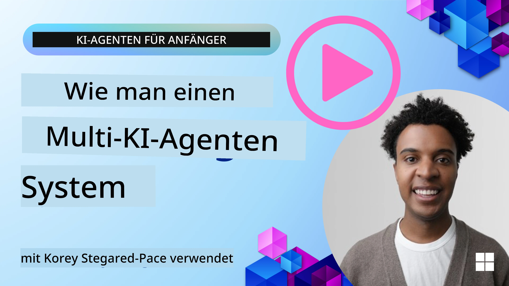
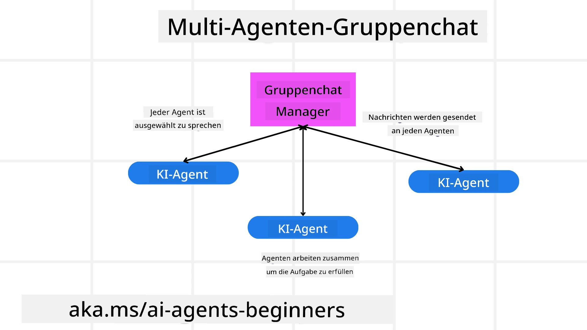
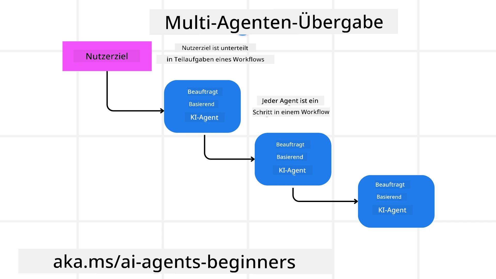
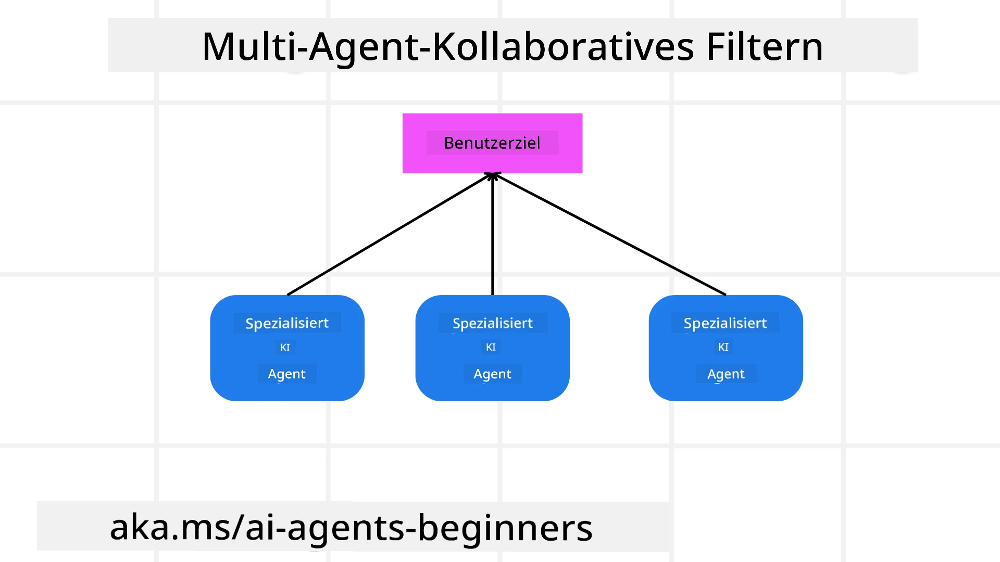

> _(Klicken Sie auf das obige Bild, um das Video zu dieser Lektion anzusehen)_

# Multi-Agent Designmuster

Sobald Sie an einem Projekt arbeiten, das mehrere Agents beinhaltet, müssen Sie das Multi-Agent Designmuster berücksichtigen. Es ist jedoch möglicherweise nicht sofort klar, wann der Wechsel zu Multi-Agents sinnvoll ist und welche Vorteile dies bietet.

## Einführung

In dieser Lektion wollen wir folgende Fragen beantworten:

- Für welche Szenarien sind Multi-Agents anwendbar?
- Welche Vorteile bietet der Einsatz von Multi-Agents gegenüber nur einem einzelnen Agenten, der mehrere Aufgaben erledigt?
- Was sind die Bausteine zur Implementierung des Multi-Agent Designmusters?
- Wie behalten wir die Übersicht darüber, wie die mehreren Agents miteinander interagieren?

## Lernziele

Nach dieser Lektion sollten Sie in der Lage sein:

- Szenarien zu identifizieren, in denen Multi-Agents anwendbar sind.
- Die Vorteile des Einsatzes von Multi-Agents gegenüber einem einzelnen Agenten zu erkennen.
- Die Bausteine zur Implementierung des Multi-Agent Designmusters zu verstehen.

Was ist das größere Bild?

*Multi-Agents sind ein Designmuster, das es mehreren Agents ermöglicht, zusammenzuarbeiten, um ein gemeinsames Ziel zu erreichen.*

Dieses Muster wird in verschiedenen Bereichen weit verbreitet eingesetzt, einschließlich Robotik, autonome Systeme und verteiltes Rechnen.

## Szenarien, in denen Multi-Agents anwendbar sind

Welche Szenarien eignen sich gut für den Einsatz von Multi-Agents? Die Antwort ist, dass es viele Szenarien gibt, in denen der Einsatz mehrerer Agents besonders vorteilhaft ist, insbesondere in folgenden Fällen:

- **Große Arbeitslasten**: Große Arbeitslasten können in kleinere Aufgaben aufgeteilt und verschiedenen Agents zugewiesen werden, was parallele Verarbeitung und schnellere Fertigstellung ermöglicht. Ein Beispiel hierfür ist eine große Datenverarbeitungsaufgabe.
- **Komplexe Aufgaben**: Komplexe Aufgaben können wie große Arbeitslasten in kleinere Teilaufgaben zerlegt und verschiedenen Agents zugewiesen werden, die jeweils auf einen bestimmten Aspekt spezialisiert sind. Ein gutes Beispiel hierfür sind autonome Fahrzeuge, bei denen verschiedene Agents Navigation, Hinderniserkennung und Kommunikation mit anderen Fahrzeugen verwalten.
- **Vielfältige Expertise**: Verschiedene Agents können unterschiedliche Fachkenntnisse besitzen, sodass sie verschiedene Aspekte einer Aufgabe effektiver als ein einzelner Agent bearbeiten können. Für diesen Fall ist ein gutes Beispiel das Gesundheitswesen, wo Agents Diagnostik, Behandlungspläne und Patientenüberwachung übernehmen können.

## Vorteile des Einsatzes von Multi-Agents gegenüber einem einzelnen Agenten

Ein Ein-Agenten-System kann gut für einfache Aufgaben funktionieren, aber bei komplexeren Aufgaben bietet der Einsatz mehrerer Agents mehrere Vorteile:

- **Spezialisierung**: Jeder Agent kann auf eine bestimmte Aufgabe spezialisiert sein. Eine fehlende Spezialisierung bei einem einzelnen Agenten bedeutet, dass dieser Agent zwar alles tun kann, aber bei einer komplexen Aufgabe möglicherweise nicht weiß, was zu tun ist. Er könnte zum Beispiel eine Aufgabe übernehmen, für die er nicht am besten geeignet ist.
- **Skalierbarkeit**: Systeme lassen sich leichter skalieren, indem mehr Agents hinzugefügt werden, als indem ein einzelner Agent überlastet wird.
- **Fehlertoleranz**: Wenn ein Agent ausfällt, können andere weiterhin funktionieren, was die Systemzuverlässigkeit gewährleistet.

Lassen Sie uns ein Beispiel anschauen: Wir wollen eine Reise für einen Nutzer buchen. Ein Ein-Agenten-System müsste alle Aspekte des Reisebuchungsprozesses abdecken, von der Flugfindung bis zur Buchung von Hotels und Mietwagen. Um dies mit einem einzigen Agenten zu erreichen, müsste der Agent Werkzeuge für all diese Aufgaben besitzen. Dies könnte zu einem komplexen und monolithischen System führen, das schwer zu warten und zu skalieren ist. Ein Multi-Agenten-System hingegen könnte verschiedene Agents haben, die auf die Suche nach Flügen, die Buchung von Hotels und Mietwagen spezialisiert sind. Dies würde das System modularer, leichter wartbar und skalierbar machen.

Vergleichen Sie dies mit einem Reisebüro, das als kleines Familienunternehmen geführt wird, im Gegensatz zu einem Franchise-Reisebüro. Das Familienunternehmen hätte einen einzigen Agenten, der alle Aspekte des Buchungsprozesses handhabt, während das Franchise verschiedene Agents hätte, die unterschiedliche Aspekte des Buchungsprozesses übernehmen.

## Bausteine zur Implementierung des Multi-Agent Designmusters

Bevor Sie das Multi-Agent Designmuster implementieren können, müssen Sie die Bausteine verstehen, aus denen das Muster besteht.

Lassen Sie uns dies anhand des Beispiels der Reisebuchung erneut konkretisieren. In diesem Fall beinhalten die Bausteine:

- **Agent-Kommunikation**: Agents für die Flugfindung, Hotel- und Mietwagenbuchung müssen kommunizieren und Informationen über die Präferenzen und Einschränkungen des Nutzers teilen. Sie müssen die Protokolle und Methoden für diese Kommunikation festlegen. Konkret bedeutet das, dass der Agent für die Flugfindung mit dem Agenten für die Hotelbuchung kommunizieren muss, um sicherzustellen, dass das Hotel für dieselben Daten wie der Flug gebucht ist. Das heißt, die Agents müssen Informationen über die Reisedaten des Nutzers austauschen, was bedeutet, dass Sie entscheiden müssen, *welche Agents Informationen teilen und wie sie diese teilen*.
- **Koordinationsmechanismen**: Agents müssen ihre Aktionen koordinieren, um sicherzustellen, dass die Präferenzen und Einschränkungen des Nutzers erfüllt werden. Eine Präferenz des Nutzers könnte sein, dass er ein Hotel in Flughafennähe möchte, während eine Einschränkung sein könnte, dass Mietwagen nur am Flughafen verfügbar sind. Das bedeutet, dass der Agent für die Hotelbuchung mit dem Mietwagen-Agenten koordinieren muss, um sicherzustellen, dass die Präferenzen und Einschränkungen des Nutzers berücksichtigt werden. Sie müssen also festlegen, *wie die Agents ihre Aktionen koordinieren*.
- **Agent-Architektur**: Agents müssen eine interne Struktur besitzen, um Entscheidungen zu treffen und aus ihren Interaktionen mit dem Nutzer zu lernen. Das bedeutet, dass der Agent für die Flugfindung die interne Struktur haben muss, Entscheidungen darüber zu treffen, welche Flüge dem Nutzer empfohlen werden. Sie müssen also entscheiden, *wie die Agents Entscheidungen treffen und aus ihren Interaktionen mit dem Nutzer lernen*. Ein Beispiel, wie ein Agent lernt und sich verbessert, könnte sein, dass der Agent für Flugfindung ein Machine-Learning-Modell benutzt, um Flüge basierend auf den bisherigen Präferenzen des Nutzers zu empfehlen.
- **Übersicht über Multi-Agent-Interaktionen**: Sie müssen die Übersicht darüber haben, wie die verschiedenen Agents miteinander interagieren. Das bedeutet, dass Sie Werkzeuge und Techniken zum Nachverfolgen der Aktivitäten und Interaktionen der Agents benötigen. Dies könnte in Form von Logging- und Monitoring-Tools, Visualisierungswerkzeugen und Leistungsmetriken erfolgen.
- **Multi-Agent Muster**: Es gibt verschiedene Muster zur Implementierung von Multi-Agent-Systemen, wie zentralisierte, dezentrale und hybride Architekturen. Sie müssen das Muster auswählen, das am besten zu Ihrem Anwendungsfall passt.
- **Mensch in der Schleife**: In den meisten Fällen ist ein Mensch in der Schleife, und Sie müssen den Agents Anweisungen geben, wann sie menschliches Eingreifen anfragen sollen. Dies könnte z.B. dann sein, wenn ein Nutzer nach einem spezifischen Hotel oder Flug fragt, das von den Agents nicht empfohlen wurde, oder nach einer Bestätigung vor Buchung eines Fluges oder Hotels.

## Übersicht über Multi-Agent-Interaktionen

Es ist wichtig, dass Sie die Übersicht darüber haben, wie die verschiedenen Agents miteinander interagieren. Diese Übersicht ist essenziell für Debugging, Optimierung und die Sicherstellung der Effektivität des Systems insgesamt. Um dies zu erreichen, benötigen Sie Werkzeuge und Techniken, um die Aktivitäten und Interaktionen der Agents nachzuverfolgen. Dies kann in Form von Logging- und Monitoring-Tools, Visualisierungstools und Leistungsmetriken erfolgen.

Zum Beispiel könnten sie im Fall der Reisebuchung ein Dashboard haben, das den Status jedes Agents, die Präferenzen und Einschränkungen des Nutzers sowie die Interaktionen zwischen den Agents zeigt. Dieses Dashboard könnte die Reisedaten des Nutzers anzeigen, die vom Flug-Agent empfohlenen Flüge, die vom Hotel-Agent empfohlenen Hotels und die vom Mietwagen-Agent empfohlenen Mietwagen. Dies bietet eine klare Sicht darauf, wie die Agents miteinander interagieren und ob die Präferenzen und Einschränkungen des Nutzers erfüllt werden.

Sehen wir uns diese Aspekte genauer an:

- **Logging- und Monitoring-Tools**: Sie möchten für jede Aktion eines Agenten ein Protokoll führen. Ein Logeintrag könnte Informationen über den Agenten, der die Aktion ausgeführt hat, die durchgeführte Aktion, den Zeitpunkt der Aktion und das Ergebnis enthalten. Diese Informationen können für Debugging, Optimierung und mehr verwendet werden.
- **Visualisierungstools**: Visualisierungstools helfen Ihnen, die Interaktionen zwischen Agents intuitiver darzustellen. Zum Beispiel könnten Sie einen Graphen haben, der den Informationsfluss zwischen Agents anzeigt. Dies kann dabei helfen, Engpässe, Ineffizienzen und andere Probleme im System zu identifizieren.
- **Leistungsmetriken**: Leistungsmetriken helfen, die Effektivität des Multi-Agent-Systems zu verfolgen. Beispielsweise könnten Sie die Zeit zur Aufgabenfertigstellung, die Anzahl der pro Zeiteinheit erledigten Aufgaben und die Genauigkeit der Empfehlungen der Agents messen. Diese Informationen helfen, Verbesserungsmöglichkeiten zu erkennen und das System zu optimieren.

## Multi-Agent Muster

Lassen Sie uns einige konkrete Muster ansehen, die wir verwenden können, um Multi-Agent-Apps zu erstellen. Hier sind einige interessante Muster, die es wert sind, in Betracht gezogen zu werden:

### Gruppenchat

Dieses Muster ist nützlich, wenn Sie eine Gruppenchat-Anwendung erstellen möchten, in der mehrere Agents miteinander kommunizieren können. Typische Anwendungsfälle für dieses Muster sind Teamzusammenarbeit, Kundensupport und soziale Netzwerke.

In diesem Muster repräsentiert jeder Agent einen Nutzer im Gruppenchat, und Nachrichten werden zwischen Agents mittels eines Nachrichtenprotokolls ausgetauscht. Die Agents können Nachrichten an den Gruppenchat senden, Nachrichten aus dem Gruppenchat empfangen und auf Nachrichten anderer Agents antworten.

Dieses Muster kann mit einer zentralisierten Architektur umgesetzt werden, bei der alle Nachrichten über einen zentralen Server geleitet werden, oder mit einer dezentralisierten Architektur, bei der Nachrichten direkt ausgetauscht werden.

### Übergabe

Dieses Muster ist nützlich, wenn Sie eine Anwendung erstellen möchten, in der mehrere Agents Aufgaben aneinander übergeben können.

Typische Anwendungsfälle hierfür sind Kundensupport, Aufgabenmanagement und Workflow-Automatisierung.

In diesem Muster repräsentiert jeder Agent eine Aufgabe oder einen Schritt im Workflow, und Agents können Aufgaben basierend auf vordefinierten Regeln an andere Agents übergeben.

### Kollaborative Filterung

Dieses Muster ist nützlich, wenn Sie eine Anwendung erstellen möchten, in der mehrere Agents zusammenarbeiten, um Empfehlungen für Nutzer zu erstellen.

Der Grund, warum mehrere Agents zusammenarbeiten, ist, dass jeder Agent unterschiedliche Expertise hat und auf verschiedene Weise zum Empfehlungsprozess beitragen kann.

Ein Beispiel: Ein Nutzer möchte eine Empfehlung für die beste Aktie zum Kauf am Aktienmarkt.

- **Branchenspezialist**: Ein Agent könnte Experte in einem bestimmten Industriezweig sein.
- **Technische Analyse**: Ein anderer Agent könnte Experte für technische Analyse sein.
- **Fundamentalanalyse**: Ein weiterer Agent könnte Experte für Fundamentalanalyse sein. Durch Zusammenarbeit können diese Agents dem Nutzer eine umfassendere Empfehlung geben.

## Szenario: Rückerstattungsprozess

Betrachten Sie ein Szenario, in dem ein Kunde versucht, eine Rückerstattung für ein Produkt zu erhalten. Dabei können mehrere Agents beteiligt sein. Wir teilen sie auf in spezielle Agents für diesen Prozess und allgemeine Agents, die in anderen Prozessen verwendet werden können.

**Agents spezifisch für den Rückerstattungsprozess**:

Folgende Agents könnten im Rückerstattungsprozess involviert sein:

- **Kunden-Agent**: Dieser Agent repräsentiert den Kunden und ist verantwortlich für die Initiierung des Rückerstattungsprozesses.
- **Verkäufer-Agent**: Dieser Agent repräsentiert den Verkäufer und ist für die Bearbeitung der Rückerstattung zuständig.
- **Zahlungs-Agent**: Dieser Agent repräsentiert den Zahlungsprozess und ist verantwortlich für die Rückzahlung an den Kunden.
- **Lösungs-Agent**: Dieser Agent repräsentiert den Lösungsprozess und ist zuständig für die Behebung sämtlicher Probleme, die während des Rückerstattungsprozesses auftreten.
- **Compliance-Agent**: Dieser Agent repräsentiert den Compliance-Prozess und stellt sicher, dass der Rückerstattungsprozess den Vorschriften und Richtlinien entspricht.

**Allgemeine Agents**:

Diese Agents können in anderen Bereichen Ihres Unternehmens eingesetzt werden.

- **Versand-Agent**: Dieser Agent repräsentiert den Versandprozess und ist zuständig für die Rücksendung des Produkts an den Verkäufer. Dieser Agent kann sowohl im Rückerstattungsprozess als auch beim allgemeinen Versand eines Produkts, z. B. nach einem Kauf, genutzt werden.
- **Feedback-Agent**: Dieser Agent repräsentiert den Feedback-Prozess und ist verantwortlich für das Sammeln von Kundenfeedback. Feedback kann jederzeit eingeholt werden und nicht nur während des Rückerstattungsprozesses.
- **Eskaltions-Agent**: Dieser Agent repräsentiert den Eskalationsprozess und ist zuständig für die Weiterleitung von Problemen an eine höhere Support-Ebene. Diesen Agenten können Sie in jedem Prozess verwenden, der eine Eskalation erfordert.
- **Benachrichtigungs-Agent**: Dieser Agent repräsentiert den Benachrichtigungsprozess und ist verantwortlich für das Versenden von Mitteilungen an den Kunden in verschiedenen Phasen des Rückerstattungsprozesses.
- **Analyse-Agent**: Dieser Agent repräsentiert den Analyseprozess und ist zuständig für die Auswertung von Daten, die den Rückerstattungsprozess betreffen.
- **Audit-Agent**: Dieser Agent repräsentiert den Audit-Prozess und sorgt dafür, dass der Rückerstattungsprozess ordnungsgemäß durchgeführt wird.
- **Reporting-Agent**: Dieser Agent repräsentiert den Reporting-Prozess und ist zuständig für die Erstellung von Berichten über den Rückerstattungsprozess.
- **Wissens-Agent**: Dieser Agent repräsentiert den Wissensprozess und ist zuständig für die Pflege einer Wissensdatenbank mit Informationen zum Rückerstattungsprozess. Dieser Agent könnte sowohl über Rückerstattungen als auch andere Bereiche Ihres Geschäfts informiert sein.
- **Sicherheits-Agent**: Dieser Agent repräsentiert den Sicherheitsprozess und ist verantwortlich für die Sicherheit des Rückerstattungsprozesses.
- **Qualitäts-Agent**: Dieser Agent repräsentiert den Qualitätsprozess und ist dafür zuständig, die Qualität des Rückerstattungsprozesses sicherzustellen.

Es sind ziemlich viele Agents sowohl für den spezifischen Rückerstattungsprozess als auch für allgemeine Agents aufgelistet, die in anderen Bereichen Ihres Unternehmens verwendet werden können. Hoffentlich gibt Ihnen dies eine Vorstellung davon, wie Sie entscheiden können, welche Agents in Ihrem Multi-Agent-System eingesetzt werden.

## Aufgabe

Entwerfen Sie ein Multi-Agent-System für einen Kundensupport-Prozess. Identifizieren Sie die am Prozess beteiligten Agents, deren Rollen und Verantwortlichkeiten und wie sie miteinander interagieren. Berücksichtigen Sie sowohl agentspezifische für den Kundensupport-Prozess als auch allgemeine Agents, die in anderen Geschäftsbereichen verwendet werden können.
> Denken Sie nach, bevor Sie die folgende Lösung lesen, möglicherweise benötigen Sie mehr Agenten als Sie denken.

> TIP: Denken Sie an die verschiedenen Phasen des Kundensupportprozesses und berücksichtigen Sie auch Agenten, die für ein System erforderlich sind.

## Lösung

[Lösung](./solution/solution.md)

## Wissensüberprüfungen

Frage: Wann sollten Sie den Einsatz von Multi-Agenten in Betracht ziehen?

- [ ] A1: Wenn Sie eine geringe Arbeitsbelastung und eine einfache Aufgabe haben.
- [ ] A2: Wenn Sie eine große Arbeitsbelastung haben.
- [ ] A3: Wenn Sie eine einfache Aufgabe haben.

[Lösungsquiz](./solution/solution-quiz.md)

## Zusammenfassung

In dieser Lektion haben wir uns das Multi-Agenten-Designmuster angesehen, einschließlich der Szenarien, in denen Multi-Agenten anwendbar sind, der Vorteile der Nutzung von Multi-Agenten gegenüber einem einzelnen Agenten, der Bausteine zur Implementierung des Multi-Agenten-Designmusters und wie man Einblick darin erhält, wie die mehreren Agenten miteinander interagieren.

### Haben Sie weitere Fragen zum Multi-Agenten-Designmuster?

Treten Sie dem [Microsoft Foundry Discord](https://aka.ms/ai-agents/discord) bei, um andere Lernende zu treffen, an Sprechstunden teilzunehmen und Ihre Fragen zu AI-Agenten beantwortet zu bekommen.

## Zusätzliche Ressourcen

- <a href="https://learn.microsoft.com/azure/ai-services/agents/overview" target="_blank">Microsoft Agent Framework Dokumentation</a>
- <a href="https://www.analyticsvidhya.com/blog/2024/10/agentic-design-patterns/" target="_blank">Agentische Designmuster</a>

## Vorherige Lektion

[Planungsdesign](../07-planning-design/README.md)

## Nächste Lektion

[Metakognition bei KI-Agenten](../09-metacognition/README.md)

---

<!-- CO-OP TRANSLATOR DISCLAIMER START -->
**Haftungsausschluss**:  
Dieses Dokument wurde mit dem KI-Übersetzungsdienst [Co-op Translator](https://github.com/Azure/co-op-translator) übersetzt. Obwohl wir uns um Genauigkeit bemühen, kann es bei automatischen Übersetzungen zu Fehlern oder Ungenauigkeiten kommen. Das Originaldokument in seiner Ursprungssprache ist als maßgebliche Quelle zu betrachten. Für wichtige Informationen wird eine professionelle menschliche Übersetzung empfohlen. Wir übernehmen keine Haftung für Missverständnisse oder Fehlinterpretationen, die aus der Nutzung dieser Übersetzung entstehen.
<!-- CO-OP TRANSLATOR DISCLAIMER END -->