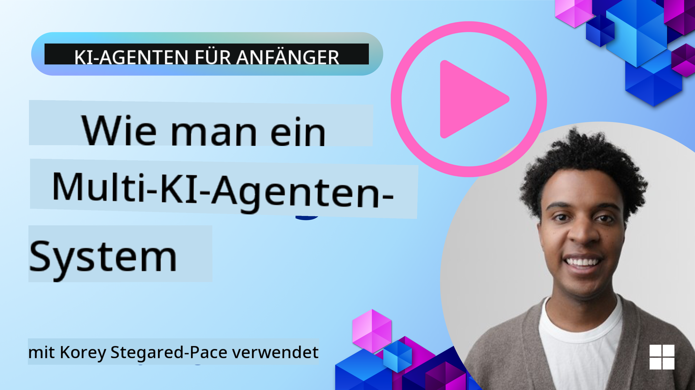
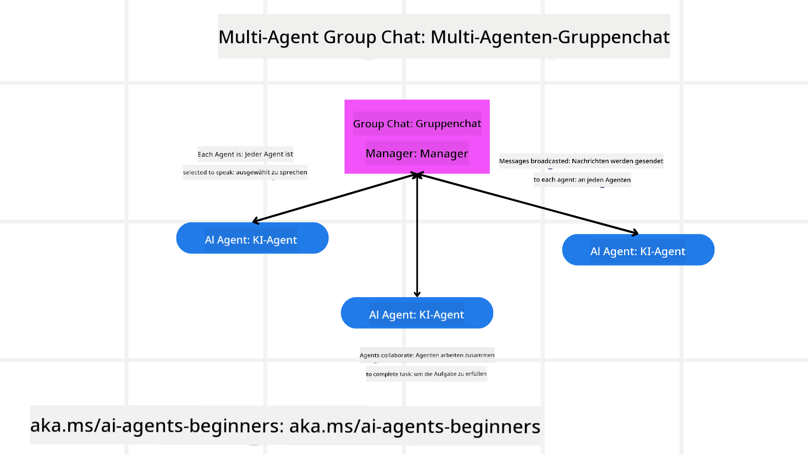
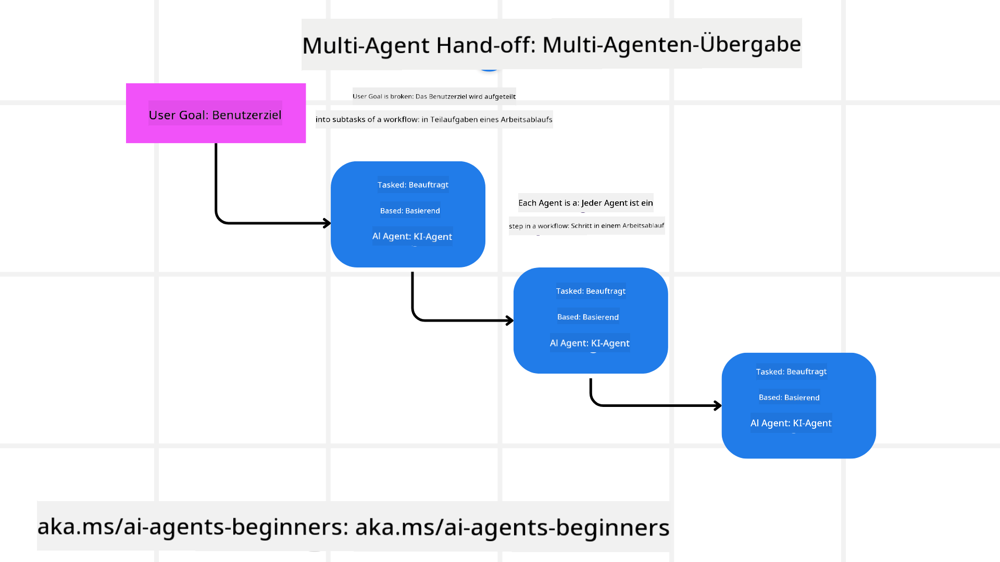
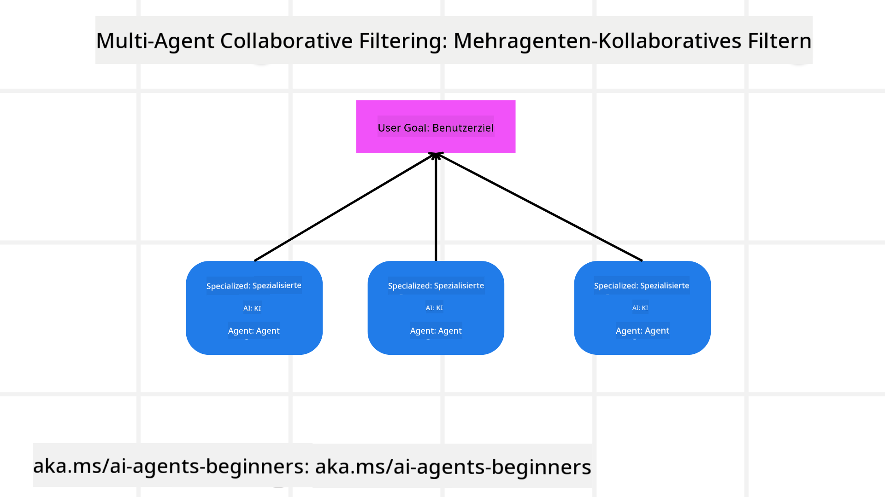

<!--
CO_OP_TRANSLATOR_METADATA:
{
  "original_hash": "1a008c204051cba8d0e253b75f261c41",
  "translation_date": "2025-08-30T07:22:45+00:00",
  "source_file": "08-multi-agent/README.md",
  "language_code": "de"
}
-->

> _(Klicken Sie auf das obige Bild, um das Video zu dieser Lektion anzusehen)_

# Multi-Agent-Designmuster

Sobald Sie an einem Projekt arbeiten, das mehrere Agenten umfasst, müssen Sie das Multi-Agent-Designmuster berücksichtigen. Es ist jedoch möglicherweise nicht sofort klar, wann der Wechsel zu Multi-Agenten sinnvoll ist und welche Vorteile dies bietet.

## Einführung

In dieser Lektion wollen wir die folgenden Fragen beantworten:

- In welchen Szenarien sind Multi-Agenten anwendbar?
- Welche Vorteile bieten Multi-Agenten im Vergleich zu einem einzelnen Agenten, der mehrere Aufgaben übernimmt?
- Was sind die Bausteine für die Implementierung des Multi-Agent-Designmusters?
- Wie können wir nachvollziehen, wie die verschiedenen Agenten miteinander interagieren?

## Lernziele

Nach dieser Lektion sollten Sie in der Lage sein:

- Szenarien zu identifizieren, in denen Multi-Agenten anwendbar sind.
- Die Vorteile von Multi-Agenten gegenüber einem einzelnen Agenten zu erkennen.
- Die Bausteine für die Implementierung des Multi-Agent-Designmusters zu verstehen.

Was ist das große Ganze?

*Multi-Agenten sind ein Designmuster, das es mehreren Agenten ermöglicht, zusammenzuarbeiten, um ein gemeinsames Ziel zu erreichen.*

Dieses Muster wird in verschiedenen Bereichen wie Robotik, autonomen Systemen und verteiltem Rechnen häufig eingesetzt.

## Szenarien, in denen Multi-Agenten anwendbar sind

In welchen Szenarien ist der Einsatz von Multi-Agenten sinnvoll? Die Antwort ist, dass es viele Szenarien gibt, in denen der Einsatz mehrerer Agenten von Vorteil ist, insbesondere in den folgenden Fällen:

- **Große Arbeitslasten**: Große Arbeitslasten können in kleinere Aufgaben unterteilt und verschiedenen Agenten zugewiesen werden, was parallele Verarbeitung und schnellere Fertigstellung ermöglicht. Ein Beispiel hierfür ist eine umfangreiche Datenverarbeitungsaufgabe.
- **Komplexe Aufgaben**: Komplexe Aufgaben können, ähnlich wie große Arbeitslasten, in kleinere Teilaufgaben zerlegt und verschiedenen Agenten zugewiesen werden, die jeweils auf einen bestimmten Aspekt der Aufgabe spezialisiert sind. Ein gutes Beispiel hierfür sind autonome Fahrzeuge, bei denen verschiedene Agenten für Navigation, Hinderniserkennung und Kommunikation mit anderen Fahrzeugen zuständig sind.
- **Vielfältige Expertise**: Unterschiedliche Agenten können über unterschiedliche Fachkenntnisse verfügen, sodass sie verschiedene Aspekte einer Aufgabe effektiver bewältigen können als ein einzelner Agent. Ein gutes Beispiel hierfür ist der Gesundheitsbereich, in dem Agenten Diagnosen, Behandlungspläne und Patientenüberwachung übernehmen können.

## Vorteile von Multi-Agenten gegenüber einem einzelnen Agenten

Ein Ein-Agenten-System kann für einfache Aufgaben gut funktionieren, aber für komplexere Aufgaben bieten mehrere Agenten mehrere Vorteile:

- **Spezialisierung**: Jeder Agent kann auf eine bestimmte Aufgabe spezialisiert sein. Ein Mangel an Spezialisierung bei einem einzelnen Agenten bedeutet, dass dieser zwar alles erledigen kann, aber bei komplexen Aufgaben möglicherweise überfordert ist. Er könnte beispielsweise eine Aufgabe übernehmen, für die er nicht optimal geeignet ist.
- **Skalierbarkeit**: Es ist einfacher, Systeme durch Hinzufügen weiterer Agenten zu skalieren, anstatt einen einzelnen Agenten zu überlasten.
- **Fehlertoleranz**: Wenn ein Agent ausfällt, können andere weiterhin funktionieren, was die Zuverlässigkeit des Systems gewährleistet.

Betrachten wir ein Beispiel: Wir möchten eine Reise für einen Benutzer buchen. Ein Ein-Agenten-System müsste alle Aspekte des Buchungsprozesses abwickeln, von der Flugsuche bis zur Hotel- und Mietwagenbuchung. Um dies mit einem einzigen Agenten zu erreichen, müsste dieser über Werkzeuge für alle diese Aufgaben verfügen. Dies könnte zu einem komplexen und monolithischen System führen, das schwer zu warten und zu skalieren ist. Ein Multi-Agenten-System hingegen könnte verschiedene Agenten haben, die auf die Flugsuche, Hotelbuchung und Mietwagen spezialisiert sind. Dies würde das System modularer, wartungsfreundlicher und skalierbarer machen.

Vergleichen Sie dies mit einem Reisebüro, das als Familienbetrieb geführt wird, im Gegensatz zu einem Reisebüro, das als Franchise organisiert ist. Der Familienbetrieb hätte einen einzigen Agenten, der alle Aspekte des Buchungsprozesses abwickelt, während das Franchise verschiedene Agenten für die unterschiedlichen Aspekte des Buchungsprozesses hätte.

## Bausteine für die Implementierung des Multi-Agent-Designmusters

Bevor Sie das Multi-Agent-Designmuster implementieren können, müssen Sie die Bausteine verstehen, die das Muster ausmachen.

Machen wir dies anhand des Beispiels einer Reisebuchung für einen Benutzer konkreter. In diesem Fall umfassen die Bausteine:

- **Agentenkommunikation**: Agenten für die Flugsuche, Hotelbuchung und Mietwagen müssen kommunizieren und Informationen über die Präferenzen und Einschränkungen des Benutzers austauschen. Sie müssen die Protokolle und Methoden für diese Kommunikation festlegen. Konkret bedeutet dies, dass der Agent für die Flugsuche mit dem Agenten für die Hotelbuchung kommunizieren muss, um sicherzustellen, dass das Hotel für die gleichen Daten wie der Flug gebucht wird. Das bedeutet, dass die Agenten Informationen über die Reisedaten des Benutzers austauschen müssen, was bedeutet, dass Sie entscheiden müssen, *welche Agenten Informationen austauschen und wie sie dies tun*.
- **Koordinationsmechanismen**: Agenten müssen ihre Aktionen koordinieren, um sicherzustellen, dass die Präferenzen und Einschränkungen des Benutzers erfüllt werden. Eine Benutzerpräferenz könnte sein, dass er ein Hotel in der Nähe des Flughafens möchte, während eine Einschränkung sein könnte, dass Mietwagen nur am Flughafen verfügbar sind. Dies bedeutet, dass der Agent für die Hotelbuchung mit dem Agenten für die Mietwagenbuchung koordinieren muss, um sicherzustellen, dass die Präferenzen und Einschränkungen des Benutzers erfüllt werden. Das bedeutet, dass Sie entscheiden müssen, *wie die Agenten ihre Aktionen koordinieren*.
- **Agentenarchitektur**: Agenten müssen über eine interne Struktur verfügen, um Entscheidungen zu treffen und aus ihren Interaktionen mit dem Benutzer zu lernen. Dies bedeutet, dass der Agent für die Flugsuche über eine interne Struktur verfügen muss, um Entscheidungen darüber zu treffen, welche Flüge dem Benutzer empfohlen werden. Das bedeutet, dass Sie entscheiden müssen, *wie die Agenten Entscheidungen treffen und aus ihren Interaktionen mit dem Benutzer lernen*. Beispiele dafür, wie ein Agent lernt und sich verbessert, könnten sein, dass der Agent für die Flugsuche ein maschinelles Lernmodell verwendet, um dem Benutzer Flüge basierend auf seinen bisherigen Präferenzen zu empfehlen.
- **Sichtbarkeit der Multi-Agenten-Interaktionen**: Sie müssen die Sichtbarkeit darüber haben, wie die verschiedenen Agenten miteinander interagieren. Das bedeutet, dass Sie Werkzeuge und Techniken zur Verfolgung der Aktivitäten und Interaktionen der Agenten benötigen. Dies könnte in Form von Protokollierungs- und Überwachungstools, Visualisierungstools und Leistungsmetriken erfolgen.
- **Multi-Agenten-Muster**: Es gibt verschiedene Muster für die Implementierung von Multi-Agenten-Systemen, wie z. B. zentralisierte, dezentralisierte und hybride Architekturen. Sie müssen das Muster auswählen, das am besten zu Ihrem Anwendungsfall passt.
- **Mensch in der Schleife**: In den meisten Fällen wird ein Mensch in den Prozess eingebunden sein, und Sie müssen die Agenten anweisen, wann sie menschliche Eingriffe anfordern sollen. Dies könnte in Form eines Benutzers geschehen, der nach einem bestimmten Hotel oder Flug fragt, den die Agenten nicht empfohlen haben, oder der eine Bestätigung vor der Buchung eines Fluges oder Hotels verlangt.

## Sichtbarkeit der Multi-Agenten-Interaktionen

Es ist wichtig, dass Sie die Sichtbarkeit darüber haben, wie die verschiedenen Agenten miteinander interagieren. Diese Sichtbarkeit ist entscheidend für das Debugging, die Optimierung und die Sicherstellung der Effektivität des Gesamtsystems. Um dies zu erreichen, benötigen Sie Werkzeuge und Techniken zur Verfolgung der Aktivitäten und Interaktionen der Agenten. Dies könnte in Form von Protokollierungs- und Überwachungstools, Visualisierungstools und Leistungsmetriken erfolgen.

Betrachten wir beispielsweise die Buchung einer Reise für einen Benutzer. Sie könnten ein Dashboard haben, das den Status jedes Agenten, die Präferenzen und Einschränkungen des Benutzers sowie die Interaktionen zwischen den Agenten anzeigt. Dieses Dashboard könnte die Reisedaten des Benutzers, die vom Flugagenten empfohlenen Flüge, die vom Hotelagenten empfohlenen Hotels und die vom Mietwagenagenten empfohlenen Mietwagen anzeigen. Dies würde Ihnen einen klaren Überblick darüber geben, wie die Agenten miteinander interagieren und ob die Präferenzen und Einschränkungen des Benutzers erfüllt werden.

Schauen wir uns diese Aspekte genauer an:

- **Protokollierungs- und Überwachungstools**: Sie möchten, dass jede Aktion eines Agenten protokolliert wird. Ein Protokolleintrag könnte Informationen über den Agenten enthalten, der die Aktion ausgeführt hat, die ausgeführte Aktion, den Zeitpunkt der Aktion und das Ergebnis der Aktion. Diese Informationen können dann für Debugging, Optimierung und mehr verwendet werden.

- **Visualisierungstools**: Visualisierungstools können Ihnen helfen, die Interaktionen zwischen Agenten auf eine intuitivere Weise zu sehen. Beispielsweise könnten Sie ein Diagramm haben, das den Informationsfluss zwischen Agenten zeigt. Dies könnte Ihnen helfen, Engpässe, Ineffizienzen und andere Probleme im System zu identifizieren.

- **Leistungsmetriken**: Leistungsmetriken können Ihnen helfen, die Effektivität des Multi-Agenten-Systems zu verfolgen. Beispielsweise könnten Sie die Zeit messen, die für die Erledigung einer Aufgabe benötigt wird, die Anzahl der pro Zeiteinheit erledigten Aufgaben und die Genauigkeit der von den Agenten gegebenen Empfehlungen. Diese Informationen können Ihnen helfen, Verbesserungsmöglichkeiten zu identifizieren und das System zu optimieren.

## Multi-Agenten-Muster

Schauen wir uns einige konkrete Muster an, die wir zur Erstellung von Multi-Agenten-Anwendungen verwenden können. Hier sind einige interessante Muster, die es zu berücksichtigen gilt:

### Gruppenchat

Dieses Muster ist nützlich, wenn Sie eine Gruppenchat-Anwendung erstellen möchten, in der mehrere Agenten miteinander kommunizieren können. Typische Anwendungsfälle für dieses Muster sind Teamzusammenarbeit, Kundensupport und soziale Netzwerke.

In diesem Muster repräsentiert jeder Agent einen Benutzer im Gruppenchat, und Nachrichten werden zwischen Agenten über ein Nachrichtenprotokoll ausgetauscht. Die Agenten können Nachrichten an den Gruppenchat senden, Nachrichten aus dem Gruppenchat empfangen und auf Nachrichten anderer Agenten antworten.

Dieses Muster kann mit einer zentralisierten Architektur implementiert werden, bei der alle Nachrichten über einen zentralen Server geleitet werden, oder mit einer dezentralisierten Architektur, bei der Nachrichten direkt ausgetauscht werden.

### Übergabe

Dieses Muster ist nützlich, wenn Sie eine Anwendung erstellen möchten, in der mehrere Agenten Aufgaben aneinander übergeben können.

Typische Anwendungsfälle für dieses Muster sind Kundensupport, Aufgabenmanagement und Workflow-Automatisierung.

In diesem Muster repräsentiert jeder Agent eine Aufgabe oder einen Schritt in einem Workflow, und Agenten können Aufgaben basierend auf vordefinierten Regeln an andere Agenten übergeben.

### Kollaboratives Filtern

Dieses Muster ist nützlich, wenn Sie eine Anwendung erstellen möchten, in der mehrere Agenten zusammenarbeiten können, um Benutzern Empfehlungen zu geben.

Warum Sie möchten, dass mehrere Agenten zusammenarbeiten, liegt daran, dass jeder Agent über unterschiedliche Fachkenntnisse verfügen kann und auf unterschiedliche Weise zum Empfehlungsprozess beitragen kann.

Betrachten wir ein Beispiel, bei dem ein Benutzer eine Empfehlung für die beste Aktie auf dem Aktienmarkt wünscht.

- **Branchenexperte**: Ein Agent könnte ein Experte für eine bestimmte Branche sein.
- **Technische Analyse**: Ein anderer Agent könnte ein Experte für technische Analysen sein.
- **Fundamentalanalyse**: Und ein weiterer Agent könnte ein Experte für Fundamentalanalysen sein. Durch die Zusammenarbeit können diese Agenten dem Benutzer eine umfassendere Empfehlung geben.

## Szenario: Rückerstattungsprozess

Betrachten wir ein Szenario, in dem ein Kunde versucht, eine Rückerstattung für ein Produkt zu erhalten. Es können mehrere Agenten an diesem Prozess beteiligt sein, aber lassen Sie uns zwischen agentenspezifischen Prozessen und allgemeinen Agenten unterscheiden, die auch in anderen Prozessen verwendet werden können.

**Agenten, die spezifisch für den Rückerstattungsprozess sind**:

Folgende Agenten könnten am Rückerstattungsprozess beteiligt sein:

- **Kundenagent**: Dieser Agent repräsentiert den Kunden und ist für die Einleitung des Rückerstattungsprozesses verantwortlich.
- **Verkäuferagent**: Dieser Agent repräsentiert den Verkäufer und ist für die Bearbeitung der Rückerstattung verantwortlich.
- **Zahlungsagent**: Dieser Agent repräsentiert den Zahlungsprozess und ist für die Rückerstattung der Zahlung des Kunden verantwortlich.
- **Lösungsagent**: Dieser Agent repräsentiert den Lösungsprozess und ist für die Lösung von Problemen verantwortlich, die während des Rückerstattungsprozesses auftreten.
- **Compliance-Agent**: Dieser Agent repräsentiert den Compliance-Prozess und ist dafür verantwortlich, sicherzustellen, dass der Rückerstattungsprozess den Vorschriften und Richtlinien entspricht.

**Allgemeine Agenten**:

Diese Agenten können in anderen Teilen Ihres Unternehmens verwendet werden.

- **Versandagent**: Dieser Agent repräsentiert den Versandprozess und ist für den Rückversand des Produkts an den Verkäufer verantwortlich. Dieser Agent kann sowohl für den Rückerstattungsprozess als auch für den allgemeinen Versand eines Produkts bei einem Kauf verwendet werden.
- **Feedback-Agent**: Dieser Agent repräsentiert den Feedback-Prozess und ist für das Sammeln von Kundenfeedback verantwortlich. Feedback kann jederzeit eingeholt werden, nicht nur während des Rückerstattungsprozesses.
- **Eskalationsagent**: Dieser Agent repräsentiert den Eskalationsprozess und ist für die Eskalation von Problemen auf eine höhere Supportebene verantwortlich. Dieser Agent kann in jedem Prozess verwendet werden, in dem Probleme eskaliert werden müssen.
- **Benachrichtigungsagent**: Dieser Agent repräsentiert den Benachrichtigungsprozess und ist für das Senden von Benachrichtigungen an den Kunden in verschiedenen Phasen des Rückerstattungsprozesses verantwortlich.
- **Analyseagent**: Dieser Agent repräsentiert den Analyseprozess und ist für die Analyse von Daten im Zusammenhang mit dem Rückerstattungsprozess verantwortlich.
- **Audit-Agent**: Dieser Agent repräsentiert den Audit-Prozess und ist dafür verantwortlich, den Rückerstattungsprozess zu überprüfen, um sicherzustellen, dass er korrekt durchgeführt wird.
- **Berichtsagent**: Dieser Agent repräsentiert den Berichtsprozess und ist für die Erstellung von Berichten über den Rückerstattungsprozess verantwortlich.
- **Wissensagent**: Dieser Agent repräsentiert den Wissensprozess und ist für die Pflege einer Wissensdatenbank mit Informationen zum Rückerstattungsprozess verantwortlich. Dieser Agent könnte sowohl über Rückerstattungen als auch über andere Teile Ihres Unternehmens informiert sein.
- **Sicherheitsagent**: Dieser Agent repräsentiert den Sicherheitsprozess und ist für die Sicherheit des Rückerstattungsprozesses verantwortlich.
- **Qualitätsagent**: Dieser Agent repräsentiert den Qualitätsprozess und ist dafür verantwortlich, die Qualität des Rückerstattungsprozesses sicherzustellen.

Es gibt eine Vielzahl von Agenten, die sowohl für den spezifischen Rückerstattungsprozess als auch für allgemeine Geschäftsprozesse verwendet werden können. Hoffentlich gibt Ihnen dies eine Vorstellung davon, wie Sie entscheiden können, welche Agenten in Ihrem Multi-Agenten-System verwendet werden sollen.

## Aufgabe
Entwerfen Sie ein Multi-Agenten-System für einen Kundensupport-Prozess. Identifizieren Sie die am Prozess beteiligten Agenten, ihre Rollen und Verantwortlichkeiten sowie ihre Interaktionen untereinander. Berücksichtigen Sie sowohl agentenspezifische Aufgaben für den Kundensupport-Prozess als auch allgemeine Agenten, die in anderen Bereichen Ihres Unternehmens eingesetzt werden können.

> Denken Sie nach, bevor Sie die folgende Lösung lesen – Sie benötigen möglicherweise mehr Agenten, als Sie denken.

> TIPP: Denken Sie an die verschiedenen Phasen des Kundensupport-Prozesses und berücksichtigen Sie auch Agenten, die für das gesamte System erforderlich sind.

## Lösung

[Lösung](./solution/solution.md)

## Wissensüberprüfung

Frage: Wann sollten Sie den Einsatz von Multi-Agenten in Betracht ziehen?

- [ ] A1: Wenn Sie eine geringe Arbeitsbelastung und eine einfache Aufgabe haben.
- [ ] A2: Wenn Sie eine hohe Arbeitsbelastung haben.
- [ ] A3: Wenn Sie eine einfache Aufgabe haben.

[Quiz zur Lösung](./solution/solution-quiz.md)

## Zusammenfassung

In dieser Lektion haben wir das Multi-Agenten-Designmuster betrachtet, einschließlich der Szenarien, in denen Multi-Agenten anwendbar sind, der Vorteile von Multi-Agenten gegenüber einem einzelnen Agenten, der Bausteine zur Implementierung des Multi-Agenten-Designmusters und der Möglichkeiten, Einblick in die Interaktionen zwischen den verschiedenen Agenten zu erhalten.

### Haben Sie weitere Fragen zum Multi-Agenten-Designmuster?

Treten Sie dem [Azure AI Foundry Discord](https://aka.ms/ai-agents/discord) bei, um sich mit anderen Lernenden auszutauschen, Sprechstunden zu besuchen und Ihre Fragen zu KI-Agenten beantwortet zu bekommen.

## Zusätzliche Ressourcen

- 

## Vorherige Lektion

[Planungsdesign](../07-planning-design/README.md)

## Nächste Lektion

[Metakognition bei KI-Agenten](../09-metacognition/README.md)

---

**Haftungsausschluss**:  
Dieses Dokument wurde mithilfe des KI-Übersetzungsdienstes [Co-op Translator](https://github.com/Azure/co-op-translator) übersetzt. Obwohl wir uns um Genauigkeit bemühen, weisen wir darauf hin, dass automatisierte Übersetzungen Fehler oder Ungenauigkeiten enthalten können. Das Originaldokument in seiner ursprünglichen Sprache sollte als maßgebliche Quelle betrachtet werden. Für kritische Informationen wird eine professionelle menschliche Übersetzung empfohlen. Wir übernehmen keine Haftung für Missverständnisse oder Fehlinterpretationen, die aus der Nutzung dieser Übersetzung entstehen.