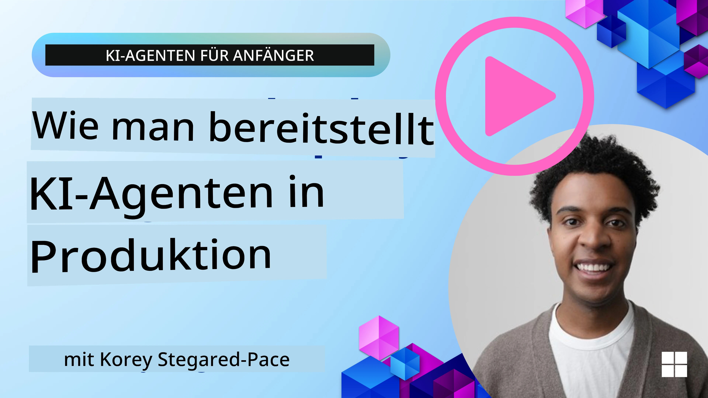

# AI Agents in Production: Observability & Evaluation

[](https://youtu.be/l4TP6IyJxmQ?si=reGOyeqjxFevyDq9)

Da KI-Agenten von experimentellen Prototypen zu Anwendungen in der realen Welt übergehen, wird die Fähigkeit, ihr Verhalten zu verstehen, ihre Leistung zu überwachen und ihre Ausgaben systematisch zu evaluieren, wichtig.

## Learning Goals

After completing this lesson, you will know how to/understand:
- Core concepts of agent observability and evaluation
- Techniques for improving the performance, costs, and effectiveness of agents
- What and how to evaluate your AI agents systematically
- How to control costs when deploying AI agents to production
- How to instrument agents built with Microsoft Agent Framework

The goal is to equip you with the knowledge to transform your "black box" agents into transparent, manageable, and dependable systems.

_**Hinweis:** Es ist wichtig, KI-Agenten zu betreiben, die sicher und vertrauenswürdig sind. Schau dir auch die Lektion [Vertrauenswürdige KI-Agenten erstellen](./06-building-trustworthy-agents/README.md) an._

## Traces and Spans

Observability-Tools wie [Langfuse](https://langfuse.com/) oder [Microsoft Foundry](https://learn.microsoft.com/en-us/azure/ai-foundry/what-is-azure-ai-foundry) stellen Agentenausführungen üblicherweise als Traces und Spans dar.

- **Trace** repräsentiert eine komplette Agentenaufgabe von Anfang bis Ende (wie das Bearbeiten einer Benutzeranfrage).
- **Spans** sind einzelne Schritte innerhalb des Traces (z. B. ein Aufruf eines Sprachmodells oder das Abrufen von Daten).


<!-- Image URL retained for illustration purposes -->

Ohne Observability kann sich ein KI-Agent wie eine „Black Box“ anfühlen – sein interner Zustand und seine Schlussfolgerungen sind undurchsichtig, was die Diagnose von Problemen oder die Optimierung der Leistung erschwert. Mit Observability werden Agenten zu „Glasboxen“, die Transparenz bieten, die für den Aufbau von Vertrauen und die Sicherstellung eines beabsichtigten Betriebs entscheidend ist.

## Why Observability Matters in Production Environments

Der Übergang von KI-Agenten in Produktionsumgebungen bringt neue Herausforderungen und Anforderungen mit sich. Observability ist nicht länger nur „nice-to-have“, sondern eine kritische Fähigkeit:

*   **Debugging und Root-Cause-Analyse**: Wenn ein Agent fehlschlägt oder unerwartete Ausgaben erzeugt, liefern Observability-Tools die Traces, die benötigt werden, um die Fehlerquelle zu lokalisieren. Dies ist besonders wichtig bei komplexen Agenten, die mehrere LLM-Aufrufe, Tool-Interaktionen und bedingte Logik enthalten können.
*   **Latenz- und Kostenmanagement**: KI-Agenten sind oft auf LLMs und andere externe APIs angewiesen, die pro Token oder pro Aufruf abgerechnet werden. Observability ermöglicht eine präzise Nachverfolgung dieser Aufrufe und hilft, Operationen zu identifizieren, die übermäßig langsam oder teuer sind. Dadurch können Teams Prompts optimieren, effizientere Modelle auswählen oder Workflows neu gestalten, um Betriebskosten zu kontrollieren und eine gute Benutzererfahrung sicherzustellen.
*   **Vertrauen, Sicherheit und Compliance**: In vielen Anwendungen ist es wichtig sicherzustellen, dass Agenten sicher und ethisch handeln. Observability liefert eine Prüfkette der Aktionen und Entscheidungen des Agenten. Diese kann verwendet werden, um Probleme wie Prompt-Injection, die Erzeugung schädlicher Inhalte oder den unsachgemäßen Umgang mit personenbezogenen Daten (PII) zu erkennen und zu mildern. Beispielsweise können Sie Traces überprüfen, um zu verstehen, warum ein Agent eine bestimmte Antwort gegeben oder ein bestimmtes Tool verwendet hat.
*   **Kontinuierliche Verbesserungszyklen**: Observability-Daten bilden die Grundlage für einen iterativen Entwicklungsprozess. Durch die Überwachung der Agentenleistung in der realen Welt können Teams Verbesserungsbereiche identifizieren, Daten für das Feintuning von Modellen sammeln und die Auswirkungen von Änderungen validieren. Dies schafft einen Feedback-Loop, in dem Erkenntnisse aus Online-Evaluationen Offline-Experimente und Verfeinerungen informieren, was zu einer stetigen Verbesserung der Agentenleistung führt.

## Key Metrics to Track

Um das Verhalten von Agenten zu überwachen und zu verstehen, sollten verschiedene Metriken und Signale erfasst werden. Während die spezifischen Metriken je nach Zweck des Agenten variieren können, sind einige allgemein wichtig.

Hier sind einige der gebräuchlichsten Metriken, die Observability-Tools überwachen:

**Latenz:** Wie schnell reagiert der Agent? Lange Wartezeiten wirken sich negativ auf die Benutzererfahrung aus. Du solltest die Latenz für Aufgaben und einzelne Schritte messen, indem du Agentenläufe verfolgst. Zum Beispiel könnte ein Agent, der 20 Sekunden für alle Modellaufrufe benötigt, durch die Verwendung eines schnelleren Modells oder durch paralleles Ausführen von Modellaufrufen beschleunigt werden.

**Kosten:** Wie hoch sind die Ausgaben pro Agentenlauf? KI-Agenten sind auf LLM-Aufrufe angewiesen, die pro Token oder externe APIs abgerechnet werden. Häufige Tool-Nutzungen oder mehrere Prompts können die Kosten schnell erhöhen. Wenn ein Agent beispielsweise ein LLM fünfmal aufruft, um nur eine marginale Qualitätsverbesserung zu erzielen, muss bewertet werden, ob die Kosten gerechtfertigt sind oder ob die Anzahl der Aufrufe reduziert oder ein günstigeres Modell verwendet werden kann. Echtzeitüberwachung kann auch unerwartete Spitzen (z. B. durch Bugs verursachte übermäßige API-Schleifen) identifizieren.

**Request Errors:** Wie viele Anfragen sind fehlgeschlagen? Dies kann API-Fehler oder fehlgeschlagene Tool-Aufrufe umfassen. Um deinen Agenten in der Produktion robuster gegen solche Fehler zu machen, kannst du Fallbacks oder Wiederholungsmechanismen einrichten. Z. B. wenn LLM-Anbieter A ausgefallen ist, schaltest du als Backup auf LLM-Anbieter B.

**Benutzerfeedback:** Direkte Benutzerevaluationen liefern wertvolle Einblicke. Dies kann explizite Bewertungen (👍 Daumen hoch / 👎 Daumen runter, ⭐1–5 Sterne) oder textuelle Kommentare umfassen. Konsequent negatives Feedback sollte Alarm schlagen, da dies ein Zeichen dafür ist, dass der Agent nicht wie erwartet funktioniert.

**Implizites Benutzerfeedback:** Nutzerverhalten liefert indirektes Feedback, auch ohne explizite Bewertungen. Dazu gehören sofortige Umformulierungen von Fragen, wiederholte Anfragen oder das Klicken auf eine Retry-Schaltfläche. Z. B. wenn du siehst, dass Nutzer wiederholt dieselbe Frage stellen, ist das ein Zeichen dafür, dass der Agent nicht wie erwartet funktioniert.

**Genauigkeit:** Wie häufig erzeugt der Agent korrekte oder gewünschte Ausgaben? Die Definition von Genauigkeit variiert (z. B. Korrektheit bei Problemlösungen, Trefferquote bei Informationsabruf, Nutzerzufriedenheit). Der erste Schritt ist zu definieren, wie Erfolg für deinen Agenten aussieht. Du kannst die Genauigkeit über automatisierte Prüfungen, Evaluations-Scores oder Task-Completion-Labels verfolgen. Zum Beispiel durch Markieren von Traces als „succeeded“ oder „failed“.

**Automatisierte Evaluationsmetriken:** Du kannst auch automatisierte Evals einrichten. Beispielsweise kannst du ein LLM verwenden, um die Ausgabe des Agenten zu bewerten, z. B. ob sie hilfreich oder genau ist. Es gibt auch mehrere Open-Source-Bibliotheken, die dir helfen, verschiedene Aspekte des Agenten zu bewerten. Z. B. [RAGAS](https://docs.ragas.io/) für RAG-Agenten oder [LLM Guard](https://llm-guard.com/), um schädliche Sprache oder Prompt-Injection zu erkennen.

In der Praxis bietet eine Kombination dieser Metriken die beste Abdeckung für die Gesundheit eines KI-Agenten. In diesem Kapitel zeigen wir dir im [Beispiel-Notebook](./code_samples/10-expense_claim-demo.ipynb), wie diese Metriken in realen Beispielen aussehen, aber zuerst lernen wir, wie ein typischer Evaluations-Workflow aussieht.

## Instrument your Agent

Um Tracing-Daten zu sammeln, musst du deinen Code instrumentieren. Das Ziel ist es, den Agentencode so zu instrumentieren, dass Traces und Metriken erzeugt werden, die von einer Observability-Plattform erfasst, verarbeitet und visualisiert werden können.

**OpenTelemetry (OTel):** [OpenTelemetry](https://opentelemetry.io/) hat sich als Branchenstandard für LLM-Observability etabliert. Es bietet eine Reihe von APIs, SDKs und Tools zum Generieren, Sammeln und Exportieren von Telemetriedaten.

Es gibt viele Instrumentierungsbibliotheken, die bestehende Agentenframeworks einbetten und das Exportieren von OpenTelemetry-Spans zu einem Observability-Tool erleichtern. Microsoft Agent Framework integriert sich nativ mit OpenTelemetry. Nachfolgend ein Beispiel zur Instrumentierung eines MAF-Agenten:

```python
from agent_framework.observability import get_tracer, get_meter

tracer = get_tracer()
meter = get_meter()

with tracer.start_as_current_span("agent_run"):
    # Die Ausführung des Agenten wird automatisch nachverfolgt.
    pass
```

Das [Beispiel-Notebook](./code_samples/10-expense_claim-demo.ipynb) in diesem Kapitel demonstriert, wie du deinen MAF-Agenten instrumentierst.

**Manuelle Span-Erstellung:** Während Instrumentierungsbibliotheken eine gute Basis bieten, gibt es oft Fälle, in denen detailliertere oder benutzerdefinierte Informationen benötigt werden. Du kannst Spans manuell erstellen, um benutzerdefinierte Anwendungslogik hinzuzufügen. Noch wichtiger ist, dass sie automatisch oder manuell erstellte Spans mit benutzerdefinierten Attributen (auch Tags oder Metadaten genannt) anreichern können. Diese Attribute können geschäftsspezifische Daten, Zwischenberechnungen oder jeden Kontext enthalten, der für Debugging oder Analyse nützlich sein könnte, wie `user_id`, `session_id` oder `model_version`.

Beispiel zur manuellen Erstellung von Traces und Spans mit dem [Langfuse Python SDK](https://langfuse.com/docs/sdk/python/sdk-v3):

```python
from langfuse import get_client
 
langfuse = get_client()
 
span = langfuse.start_span(name="my-span")
 
span.end()
```

## Agent Evaluation

Observability liefert uns Metriken, aber Evaluation ist der Prozess, diese Daten zu analysieren (und Tests durchzuführen), um zu bestimmen, wie gut ein KI-Agent arbeitet und wie er verbessert werden kann. Mit anderen Worten: Wenn du erst einmal diese Traces und Metriken hast, wie nutzt du sie, um den Agenten zu bewerten und Entscheidungen zu treffen?

Regelmäßige Evaluation ist wichtig, weil KI-Agenten oft nicht-deterministisch sind und sich entwickeln können (durch Updates oder driftendes Modellverhalten) – ohne Evaluation würdest du nicht wissen, ob dein „smarter Agent“ tatsächlich seine Aufgabe gut erfüllt oder ob er regressiert ist.

Es gibt zwei Kategorien von Evaluationen für KI-Agenten: **Online-Evaluation** und **Offline-Evaluation**. Beide sind wertvoll und ergänzen sich. Üblicherweise beginnen wir mit der Offline-Evaluation, da dies der minimale notwendige Schritt ist, bevor ein Agent eingesetzt wird.

### Offline Evaluation


Dies beinhaltet die Bewertung des Agenten in einer kontrollierten Umgebung, typischerweise mit Testdatensätzen und nicht mit Live-Benutzeranfragen. Du verwendest kuratierte Datensätze, bei denen du weißt, was die erwartete Ausgabe oder das korrekte Verhalten ist, und führst dann deinen Agenten darauf aus.

Wenn du z. B. einen Agenten für Textaufgaben in Mathematik aufgebaut hast, könntest du einen [Testdatensatz](https://huggingface.co/datasets/gsm8k) mit 100 Aufgaben und bekannten Antworten haben. Offline-Evaluation wird oft während der Entwicklung durchgeführt (und kann Teil von CI/CD-Pipelines sein), um Verbesserungen zu prüfen oder Regressionen zu verhindern. Der Vorteil ist, dass sie **wiederholbar ist und klare Genauigkeitsmetriken liefert, da du eine Ground-Truth hast**. Du kannst auch Benutzeranfragen simulieren und die Antworten des Agenten mit Idealantworten vergleichen oder automatisierte Metriken wie oben beschrieben verwenden.

Die zentrale Herausforderung bei der Offline-Eval besteht darin, sicherzustellen, dass dein Testdatensatz umfassend und relevant bleibt – der Agent kann auf einem festen Testset gut abschneiden, aber in der Produktion sehr unterschiedliche Anfragen erleben. Daher solltest du Testsets mit neuen Edge-Cases und Beispielen aktualisieren, die reale Szenarien widerspiegeln​. Eine Mischung aus kleinen „Smoke-Test“-Fällen und größeren Evaluationssätzen ist nützlich: kleine Sets für schnelle Checks und größere für breitere Leistungsmetriken​.

### Online Evaluation 


Dies bezieht sich auf die Bewertung des Agenten in einer Live-Real-World-Umgebung, d. h. während der tatsächlichen Nutzung in der Produktion. Die Online-Evaluation umfasst die kontinuierliche Überwachung der Agentenleistung bei echten Benutzerinteraktionen und die Analyse der Ergebnisse.

Beispielsweise könntest du Erfolgsraten, Nutzerzufriedenheitswerte oder andere Metriken auf Live-Traffic verfolgen. Der Vorteil der Online-Evaluation ist, dass sie **Dinge erfasst, die du im Labor nicht vorhersehen könntest** – du kannst Modell-Drift über die Zeit beobachten (wenn die Effektivität des Agenten mit sich ändernden Eingabemustern abnimmt) und unerwartete Anfragen oder Situationen erkennen, die nicht in deinen Testdaten enthalten waren​. Sie liefert ein echtes Bild davon, wie sich der Agent „im Feld“ verhält.

Online-Evaluation beinhaltet oft das Sammeln impliziten und expliziten Benutzerfeedbacks, wie oben besprochen, und möglicherweise das Durchführen von Shadow-Tests oder A/B-Tests (bei denen eine neue Version des Agenten parallel ausgeführt wird, um sie mit der alten zu vergleichen). Die Herausforderung besteht darin, zuverlässige Labels oder Scores für Live-Interaktionen zu erhalten – du könntest auf Nutzerfeedback oder nachgelagerte Metriken angewiesen sein (z. B. hat der Nutzer auf das Ergebnis geklickt).

### Combining the two

Online- und Offline-Evaluationen schließen sich nicht gegenseitig aus; sie ergänzen sich stark. Erkenntnisse aus der Online-Überwachung (z. B. neue Arten von Benutzeranfragen, bei denen der Agent schlecht abschneidet) können verwendet werden, um Offline-Testdatensätze zu erweitern und zu verbessern. Umgekehrt können Agenten, die in Offline-Tests gut abschneiden, mit größerer Zuversicht in der Produktion bereitgestellt und online überwacht werden.

Tatsächlich übernehmen viele Teams eine Schleife:

_evaluate offline -> deploy -> monitor online -> collect new failure cases -> add to offline dataset -> refine agent -> repeat_.

## Common Issues

Wenn du KI-Agenten in der Produktion einsetzt, kannst du auf verschiedene Herausforderungen stoßen. Hier sind einige häufige Probleme und mögliche Lösungen:

| **Issue**    | **Potential Solution**   |
| ------------- | ------------------ |
| AI Agent not performing tasks consistently | - Verfeinere den Prompt, der dem KI-Agenten gegeben wird; sei klar in den Zielen.<br>- Identifiziere, wo das Aufteilen der Aufgaben in Unteraufgaben und deren Bearbeitung durch mehrere Agenten helfen kann. |
| AI Agent running into continuous loops  | - Stelle sicher, dass du klare Abbruchbedingungen hast, damit der Agent weiß, wann der Prozess beendet werden soll.<br>- Für komplexe Aufgaben, die Schlussfolgern und Planung erfordern, verwende ein größeres Modell, das auf Reasoning-Aufgaben spezialisiert ist. |
| AI Agent tool calls are not performing well   | - Teste und validiere die Ausgabe des Tools außerhalb des Agentensystems.<br>- Verfeinere die definierten Parameter, Prompts und die Benennung der Tools.  |
| Multi-Agent system not performing consistently | - Verfeinere die Prompts, die jedem Agenten gegeben werden, um sicherzustellen, dass sie spezifisch und voneinander unterscheidbar sind.<br>- Baue ein hierarchisches System unter Verwendung eines „Routing“- oder Controller-Agenten auf, um zu bestimmen, welcher Agent der richtige ist. |

Viele dieser Probleme lassen sich mit Observability effektiver identifizieren. Die zuvor besprochenen Traces und Metriken helfen dabei, genau zu bestimmen, wo im Agenten-Workflow Probleme auftreten, wodurch Debugging und Optimierung deutlich effizienter werden.

## Managing Costs
Hier sind einige Strategien, um die Kosten für die Bereitstellung von KI-Agenten in der Produktion zu senken:

**Using Smaller Models:** Small Language Models (SLMs) können bei bestimmten agentenhaften Anwendungsfällen gute Leistungen erbringen und die Kosten deutlich senken. Wie bereits erwähnt, ist der Aufbau eines Evaluationssystems zur Bestimmung und zum Vergleich der Leistung gegenüber größeren Modellen die beste Methode, um zu verstehen, wie gut ein SLM in Ihrem Anwendungsfall abschneidet. Erwägen Sie den Einsatz von SLMs für einfachere Aufgaben wie Intent-Klassifizierung oder Parameterextraktion, während Sie größere Modelle für komplexes Schlussfolgern vorsehen.

**Using a Router Model:** Eine ähnliche Strategie besteht darin, verschiedene Modelle und Größen zu verwenden. Sie können ein LLM/SLM oder eine serverlose Funktion verwenden, um Anfragen basierend auf der Komplexität an die am besten passenden Modelle weiterzuleiten. Dies hilft ebenfalls, Kosten zu senken und gleichzeitig die Leistung bei den richtigen Aufgaben sicherzustellen. Zum Beispiel leiten Sie einfache Anfragen an kleinere, schnellere Modelle weiter und verwenden teure, große Modelle nur für komplexe Schlussfolgerungen.

**Caching Responses:** Die Identifizierung häufiger Anfragen und Aufgaben und das Bereitstellen der Antworten, bevor sie Ihr agentenbasiertes System durchlaufen, ist eine gute Methode, um das Volumen ähnlicher Anfragen zu reduzieren. Sie können sogar einen Ablauf implementieren, um zu bestimmen, wie ähnlich eine Anfrage Ihren zwischengespeicherten Anfragen mithilfe einfacherer KI-Modelle ist. Diese Strategie kann die Kosten bei häufig gestellten Fragen oder gängigen Workflows erheblich senken.

## Lets see how this works in practice

In the [Beispiel-Notebook dieses Abschnitts](./code_samples/10-expense_claim-demo.ipynb), we’ll see examples of how we can use observability tools to monitor and evaluate our agent.


### Got More Questions about AI Agents in Production?

Treten Sie dem [Microsoft Foundry Discord](https://aka.ms/ai-agents/discord) bei, um andere Lernende zu treffen, an Sprechstunden teilzunehmen und Antworten auf Ihre Fragen zu KI-Agenten zu erhalten.

## Previous Lesson

[Metakognition-Designmuster](../09-metacognition/README.md)

## Next Lesson

[Agentische Protokolle](../11-agentic-protocols/README.md)

---

<!-- CO-OP TRANSLATOR DISCLAIMER START -->
Haftungsausschluss:
Dieses Dokument wurde mit dem KI-Übersetzungsdienst Co-op Translator (https://github.com/Azure/co-op-translator) übersetzt. Obwohl wir uns um Genauigkeit bemühen, beachten Sie bitte, dass automatisierte Übersetzungen Fehler oder Ungenauigkeiten enthalten können. Das Originaldokument in seiner Originalsprache ist als maßgebliche Quelle zu betrachten. Für wichtige Informationen wird eine professionelle Übersetzung durch einen qualifizierten Übersetzer empfohlen. Wir übernehmen keine Haftung für Missverständnisse oder Fehlinterpretationen, die aus der Verwendung dieser Übersetzung entstehen.
<!-- CO-OP TRANSLATOR DISCLAIMER END -->