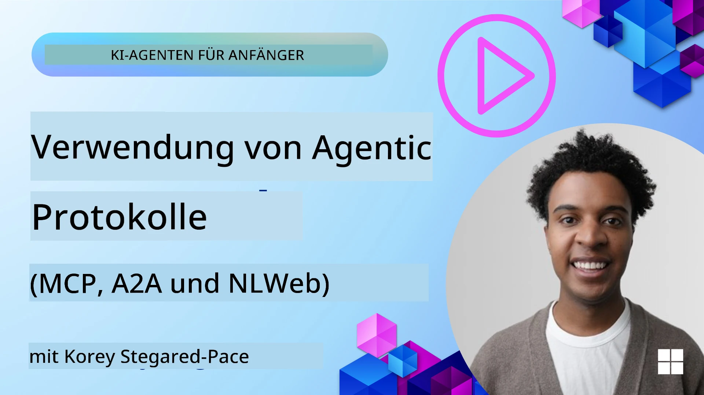
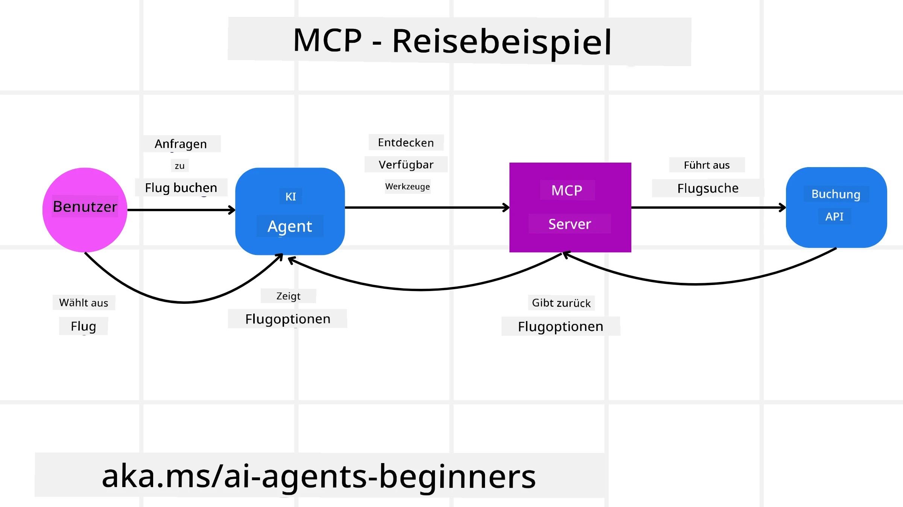
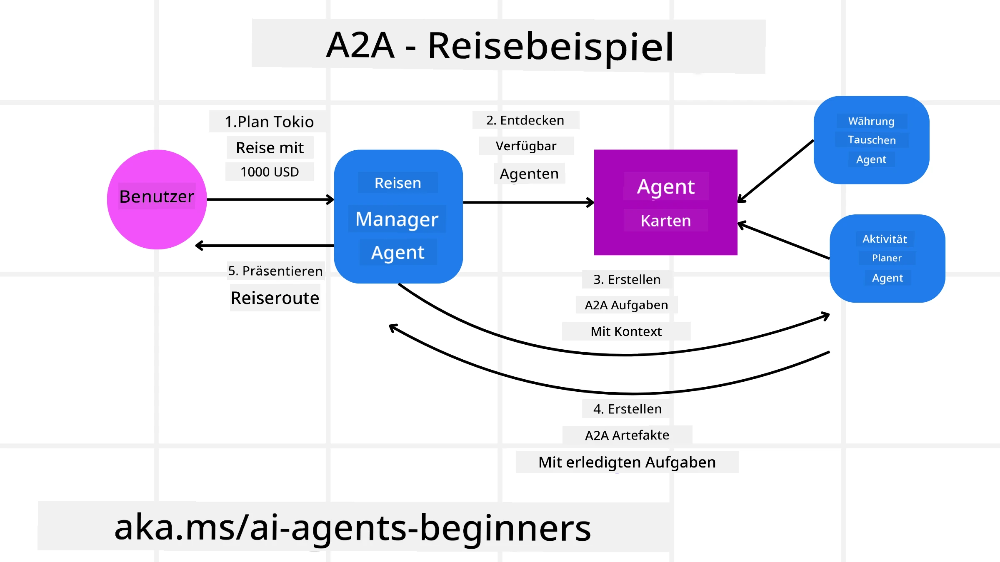
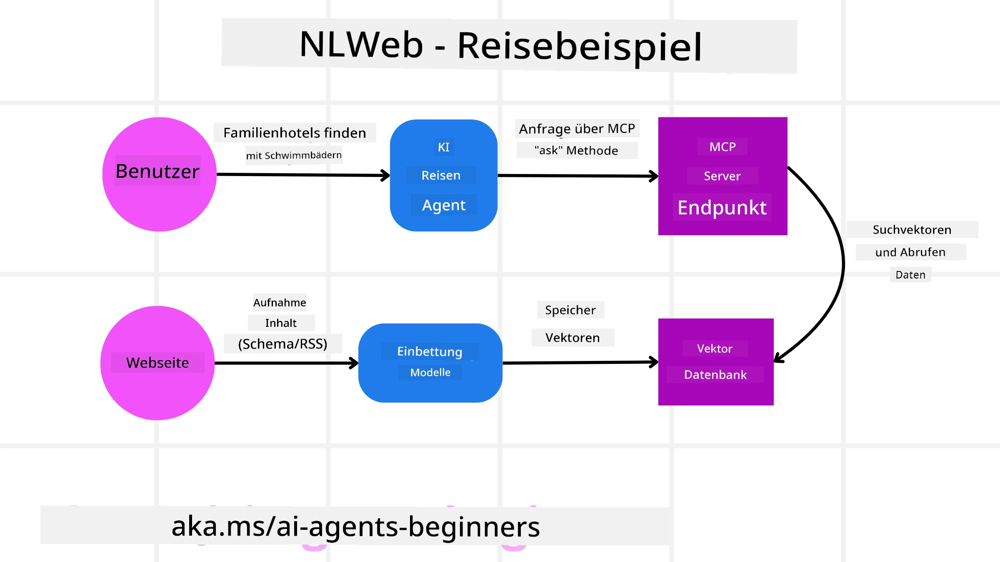

# Verwendung agentischer Protokolle (MCP, A2A und NLWeb)

> _(Klicken Sie auf das obige Bild, um das Video zu dieser Lektion anzusehen)_

Da der Einsatz von KI-Agenten zunimmt, wächst auch der Bedarf an Protokollen, die Standardisierung, Sicherheit und offene Innovation unterstützen. In dieser Lektion behandeln wir drei Protokolle, die darauf abzielen, diesen Bedarf zu decken - Model Context Protocol (MCP), Agent to Agent (A2A) und Natural Language Web (NLWeb).

## Einführung

In dieser Lektion behandeln wir:

• Wie **MCP** KI-Agenten ermöglicht, auf externe Werkzeuge und Daten zuzugreifen, um Aufgaben für Benutzer zu erfüllen.

•  Wie **A2A** die Kommunikation und Zusammenarbeit zwischen verschiedenen KI-Agenten ermöglicht.

• Wie **NLWeb** natürliche Sprachschnittstellen für jede Website bereitstellt, sodass KI-Agenten Inhalte entdecken und mit ihnen interagieren können.

## Lernziele

• **Identifizieren** des Kernzwecks und der Vorteile von MCP, A2A und NLWeb im Kontext von KI-Agenten.

• **Erklären**, wie jedes Protokoll die Kommunikation und Interaktion zwischen LLMs, Werkzeugen und anderen Agenten erleichtert.

• **Erkennen** der unterschiedlichen Rollen, die jedes Protokoll beim Aufbau komplexer agentischer Systeme spielt.

## Model Context Protocol

Das **Model Context Protocol (MCP)** ist ein offener Standard, der eine standardisierte Möglichkeit bietet, Anwendungen Kontext und Werkzeuge für LLMs bereitzustellen. Dies ermöglicht einen "universellen Adapter" zu verschiedenen Datenquellen und Werkzeugen, mit dem sich KI-Agenten konsistent verbinden können.

Schauen wir uns die Komponenten von MCP, die Vorteile gegenüber direkter API-Nutzung und ein Beispiel an, wie KI-Agenten einen MCP-Server verwenden könnten.

### MCP Kernkomponenten

MCP arbeitet mit einer **Client-Server-Architektur** und die Kernkomponenten sind:

• **Hosts** sind LLM-Anwendungen (zum Beispiel ein Code-Editor wie VSCode), die die Verbindungen zu einem MCP-Server starten.

• **Clients** sind Komponenten innerhalb der Host-Anwendung, die Eins-zu-eins-Verbindungen zu Servern aufrechterhalten.

• **Servers** sind leichte Programme, die bestimmte Fähigkeiten bereitstellen.

Im Protokoll enthalten sind drei Kernprimitiven, die die Fähigkeiten eines MCP-Servers darstellen:

• **Tools**: Dies sind diskrete Aktionen oder Funktionen, die ein KI-Agent aufrufen kann, um eine Aufgabe auszuführen. Zum Beispiel könnte ein Wetterdienst ein "get weather"-Tool anbieten, oder ein E-Commerce-Server könnte ein "purchase product"-Tool bereitstellen. MCP-Server werben in ihrer Fähigkeitenauflistung mit dem Namen jedes Tools, einer Beschreibung und dem Eingabe-/Ausgabe-Schema.

• **Resources**: Dies sind schreibgeschützte Datenobjekte oder Dokumente, die ein MCP-Server bereitstellen kann und die Clients bei Bedarf abrufen können. Beispiele sind Dateiinhalte, Datenbankeinträge oder Protokolldateien. Ressourcen können Text (wie Code oder JSON) oder Binärdaten (wie Bilder oder PDFs) sein.

• **Prompts**: Dies sind vordefinierte Vorlagen, die vorgeschlagene Eingabeaufforderungen liefern und komplexere Workflows ermöglichen.

### Vorteile von MCP

MCP bietet erhebliche Vorteile für KI-Agenten:

• **Dynamische Werkzeugerkennung**: Agenten können dynamisch eine Liste verfügbarer Werkzeuge von einem Server erhalten, zusammen mit Beschreibungen dessen, was sie tun. Dies steht im Gegensatz zu traditionellen APIs, die oft statische Codierung für Integrationen erfordern, was bedeutet, dass jede API-Änderung Code-Updates nötig macht. MCP bietet einen "einmal integrieren"-Ansatz und führt zu größerer Anpassungsfähigkeit.

• **Interoperabilität zwischen LLMs**: MCP funktioniert mit verschiedenen LLMs und bietet die Flexibilität, das Kernmodell zu wechseln, um bessere Leistung zu bewerten.

• **Standardisierte Sicherheit**: MCP beinhaltet eine standardisierte Authentifizierungsmethode, die die Skalierbarkeit beim Hinzufügen des Zugriffs auf zusätzliche MCP-Server verbessert. Dies ist einfacher als das Verwalten unterschiedlicher Schlüssel und Authentifizierungstypen für verschiedene traditionelle APIs.

### MCP-Beispiel

Stellen Sie sich vor, ein Benutzer möchte mit einem von MCP unterstützten KI-Assistenten einen Flug buchen.

1. **Verbindung**: Der KI-Assistent (der MCP-Client) verbindet sich mit einem MCP-Server einer Fluggesellschaft.

2. **Werkzeugentdeckung**: Der Client fragt den MCP-Server der Fluggesellschaft: "Welche Werkzeuge habt ihr verfügbar?" Der Server antwortet mit Werkzeugen wie "search flights" und "book flights".

3. **Werkzeugaufruf**: Sie bitten den KI-Assistenten: "Bitte suche einen Flug von Portland nach Honolulu." Der KI-Assistent identifiziert mithilfe seines LLM, dass er das Werkzeug "search flights" aufrufen muss, und übergibt die relevanten Parameter (Abflugort, Ziel) an den MCP-Server.

4. **Ausführung und Antwort**: Der MCP-Server fungiert als Wrapper und führt den eigentlichen Aufruf an die interne Buchungs-API der Fluggesellschaft aus. Er erhält dann die Fluginformationen (z. B. JSON-Daten) und sendet sie an den KI-Assistenten zurück.

5. **Weitere Interaktion**: Der KI-Assistent präsentiert die Flugoptionen. Sobald Sie einen Flug ausgewählt haben, ruft der Assistent möglicherweise das Werkzeug "book flight" beim selben MCP-Server auf und schließt die Buchung ab.

## Agent-to-Agent Protocol (A2A)

Während MCP darauf abzielt, LLMs mit Werkzeugen zu verbinden, geht das **Agent-to-Agent (A2A) Protocol** einen Schritt weiter, indem es die Kommunikation und Zusammenarbeit zwischen verschiedenen KI-Agenten ermöglicht. A2A verbindet KI-Agenten über verschiedene Organisationen, Umgebungen und Technologiestacks hinweg, um eine gemeinsame Aufgabe zu erfüllen.

Wir betrachten die Komponenten und Vorteile von A2A sowie ein Beispiel, wie es in unserer Reiseanwendung angewendet werden könnte.

### A2A Kernkomponenten

A2A konzentriert sich darauf, Kommunikation zwischen Agenten zu ermöglichen und sie zusammenarbeiten zu lassen, um eine Teilaufgabe des Benutzers zu erledigen. Jede Komponente des Protokolls trägt dazu bei:

#### Agent Card

Ähnlich wie ein MCP-Server eine Liste von Werkzeugen teilt, enthält eine Agent Card:
- Der Name des Agenten .
- Eine **Beschreibung der allgemeinen Aufgaben**, die er ausführt.
- Eine **Liste spezifischer Fähigkeiten** mit Beschreibungen, die anderen Agenten (oder sogar menschlichen Nutzern) helfen zu verstehen, wann und warum sie diesen Agenten aufrufen sollten.
- Die **aktuelle Endpoint-URL** des Agenten
- Die **Version** und **Fähigkeiten** des Agenten wie Streaming-Antworten und Push-Benachrichtigungen.

#### Agent Executor

Der Agent Executor ist dafür verantwortlich, **den Kontext des Benutzerchats an den entfernten Agenten weiterzugeben**, den der entfernte Agent benötigt, um die zu erledigende Aufgabe zu verstehen. In einem A2A-Server verwendet ein Agent sein eigenes Large Language Model (LLM), um eingehende Anfragen zu analysieren und Aufgaben mit seinen eigenen internen Werkzeugen auszuführen.

#### Artifact

Sobald ein entfernter Agent die angeforderte Aufgabe abgeschlossen hat, wird sein Arbeitsergebnis als Artefakt erstellt. Ein Artefakt **enthält das Ergebnis der Arbeit des Agenten**, eine **Beschreibung dessen, was abgeschlossen wurde**, und den **Textkontext**, der durch das Protokoll gesendet wird. Nachdem das Artefakt gesendet wurde, wird die Verbindung mit dem entfernten Agenten geschlossen, bis sie erneut benötigt wird.

#### Event Queue

Diese Komponente wird zum **Verwalten von Updates und zum Weiterleiten von Nachrichten** verwendet. Sie ist besonders wichtig in Produktionsumgebungen für agentische Systeme, um zu verhindern, dass die Verbindung zwischen Agenten geschlossen wird, bevor eine Aufgabe abgeschlossen ist, insbesondere wenn Aufgaben längere Zeit in Anspruch nehmen können.

### Vorteile von A2A

• **Verbesserte Zusammenarbeit**: Es ermöglicht Agenten von verschiedenen Anbietern und Plattformen, miteinander zu interagieren, Kontext zu teilen und zusammenzuarbeiten, wodurch nahtlose Automatisierungen über traditionell getrennte Systeme hinweg erleichtert werden.

• **Flexibilität bei der Modellauswahl**: Jeder A2A-Agent kann entscheiden, welches LLM er zur Bearbeitung seiner Anfragen verwendet, wodurch pro Agent optimierte oder feinabgestimmte Modelle möglich sind, im Gegensatz zu einer einzigen LLM-Verbindung in einigen MCP-Szenarien.

• **Integrierte Authentifizierung**: Die Authentifizierung ist direkt in das A2A-Protokoll integriert und bietet ein robustes Sicherheitsframework für Agenteninteraktionen.

### A2A-Beispiel

Erweitern wir unser Szenario der Reisebuchung, dieses Mal unter Verwendung von A2A.

1. **Benutzeranfrage an Multi-Agent**: Ein Benutzer interagiert mit einem "Travel Agent"-A2A-Client/Agent, vielleicht indem er sagt: "Bitte buche eine komplette Reise nach Honolulu für nächste Woche, einschließlich Flügen, Hotel und Mietwagen".

2. **Orchestrierung durch den Travel Agent**: Der Travel Agent erhält diese komplexe Anfrage. Er verwendet sein LLM, um über die Aufgabe nachzudenken und festzustellen, dass er mit anderen spezialisierten Agenten interagieren muss.

3. **Inter-Agenten-Kommunikation**: Der Travel Agent nutzt das A2A-Protokoll, um sich mit nachgelagerten Agenten zu verbinden, wie einem "Airline Agent", einem "Hotel Agent" und einem "Car Rental Agent", die von verschiedenen Unternehmen erstellt wurden.

4. **Delegierte Aufgabenausführung**: Der Travel Agent sendet spezifische Aufgaben an diese spezialisierten Agenten (z. B. "Finde Flüge nach Honolulu", "Buche ein Hotel", "Miete ein Auto"). Jeder dieser spezialisierten Agenten, der sein eigenes LLM betreibt und seine eigenen Werkzeuge nutzt (die selbst MCP-Server sein könnten), führt seinen spezifischen Teil der Buchung aus.

5. **Konsolidierte Antwort**: Sobald alle nachgelagerten Agenten ihre Aufgaben abgeschlossen haben, fasst der Travel Agent die Ergebnisse (Flugdetails, Hotelbestätigung, Mietwagenbuchung) zusammen und sendet eine umfassende, chat-artige Antwort an den Benutzer.

## Natural Language Web (NLWeb)

Websites sind seit langem der Hauptweg, auf dem Benutzer Informationen und Daten im Internet abrufen.

Schauen wir uns die verschiedenen Komponenten von NLWeb, die Vorteile von NLWeb und ein Beispiel dafür an, wie unser NLWeb funktioniert, indem wir uns unsere Reiseanwendung ansehen.

### Komponenten von NLWeb

- **NLWeb Application (Core Service Code)**: Das System, das natürliche Sprachfragen verarbeitet. Es verbindet die verschiedenen Teile der Plattform, um Antworten zu erzeugen. Sie können es als die **Engine betrachten, die die natürlichen Sprachfunktionen** einer Website antreibt.

- **NLWeb Protocol**: Dies ist ein **grundlegendes Regelwerk für natürliche Sprachinteraktion** mit einer Website. Es sendet Antworten im JSON-Format zurück (oft unter Verwendung von Schema.org). Sein Zweck ist es, eine einfache Grundlage für das "AI Web" zu schaffen, ähnlich wie HTML es möglich gemacht hat, Dokumente online zu teilen.

- **MCP Server (Model Context Protocol Endpoint)**: Jede NLWeb-Konfiguration fungiert auch als **MCP-Server**. Das bedeutet, dass sie **Werkzeuge (wie eine "ask"-Methode) und Daten** mit anderen KI-Systemen teilen kann. In der Praxis macht dies die Inhalte und Fähigkeiten der Website für KI-Agenten nutzbar und ermöglicht es der Site, Teil des breiteren "Agenten-Ökosystems" zu werden.

- **Embedding Models**: Diese Modelle werden verwendet, um **Website-Inhalte in numerische Repräsentationen, sogenannte Vektoren (Embeddings), umzuwandeln**. Diese Vektoren erfassen Bedeutung auf eine Weise, die Computer vergleichen und durchsuchen können. Sie werden in einer speziellen Datenbank gespeichert, und Benutzer können wählen, welches Embedding-Modell sie verwenden möchten.

- **Vector Database (Retrieval Mechanism)**: Diese Datenbank **speichert die Embeddings der Website-Inhalte**. Wenn jemand eine Frage stellt, durchsucht NLWeb die Vektor-Datenbank, um schnell die relevantesten Informationen zu finden. Es liefert eine schnelle Liste möglicher Antworten, nach Ähnlichkeit sortiert. NLWeb arbeitet mit verschiedenen Vektor-Speichersystemen wie Qdrant, Snowflake, Milvus, Azure AI Search und Elasticsearch.

### NLWeb am Beispiel

Betrachten wir nochmals unsere Reisebuchungs-Website, diesmal angetrieben von NLWeb.

1. **Datenaufnahme**: Die bestehenden Produktkataloge der Reise-Website (z. B. Fluglisten, Hotelbeschreibungen, Reiseangebote) werden mit Schema.org formatiert oder über RSS-Feeds geladen. Die Tools von NLWeb nehmen diese strukturierten Daten auf, erstellen Embeddings und speichern sie in einer lokalen oder entfernten Vektordatenbank.

2. **Natürliche Sprachabfrage (Mensch)**: Ein Benutzer besucht die Website und tippt statt der Navigation durch Menüs in eine Chat-Oberfläche: "Finde mir ein familienfreundliches Hotel in Honolulu mit Pool für nächste Woche".

3. **NLWeb-Verarbeitung**: Die NLWeb-Anwendung erhält diese Anfrage. Sie sendet die Anfrage an ein LLM zur Interpretation und durchsucht gleichzeitig ihre Vektordatenbank nach relevanten Hotelangeboten.

4. **Genaue Ergebnisse**: Das LLM hilft dabei, die Suchergebnisse aus der Datenbank zu interpretieren, die besten Treffer basierend auf den Kriterien "familienfreundlich", "Pool" und "Honolulu" zu identifizieren und eine natürlichsprachliche Antwort zu formulieren. Entscheidend ist, dass die Antwort sich auf tatsächliche Hotels aus dem Katalog der Website bezieht und erfundene Informationen vermeidet.

5. **Interaktion mit KI-Agenten**: Da NLWeb als MCP-Server fungiert, könnte sich auch ein externer KI-Reiseagent mit der NLWeb-Instanz dieser Website verbinden. Der KI-Agent könnte dann die `ask` MCP-Methode verwenden, um die Website direkt abzufragen: `ask("Are there any vegan-friendly restaurants in the Honolulu area recommended by the hotel?")`. Die NLWeb-Instanz würde dies verarbeiten, ihre Datenbank mit Restaurantinformationen (falls geladen) nutzen und eine strukturierte JSON-Antwort zurückgeben.

### Noch Fragen zu MCP/A2A/NLWeb?

Tritt dem [Microsoft Foundry Discord](https://aka.ms/ai-agents/discord) bei, um dich mit anderen Lernenden zu vernetzen, an Sprechstunden teilzunehmen und Antworten auf deine Fragen zu AI Agents zu erhalten.

## Ressourcen

- [MCP für Einsteiger](https://aka.ms/mcp-for-beginners)  
- [MCP-Dokumentation](https://learn.microsoft.com/python/api/overview/azure/ai-projects-readme)
- [NLWeb-Repo](https://github.com/nlweb-ai/NLWeb)
- [Microsoft Agent Framework](https://aka.ms/ai-agents-beginners/agent-framewrok)

---

<!-- CO-OP TRANSLATOR DISCLAIMER START -->
Haftungsausschluss:
Dieses Dokument wurde mit dem KI-Übersetzungsdienst Co-op Translator (https://github.com/Azure/co-op-translator) übersetzt. Obwohl wir uns um Genauigkeit bemühen, beachten Sie bitte, dass automatisierte Übersetzungen Fehler oder Ungenauigkeiten enthalten können. Die Originalfassung in der Ausgangssprache ist als maßgebliche Quelle zu betrachten. Für kritische Informationen wird eine professionelle menschliche Übersetzung empfohlen. Wir übernehmen keine Haftung für Missverständnisse oder Fehlinterpretationen, die sich aus der Verwendung dieser Übersetzung ergeben.
<!-- CO-OP TRANSLATOR DISCLAIMER END -->