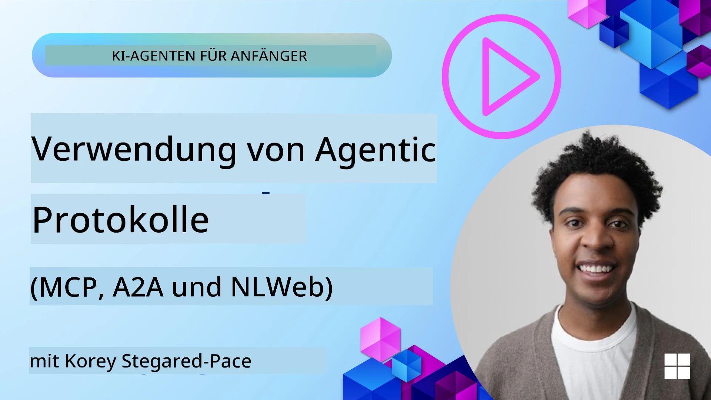
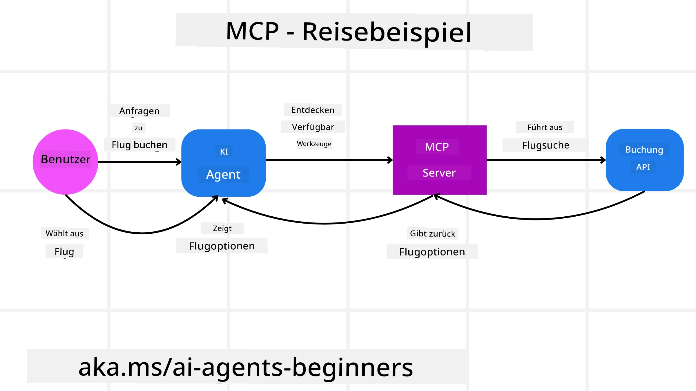
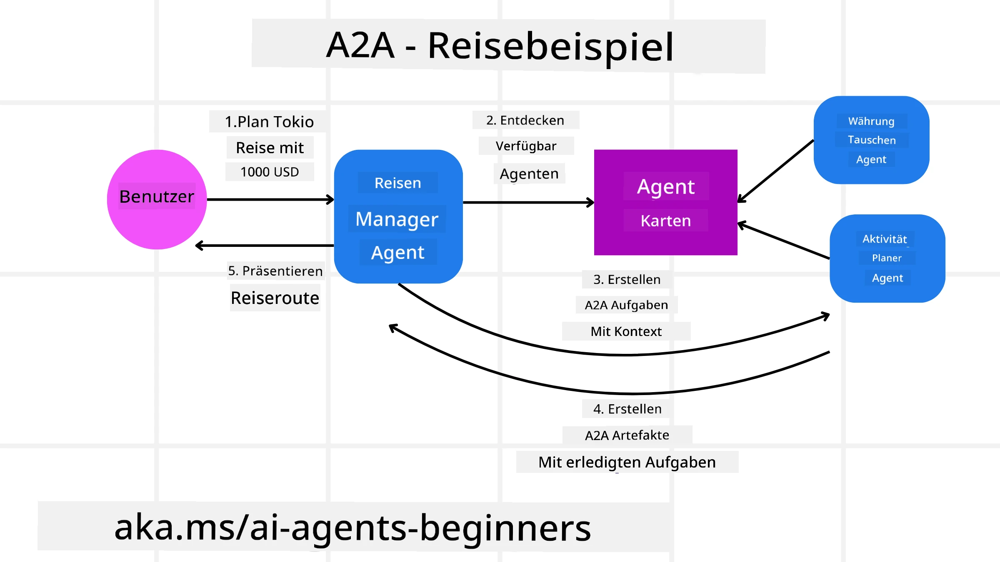
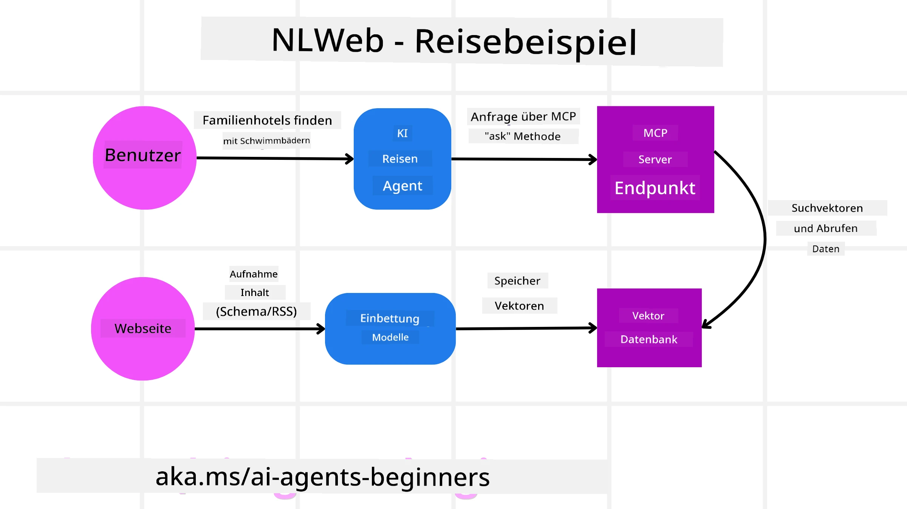

# Verwendung von Agentenprotokollen (MCP, A2A und NLWeb)

> _(Klicken Sie auf das Bild oben, um das Video zu dieser Lektion anzusehen)_

Mit dem zunehmenden Einsatz von KI-Agenten wächst auch der Bedarf an Protokollen, die Standardisierung, Sicherheit gewährleisten und offene Innovation unterstützen. In dieser Lektion behandeln wir 3 Protokolle, die diese Anforderungen erfüllen wollen – Model Context Protocol (MCP), Agent to Agent (A2A) und Natural Language Web (NLWeb).

## Einführung

In dieser Lektion behandeln wir:

• Wie **MCP** KI-Agenten den Zugriff auf externe Werkzeuge und Daten ermöglicht, um Benutzeraufgaben zu erledigen.

• Wie **A2A** Kommunikation und Zusammenarbeit zwischen verschiedenen KI-Agenten ermöglicht.

• Wie **NLWeb** natürliche Sprachschnittstellen auf jede Website bringt, sodass KI-Agenten Inhalte entdecken und mit ihnen interagieren können.

## Lernziele

• **Identifizieren** des Hauptzwecks und der Vorteile von MCP, A2A und NLWeb im Kontext von KI-Agenten.

• **Erklären**, wie jedes Protokoll die Kommunikation und Interaktion zwischen LLMs, Werkzeugen und anderen Agenten erleichtert.

• **Erkennen** der unterschiedlichen Rollen, die jedes Protokoll beim Aufbau komplexer agentischer Systeme spielt.

## Model Context Protocol

Das **Model Context Protocol (MCP)** ist ein offener Standard, der eine standardisierte Möglichkeit bietet, Anwendungen Kontext und Werkzeuge für LLMs bereitzustellen. Dadurch entsteht ein „universeller Adapter“ für verschiedene Datenquellen und Werkzeuge, die KI-Agenten auf konsistente Weise verbinden können.

Schauen wir uns die Komponenten von MCP an, die Vorteile gegenüber direkter API-Nutzung sowie ein Beispiel, wie KI-Agenten einen MCP-Server nutzen könnten.

### MCP-Kernkomponenten

MCP arbeitet mit einer **Client-Server-Architektur**, die Kernkomponenten sind:

• **Hosts** sind LLM-Anwendungen (zum Beispiel ein Code-Editor wie VSCode), die Verbindungen zu einem MCP-Server starten.

• **Clients** sind Komponenten innerhalb der Host-Anwendung, die Eins-zu-eins-Verbindungen zu Servern aufrechterhalten.

• **Server** sind leichte Programme, die bestimmte Fähigkeiten bereitstellen.

Im Protokoll sind drei Kernprimitive enthalten, das sind die Fähigkeiten eines MCP-Servers:

• **Werkzeuge**: Dies sind einzelne Aktionen oder Funktionen, die ein KI-Agent aufrufen kann, um eine Aktion durchzuführen. Beispielsweise könnte ein Wetterdienst ein „Wetter abrufen“-Werkzeug bereitstellen oder ein E-Commerce-Server ein „Produkt kaufen“-Werkzeug. MCP-Server geben für jedes Werkzeug Name, Beschreibung und Ein- / Ausgabeschema in ihrer Fähigkeitenliste an.

• **Ressourcen**: Dies sind schreibgeschützte Datenobjekte oder Dokumente, die ein MCP-Server bereitstellen kann und die Clients bei Bedarf abrufen können. Beispiele sind Datei-Inhalte, Datenbankeinträge oder Protokolldateien. Ressourcen können Text (wie Code oder JSON) oder Binärdaten (wie Bilder oder PDFs) sein.

• **Prompts**: Vordefinierte Vorlagen, die Vorschläge für Prompts liefern und komplexere Workflows ermöglichen.

### Vorteile von MCP

MCP bietet KI-Agenten wesentliche Vorteile:

• **Dynamische Werkzeugerkennung**: Agenten können dynamisch eine Liste verfügbarer Werkzeuge von einem Server erhalten, einschließlich Beschreibungen ihrer Funktionen. Im Gegensatz zu traditionellen APIs, die oft statische Integration per Code erfordern und bei API-Änderungen Code-Updates nötig machen, bietet MCP eine „einmal integrieren“-Methode mit größerer Anpassungsfähigkeit.

• **Interoperabilität über LLMs hinweg**: MCP funktioniert über verschiedene LLMs hinweg und ermöglicht so die flexible Auswahl und den Wechsel von Kernmodellen für bessere Leistung.

• **Standardisierte Sicherheit**: MCP beinhaltet ein standardisiertes Authentifizierungsverfahren, das Skalierbarkeit beim Hinzufügen von Zugriffen auf weitere MCP-Server verbessert. Dies ist einfacher als unterschiedliche Schlüssel und Authentifizierungsmethoden für diverse traditionelle APIs zu verwalten.

### MCP-Beispiel

Stellen Sie sich vor, ein Nutzer möchte einen Flug über einen von MCP unterstützten KI-Assistenten buchen.

1. **Verbindung**: Der KI-Assistent (der MCP-Client) verbindet sich mit einem MCP-Server, der von einer Fluggesellschaft bereitgestellt wird.

2. **Werkzeugerkennung**: Der Client fragt den MCP-Server der Fluggesellschaft: „Welche Werkzeuge bieten Sie an?“ Der Server antwortet mit Werkzeugen wie „Flüge suchen“ und „Flüge buchen“.

3. **Werkzeugaufruf**: Dann bittet der Nutzer den KI-Assistenten: „Bitte suche einen Flug von Portland nach Honolulu.“ Der KI-Assistent nutzt sein LLM, erkennt, dass das „Flüge suchen“-Werkzeug aufgerufen werden muss, und übermittelt die relevanten Parameter (Start, Ziel) an den MCP-Server.

4. **Ausführung und Antwort**: Der MCP-Server fungiert als Wrapper und ruft die interne Buchungs-API der Fluggesellschaft auf. Er empfängt die Fluginformationen (z. B. JSON-Daten) und sendet diese an den KI-Assistenten zurück.

5. **Weitere Interaktion**: Der KI-Assistent zeigt Flugoptionen. Nach der Auswahl eines Fluges ruft der Assistent möglicherweise das Werkzeug „Flug buchen“ auf demselben MCP-Server auf und schließt die Buchung ab.

## Agent-to-Agent-Protokoll (A2A)

Während MCP darauf abzielt, LLMs mit Werkzeugen zu verbinden, geht das **Agent-to-Agent (A2A)-Protokoll** noch einen Schritt weiter, indem es Kommunikation und Zusammenarbeit zwischen verschiedenen KI-Agenten ermöglicht. A2A verbindet KI-Agenten über verschiedene Organisationen, Umgebungen und Technologien hinweg, um gemeinsam eine Aufgabe zu erfüllen.

Wir betrachten die Komponenten und Vorteile von A2A sowie ein Beispiel, wie es in unserer Reiseanwendung eingesetzt werden kann.

### A2A-Kernkomponenten

A2A fokussiert auf Kommunikationsmöglichkeiten zwischen Agenten und deren Zusammenarbeit bei der Erledigung von Teilaufgaben des Benutzers. Jede Komponente des Protokolls trägt dazu bei:

#### Agent Card

Ähnlich wie ein MCP-Server eine Werkzeugliste bereitstellt, enthält eine Agent Card:
- Den Namen des Agenten.
- Eine **Beschreibung der allgemeinen Aufgaben**, die er erledigt.
- Eine **Liste spezifischer Fähigkeiten** mit Beschreibungen, die anderen Agenten (oder sogar menschlichen Nutzern) helfen zu verstehen, wann und warum sie diesen Agenten aufrufen möchten.
- Die **aktuelle Endpunkt-URL** des Agenten.
- Die **Version** und **Fähigkeiten** des Agenten, etwa Streaming-Antworten und Push-Benachrichtigungen.

#### Agent Executor

Der Agent Executor ist dafür verantwortlich, **den Kontext des Benutzerchats an den entfernten Agenten weiterzugeben**. Der entfernte Agent benötigt diesen, um die zu erledigende Aufgabe zu verstehen. In einem A2A-Server nutzt ein Agent sein eigenes LLM, um eingehende Anfragen zu analysieren und Aufgaben mit eigenen internen Werkzeugen auszuführen.

#### Artefakt

Sobald ein entfernter Agent die angeforderte Aufgabe abgeschlossen hat, wird das Ergebnis als Artefakt erstellt. Ein Artefakt **enthält das Arbeitsergebnis des Agenten**, eine **Beschreibung der erledigten Aufgaben** und den **Textkontext**, der durch das Protokoll übertragen wird. Nach dem Senden des Artefakts wird die Verbindung zum entfernten Agenten bis zum nächsten Bedarf geschlossen.

#### Ereigniswarteschlange

Diese Komponente dient **der Verarbeitung von Updates und dem Nachrichtenaustausch**. Sie ist besonders wichtig im produktiven Einsatz agentischer Systeme, um zu verhindern, dass Verbindungen zwischen Agenten vor Abschluss einer Aufgabe geschlossen werden, insbesondere wenn die Bearbeitungszeiten länger sein können.

### Vorteile von A2A

• **Verbesserte Zusammenarbeit**: Agenten verschiedener Anbieter und Plattformen können interagieren, Kontext teilen und zusammenarbeiten, um nahtlose Automatisierung über traditionell getrennte Systeme hinweg zu ermöglichen.

• **Flexibilität bei Modellwahl**: Jeder A2A-Agent kann selbst entscheiden, welches LLM er für seine Anfragen nutzt, was eine Optimierung oder Feinabstimmung der Modelle pro Agent erlaubt – im Gegensatz zu der einzigen LLM-Verbindung in manchen MCP-Szenarien.

• **Integrierte Authentifizierung**: Die Authentifizierung ist direkt ins A2A-Protokoll eingebaut und bietet so ein robustes Sicherheitsframework für Agenteninteraktionen.

### A2A-Beispiel

Lassen Sie uns unser Reisebuchungsszenario erweitern, diesmal mit A2A.

1. **Benutzeranfrage an Multi-Agenten**: Ein Nutzer interagiert mit einem „Reiseagenten“-A2A-Client/Agenten, zum Beispiel mit der Bitte: „Bitte buche eine komplette Reise nach Honolulu für nächste Woche, inklusive Flügen, Hotel und Mietwagen“.

2. **Orchestrierung durch Reiseagenten**: Der Reiseagent erhält diese komplexe Anfrage. Er verwendet sein LLM, um die Aufgabe zu analysieren und entscheidet, dass er mit anderen spezialisierten Agenten interagieren muss.

3. **Kommunikation zwischen Agenten**: Der Reiseagent nutzt das A2A-Protokoll, um sich mit nachgelagerten Agenten zu verbinden, etwa einem „Fluggesellschaftsagenten“, einem „Hotelagenten“ und einem „Mietwagenagenten“, die von unterschiedlichen Firmen erstellt wurden.

4. **Delegierte Aufgabenerledigung**: Der Reiseagent sendet spezifische Aufgaben an diese Spezialagenten (z. B. „Flüge nach Honolulu finden“, „Hotel buchen“, „Auto mieten“). Jeder dieser spezialisierten Agenten, die jeweils eigene LLMs einsetzen und ihre eigenen Werkzeuge verwenden (die selbst MCP-Server sein können), erledigt seinen Teil der Buchung.

5. **Zusammengefasste Antwort**: Sobald alle nachgelagerten Agenten ihre Aufgaben abgeschlossen haben, fasst der Reiseagent die Ergebnisse zusammen (Flugdetails, Hotelbestätigung, Mietwagenbuchung) und sendet eine umfassende, chatähnliche Antwort an den Nutzer.

## Natural Language Web (NLWeb)

Websites sind seit langem der Hauptweg für Nutzer, Informationen und Daten im Internet zuzugreifen.

Lassen Sie uns die verschiedenen Komponenten von NLWeb anschauen, die Vorteile von NLWeb und ein Beispiel, wie NLWeb in unserer Reiseanwendung funktioniert.

### Komponenten von NLWeb

- **NLWeb-Anwendung (Kernservice-Code)**: Das System, das natürliche Sprachfragen verarbeitet. Es verbindet die Plattformteile, um Antworten zu erstellen. Man kann es als **Motor sehen, der die natürlichen Sprachfunktionen** einer Website antreibt.

- **NLWeb-Protokoll**: Ein **einfaches Regelwerk zur Interaktion in natürlicher Sprache** mit einer Website. Es sendet Antworten im JSON-Format zurück (oft mit Schema.org). Es soll eine einfache Grundlage für das „KI-Web“ schaffen, ähnlich wie HTML Dokumente online teilbar machte.

- **MCP-Server (Model Context Protocol Endpunkt)**: Jede NLWeb-Installation funktioniert auch als **MCP-Server**. Das heißt, sie kann **Werkzeuge (wie eine „ask“-Methode) und Daten** mit anderen KI-Systemen teilen. Praktisch macht dies Inhalte und Funktionen der Website für KI-Agenten nutzbar, sodass die Website Teil eines größeren „Agenten-Ökosystems“ wird.

- **Embedding-Modelle**: Diese Modelle werden verwendet, um **Website-Inhalte in numerische Vektoren (Embeddings)** umzuwandeln. Diese Vektoren erfassen Bedeutungen, die Computer vergleichen und durchsuchen können. Sie werden in einer speziellen Datenbank gespeichert, und Nutzer können auswählen, welches Embedding-Modell sie verwenden möchten.

- **Vektor-Datenbank (Abrufmechanismus)**: Diese Datenbank **speichert die Embeddings der Websiteinhalte**. Wenn jemand eine Frage stellt, sucht NLWeb in der Vektor-Datenbank schnell nach den relevantesten Informationen. Es liefert eine schnelle Liste möglicher Antworten, sortiert nach Ähnlichkeit. NLWeb arbeitet mit verschiedenen Vektor-Speichersystemen wie Qdrant, Snowflake, Milvus, Azure AI Search und Elasticsearch.

### NLWeb am Beispiel

Betrachten wir erneut unsere Reisebuchungswebsite, diesmal mit NLWeb-Unterstützung.

1. **Datenaufnahme**: Die bestehenden Produktkataloge der Reisewebsite (z. B. Fluglisten, Hotelbeschreibungen, Tourpakete) werden im Schema.org-Format oder über RSS-Feeds geladen. Die NLWeb-Werkzeuge nehmen diese strukturierten Daten auf, erzeugen Embeddings und speichern sie in einer lokalen oder entfernten Vektor-Datenbank.

2. **Natürliche Sprachabfrage (Mensch)**: Ein Nutzer besucht die Website und tippt statt der Navigation durch Menüs in einer Chat-Oberfläche: „Finde ein familienfreundliches Hotel mit Pool in Honolulu für nächste Woche“.

3. **NLWeb-Verarbeitung**: Die NLWeb-Anwendung erhält die Anfrage, schickt sie an ein LLM zur Verarbeitung und sucht gleichzeitig in der Vektor-Datenbank nach passenden Hotelangeboten.

4. **Genauigkeit der Ergebnisse**: Das LLM hilft, die Suchergebnisse aus der Datenbank zu interpretieren, die besten Treffer basierend auf den Kriterien „familienfreundlich“, „Pool“ und „Honolulu“ zu ermitteln und eine Antwort in natürlicher Sprache zu formulieren. Wichtig ist, dass die Antwort sich auf tatsächliche Hotels im Katalog bezieht und keine erfundenen Informationen enthält.

5. **Interaktion mit KI-Agenten**: Da NLWeb als MCP-Server fungiert, könnte auch ein externer KI-Reiseagent eine Verbindung zu dieser NLWeb-Instanz der Website herstellen. Der KI-Agent könnte dann die `ask`-MCP-Methode nutzen, um die Website direkt abzufragen: `ask("Gibt es vegane Restaurants im Bereich Honolulu, die vom Hotel empfohlen werden?")`. Die NLWeb-Instanz verarbeitet dies unter Nutzung ihrer Datenbank mit Restaurantinformationen (sofern geladen) und gibt eine strukturierte JSON-Antwort zurück.

### Haben Sie noch Fragen zu MCP/A2A/NLWeb?

Treten Sie dem [Microsoft Foundry Discord](https://discord.com/invite/ATgtXmAS5D) bei, um sich mit anderen Lernenden auszutauschen, an Sprechstunden teilzunehmen und Antworten zu Ihren Fragen zu KI-Agenten zu erhalten.

## Ressourcen

- [MCP für Einsteiger](https://aka.ms/mcp-for-beginners)  
- [MCP-Dokumentation](https://learn.microsoft.com/python/api/overview/azure/ai-projects-readme)
- [NLWeb-Repo](https://github.com/nlweb-ai/NLWeb)
- [Microsoft Agent Framework](https://learn.microsoft.com/en-us/agent-framework/overview/?wt.mc_id=youtube_26688_organicsocial_reactor&pivots=programming-language-python)

## Vorherige Lektion

[KI-Agenten in der Produktion](../10-ai-agents-production/README.md)

## Nächste Lektion

[Kontext-Engineering für KI-Agenten](../12-context-engineering/README.md)

---

<!-- CO-OP TRANSLATOR DISCLAIMER START -->
**Haftungsausschluss**:
Dieses Dokument wurde mit dem KI-Übersetzungsdienst [Co-op Translator](https://github.com/Azure/co-op-translator) übersetzt. Obwohl wir uns um Genauigkeit bemühen, beachten Sie bitte, dass automatisierte Übersetzungen Fehler oder Ungenauigkeiten enthalten können. Das Originaldokument in seiner Ursprungssprache gilt als maßgebliche Quelle. Bei kritischen Informationen wird eine professionelle menschliche Übersetzung empfohlen. Wir übernehmen keine Haftung für Missverständnisse oder Fehlinterpretationen, die aus der Verwendung dieser Übersetzung entstehen.
<!-- CO-OP TRANSLATOR DISCLAIMER END -->