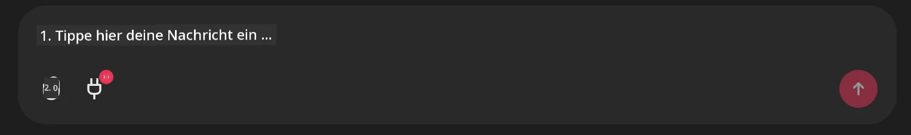

# Github MCP Server Beispiel

## Beschreibung

Dies war eine Demo, erstellt für den AI Agents Hackathon, veranstaltet durch den Microsoft Reactor.

Das Tool wird verwendet, um Hackathon-Projekte basierend auf den Github-Repositories eines Benutzers zu empfehlen.
Dies geschieht durch:

1. **Github Agent** - Verwendung des Github MCP Servers, um Repositories und Informationen über diese Repositories abzurufen.
2. **Hackathon Agent** - Nimmt die Daten vom Github Agent und entwickelt kreative Hackathon-Projektideen basierend auf den Projekten, den vom Benutzer verwendeten Programmiersprachen und den Projektkategorien für den AI Agents Hackathon.
3. **Events Agent** - Basierend auf den Vorschlägen des Hackathon-Agenten empfiehlt der Events Agent relevante Veranstaltungen aus der AI Agents Hackathon-Reihe.
## Ausführen des Codes 

### Umgebungsvariablen

Diese Demo verwendet Microsoft Agent Framework, Azure OpenAI Service, den Github MCP Server und Azure AI Search.

Stellen Sie sicher, dass Sie die entsprechenden Umgebungsvariablen gesetzt haben, um diese Tools verwenden zu können:

```python
AZURE_AI_PROJECT_ENDPOINT=""
AZURE_AI_MODEL_DEPLOYMENT_NAME=""
AZURE_SEARCH_SERVICE_ENDPOINT=""
AZURE_SEARCH_API_KEY=""
``` 

## Starten des Chainlit-Servers

Um eine Verbindung zum MCP-Server herzustellen, verwendet diese Demo Chainlit als Chatoberfläche. 

Um den Server zu starten, verwenden Sie den folgenden Befehl in Ihrem Terminal:

```bash
chainlit run app.py -w
```

Dies sollte Ihren Chainlit-Server auf `localhost:8000` starten und außerdem Ihren Azure AI Search Index mit dem Inhalt von `event-descriptions.md` befüllen. 

## Verbindung zum MCP-Server

Um eine Verbindung zum Github MCP Server herzustellen, wählen Sie das "plug"-Symbol unterhalb des Chat-Eingabefeldes "Type your message here.." aus:



Dort können Sie auf "Connect an MCP" klicken, um den Befehl hinzuzufügen, der die Verbindung zum Github MCP Server herstellt:

```bash
npx -y @modelcontextprotocol/server-github --env GITHUB_PERSONAL_ACCESS_TOKEN=[YOUR PERSONAL ACCESS TOKEN]
```

Replace "[YOUR PERSONAL ACCESS TOKEN]" with your actual Personal Access Token. 

Nach dem Verbinden sollten Sie eine (1) neben dem plug-Symbol sehen, um zu bestätigen, dass die Verbindung besteht. Falls nicht, versuchen Sie, den Chainlit-Server mit `chainlit run app.py -w` neu zu starten.

## Verwendung der Demo 

Um den Agenten-Workflow zur Empfehlung von Hackathon-Projekten zu starten, können Sie eine Nachricht wie die folgende eingeben: 

"Empfehlen Sie Hackathon-Projekte für den Github-Benutzer koreyspace"

Der Router Agent analysiert Ihre Anfrage und bestimmt, welche Kombination von Agenten (GitHub, Hackathon und Events) am besten geeignet ist, Ihre Anfrage zu bearbeiten. Die Agenten arbeiten zusammen, um umfassende Empfehlungen zu geben, basierend auf der Analyse von GitHub-Repositories, Projektideen und relevanten Tech-Veranstaltungen.

---

<!-- CO-OP TRANSLATOR DISCLAIMER START -->
Haftungsausschluss:
Dieses Dokument wurde mit dem KI-Übersetzungsdienst [Co-op Translator](https://github.com/Azure/co-op-translator) übersetzt. Obwohl wir uns um Genauigkeit bemühen, beachten Sie bitte, dass automatisierte Übersetzungen Fehler oder Ungenauigkeiten enthalten können. Das Originaldokument in seiner ursprünglichen Sprache ist als maßgebliche Quelle zu betrachten. Für wichtige Informationen wird eine professionelle menschliche Übersetzung empfohlen. Wir übernehmen keine Haftung für Missverständnisse oder Fehlinterpretationen, die aus der Nutzung dieser Übersetzung entstehen.
<!-- CO-OP TRANSLATOR DISCLAIMER END -->