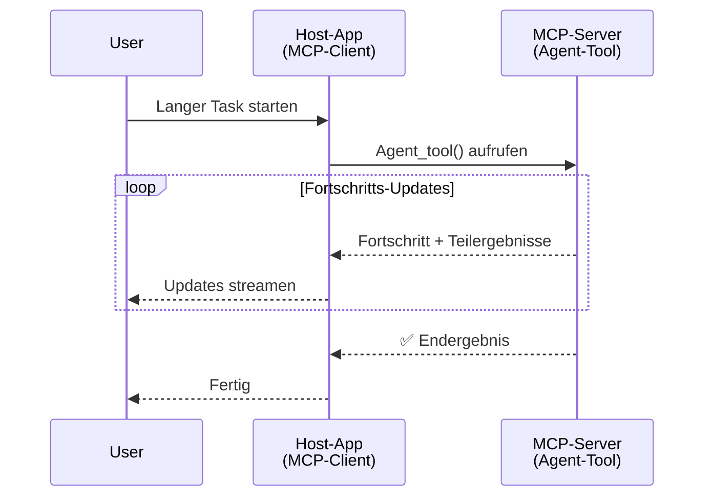
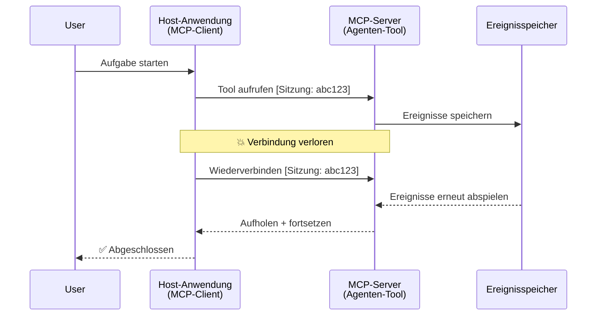
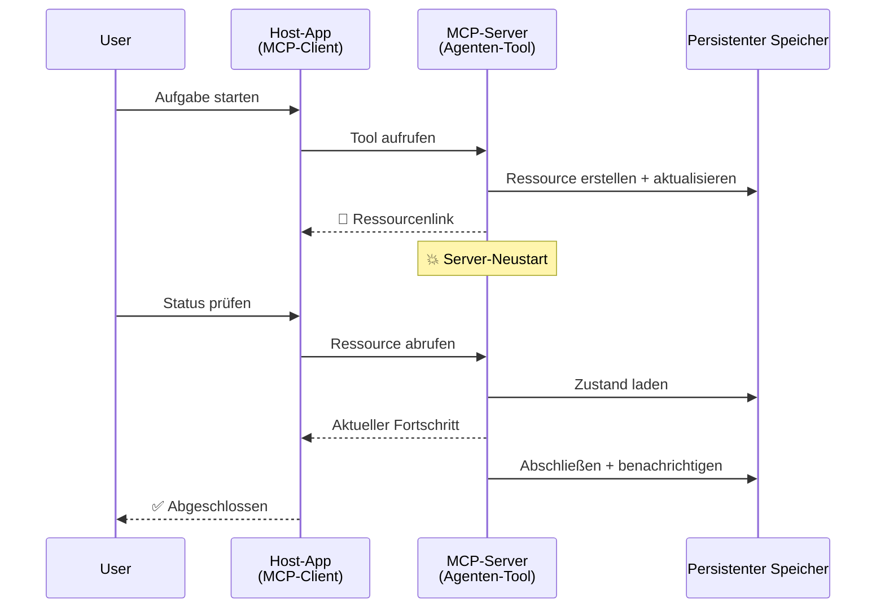
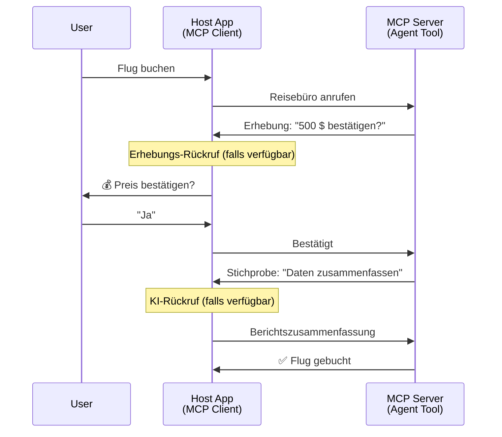
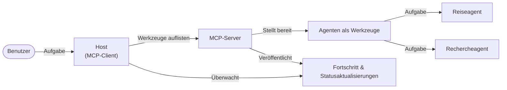

# Aufbau von Agent-zu-Agent-Kommunikationssystemen mit MCP

> Kurzfassung - Kann man Agent2Agent-Kommunikation auf MCP aufbauen? Ja!

MCP hat sich erheblich weiterentwickelt über sein ursprüngliches Ziel hinaus, "LLMs Kontext bereitzustellen". Mit jüngsten Erweiterungen wie [fortsetzbaren Streams](https://modelcontextprotocol.io/docs/concepts/transports#resumability-and-redelivery), [Elicitierung](https://modelcontextprotocol.io/specification/2025-06-18/client/elicitation), [Sampling](https://modelcontextprotocol.io/specification/2025-06-18/client/sampling) und Benachrichtigungen ([Fortschritt](https://modelcontextprotocol.io/specification/2025-06-18/basic/utilities/progress) und [Ressourcen](https://modelcontextprotocol.io/specification/2025-06-18/schema#resourceupdatednotification)) bietet MCP jetzt eine robuste Grundlage für den Aufbau komplexer Agent-zu-Agent-Kommunikationssysteme.

## Das Missverständnis zu Agent/Tool

Da immer mehr Entwickler Tools mit agentischen Verhaltensweisen erkunden (laufen über lange Zeiträume, benötigen möglicherweise während der Ausführung zusätzliche Eingaben usw.), besteht ein gängiges Missverständnis darin, dass MCP ungeeignet sei, hauptsächlich weil frühe Beispiele seiner Tool-Primitives sich auf einfache Anfrage-Antwort-Muster konzentrierten.

Diese Wahrnehmung ist veraltet. Die MCP-Spezifikation wurde in den letzten Monaten erheblich erweitert mit Fähigkeiten, die die Lücke für den Aufbau lang laufender agentischer Verhaltensweisen schließen:

- **Streaming & Teilergebnisse**: Echtzeit-Fortschrittsaktualisierungen während der Ausführung
- **Fortsetzbarkeit**: Clients können sich nach einer Trennung wieder verbinden und fortfahren
- **Persistenz**: Ergebnisse überstehen Server-Neustarts (z. B. über Ressourcenlinks)
- **Mehrschrittigkeit**: Interaktive Eingaben während der Ausführung durch Elicitierung und Sampling

Diese Funktionen können kombiniert werden, um komplexe agentische und Multi-Agent-Anwendungen zu ermöglichen, die alle auf dem MCP-Protokoll basieren.

Zur Referenz werden wir einen Agenten als ein "Tool" bezeichnen, das auf einem MCP-Server verfügbar ist. Dies impliziert die Existenz einer Host-Anwendung, die einen MCP-Client implementiert, der eine Sitzung mit dem MCP-Server herstellt und den Agenten aufrufen kann.

## Was macht ein MCP-Tool „Agentisch“?

Bevor wir mit der Implementierung beginnen, wollen wir die infrastrukturellen Fähigkeiten festlegen, die benötigt werden, um lang laufende Agenten zu unterstützen.

> Wir definieren einen Agenten als eine Entität, die autonom über längere Zeiträume operieren kann und in der Lage ist, komplexe Aufgaben zu bewältigen, die mehrere Interaktionen oder Anpassungen basierend auf Echtzeit-Feedback erfordern können.

### 1. Streaming & Teilergebnisse

Traditionelle Anfrage-Antwort-Muster funktionieren nicht für lang laufende Aufgaben. Agenten müssen bieten:

- Echtzeit-Fortschrittsaktualisierungen
- Zwischenergebnisse

**MCP-Unterstützung**: Ressourcenaktualisierungsbenachrichtigungen ermöglichen das Streaming von Teilergebnissen, erfordern jedoch ein sorgfältiges Design, um Konflikte mit dem JSON-RPC 1:1 Anfrage/Antwort-Modell zu vermeiden.

| Funktion                   | Anwendungsfall                                                                                                                                                                   | MCP-Unterstützung                                                                          |
| -------------------------- | -------------------------------------------------------------------------------------------------------------------------------------------------------------------------------- | ------------------------------------------------------------------------------------------ |
| Echtzeit-Fortschrittsupdates | Nutzer fordert eine Codebasis-Migrationsaufgabe an. Der Agent streamt Fortschritt: „10 % - Abhängigkeiten analysieren... 25 % - TypeScript-Dateien konvertieren... 50 % - Importe aktualisieren...“ | ✅ Fortschrittsbenachrichtigungen                                                          |
| Teilergebnisse             | „Buch generieren“-Aufgabe streamt Teilergebnisse, z. B. 1) Handlungsbogen-Übersicht, 2) Kapitel-Liste, 3) Jedes Kapitel nach Abschluss. Host kann jederzeit inspizieren, abbrechen oder umleiten. | ✅ Benachrichtigungen können „erweitert“ werden, um Teilergebnisse einzuschließen, siehe Vorschläge in PR 383, 776 |

<div align="center" style="font-style: italic; font-size: 0.95em; margin-bottom: 0.5em;">
<strong>Abbildung 1:</strong> Dieses Diagramm zeigt, wie ein MCP-Agent Echtzeit-Fortschrittsaktualisierungen und Teilergebnisse an die Host-Anwendung während einer lang laufenden Aufgabe streamt, wodurch der Nutzer die Ausführung in Echtzeit verfolgen kann.
</div>



### 2. Fortsetzbarkeit

Agenten müssen Netzwerkunterbrechungen elegant behandeln:

- Wiederverbindung nach (Client-)Verbindungstrennung
- Fortführung ab dem Punkt, an dem sie aufgehört haben (Nachlieferung von Nachrichten)

**MCP-Unterstützung**: Der StreamableHTTP-Transport von MCP unterstützt heute Sitzung-Fortsetzung und Nachlieferung von Nachrichten mit Sitzungs-IDs und letzten Ereignis-IDs. Wichtig ist hier, dass der Server einen EventStore implementieren muss, der Event-Replays bei Client-Wiederverbindung ermöglicht.  
Beachten Sie, dass es einen Community-Vorschlag (PR #975) gibt, der transport-agnostische fortsetzbare Streams untersucht.

| Funktion      | Anwendungsfall                                                                                                                                                   | MCP-Unterstützung                                                          |
| ------------ | -------------------------------------------------------------------------------------------------------------------------------------------------------------- | -------------------------------------------------------------------------- |
| Fortsetzbarkeit | Client trennt Verbindung während einer lang laufenden Aufgabe. Nach Wiederverbindung wird die Sitzung mit den verpassten Ereignissen wiederhergestellt und nahtlos fortgesetzt. | ✅ StreamableHTTP-Transport mit Sitzungs-IDs, Event-Replay und EventStore |

<div align="center" style="font-style: italic; font-size: 0.95em; margin-bottom: 0.5em;">
<strong>Abbildung 2:</strong> Dieses Diagramm zeigt, wie MCPs StreamableHTTP-Transport und Event Store eine nahtlose Sitzungsfortsetzung ermöglichen: Bei Client-Trennung kann er sich wieder verbinden und verpasste Ereignisse erneut abspielen, sodass die Aufgabe ohne Fortschrittsverlust fortgeführt wird.
</div>



### 3. Persistenz

Lang laufende Agenten benötigen einen persistenten Zustand:

- Ergebnisse überdauern Server-Neustarts
- Status kann out-of-band abgefragt werden
- Fortschrittsverfolgung über Sitzungen hinweg

**MCP-Unterstützung**: MCP unterstützt jetzt einen Resource-Link Rückgabetyp für Tool-Aufrufe. Heute ist ein mögliches Muster, ein Tool zu entwerfen, das eine Ressource erstellt und sofort einen Ressourcenlink zurückgibt. Das Tool kann im Hintergrund die Aufgabe weiter bearbeiten und die Ressource aktualisieren. Der Client kann dann wählen, den Zustand dieser Ressource zu pollieren, um Teilergebnisse oder vollständige Ergebnisse zu erhalten (abhängig davon, welche Ressourcenaktualisierungen der Server bereitstellt) oder sich für Ressourcenaktualisierungsbenachrichtigungen anmelden.

Eine Einschränkung hierbei ist, dass das Polling von Ressourcen oder das Abonnieren von Updates Ressourcen verbrauchen kann, was bei großem Umfang Auswirkungen hat. Es gibt einen offenen Community-Vorschlag (einschließlich #992), der die Möglichkeit untersucht, Webhooks oder Trigger einzubinden, die vom Server aufgerufen werden können, um den Client/die Host-Anwendung über Aktualisierungen zu benachrichtigen.

| Funktion    | Anwendungsfall                                                                                                                                        | MCP-Unterstützung                                                  |
| ---------- | --------------------------------------------------------------------------------------------------------------------------------------------------- | ------------------------------------------------------------------ |
| Persistenz | Server stürzt während einer Datenmigrationsaufgabe ab. Ergebnisse und Fortschritt überdauern Neustart, Client kann Status überprüfen und mit persistenter Ressource weitermachen. | ✅ Ressourcenlinks mit persistenter Speicherung und Statusbenachrichtigungen |

Heute ist ein typisches Muster, ein Tool zu entwerfen, das eine Ressource erstellt und sofort einen Ressourcenlink zurückgibt. Das Tool kann im Hintergrund die Aufgabe bearbeiten, Ressourcenbenachrichtigungen ausgeben, die als Fortschrittsupdates oder Teilergebnisse dienen, und den Inhalt der Ressource nach Bedarf aktualisieren.

<div align="center" style="font-style: italic; font-size: 0.95em; margin-bottom: 0.5em;">
<strong>Abbildung 3:</strong> Dieses Diagramm zeigt, wie MCP-Agenten persistente Ressourcen und Statusbenachrichtigungen verwenden, um sicherzustellen, dass lang laufende Aufgaben Server-Neustarts überleben, sodass Clients Fortschritte überprüfen und Ergebnisse auch nach Ausfällen abrufen können.
</div>



### 4. Mehrschrittige Interaktionen

Agenten benötigen oft zusätzliche Eingaben während der Ausführung:

- Menschliche Klarstellungen oder Zustimmungen
- KI-Unterstützung für komplexe Entscheidungen
- Dynamische Parameteranpassungen

**MCP-Unterstützung**: Vollständig unterstützt durch Sampling (für KI-Eingaben) und Elicitierung (für menschliche Eingaben).

| Funktion                 | Anwendungsfall                                                                                                                                    | MCP-Unterstützung                                        |
| ----------------------- | ------------------------------------------------------------------------------------------------------------------------------------------------- | -------------------------------------------------------- |
| Mehrschrittige Interaktionen | Reisebuchungsagent fordert Preisbestätigung vom Nutzer an, fragt dann KI, um Reisedaten zusammenzufassen, bevor die Buchung abgeschlossen wird. | ✅ Elicitierung für menschliche Eingaben, Sampling für KI-Eingaben |

<div align="center" style="font-style: italic; font-size: 0.95em; margin-bottom: 0.5em;">
<strong>Abbildung 4:</strong> Dieses Diagramm veranschaulicht, wie MCP-Agenten interaktiv menschliche Eingaben erfragen oder KI-Unterstützung während der Ausführung anfordern können, um komplexe, mehrstufige Workflows wie Bestätigungen und dynamische Entscheidungen zu unterstützen.
</div>



## Implementierung lang laufender Agenten auf MCP – Codeübersicht

Im Rahmen dieses Artikels stellen wir ein [Code-Repository](https://github.com/victordibia/ai-tutorials/tree/main/MCP%20Agents) bereit, das eine vollständige Implementierung lang laufender Agenten unter Verwendung des MCP Python SDK mit StreamableHTTP-Transport für Sitzungsfortsetzung und Nachrichten-Nachlieferung enthält. Die Implementierung zeigt, wie MCP-Fähigkeiten kombiniert werden können, um ausgefeilte agentenähnliche Verhaltensweisen zu ermöglichen.

Konkret implementieren wir einen Server mit zwei primären Agententools:

- **Reise-Agent** - Simuliert einen Reisebuchungsservice mit Preiskonfirmation via Elicitierung
- **Forschungs-Agent** - Führt Forschung durch mit KI-unterstützten Zusammenfassungen via Sampling

Beide Agenten demonstrieren Echtzeit-Fortschrittsupdates, interaktive Bestätigungen und volle Sitzungsfortsetzungsmöglichkeiten.

### Wichtige Implementierungskonzepte

Die folgenden Abschnitte zeigen serverseitige Agentenimplementierung und clientseitiges Host-Handling für jede Fähigkeit:

#### Streaming & Fortschrittsupdates – Echtzeit-Aufgabenstatus

Streaming ermöglicht es Agenten, während lang laufender Aufgaben Echtzeit-Fortschrittsupdates zu bieten, sodass Nutzer über Aufgabestatus und Zwischenergebnisse informiert bleiben.

**Server-Implementierung (Agent sendet Fortschrittsbenachrichtigungen):**

```python
# Vom Server/server.py - Reiseveranstalter sendet Fortschrittsupdates
for i, step in enumerate(steps):
    await ctx.session.send_progress_notification(
        progress_token=ctx.request_id,
        progress=i * 25,
        total=100,
        message=step,
        related_request_id=str(ctx.request_id)
    )
    await anyio.sleep(2)  # Arbeit simulieren

# Alternative: Log-Nachrichten für detaillierte Schritt-für-Schritt-Updates
await ctx.session.send_log_message(
    level="info",
    data=f"Processing step {current_step}/{steps} ({progress_percent}%)",
    logger="long_running_agent",
    related_request_id=ctx.request_id,
)
```

**Client-Implementierung (Host empfängt Fortschrittsupdates):**

```python
# Aus client/client.py - Client, der Echtzeitbenachrichtigungen verwaltet
async def message_handler(message) -> None:
    if isinstance(message, types.ServerNotification):
        if isinstance(message.root, types.LoggingMessageNotification):
            console.print(f"📡 [dim]{message.root.params.data}[/dim]")
        elif isinstance(message.root, types.ProgressNotification):
            progress = message.root.params
            console.print(f"🔄 [yellow]{progress.message} ({progress.progress}/{progress.total})[/yellow]")

# Registrieren des Nachrichtenhandlers beim Erstellen der Sitzung
async with ClientSession(
    read_stream, write_stream,
    message_handler=message_handler
) as session:
```

#### Elicitierung – Anfordern von Nutzereingaben

Elicitierung ermöglicht Agenten, während der Ausführung Nutzereingaben anzufordern. Dies ist essentiell für Bestätigungen, Klarstellungen oder Zustimmungen bei lang laufenden Aufgaben.

**Server-Implementierung (Agent fordert Bestätigung an):**

```python
# Vom Server/server.py - Reisebüro fordert Preisbestätigung an
elicit_result = await ctx.session.elicit(
    message=f"Please confirm the estimated price of $1200 for your trip to {destination}",
    requestedSchema=PriceConfirmationSchema.model_json_schema(),
    related_request_id=ctx.request_id,
)

if elicit_result and elicit_result.action == "accept":
    # Mit der Buchung fortfahren
    logger.info(f"User confirmed price: {elicit_result.content}")
elif elicit_result and elicit_result.action == "decline":
    # Die Buchung stornieren
    booking_cancelled = True
```

**Client-Implementierung (Host stellt Elicitierungs-Callback bereit):**

```python
# Aus client/client.py - Client-Verwaltung von Anforderungsabfragen
async def elicitation_callback(context, params):
    console.print(f"💬 Server is asking for confirmation:")
    console.print(f"   {params.message}")

    response = console.input("Do you accept? (y/n): ").strip().lower()

    if response in ['y', 'yes']:
        return types.ElicitResult(
            action="accept",
            content={"confirm": True, "notes": "Confirmed by user"}
        )
    else:
        return types.ElicitResult(
            action="decline",
            content={"confirm": False, "notes": "Declined by user"}
        )

# Registrieren Sie den Callback beim Erstellen der Sitzung
async with ClientSession(
    read_stream, write_stream,
    elicitation_callback=elicitation_callback
) as session:
```

#### Sampling – Anfordern von KI-Unterstützung

Sampling erlaubt Agenten, für komplexe Entscheidungen oder Inhaltserzeugung während der Ausführung LLM-Unterstützung anzufordern. Dies ermöglicht hybride Mensch-KI-Workflows.

**Server-Implementierung (Agent fordert KI-Unterstützung an):**

```python
# Von server/server.py - Forschungsagent fordert KI-Zusammenfassung an
sampling_result = await ctx.session.create_message(
    messages=[
        SamplingMessage(
            role="user",
            content=TextContent(type="text", text=f"Please summarize the key findings for research on: {topic}")
        )
    ],
    max_tokens=100,
    related_request_id=ctx.request_id,
)

if sampling_result and sampling_result.content:
    if sampling_result.content.type == "text":
        sampling_summary = sampling_result.content.text
        logger.info(f"Received sampling summary: {sampling_summary}")
```

**Client-Implementierung (Host stellt Sampling-Callback bereit):**

```python
# Von client/client.py - Client zur Bearbeitung von Stichprobenanfragen
async def sampling_callback(context, params):
    message_text = params.messages[0].content.text if params.messages else 'No message'
    console.print(f"🧠 Server requested sampling: {message_text}")

    # In einer realen Anwendung könnte dies eine LLM-API aufrufen
    # Für Demonstrationszwecke stellen wir eine simulierte Antwort bereit
    mock_response = "Based on current research, MCP has evolved significantly..."

    return types.CreateMessageResult(
        role="assistant",
        content=types.TextContent(type="text", text=mock_response),
        model="interactive-client",
        stopReason="endTurn"
    )

# Registriere den Callback beim Erstellen der Sitzung
async with ClientSession(
    read_stream, write_stream,
    sampling_callback=sampling_callback,
    elicitation_callback=elicitation_callback
) as session:
```

#### Fortsetzbarkeit – Sitzungsfortsetzung bei Verbindungsunterbrechungen

Fortsetzbarkeit stellt sicher, dass lang laufende Agentenaufgaben Client-Trennungen überleben und bei Wiederverbindung nahtlos fortgesetzt werden können. Dies wird durch Event Stores und Fortsetzungs-Token implementiert.

**Event Store Implementierung (Server hält Sitzungszustand):**

```python
# Aus server/event_store.py - Einfache Ereignisspeicherung im Speicher
class SimpleEventStore(EventStore):
    def __init__(self):
        self._events: list[tuple[StreamId, EventId, JSONRPCMessage]] = []
        self._event_id_counter = 0

    async def store_event(self, stream_id: StreamId, message: JSONRPCMessage) -> EventId:
        """Store an event and return its ID."""
        self._event_id_counter += 1
        event_id = str(self._event_id_counter)
        self._events.append((stream_id, event_id, message))
        return event_id

    async def replay_events_after(self, last_event_id: EventId, send_callback: EventCallback) -> StreamId | None:
        """Replay events after the specified ID for resumption."""
        start_index = None
        stream_id = None
        for index, (event_stream_id, event_id, _) in enumerate(self._events):
            if event_id == last_event_id:
                start_index = index + 1
                stream_id = event_stream_id
                break

        if start_index is None:
            return None

        # Nur spätere Ereignisse aus dem ursprünglichen Stream der Sitzung abspielen.
        for event_stream_id, event_id, message in self._events[start_index:]:
            if event_stream_id != stream_id:
                continue
            await send_callback(EventMessage(message, event_id))

        return stream_id

# Aus server/server.py - Übergabe des Ereignisspeichers an den Sitzungsmanager
def create_server_app(event_store: Optional[EventStore] = None) -> Starlette:
    server = ResumableServer()

    # Sitzungsmanager mit Ereignisspeicher für Wiederaufnahme erstellen
    session_manager = StreamableHTTPSessionManager(
        app=server,
        event_store=event_store,  # Ereignisspeicher ermöglicht Sitzungswiederaufnahme
        json_response=False,
        security_settings=security_settings,
    )

    return Starlette(routes=[Mount("/mcp", app=session_manager.handle_request)])

# Verwendung: Mit Ereignisspeicher initialisieren
event_store = SimpleEventStore()
app = create_server_app(event_store)
```

**Client-Metadaten mit Fortsetzungs-Token (Client verbindet sich mit gespeichertem Zustand erneut):**

```python
# Vom client/client.py - Client-Fortsetzung mit Metadaten
if existing_tokens and existing_tokens.get("resumption_token"):
    # Verwenden Sie vorhandenen Fortsetzungs-Token, um dort fortzufahren, wo wir aufgehört haben
    metadata = ClientMessageMetadata(
        resumption_token=existing_tokens["resumption_token"],
    )
else:
    # Erstellen Sie einen Callback, um den Fortsetzungs-Token zu speichern, wenn er empfangen wird
    def enhanced_callback(token: str):
        protocol_version = getattr(session, 'protocol_version', None)
        token_manager.save_tokens(session_id, token, protocol_version, command, args)

    metadata = ClientMessageMetadata(
        on_resumption_token_update=enhanced_callback,
    )

# Anfrage mit Fortsetzungs-Metadaten senden
result = await session.send_request(
    types.ClientRequest(
        types.CallToolRequest(
            method="tools/call",
            params=types.CallToolRequestParams(name=command, arguments=args)
        )
    ),
    types.CallToolResult,
    metadata=metadata,
)
```

Die Host-Anwendung verwaltet lokal Sitzungs-IDs und Fortsetzungs-Token, wodurch sie sich zu bestehenden Sitzungen verbinden kann, ohne Fortschritt oder Zustand zu verlieren.

### Code-Organisation

<div align="center" style="font-style: italic; font-size: 0.95em; margin-bottom: 0.5em;">
<strong>Abbildung 5:</strong> Architektur eines MCP-basierten Agentensystems
</div>



**Wichtige Dateien:**

- **`server/server.py`** - Fortsetzbarer MCP-Server mit Reise- und Forschungsagenten, die Elicitierung, Sampling und Fortschrittsupdates demonstrieren
- **`client/client.py`** - Interaktive Host-Anwendung mit Wiederaufnahmeunterstützung, Callback-Handlern und Tokenverwaltung
- **`server/event_store.py`** - Event-Store-Implementierung, die Sitzungsfortsetzung und Nachrichten-Nachlieferung ermöglicht

## Erweiterung zu Multi-Agent-Kommunikation auf MCP

Die obige Implementierung kann zu Multi-Agent-Systemen erweitert werden, indem die Intelligenz und der Umfang der Host-Anwendung verbessert werden:

- **Intelligente Aufgabenzerlegung**: Host analysiert komplexe Nutzeranfragen und zerlegt sie in Unteraufgaben für verschiedene spezialisierte Agenten
- **Multi-Server-Koordination**: Host hält Verbindungen zu mehreren MCP-Servern, die unterschiedliche Agentenfähigkeiten bereitstellen
- **Aufgabenstatusverwaltung**: Host verfolgt Fortschritte über mehrere parallele Agentenaufgaben, verwaltet Abhängigkeiten und Reihenfolge
- **Resilienz & Wiederholungen**: Host verwaltet Ausfälle, implementiert Wiederholungslogik und leitet Aufgaben um, wenn Agenten nicht verfügbar sind
- **Ergebnissynthese**: Host kombiniert Ausgaben mehrerer Agenten zu kohärenten Endergebnissen

Der Host entwickelt sich von einem einfachen Client zu einem intelligenten Orchestrator, der verteilte Agentenfähigkeiten koordiniert und dabei die gleiche MCP-Protokollbasis beibehält.

## Fazit

Die erweiterten Fähigkeiten von MCP – Ressourcenbenachrichtigungen, Elicitierung/Sampling, fortsetzbare Streams und persistente Ressourcen – ermöglichen komplexe Agent-zu-Agent-Interaktionen bei gleichzeitiger Protokollvereinfachung.

## Erste Schritte

Bereit, Ihr eigenes agent2agent-System zu bauen? Folgen Sie diesen Schritten:

### 1. Demo ausführen

```bash
# Starten Sie den Server mit Event Store zur Wiederaufnahme
python -m server.server --port 8006

# Führen Sie in einem anderen Terminal den interaktiven Client aus
python -m client.client --url http://127.0.0.1:8006/mcp
```

**Verfügbare Befehle im interaktiven Modus:**

- `travel_agent` - Reise buchen mit Preiskonfirmation via Elicitierung
- `research_agent` - Recherche zu Themen mit KI-unterstützten Zusammenfassungen via Sampling
- `list` - Zeigt alle verfügbaren Tools an
- `clean-tokens` - Löscht Fortsetzungs-Token
- `help` - Zeigt detaillierte Befehls-Hilfe an
- `quit` - Beendet den Client

### 2. Fortsetzungsfähigkeiten testen

- Starten Sie einen lang laufenden Agenten (z. B. `travel_agent`)
- Unterbrechen Sie den Client während der Ausführung (Ctrl+C)
- Starten Sie den Client neu – er setzt automatisch am letzten Punkt fort

### 3. Erkunden und erweitern

- **Beispiele erkunden**: Schauen Sie sich dieses [mcp-agents](https://github.com/victordibia/ai-tutorials/tree/main/MCP%20Agents) an
- **Community beitreten**: Nehmen Sie an MCP-Diskussionen auf GitHub teil
- **Experimentieren**: Beginnen Sie mit einer einfachen lang laufenden Aufgabe und fügen Sie schrittweise Streaming, Fortsetzbarkeit und Multi-Agent-Koordination hinzu

Dies zeigt, wie MCP intelligente Agentenverhalten ermöglicht und dabei Werkzeug-basierte Einfachheit wahrt.

Insgesamt entwickelt sich die MCP-Protokollspezifikation schnell; der Leser wird ermutigt, die offizielle Dokumentationsseite für die neuesten Updates zu besuchen – https://modelcontextprotocol.io/introduction

---

<!-- CO-OP TRANSLATOR DISCLAIMER START -->
**Haftungsausschluss**:
Dieses Dokument wurde mit dem KI-Übersetzungsdienst [Co-op Translator](https://github.com/Azure/co-op-translator) übersetzt. Obwohl wir uns um Genauigkeit bemühen, beachten Sie bitte, dass automatisierte Übersetzungen Fehler oder Ungenauigkeiten enthalten können. Das Originaldokument in seiner Ursprungssprache gilt als maßgebliche Quelle. Bei kritischen Informationen wird eine professionelle menschliche Übersetzung empfohlen. Wir übernehmen keine Haftung für Missverständnisse oder Fehlinterpretationen, die aus der Verwendung dieser Übersetzung entstehen.
<!-- CO-OP TRANSLATOR DISCLAIMER END -->