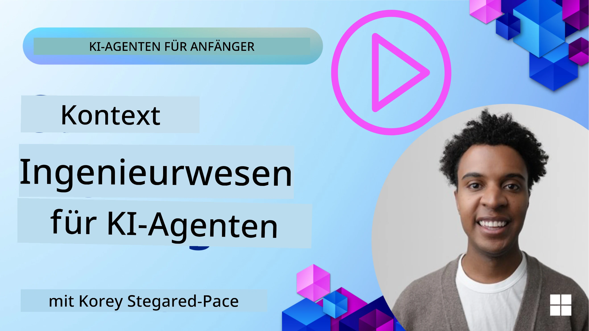
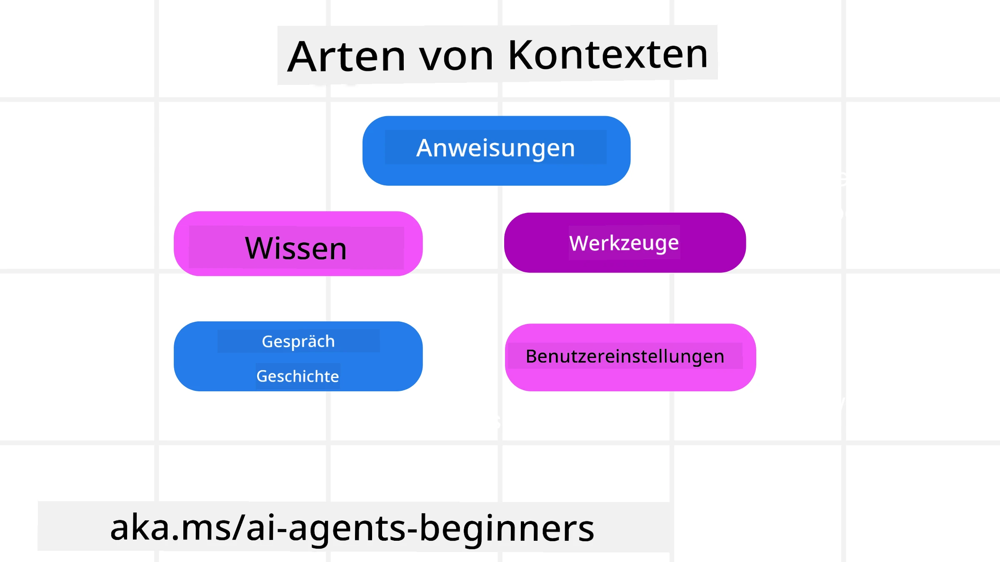
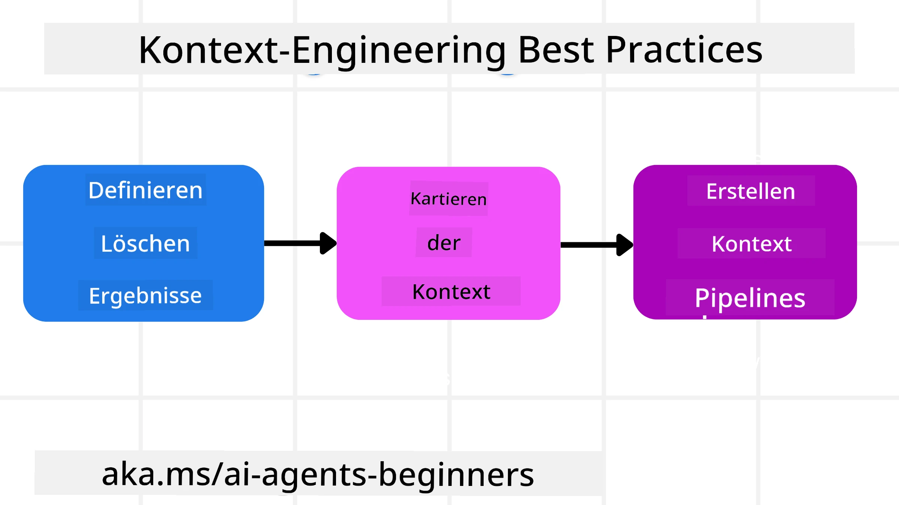

# Kontext-Engineering für KI-Agenten

> _(Klicken Sie auf das obige Bild, um das Video zu dieser Lektion anzusehen)_

Das Verständnis der Komplexität der Anwendung, für die Sie einen KI-Agenten entwickeln, ist wichtig, um einen zuverlässigen zu erstellen. Wir müssen KI-Agenten bauen, die Informationen effektiv verwalten, um komplexe Anforderungen zu erfüllen, die über das Prompt-Engineering hinausgehen.

In dieser Lektion betrachten wir, was Kontext-Engineering ist und welche Rolle es beim Aufbau von KI-Agenten spielt.

## Einführung

Diese Lektion behandelt:

• **Was Kontext-Engineering ist** und warum es sich vom Prompt-Engineering unterscheidet.

• **Strategien für effektives Kontext-Engineering**, einschließlich wie man Informationen schreibt, auswählt, komprimiert und isoliert.

• **Häufige Kontextfehler**, die Ihren KI-Agenten aus der Bahn werfen können, und wie man sie behebt.

## Lernziele

Nach Abschluss dieser Lektion werden Sie verstehen, wie man:

• **Kontext-Engineering definiert** und es vom Prompt-Engineering unterscheidet.

• **Die wichtigsten Komponenten des Kontexts** in Anwendungen mit großen Sprachmodellen (LLM) identifiziert.

• **Strategien für das Schreiben, Auswählen, Komprimieren und Isolieren von Kontext** anwendet, um die Leistung des Agenten zu verbessern.

• **Häufige Kontextfehler** wie Vergiftung, Ablenkung, Verwirrung und Konflikte erkennt und Gegenmaßnahmen umsetzt.

## Was ist Kontext-Engineering?

Für KI-Agenten ist Kontext das, was die Planung eines KI-Agenten antreibt, um bestimmte Aktionen auszuführen. Kontext-Engineering ist die Praxis, sicherzustellen, dass der KI-Agent die richtigen Informationen hat, um den nächsten Schritt der Aufgabe zu erledigen. Das Kontextfenster ist in der Größe begrenzt, daher müssen wir als Entwickler Systeme und Prozesse aufbauen, um das Hinzufügen, Entfernen und Verdichten der Informationen im Kontextfenster zu verwalten.

### Prompt-Engineering vs. Kontext-Engineering

Prompt-Engineering konzentriert sich auf einen einzigen Satz statischer Anweisungen, um die KI-Agenten effektiv mit Regeln zu führen. Kontext-Engineering hingegen beschäftigt sich mit der Verwaltung eines dynamischen Satzes von Informationen, einschließlich des ursprünglichen Prompts, um sicherzustellen, dass der KI-Agent im Laufe der Zeit das hat, was er braucht. Die Hauptidee des Kontext-Engineerings ist es, diesen Prozess wiederholbar und zuverlässig zu machen.

### Arten von Kontext

Es ist wichtig zu bedenken, dass Kontext nicht nur eine Sache ist. Die Informationen, die der KI-Agent benötigt, können aus verschiedenen Quellen stammen, und es liegt an uns, sicherzustellen, dass der Agent Zugang zu diesen Quellen hat:

Die Arten von Kontext, die ein KI-Agent verwalten muss, umfassen:

• **Anweisungen:** Diese sind wie die „Regeln“ des Agenten – Prompts, Systemnachrichten, Few-Shot-Beispiele (die zeigen, wie die KI etwas tun soll) und Beschreibungen von Werkzeugen, die er verwenden kann. Hier verbindet sich der Fokus des Prompt-Engineerings mit dem des Kontext-Engineerings.

• **Wissen:** Dies umfasst Fakten, Informationen, die aus Datenbanken abgerufen werden, oder Langzeiterinnerungen, die der Agent gesammelt hat. Dies beinhaltet die Integration eines Retrieval Augmented Generation (RAG)-Systems, falls ein Agent Zugriff auf verschiedene Wissensspeicher und Datenbanken benötigt.

• **Werkzeuge:** Das sind Definitionen von externen Funktionen, APIs und MCP-Servern, die der Agent aufrufen kann, sowie das Feedback (Ergebnisse), das er durch deren Nutzung erhält.

• **Konversationsverlauf:** Der laufende Dialog mit einem Benutzer. Mit der Zeit werden diese Unterhaltungen länger und komplexer, was bedeutet, dass sie Platz im Kontextfenster einnehmen.

• **Benutzereinstellungen:** Informationen, die über die Vorlieben oder Abneigungen eines Benutzers im Laufe der Zeit gelernt wurden. Diese können gespeichert und bei wichtigen Entscheidungen zur Unterstützung des Benutzers abgerufen werden.

## Strategien für effektives Kontext-Engineering

### Planungsstrategien

Gutes Kontext-Engineering beginnt mit guter Planung. Hier ist ein Ansatz, der Ihnen hilft, über die Anwendung des Konzepts des Kontext-Engineerings nachzudenken:

1. **Definieren Sie klare Ergebnisse** – Die Ergebnisse der Aufgaben, die KI-Agenten zugewiesen werden, sollten klar definiert sein. Beantworten Sie die Frage: „Wie wird die Welt aussehen, wenn der KI-Agent seine Aufgabe erfüllt hat?“ Mit anderen Worten: Welche Veränderung, Information oder Antwort sollte der Benutzer nach der Interaktion mit dem KI-Agenten haben?
2. **Kontext abbilden** – Sobald Sie die Ergebnisse des KI-Agenten definiert haben, müssen Sie die Frage beantworten: „Welche Informationen benötigt der KI-Agent, um diese Aufgabe abzuschließen?“ So können Sie den Kontext kartieren, wo diese Informationen zu finden sind.
3. **Kontext-Pipelines erstellen** – Jetzt, wo Sie wissen, wo die Informationen sind, müssen Sie die Frage beantworten: „Wie bekommt der Agent diese Informationen?“ Dies kann auf verschiedene Weisen geschehen, einschließlich RAG, Nutzung von MCP-Servern und anderen Werkzeugen.

### Praktische Strategien

Planung ist wichtig, aber sobald die Informationen in das Kontextfenster unseres Agenten fließen, brauchen wir praktische Strategien, um diese zu verwalten:

#### Kontextmanagement

Während einige Informationen automatisch zum Kontextfenster hinzugefügt werden, geht es beim Kontext-Engineering darum, eine aktivere Rolle bei diesen Informationen einzunehmen, was mit einigen Strategien möglich ist:

 1. **Agenten-Notizblock**  
 Dies ermöglicht es einem KI-Agenten, während einer einzelnen Sitzung relevante Informationen zu aktuellen Aufgaben und Benutzerinteraktionen zu notieren. Dieser Notizblock sollte außerhalb des Kontextfensters existieren, beispielsweise in einer Datei oder einem Laufzeitobjekt, das der Agent später während der Sitzung bei Bedarf abrufen kann.

 2. **Erinnerungen**  
 Notizblöcke sind gut, um Informationen außerhalb des Kontextfensters einer einzelnen Sitzung zu verwalten. Erinnerungen ermöglichen es Agenten, relevante Informationen über mehrere Sitzungen hinweg zu speichern und abzurufen. Dies kann Zusammenfassungen, Benutzereinstellungen und Feedback für zukünftige Verbesserungen umfassen.

 3. **Kontext komprimieren**  
  Sobald das Kontextfenster wächst und sich seinem Limit nähert, können Techniken wie Zusammenfassung und Kürzung eingesetzt werden. Dabei wird entweder nur die relevanteste Information behalten oder ältere Nachrichten entfernt.

 4. **Multi-Agenten-Systeme**  
  Die Entwicklung von Multi-Agenten-Systemen ist eine Form des Kontext-Engineerings, da jeder Agent sein eigenes Kontextfenster hat. Wie dieser Kontext geteilt und an verschiedene Agenten weitergegeben wird, ist ein weiterer Punkt, der beim Bau dieser Systeme geplant werden muss.

 5. **Sandbox-Umgebungen**  
  Wenn ein Agent Code ausführen oder große Informationsmengen in einem Dokument verarbeiten muss, kann dies viele Tokens erfordern, um die Ergebnisse zu verarbeiten. Statt dies alles im Kontextfenster zu speichern, kann der Agent eine Sandbox-Umgebung nutzen, die den Code ausführt und nur die Ergebnisse und andere relevante Informationen liest.

 6. **Laufzeit-Zustandsobjekte**  
   Dies erfolgt durch Erstellung von Informationscontainern, um Situationen zu verwalten, in denen der Agent auf bestimmte Informationen zugreifen muss. Für eine komplexe Aufgabe ermöglicht dies einem Agenten, die Ergebnisse jeder Teilaufgabe Schritt für Schritt zu speichern, wodurch der Kontext nur mit dieser spezifischen Teilaufgabe verbunden bleibt.

#### Kontextinspektion

Nachdem Sie eine dieser Strategien angewendet haben, lohnt es sich zu prüfen, was der nächste Modellaufruf tatsächlich erhalten hat. Eine nützliche Debugging-Frage ist:

> Hat der Agent zu viel Kontext geladen, den falschen Kontext oder fehlte ihm Kontext, den er benötigte?

Sie müssen keine Roh-Prompts, Werkzeugausgaben oder Speicherinhalte protokollieren, um diese Frage zu beantworten. In der Produktion sind kleine Kontext-Inspektionsaufzeichnungen zu bevorzugen, die Zählungen, IDs, Hashes und Richtlinienetiketten erfassen:

- **Auswahl:** Verfolgen Sie, wie viele Kandidaten-Chunks, Werkzeuge oder Erinnerungen in Betracht gezogen wurden, wie viele ausgewählt wurden und welche Regel oder Punktzahl die anderen herausgefiltert hat.
- **Kompression:** Protokollieren Sie den Quellbereich oder die Trace-ID, die Zusammenfassungs-ID, eine geschätzte Tokenanzahl vor und nach der Kompression und ob der Rohinhalt vom nächsten Aufruf ausgeschlossen wurde.
- **Isolation:** Notieren Sie, welche Teilaufgabe in einem separaten Agenten, einer Sitzung oder Sandbox ausgeführt wurde, welche begrenzte Zusammenfassung zurückgegeben wurde und ob große Werkzeugausgaben außerhalb des Kontextes des übergeordneten Agenten blieben.
- **Speicher und RAG:** Speichern Sie Abrufdokument-IDs, Speicher-IDs, Scores, ausgewählte IDs und Redaktionsstatus anstelle des vollständigen abgerufenen Texts.
- **Sicherheit und Datenschutz:** Bevorzugen Sie Hashes, IDs, Token-Buckets und Richtlinienlabels gegenüber sensiblen Prompt-Texten, Werkzeugargumenten, Werkzeugergebnissen oder Benutzerspeicherinhalten.

Das Ziel ist nicht, mehr Kontext aufzubewahren. Es ist, genügend Beweise zu hinterlassen, damit ein Entwickler erkennen kann, welche Kontextstrategie angewandt wurde und ob sie den nächsten Modellaufruf wie beabsichtigt verändert hat.

### Beispiel für Kontext-Engineering

Nehmen wir an, wir wollen einen KI-Agenten mit der Aufgabe **„Buche mir eine Reise nach Paris.“**

• Ein einfacher Agent, der nur Prompt-Engineering nutzt, könnte einfach antworten: **„Okay, wann möchtest du nach Paris reisen?“** Er hat nur Ihre direkte Frage zu dem Zeitpunkt verarbeitet, als der Benutzer sie gestellt hat.

• Ein Agent, der die im Kontext-Engineering behandelten Strategien anwendet, macht viel mehr. Bevor er überhaupt antwortet, könnte sein System zum Beispiel:

  ◦ **Ihren Kalender prüfen** für verfügbare Termine (Abruf von Echtzeitdaten).

 ◦ **Frühere Reisepräferenzen abrufen** (aus Langzeitspeicher) wie bevorzugte Fluggesellschaft, Budget oder ob Sie Direktflüge bevorzugen.

 ◦ **Verfügbare Werkzeuge identifizieren** für Flug- und Hotelbuchung.

- Dann könnte eine Beispielantwort lauten: „Hey [Ihr Name]! Ich sehe, Sie sind in der ersten Oktoberwoche frei. Soll ich nach Direktflügen nach Paris mit [bevorzugte Fluggesellschaft] im üblichen Budget von [Budget] suchen?“ Diese reichhaltigere, kontextbewusste Antwort demonstriert die Macht des Kontext-Engineerings.

## Häufige Kontextfehler

### Kontextvergiftung

**Was es ist:** Wenn eine Halluzination (falsche Information, die vom LLM erzeugt wird) oder ein Fehler in den Kontext gelangt und wiederholt referenziert wird, was dazu führt, dass der Agent unmögliche Ziele verfolgt oder unsinnige Strategien entwickelt.

**Was zu tun ist:** Implementieren Sie **Kontextvalidierung** und **Quarantäne**. Validieren Sie Informationen, bevor sie in den Langzeitspeicher aufgenommen werden. Wird eine potenzielle Vergiftung erkannt, starten Sie frische Kontext-Stränge, um die Verbreitung der falschen Informationen zu verhindern.

**Beispiel Reisebuchung:** Ihr Agent halluziniert einen **Direktflug von einem kleinen lokalen Flughafen zu einer weit entfernten internationalen Stadt**, der tatsächlich keine internationalen Flüge anbietet. Dieses nicht existierende Flugdatenblatt wird im Kontext gespeichert. Später, wenn Sie den Agenten bitten zu buchen, versucht er wiederholt, Tickets für diese unmögliche Route zu finden, was zu wiederholten Fehlern führt.

**Lösung:** Führen Sie einen Schritt ein, der **die Existenz und Routen des Flugs mit einer Echtzeit-API validiert**, _bevor_ die Flugdaten ins Arbeitskontext des Agenten aufgenommen werden. Schlägt die Validierung fehl, wird die fehlerhafte Information „quarantänisiert“ und nicht weiter verwendet.

### Kontext-Ablenkung

**Was es ist:** Wenn der Kontext so groß wird, dass das Modell sich zu sehr auf die angesammelte Geschichte konzentriert, anstatt das Gelernte aus der Trainingszeit zu nutzen. Das führt zu sich wiederholenden oder unhilfreichen Aktionen. Modelle machen Fehler oft schon bevor das Kontextfenster voll ist.

**Was zu tun ist:** Verwenden Sie **Kontext-Zusammenfassung**. Komprimieren Sie periodisch angesammelte Informationen zu kürzeren Zusammenfassungen, behalten Sie wichtige Details, entfernen Sie redundante Historie. Dies hilft, den Fokus zurückzusetzen.

**Beispiel Reisebuchung:** Sie haben lange über verschiedene Traumreiseziele gesprochen, inklusive detaillierter Beschreibungen Ihrer Rucksackreise von vor zwei Jahren. Wenn Sie schließlich bitten, **„finde mir einen günstigen Flug für nächsten Monat“**, ist der Agent von den alten, irrelevanten Details überflutet und fragt weiter nach Ihrem Rucksackequipment oder alten Reiseplänen, vernachlässigt dabei aber Ihre aktuelle Anfrage.

**Lösung:** Nach einer bestimmten Anzahl von Dialogrunden oder wenn der Kontext zu umfangreich wird, sollte der Agent **die neuesten und relevantesten Teile der Unterhaltung zusammenfassen** – mit Fokus auf Ihre aktuellen Reisedaten und das Ziel – und diese verdichtete Zusammenfassung für den nächsten LLM-Aufruf verwenden, während der weniger relevante Chatverlauf verworfen wird.

### Kontext-Verwirrung

**Was es ist:** Wenn unnötiger Kontext, häufig in Form von zu vielen verfügbaren Werkzeugen, dazu führt, dass das Modell schlechte Antworten generiert oder irrelevante Werkzeuge aufruft. Kleinere Modelle sind dafür besonders anfällig.

**Was zu tun ist:** Implementieren Sie **Werkzeug-Lastmanagement** mithilfe von RAG-Techniken. Speichern Sie Werkzeugbeschreibungen in einer Vektor-Datenbank und wählen Sie _nur_ die relevantesten Werkzeuge für jede spezifische Aufgabe aus. Forschungen zeigen, dass man die Werkzeugauswahl auf weniger als 30 beschränken sollte.

**Beispiel Reisebuchung:** Ihr Agent hat Zugriff auf Dutzende Werkzeuge: `book_flight`, `book_hotel`, `rent_car`, `find_tours`, `currency_converter`, `weather_forecast`, `restaurant_reservations` usw. Sie fragen: **„Was ist der beste Weg, sich in Paris fortzubewegen?“** Durch die große Anzahl Werkzeuge ist der Agent verwirrt und versucht möglicherweise, `book_flight` _innerhalb_ von Paris aufzurufen oder `rent_car`, obwohl Sie öffentlichen Nahverkehr bevorzugen, weil sich die Werkzeugbeschreibungen überschneiden oder er einfach das beste Werkzeug nicht erkennen kann.

**Lösung:** Verwenden Sie **RAG für Werkzeugbeschreibungen**. Wenn Sie nach der Fortbewegung in Paris fragen, holt das System dynamisch _nur_ die relevantesten Werkzeuge wie `rent_car` oder `public_transport_info` basierend auf Ihrer Anfrage ab und präsentiert dem LLM eine fokussierte „Werkzeugauswahl“.

### Kontext-Konflikt

**Was es ist:** Wenn widersprüchliche Informationen im Kontext vorhanden sind, führt das zu inkonsistentem Denken oder schlechten Endantworten. Dies passiert oft, wenn Informationen in Stufen eintreffen und frühe, falsche Annahmen im Kontext verbleiben.

**Was zu tun ist:** Verwenden Sie **Kontextbeschneidung (Pruning)** und **Auslagerung (Offloading)**. Pruning bedeutet, veraltete oder widersprüchliche Informationen zu entfernen, sobald neue Details eintreffen. Offloading gibt dem Modell einen separaten „Notizblock“-Arbeitsbereich, um Informationen zu verarbeiten, ohne den Hauptkontext zu überladen.
**Beispiel für Reisebuchung:** Sie sagen Ihrem Agenten zunächst: **„Ich möchte Economy Class fliegen.“** Später im Gespräch ändern Sie Ihre Meinung und sagen: **„Tatsächlich, für diese Reise nehmen wir Business Class.“** Wenn beide Anweisungen im Kontext verbleiben, kann der Agent widersprüchliche Suchergebnisse erhalten oder verwirrt sein, welche Präferenz Vorrang hat.

**Lösung:** Implementieren Sie **Kontextbereinigung**. Wenn eine neue Anweisung der alten widerspricht, wird die ältere Anweisung aus dem Kontext entfernt oder ausdrücklich überschrieben. Alternativ kann der Agent ein **Schmierblatt** verwenden, um widersprüchliche Präferenzen abzugleichen, bevor er eine Entscheidung trifft, sodass nur die endgültige, konsistente Anweisung seine Aktionen steuert.

## Haben Sie noch Fragen zum Kontext-Engineering?

Treten Sie dem [Microsoft Foundry Discord](https://aka.ms/ai-agents/discord) bei, um andere Lernende zu treffen, an Sprechstunden teilzunehmen und Antworten auf Ihre Fragen zu AI Agents zu erhalten.

---

<!-- CO-OP TRANSLATOR DISCLAIMER START -->
**Haftungsausschluss**:
Dieses Dokument wurde mit dem KI-Übersetzungsdienst [Co-op Translator](https://github.com/Azure/co-op-translator) übersetzt. Obwohl wir uns um Genauigkeit bemühen, beachten Sie bitte, dass automatisierte Übersetzungen Fehler oder Ungenauigkeiten enthalten können. Das Originaldokument in seiner Ursprungssprache gilt als maßgebliche Quelle. Bei kritischen Informationen wird eine professionelle menschliche Übersetzung empfohlen. Wir übernehmen keine Haftung für Missverständnisse oder Fehlinterpretationen, die aus der Verwendung dieser Übersetzung entstehen.
<!-- CO-OP TRANSLATOR DISCLAIMER END -->