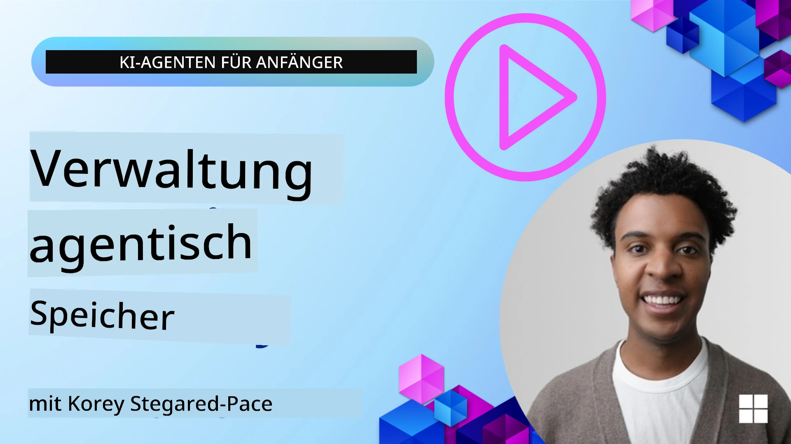

# Gedächtnis für KI-Agenten 

When discussing the unique benefits of creating AI Agents, two things are mainly discussed: the ability to call tools to complete tasks and the ability to improve over time. Memory is at the foundation of creating self-improving agent that can create better experiences for our users.

In this lesson, we will look at what memory is for AI Agents and how we can manage it and use it for the benefit of our applications.

## Einleitung

Diese Lektion behandelt:

• **Understanding AI Agent Memory**: What memory is and why it's essential for agents.

• **Implementing and Storing Memory**: Practical methods for adding memory capabilities to your AI agents, focusing on short-term and long-term memory.

• **Making AI Agents Self-Improving**: How memory enables agents to learn from past interactions and improve over time.

## Verfügbare Implementierungen

Diese Lektion enthält zwei umfassende Notebook-Tutorials:

• **[13-agent-memory.ipynb](./13-agent-memory.ipynb)**: Implements memory using Mem0 and Azure AI Search with Microsoft Agent Framework

• **[13-agent-memory-cognee.ipynb](./13-agent-memory-cognee.ipynb)**: Implements structured memory using Cognee, automatically building knowledge graph backed by embeddings, visualizing graph, and intelligent retrieval

## Lernziele

Nach Abschluss dieser Lektion wissen Sie, wie man:

• **Differentiate between various types of AI agent memory**, including working, short-term, and long-term memory, as well as specialized forms like persona and episodic memory.

• **Implement and manage short-term and long-term memory for AI agents** using Microsoft Agent Framework, leveraging tools like Mem0, Cognee, Whiteboard memory, and integrating with Azure AI Search.

• **Understand the principles behind self-improving AI agents** and how robust memory management systems contribute to continuous learning and adaptation.

## Verständnis des Gedächtnisses von KI-Agenten

Im Kern bezieht sich **Gedächtnis für KI-Agenten auf die Mechanismen, die es ihnen ermöglichen, Informationen zu behalten und abzurufen**. Diese Informationen können spezifische Details über ein Gespräch, Benutzerpräferenzen, vergangene Aktionen oder sogar erlernte Muster sein.

Ohne Gedächtnis sind KI-Anwendungen oft zustandslos, was bedeutet, dass jede Interaktion bei Null beginnt. Dies führt zu einer sich wiederholenden und frustrierenden Benutzererfahrung, bei der der Agent den vorherigen Kontext oder Präferenzen "vergisst".

### Warum ist Gedächtnis wichtig?

Die Intelligenz eines Agenten ist eng mit seiner Fähigkeit verbunden, sich an vergangene Informationen zu erinnern und diese zu nutzen. Gedächtnis ermöglicht es Agenten,:

• **Reflektierend**: Aus vergangenen Aktionen und Ergebnissen zu lernen.

• **Interaktiv**: Den Kontext während eines laufenden Gesprächs aufrechtzuerhalten.

• **Proaktiv und Reaktiv**: Bedürfnisse zu antizipieren oder entsprechend historischen Daten angemessen zu reagieren.

• **Autonom**: Unabhängiger zu agieren, indem auf gespeichertes Wissen zurückgegriffen wird.

Das Ziel der Implementierung von Gedächtnis ist es, Agenten zuverlässiger und leistungsfähiger zu machen.

### Arten von Gedächtnis

#### Arbeitsgedächtnis

Betrachten Sie dies als ein Stück Schmierpapier, das ein Agent während einer einzelnen, laufenden Aufgabe oder eines Denkprozesses verwendet. Es enthält unmittelbare Informationen, die benötigt werden, um den nächsten Schritt zu berechnen.

Für KI-Agenten erfasst das Arbeitsgedächtnis oft die relevantesten Informationen aus einem Gespräch, selbst wenn der vollständige Chatverlauf lang oder abgeschnitten ist. Es konzentriert sich darauf, Schlüsselelemente wie Anforderungen, Vorschläge, Entscheidungen und Aktionen zu extrahieren.

**Working Memory Example**

Bei einem Reisebuchungsagenten könnte das Arbeitsgedächtnis die aktuelle Anfrage des Benutzers erfassen, z. B. "Ich möchte eine Reise nach Paris buchen". Diese spezifische Anforderung wird im unmittelbaren Kontext des Agenten gehalten, um die aktuelle Interaktion zu steuern.

#### Kurzzeitgedächtnis

Diese Art von Gedächtnis bewahrt Informationen für die Dauer eines einzelnen Gesprächs oder einer Sitzung. Es ist der Kontext des aktuellen Chats und ermöglicht es dem Agenten, auf frühere Gesprächsbeiträge zurückzuweisen.

**Short Term Memory Example**

Wenn ein Benutzer fragt: "Wie viel würde ein Flug nach Paris kosten?" und dann mit "Wie sieht es mit der Unterkunft dort aus?" nachfragt, stellt das Kurzzeitgedächtnis sicher, dass der Agent weiß, dass sich "dort" im selben Gespräch auf "Paris" bezieht.

#### Langzeitgedächtnis

Dies sind Informationen, die über mehrere Gespräche oder Sitzungen hinweg bestehen bleiben. Es erlaubt Agenten, Benutzerpräferenzen, historische Interaktionen oder allgemeines Wissen über längere Zeiträume hinweg zu behalten. Das ist wichtig für Personalisierung.

**Long Term Memory Example**

Ein Langzeitgedächtnis könnte speichern, dass "Ben gerne Ski fährt und Outdoor-Aktivitäten mag, Kaffee mit Bergblick bevorzugt und fortgeschrittene Skipisten wegen einer früheren Verletzung vermeiden möchte". Diese aus früheren Interaktionen gewonnenen Informationen beeinflussen Empfehlungen in zukünftigen Reiseplanungs-Sitzungen und machen sie sehr personalisiert.

#### Persona-Gedächtnis

Diese spezialisierte Gedächtnisart hilft einem Agenten, eine konsistente "Persönlichkeit" oder "Persona" zu entwickeln. Sie erlaubt dem Agenten, Details über sich selbst oder seine beabsichtigte Rolle zu merken, sodass Interaktionen flüssiger und zielgerichteter werden.

**Persona Memory Example**
Wenn der Reiseagent so konzipiert ist, dass er ein "Experte für Skiplanung" ist, könnte das Persona-Gedächtnis diese Rolle verstärken und seine Antworten im Ton und Wissen eines Experten ausrichten.

#### Workflow-/Episodisches Gedächtnis

Dieses Gedächtnis speichert die Abfolge von Schritten, die ein Agent während einer komplexen Aufgabe unternimmt, einschließlich Erfolgen und Misserfolgen. Es ist wie das Erinnern an bestimmte "Episoden" oder vergangene Erfahrungen, um daraus zu lernen.

**Episodic Memory Example**

Wenn der Agent versucht hat, einen bestimmten Flug zu buchen, dies aber wegen Nichtverfügbarkeit fehlgeschlagen ist, könnte das episodische Gedächtnis diesen Fehler aufzeichnen, sodass der Agent alternative Flüge versuchen oder den Benutzer bei einem späteren Versuch besser informieren kann.

#### Entitätsgedächtnis

Dies beinhaltet das Extrahieren und Merken spezifischer Entitäten (wie Personen, Orte oder Dinge) und Ereignisse aus Gesprächen. Es ermöglicht dem Agenten, ein strukturiertes Verständnis der besprochenen Schlüsselelemente aufzubauen.

**Entity Memory Example**

Aus einem Gespräch über eine vergangene Reise könnte der Agent "Paris", "Eiffelturm" und "Abendessen im Restaurant Le Chat Noir" als Entitäten extrahieren. In einer zukünftigen Interaktion könnte der Agent sich an "Le Chat Noir" erinnern und anbieten, dort eine neue Reservierung vorzunehmen.

#### Strukturiertes RAG (Retrieval Augmented Generation)

Während RAG eine breitere Technik ist, wird "Strukturiertes RAG" als eine leistungsstarke Gedächtnistechnologie hervorgehoben. Es extrahiert dichte, strukturierte Informationen aus verschiedenen Quellen (Gespräche, E-Mails, Bilder) und verwendet diese, um Präzision, Recall und Geschwindigkeit bei Antworten zu verbessern. Im Gegensatz zum klassischen RAG, das ausschließlich auf semantischer Ähnlichkeit basiert, arbeitet Strukturiertes RAG mit der inhärenten Struktur von Informationen.

**Structured RAG Example**

Anstatt nur Schlüsselwörter abzugleichen, könnte Strukturiertes RAG Flugdetails (Ziel, Datum, Uhrzeit, Fluggesellschaft) aus einer E-Mail parsen und strukturiert speichern. Dies ermöglicht präzise Abfragen wie "Welchen Flug habe ich am Dienstag nach Paris gebucht?"

## Implementierung und Speicherung von Gedächtnis

Die Implementierung von Gedächtnis für KI-Agenten umfasst einen systematischen Prozess des **Gedächtnismanagements**, der das Generieren, Speichern, Abrufen, Integrieren, Aktualisieren und sogar das "Vergessen" (oder Löschen) von Informationen beinhaltet. Das Abrufen ist dabei ein besonders wichtiger Aspekt.

### Spezialisierte Gedächtnis-Tools

#### Mem0

Eine Möglichkeit, Agentengedächtnis zu speichern und zu verwalten, ist die Verwendung spezialisierter Tools wie Mem0. Mem0 fungiert als persistente Gedächtnisschicht, die es Agenten ermöglicht, relevante Interaktionen abzurufen, Benutzerpräferenzen und faktischen Kontext zu speichern und aus Erfolgen und Misserfolgen im Laufe der Zeit zu lernen. Die Idee ist hier, dass zustandslose Agenten in zustandsbehaftete verwandelt werden.

Es funktioniert durch eine **two-phase memory pipeline: extraction and update**. Zuerst werden Nachrichten, die dem Thread eines Agenten hinzugefügt werden, an den Mem0-Dienst gesendet, der ein Large Language Model (LLM) verwendet, um die Gesprächshistorie zusammenzufassen und neue Erinnerungen zu extrahieren. Anschließend bestimmt eine LLM-gesteuerte Aktualisierungsphase, ob diese Erinnerungen hinzugefügt, geändert oder gelöscht werden sollen, und speichert sie in einem hybriden Datenspeicher, der Vektor-, Graph- und Schlüssel-Wert-Datenbanken umfassen kann. Dieses System unterstützt auch verschiedene Gedächtnistypen und kann Graph-Gedächtnis zur Verwaltung von Beziehungen zwischen Entitäten integrieren.

#### Cognee

Ein weiterer leistungsstarker Ansatz ist die Verwendung von **Cognee**, einem Open-Source-Semantik-Gedächtnis für KI-Agenten, das strukturierte und unstrukturierte Daten in durchsuchbare Wissensgraphen wandelt, die von Embeddings unterstützt werden. Cognee bietet eine **dual-store architecture**, die Vektor-Ähnlichkeitssuche mit Graphbeziehungen kombiniert und es Agenten ermöglicht zu verstehen, nicht nur welche Informationen ähnlich sind, sondern wie Konzepte miteinander in Beziehung stehen.

Es glänzt bei **hybrid retrieval**, das Vektorähnlichkeit, Graphstruktur und LLM-Reasoning kombiniert – von roher Chunk-Suche bis hin zu graphbewusster Fragebeantwortung. Das System pflegt **lebendes Gedächtnis**, das sich entwickelt und wächst, während es als ein verbundenes Graphnetzwerk durchsuchbar bleibt, und unterstützt sowohl kurzzeitigen Sitzungs-Kontext als auch langfristiges persistentes Gedächtnis.

Das Cognee-Notebook-Tutorial ([13-agent-memory-cognee.ipynb](./13-agent-memory-cognee.ipynb)) zeigt den Aufbau dieser einheitlichen Gedächtnisschicht mit praktischen Beispielen zum Ingestieren verschiedener Datenquellen, zur Visualisierung des Wissensgraphen und zum Abfragen mit unterschiedlichen Suchstrategien, die auf die speziellen Bedürfnisse von Agenten zugeschnitten sind.

### Speicherung von Gedächtnis mit RAG

Neben spezialisierten Gedächtnis-Tools wie mem0 können Sie robuste Suchdienste wie **Azure AI Search als Backend zum Speichern und Abrufen von Erinnerungen** nutzen, insbesondere für strukturiertes RAG.

Dies ermöglicht es Ihnen, die Antworten Ihres Agenten mit Ihren eigenen Daten zu untermauern und so relevantere und genauere Antworten zu gewährleisten. Azure AI Search kann verwendet werden, um benutzerspezifische Reiseerinnerungen, Produktkataloge oder jegliches andere domänenspezifische Wissen zu speichern.

Azure AI Search unterstützt Funktionen wie **Strukturiertes RAG**, das sich darauf spezialisiert, dichte, strukturierte Informationen aus großen Datensätzen wie Gesprächsverläufen, E-Mails oder sogar Bildern zu extrahieren und abzurufen. Dies bietet im Vergleich zu herkömmlichen Text-Chucking- und Embedding-Ansätzen eine "übermenschliche Präzision und Wiederauffindbarkeit".

## KI-Agenten selbst verbessern

Ein gängiges Muster für selbstverbessernde Agenten besteht darin, einen **"Knowledge Agent"** einzuführen. Dieser separate Agent beobachtet das Hauptgespräch zwischen dem Benutzer und dem primären Agenten. Seine Aufgaben sind:

1. **Wertvolle Informationen identifizieren**: Bestimmen, ob ein Teil des Gesprächs als allgemeines Wissen oder als spezifische Benutzerpräferenz gespeichert werden sollte.

2. **Extrahieren und Zusammenfassen**: Das Wesentliche aus dem Gespräch destillieren oder die Präferenz zusammenfassen.

3. **In einer Wissensbasis speichern**: Diese extrahierte Information persistieren, oft in einer Vektor-Datenbank, damit sie später abgerufen werden kann.

4. **Zukünftige Abfragen ergänzen**: Wenn der Benutzer eine neue Anfrage startet, ruft der Knowledge Agent relevante gespeicherte Informationen ab und fügt sie der Aufforderung des Benutzers hinzu, um dem primären Agenten entscheidenden Kontext zu liefern (ähnlich wie bei RAG).

### Optimierungen für Gedächtnis

• **Latenzmanagement**: Um die Benutzerinteraktionen nicht zu verlangsamen, kann zunächst ein günstigeres, schnelleres Modell verwendet werden, um schnell zu prüfen, ob Informationen wert sind, gespeichert oder abgerufen zu werden, und nur bei Bedarf den komplexeren Extraktions-/Abrufprozess aufzurufen.

• **Wartung der Wissensbasis**: Für eine wachsende Wissensbasis können weniger häufig verwendete Informationen in "Cold Storage" verschoben werden, um Kosten zu verwalten.

## Haben Sie weitere Fragen zum Gedächtnis von Agenten?

Join the [Microsoft Foundry Discord](https://aka.ms/ai-agents/discord) to meet with other learners, attend office hours and get your AI Agents questions answered.

---

<!-- CO-OP TRANSLATOR DISCLAIMER START -->
Haftungsausschluss:
Dieses Dokument wurde mit dem KI-Übersetzungsdienst [Co-op Translator](https://github.com/Azure/co-op-translator) übersetzt. Obwohl wir uns um Genauigkeit bemühen, beachten Sie bitte, dass automatisierte Übersetzungen Fehler oder Ungenauigkeiten enthalten können. Das Originaldokument in seiner Originalsprache ist als maßgebliche Quelle zu betrachten. Für wichtige Informationen wird eine professionelle menschliche Übersetzung empfohlen. Wir übernehmen keine Haftung für Missverständnisse oder Fehlinterpretationen, die aus der Verwendung dieser Übersetzung entstehen.
<!-- CO-OP TRANSLATOR DISCLAIMER END -->