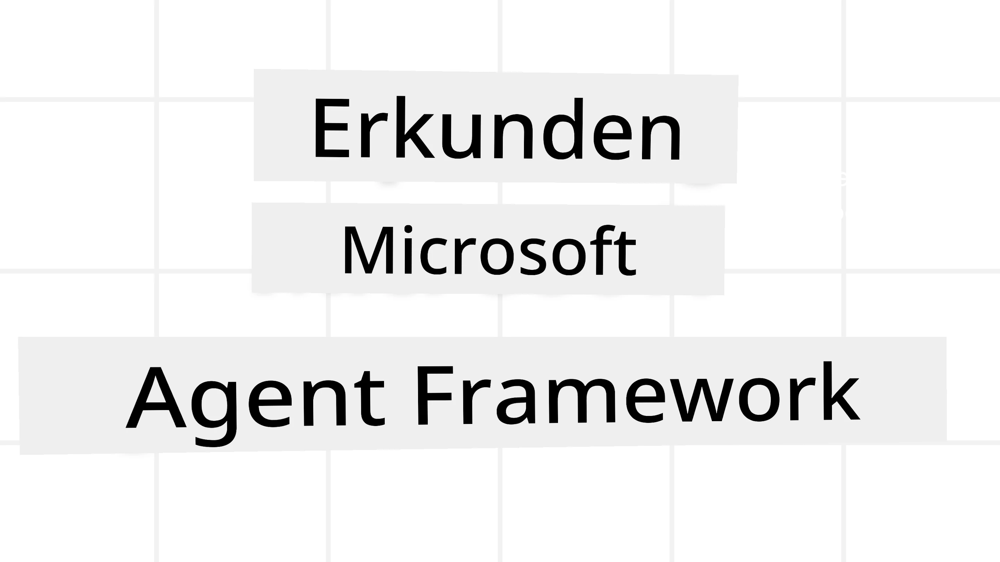
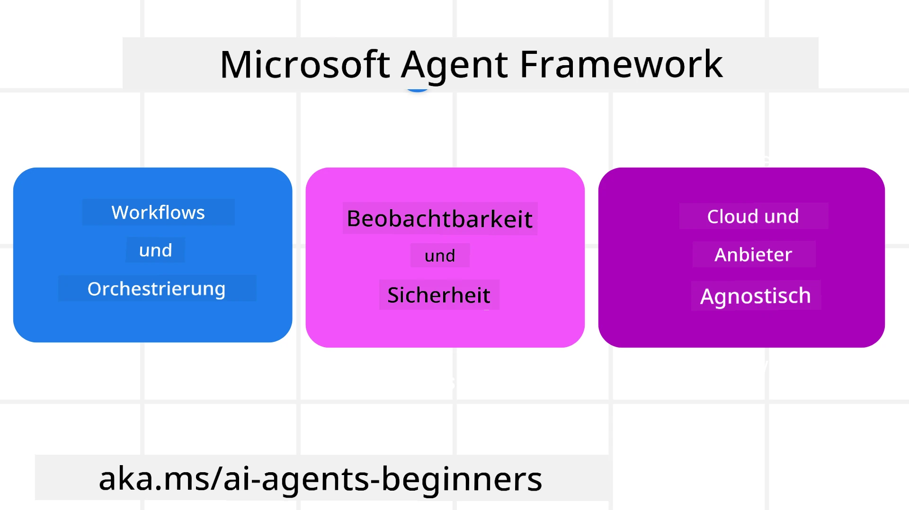
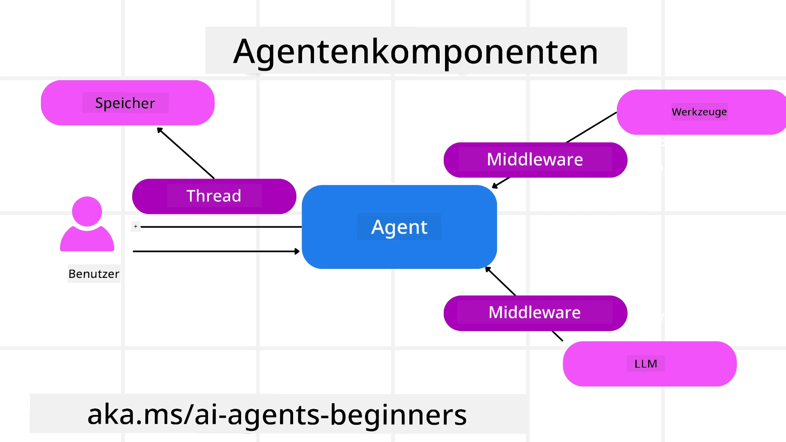

# Erkundung des Microsoft Agent Frameworks



### Einführung

Diese Lektion behandelt:

- Verständnis des Microsoft Agent Frameworks: Hauptmerkmale und Nutzen  
- Erkundung der Schlüsselkonzepte des Microsoft Agent Frameworks
- Fortgeschrittene MAF-Muster: Workflows, Middleware und Speicher

## Lernziele

Nach Abschluss dieser Lektion wissen Sie, wie Sie:

- Produktionsreife KI-Agenten mit dem Microsoft Agent Framework erstellen
- Die Kernfunktionen des Microsoft Agent Frameworks auf Ihre agentischen Anwendungsfälle anwenden
- Fortgeschrittene Muster wie Workflows, Middleware und Observability verwenden

## Code-Beispiele

Code-Beispiele für das [Microsoft Agent Framework (MAF)](https://aka.ms/ai-agents-beginners/agent-framewrok) finden Sie in diesem Repository unter den Dateien `xx-python-agent-framework` und `xx-dotnet-agent-framework`.

## Verständnis des Microsoft Agent Frameworks



[Microsoft Agent Framework (MAF)](https://aka.ms/ai-agents-beginners/agent-framewrok) ist Microsofts einheitliches Framework zum Erstellen von KI-Agenten. Es bietet die Flexibilität, eine Vielzahl von agentischen Anwendungsfällen zu adressieren, die sowohl in Produktions- als auch in Forschungsumgebungen vorkommen, einschließlich:

- **Sequentielle Agentenorchestrierung** in Szenarien, in denen Schritt-für-Schritt-Workflows erforderlich sind.
- **Gleichzeitige Orchestrierung** in Szenarien, in denen Agenten Aufgaben gleichzeitig ausführen müssen.
- **Gruppenchat-Orchestrierung** in Szenarien, in denen Agenten gemeinsam an einer Aufgabe arbeiten können.
- **Handoff-Orchestrierung** in Szenarien, bei denen Agenten die Aufgabe untereinander weiterreichen, sobald Teilaufgaben erledigt sind.
- **Magnetische Orchestrierung** in Szenarien, bei denen ein Manager-Agent eine Aufgabenliste erstellt und modifiziert und die Koordination der Unteragenten zur Erfüllung der Aufgabe übernimmt.

Um KI-Agenten in der Produktion bereitzustellen, umfasst MAF außerdem Funktionen für:

- **Observability** durch den Einsatz von OpenTelemetry, wobei jede Aktion des KI-Agenten inklusive Werkzeugaufrufen, Orchestrierungsschritten, Denkprozessen und Performancemonitoring über Microsoft Foundry Dashboards verfolgt wird.
- **Sicherheit** durch das native Hosting von Agenten auf Microsoft Foundry, das Sicherheitskontrollen wie rollenbasierte Zugriffe, private Datenbehandlung und integrierte Inhaltsicherheit einschließt.
- **Beständigkeit** indem Agenten-Threads und Workflows pausieren, fortsetzen und Fehler wiederherstellen können, was längere Prozesse ermöglicht.
- **Kontrolle** indem menschliche Kontrollschleifen-Workflows unterstützt werden, bei denen Aufgaben als genehmigungspflichtig markiert werden.

Microsoft Agent Framework legt auch Wert auf Interoperabilität durch:

- **Cloud-Unabhängigkeit** - Agenten können in Containern, lokal und auf verschiedenen Clouds ausgeführt werden.
- **Provider-Unabhängigkeit** - Agenten können über Ihr bevorzugtes SDK erstellt werden, einschließlich Azure OpenAI und OpenAI.
- **Integration offener Standards** - Agenten können Protokolle wie Agent-to-Agent (A2A) und Model Context Protocol (MCP) nutzen, um andere Agenten und Werkzeuge zu entdecken und zu verwenden.
- **Plugins und Connectors** - Verbindungen können zu Daten- und Speicherdiensten wie Microsoft Fabric, SharePoint, Pinecone und Qdrant hergestellt werden.

Schauen wir uns an, wie diese Funktionen auf einige der Kernkonzepte des Microsoft Agent Frameworks angewendet werden.

## Schlüsselkonzepte des Microsoft Agent Frameworks

### Agenten



**Agenten erstellen**

Die Erstellung von Agenten erfolgt durch die Definition des Inferenzdienstes (LLM-Anbieter), einer 
Reihe von Anweisungen, denen der KI-Agent folgen soll, und der Zuweisung eines `name`:

```python
agent = AzureOpenAIChatClient(credential=AzureCliCredential()).create_agent( instructions="You are good at recommending trips to customers based on their preferences.", name="TripRecommender" )
```

Oben wird `Azure OpenAI` verwendet, aber Agenten können mithilfe verschiedener Dienste erstellt werden, einschließlich `Microsoft Foundry Agent Service`:

```python
AzureAIAgentClient(async_credential=credential).create_agent( name="HelperAgent", instructions="You are a helpful assistant." ) as agent
```

OpenAI `Responses`, `ChatCompletion` APIs

```python
agent = OpenAIResponsesClient().create_agent( name="WeatherBot", instructions="You are a helpful weather assistant.", )
```

```python
agent = OpenAIChatClient().create_agent( name="HelpfulAssistant", instructions="You are a helpful assistant.", )
```

oder entfernte Agenten über das A2A-Protokoll:

```python
agent = A2AAgent( name=agent_card.name, description=agent_card.description, agent_card=agent_card, url="https://your-a2a-agent-host" )
```

**Agenten ausführen**

Agenten werden mittels der Methoden `.run` oder `.run_stream` für entweder nicht-streaming oder streaming Antworten ausgeführt.

```python
result = await agent.run("What are good places to visit in Amsterdam?")
print(result.text)
```

```python
async for update in agent.run_stream("What are the good places to visit in Amsterdam?"):
    if update.text:
        print(update.text, end="", flush=True)

```

Jeder Agentenlauf kann auch Optionen zur Anpassung von Parametern wie `max_tokens` verwenden, die vom Agenten verwendet werden, `tools`, die der Agent aufrufen kann, und sogar das `model`, das für den Agenten verwendet wird.

Dies ist nützlich in Fällen, in denen bestimmte Modelle oder Werkzeuge erforderlich sind, um die Aufgabe eines Benutzers zu erfüllen.

**Werkzeuge**

Werkzeuge können sowohl bei der Definition des Agenten:

```python
def get_attractions( location: Annotated[str, Field(description="The location to get the top tourist attractions for")], ) -> str: """Get the top tourist attractions for a given location.""" return f"The top attractions for {location} are." 


# Beim direkten Erstellen eines ChatAgent

agent = ChatAgent( chat_client=OpenAIChatClient(), instructions="You are a helpful assistant", tools=[get_attractions]

```

als auch beim Ausführen des Agenten definiert werden:

```python

result1 = await agent.run( "What's the best place to visit in Seattle?", tools=[get_attractions] # Werkzeug nur für diesen Lauf bereitgestellt )
```

**Agenten-Threads**

Agenten-Threads werden für Mehrfachgespräche verwendet. Threads können entweder durch:

- Verwendung von `get_new_thread()` erstellt werden, was ermöglicht, dass der Thread über die Zeit gespeichert wird
- Automatisches Erstellen eines Threads während der Ausführung eines Agenten, sodass der Thread nur während des aktuellen Laufs existiert.

Der Code zum Erstellen eines Threads sieht so aus:

```python
# Erstellen Sie einen neuen Thread.
thread = agent.get_new_thread() # Führen Sie den Agenten mit dem Thread aus.
response = await agent.run("Hello, I am here to help you book travel. Where would you like to go?", thread=thread)

```

Sie können dann den Thread serialisieren, um ihn später zu speichern:

```python
# Erstelle einen neuen Thread.
thread = agent.get_new_thread() 

# Führe den Agenten mit dem Thread aus.

response = await agent.run("Hello, how are you?", thread=thread) 

# Serialisiere den Thread zur Speicherung.

serialized_thread = await thread.serialize() 

# Deserialisiere den Thread-Zustand nach dem Laden aus dem Speicher.

resumed_thread = await agent.deserialize_thread(serialized_thread)
```

**Agenten-Middleware**

Agenten interagieren mit Werkzeugen und LLMs, um Benutzeraufgaben zu erfüllen. In bestimmten Szenarien möchten wir Aktionen zwischen diesen Interaktionen ausführen oder verfolgen. Agenten-Middleware ermöglicht dies durch:

*Funktions-Middleware*

Diese Middleware erlaubt es uns, eine Aktion zwischen dem Agenten und einer Funktion/einem Werkzeug, das aufgerufen wird, auszuführen. Ein Beispiel für die Verwendung wäre das Protokollieren eines Werkzeugaufrufs.

Im folgenden Code definiert `next`, ob die nächste Middleware oder die tatsächliche Funktion aufgerufen werden soll.

```python
async def logging_function_middleware(
    context: FunctionInvocationContext,
    next: Callable[[FunctionInvocationContext], Awaitable[None]],
) -> None:
    """Function middleware that logs function execution."""
    # Vorverarbeitung: Protokoll vor der Funktionsausführung
    print(f"[Function] Calling {context.function.name}")

    # Fortfahren zur nächsten Middleware oder Funktionsausführung
    await next(context)

    # Nachbearbeitung: Protokoll nach der Funktionsausführung
    print(f"[Function] {context.function.name} completed")
```

*Chat-Middleware*

Diese Middleware ermöglicht es uns, eine Aktion oder ein Protokoll zwischen dem Agenten und den Anfragen an das LLM auszuführen.

Sie enthält wichtige Informationen wie die `messages`, die an den KI-Dienst gesendet werden.

```python
async def logging_chat_middleware(
    context: ChatContext,
    next: Callable[[ChatContext], Awaitable[None]],
) -> None:
    """Chat middleware that logs AI interactions."""
    # Vorverarbeitung: Protokoll vor dem KI-Aufruf
    print(f"[Chat] Sending {len(context.messages)} messages to AI")

    # Weiter zum nächsten Middleware- oder KI-Dienst
    await next(context)

    # Nachverarbeitung: Protokoll nach der KI-Antwort
    print("[Chat] AI response received")

```

**Agenten-Speicher**

Wie in der Lektion `Agentic Memory` behandelt, ist Speicher ein wichtiges Element, damit der Agent über verschiedene Kontexte hinweg arbeiten kann. MAF bietet verschiedene Speicherarten an:

*In-Memory-Speicher*

Dies ist der während der Laufzeit der Anwendung in Threads gespeicherte Speicher.

```python
# Erstellen Sie einen neuen Thread.
thread = agent.get_new_thread() # Führen Sie den Agenten mit dem Thread aus.
response = await agent.run("Hello, I am here to help you book travel. Where would you like to go?", thread=thread)
```

*Persistente Nachrichten*

Dieser Speicher wird verwendet, um den Gesprächsverlauf über verschiedene Sitzungen hinweg zu speichern. Er wird mit der `chat_message_store_factory` definiert:

```python
from agent_framework import ChatMessageStore

# Erstellen Sie einen benutzerdefinierten Nachrichten-Speicher
def create_message_store():
    return ChatMessageStore()

agent = ChatAgent(
    chat_client=OpenAIChatClient(),
    instructions="You are a Travel assistant.",
    chat_message_store_factory=create_message_store
)

```

*Dynamischer Speicher*

Dieser Speicher wird dem Kontext vor dem Ausführen von Agenten hinzugefügt. Diese Speicher können in externen Diensten wie mem0 gespeichert werden:

```python
from agent_framework.mem0 import Mem0Provider

# Verwendung von Mem0 für erweiterte Speicherfähigkeiten
memory_provider = Mem0Provider(
    api_key="your-mem0-api-key",
    user_id="user_123",
    application_id="my_app"
)

agent = ChatAgent(
    chat_client=OpenAIChatClient(),
    instructions="You are a helpful assistant with memory.",
    context_providers=memory_provider
)

```

**Agenten-Observability**

Observability ist wichtig, um zuverlässige und wartbare agentische Systeme zu bauen. MAF integriert OpenTelemetry, um Tracing und Metriken für bessere Beobachtbarkeit bereitzustellen.

```python
from agent_framework.observability import get_tracer, get_meter

tracer = get_tracer()
meter = get_meter()
with tracer.start_as_current_span("my_custom_span"):
    # etwas tun
    pass
counter = meter.create_counter("my_custom_counter")
counter.add(1, {"key": "value"})
```

### Workflows

MAF bietet Workflows, die vordefinierte Schritte zum Abschließen einer Aufgabe umfassen und KI-Agenten als Komponenten in diesen Schritten einbinden.

Workflows bestehen aus verschiedenen Komponenten, die einen besseren Kontrollfluss ermöglichen. Workflows unterstützen auch **Multi-Agenten-Orchestrierung** und **Checkpointing**, um Workflow-Zustände zu speichern.

Die Kernkomponenten eines Workflows sind:

**Executor**

Executors empfangen Eingabenachrichten, führen ihre zugewiesenen Aufgaben aus und erzeugen dann eine Ausgabenachricht. Dadurch wird der Workflow vorangetrieben, um die größere Aufgabe zu erfüllen. Executors können entweder KI-Agenten oder benutzerdefinierte Logik sein.

**Kanten**

Kanten werden verwendet, um den Nachrichtenfluss in einem Workflow zu definieren. Diese können sein:

*Direkte Kanten* - Einfache Eins-zu-eins-Verbindungen zwischen Executoren:

```python
from agent_framework import WorkflowBuilder

builder = WorkflowBuilder()
builder.add_edge(source_executor, target_executor)
builder.set_start_executor(source_executor)
workflow = builder.build()
```

*Bedingte Kanten* - Werden aktiviert, nachdem eine bestimmte Bedingung erfüllt ist. Zum Beispiel, wenn Hotelzimmer nicht verfügbar sind, kann ein Executor andere Optionen vorschlagen.

*Switch-case-Kanten* - Leiten Nachrichten basierend auf definierten Bedingungen an unterschiedliche Executor weiter. Zum Beispiel, wenn ein Reisender Prioritätszugang hat und seine Aufgaben über einen anderen Workflow bearbeitet werden.

*Fan-out Kanten* - Senden eine Nachricht an mehrere Ziele.

*Fan-in Kanten* - Sammeln mehrere Nachrichten von verschiedenen Executoren und senden diese an ein Ziel.

**Ereignisse**

Um eine bessere Beobachtbarkeit von Workflows zu ermöglichen, bietet MAF eingebaute Ereignisse für die Ausführung an, darunter:

- `WorkflowStartedEvent`  - Workflow-Ausführung beginnt
- `WorkflowOutputEvent` - Workflow erzeugt eine Ausgabe
- `WorkflowErrorEvent` - Workflow tritt ein Fehler auf
- `ExecutorInvokeEvent`  - Executor beginnt mit der Verarbeitung
- `ExecutorCompleteEvent`  - Executor beendet die Verarbeitung
- `RequestInfoEvent` - Eine Anfrage wird gestellt

## Fortgeschrittene MAF-Muster

Die obigen Abschnitte decken die Schlüsselkonzepte des Microsoft Agent Frameworks ab. Wenn Sie komplexere Agenten entwickeln, sind hier einige fortgeschrittene Muster, die Sie in Betracht ziehen sollten:

- **Middleware-Zusammensetzung**: Verkettung mehrerer Middleware-Handler (Logging, Authentifizierung, Ratenbegrenzung) mittels Funktions- und Chat-Middleware für feinkörnige Steuerung des Agentenverhaltens.
- **Workflow-Checkpointing**: Verwendung von Workflow-Ereignissen und Serialisierung, um lang laufende Agentenprozesse zu speichern und fortzusetzen.
- **Dynamische Werkzeugauswahl**: Kombination von RAG über Werkzeugbeschreibungen mit der Werkzeugregistrierung von MAF, um nur relevante Werkzeuge pro Anfrage anzubieten.
- **Multi-Agenten-Handoff**: Verwendung von Workflow-Kanten und bedingter Weiterleitung zur Orchestrierung von Aufgabenübergaben zwischen spezialisierten Agenten.

## Code-Beispiele

Code-Beispiele für das Microsoft Agent Framework finden Sie in diesem Repository unter den Dateien `xx-python-agent-framework` und `xx-dotnet-agent-framework`.

## Haben Sie weitere Fragen zum Microsoft Agent Framework?

Treten Sie dem [Microsoft Foundry Discord](https://aka.ms/ai-agents/discord) bei, um andere Lernende zu treffen, an Office Hours teilzunehmen und Ihre Fragen zu KI-Agenten beantwortet zu bekommen.

---

<!-- CO-OP TRANSLATOR DISCLAIMER START -->
**Haftungsausschluss**:
Dieses Dokument wurde mit dem KI-Übersetzungsdienst [Co-op Translator](https://github.com/Azure/co-op-translator) übersetzt. Trotz unserer Bemühungen um Genauigkeit kann es bei automatischen Übersetzungen zu Fehlern oder Ungenauigkeiten kommen. Das Originaldokument in seiner Ursprungssprache gilt als maßgebliche Quelle. Für wichtige Informationen wird eine professionelle menschliche Übersetzung empfohlen. Wir übernehmen keine Haftung für Missverständnisse oder Fehlinterpretationen, die aus der Nutzung dieser Übersetzung entstehen.
<!-- CO-OP TRANSLATOR DISCLAIMER END -->