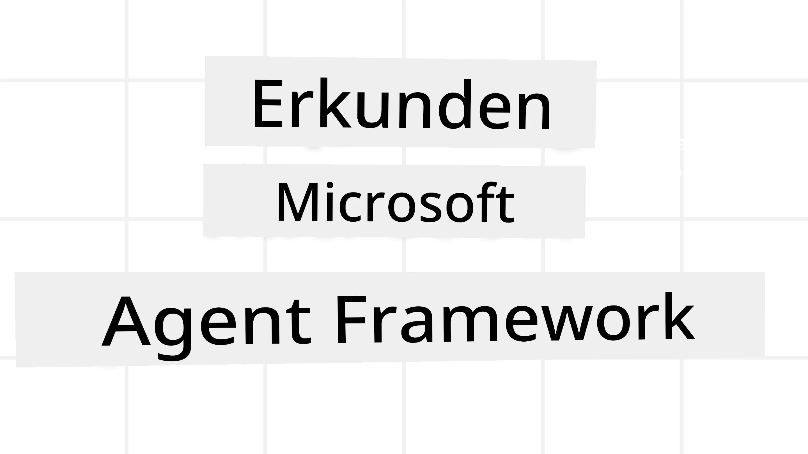
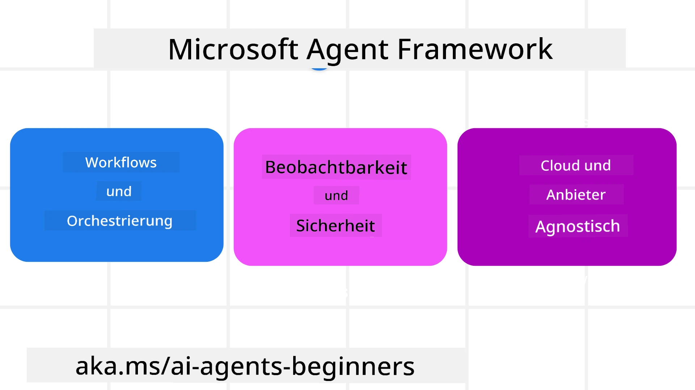
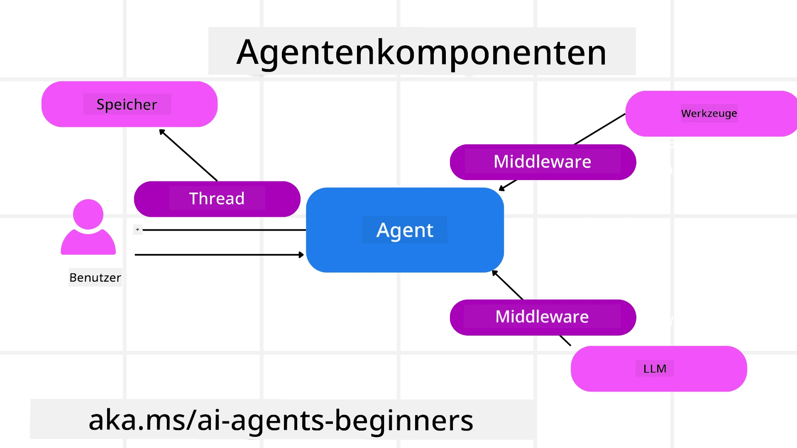

# Erkundung des Microsoft Agent Framework



### Einführung

Diese Lektion behandelt:

- Verständnis des Microsoft Agent Framework: Hauptmerkmale und Nutzen  
- Erkundung der Schlüsselkonzepte des Microsoft Agent Framework
- Fortgeschrittene MAF-Muster: Workflows, Middleware und Speicher

## Lernziele

Nach Abschluss dieser Lektion wissen Sie, wie man:

- Produktionsreife KI-Agenten mit Microsoft Agent Framework erstellt
- Die Kernmerkmale des Microsoft Agent Framework auf Ihre agentischen Anwendungsfälle anwendet
- Fortgeschrittene Muster wie Workflows, Middleware und Beobachtbarkeit verwendet

## Codebeispiele 

Codebeispiele für [Microsoft Agent Framework (MAF)](https://learn.microsoft.com/en-us/agent-framework/overview/?wt.mc_id=youtube_26688_organicsocial_reactor&pivots=programming-language-python) finden Sie im Repository unter den Dateien `xx-python-agent-framework` und `xx-dotnet-agent-framework`.

## Verständnis des Microsoft Agent Framework



[Microsoft Agent Framework (MAF)](https://learn.microsoft.com/en-us/agent-framework/overview/?wt.mc_id=youtube_26688_organicsocial_reactor&pivots=programming-language-python) ist Microsofts einheitliches Framework zur Erstellung von KI-Agenten. Es bietet die Flexibilität, eine Vielzahl agentischer Anwendungsfälle in Produktions- und Forschungsumgebungen abzudecken, darunter:

- **Sequentielle Agenten-Orchestrierung** in Szenarien, in denen schrittweise Workflows benötigt werden.
- **Gleichzeitige Orchestrierung** in Szenarien, in denen Agenten Aufgaben gleichzeitig erledigen müssen.
- **Gruppenchat-Orchestrierung** in Szenarien, in denen Agenten zusammen an einer Aufgabe arbeiten.
- **Übergabe-Orchestrierung** in Szenarien, in denen Agenten Aufgaben untereinander übergeben, sobald Teilaufgaben erledigt sind.
- **Magnetische Orchestrierung** in Szenarien, in denen ein Manager-Agent eine Aufgabenliste erstellt und modifiziert sowie die Koordination der Unteragenten zur Aufgabenerfüllung steuert.

Um KI-Agenten produktiv bereitzustellen, bietet MAF zudem Funktionen für:

- **Beobachtbarkeit** durch den Einsatz von OpenTelemetry, bei der jede Aktion des KI-Agenten einschließlich Werkzeugaufruf, Orchestrierungsschritte, Reasoning-Flows und Leistungsüberwachung über Microsoft Foundry-Dashboards erfasst wird.
- **Sicherheit** durch das Hosten von Agenten nativ auf Microsoft Foundry, das Sicherheitskontrollen wie rollenbasierte Zugriffssteuerung, Handhabung privater Daten und integrierte Inhaltsicherheit umfasst.
- **Robustheit** da Agenten-Threads und Workflows pausieren, fortsetzen und fehlerbezogen wiederherstellen können, was längere Prozesse ermöglicht.
- **Kontrolle** da menschliche Eingriffe unterstützt werden und Aufgaben als menschliche Genehmigung erforderlich markiert werden können.

Microsoft Agent Framework legt zudem Wert auf Interoperabilität durch:

- **Cloud-Agnostik** - Agenten können in Containern, On-Premise und über mehrere Clouds hinweg laufen.
- **Provider-Agnostik** - Agenten können mit Ihrem bevorzugten SDK erstellt werden, einschließlich Azure OpenAI und OpenAI.
- **Integration offener Standards** - Agenten können Protokolle wie Agent-to-Agent (A2A) und Model Context Protocol (MCP) nutzen, um andere Agenten und Werkzeuge zu entdecken und zu verwenden.
- **Plugins und Connectors** - Verbindungen zu Daten- und Speicherdiensten wie Microsoft Fabric, SharePoint, Pinecone und Qdrant sind möglich.

Sehen wir uns an, wie diese Funktionen auf einige der Kernkonzepte von Microsoft Agent Framework angewendet werden.

## Schlüsselkonzepte des Microsoft Agent Framework

### Agents



**Erstellung von Agenten**

Die Erstellung eines Agents erfolgt durch die Definition des Inferenzdienstes (LLM-Anbieter),  
eines Satzes von Anweisungen, denen der KI-Agent folgen soll, sowie eines zugewiesenen `name`:

```python
agent = AzureOpenAIChatClient(credential=AzureCliCredential()).create_agent( instructions="You are good at recommending trips to customers based on their preferences.", name="TripRecommender" )
```

Oben wird `Azure OpenAI` verwendet, aber Agenten können mit einer Vielzahl von Diensten erstellt werden, darunter `Microsoft Foundry Agent Service`:

```python
AzureAIAgentClient(async_credential=credential).create_agent( name="HelperAgent", instructions="You are a helpful assistant." ) as agent
```

OpenAI `Responses`, `ChatCompletion` APIs

```python
agent = OpenAIResponsesClient().create_agent( name="WeatherBot", instructions="You are a helpful weather assistant.", )
```

```python
agent = OpenAIChatClient().create_agent( name="HelpfulAssistant", instructions="You are a helpful assistant.", )
```

oder [MiniMax](https://platform.minimaxi.com/), das eine OpenAI-kompatible API mit großen Kontextfenstern (bis zu 204K Tokens) bereitstellt:

```python
agent = OpenAIChatClient(base_url="https://api.minimax.io/v1", api_key=os.environ["MINIMAX_API_KEY"], model_id="MiniMax-M3").create_agent( name="HelpfulAssistant", instructions="You are a helpful assistant.", )
```

oder entfernte Agenten unter Verwendung des A2A-Protokolls:

```python
agent = A2AAgent( name=agent_card.name, description=agent_card.description, agent_card=agent_card, url="https://your-a2a-agent-host" )
```

**Ausführen von Agenten**

Agenten werden mit den Methoden `.run` oder `.run_stream` für nicht-streamende oder streamende Antworten ausgeführt.

```python
result = await agent.run("What are good places to visit in Amsterdam?")
print(result.text)
```

```python
async for update in agent.run_stream("What are the good places to visit in Amsterdam?"):
    if update.text:
        print(update.text, end="", flush=True)

```

Jeder Agentenlauf kann auch Optionen zur Anpassung von Parametern haben, wie z. B. `max_tokens`, die vom Agenten verwendet werden, `tools`, die der Agent aufrufen kann, und sogar das `model` selbst, das für den Agenten verwendet wird.

Dies ist nützlich, wenn bestimmte Modelle oder Werkzeuge zur Erfüllung einer Benutzeraufgabe benötigt werden.

**Werkzeuge**

Werkzeuge können sowohl bei der Definition des Agenten festgelegt werden:

```python
def get_attractions( location: Annotated[str, Field(description="The location to get the top tourist attractions for")], ) -> str: """Get the top tourist attractions for a given location.""" return f"The top attractions for {location} are." 


# Beim direkten Erstellen eines ChatAgent

agent = ChatAgent( chat_client=OpenAIChatClient(), instructions="You are a helpful assistant", tools=[get_attractions]

```

als auch beim Ausführen des Agenten:

```python

result1 = await agent.run( "What's the best place to visit in Seattle?", tools=[get_attractions] # Werkzeug nur für diesen Lauf bereitgestellt )
```

**Agenten-Threads**

Agenten-Threads dienen der Handhabung von Mehr-Runden-Gesprächen. Threads können entweder durch:

- Verwendung von `get_new_thread()`, wodurch der Thread über die Zeit gespeichert werden kann
- Automatische Erstellung eines Threads beim Ausführen eines Agenten, wobei der Thread nur während des aktuellen Laufs besteht

erstellt werden.

```python
# Erstelle einen neuen Thread.
thread = agent.get_new_thread() # Führe den Agenten mit dem Thread aus.
response = await agent.run("Hello, I am here to help you book travel. Where would you like to go?", thread=thread)

```

Der Thread kann dann serialisiert werden, um ihn später zu speichern:

```python
# Erstellen Sie einen neuen Thread.
thread = agent.get_new_thread() 

# Führen Sie den Agenten mit dem Thread aus.

response = await agent.run("Hello, how are you?", thread=thread) 

# Serialisieren Sie den Thread für die Speicherung.

serialized_thread = await thread.serialize() 

# Deserialisieren Sie den Thread-Zustand nach dem Laden aus dem Speicher.

resumed_thread = await agent.deserialize_thread(serialized_thread)
```

**Agenten-Middleware**

Agenten interagieren mit Werkzeugen und LLMs zur Erledigung der Benutzeraufgaben. In bestimmten Szenarien möchten wir Aktionen zwischen diesen Interaktionen ausführen oder verfolgen. Agenten-Middleware ermöglicht dies durch:

*Funktions-Middleware*

Diese Middleware erlaubt es, eine Aktion zwischen dem Agenten und einer Funktion/einem Werkzeug auszuführen, das aufgerufen wird. Ein Beispiel dafür ist, wenn man Protokollierung bei Funktionsaufrufen durchführen möchte.

Im folgenden Code definiert `next`, ob die nächste Middleware oder die eigentliche Funktion aufgerufen wird.

```python
async def logging_function_middleware(
    context: FunctionInvocationContext,
    next: Callable[[FunctionInvocationContext], Awaitable[None]],
) -> None:
    """Function middleware that logs function execution."""
    # Vorverarbeitung: Protokollierung vor der Funktionsausführung
    print(f"[Function] Calling {context.function.name}")

    # Weiter zur nächsten Middleware oder Funktionsausführung
    await next(context)

    # Nachbearbeitung: Protokollierung nach der Funktionsausführung
    print(f"[Function] {context.function.name} completed")
```

*Chat-Middleware*

Diese Middleware ermöglicht das Ausführen oder Protokollieren einer Aktion zwischen dem Agenten und den Anfragen an das LLM.

Diese enthält wichtige Informationen wie die `messages`, die an den KI-Dienst gesendet werden.

```python
async def logging_chat_middleware(
    context: ChatContext,
    next: Callable[[ChatContext], Awaitable[None]],
) -> None:
    """Chat middleware that logs AI interactions."""
    # Vorverarbeitung: Loggen vor dem KI-Aufruf
    print(f"[Chat] Sending {len(context.messages)} messages to AI")

    # Weiter zum nächsten Middleware- oder KI-Dienst
    await next(context)

    # Nachbearbeitung: Loggen nach der KI-Antwort
    print("[Chat] AI response received")

```

**Agenten-Speicher**

Wie in der Lektion `Agentic Memory` behandelt, ist Speicher ein wichtiges Element, um dem Agenten das Arbeiten über verschiedene Kontexte hinweg zu ermöglichen. MAF bietet verschiedene Arten von Speicher:

*In-Memory-Speicher*

Dies ist der Speicher, der in Threads während der Anwendungslaufzeit gespeichert wird.

```python
# Erstelle einen neuen Thread.
thread = agent.get_new_thread() # Führe den Agenten mit dem Thread aus.
response = await agent.run("Hello, I am here to help you book travel. Where would you like to go?", thread=thread)
```

*Persistente Nachrichten*

Dieser Speicher wird verwendet, um den Gesprächsverlauf über verschiedene Sitzungen hinweg zu speichern. Er wird über `chat_message_store_factory` definiert:

```python
from agent_framework import ChatMessageStore

# Erstellen Sie einen benutzerdefinierten Nachrichtenspeicher
def create_message_store():
    return ChatMessageStore()

agent = ChatAgent(
    chat_client=OpenAIChatClient(),
    instructions="You are a Travel assistant.",
    chat_message_store_factory=create_message_store
)

```

*Dynamischer Speicher*

Dieser Speicher wird dem Kontext hinzugefügt, bevor Agenten ausgeführt werden. Diese Speicher können in externen Diensten wie mem0 abgelegt werden:

```python
from agent_framework.mem0 import Mem0Provider

# Mem0 für erweiterte Speicherfunktionen verwenden
memory_provider = Mem0Provider(
    api_key="your-mem0-api-key",
    user_id="user_123",
    application_id="my_app"
)

agent = ChatAgent(
    chat_client=OpenAIChatClient(),
    instructions="You are a helpful assistant with memory.",
    context_providers=memory_provider
)

```

**Agenten-Beobachtbarkeit**

Beobachtbarkeit ist wichtig, um zuverlässige und wartbare agentische Systeme zu bauen. MAF integriert sich mit OpenTelemetry, um Traces und Metriken für bessere Beobachtbarkeit bereitzustellen.

```python
from agent_framework.observability import get_tracer, get_meter

tracer = get_tracer()
meter = get_meter()
with tracer.start_as_current_span("my_custom_span"):
    # etwas tun
    pass
counter = meter.create_counter("my_custom_counter")
counter.add(1, {"key": "value"})
```

### Workflows

MAF bietet Workflows an, die vordefinierte Schritte zur Erledigung einer Aufgabe sind und KI-Agenten als Komponenten in diesen Schritten enthalten.

Workflows bestehen aus verschiedenen Komponenten, die einen besseren Kontrollfluss ermöglichen. Workflows erlauben auch **Multi-Agenten-Orchestrierung** und **Checkpointing**, um Workflowszustände zu speichern.

Die Kernkomponenten eines Workflows sind:

**Executor**

Executor empfangen Eingabenachrichten, führen ihre zugewiesenen Aufgaben aus und produzieren dann eine Ausgabenachricht. So wird der Workflow vorangetrieben, um die größere Aufgabe zu erfüllen. Executor können entweder KI-Agenten oder benutzerdefinierte Logik sein.

**Edges**

Edges definieren den Nachrichtenfluss innerhalb eines Workflows. Diese können sein:

*Direkte Edges* - Einfache Eins-zu-Eins-Verbindungen zwischen Executor:

```python
from agent_framework import WorkflowBuilder

builder = WorkflowBuilder()
builder.add_edge(source_executor, target_executor)
builder.set_start_executor(source_executor)
workflow = builder.build()
```

*Bedingte Edges* - Aktiviert, wenn eine bestimmte Bedingung erfüllt ist. Zum Beispiel, wenn Hotelzimmer nicht verfügbar sind, kann ein Executor Alternativen vorschlagen.

*Switch-Case-Edges* - Leiten Nachrichten basierend auf definierten Bedingungen an verschiedene Executor weiter. Beispielsweise, wenn ein Reisekunde Prioritätszugang hat, werden seine Aufgaben über einen anderen Workflow abgewickelt.

*Fan-Out-Edges* - Senden eine Nachricht an mehrere Ziele.

*Fan-In-Edges* - Sammeln mehrere Nachrichten von verschiedenen Executorn und senden diese an ein Ziel.

**Events**

Zur besseren Beobachtbarkeit von Workflows bietet MAF eingebaute Events für die Ausführung an, darunter:

- `WorkflowStartedEvent`  - Beginn der Workflow-Ausführung
- `WorkflowOutputEvent` - Workflow erzeugt eine Ausgabe
- `WorkflowErrorEvent` - Workflow tritt ein Fehler auf
- `ExecutorInvokeEvent`  - Executor startet die Verarbeitung
- `ExecutorCompleteEvent`  - Executor beendet die Verarbeitung
- `RequestInfoEvent` - Eine Anfrage wird ausgegeben

## Fortgeschrittene MAF-Muster

Die oben genannten Abschnitte behandeln die Schlüsselkategorien des Microsoft Agent Framework. Beim Erstellen komplexerer Agenten gibt es folgende fortgeschrittene Muster zu berücksichtigen:

- **Middleware-Komposition**: Verketten Sie mehrere Middleware-Handler (Protokollierung, Authentifizierung, Ratenbegrenzung) mit Funktions- und Chat-Middleware für eine feinkörnige Steuerung des Agentenverhaltens.
- **Workflow-Checkpointing**: Verwenden Sie Workflow-Events und Serialisierung, um langlaufende Agentenprozesse zu speichern und fortzusetzen.
- **Dynamische Werkzeugauswahl**: Kombinieren Sie RAG über Werkzeugbeschreibungen mit MAFs Werkzeugregistrierung, um nur relevante Werkzeuge pro Abfrage anzubieten.
- **Multi-Agenten-Übergabe**: Verwenden Sie Workflow-Kanten und bedingte Weiterleitung, um Übergaben zwischen spezialisierten Agenten zu orchestrieren.

## Hosting von LangChain / LangGraph-Agenten auf Microsoft Foundry

Microsoft Agent Framework ist **framework-kompatibel** — Sie sind nicht auf mit MAF geschriebene Agenten beschränkt. Wenn Sie bereits einen Agenten mit **LangChain** oder **LangGraph** gebaut haben, können Sie ihn als **Hosted Agent auf Microsoft Foundry** ausführen, sodass Foundry die Laufzeit, Sitzungen, Skalierung, Identität und Protokoll-Endpunkte verwaltet, während Ihre Agentenlogik in LangGraph bleibt.

Dies wird mit dem Paket `langchain_azure_ai.agents.hosting` realisiert, das einen kompilierten LangGraph-Graphen über dieselben Protokolle bereitstellt, die von Foundry Hosted Agents verwendet werden.

**1. Installieren Sie das Hosting-Extra:**

```bash
pip install -U "langchain-azure-ai[hosting]>=1.2.4" azure-identity
```

Das `hosting`-Extra installiert die Foundry-Protokollbibliotheken: `azure-ai-agentserver-responses` (den OpenAI-kompatiblen `/responses`-Endpunkt) und `azure-ai-agentserver-invocations` (den generischen `/invocations`-Endpunkt).

**2. Wählen Sie ein Hosting-Protokoll:**

| Protokoll | Host-Klasse | Endpunkt | Verwendungszweck |
|----------|-------------|-----------|-----------------|
| **Responses** | `ResponsesHostServer` | `/responses` | Sie möchten OpenAI-kompatiblen Chat, Streaming, Antworthistorie und Konversations-Threading – die empfohlene Standardwahl für Konversationsagenten. |
| **Invocations** | `InvocationsHostServer` | `/invocations` | Sie benötigen eine benutzerdefinierte JSON-Struktur, einen Webhook-ähnlichen Endpunkt oder nicht-konversationelle Verarbeitung. |

Da die **Responses API die primäre API für agentenartige Entwicklung in Foundry ist**, beginnen Sie bei den meisten Agenten mit `ResponsesHostServer`.

**3. Konfigurieren Sie Umgebungsvariablen** (`az login` zuerst, damit `DefaultAzureCredential` sich authentifizieren kann):

```bash
export FOUNDRY_PROJECT_ENDPOINT="https://<resource>.services.ai.azure.com/api/projects/<project>"
export FOUNDRY_MODEL_NAME="gpt-5-mini"
```

Wenn der Agent später als gehosteter Agent in Foundry ausgeführt wird, injiziert die Plattform automatisch `FOUNDRY_PROJECT_ENDPOINT`.

**4. Stellen Sie einen LangGraph-Agenten über das Responses-Protokoll bereit:**

```python
import os

from azure.ai.projects import AIProjectClient
from azure.identity import DefaultAzureCredential, get_bearer_token_provider
from langchain.agents import create_agent
from langchain_openai import ChatOpenAI
from langchain_azure_ai.agents.hosting import ResponsesHostServer

_AZURE_AI_SCOPE = "https://ai.azure.com/.default"


def build_chat_model() -> ChatOpenAI:
    project_endpoint = os.environ["FOUNDRY_PROJECT_ENDPOINT"].rstrip("/")
    deployment = os.environ.get("FOUNDRY_MODEL_NAME", "gpt-5-mini")
    credential = DefaultAzureCredential()
    project = AIProjectClient(endpoint=project_endpoint, credential=credential)
    openai_client = project.get_openai_client()
    token_provider = get_bearer_token_provider(credential, _AZURE_AI_SCOPE)

    # ChatOpenAI richtet sich hier an den OpenAI-kompatiblen (Responses) Endpunkt des Foundry-Projekts.
    return ChatOpenAI(
        model=deployment,
        base_url=str(openai_client.base_url),
        api_key=token_provider,
    )


def main() -> None:
    graph = create_agent(build_chat_model(), tools=[])
    port = int(os.environ.get("PORT", "8088"))
    ResponsesHostServer(graph).run(port=port)


if __name__ == "__main__":
    main()
```

Führen Sie ihn lokal mit `python main.py` aus, und senden Sie dann eine Responses-Anfrage an `http://localhost:8088/responses`.

**Wichtige Verhaltensweisen:**

- **Konversationen**: Clients führen eine Konversation fort, indem sie `previous_response_id` oder eine `conversation`-ID übergeben. Wenn Ihr Graph mit einem LangGraph-Checkpoint kompiliert wurde, speichert Foundry den Konversationszustand am Checkpoint (verwenden Sie im Produktivbetrieb einen langlebigen Checkpoint; `MemorySaver` ist gut für lokale Tests).
- **Mensch-in-der-Schleife**: Wenn Ihr Graph LangGraph `interrupt()` verwendet, zeigt `ResponsesHostServer` das ausstehende Unterbrechen als ein Responses `function_call` / `mcp_approval_request`-Element an, und Clients setzen mit einem passenden `function_call_output` / `mcp_approval_response` fort.
- **Bereitstellung auf Foundry**: Verwenden Sie die Azure Developer CLI — `azd ext install azure.ai.agents`, `azd ai agent init -m <manifest>`, `azd ai agent run` (lokal, erfordert Docker), dann `azd provision` und `azd deploy`. Für die Bereitstellung gehosteter Agenten ist die Rolle **Foundry Project Manager** erforderlich.

Eine ausführbare Version dieses Beispiels finden Sie unter [code-samples/14-langchain-hosted-agent.py](../../../14-microsoft-agent-framework/code-samples/14-langchain-hosted-agent.py). Für die vollständige Anleitung (Invocations-Protokoll, benutzerdefinierte Anfrageschemas und Fehlerbehebung) siehe [Host LangGraph agents as Foundry hosted agents](https://learn.microsoft.com/azure/foundry/how-to/develop/langchain-hosted-agents).

## Codebeispiele 

Codebeispiele für Microsoft Agent Framework finden Sie im Repository unter den Dateien `xx-python-agent-framework` und `xx-dotnet-agent-framework`.

## Haben Sie weitere Fragen zum Microsoft Agent Framework?

Treten Sie dem [Microsoft Foundry Discord](https://discord.com/invite/ATgtXmAS5D) bei, um andere Lernende zu treffen, an Sprechstunden teilzunehmen und Ihre Fragen zu KI-Agenten beantworten zu lassen.
## Vorherige Lektion

[Speicher für KI-Agenten](../13-agent-memory/README.md)

## Nächste Lektion

[Erstellung von Computer-Use-Agenten (CUA)](../15-browser-use/README.md)

---

<!-- CO-OP TRANSLATOR DISCLAIMER START -->
**Haftungsausschluss**:
Dieses Dokument wurde mit dem KI-Übersetzungsdienst [Co-op Translator](https://github.com/Azure/co-op-translator) übersetzt. Obwohl wir uns um Genauigkeit bemühen, beachten Sie bitte, dass automatisierte Übersetzungen Fehler oder Ungenauigkeiten enthalten können. Das Originaldokument in seiner Ursprungssprache gilt als maßgebliche Quelle. Bei kritischen Informationen wird eine professionelle menschliche Übersetzung empfohlen. Wir übernehmen keine Haftung für Missverständnisse oder Fehlinterpretationen, die aus der Verwendung dieser Übersetzung entstehen.
<!-- CO-OP TRANSLATOR DISCLAIMER END -->