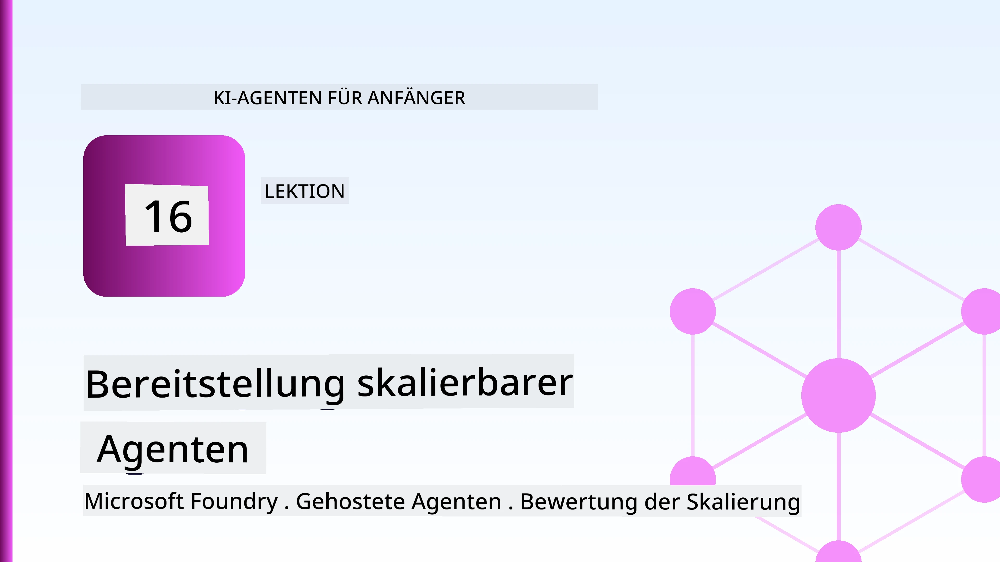
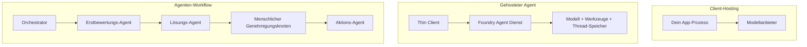
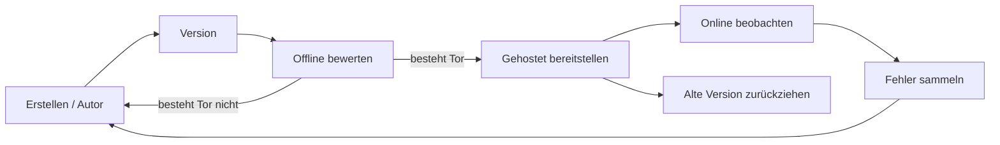
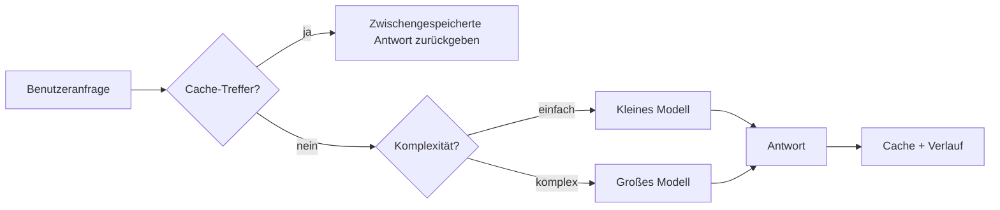
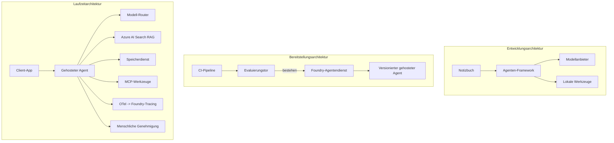

# Bereitstellung skalierbarer Agenten mit Microsoft Foundry



Bis zu diesem Punkt im Kurs haben Sie Agenten erstellt, die auf Ihrem Laptop, innerhalb eines Notebooks, gesteuert durch `az login` und einige Umgebungsvariablen, laufen. Das ist genau der richtige Weg, um zu lernen. Es ist nicht der richtige Weg, einen Agenten zu betreiben, von dem Tausende Kunden um 3 Uhr morgens abhängig sind.

Diese Lektion behandelt die Lücke zwischen „es funktioniert auf meinem Rechner“ und „es funktioniert zuverlässig und kostengünstig in der Produktion“. Wir schließen diese Lücke mithilfe von **Microsoft Foundry** und dem **Microsoft Foundry Agent Service**, indem wir einen echten Kundendienstagenten mit Werkzeugen, Abruf, Speicher, Bewertung und Überwachung bauen.

## Einführung

Diese Lektion behandelt:

- Den Unterschied zwischen einem **Prototyp-Agenten** und einem **bereitgestellten Agenten** und warum der Übergang hauptsächlich alles *um* das Modell herum betrifft.
- **Bereitstellungsmuster** für Agenten: client-hosted, service-hosted (Hosted Agents) und workflow-orchestrated.
- Den **Agentenlebenszyklus** auf Microsoft Foundry – erstellen, versionieren, bereitstellen, bewerten, überwachen, ausmustern.
- **Skalierungsstrategien**: Modell-Routing, Caching, Gleichzeitigkeit und zustandsloses Design.
- **Beobachtbarkeit** mit OpenTelemetry und Foundry-Tracing.
- **Kostenoptimierung** durch Modellauswahl, Routing und Bewertungsschleusen.
- **Enterprise-Überlegungen**: Governance, menschliche Genehmigung und sicherer Betrieb von MCP-Servern in der Produktion.

## Lernziele

Nach Abschluss dieser Lektion wissen Sie, wie man:

- Das richtige Bereitstellungsmuster für eine gegebene Agentenarbeitslast auswählt.
- Einen Agenten im Microsoft Foundry Agent Service so bereitstellt, dass er versioniert, verwaltet und beobachtbar ist.
- Einen Agenten für Tracing instrumentiert und eine Bewertungspipeline einrichtet, die vor jeder Veröffentlichung läuft.
- Modell-Routing und Caching anwendet, um Latenz und Kosten im Maßstab unter Kontrolle zu halten.
- Ein menschliches Freigabetor für risikoreiche Aktionen hinzufügt und einen MCP-Server produktionssicher integriert.

## Voraussetzungen

Diese Lektion setzt voraus, dass Sie die vorherigen Lektionen abgeschlossen haben und vertraut sind mit:

- Aufbau von Agenten mit dem [Microsoft Agent Framework](../14-microsoft-agent-framework/README.md) (Lektion 14).
- [Werkzeugnutzung](../04-tool-use/README.md) (Lektion 4) und [Agentic RAG](../05-agentic-rag/README.md) (Lektion 5).
- [Agent Memory](../13-agent-memory/README.md) (Lektion 13) und [Agentic Protocols / MCP](../11-agentic-protocols/README.md) (Lektion 11).
- [Beobachtbarkeit und Bewertung](../10-ai-agents-production/README.md) (Lektion 10) – diese Lektion baut direkt darauf auf.

Sie benötigen außerdem:

- Ein **Azure-Abonnement** und ein **Microsoft Foundry-Projekt** mit mindestens einem bereitgestellten Chatmodell.
- Die **Azure CLI** authentifiziert (`az login`).
- Python 3.12+ und die Pakete aus dem Repository [`requirements.txt`](../../../requirements.txt).

## Vom Prototyp zur Produktion: Was sich tatsächlich ändert

Ein Prototyp-Agent und ein Produktionsagent teilen die gleiche Hauptschleife – denken, Werkzeuge aufrufen, antworten. Was sich ändert, ist alles um diese Schleife herum. Das Modell macht vielleicht 20 % eines Produktionsagenten aus; die anderen 80 % sind das operative Gerüst.

| Anliegen | Prototyp | Produktion |
| --- | --- | --- |
| **Hosting** | Läuft in Ihrem Notebook | Läuft als gehosteter Dienst, versioniert und ausgerollt |
| **Identität** | Ihr `az login` Token | Verwaltete Identität mit begrenzter RBAC |
| **Status** | Im Arbeitsspeicher, geht beim Neustart verloren | Extern gespeichert (Thread Store, Speicher-Service) |
| **Fehler** | Sie sehen die Fehlerverfolgung | Wiederholungen, Fallbacks, Dead-Letter, Alarme |
| **Kosten** | "Das sind ein paar Cent" | Pro Anfrage getrackt, geroutet, gecacht, budgetiert |
| **Qualität** | Sie beurteilen die Ausgabe | Automatisch vor jeder Veröffentlichung bewertet |
| **Vertrauen** | Sie genehmigen jede Aktion | Richtlinie + Mensch in der Schleife für risikoreiche Aktionen |

Behalten Sie diese Tabelle im Kopf. Jeder Abschnitt unten entspricht einer dieser Zeilen.

## Agent Bereitstellungsmuster

Es gibt drei Muster, die Sie oft in Kombination verwenden werden.

### 1. Client-gehostete Agenten

Das Agent-Objekt lebt im Prozess *Ihrer* Anwendung. Ihr Code ruft den Modellanbieter direkt auf; die Denksschleife läuft in Ihrem Dienst. Das ist, was jede vorherige Lektion gemacht hat.

- **Verwenden Sie es, wenn** Sie volle Kontrolle über die Schleife, benutzerdefinierte Middleware benötigen oder den Agenten in ein bestehendes Backend einbetten.
- **Kompro­miss**: Sie sind selbst für Skalierung, Status und Resilienz verantwortlich.

### 2. Gehostete Agenten (Foundry Agent Service)

Der Agent ist *als Ressource registriert* in Microsoft Foundry. Foundry hostet die Denksschleife, speichert Threads, erzwingt Inhaltsicherheit und RBAC und macht den Agenten im Foundry-Portal sichtbar. Ihre App wird zum Thin Client, der Threads erstellt und Antworten liest.

- **Verwenden Sie es, wenn** Sie Haltbarkeit, eingebaute Beobachtbarkeit, Governance und weniger Betriebsaufwand wünschen.
- **Kompro­miss**: Weniger Low-Level-Kontrolle im Austausch für eine verwaltete Laufzeitumgebung.

### 3. Agenten-Workflows

Mehrere Agenten (und Werkzeuge) werden zu einem Graph mit explizitem Kontrollfluss zusammengesetzt – sequentielle Schritte, Verzweigungen, Knoten mit menschlicher Genehmigung und langlebige Checkpoints, die pausieren und fortsetzen können. Dies ist die Microsoft Agent Framework **Workflows**-Funktion auf Bereitstellungsskala angewandt.

- **Verwenden Sie es, wenn** eine einzelne Aufgabe mehrere spezialisierte Agenten umfasst oder einen Genehmigungsschritt in der Mitte benötigt.
- **Kompro­miss**: Mehr bewegliche Teile; benötigt Orchestrierungs-Ebene Beobachtbarkeit.



## Der Agentenlebenszyklus auf Microsoft Foundry

Einen Agenten zu deployen ist kein einmaliger `push`. Es ist eine Schleife und sieht stark aus wie ein Software-Release-Zyklus, weil es genau das ist.



Die Kernidee, übernommen aus [Lektion 10](../10-ai-agents-production/README.md): **Offline-Bewertung ist ein Tor, kein Nachgedanke.** Eine neue Agentenversion wird nicht veröffentlicht, wenn sie Ihre Bewertungsgrenzen nicht erfüllt. Online-Beobachtbarkeit speist dann reale Fehler zurück in Ihren Offline-Testdatensatz. Das ist die ganze Schleife.

## Skalierungsstrategien

Die Skalierung eines Agenten unterscheidet sich von der Skalierung einer zustandslosen Web-API, da jede Anfrage mehrere teure Modell- und Werkzeugaufrufe auslösen kann. Vier Techniken tragen die Hauptlast.

**Zustandslose Anfrageverarbeitung.** Speichern Sie keinen pro Benutzer gespeicherten Status im Prozessspeicher. Speichern Sie Gesprächsthreads im Foundry Thread Store oder einem Speicher-Service, sodass jede Instanz jede Anfrage bearbeiten kann. Das ermöglicht horizontale Skalierung – Instanzen hinzufügen, keine Sticky Sessions.

**Modell-Routing.** Nicht jede Anfrage benötigt Ihr leistungsstärkstes (und teuerstes) Modell. Routen Sie einfache Anfragen – Intent-Klassifikation, kurze faktische Antworten – an ein kleines, schnelles Modell und reservieren Sie das große Modell für echtes Denken. Foundrys **Model Router** kann das für Sie übernehmen, oder Sie implementieren selbst einen leichten Klassifikator. Sie bauen die DIY-Version im Labor.

**Antwort-Caching.** Viele Supportanfragen sind fast identisch („Wie setze ich mein Passwort zurück?“). Antworten auf häufige Fragen zwischenspeichern und ohne Modellabruf ausliefern. Schon eine mäßige Cache-Trefferquote reduziert Kosten und Latenz spürbar.

**Gleichzeitigkeit und Rückdruck.** Modellanbieter haben Ratenbegrenzungen. Begrenzen Sie Ihre Gleichzeitigkeit, verwenden Sie Wiederholungen mit exponentiellem Backoff und fallen Sie elegant aus (eine wartende „Wir kümmern uns darum“ Antwort ist besser als ein 500er).



## Beobachtbarkeit in der Produktion

Sie können nur das betreiben, was Sie sehen können. Wie in Lektion 10 behandelt, gibt das Microsoft Agent Framework **OpenTelemetry**-Traces nativ aus – jeder Modellaufruf, Werkzeugaufruf und Orchestrierungsschritt wird zu einem Span. In der Produktion exportieren Sie diese Spans zu Microsoft Foundry (oder einem beliebigen OTel-kompatiblen Backend), damit Sie:

- Eine einzelne Kundenbeschwerde über jeden Modell- und Werkzeugaufruf hinweg nachverfolgen können.
- P50/P95 Latenz und Kosten pro Anfrage im Zeitverlauf überwachen.
- Auf Fehlerquotenspitzen und Kostenanomalien alarmieren können, bevor Ihre Nutzer (oder Ihr Finanzteam) sie bemerken.

```python
from agent_framework.observability import get_tracer

tracer = get_tracer()

with tracer.start_as_current_span("support_request") as span:
    span.set_attribute("customer.tier", "enterprise")
    span.set_attribute("routed.model", "gpt-5-nano")
    # Die Ausführung des Agenten wird automatisch innerhalb dieses Bereichs verfolgt
```

Attribute wie `customer.tier` und `routed.model` verwandeln eine Wand von Traces in beantwortbare Fragen ("Werden Unternehmenskunden zu oft zum kleinen Modell geleitet?").

## Kostenoptimierung

Kosten bei Produktionsagenten werden von Tokens dominiert. Drei Hebel, nach Wirkung geordnet:

1. **Modell passend dimensionieren.** Ein kleines Modell, das Ihr Bewertungstor besteht, ist fast immer günstiger als ein großes Modell, das ebenfalls besteht. Nutzen Sie die Bewertung, um zu *beweisen*, dass das kleine Modell gut genug ist, statt vorsichtshalber das größte Modell zu nehmen.
2. **Routing nach Komplexität.** Wie oben – nur für Anfragen, die große Modellkapazitäten benötigen, zahlen Sie den Preis für das große Modell.
3. **Aggressiv cachen.** Der günstigste Modellaufruf ist der, den Sie nie durchführen.

Bewertungs-Gates und Kostenkontrolle sind dieselbe Disziplin aus zwei Perspektiven: Bewertung zeigt Ihnen den *Qualitätsboden*, Routing und Caching halten die *Kosten* so nahe wie möglich an diesem Boden.

## Enterprise-Bereitstellungsüberlegungen

**Governance.** Gehostete Agenten erben Foundrys RBAC, Inhaltsicherheit und Audit-Logging. Geben Sie jedem Agenten eine verwaltete Identität mit den geringsten Privilegien, die er benötigt – Nur-Lese-Zugriff auf die Wissensdatenbank, eingeschränkter Zugriff auf die Ticket-API, sonst nichts.

**Mensch in der Schleife.** Einige Aktionen sind zu folgenreich, um sie vollständig zu automatisieren – Rückerstattung ausstellen, Konto löschen, an ein Rechtsteam eskalieren. Das Microsoft Agent Framework unterstützt **genehmigungspflichtige** Werkzeuge: Der Agent schlägt die Aktion vor, die Ausführung pausiert, ein Mensch genehmigt oder lehnt ab, und der Workflow wird fortgesetzt. Sie haben die Primitive in [Lektion 6](../06-building-trustworthy-agents/README.md) gesehen; hier stellen Sie sie bereit.

**MCP in der Produktion.** [MCP](../11-agentic-protocols/README.md) lässt Ihren Agenten externe Werkzeuge über eine Standard-Schnittstelle konsumieren. In der Produktion behandeln Sie jeden MCP-Server als unzuverlässige Grenze: fixieren Sie die Server-Version, führen Sie ihn mit einer eingeschränkten Identität aus, validieren Sie seine Ausgaben und geben Sie ihm niemals Geheimnisse preis. Ein MCP-Server ist eine Abhängigkeit, und Abhängigkeiten werden gepatcht, auditiert und ratenbegrenzt.



Diese drei Diagramme – Entwicklung, Bereitstellung, Laufzeit – sind derselbe Agent in drei Phasen seines Lebens. Das folgende Labor führt Sie durch den Aufbau.

## Praktisches Labor: Ein Produktionsreifer Kundensupport-Agent

Öffnen Sie [`code_samples/16-python-agent-framework.ipynb`](./code_samples/16-python-agent-framework.ipynb) und arbeiten Sie es von Anfang bis Ende durch. Sie bauen einen **Contoso-Kundensupport-Agenten** zusammen, bei dem jede Produktionsanforderung verdrahtet ist:

1. **Werkzeugaufrufe** – Bestellstatus abrufen und Support-Tickets eröffnen.
2. **RAG** – Antworten auf Richtlinienfragen aus einer Wissensdatenbank (Azure AI Search, mit einem In-Memory-Fallback, sodass das Notebook auch ohne Search-Ressource läuft).
3. **Speicher** – Erinnern des Kunden über Gesprächsrunden hinweg.
4. **Modell-Routing** – ein Komplexitätsklassifikator leitet jede Anfrage an ein kleines oder großes Modell weiter.
5. **Antwort-Caching** – Wiederholte Fragen werden aus dem Cache bedient.
6. **Menschliche Freigabe** – Rückerstattungen über einem Schwellenwert pausieren zur menschlichen Abzeichnung.
7. **Bewertungspipeline** – ein kleiner Offline-Testdatensatz bewertet den Agenten und agiert als Freigabetor.
8. **Beobachtbarkeit** – OpenTelemetry-Tracing rund um jede Anfrage.

### Durchgang

Das Notebook ist so organisiert, dass jede Produktionsanforderung eine eigenständige, ausführbare Sektion ist. Das Herzstück ist der kombinierten Routing-und-Caching-Anfragehandler:

```python
async def handle_support_request(query: str, customer_id: str) -> str:
    # 1. Von Cache aus liefern, wann immer möglich.
    cached = response_cache.get(normalize(query))
    if cached:
        return cached

    # 2. Nach Komplexität routen, um Kosten zu kontrollieren.
    model = "gpt-5-nano" if is_simple(query) else "gpt-5-mini"

    # 3. Den Agenten innerhalb eines Trace-Spans zur Beobachtbarkeit ausführen.
    with tracer.start_as_current_span("support_request") as span:
        span.set_attribute("routed.model", model)
        span.set_attribute("customer.id", customer_id)
        response = await support_agent.run(query, model=model)

    # 4. Zwischenspeichern und zurückgeben.
    response_cache.set(normalize(query), response.text)
    return response.text
```

Das Bewertungstor, das eine Veröffentlichung absichert, sieht so aus:

```python
async def evaluation_gate(agent, test_cases, threshold: float = 0.8) -> bool:
    passed = 0
    for case in test_cases:
        result = await agent.run(case["input"])
        if score_response(result.text, case["expected"]) >= 0.8:
            passed += 1
    pass_rate = passed / len(test_cases)
    print(f"Evaluation pass rate: {pass_rate:.0%} (gate: {threshold:.0%})")
    return pass_rate >= threshold  # Nur bereitstellen, wenn das Tor besteht
```

Lesen Sie jede Zeile – das Notebook hält die Primitiven bewusst klein, sodass nichts hinter einem Framework-Aufruf verborgen ist.

## Validierung eines bereitgestellten Agenten mit Smoke Tests

Das obige Bewertungstor läuft *offline* gegen Ihr Agentenobjekt. Sobald der Agent als Hosted Agent bereitgestellt ist, benötigen Sie noch eine weitere, noch günstigere Prüfung: **Antwortet der bereitgestellte Endpunkt tatsächlich?**

„Erfolgreich“ zu deployen beweist nur, dass die Steuerungsebene die Definition angenommen hat – es beweist nicht, dass der Agent antwortet. Eine fehlende Abhängigkeit, ein fehlerhaftes Modell-Routing oder eine abgelaufene Verbindung können eine grüne Bereitstellung liefern, die nichts zurückgibt. Ein **Smoke-Test** erkennt das innerhalb von Sekunden, bei jedem Deployment, ohne die Kosten einer vollständigen Bewertung.

Dieses Repository liefert eine einsatzbereite Smoke-Test-Pipeline, die auf der [AI Smoke Test](https://github.com/marketplace/actions/ai-smoke-test) GitHub Action basiert:

- **Katalog** — [`tests/lesson-16-smoke-tests.json`](../../../tests/lesson-16-smoke-tests.json) enthält Prompts und Assertions für den Contoso-Support-Agenten (fundierte Richtlinienantworten, eine Bestellabfrage, Thema einhalten und Mehrfachgesprächskontinuität). Kataloge für andere Lektionen liegen daneben – siehe [`tests/README.md`](../tests/README.md).
- **Workflow** — [`.github/workflows/smoke-test.yml`](../../../.github/workflows/smoke-test.yml) meldet sich mit Azure OIDC an und POSTet jede Eingabe an den Responses-Endpunkt des Agenten, wobei der Job bei einer falschen Assertion fehlschlägt.

```yaml
- name: Smoke-test hosted agent
  uses: JFolberth/ai-smoketest@v1
  with:
    project_endpoint: ${{ inputs.project_endpoint }}
    agent_name: ContosoSupportAgent
    tests_file: tests/lesson-16-smoke-tests.json
```


Führen Sie es im **Actions**-Tab aus, sobald Ihr Agent bereitgestellt ist, und geben Sie Ihren Foundry-Projektendpunkt sowie den Agentennamen an. Die föderierte Identität benötigt die **Azure AI User**-Rolle im Foundry-Projektumfang. Betrachten Sie die Schichten als Pyramide: Smoke-Tests (erreichbar und antwortet?) laufen bei jeder Bereitstellung, Offline-Bewertungen (gut genug zum Ausliefern?) laufen vor der Freigabe, und Online-Bewertungen (wie schlägt es sich im Einsatz?) laufen kontinuierlich.

## Wissenscheck

Prüfen Sie Ihr Verständnis, bevor Sie mit der Aufgabe weitermachen.

**1. Wie viel eines Produktionsagenten macht ungefähr "das Modell" aus, und was ist der Rest?**

<details>
<summary>Antwort</summary>

Das Modell ist eine Minderheit des Systems – meist wird etwa 20 % genannt. Der Rest ist das operative Gerüst: Hosting und Versionierung, Identität und RBAC, ausgelagerter Status, Fehlermanagement, Kostenverfolgung, Bewertung und menschliche Kontrollmechanismen. Der Übergang zur Produktion besteht hauptsächlich darin, alles *um* die Reasoning-Schleife herum aufzubauen.
</details>

**2. Wann würden Sie einen Hosted Agent einem client-gehosteten Agenten vorziehen?**

<details>
<summary>Antwort</summary>

Wenn Sie eine verwaltete Laufzeit mit eingebauter Haltbarkeit (Threads, die erhalten bleiben und Resume-fähig sind), Beobachtbarkeit, Inhaltsicherheit und RBAC möchten und bereit sind, etwas niedrige Kontrolle über die Reasoning-Schleife gegen eine geringere operative Oberfläche einzutauschen. Client-gehostet ist vorzuziehen, wenn Sie volle Kontrolle über die Schleife benötigen oder den Agenten in ein bestehendes Backend einbetten.
</details>

**3. Warum muss ein skalierbarer Agent im eigenen Prozessspeicher zustandslos sein?**

<details>
<summary>Antwort</summary>

Damit jede Instanz jede Anfrage bearbeiten kann, was horizontale Skalierung ohne Sticky Sessions ermöglicht. Benutzerbezogener Konversationsstatus wird in einem Thread Store oder Memory Service ausgelagert. Wäre der Status im Prozessspeicher, ginge er bei einem Neustart verloren und die Lastverteilung wäre eingeschränkt.
</details>

**4. Welches Problem löst Model-Routing, und wie steht es im Zusammenhang mit der Bewertung?**

<details>
<summary>Antwort</summary>

Routing leitet einfache Anfragen an ein kleines, günstiges, schnelles Modell, reserviert das große Modell für echte Reasoning-Aufgaben und steuert so sowohl Latenz als auch Kosten. Es steht in Verbindung mit der Bewertung, weil die Bewertung *beweist*, dass das kleine Modell für eine Klasse von Anfragen ausreichend gut ist – Routing ohne Bewertung ist geraten.
</details>

**5. Was ist ein "Evaluation Gate" und wo befindet es sich im Lebenszyklus?**

<details>
<summary>Antwort</summary>

Ein Evaluation Gate führt einen Offline-Testlauf gegen eine neue Agentenversion durch und blockiert die Bereitstellung, wenn die Erfolgsrate nicht einen Schwellenwert überschreitet. Es liegt zwischen „Version“ und „Deployment“ im Lebenszyklus und macht Qualität zur Voraussetzung für die Veröffentlichung statt zu einer Kontrolle nach dem Ausliefern.
</details>

**6. Warum sollte ein MCP-Server in der Produktion als unzuverlässige Grenze behandelt werden?**

<details>
<summary>Antwort</summary>

Weil er eine externe Abhängigkeit ist, auf die Ihr Agent zugreift. Sie sollten seine Version fixieren, mit einer eingeschränkten Identität ausführen, dessen Ausgaben validieren, Rate-Limiting verwenden und niemals Geheimnisse offenbaren – dieselben Vorsichtsmaßnahmen wie bei jeder Drittanbieterabhängigkeit. Seine Ausgaben fließen in das Reasoning Ihres Agenten ein, daher wäre blindes Vertrauen ein Sicherheitsrisiko.
</details>

**7. Welche Änderung hat üblicherweise den größten Einfluss auf die Produktionskosten eines Agenten und warum?**

<details>
<summary>Antwort</summary>

Die richtige Dimensionierung des Modells – das kleinste Modell zu verwenden, das das Evaluation Gate besteht. Kosten werden hauptsächlich durch Tokens bestimmt, und ein kleineres Modell, das die Qualitätsanforderung erfüllt, ist in der Regel günstiger als ein größeres. Caching und Routing reduzieren Kosten weiter, aber die Wahl des richtigen Basismodells hat den größten unmittelbaren Effekt.
</details>

**8. Welche Rolle spielen Span-Attribute wie `customer.tier` und `routed.model` in der Beobachtbarkeit?**

<details>
<summary>Antwort</summary>

Sie verwandeln rohe Traces in beantwortbare Geschäftsfragen. Ohne Attribute hat man eine Wand von Spans; mit ihnen kann man fragen: „Werden Unternehmenskunden zu oft zum kleinen Modell geroutet?“ oder „Welches Modell verarbeitet unsere langsamsten Anfragen?“ Attribute sind der Weg, Telemetrie nach den Dimensionen zu segmentieren, die für den Betrieb wichtig sind.
</details>

## Aufgabe

Nehmen Sie den Kundensupport-Agenten aus dem Labor und härten Sie ihn für ein konkretes Szenario ab: **ein Abrechnungsunterstützungsagent für ein SaaS-Unternehmen.**

Ihre Abgabe sollte:

1. **Die Werkzeuge ersetzen** durch abrechnungsrelevante: `get_subscription_status`, `get_invoice` und `issue_credit` (Gutschriften über 50 $ erfordern menschliche Genehmigung).
2. **Drei RAG-Dokumente hinzufügen**, die die Rückerstattungsrichtlinie, den Abrechnungszyklus und die Kündigungsbedingungen des Unternehmens abdecken.
3. **Den Evaluationssatz auf mindestens acht Fälle erweitern**, davon mindestens zwei, die *den menschlichen Genehmigungspfad auslösen sollten*, und prüfen, ob das Evaluation Gate richtig besteht oder fehlschlägt.
4. **Einen Kostenbericht hinzufügen**: Nach zehn gemischten Anfragen an den Agenten ausgeben, wie viele Anfragen an das kleine Modell, wie viele an das große Modell und wie viele aus dem Cache bedient wurden.

Schreiben Sie einen kurzen Absatz (in einer Markdown-Zelle), der erklärt, welche Model-Routing-Regel Sie gewählt haben und wie Sie diese mit echtem Verkehr validieren würden. Es gibt keine einzige richtige Antwort – bewertet wird, ob die Produktionsbedenken kohärent verknüpft sind.

## Zusammenfassung

In dieser Lektion haben Sie einen Agenten mithilfe von Microsoft Foundry vom Prototypen in die Produktion überführt:

- Der Sprung in die Produktion dreht sich hauptsächlich um das **operative Gerüst** rund um das Modell – Hosting, Identität, Status, Fehlermanagement, Kosten, Qualität und Vertrauen.
- Sie haben die drei **Bereitstellungsmuster** kennengelernt – client-gehostet, Hosted Agents und Agent Workflows – und wann welches passt.
- Sie sind den **Agent-Lebenszyklus** durchlaufen, wobei Offline-**Bewertung als Release-Gate** fungiert und Online-Beobachtbarkeit Fehler in den Testsatz zurückspielt.
- Sie haben **Skalierungsstrategien** angewendet – zustandsloses Design, Model-Routing, Caching und begrenzte Parallelität – und diese mit **Kostenoptimierung** verbunden.
- Sie haben **Enterprise Controls** eingebunden: RBAC, menschliche Genehmigung und produktionssichere MCP-Integration.
- Sie haben einen **produktionsbereiten Kundensupport-Agenten** entwickelt, der all diese Aspekte in ausführbaren Code zusammenführt.

Die nächste Lektion geht den umgekehrten Weg: Statt Agenten in die Cloud zu skalieren, bringen Sie sie *herunter* auf eine einzelne Entwickler-Maschine und lassen sie vollständig lokal laufen.

## Zusätzliche Ressourcen

- <a href="https://learn.microsoft.com/azure/ai-foundry/what-is-azure-ai-foundry" target="_blank">Microsoft Foundry-Dokumentation</a>
- <a href="https://learn.microsoft.com/azure/ai-foundry/agents/overview" target="_blank">Überblick über den Microsoft Foundry Agent Service</a>
- <a href="https://learn.microsoft.com/en-us/agent-framework/overview/?wt.mc_id=youtube_26688_organicsocial_reactor&pivots=programming-language-python" target="_blank">Microsoft Agent Framework</a>
- <a href="https://learn.microsoft.com/azure/ai-foundry/concepts/model-router" target="_blank">Model Router in Microsoft Foundry</a>
- <a href="https://learn.microsoft.com/azure/search/search-what-is-azure-search" target="_blank">Azure AI Search</a>
- <a href="https://opentelemetry.io/" target="_blank">OpenTelemetry</a>
- <a href="https://github.com/marketplace/actions/ai-smoke-test" target="_blank">AI Smoke Test GitHub Action</a>
- <a href="https://modelcontextprotocol.io/" target="_blank">Model Context Protocol (MCP)</a>

## Vorherige Lektion

[Building Computer Use Agents (CUA)](../15-browser-use/README.md)

## Nächste Lektion

[Creating Local AI Agents](../17-creating-local-ai-agents/README.md)

---

<!-- CO-OP TRANSLATOR DISCLAIMER START -->
**Haftungsausschluss**:
Dieses Dokument wurde mit dem KI-Übersetzungsdienst [Co-op Translator](https://github.com/Azure/co-op-translator) übersetzt. Obwohl wir uns um Genauigkeit bemühen, beachten Sie bitte, dass automatisierte Übersetzungen Fehler oder Ungenauigkeiten enthalten können. Das Originaldokument in seiner Ursprungssprache gilt als maßgebliche Quelle. Bei kritischen Informationen wird eine professionelle menschliche Übersetzung empfohlen. Wir übernehmen keine Haftung für Missverständnisse oder Fehlinterpretationen, die aus der Verwendung dieser Übersetzung entstehen.
<!-- CO-OP TRANSLATOR DISCLAIMER END -->