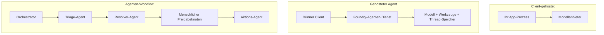
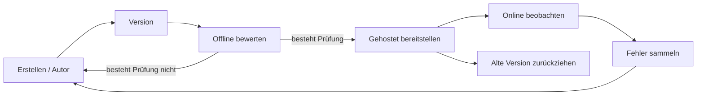
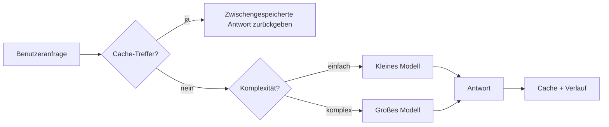
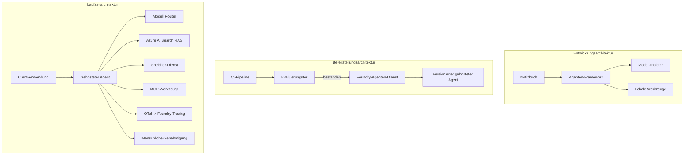

# Skalierbare Agenten mit Microsoft Foundry bereitstellen


Bis zu diesem Punkt im Kurs haben Sie Agenten gebaut, die auf Ihrem Laptop laufen, innerhalb eines Notebooks, gesteuert durch `az login` und eine Handvoll Umgebungsvariablen. Das ist genau der richtige Weg, um zu lernen. Es ist nicht der richtige Weg, einen Agenten zu betreiben, auf den Tausende von Kunden um 3 Uhr morgens angewiesen sind.

Diese Lektion handelt von der Lücke zwischen „es funktioniert auf meinem Rechner“ und „es funktioniert zuverlässig und erschwinglich in der Produktion“. Wir schließen diese Lücke mit **Microsoft Foundry** und dem **Microsoft Foundry Agent Service**, und wir tun dies, indem wir einen echten Kundensupport-Agenten bauen, der Werkzeuge, Retrieval, Gedächtnis, Bewertung und Überwachung enthält.

## Einführung

Diese Lektion behandelt:

- Den Unterschied zwischen einem **Prototyp-Agenten** und einem **bereitgestellten Agenten** und warum der Übergang vor allem alles *um* das Modell herum betrifft.
- **Bereitstellungsmuster** für Agenten: client-gehostet, service-gehostet (Hosted Agents) und workflow-orchestriert.
- Den **Agenten-Lebenszyklus** auf Microsoft Foundry — erstellen, versionieren, bereitstellen, bewerten, beobachten, außer Dienst stellen.
- **Skalierungsstrategien**: Modell-Routing, Caching, Parallelität und zustandsloses Design.
- **Beobachtbarkeit** mit OpenTelemetry und Foundry-Tracing.
- **Kostenoptimierung** durch Modellauswahl, Routing und Bewertungs-Gates.
- **Unternehmensüberlegungen**: Governance, menschliche Genehmigung und das sichere Betreiben von MCP-Servern in der Produktion.

## Lernziele

Nach Abschluss dieser Lektion wissen Sie, wie Sie:

- Das richtige Bereitstellungsmuster für eine bestimmte Agentenlast wählen.
- Einen Agenten im Microsoft Foundry Agent Service bereitstellen, sodass er versioniert, verwaltet und beobachtbar ist.
- Einen Agenten für das Tracing instrumentieren und eine Bewertungspipeline vor jedem Release einrichten.
- Modell-Routing und Caching anwenden, um Latenz und Kosten bei Skalierung in Schach zu halten.
- Ein Genehmigungsgate für menschliches Eingreifen bei risikoreichen Aktionen hinzufügen und einen MCP-Server produktionstauglich integrieren.

## Voraussetzungen

Diese Lektion setzt voraus, dass Sie die vorherigen Lektionen abgeschlossen haben und sich wohlfühlen mit:

- Der Erstellung von Agenten mit dem [Microsoft Agent Framework](../14-microsoft-agent-framework/README.md) (Lektion 14).
- [Werkzeugnutzung](../04-tool-use/README.md) (Lektion 4) und [Agentic RAG](../05-agentic-rag/README.md) (Lektion 5).
- [Agent Memory](../13-agent-memory/README.md) (Lektion 13) und [Agentic Protocols / MCP](../11-agentic-protocols/README.md) (Lektion 11).
- [Beobachtbarkeit und Bewertung](../10-ai-agents-production/README.md) (Lektion 10) — diese Lektion baut direkt darauf auf.

Sie benötigen außerdem:

- Ein **Azure-Abonnement** und ein **Microsoft Foundry-Projekt** mit mindestens einem bereitgestellten Chat-Modell.
- Die **Azure CLI** authentifiziert (`az login`).
- Python 3.12+ und die Pakete im Repository [`requirements.txt`](../../../requirements.txt).

## Vom Prototyp zur Produktion: Was sich wirklich ändert

Ein Prototyp-Agent und ein Produktions-Agent teilen sich denselben Kernzyklus — denken, Werkzeuge aufrufen, antworten. Was sich ändert, ist alles, was diesen Zyklus umgibt. Das Modell macht vielleicht 20 % eines Produktionsagenten aus; die anderen 80 % sind das operationale Grundgerüst.

| Aspekt | Prototyp | Produktion |
| --- | --- | --- |
| **Hosting** | Läuft in deinem Notebook | Läuft als gehosteter Dienst, versioniert und ausgerollt |
| **Identität** | Dein `az login` Token | Verwaltete Identität mit eingeschränktem RBAC |
| **Status** | Im Speicher, bei Neustart verloren | Externalisiert (Thread-Store, Memory-Service) |
| **Fehler** | Siehst das Traceback | Wiederholungen, Fallbacks, Dead Letter, Alarme |
| **Kosten** | „Es sind ein paar Cent“ | Pro Anfrage erfasst, geroutet, gecached, budgetiert |
| **Qualität** | Du prüfst die Ausgabe visuell | Automatisch vor jedem Release bewertet |
| **Vertrauen** | Du genehmigst jede Aktion | Richtlinie + Mensch im Loop bei risikoreichen Aktionen |

Behalten Sie diese Tabelle im Kopf. Jede der folgenden Abschnitte ordnet sich einer dieser Zeilen zu.

## Agent-Bereitstellungsmuster

Es gibt drei Muster, die Sie verwenden werden, oft in Kombination.

### 1. Client-gehostete Agenten

Das Agentenobjekt lebt innerhalb *deines* Anwendungsprozesses. Dein Code ruft den Modellanbieter direkt auf; die Denk-Schleife läuft in deinem Dienst. Das ist, was jede vorherige Lektion gemacht hat.

- **Verwende es, wenn** du volle Kontrolle über die Schleife, individuelle Middleware benötigst oder den Agenten in ein bestehendes Backend einbettest.
- **Abwägung**: Du bist selbst für Skalierung, Status und Ausfallsicherheit verantwortlich.

### 2. Gehostete Agenten (Foundry Agent Service)

Der Agent ist *als Ressource registriert* in Microsoft Foundry. Foundry hostet die Denk-Schleife, speichert Threads, erzwingt Inhaltssicherheit und RBAC und macht den Agenten im Foundry-Portal sichtbar. Deine App wird zu einem schlanken Client, der Threads erstellt und Antworten liest.

- **Verwende es, wenn** du Haltbarkeit, eingebaute Beobachtbarkeit, Governance und weniger operativen Aufwand möchtest.
- **Abwägung**: Weniger niedrigstufige Kontrolle im Austausch für eine verwaltete Laufzeit.

### 3. Agent-Workflows

Mehrere Agenten (und Werkzeuge) werden zu einem Graph mit explizitem Kontrollfluss zusammengesetzt — sequentielle Schritte, Verzweigungen, menschliche Genehmigungsknoten und dauerhafte Checkpoints, die pausieren und fortsetzen können. Dies ist die Microsoft Agent Framework **Workflows** Fähigkeit, angewendet auf Bereitstellungsebene.

- **Verwende es, wenn** eine einzelne Aufgabe mehrere spezialisierte Agenten umfasst oder einen Genehmigungsschritt in der Mitte benötigt.
- **Abwägung**: Mehr bewegliche Teile; benötigt Beobachtbarkeit auf Orchestrierungsebene.



## Der Agenten-Lebenszyklus bei Microsoft Foundry

Einen Agenten bereitzustellen ist kein einmaliges `push`. Es ist eine Schleife und sieht stark aus wie ein Software-Release-Zyklus, weil es genau das ist.



Die Kernidee, übernommen aus [Lektion 10](../10-ai-agents-production/README.md): **Offline-Bewertung ist ein Tor, kein Nachgedanke.** Eine neue Agenten-Version wird nicht ausgeliefert, wenn sie deine Bewertungsgrenzen nicht besteht. Online-Beobachtbarkeit speist dann reale Fehler zurück in dein offline Testset. Das ist die ganze Schleife.

## Skalierungsstrategien

Die Skalierung eines Agenten unterscheidet sich von der Skalierung einer zustandslosen Web-API, weil jede Anfrage mehrere teure Modell- und Werkzeugaufrufe auslösen kann. Vier Techniken tragen den Großteil der Last.

**Zustandslose Anfrageverarbeitung.** Halte keinen Zustand pro Benutzer im Prozessspeicher. Speichere Gesprächsfäden im Foundry Thread-Store oder einem Memory-Service, sodass jede Instanz jede Anfrage bearbeiten kann. Das erlaubt horizontale Skalierung – Instanzen hinzufügen, keine Sticky Sessions.

**Modell-Routing.** Nicht jede Anfrage benötigt dein leistungsfähigstes (und teuerstes) Modell. Leite einfache Anfragen — Intentklassifizierung, kurze faktische Antworten — an ein kleines, schnelles Modell und reserviere das große Modell für echte Schlussfolgerungen. Foundrys **Model Router** kann das für dich übernehmen, oder du kannst selbst einen leichten Klassifikator bauen. Du wirst die DIY-Version im Labor erstellen.

**Antwort-Caching.** Viele Supportanfragen sind fast Duplikate („Wie setze ich mein Passwort zurück?“). Cache Antworten auf häufige Fragen und liefere sie ohne Modellaufruf. Schon eine mäßige Cache-Quote senkt Kosten und Latenz spürbar.

**Parallelität und Rückdruck.** Modellanbieter haben Ratenbegrenzungen. Begrenze deine Parallelität, verwende Wiederholungen mit exponentiellem Backoff, und versage elegant (eine wartende „Wir sind dran“-Antwort schlägt einen 500-Fehler).



## Beobachtbarkeit in Produktion

Du kannst nicht steuern, was du nicht siehst. Wie in Lektion 10 behandelt, erzeugt das Microsoft Agent Framework nativ **OpenTelemetry**-Traces — jeder Modellaufruf, Werkzeugaufruf und Orchestrierungsschritt wird zu einem Span. In der Produktion exportierst du diese Spans zu Microsoft Foundry (oder einem beliebigen OTel-kompatiblen Backend), damit du:

- Eine einzelne Kundenbeschwerde Ende-zu-Ende über alle Modell- und Werkzeugaufrufe nachverfolgen kannst.
- p50/p95 Latenz und Kosten pro Anfrage über die Zeit beobachten kannst.
- Bei Fehlerquotenspitzen und Kostenanomalien alarmiert wirst, bevor deine Nutzer (oder dein Finanzteam) es bemerken.

```python
from agent_framework.observability import get_tracer

tracer = get_tracer()

with tracer.start_as_current_span("support_request") as span:
    span.set_attribute("customer.tier", "enterprise")
    span.set_attribute("routed.model", "gpt-5-nano")
    # Die Agentenausführung wird innerhalb dieses Bereichs automatisch verfolgt
```

Attribute wie `customer.tier` und `routed.model` verwandeln eine Flut von Traces in beantwortbare Fragen („Werden Unternehmenskunden zu oft an das kleine Modell weitergeleitet?“).

## Kostenoptimierung

Die Kosten bei Produktionsagenten werden von Token dominiert. Drei Hebel, sortiert nach Wirkung:

1. **Modell passend dimensionieren.** Ein kleines Modell, das dein Bewertungs-Gate besteht, ist fast immer günstiger als ein großes, das ebenfalls besteht. Nutze Bewertung, um zu *beweisen*, dass das kleine Modell gut genug ist, statt vorsorglich immer das größte Modell zu verwenden.
2. **Nach Komplexität routen.** Wie oben — große Modellkosten nur für Anfragen zahlen, die große Modelllogik brauchen.
3. **Aggressiv cachen.** Der günstigste Modellaufruf ist der, den du gar nicht machst.

Bewertungs-Gates und Kostenkontrolle sind dieselbe Disziplin aus zwei Perspektiven: Bewertung bestimmt den *Qualitätsboden*, Routing und Caching halten die *Kosten* möglichst nahe an diesem Boden.

## Unternehmensaspekte bei der Bereitstellung

**Governance.** Hosted Agents übernehmen Foundrys RBAC, Inhaltssicherheit und Audit-Logging. Gib jedem Agenten eine verwaltete Identität mit den geringsten notwendigen Rechten — nur Lesezugriff auf die Wissensdatenbank, eingeschränkter Zugriff auf die Ticket-API, sonst nichts.

**Mensch im Loop.** Manche Aktionen sind zu folgenreich für volle Automatisierung — Rückerstattungen ausstellen, Accounts löschen, an eine Rechtsabteilung eskalieren. Das Microsoft Agent Framework unterstützt **genehmigungspflichtige** Werkzeuge: der Agent schlägt die Aktion vor, die Ausführung pausiert, ein Mensch genehmigt oder lehnt ab, und der Workflow wird fortgesetzt. Du hast das Primitive schon in [Lektion 6](../06-building-trustworthy-agents/README.md) gesehen; hier setzt du es produktiv ein.

**MCP in Produktion.** [MCP](../11-agentic-protocols/README.md) erlaubt deinem Agenten, externe Werkzeuge über eine standardisierte Schnittstelle zu nutzen. In der Produktion behandelst du jeden MCP-Server als unzuverlässige Grenze: fixiere die Server-Version, betreibe ihn mit eingeschränkter Identität, prüfe seine Ausgaben und gib niemals Geheimnisse preis. Ein MCP-Server ist eine Abhängigkeit, und Abhängigkeiten werden gepatcht, auditiert und ratenbegrenzt.



Diese drei Diagramme — Entwicklung, Bereitstellung, Laufzeit — zeigen denselben Agenten in drei Lebensphasen. Das folgende Labor führt dich durch den Bau.

## Praktisches Labor: Ein produktionsfähiger Kundensupport-Agent

Öffne [`code_samples/16-python-agent-framework.ipynb`](./code_samples/16-python-agent-framework.ipynb) und arbeite es komplett durch. Du wirst einen **Contoso-Kundensupport-Agenten** zusammenbauen, in den alle Produktionsaspekte integriert sind:

1. **Werkzeugaufruf** — Bestellstatus abfragen und Support-Tickets öffnen.
2. **RAG** — Richtlinienfragen aus einer Wissensdatenbank beantworten (Azure AI Search, mit einem In-Memory-Fallback, sodass das Notebook ohne Search-Ressource läuft).
3. **Gedächtnis** — den Kunden über Gesprächsverläufe hinweg erinnern.
4. **Modell-Routing** — ein Komplexitäts-Klassifikator leitet jede Anfrage an ein kleines oder großes Modell weiter.
5. **Antwort-Caching** — wiederholte Fragen werden aus dem Cache bedient.
6. **Menschliche Genehmigung** — Rückerstattungen über einer Schwelle pausieren zur menschlichen Freigabe.
7. **Bewertungspipeline** — ein kleiner Offline-Testdatensatz bewertet den Agenten und wirkt als Release-Gate.
8. **Beobachtbarkeit** — OpenTelemetry-Tracing um jede Anfrage.

### Durchgang

Das Notebook ist so gegliedert, dass jede Produktionsanforderung eine eigenständige, ausführbare Sektion ist. Das Herzstück ist der Request-Handler mit Routing plus Caching:

```python
async def handle_support_request(query: str, customer_id: str) -> str:
    # 1. Vom Cache ausliefern, wenn möglich.
    cached = response_cache.get(normalize(query))
    if cached:
        return cached

    # 2. Nach Komplexität routen, um die Kosten zu kontrollieren.
    model = "gpt-5-nano" if is_simple(query) else "gpt-5-mini"

    # 3. Den Agent innerhalb eines Trace-Spans für Beobachtbarkeit ausführen.
    with tracer.start_as_current_span("support_request") as span:
        span.set_attribute("routed.model", model)
        span.set_attribute("customer.id", customer_id)
        response = await support_agent.run(query, model=model)

    # 4. Zwischenspeichern und zurückgeben.
    response_cache.set(normalize(query), response.text)
    return response.text
```

Das Bewertungstor, das ein Release schützt, sieht so aus:

```python
async def evaluation_gate(agent, test_cases, threshold: float = 0.8) -> bool:
    passed = 0
    for case in test_cases:
        result = await agent.run(case["input"])
        if score_response(result.text, case["expected"]) >= 0.8:
            passed += 1
    pass_rate = passed / len(test_cases)
    print(f"Evaluation pass rate: {pass_rate:.0%} (gate: {threshold:.0%})")
    return pass_rate >= threshold  # Nur bereitstellen, wenn das Tor besteht
```

Lies jede Zeile — das Notebook hält die Primitives bewusst klein, damit nichts hinter einem Framework-Aufruf verborgen bleibt.

## Einen bereitgestellten Agenten mit Smoke-Tests validieren

Das oben gezeigte Bewertungstor läuft *offline* gegen dein Agentenobjekt. Sobald der Agent als Hosted Agent bereitgestellt ist, brauchst du noch eine weitere, noch günstigere Prüfung: **Antwortet der deployte Endpunkt tatsächlich?**

Eine „erfolgreiche“ Bereitstellung beweist nur, dass die Steuerungsebene die Definition akzeptiert hat — sie beweist nicht, dass der Agent antwortet. Eine fehlende Abhängigkeit, eine fehlerhafte Modellweiterleitung oder eine abgelaufene Verbindung können eine grün wirkende Bereitstellung zurücklassen, die nichts liefert. Ein **Smoke-Test** erkennt das in Sekunden, bei jedem Deployment, ohne die Kosten eines vollständigen Tests.

Dieses Repository enthält eine gebrauchsfertige Smoke-Test-Pipeline, aufgebaut auf der [AI Smoke Test](https://github.com/marketplace/actions/ai-smoke-test) GitHub Action:

- **Katalog** — [`tests/lesson-16-smoke-tests.json`](../../../tests/lesson-16-smoke-tests.json) enthält Prompts und Assertions für den Contoso-Support-Agenten (geerdete Richtlinienantworten, eine Bestell-Abfrage, Themenrelevanz und Mehrschritt-Kontinuität). Kataloge für Agenten anderer Lektionen liegen daneben — siehe [`tests/README.md`](../tests/README.md).
- **Workflow** — [`.github/workflows/smoke-test.yml`](../../../.github/workflows/smoke-test.yml) loggt sich mit Azure OIDC ein und sendet jede Eingabe an die Responses-Endpunkt des Agenten, wobei der Job bei jeder Assertion-Fehler fehlschlägt.

```yaml
- name: Smoke-test hosted agent
  uses: JFolberth/ai-smoketest@v1
  with:
    project_endpoint: ${{ inputs.project_endpoint }}
    agent_name: ContosoSupportAgent
    tests_file: tests/lesson-16-smoke-tests.json
```


Führen Sie es einmal aus dem **Actions**-Tab aus, nachdem Ihr Agent bereitgestellt wurde, und geben Sie dabei Ihren Foundry-Projekt-Endpunkt und den Agentennamen an. Die föderierte Identität benötigt die Rolle **Azure AI User** auf Foundry-Projekt-Ebene. Betrachten Sie die Schichten als Pyramide: Smoke-Tests (erreichbar und reagierend?) werden bei jeder Bereitstellung ausgeführt, Offline-Evaluation (gut genug zum Ausliefern?) läuft vor der Freigabe, und Online-Evaluation (wie schlägt es sich im Einsatz?) läuft kontinuierlich.

## Wissensüberprüfung

Prüfen Sie Ihr Verständnis, bevor Sie mit der Aufgabe fortfahren.

**1. Wie viel eines Produktionsagenten ist ungefähr "das Modell" und was ist der Rest?**

<details>
<summary>Antwort</summary>

Das Modell ist eine Minderheit des Systems – oft wird es mit rund 20 % angegeben. Der Rest ist das operative Gerüst: Hosting und Versionierung, Identität und RBAC, ausgelagerter Zustand, Fehlerbehandlung, Kostenverfolgung, Evaluation und Mensch-in-der-Schleife-Kontrollen. Der Schritt in die Produktion besteht hauptsächlich darin, alles *um* die Reasoning-Schleife herum aufzubauen.
</details>

**2. Wann würden Sie einen Hosted Agent einem client-gehosteten Agent vorziehen?**

<details>
<summary>Antwort</summary>

Wenn Sie eine verwaltete Laufzeit mit eingebauter Haltbarkeit (Threads, die bestehen bleiben und fortgesetzt werden können), Beobachtbarkeit, Inhaltsicherheit und RBAC möchten und bereit sind, etwas Feinkontrolle über die Reasoning-Schleife zugunsten einer geringeren operativen Oberfläche einzutauschen. Client-gehostet ist vorzuziehen, wenn Sie volle Kontrolle über die Schleife benötigen oder den Agenten in ein bestehendes Backend einbetten.
</details>

**3. Warum muss ein skalierbarer Agent im eigenen Prozessspeicher zustandslos sein?**

<details>
<summary>Antwort</summary>

Damit jede Instanz jede Anfrage bearbeiten kann, was horizontales Skalieren ohne Sticky Sessions ermöglicht. Der pro Benutzergesprächszustand wird in einem Thread-Store oder Speicherdienst ausgelagert. Wäre der Zustand im Prozessspeicher, würde er bei Neustart verloren gehen und die Lastverteilung wäre nicht frei möglich.
</details>

**4. Welches Problem löst das Model Routing und wie steht es in Beziehung zur Evaluation?**

<details>
<summary>Antwort</summary>

Routing schickt einfache Anfragen an ein kleines, günstiges, schnelles Modell und reserviert das große Modell für echtes Reasoning. So werden sowohl Latenz als auch Kosten kontrolliert. Es steht in Beziehung zur Evaluation, weil diese *beweist*, dass das kleine Modell für eine Klasse von Anfragen gut genug ist – Routing ohne Evaluation ist geraten.
</details>

**5. Was ist ein "Evaluation Gate" und wo befindet es sich im Lebenszyklus?**

<details>
<summary>Antwort</summary>

Ein Evaluation Gate führt eine Offline-Testreihe gegen eine neue Agentenversion aus und blockiert die Bereitstellung, wenn die Bestehensrate einen Schwellenwert nicht erreicht. Es liegt zwischen „Version“ und „Bereitstellung“ im Lebenszyklus und macht Qualität zur Voraussetzung für die Veröffentlichung, anstatt etwas, das nach dem Ausliefern überprüft wird.
</details>

**6. Warum sollte ein MCP-Server in der Produktion als nicht vertrauenswürdige Grenze behandelt werden?**

<details>
<summary>Antwort</summary>

Weil er eine externe Abhängigkeit ist, die Ihr Agent aufruft. Sie sollten seine Version fixieren, ihn mit einer scoped Identity ausführen, seine Ausgaben validieren, ihn drosseln und niemals Geheimnisse an ihn weitergeben – dieselbe Disziplin, die Sie bei jeder Drittanbieter-Abhängigkeit anwenden. Seine Ausgaben fließen in die Reasoning-Schleife Ihres Agenten ein, daher ist unvalidiertes Vertrauen ein Sicherheitsrisiko.
</details>

**7. Welche einzelne Änderung hat üblicherweise den größten Einfluss auf die Produktionskosten eines Agenten und warum?**

<details>
<summary>Antwort</summary>

Die richtige Modellgröße – die Verwendung des kleinsten Modells, das noch Ihr Evaluation Gate besteht. Die Kosten werden hauptsächlich von Tokens bestimmt, und ein kleineres Modell, das die Qualitätsanforderungen erfüllt, ist fast immer günstiger als ein größeres. Caching und Routing reduzieren die Kosten dann zusätzlich, aber die Wahl des richtigen Basismodells hat den größten primären Effekt.
</details>

**8. Welche Rolle spielen Spanattribute wie `customer.tier` und `routed.model` in der Beobachtbarkeit?**

<details>
<summary>Antwort</summary>

Sie verwandeln rohe Traces in beantwortbare Geschäftsfragen. Ohne Attribute hat man eine Wand von Spans; mit ihnen kann man fragen: „Werden Unternehmenskunden zu oft zum kleinen Modell geleitet?“ oder „Welches Modell bearbeitet unsere langsamsten Anfragen?“ Attribute sind die Dimensionen, nach denen Sie Telemetrie in Bezug auf Ihren Betrieb aufschlüsseln.
</details>

## Aufgabe

Nehmen Sie den Kunden-Support-Agenten aus dem Labor und härten Sie ihn für ein spezifisches Szenario ab: **ein Abrechnungs-Support-Agent für ein SaaS-Unternehmen.**

Ihre Einreichung soll:

1. **Die Werkzeuge ersetzen** durch abrechnungsrelevante: `get_subscription_status`, `get_invoice` und `issue_credit` (Gutschriften über 50 $ erfordern menschliche Genehmigung).
2. **Drei RAG-Dokumente hinzufügen**, welche die Rückerstattungsrichtlinie, den Abrechnungszyklus und die Stornierungsrichtlinie des Unternehmens abdecken.
3. **Den Evaluationssatz auf mindestens acht Fälle erweitern**, darunter mindestens zwei, die den menschlichen Genehmigungspfad *auslösen sollten*, und bestätigen, dass Ihr Evaluation Gate korrekt besteht oder durchfällt.
4. **Einen Kostenbericht hinzufügen**: nachdem zehn gemischte Anfragen über den Agenten gelaufen sind, ausgeben, wie viele an das kleine Modell, wie viele an das große Modell und wie viele aus dem Cache bedient wurden.

Schreiben Sie einen kurzen Absatz (in einer Markdown-Zelle), der erklärt, welche Modell-Routing-Regel Sie gewählt haben und wie Sie diese mit echtem Traffic validieren würden. Es gibt keine einzige richtige Antwort – Sie werden danach bewertet, ob die Produktionsaspekte stimmig verbunden sind.

## Zusammenfassung

In dieser Lektion haben Sie einen Agenten mit Microsoft Foundry vom Prototyp bis zur Produktion gebracht:

- Der Sprung in die Produktion dreht sich vor allem um das **operative Gerüst** um das Modell herum – Hosting, Identität, Zustand, Fehlerbehandlung, Kosten, Qualität und Vertrauen.
- Sie haben die drei **Bereitstellungsmuster** kennengelernt – client-gehostet, Hosted Agents und Agent Workflows – und wann welches passt.
- Sie sind den **Agenten-Lebenszyklus** durchlaufen, bei dem Offline-**Evaluation als Freigabetor** fungiert und Online-Beobachtbarkeit Fehler zurück in die Testmenge speist.
- Sie haben **Skalierungsstrategien** angewandt – zustandslose Gestaltung, Modellrouting, Caching und begrenzte Parallelität – und diese mit **Kostenoptimierung** verbunden.
- Sie haben **Enterprise-Kontrollen** eingebaut: RBAC, Mensch-in-der-Schleife-Genehmigung und produktionstaugliche MCP-Integration.
- Sie haben einen **produktionsreifen Kunden-Support-Agenten** gebaut, der all diese Aspekte in ausführbarem Code vereint.

Die nächste Lektion führt die entgegengesetzte Reise durch: Statt Agenten in die Cloud zu skalieren, bringen Sie sie *herunter* auf eine einzelne Entwickler-Maschine und laufen sie vollständig lokal.

## Zusätzliche Ressourcen

- <a href="https://learn.microsoft.com/azure/ai-foundry/what-is-azure-ai-foundry" target="_blank">Microsoft Foundry Dokumentation</a>
- <a href="https://learn.microsoft.com/azure/ai-foundry/agents/overview" target="_blank">Übersicht Microsoft Foundry Agent Service</a>
- <a href="https://learn.microsoft.com/en-us/agent-framework/overview/?wt.mc_id=youtube_26688_organicsocial_reactor&pivots=programming-language-python" target="_blank">Microsoft Agent Framework</a>
- <a href="https://learn.microsoft.com/azure/ai-foundry/concepts/model-router" target="_blank">Model Router in Microsoft Foundry</a>
- <a href="https://learn.microsoft.com/azure/search/search-what-is-azure-search" target="_blank">Azure AI Search</a>
- <a href="https://opentelemetry.io/" target="_blank">OpenTelemetry</a>
- <a href="https://github.com/marketplace/actions/ai-smoke-test" target="_blank">AI Smoke Test GitHub Action</a>
- <a href="https://modelcontextprotocol.io/" target="_blank">Model Context Protocol (MCP)</a>

## Vorherige Lektion

[Building Computer Use Agents (CUA)](../15-browser-use/README.md)

## Nächste Lektion

[Creating Local AI Agents](../17-creating-local-ai-agents/README.md)

---

<!-- CO-OP TRANSLATOR DISCLAIMER START -->
**Haftungsausschluss**:
Dieses Dokument wurde mit dem KI-Übersetzungsdienst [Co-op Translator](https://github.com/Azure/co-op-translator) übersetzt. Obwohl wir uns um Genauigkeit bemühen, beachten Sie bitte, dass automatisierte Übersetzungen Fehler oder Ungenauigkeiten enthalten können. Das Originaldokument in seiner Ursprungssprache gilt als maßgebliche Quelle. Bei kritischen Informationen wird eine professionelle menschliche Übersetzung empfohlen. Wir übernehmen keine Haftung für Missverständnisse oder Fehlinterpretationen, die aus der Verwendung dieser Übersetzung entstehen.
<!-- CO-OP TRANSLATOR DISCLAIMER END -->