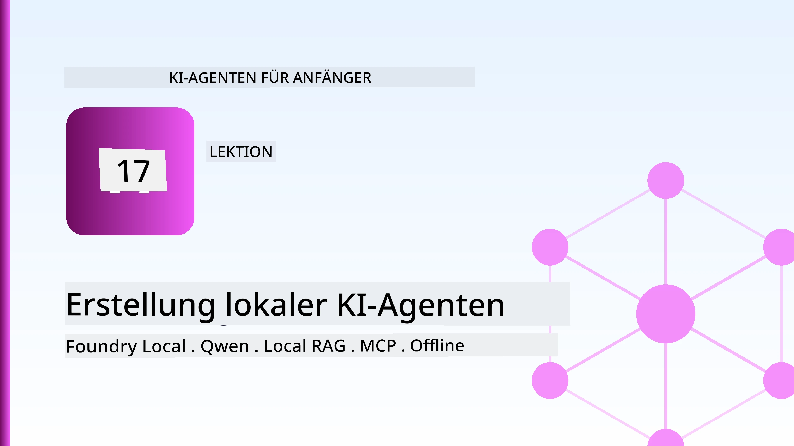
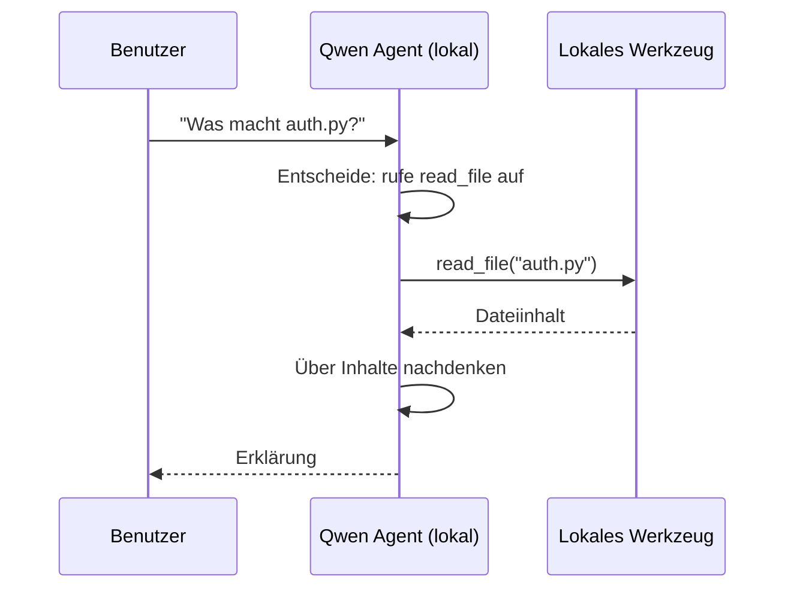
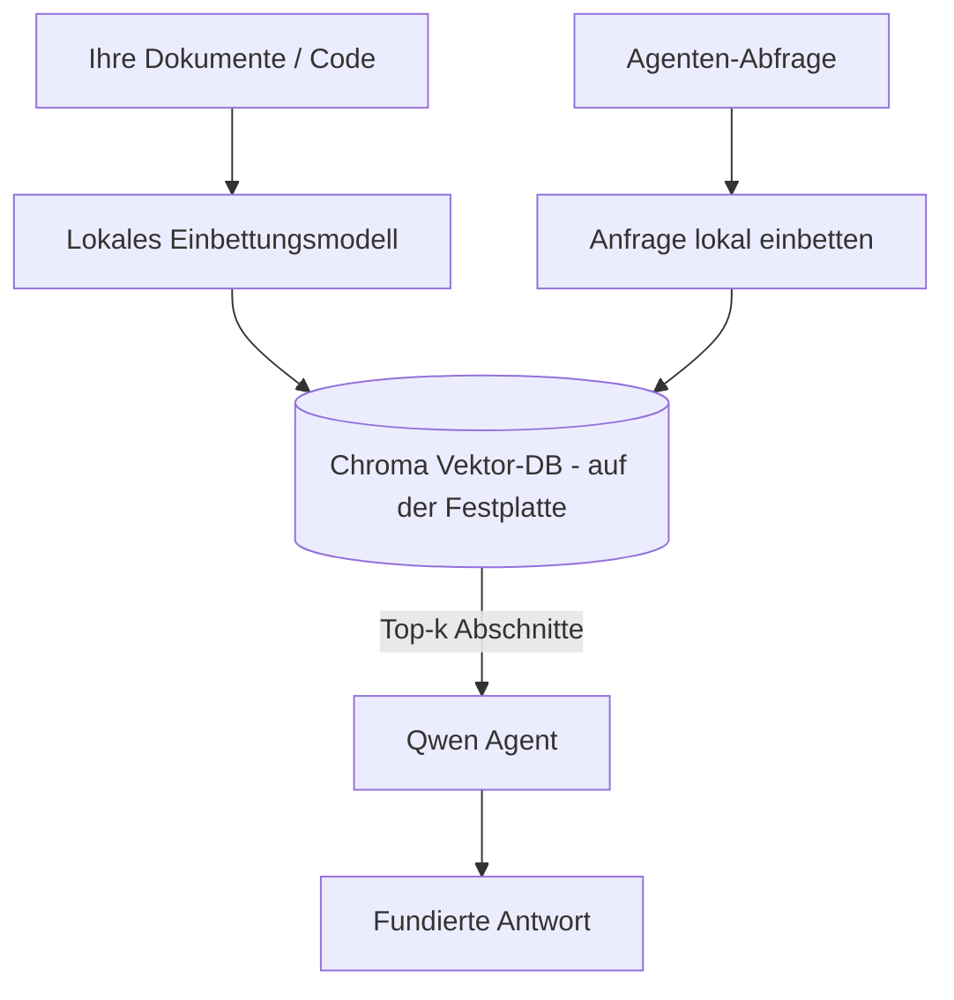

# Erstellung lokaler KI-Agenten mit Microsoft Foundry Local und Qwen



Die vorherige Lektion hat Agenten *in die Cloud* skaliert. Diese hier bringt sie *runter* auf eine einzelne Maschine. Am Ende wirst du einen funktionierenden technischen Assistenten haben, der schlussfolgert, Werkzeuge aufruft, deine Dateien liest und deine Dokumentation durchsucht — **ohne einen einzigen Cloud-Inferenzaufruf.**

Warum sollte man das wollen? Drei Gründe, die in der realen Ingenieursarbeit ständig auftauchen:

- **Privatsphäre.** Der Code und die Dokumente verlassen die Maschine niemals. Kein Prompt, kein Ausschnitt, keine Kundendaten überqueren die Netzwerkgrenze.
- **Kosten.** Lokale Inferenz verursacht keine Abrechnung pro Token. Du kannst den ganzen Tag iterieren zum Preis des Stroms.
- **Offline.** Im Flugzeug, in einer sicheren Einrichtung oder bei einem Ausfall funktioniert der Agent weiterhin.

Der Haken ist, dass du ein modernes Cloud-Modell gegen ein **Small Language Model (SLM)** eintauschst, das auf deiner CPU, GPU oder NPU läuft. Diese Lektion behandelt das Bauen von Agenten, die innerhalb dieser Einschränkung *gut* sind, anstatt so zu tun, als ob es die Einschränkung nicht gäbe.

## Einführung

Diese Lektion behandelt:

- **Small Language Models (SLMs)** — was sie sind, wo sie glänzen und wo nicht.
- **Microsoft Foundry Local** — eine Laufzeitumgebung, die Modelle auf dem Gerät über eine **OpenAI-kompatible API** herunterlädt und bereitstellt.
- **Qwen-Funktionsaufrufmodelle** — SLMs, die zuverlässig Werkzeugaufrufe erzeugen, was lokale *Agenten* (nicht nur lokalen Chat) möglich macht.
- **Lokale Werkzeuge, lokales RAG und lokale MCP** — die dem Agenten Fähigkeiten ohne Cloud geben.
- **Hybride Muster** — wann man lokal bleibt und wann man die Cloud nutzt.

## Lernziele

Nach Abschluss dieser Lektion wirst du wissen, wie man:

- Die Kompromisse von SLMs erklärt und geeignete Fälle für lokale Agenten auswählt.
- Ein Qwen-Modell lokal mit Foundry Local bereitstellt und über den OpenAI-kompatiblen Endpunkt darauf zugreift.
- Einen Werkzeugaufruf-Agenten baut, der vollständig auf deinem Arbeitsplatzrechner läuft.
- Lokales RAG über deine eigenen Dokumente mit einer lokalen Vektordatenbank (Chroma) hinzufügt.
- Den Agenten mit einem lokalen MCP-Server verbindet und über hybride lokale/Cloud-Designs nachdenkt.

## Voraussetzungen

Diese Lektion setzt voraus, dass du die vorherigen Lektionen abgeschlossen hast und vertraut bist mit:

- [Werkzeugnutzung](../04-tool-use/README.md) (Lektion 4) und [Agentic RAG](../05-agentic-rag/README.md) (Lektion 5).
- [Agentic Protocols / MCP](../11-agentic-protocols/README.md) (Lektion 11).
- Dem [Microsoft Agent Framework](../14-microsoft-agent-framework/README.md) (Lektion 14).

Du brauchst auch:

- Einen Entwicklerarbeitsplatz. **8 GB RAM sind ein realistisches Minimum**; 16 GB+ sind komfortabel. Eine GPU oder NPU hilft, ist aber nicht erforderlich.
- **Microsoft Foundry Local** installiert (siehe Setup-Abschnitt unten).
- Python 3.12+ und die Pakete aus dem Repository [`requirements.txt`](../../../requirements.txt), plus `foundry-local-sdk`, `openai` und `chromadb` für diese Lektion.

## Small Language Models: Das richtige Werkzeug für lokale Arbeit

Ein modernes Cloud-Modell hat hunderte Milliarden Parameter und ein Rechenzentrum dahinter. Ein SLM hat einige Milliarden Parameter und muss in den RAM deines Laptops passen. Dieser Unterschied setzt klare Erwartungen.

**SLMs sind gut bei:**

- Strukturierten, begrenzten Aufgaben — Klassifikation, Extraktion, Zusammenfassung eines bekannten Dokuments.
- **Werkzeugaufrufen** — entscheiden, welche Funktion mit welchen Argumenten aufgerufen wird.
- Schneller, günstiger und privater Iteration auf deinen eigenen Daten.

**SLMs sind schwächer bei:**

- Offener, mehrstufiger Schlussfolgerung über großen Kontext.
- Umfassendem Weltwissen (sie haben weniger gesehen und vergessen mehr).

Die erfolgreiche Strategie für lokale Agenten ist daher: **lass das SLM orchestrieren und die Werkzeuge die schwere Arbeit machen.** Das Modell muss deinen Code nicht *kennen* — es muss wissen, wann es `read_file` und `search_docs` aufruft. Das spielt direkt in die Stärken eines SLM.


## Microsoft Foundry Local

**Microsoft Foundry Local** ist eine schlanke Laufzeitumgebung, die Modelle vollständig auf deinem Rechner herunterlädt, verwaltet und bereitstellt. Das wichtigste Merkmal für uns ist, dass es einen **OpenAI-kompatiblen HTTP-Endpunkt** bereitstellt — was bedeutet, dass das OpenAI SDK und der OpenAI-Client des Microsoft Agent Frameworks mit nur einer Änderung der `base_url` dagegen arbeiten. Alles, was du über den Bau von Agenten gelernt hast, überträgt sich direkt; nur der Endpunkt verschiebt sich von der Cloud zu `localhost`.

Foundry Local wählt auch automatisch die beste Modellversion für deine Hardware — eine CPU-Version, eine CUDA/GPU-Version oder eine NPU-Version — so dass du nicht manuell pro Maschine optimieren musst.

### Setup

Installiere Foundry Local (siehe die [Dokumentation](https://learn.microsoft.com/azure/ai-foundry/foundry-local/) für dein Betriebssystem) und bestätige, dass es funktioniert:

```bash
# Installation (Beispiel; folgen Sie den Anweisungen für Ihre Plattform)
winget install Microsoft.FoundryLocal      # Windows
# brew install microsoft/foundrylocal/foundrylocal   # macOS

# Laden Sie ein Qwen-Modell herunter und führen Sie es aus, starten Sie dann den lokalen Dienst
foundry model run qwen2.5-7b-instruct
foundry service status
```

Sobald der Dienst läuft, hast du einen lokalen, OpenAI-kompatiblen Endpunkt (typischerweise `http://localhost:PORT/v1`). Das Notebook verwendet das `foundry-local-sdk`, um den Endpunkt automatisch zu entdecken, so dass du den Port nicht hartkodieren musst.

## Qwen-Funktionsaufruf: Warum es wichtig ist

Ein Agent ist nur ein Agent, wenn er Werkzeuge aufrufen kann. Viele SLMs können chatten, erzeugen aber unzuverlässige, fehlerhafte Werkzeugaufrufe. **Qwen**-Modelle sind für Funktionsaufrufe trainiert und liefern konsistent wohlgeformte Werkzeugaufrufstrukturen — das ist genau das, was aus einem lokalen Chatmodell einen lokalen *Agenten* macht.

Der Ablauf ist der bekannte Werkzeugaufruf-Loop, den du bereits kennst, nur lokal ausgeführt:



## Lokales RAG

Das Durchsuchen von Dokumentation ist das, worin lokale Agenten ihren Nutzen beweisen. Statt zu hoffen, dass das SLM die Docs deines Frameworks auswendig kennt, bettest du diese Docs in eine **lokale Vektordatenbank** ein und lässt den Agenten relevante Abschnitte bei Bedarf abrufen.

Wir verwenden **Chroma**, einen eingebetteten Vektor-Speicher, der im Prozess läuft und keinen separaten Server braucht. Die Pipeline ist komplett lokal: lokales Embedding-Modell → lokale Vektoren → lokale Suche → lokales SLM.



Das ist dasselbe Agentic RAG-Muster aus Lektion 5 — der einzige Unterschied ist, dass alle Komponenten auf deiner Maschine laufen.

## Lokale MCP-Server

[MCP](../11-agentic-protocols/README.md) ist ein Transportprotokoll, kein Cloud-Dienst. Ein MCP-Server kann als lokaler Prozess über `stdio` laufen und Werkzeuge deinem Agenten über das Standardprotokoll bereitstellen. So kannst du das wachsende Ökosystem an MCP-Servern — Dateisystemzugriffe, Git-Operationen, Datenbankabfragen — komplett offline wiederverwenden.

Die Sicherheitslage ist anders als in der Cloud, aber nicht nicht existent: Ein lokaler MCP-Server läuft immer mit den Benutzerrechten deines Users, also beschränke, was er erreichen kann (ein Projektordner, nicht dein ganzes Home-Verzeichnis) und behandle seine Ausgaben als Eingaben, die validiert werden müssen.

## Hybride Cloud-und-Lokal-Muster

Local-first heißt nicht local-only. Ausgereifte Systeme steuern je nach Sensitivität und Schwierigkeit:

| Situation | Wo es läuft |
| --- | --- |
| Sensibler Code / Daten oder offline | **Lokales SLM** |
| Einfache, begrenzte Aufgabe | **Lokales SLM** (günstig, schnell) |
| Schwierige mehrstufige Schlussfolgerungen bei nicht-sensiblen Daten | **Cloud-Modell** |
| Alles während eines Ausfalls | **Lokales SLM** (sanfte Degradation) |

Das spiegelt die **Modellsteuerung**-Idee aus Lektion 16 wider — außer dass jetzt eines der „Modelle“ deine eigene Maschine ist. Ein robustes Design fällt lokal zurück, wenn die Cloud nicht verfügbar ist, so dass der Agent in der Qualität abnimmt, aber nicht komplett versagt.


## Praxis-Labor: Ein Lokaler Technischer Assistent

Öffne [`code_samples/17-local-agent-foundry-local.ipynb`](./code_samples/17-local-agent-foundry-local.ipynb) und arbeite es durch. Du baust einen **lokalen technischen Assistenten**, der vollständig auf deinem Arbeitsplatzrechner läuft und kann:

1. **Werkzeuge aufrufen** — per Qwen-Funktionsaufruf über Foundry Local.
2. **Lokale Dateioperationen durchführen** — Dateien in einem Projektverzeichnis auflisten und lesen.
3. **Code analysieren** — Grundlegende Metriken zu einer Quelldatei melden.
4. **Dokumentation durchsuchen** — lokales RAG über einen Docs-Ordner mit Chroma.
5. **MCP verwenden** — Verbindung zu einem lokalen MCP-Server herstellen (mit schonendem Überspringen, falls keiner konfiguriert ist).

Zu keinem Zeitpunkt wird eine Cloud-Inferenz verwendet.

### Schritt-für-Schritt

Der Assistent verbindet sich über den OpenAI-kompatiblen Endpunkt mit Foundry Local, sodass der Agentencode fast identisch mit den Cloud-Lektionen aussieht — nur der Client ändert sich:

```python
from foundry_local import FoundryLocalManager
from openai import OpenAI

# Foundry Local entdeckt/lädt das Modell herunter und stellt uns einen lokalen Endpunkt zur Verfügung.
manager = FoundryLocalManager(\"qwen2.5-7b-instruct\")
client = OpenAI(base_url=manager.endpoint, api_key=manager.api_key)  # api_key ist ein lokaler Platzhalter
```

Die Werkzeuge sind gewöhnliche Python-Funktionen, die auf ein Projektverzeichnis beschränkt sind:

```python
def read_file(path: str) -> str:
    \"\"\"Read a file, but only inside the sandboxed project directory.\"\"\"
    full = (PROJECT_ROOT / path).resolve()
    if PROJECT_ROOT not in full.parents and full != PROJECT_ROOT:
        return \"Access denied: path is outside the project directory.\"
    return full.read_text(encoding=\"utf-8\")
```

Beachte die Sandbox-Prüfung — auch lokal ist ein Werkzeug, das beliebige Pfade liest, eine Haftung. Das Notebook beschränkt jedes Werkzeug auf eine einzelne Projektwurzel.

## Wissenskontrolle

Teste dein Verständnis, bevor du mit der Aufgabe fortfährst.

**1. Nenne zwei konkrete Gründe, einen Agenten lokal statt in der Cloud auszuführen.**

<details>
<summary>Antwort</summary>

Zwei der folgenden: **Privatsphäre** (Code und Daten verlassen die Maschine nicht), **Kosten** (keine Abrechnung pro Token) und **Offline-Fähigkeit** (funktioniert ohne Netzwerk — im Flugzeug, in einer sicheren Einrichtung oder bei Ausfall). Regulatorische/Compliance-Anforderungen, die verbieten, Daten aus dem Gerät zu senden, sind ein häufiger Treiber für den Privatsphäre-Grund.
</details>

**2. Wie lautet die empfohlene Arbeitsteilung zwischen einem SLM und seinen Werkzeugen in einem lokalen Agenten und warum?**

<details>
<summary>Antwort</summary>

Lass das SLM **orchestrieren** (entscheiden, welches Werkzeug mit welchen Argumenten aufgerufen wird) und lass die **Werkzeuge die schwere Arbeit machen** (Dateien lesen, Docs abrufen, Ergebnisse berechnen). SLMs sind stark bei begrenzten Entscheidungen wie Werkzeugauswahl, aber schwächer bei umfangreichem Wissen und langer mehrstufiger Schlussfolgerung, daher spielt die Nutzung von Werkzeugen in ihre Stärken.
</details>

**3. Was macht es möglich, Cloud-Agenten-Code mit Foundry Local wiederzuverwenden?**

<details>
<summary>Antwort</summary>

Foundry Local bietet einen **OpenAI-kompatiblen HTTP-Endpunkt**. Das OpenAI SDK und der OpenAI-Client des Agent Frameworks arbeiten dagegen mit nur geändertem `base_url` (und einem lokalen Platzhalter-API-Schlüssel). Alles andere am Agentencode bleibt gleich.
</details>

**4. Warum verwenden wir speziell ein Qwen-Funktionsaufrufmodell anstatt irgendein SLM?**

<details>
<summary>Antwort</summary>

Weil ein Agent zuverlässige, wohlgeformte **Werkzeugaufrufe** erzeugen muss. Viele SLMs können chatten, liefern aber fehlerhafte oder inkonsistente Werkzeugaufrufstrukturen. Qwen-Modelle sind für Funktionsaufrufe trainiert und erzeugen konsistente Werkzeugaufrufe, wodurch ein lokales Chatmodell zu einem funktionierenden lokalen Agenten wird.
</details>

**5. Welche Komponenten laufen im lokalen RAG-Pipeline auf der Maschine?**

<details>
<summary>Antwort</summary>

Alle: das Embedding-Modell, die Vektordatenbank (Chroma, auf der Festplatte), der Abrufschritt und das SLM. Dokumente werden lokal eingebettet, gespeichert, abgerufen und vom lokalen Modell verarbeitet — keine Komponente berührt die Cloud.
</details>

**6. Ein lokaler MCP-Server läuft auf deinem Rechner. Macht ihn das automatisch sicher? Welche Vorsichtsmaßnahme solltest du trotzdem treffen?**

<details>
<summary>Antwort</summary>

Nein. Ein lokaler MCP-Server läuft mit den Rechten deines Benutzers, kann also alles erreichen, was du kannst. Beschränke ihn auf das, was er benötigt (zum Beispiel ein einzelnes Projektverzeichnis statt dein ganzes Home-Verzeichnis) und behandle seine Ausgaben als Eingaben, die du vor der Weiterverarbeitung validierst.
</details>

**7. Beschreibe eine sinnvolle hybride Steuerungsregel, die ein lokales Modell einschließt.**

<details>
<summary>Antwort</summary>

Leite sensible oder Offline-Anfragen an das lokale SLM weiter; leite einfache begrenzte Aufgaben an das lokale SLM für Geschwindigkeit und Kosten; leite schwierige mehrstufige Schlussfolgerungen bei nicht-sensiblen Daten an ein Cloud-Modell; und fall zurück auf das lokale SLM, falls die Cloud nicht verfügbar ist, so dass der Agent sanft degradiert statt ausfällt. Das ist Modellsteuerung (Lektion 16) mit der lokalen Maschine als einem der Modelle.
</details>

**8. Was ist ein realistisches Minimum an RAM für das Ausführen des lokalen Agenten in dieser Lektion, und was bringt dir mehr RAM?**

<details>
<summary>Antwort</summary>

Etwa **8 GB** sind ein realistisches Minimum; 16 GB+ sind komfortabel. Mehr RAM erlaubt dir, größere, fähigere Modelle laufen zu lassen und mehr Kontext im Speicher zu halten. Eine GPU oder NPU beschleunigt die Inferenz, ist aber nicht erforderlich — Foundry Local wählt eine CPU-Version, wenn kein Beschleuniger verfügbar ist.
</details>

## Aufgabe

Erweitere den lokalen technischen Assistenten zu einem **lokalen Dokumentationsprüfer** für ein kleines Projekt deiner Wahl (verwende dafür gerne einen der Lektion-Ordner aus diesem Repo).

Deine Abgabe soll:

1. Einen echten Docs-/Code-Ordner in Chroma indexieren (mindestens fünf Dateien).
2. Ein `find_todos`-Werkzeug hinzufügen, das das Projekt nach `TODO`-/`FIXME`-Kommentaren durchsucht und sie mit Datei und Zeilennummer zurückgibt — mit der gleichen Sandbox-Prüfung wie `read_file`.

3. **Stellen Sie dem Agenten drei Fragen**, die ihn zwingen, Werkzeuge zu kombinieren: eine reine RAG-Frage, eine, die das Lesen einer bestimmten Datei erfordert, und eine, die das Finden von TODOs verlangt.
4. **Messen Sie die Zeit**: Messen Sie jede der drei Antworten zeitlich und notieren Sie sie in einer Markdown-Zelle. Kommentieren Sie, ob die Latenz für Ihren vorgesehenen Arbeitsablauf akzeptabel ist.

Schreiben Sie dann einen kurzen Absatz darüber, **was Sie für diesen Reviewer in die Cloud verlagern und was Sie lokal behalten würden**, und warum. Ihre Bewertung basiert darauf, ob die lokalen Komponenten korrekt miteinander verbunden sind und ob Ihre hybride Logik stimmig ist — nicht auf der Modellqualität.

## Zusammenfassung

In dieser Lektion haben Sie einen Agenten gebaut, der vollständig auf Ihrem eigenen Rechner läuft:

- **SLMs** tauschen Umfang gegen Privatsphäre, Kosten und Offline-Betrieb ein — und glänzen, wenn sie **Werkzeuge orchestrieren** statt alle Kenntnisse selbst zu tragen.
- **Foundry Local** stellt Modelle direkt auf dem Gerät hinter einem **OpenAI-kompatiblen Endpunkt** bereit, sodass Ihr Cloud-Agent-Code mit einer Zeile Änderung übertragbar ist.
- **Qwen function-calling-Modelle** ermöglichen zuverlässigen lokalen Werkzeugaufruf — und damit lokale *Agenten*.
- **Lokales RAG** (Chroma) und **lokaler MCP** geben dem Agenten Fähigkeiten, ohne das Gerät zu verlassen.
- **Hybride Muster** erlauben es, nach Sensitivität und Schwierigkeit zu routen, mit lokalem Betrieb als eleganter Rückfalloption.

Dies schließt den Deployment-Bogen ab: Lektion 16 hat die Agenten in Microsoft Foundry skaliert, und diese Lektion hat sie auf eine einzelne Workstation skaliert. Die nächste Lektion behandelt die Sicherheit eingesetzter Agenten.

## Weitere Ressourcen

- <a href="https://learn.microsoft.com/azure/ai-foundry/foundry-local/" target="_blank">Microsoft Foundry Local Dokumentation</a>
- <a href="https://learn.microsoft.com/azure/ai-foundry/what-is-azure-ai-foundry" target="_blank">Microsoft Foundry Dokumentation</a>
- <a href="https://learn.microsoft.com/en-us/agent-framework/overview/?wt.mc_id=youtube_26688_organicsocial_reactor&pivots=programming-language-python" target="_blank">Microsoft Agent Framework</a>
- <a href="https://qwen.readthedocs.io/en/latest/framework/function_call.html" target="_blank">Qwen Funktion-Aufruf Dokumentation</a>
- <a href="https://modelcontextprotocol.io/" target="_blank">Model Context Protocol (MCP)</a>
- <a href="https://docs.trychroma.com/" target="_blank">Chroma Vektor-Datenbank</a>

## Vorherige Lektion

[Bereitstellung skalierbarer Agenten](../16-deploying-scalable-agents/README.md)

## Nächste Lektion

[Sicherung von KI-Agenten](../18-securing-ai-agents/README.md)

---

<!-- CO-OP TRANSLATOR DISCLAIMER START -->
**Haftungsausschluss**:
Dieses Dokument wurde mit dem KI-Übersetzungsdienst [Co-op Translator](https://github.com/Azure/co-op-translator) übersetzt. Obwohl wir uns um Genauigkeit bemühen, beachten Sie bitte, dass automatisierte Übersetzungen Fehler oder Ungenauigkeiten enthalten können. Das Originaldokument in seiner Ursprungssprache gilt als maßgebliche Quelle. Bei kritischen Informationen wird eine professionelle menschliche Übersetzung empfohlen. Wir übernehmen keine Haftung für Missverständnisse oder Fehlinterpretationen, die aus der Verwendung dieser Übersetzung entstehen.
<!-- CO-OP TRANSLATOR DISCLAIMER END -->